# 虚幻4渲染编程（UI篇）【第二卷：程序化UI特效-[1]】

当遇见某些特殊需求，比如对游戏效果有很多变化的要求，这时使用静态的贴图就不太适合了，这时候就需要实时计算绘制出来的数据。下面就来总结一些常用的程序化UI效果，下面的效果将全部使用公式计算的方式生成，不使用一张贴图。

------

## **【1】律动波形**


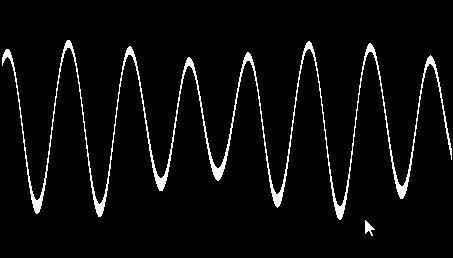

<svg x="16" y="18.5" class="GifPlayer-icon"></svg>


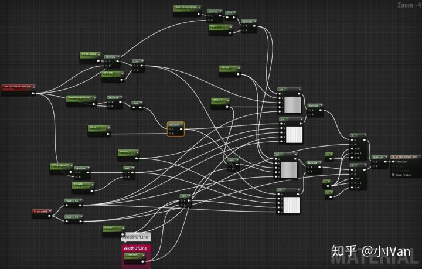

使用  这个简单的公式，把图像画出来


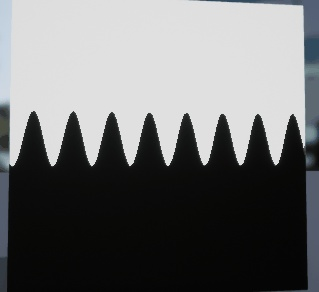

<svg x="16" y="18.5" class="GifPlayer-icon"></svg>

然后重复一次相减即可得到一条细线。然后再重叠第二个波上去，即可得到更有变化的效果。我这里只叠加了两个波，如果还想更丰富还可以继续往上叠。

把自变量x变成整数就可以得到柱状波形


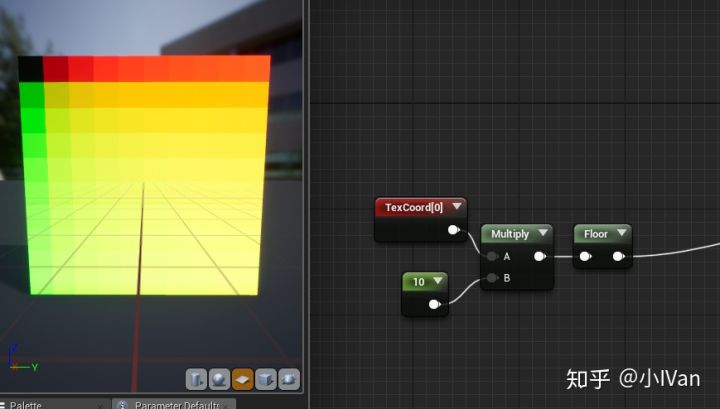


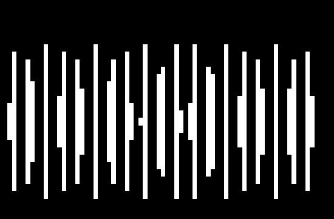

<svg x="16" y="18.5" class="GifPlayer-icon"></svg>


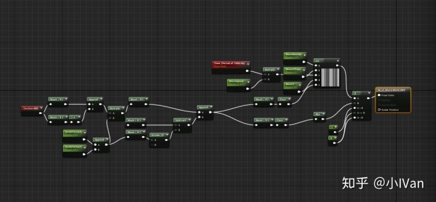

如果不和Y的绝对值比较的话，可以得到一边的效果


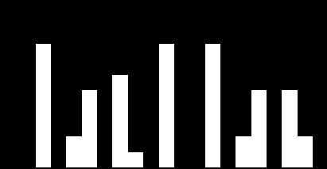

<svg x="16" y="18.5" class="GifPlayer-icon"></svg>

------

## **【2】技能冷却**


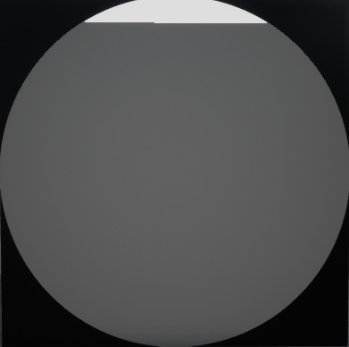

<svg x="16" y="18.5" class="GifPlayer-icon"></svg>


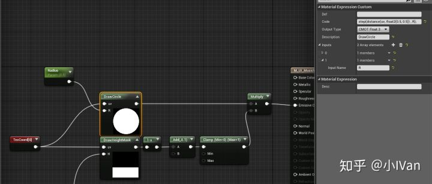

先用代码画个圆然后画冷却线

圆

```text
step(distance(uv, float2(0.5, 0.5)) , R);
```

冷却线

```text
step(H, uv.y );
```

如果想要制作扇形效果，可以使用极坐标的方法，先把UV变换到中心点


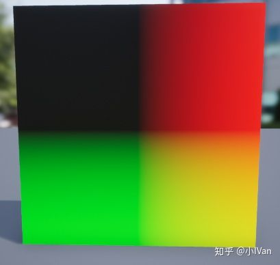

然后用极坐标判断即可


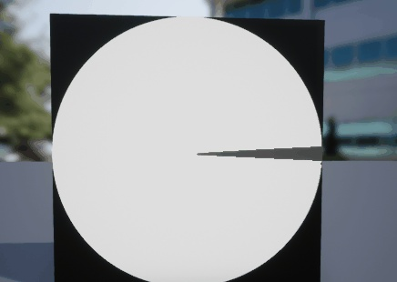

<svg x="16" y="18.5" class="GifPlayer-icon"></svg>

```text
float SkillTime(float2 uv, float R, float Radius)
{
    float2 centeruv = uv - 0.5f;
    float cos = dot(normalize(centeruv), float2(1,0));
    return step(Radius, cos);
}
```

------

## **【3】旋转扭曲**

使用旋转矩阵变换一下就好了，还是非常简单的


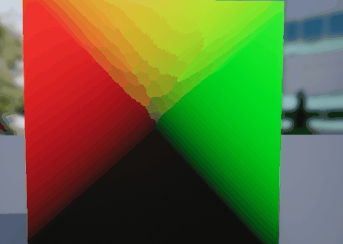

<svg x="16" y="18.5" class="GifPlayer-icon"></svg>

请无视gif压缩产生的马赛克

```text
float2 RotateUV(float2 uv,float2 center, float angle)
{
    float PI = 3.1415927f;
    float Ang = angle * (2.0f * PI/ 360.0f);

    float2 RowX = float2(cos(Ang), -sin(Ang));
    float2 RowY = float2(sin(Ang), cos(Ang));

    float ArgOne = dot(RowX, uv - center);
    float ArgTwo = dot(RowY, uv - center);

    return float2(ArgOne, ArgTwo) + center;
}
```

有了最基础的旋转，就可以在此基础上做些其它效果了


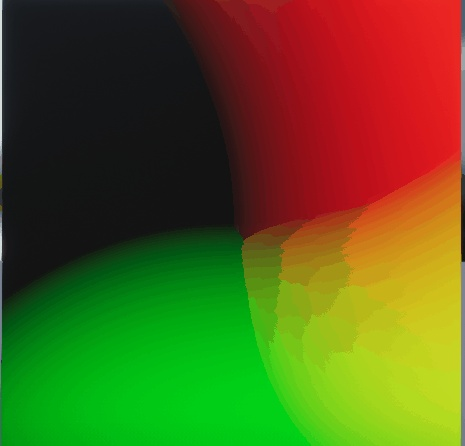

<svg x="16" y="18.5" class="GifPlayer-icon"></svg>

代码如下：

```text
float2 Twirl(float2 uv, float2 centeroffset, float strenth)
{   
    //Transform uv to center
    uv = uv - float2(0.5, 0.5);
    //Offset the uv center
    float2 delta = uv - centeroffset;

    float angle = strenth * length(delta);
    float x = cos(angle) * delta.x - sin(angle) * delta.y;
    float y = sin(angle) * delta.x + cos(angle) * delta.y;

    float RowX = x + centeroffset.x;
    float RowY = y + centeroffset.y;

    return float2(RowX, RowY);
}
```


Enjoy it！
