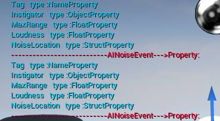
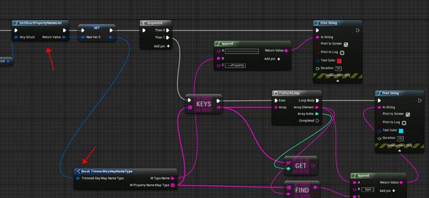
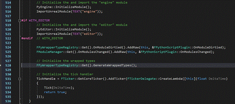
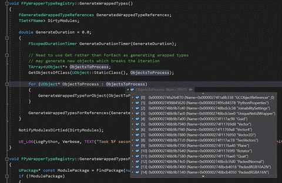
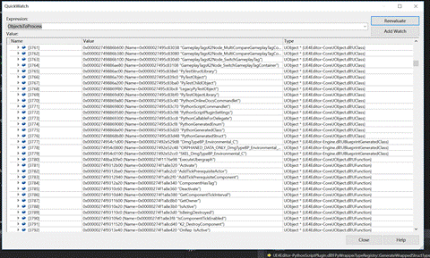

# （原）UnrealObj篇  :  反射获取Struct类型

2019年3月12日

22:46

 

@Author: 白袍小道

转载请说明

 

## 案例一：蓝图传递任意Struct ,导出struct的相关属性

相关：

1、宏：DECLARE_FUNCTION: 此宏用于在自动生成的样板代码中声明thunk函数

2、通配符检查：CustomThunk、CustomStructureParam

3、FFRame (ObjectMacros.h)

 

结果：

 

 

代码：

### 1、说明

其中通过CustomStructureParam和CustomThunk ，Declare_FUN实现通配符检查函数，实现Uproperty传递和检查。

 

| CustomStructureParam | 列出的参数都被视为通配符。这个说明符需要ufunction级别的说明符CustomThunk，它要求用户提供一个自定义的exec函数。在这个函数中，   可以检查参数类型，并根据这些参数类型进行适当的函数调用。   不应该调用基本UFUNCTION，如果有错误，应该断言或记录错误。 |
| -------------------- | ------------------------------------------------------------ |
| DECLARE_FUNCTION     | #define   DECLARE_FUNCTION(func) void func( FFrame& Stack, RESULT_DECL ) |

 

 

 

### 2、继承关系

UObjectBase

​      ----Uproperty

​           ------UFiled

 

### 3、实现

XXX.h

   `USTRUCT(BlueprintType)`   `struct   FTrimmedKeyMapNameType`   `{`   `GENERATED_BODY()`   `public:`   `UPROPERTY(BlueprintReadWrite)`   `FString   mTypeName;`   `UPROPERTY(BlueprintReadWrite)`   `TMap<FString,FString>   mPropertyNameMapType;`   `};`   ` `   `UCLASS(BlueprintType)`   `class   UObjectFunLib : public UBlueprintFunctionLibrary`   `{`   `GENERATED_UCLASS_BODY()`   `public:`   ` `   `UFUNCTION(BlueprintCallable,   CustomThunk,meta=(DisplayName="GetStructPropertyNameList",CustomStructureParam="AnyStruct"),Category   = "DZToolkit|ObjectFunLib|Property")`   `static   FTrimmedKeyMapNameType GetStructPropertyNameList(UProperty* AnyStruct);`   `DECLARE_FUNCTION(execGetStructPropertyNameList)`   `{`   `//Get   properties and pointers from stack (nb, it's reverse order, right to left!)`   `Stack.StepCompiledIn<UStructProperty>(NULL);`   `UStructProperty*   StructProp = ExactCast<UStructProperty>(Stack.MostRecentProperty);`   `void*   StructPtr = Stack.MostRecentPropertyAddress;`   ` `   `P_FINISH;`   ` `   `P_NATIVE_BEGIN;`   `*(FTrimmedKeyMapNameType*)RESULT_PARAM   = UObjectFunLib::NativeGetStructPropertyNameList(StructProp->Struct,   StructPtr,true);`   `P_NATIVE_END;`   `}`   ` `   `static   FTrimmedKeyMapNameType NativeGetStructPropertyNameList(UScriptStruct*   pStruct, void* StructPtr,bool IsBlueprintStruct);`   `static   void SetTrimmedKeyMapForStruct(TSharedPtr<FTrimmedKeyMapNameType>&   InMap, UStruct* pStruct);`   `};`   

 

XXX.CPP

   `FTrimmedKeyMapNameType   UObjectFunLib::NativeGetStructPropertyNameList(UScriptStruct * pStruct, void   * StructPtr, bool IsBlueprintStruct)`   `{`   `TSharedPtr<FTrimmedKeyMapNameType>   vProptyShare = MakeShareable<FTrimmedKeyMapNameType>(new   FTrimmedKeyMapNameType());`   `SetTrimmedKeyMapForStruct(vProptyShare,   pStruct);`   `return   *vProptyShare;`   `}`   ` `   `void   UObjectFunLib::SetTrimmedKeyMapForStruct(TSharedPtr<FTrimmedKeyMapNameType>&   InMap, UStruct * pStruct)`   `{`   `UField*   FieldPtr = pStruct->Children;`   `InMap->mTypeName   = pStruct->GetName();`   `while   (FieldPtr != nullptr)`   `{`   `if   (FieldPtr->GetClass() != nullptr)`   `{`   `InMap->mPropertyNameMapType.Add(FieldPtr->GetName(),   FieldPtr->GetClass()->GetName());`   `}`   `else`   `{`   `InMap->mPropertyNameMapType.Add(FieldPtr->GetName(),"");`   `}`   `/*UStructProperty*   SubStruct = Cast<UStructProperty>(FieldPtr);`   `if   (SubStruct != nullptr)`   `{`   `return;`   `}`   `UArrayProperty*   ArrayProp = Cast<UArrayProperty>(FieldPtr);`   `if   (ArrayProp != nullptr)`   `{`   `return;`   `}`   `UMapProperty*   MapProperty = Cast<UMapProperty>(FieldPtr);`   `if   (MapProperty != nullptr)`   `{`   `return;`   `}*/`   ` `   `FieldPtr   = FieldPtr->Next;`   `}`   `}`   

 

 

 

## UE4的反射系统

http://aicdg.com/ue4-reflection/#%E5%AE%9E%E4%BE%8B---pythonscriptplugin)

**引子**

​       最近有个哥们想要使用 UE 4.20 开始提供的PythonScriptPlugin来编写一些自动化的脚本，想要确认C++代码如何导出给python调用，于是很肤浅的研究了一下蓝图反射的机制。

**反射机制**

​       反射(Reflection)是一种编程语言的能力，可以在运行时识别对象和类的信息(属性，方法，继承关系等)。UE4中大量使用了反射，比如序列化，垃圾回收，蓝图/C++通信。C++没有内置的反射系统，所以UE4自己实现了一套反射系统，被称为 property system。使用特殊的宏标记需要导出的符号，然后使用 Unreal Header Tool (UHT) 在编译时产生运行时所需要的反射信息。

\#include "FileName.generated.h"

​       在include了UHT所需的头文件之后，就可以使用 UENUM(), UCLASS(), USTRUCT(), UFUNCTION(), 和 UPROPERTY() 宏来标记需要生成反射信息的代码。

​       这些宏的含义和用法就不再赘述了。对于 property system 在使用上也有一些限制：他无法表示所有的C++类型(严格来说只有少数模板类型比如 TArray 和 TSubclassOf 受支持，并且不支持嵌套)。

**使用反射信息**

​       大部分情况下UE4开发过程中是不需要和反射打交道的，但是不代表不能用。

​       property system 类型的层级结构如下：

UField
         UStruct
                 UClass (C++ class)
                 UScriptStruct (C++ struct)
                 UFunction (C++ function)

UEnum (C++ enumeration)

UProperty (C++ member variable or function parameter)

(Many subclasses for different types)

**UStruct**是复合结构(比如C++ class, struct, 或者function)的基本类型，比较容易和C++ struct(**UScriptStruct**)弄混。**UClass**可以包含属性和方法，而**UFunction**和**UScriptStruct**只能包含属性。

​       如果想获得C++反射类型的**UClass**或**UScriptStruct**，只要使用UTypeName::StaticClass()或FTypeName::StaticStruct()。如果你有一个UObject的实例，也可以使用Instance->GetClass()来查看实例的类型(UStruct实例不支持此用法)。

​       如果想要查询一个 UStruct 的所有 UProperty ，可以使用 TFieldIterator ：

for (TFieldIterator<UProperty> PropIt(GetClass()); PropIt; ++PropIt)
 {
         UProperty* Property = *PropIt;
         // Do something with the property
 }

TFieldIterator 的模板参数表示要查询的 UField 类型

​       对于Unreal Property System，有篇[官方文章](https://www.unrealengine.com/en-US/blog/unreal-property-system-reflection)有更相信描述，我也不再搬运了。

**实例** **- PythonScriptPlugin**

​       在UE 4.20 版本中，Epic官方提供了此插件，官方说法是可以编写一些editor中使用的自动化脚本，但是又可以看到文档中说明：凡是蓝图中可以调用的python都可以调用。

​       通常情况下，PythonScriptPlugin导出属性和函数，需要使用 PyCFunctionCast 和 PyCStrCast 宏。看插件源码也可以知道，对于数学库和其他python中需要的辅助库，是用这两个宏手写的binding。但是对于所有UObject，没有任何手工的binding，也就是说，python中调用这些UObject是和蓝图一样，使用反射的。

​       为了验证这个猜想，我开始阅读PythonScriptPlugin的源码，然后发现了可疑的地方。

​       稍微调试一下，看到了有趣的东西。

​       ObjectsToProcess长度接近4w，非常可疑，所以查看一下变量。

​       真相大白，ObjectsToProcess保存了蓝图中所以可以调用到的 UClass, UScriptStruct, UPropertyUFunction, 和 UEnum 。之后调用函数 GenerateWrappedTypeForObject 和 GenerateWrappedTypesForReferences 来关联python和C++。这两个函数还是相当复杂的，有兴趣可以自己看一下。

​       上图中 ObjectsToProcess 可以看到，就连 plugin 中的 UClass 也导出了，这是非常理想的情况，意味着之前提到的哥们并不需要手工写C++到python的binding，只要使用导出到蓝图的方法，就可以把代码导出给python使用。

​       但是通过上面的代码也能看到一个疏漏，就是只导出了 ObjectsToProcess 收集到的 UField，如果有些module是运行后再手工启动的，并不能正常调用。对于这些模块，可以在C++中使用

void FPythonScriptPlugin::ImportUnrealModule(const TCHAR* InModuleName)

或在python代码中调用

unreal.load_module(ModuleName)

来让python知晓这些module(当然绝大多数情况都不需要)

 

来自 <<http://aicdg.com/ue4-reflection/>> 
