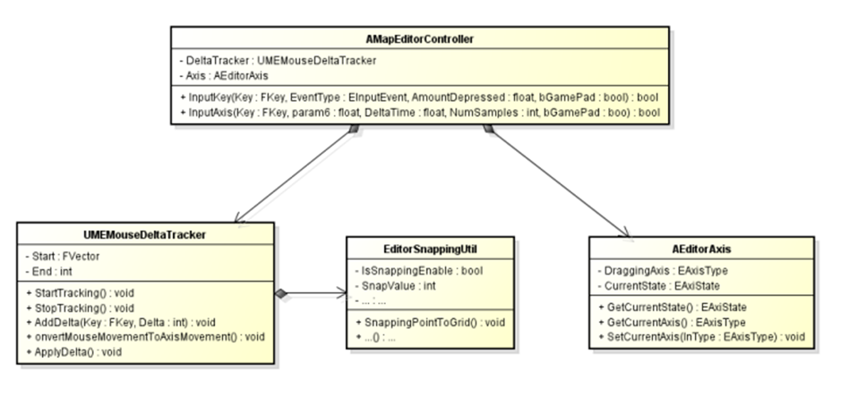
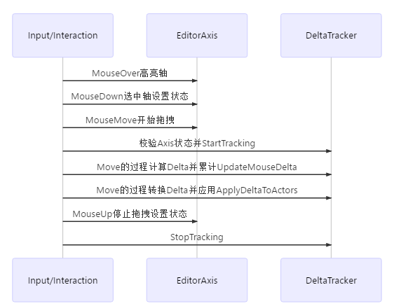
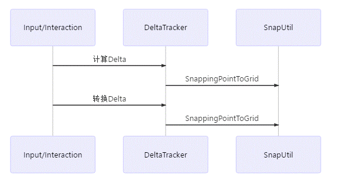
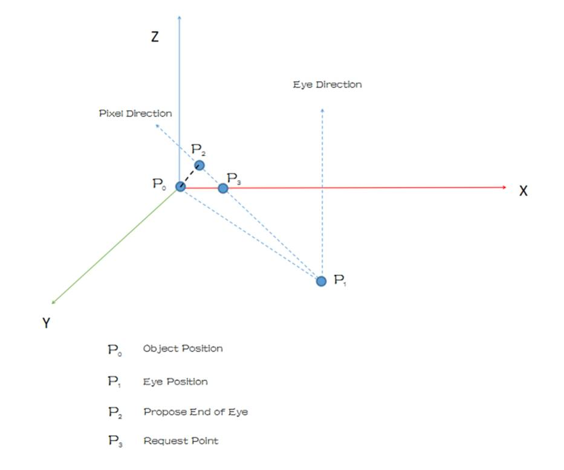

UE4编辑器分析 之 基础交互--DeltaTracke

2019年2月7日

1:11

 

EditorAxis & MouseDeltaTracker&SnappingUtils

负责物件坐标变换的交互和实现，实现物件的平移、旋转、缩放等

类图：

·         EditorAxis负责交互状态的保存和转换，同时提供拖动的交互入口。物件执行变换后，会调整EditorAxis的跟随状态；保持一直跟随物件。

·         MouseDeltaTracker有三个作用：用来记录鼠标拖拽的时候积累的delta值，然后把delta值转换成坐标变换的delta translation，最后应用到物件上。

·         拖动坐标轴移动物体 时序图：

·         SnappingUtil负责吸附功能的数据归一，过程发生在DeltaTracker进行计算累计Delta的阶段， 使拖拽的更精准的控制歩幅。时序图如下：

·         附UED中针对拖拽控制移动的delta转换算法，示意图如下：

确定拖拽平面及其法线；

确定相机位置，方向作为EyeDirection；

在相机的ViewMatrix和ProjectionMatrix中做Deproject，获取鼠标点的位置，方向作为PixelDirection；

图P0点为开始拖拽前的物体位置，P1为摄像机的位置

如果PixelDirection与拖拽平面的法线点乘的绝对值小于特定数（可看作两向量垂直，此时pixel方向约等于正在拖动的坐标轴的方向），不满足 拖拽要求。

满足要求的情况下下会先计算P2：向量P1P2方向与Pixel相同，大小与P1P0相同，得出P2点作为ProposedEyeEndPoint

计算P1P2与拖拽平面的交点记为P3，P3可看作新的物体位置，但计算时会先在刚刚StartTracking的时候求出P0P3，作为初始的相对位置InitialOffSet；

在拖动的过程中P3的位置不断更新，而InitialOffSet不会改变就可以求出DeltaDrag

 

来自 <[*https://zhuanlan.zhihu.com/p/24274611*](https://zhuanlan.zhihu.com/p/24274611)> 

 
