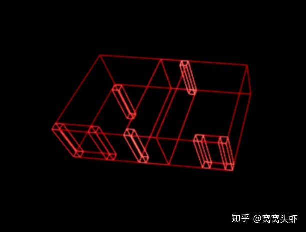
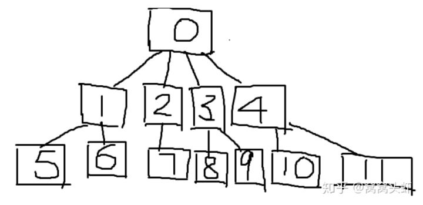

# UE4的HISM深入探究

 我们都知道UE4有个刷植被地表物体的功能，也就是所谓的 **InstanceFoliage** 如果仔细看过文档的应该还知道，目前UE4有两种实现Foliage的方法，一种是**InstanceStaticMeshComponent**，另一种是**HierarchicalInstancedStaticMeshComponent。**经验丰富的美术或者TA会知道 HISM可以支持不同LOD不同的消失距离，但是如果你想继续了解，这个原理是啥？怎么实现的？对性能有什么影响？怎么调参数？抱歉，你找不到相关的文档。。

UE4做功能的逻辑就是这样，"什么？ 没文档，源码自己看去啊！"，行吧。。。那就深入探索下 这个HISM干了啥，怎么优化，毕竟也不过是几个几千行的cpp嘛，嗯。。。

总的来说：HISM就是UE4造出来用树状的数据结构管理场景中Instance  数据的一种树状数据结构体。  毕竟HISM主要是拿来做植被，几千个instance的管理，高效率的剔除还是挺重要的，从数据结构的组织形式上来看，HISM和kdtree有类似之处，都是在xyz三个轴中选择能尽量均分数据点（instance的物体的坐标）的分割平面。不过一般来说KDtree是二分构造结点，HISM的树型结构可以选择branching  factor而且默认是16.猜测这样的设计应该是为了应对植被海量的instance，节省每帧剔除计算的时间。

有了树型的数据结构，就可以大幅的加速遮挡剔除和距离剔除的执行效率，每个树型节点有包含的instance数据和boundingbox数据，在做距离剔除的时候，直接计算camera到节点的距离，在做遮挡剔除的时候，直接画这个节点的boundingbox，就可以很快的得到剔除后要画的instance数据，被剔除的节点数据不会发送到gpu。

拿一个七个instance的HISM来当例子：

在UE4Editor->Visualize->Advanced中打开HISM  Clustertree 或者HISM Occlusion  Bounds，就可以看到UE4是怎么组织HISM的数据的，通过调试代码，可以看到真正的树型结构是长得像下面这样的：

请无视灵魂画图

可见UE4一共生成了11个节点，在HISM的树中，每个节点叫**FClusterNode**，除了BoundingBox信息外，**FClusterNode**并不以数组等形式保存子节点或者instance数据，节点只保存当前节点的First和last   instance序号还有first和last的子节点编号，这么做的原因是因为HISM在绘制的时候如果有剔除结果的变化的时候，不会去重组instancebuffer。所以只能修改DrawIndexedInstanced的StartIndex和EndIndex来实现动态的绘制。所以在构建时每个节点里面的instance序号都是连续的。

除了绘制之外，并不是每一层的节点都会参与到剔除里面，UE4会根据一系列参数计算确定每层节点是否参与剔除，比如在这个七个instance的例子中，只有第二层节点会参与到遮挡剔除中。

在每帧的绘制中，UE4的渲染器都会在Visibility的计算过程中调用**FHierarchicalStaticMeshSceneProxy::GetDynamicMeshElements**  根据剔除的结果算出需要扔到GPU的节点，结合上面已经了解的信息，可以看出来平衡剔除的粒度和剔除的效果，是个很复杂的事情，HISM虽然是静态场景，但是每帧都要更新，如果数据结构太复杂，或者剔除的粒度太细（比如每个instance都画一个box去剔除），那么每帧用在更新数据上的时间对于CPU来说也是很大的负担，另外，粒度太细，instance减少dc的作用就没了，极端情况下，每个instance一个节点的话，效率和不做instance直接绘制是一样的。反之，如果剔除粒度太粗，那么GPU压力就会迅速上升，因为大部分的东西剔除不掉。

基于这些需求，UE4制定了一大堆参数来确定构造出来的树的形状，和剔除的粒度，这些参数大部分都在foliage参数列表里，属于全局参数，整个游戏唯一，但是每个HISM的component，实际上是都有自己的参数的，所以如果你的游戏需要根据不同地图优化的话，很抱歉又得修改源代码把相应的参数暴露出来。

下面是几个主要的参数：

MinInstancePerOcclusionQuery：最小的一次occlusionquery一起查询的instance数目，会影响最后build出树的结构。

MaxOcclusionQueriesPerComponent：最大的每个HISMcomponent 执行query的DrawCall 数目，这个可以控制你的游戏用在剔除的DrawCall数量的上限。

Min Verts toSPlit：分割节点的顶点数，这只是一个建议值，ue4默认是1024，也就是只有大于1024个顶点，才会继续向下分割节点构造树。

InternalBranchingFactor：分支因子，一般最小肯定是2，不过如果是1可以认为是强行按照每个instance剔除。

**总结：**

HISM虽然号称是通用的instance解决方案，但是通过上面的分析可以看出来，实际上它只适合做植被，森林这类场景，如果是室内或者建筑需要instance的方案的话，HISM并不适合，因为你的场景可能只有几十个instance，为此构建一个数据结构并且还要做各种参数调整实际上是不划算的。UE4也是看到了这个问题，所以4.22中终于加入动态合并instance的功能（终于赶上Unity了！）。