# 译：Unreal渲染一帧详解（Unreal Frame Breakdown）

## 译者前言：

上一篇文章，我补充翻译了”How Unreal renders 1 Frame?”的[第三篇](https://zhuanlan.zhihu.com/p/118971518)，在找资料过程中，又发现了一篇挺好的文章，同样是基于”How Unreal renders 1 Frame?”来进行了更进一步的尝试和分析，觉得可以把这篇文章也翻译一下，从而方便更多的读者。

这篇文章的优势主要是给出了一些更细致的GIF贴图，一一种动态的方式来让大家更好地来理解整个渲染过程。当然，在一些理论知识上的介绍，比原有的博文介绍的比较简单，大家最好对照着来看。毕竟两个场景是比较类似的。

原文链接：

[Unreal Frame Breakdown](https://link.zhihu.com/?target=http%3A//viclw17.github.io/2019/06/20/unreal-frame-breakdown-part-1/)[viclw17.github.io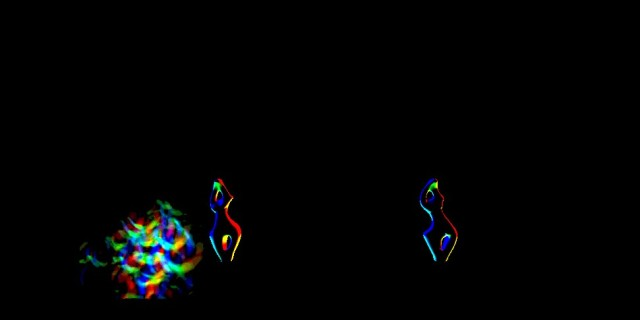](https://link.zhihu.com/?target=http%3A//viclw17.github.io/2019/06/20/unreal-frame-breakdown-part-1/)

作者：Victor Li，似乎是个华人，这是在他的技术BLog上发表的。

\-----------------------------------------------------------------------------------------------

## 原文

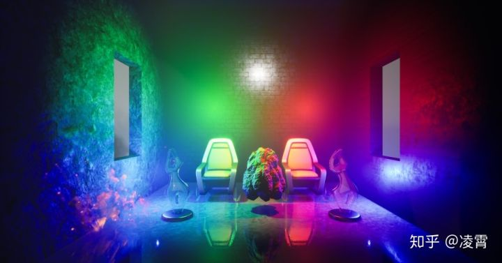

这个是我自己版本的[“How Unreal Render One Frame?”](https://link.zhihu.com/?target=https%3A//interplayoflight.wordpress.com/2017/10/25/how-unreal-renders-a-frame/)，我试着按照这篇博文来profile一帧来学习延迟渲染的整个过程。

我按照这篇blog来构建了一个测试的场景。首先将Unreal设置为”延迟渲染“，如果设置为”forward  rendering“的话，整个渲染过程会有非常大的差异，后面我也会来介绍一下这个渲染管线。在我的测试例子中，umap被命名为NewWorld。它包含以下内容：

1. 1个方向灯，从左上到右下
2. 1静态光，白色
3. 2个固定灯，均为蓝色
4. 2个移动灯，一绿一红
5. 标记为可移动的岩石网格
6. 其余所有网格都是静态的
7. 所有带有阴影的网格
8. 1个火粒子系统
9. 体积照明
10. 天空盒

## 1、Particle PreRender

在GPU上进行粒子模拟（只有GPU Sprites Particle类型的粒子）。因为我们在粒子系统中有两个GPU粒子发射器，所以，粒子模拟的pass有了两个Draw Call。

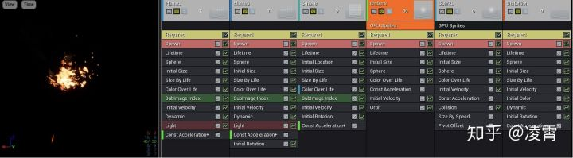

```text
 EID  | Event                                              | Draw # | Duration (Microseconds)
      |   - GPUParticles_PreRender                         | 2      | 36.864
      |    \- GPUParticles_SimulateAndClear                | 2      | 23.552
      |      \- ParticleSimulationCommands                 | 2      | 23.552
      |        \- ParticleSimulation                       | 2      | 23.552
115   |          \- DrawIndexed(48)                        | 2      | 23.552
121   |           - API Calls                              | 3      | 0.00
      |     - ParticleSimulation                           | 4      | 13.312
138   |      \- DrawIndexed(48)                            | 4      | 13.312
144   |       - API Calls                                  | 5      | 0.00
148   |     - API Calls                                    | 6      | 0.00
```

这个Pass会输出下面**2个Render Target（RT）：**

1、RT0: 粒子的位置信息

2、RT1：粒子的速度信息

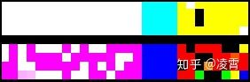

## 2、PrePass

PrePass获取所有不透明的（例如，使用opaque或masked的材质）mesh，并输出 **Depth Z pass**（Z-prepass）。 **DBuffer**需要其结果，也就是“ Forced by DBuffer”，这个过程也可以通过启动**Forward Shading**来启动。 pre-pass也可以被用于遮挡剔除来使用。

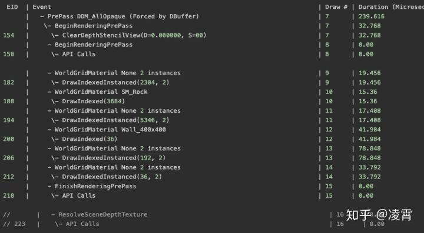



请注意，椅子/雕塑/窗户墙/地板+天花板都是成对的，因此它们被渲染为每一对“ 2个实例”，每对仅引起1个Draw Call。 这是实例化的一种证明，它可以通过节省调用次数来进行优化。

还要注意一个有趣的细节-此过程对所有Mesh使用**WorldGridMaterial材质**（引擎默认材质）来进行渲染。

## **3、ComputeLightGrid\***

> 这个功能会优化Forward Shading中的光照处理。 根据unreal源代码中的注释，这个pass“将本地灯光（点光源和聚光灯光源）裁剪后，存储在视锥空间中的网格中。 使用“表面照明模式（Surface Lighting Mode）”来处理Forward Shading或半透明”。  换句话说：它将光分配给网格中的单元（沿摄像机视图而形成金字塔形状网格）。  此操作有一定的成本，但会在以后获得回报，从而更快地确定哪些灯光会影响哪些网格。 参考信息：[Source](https://link.zhihu.com/?target=https%3A//unrealartoptimization.github.io/book/profiling/passes/)

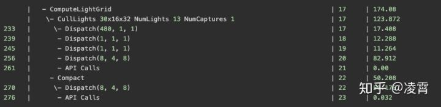

## **4、BeginOcclusionTests**

术语“遮挡剔除”是指一种方法，如果对象被其他对象遮挡，则通过从渲染管线中消除对象来尝试减少图形系统上的渲染负载。 有几种方法可以做到这一点。

1. 启动遮挡查询。
2. 关闭对帧和深度缓冲区的写入，并禁用任何多余的状态。 因此，现代图形硬件能够以更高的速度光栅化（NVIDIA 2004）。
3. 针对复杂对象，只渲染一个简单但保守的近似值（通常是一个**bounding box**：GPU计算实际上已经通过深度测试的Fragment总数）；
4. 终止遮挡查询。
5. 询问查询结果（即近似几何图形的可见像素数）。
6. 如果计算出来需要绘制的像素数大于某个阈值（通常为零），则需要渲染原本比较复杂的对象。

[Chapter 6. Hardware Occlusion Queries Made Useful](https://link.zhihu.com/?target=https%3A//developer.nvidia.com/gpugems/gpugems2/part-i-geometric-complexity/chapter-6-hardware-occlusion-queries-made-useful)[developer.nvidia.com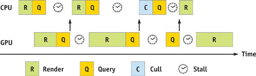](https://link.zhihu.com/?target=https%3A//developer.nvidia.com/gpugems/gpugems2/part-i-geometric-complexity/chapter-6-hardware-occlusion-queries-made-useful)

该Pass起步于2个**ShadowFrustumQueries**，然后是1个**GroupedQueries**，最后是一个**IndividualQueries**。

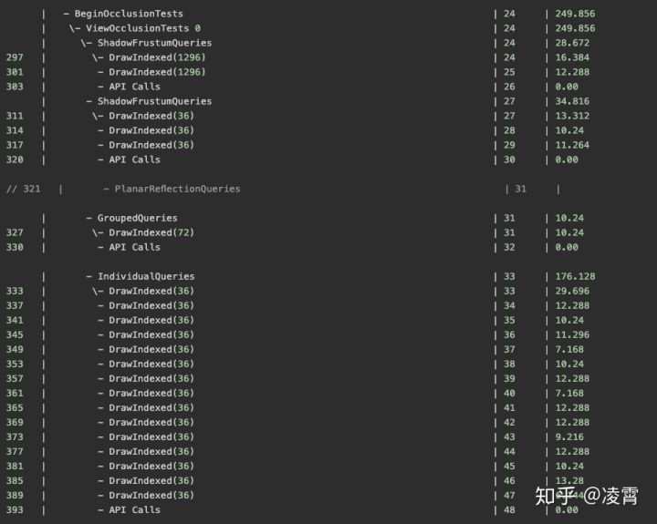

### **4.1、ShadowFrustumQueries**

第一组2个ShadowFrustumQueries用于2个可移动点光源，因此，Frustum是一个球体。第二组3个ShadowFrustumQueries用于2个固定点光源和1个方向光（1个static light是通过烘焙贴图生成），对于这些情况，视锥是截顶的金字塔（请注意，定向光的视锥非常长）。


### **4.2、GroupedQueries**

这是用于遮挡的对象。在我的场景中，墙后面的桌子网格被完全遮挡，因此在此步骤中显示出来。

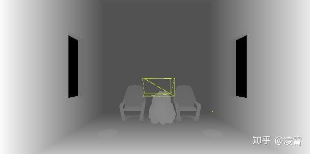

### **4.3、IndividualQueries**

这适用于所有其他对象，并且注意遮挡测试在边界框上完成。

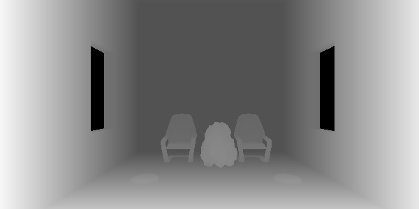


## **5、BuildHZB**

此步骤将生成Hierarchical Z缓冲区。这将Z-prepass过程中产生的深度缓冲区用作输入，并创建深度的mipmap chain（即，对其进行连续降采样）。

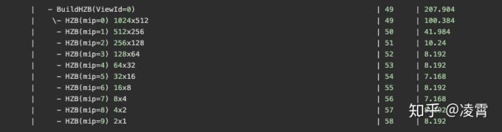

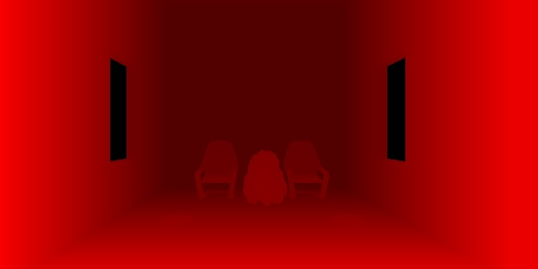


## **6、ShadowDepths**

此步骤**仅适用于可移动对象，**因为应实时计算其阴影情况。所有静态对象阴影都应预先烘焙以节省性能。在这种情况下，对Rock网格进行以下所有计算，因为它被标记为可移动对象。大家可以从下图中看到，对于Rock，它与所有的Light来进行阴影的计算。

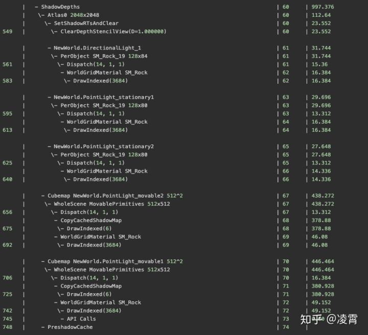

对于1个定向灯和2个固定灯，阴影深度将写入Atlas0。一个光源对应一个阴影深度图。


2个可移动灯的处理方式不同。他们正在使用立方体贴图来记录阴影深度。对于每盏灯，首先，CopyCachedShadowMap输出没有可移动对象的立方体贴图。

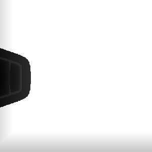


然后，Unreal将可移动对象的阴影深度再添加到立方体贴图中。

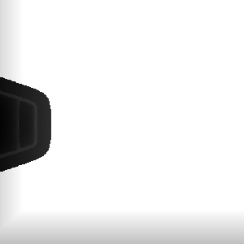


## **7、Volumetric Fog\***

[参考资料](https://link.zhihu.com/?target=https%3A//docs.unrealengine.com/en-US/Engine/Rendering/LightingAndShadows/VolumetricFog/index.html)[docs.unrealengine.com](https://link.zhihu.com/?target=https%3A//docs.unrealengine.com/en-US/Engine/Rendering/LightingAndShadows/VolumetricFog/index.html)

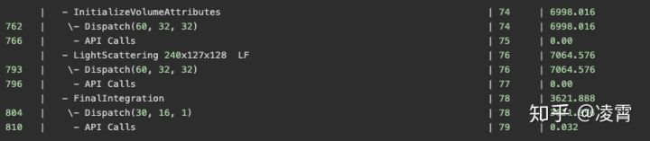

### **7.1、初始化Volume属性\***

此Pass计算雾参数并将其（散射和吸收）存储到Volume纹理中，还将全局emissive值（Global Emissive Value）存储到第二个Volume纹理中。

请注意，在测试场景中，我放置了1 **AtmosphereFog**和1 **ExponentialHeightFog**。它们是不同的实体，在此过程中已计算出ExponentialHeightFog。AtmosphereFog更像是天空盒（或用于IBL的立方体贴图），稍后将在Atmosphere Pass处理。

### **7.2、光散射\***

该Pass计算在上面的ComputeLightGrid遍历期间分配给光照体积纹理的阴影方向光，Sky light和Local  light的每个单元的光散射和消光。它还使用历史缓冲区（本身是3D纹理）在计算着色器输出（光散射，消光）上使用时间抗锯齿，可改善每个网格单元的散射光质量。

### **7.3、最终整合\***

此过程仅在Z维度上对3D纹理进行raymarch，并累积散射的光和透射率，并将结果存储到相应的单元格中。

## 8、BasePass

这是渲染不透明**材料**，读取**静态光**并将其保存到G缓冲区的主要步骤。如我们所见，在渲染之前，已清除了GBuffer中的6个渲染目标。

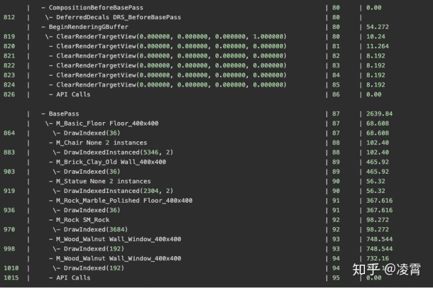

这些对象上用于最终渲染的**actual materials**：M_Basic_Floor，M_Chair，M_Brick_Clay_Old，M_Statue，M_Rock_Marble_Polished，M_Rock，M_Wood_Walnut，M_Wood_Walnut。**结果，此过程受着色器复杂性的影响很大。**还要注意，这个pass中，每个drawcall是基于每种材质的，而不是像Z-prepass中那样是基于Mesh的实例。因此，在渲染优化的过程中，请注意Mesh上的**材质插槽数量**。

不同G缓冲区渲染目标的示例：材质基础颜色/法线/材质属性/烘焙的照明。

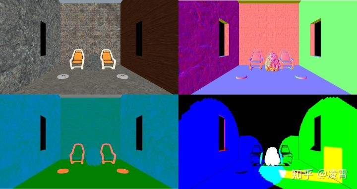

注意，大多数时候，缓冲器的不同通道具有不同的编码信息。我们可以从以下引擎代码中查看详细信息`DeferredShadingCommon.ush`：

```cpp
/** Populates OutGBufferA, B and C */
void EncodeGBuffer(...)
{
    ...
	OutGBufferA.rgb = EncodeNormal( GBuffer.WorldNormal );
	OutGBufferA.a = GBuffer.PerObjectGBufferData;

	OutGBufferB.r = GBuffer.Metallic;
	OutGBufferB.g = GBuffer.Specular;
	OutGBufferB.b = GBuffer.Roughness;
	OutGBufferB.a = EncodeShadingModelIdAndSelectiveOutputMask(GBuffer.ShadingModelID, GBuffer.SelectiveOutputMask);

	OutGBufferC.rgb = EncodeBaseColor( GBuffer.BaseColor );
	OutGBufferC.a = GBuffer.GBufferAO;

	OutGBufferD = GBuffer.CustomData;
	OutGBufferE = GBuffer.PrecomputedShadowFactors;
    ...
}
```

## **9、Velocity**

保存每个顶点的速度（稍后用于运动模糊和时间抗锯齿）。

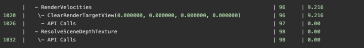

## 10、AO

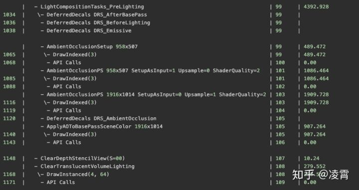

在此Pass中，LightCompositionTasks_PreLighting主要计算AmbientOcclusion。首先输出低分辨率AO，然后输出高分辨率AO，最后将结果应用于场景颜色。

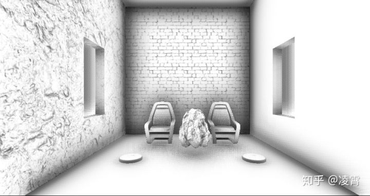

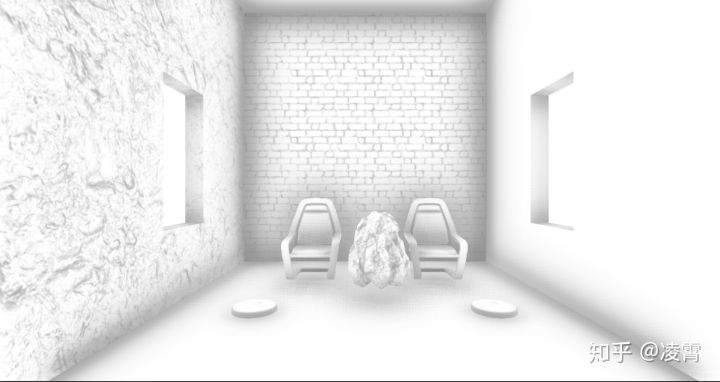

## 11、Lighting

终于到了处理光照的部分了，在这个pass中，unreal将计算Lighting信息，并将其应用到场景中。

### 11.1、**Non Shadowed Lights**

首先，Pass将处理**NonShadowedLights**。非阴影光包括：

1. 简单的灯光，例如**每个粒子照明**，以及
2. 不产生阴影的正常场景灯。

两者之间的区别在于，普通场景灯光在渲染时会使用**depth bounds test**，以避免对Light bound之外的像素进行光照处理。

在**StandardDeferredSimpleLights中**，每个DrawIndexed用于每个粒子光。如我们所见，它们是按每个粒子处理的，非常昂贵。因此，应该尽量避免使用过多的粒子照明。

Lighting被计算到到SceneColourDeferred缓冲区中。

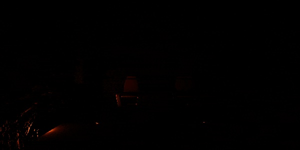


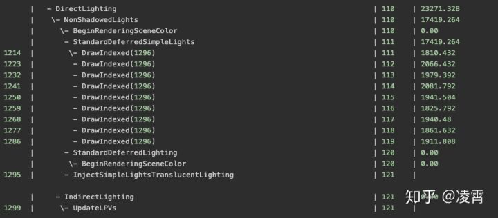

### 11.2 **Shadowed Lights**

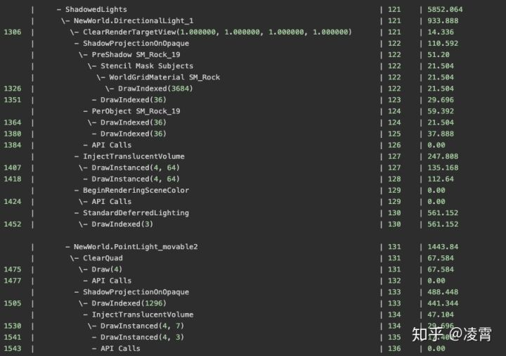

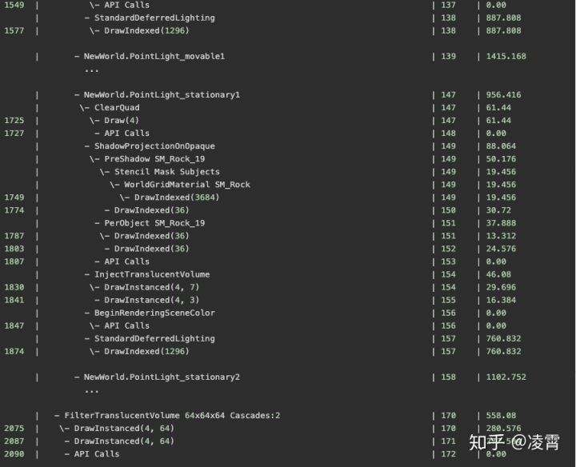

### **11.3、Inject Translucent Volume**

虚幻技术对半透明表面进行照明的方法包括将光注入2个体积纹理中。这两个纹理存储到达每个体积单元（纹理TranslucentVolumeX）的光（阴影+衰减）的**球谐函数表示**以及每个光源的近似光方向（纹理TranslucentVolumeDirX）。

渲染器维护两组这样的纹理，**一组用于靠近**需要更高分辨率照明**的相机道具**，**另一组用于更远距离的对象**，而高分辨率照明并不那么重要。

请注意，从之前的NonShadowedLights传递来看，似乎简单的灯光似乎根本没有写入半透明的灯光体积，因此**InjectSimpleLightsTranslucentLighting**为空。

### **11.3、Shadowed Lights**

此遍历是在每个灯光上完成的-1个方向光、2个固定光和2个可移动光，因为它们都是投射阴影的。对于每盏灯，都需要执行以下步骤：

1. ShadowProjectionOnOpaque - 不透明阴影投影
2. InjectTranslucentVolume - 注入半透明体积
3. StandardDeferredLighting - 标准延迟照明

作为最后一步，在**FilterTranslucentVolume**中过滤（对于两个级联）半透明照明体积（translucency lighting volumes），以在处理半透明道具/效果的照明效果时，抑制锯齿效果。

## 12、Reflection

在这个阶段，Unreal计算并应用反射效果。ScreenSpaceReflections使用Hi-Z缓冲区来加快光线行进相交的计算-针对较粗糙表面就使用更低mip的贴图，针对更光滑的表面则使用高mip的贴图从而实现更好的反射效果。

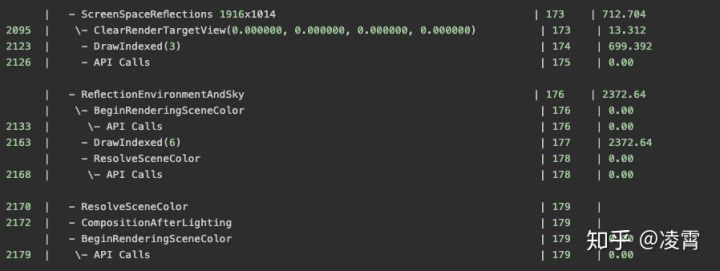

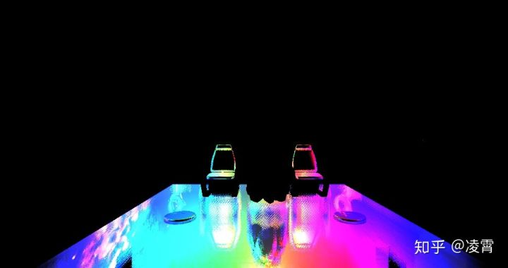

然后ReflectionEnvironmentAndSky将环境反射捕获考虑在内。环境反射探针是在游戏启动期间生成的，它们仅捕获静态几何体。每个探测器将捕获的反射存储在mipmapped立方体贴图中。

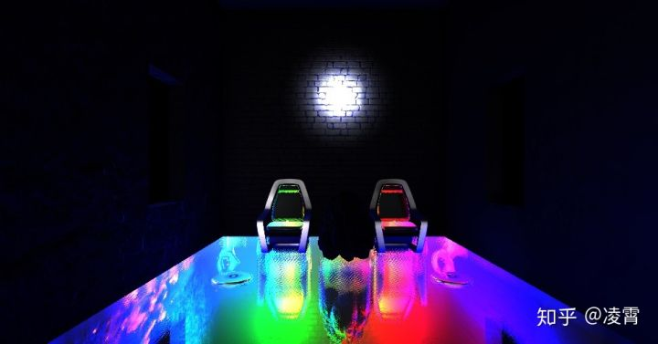

## 13、**Atmosphere and Fog**

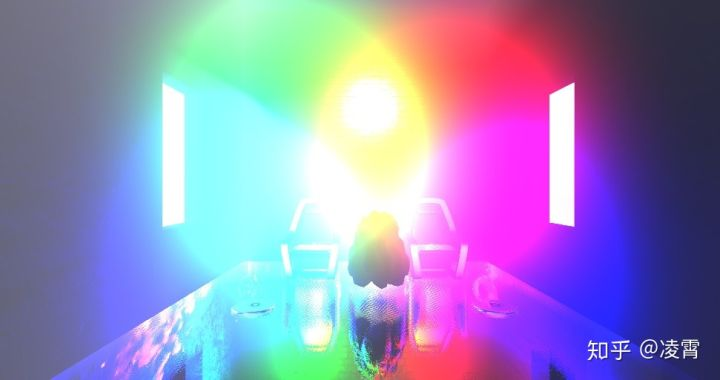

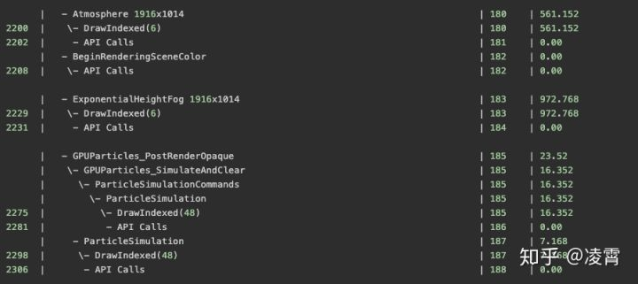

请注意，这里还有另一个粒子传递GPUParticles_PostRenderOpaque。

## **14、Translucency**

从这里开始，引擎最终开始处理半透明的物体（在我的案例中是2个雕塑和火的粒子效果）。

透明道具会受到**局部和定向光，环境反射，雾气等的影响**。默认情况下，渲染器使用高质量的着色器进行渲染透明道具。这个过程中会采样下面这些信息：

1. 大气模拟预先计算的纹理，
2. 烘焙的光照贴图数据，
3. 半透明照明体积，其中包含来自方向照明和
4. 局部的灯光信息和
5. 反射探针立方体贴图，并使用它们来计算照明。

（译者注：原文中似乎不太对，我按照我的理解修改了一下。）

在此阶段，需要大量以前的渲染数据来进行半透明渲染，这就是为什么半透明昂贵的原因。

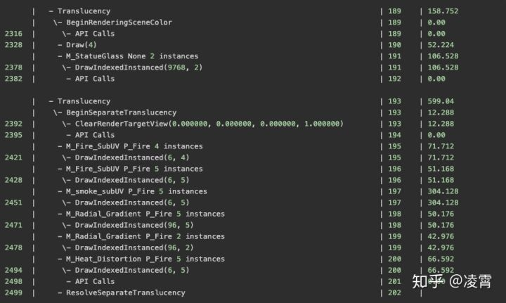

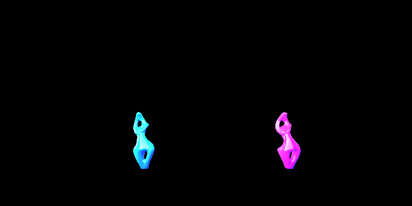


## **15、Distortion-失真**

再次渲染透明道具和粒子（设置为折射），以写出具有**失真矢量**的全分辨率缓冲区，该**失真矢量**随后将用于计算折射。模板缓冲区在此过程中也处于活动状态，以标记需要折射的像素。

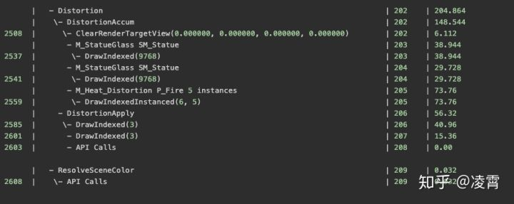

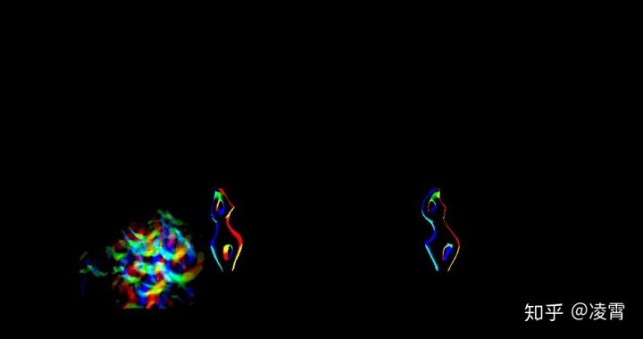

## 16、**PostProcessing**

在此阶段，渲染器将时间抗锯齿，运动模糊，自动曝光计算，光晕和色调映射等应用于主要渲染目标。

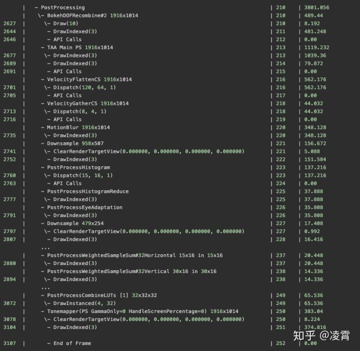

## 17、Wrap Up

在文章《[如何虚幻渲染一帧》之后，](https://link.zhihu.com/?target=https%3A//interplayoflight.wordpress.com/2017/10/25/how-unreal-renders-a-frame/)我建立了自己的场景，并使用RenderDoc捕获了该帧，只是试图修改结果以供将来参考。我将继续回到这里，以添加有关渲染管道的更多见解