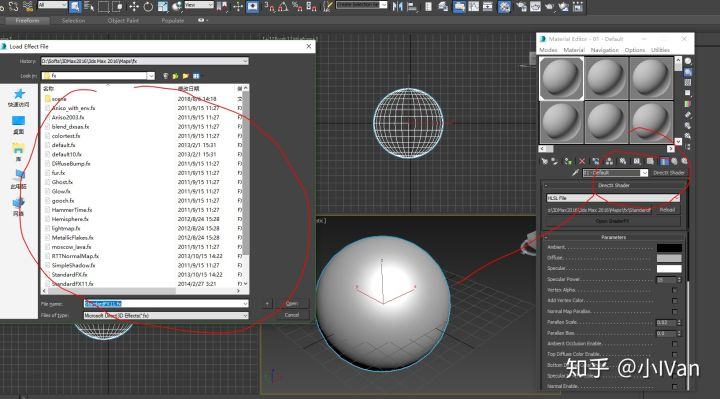
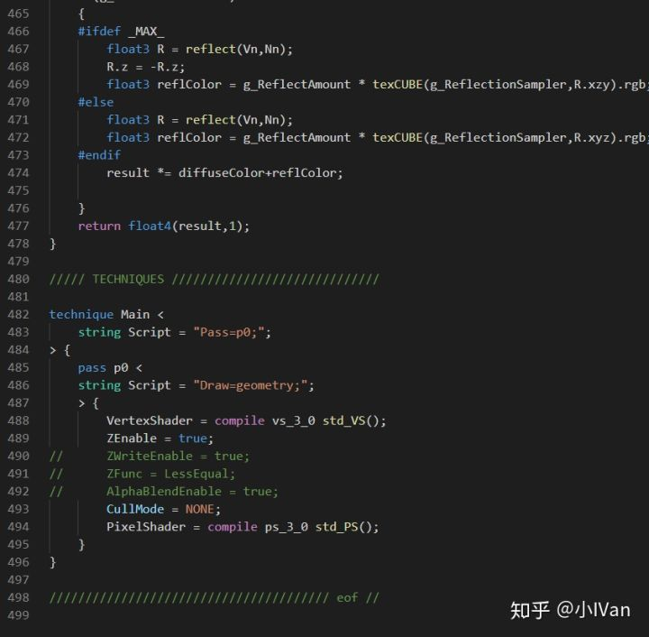
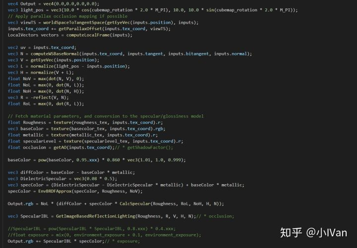
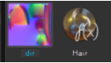
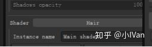
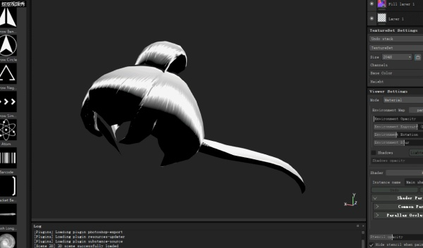
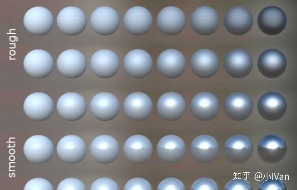
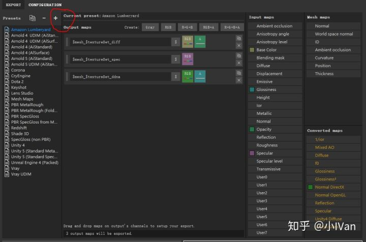
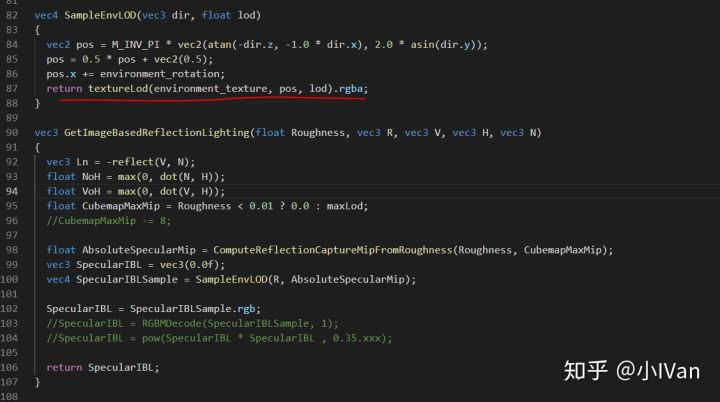
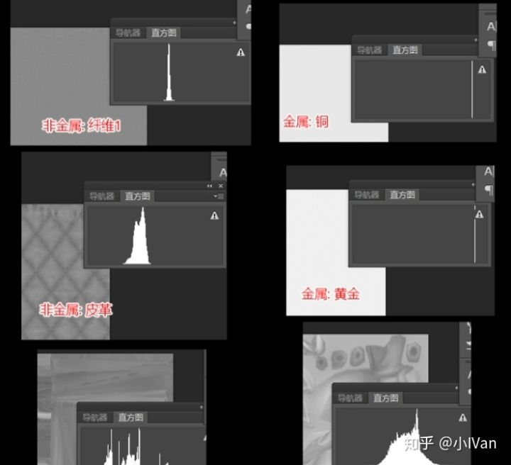

# 虚幻4渲染编程（Pipeline篇）【第一卷：PBR  Production  Pipeline】


## **简介：**

当技术这边完成理论推导和研发后，需要为其配备一整套完整的落地方案，并且这套方案的成熟度，完善度和开发效率直接决定了产品的最后品质和公司的生产成本。随着游戏品质的门槛逐步提高，项目中的生产管线会越来越多，越来越复杂。或者原本不需要制作管线的东西会变得急切地需要一套可行的管线方案才能达到需求品质所对应的要求。Production  pipeline篇将会总结捋顺项目中遇到的各种Production  pipeline，如PBRShading，角色，大世界，风格化，环境的昼夜变换四季变换等等。

------

## **Prepare PBR Shading for Production pipeline**

本篇将会详细讨论标准PBR的生产管线搭建问题。在搭建PBR制作管线之前，当然是需要先有一套底层Shading逻辑。通常由引擎程序完成，TA也会参与一部分。主要是渲染模块的搭建和维护，ShadingModel的建模和实现。我前面有几篇关于理论推导和Shading  Model的实现。

[小IVan：虚幻4渲染编程（重写渲染管线篇）【第一卷：从零开始推导PBR渲染模型---上】](https://zhuanlan.zhihu.com/p/46618943)

如果是使用商业引擎的话，渲染模块的搭建这一步已经是由商业引擎团队搭建好了的，Unreal甚至内置了多种ShadingModel，灯光，后期等，一整套解决方案。如果使用商业引擎想要做品质区分或者提升优化的话，还是需要走一遍管线搭建的流程，只不过工作量大大减少，是在商业引擎原有的基础上作改造。

在一整套渲染管线准备好之后，我们有了ShadingModel，灯光，后期和各种优化手段后，下一步就是搭建美术资源生产管线，来为我们的PBR渲染管线制作渲染资源。

------

## **Two concepts of producing PBR Assets**

目前有两种可行的资源生产Pipline思路。

第一种是耦合式的，一种是解耦式的。现在（2018/12/22）国内的所有PBR项目都在使用耦合式的生产流程。这两种方式各有优劣，下面就来详细分析这两种。


**（1）耦合式：**

耦合式的“耦合”主要式指美术生产的资源和引擎的渲染资源是耦合的，换句话说就是美术制作的模型，贴图将“直接”被用于渲染。到这里时第一反应是——这不是理所当然的吗！但其实这会带来一些列问题。

缺点：

**[1]**美术在制作时候受到极大限制，无法发挥到他们的极限。因为他们总是要考虑到布      线，UV，最终制作的游戏能不能跑得起来，压缩后贴图会不会糊等等。为什么他们需要考虑这些呢，因为他们制作的资源和渲染管线是耦合的，他们制作的资源将“直接”被用于渲染。这也就是Artist们总喜欢做图形程序所谓的trick的东西到美术资源上的原因之一。比如在BaseColor上画阴影之类的。因为在种种限制下，渲染的效果达不到Artist的要求。

**[2]**所见不是所得，即DCC工具中的效果就是导入引擎的效果。在耦合式的管线中这是非常致命的。渲染管线只是搭建在引擎里的，外部的DCC工具，如Max，Maya，ZB等渲染环境和引擎是不同的。最近的SP和SD这些DCC工具和引擎对接倒是比较好，所以在SP和SD里能勉强做到所见即所得，画一笔浅绿色下去，贴图导入引擎，**基本**和SP或者SD的保持一致。所以想要耦合式的资源生产Pipline能Work下去，打通DCC和引擎很重要。

**[3]**各种压缩编码打包等因素会使资源面目全非。

**[4]**辛辛苦苦几十年，一夜回到解放前。比如几年前还在使用法线+高光渲染管线的时候（参考剑灵），美术花费了大量时间制作各种材质，资源，贴图。但是一到PBR世代这些资源全报废了！全报废了！全报废了！Artist积攒的大量和那套流程相关的美术经验全报废了！报废了！报废了！重要的事情说三遍。或者一个周期比较长的项目，第一年立项的时候使用的方案还是比较领先的，当到第二年发现同期的几款竞争关系的项目使用了更先进的渲染技术，这时候就陷入了两难，推掉之前所有资源全部重新做吗，这样之前做的就浪费掉了，钱也花了。但是硬着头皮继续做下去，等到上线和别人竞争的时候发现品质上已经落后了。


为了解决上述缺点（第四点实在没办法解决，只能叫美术重新学吧），主要是要做两件事情，第一是美术规范，第二是工具流的打通，效果的统一。

优点：

**[1]**Artist所见即所得，并且美术功力能直接反应到最后的游戏成品里去。

**[2]**大家一直都是使用这种方式。现有的大多数DCC工具都是使用这种方法，所以有大量现成的工具可供使用。


**（2）解耦式：**

所谓的解耦式就是和耦合式相反，Artist制作出来的资源和渲染没有直接关系。模型，贴图全部都不会直接用到引擎里。Artist在一个非常高规格的工具中制作各种效果，模型面数可以很高（当然也要制作完整一套LOD），贴图精度可以很高，渲染使用光线追踪，并且烘焙出一整套完整的贴图，如法线，漫反射，粗糙度金属度，或者粗糙度可以通过（极高模）生成。制作好这套资源后，使用编码器根据需求把数据抽取编码出来然后导入引擎。可以通过通过改变编码设置轻松改变导入到引擎里的贴图的精度，模型面数的高低。可以根据不同的渲染解决方案抽取出所需要的渲染数据。比如PBR抽取粗糙度，金属度，AO等信息。高光+法线（剑灵）那种渲染方案则抽取高光等信息即可。

缺点：

​      **[1]**需要一个强大的技术团队来支撑。

​      **[2]**烧钱。

​      **[3]**可使用的目前的主流工具少，或者需要对这些工具进行改造。

​      **[4]**还不够成熟（部分流程还没跑通）。

优点：

​      **[1]**Artist所受到的限制极少，可以最大程度发挥。

​      **[2]**Artist不需要在引擎和DCC之前反复来回切换调整。甚至都不需要考虑模型在引擎里的命名。

​      **[3]**可以调整渲染策略。艺术设计方向甚至都有有调整空间，同时美术资源不受影响，改一下输出设置就好了。同时渲染资源的规格可以最大程度控制，资源的品质也可以有效掌控。

------

## **Practice of coupled production pipeline**

在引擎渲染管线搭建完毕，经过各种测试，验证完毕后就需要落实到具体的量产制作了。

下面就来实际实现耦合式PBR资源生产管线，以Standard PBR Shading Model为例。

**【1】解决工具流的问题**

制作肯定就需要工具，目前比较好的方案是选用Max/Maya+ZB+SP+SD。因为已经在引擎里把渲染管线搭好了，所以PBR的公式也已经定下来了。下一步就是让max，sp和引擎的渲染环境一致。

**首先是max：**




可以在max里使用HLSLMaterial来把引擎里使用的PBR计算同步。




Max中写Shader还是比较简单的。可以使用fx来写，如果有dx经验的话会感到非常亲切。这里先罗列出max的同步方法，具体注意事项可以参考下面sp的。

**其次是SubstancePainter：**

创建个文本文件然后把后缀改名为glsl

把引擎的渲染管线的代码翻译成glsl敲入这个文件，以Unreal的Forward管线为例




把这个glsl文件如同资源一样导入SubstancePainter了。




导入后把写好的shader拖到SubstancePainter的Shader选择上即可生效，这里我拿各向异性高光的同步效果做个示范。







<svg x="16" y="18.5" class="GifPlayer-icon"></svg>

在同步过程中主要是引擎合软件的环境不同，会对同步操作进行阻碍。为了消除这些阻碍需要在这个过程中注意一些事情。

第一就是关闭sp和引擎的全部后处理，包括bloom等各种除对模型渲染以外的所有计算。


引擎的后处理计算在引擎里关闭掉就可以了。

然后还需要同步HDR到LDR的ACES曲线，这点引擎和sp是肯定不一样的，可以在sp的shader里通过各种公式矫正一下，制作质阵列球如下图所示。




把粗糙度和光滑度在横纵坐标依次排开。然后把这个阵列球分别导入到sp和引擎里，附上PBR材质后校对ACES曲线。

同时还需要值得注意的是SP里sample的贴图全部是线性空间的，Diffuse是伽马空间的。把这些颜色空间，ACES曲线等全部校准之后，还有个问题就是SP的Cubmnap的重要性采样和Unreal的不同。Unreal是通过预积分的方式，SP是通过暴力采样64次，不过他们的目的是一样的，但是还是会有差异。




然后在sp里自定义出一套导出规则即可。对于Unreal需要注意的是，如果导出类似RMA这种合成图，或者NR之类的合成图，它们的编码压缩也需要对应修改。举个简单的例子，如果把Rouphness放到法线的B通道会带来三个问题，第一个是使用这种合成图的时候需要自己deco一下，第二个是引擎自带的mipmap生成算法是不支持这种合成图的，所以还需要改mipmap生成算法，第三个问题是打包压缩的时候如果使用某些类型的压缩算法，第三个通道的信息频率和前两个通道的差异过大，会导致值发生跳变。

关于SP的Cubemap，为了让采样方式和引擎一致，可以使用自己的采样函数。sp里的cube采样使用的是经纬度展开的方式，而不是使用SampleCubeMap。




```text
//- Allegorithmic Metal/Rough PBR shader
//- ====================================
//-
//- Import from libraries.
import lib-pbr.glsl
import lib-pom.glsl
import lib-normal.glsl
import lib-env.glsl
import lib-vectors.glsl

//- Declare the iray mdl material to use with this shader.
//: metadata {
//:   "mdl":"mdl::alg::materials::UnrealPBRShader::UnrealPBRShader"
//: }

//- Channels needed for metal/rough workflow are bound here.
//: param auto channel_basecolor
uniform sampler2D basecolor_tex;
//: param auto channel_roughness
uniform sampler2D roughness_tex;
//: param auto channel_metallic
uniform sampler2D metallic_tex;
//: param auto channel_specularlevel
uniform sampler2D specularlevel_tex;
//: param auto environment_rotation
uniform float cubemap_rotation;

vec3 EnvBRDFApprox( vec3 SpecularColor, float Roughness, float NoV )
{
	// [ Lazarov 2013, "Getting More Physical in Call of Duty: Black Ops II" ]
	// Adaptation to fit our G term.
	const vec4 c0 = vec4( -1, -0.0275, -0.572, 0.022 );
	const vec4 c1 = vec4( 1, 0.0425, 1.04, -0.04 );
	vec4 r = Roughness * c0 + c1;
	float a004 = min( r.x * r.x, exp2( -9.28 * NoV ) ) * r.x + r.y;
	vec2 AB = vec2( -1.04, 1.04 ) * a004 + r.zw;

	// Anything less than 2% is physically impossible and is instead considered to be shadowing
	// Note: this is needed for the 'specular' show flag to work, since it uses a SpecularColor of 0
	AB.y *= clamp( 50.0 * SpecularColor.g, 0, 1 );

	return SpecularColor * AB.x + AB.y;
}

#define MEDIUMP_FLT_MAX    65504.0
#define MEDIUMP_FLT_MIN    0.00006103515625
#define saturateMediump(x) min(x, MEDIUMP_FLT_MAX)


float GGX_Mobile(float Roughness, float NoH, vec3 H, vec3 N)
{
  vec3 NxH = cross(N, H);
	float OneMinusNoHSqr = dot(NxH, NxH);
  float a = Roughness * Roughness;
  float n = NoH * a;
	float p = a / (OneMinusNoHSqr + n * n);
	float d = p * p;
	return saturateMediump(d);
}

float CalcSpecular(float Roughness, float RoL, float NoH, vec3 H, vec3 N)
{
  return (Roughness * 0.25 + 0.25) * GGX_Mobile(Roughness, NoH, H, N);
}

#define REFLECTION_CAPTURE_ROUGHEST_MIP 1
#define REFLECTION_CAPTURE_ROUGHNESS_MIP_SCALE 1.2
float ComputeReflectionCaptureMipFromRoughness(float Roughness, float CubemapMaxMip)
{
	// Heuristic that maps roughness to mip level
	// This is done in a way such that a certain mip level will always have the same roughness, regardless of how many mips are in the texture
	// Using more mips in the cubemap just allows sharper reflections to be supported
	float LevelFrom1x1 = REFLECTION_CAPTURE_ROUGHEST_MIP - REFLECTION_CAPTURE_ROUGHNESS_MIP_SCALE * log2(Roughness);
	return CubemapMaxMip - 1 - LevelFrom1x1;
}

vec3 RGBMDecode( vec4 rgbm, float MaxValue )
{
	return rgbm.rgb * (rgbm.r * MaxValue + rgbm.g * MaxValue + rgbm.b * MaxValue) / 3;
}

vec4 SampleEnvLOD(vec3 dir, float lod)
{
  vec2 pos = M_INV_PI * vec2(atan(-dir.z, -1.0 * dir.x), 2.0 * asin(dir.y));
  pos = 0.5 * pos + vec2(0.5);
  pos.x += environment_rotation;
  return textureLod(environment_texture, pos, lod).rgba;
}

vec3 GetImageBasedReflectionLighting(float Roughness, vec3 R, vec3 V, vec3 H, vec3 N)
{
  vec3 Ln = -reflect(V, N);
  float NoH = max(0, dot(N, H));
  float VoH = max(0, dot(V, H));
  float CubemapMaxMip = Roughness < 0.01 ? 0.0 : maxLod;
  //CubemapMaxMip -= 8;

  float AbsoluteSpecularMip = ComputeReflectionCaptureMipFromRoughness(Roughness, CubemapMaxMip);
  vec3 SpecularIBL = vec3(0.0f);
	vec4 SpecularIBLSample = SampleEnvLOD(R, AbsoluteSpecularMip);

  SpecularIBL = SpecularIBLSample.rgb;
  //SpecularIBL = RGBMDecode(SpecularIBLSample, 1);
  //SpecularIBL = pow(SpecularIBL * SpecularIBL , 0.35.xxx);
 
  return SpecularIBL;
}

//- Shader entry point.
vec4 shade(V2F inputs)
{

  vec4 Output = vec4(0.0,0.0,0.0,0.0);
  vec3 light_pos = vec3(10.0 * cos(cubemap_rotation * 2.0 * M_PI), 10.0, 10.0 * sin(cubemap_rotation * 2.0 * M_PI));
  // Apply parallax occlusion mapping if possible
  vec3 viewTS = worldSpaceToTangentSpace(getEyeVec(inputs.position), inputs);
  inputs.tex_coord += getParallaxOffset(inputs.tex_coord, viewTS);
  LocalVectors vectors = computeLocalFrame(inputs);

  vec2 uv = inputs.tex_coord;
  vec3 N = computeWSBaseNormal(inputs.tex_coord, inputs.tangent, inputs.bitangent, inputs.normal);
  vec3 V = getEyeVec(inputs.position);
  vec3 L = normalize(light_pos - inputs.position);
  vec3 H = normalize(V + L);
  float NoV = max(dot(N, V), 0);
  float NoL = max(0, dot(N, L));
  float NoH = max(0, dot(N, H));
  vec3 R = -reflect(V, N);
  float RoL = max(0, dot(R, L));

  // Fetch material parameters, and conversion to the specular/glossiness model
  float Roughness = texture(roughness_tex, inputs.tex_coord).r;
  vec3 baseColor = texture(basecolor_tex, inputs.tex_coord).rgb;
  float metallic = texture(metallic_tex, inputs.tex_coord).r;
  float specularLevel = texture(specularlevel_tex, inputs.tex_coord).r;
  float occlusion = getAO(inputs.tex_coord);// * getShadowFactor();

  baseColor = pow(baseColor, 0.95.xxx) * 0.860 * vec3(1.01, 1.0, 0.999);

  vec3 diffColor = baseColor - baseColor * metallic;
  vec3 DielectricSpecular = vec3(0.08 * 0.5);
  vec3 specColor = (DielectricSpecular - DielectricSpecular * metallic) + baseColor * metallic;
  specColor = EnvBRDFApprox(specColor, Roughness, NoV);

  Output.rgb = NoL * (diffColor + specColor * CalcSpecular(Roughness, RoL, NoH, H, N));

  vec3 SpecularIBL = GetImageBasedReflectionLighting(Roughness, R, V, H, N);// * occlusion;

  //SpecularIBL = pow(SpecularIBL * SpecularIBL, 0.8.xxx) * 0.4.xxx;
  //float exposure = mix(0, environment_exposure + 0.1, environment_exposure);
  Output.rgb += SpecularIBL * specColor;// * exposure;

  //Output.rgb = (SampleEnvLOD(R, 0).rgb);
  //Output.rgb = SpecularIBL;
  //Output.rgb = specColor;
  //Output.rgb = baseColor;
  //Output = pow(Output, 0.89.xxxx);
  //Output.rgb = NoL * (diffColor + specColor * CalcSpecular(Roughness, RoL, NoH, H, N));

  //Output = pow(Output, 2.2.xxxx);

  return Output;
  // Feed parameters for a physically based BRDF integration
  //return pbrComputeBRDF(inputs, diffColor, specColor, glossiness, occlusion);
}

//- Entry point of the shadow pass.
void shadeShadow(V2F inputs)
{
}
```

其实做到这里就会发现，耦合式的生成流程简直举步维艰。如果想在SP里同步SSS效果或者钻石效果，除非拿到SP的源码，不然很多东西没法做。SP内置的ACES各种算法也没暴露出来，完全只能靠引擎和SP的材质阵列球反复对比，加入各种误差纠正的算法。

目前大多数手游项目种，法线贴图使用的是一种复合贴图，RG存Normal的XY，B通道存Rouphness或者AO，我建议是存Rouphness，使用之前只需要Unpack一下法线贴图即可

```text
float3 TexNorm = tex2D(_BumpMap, i.uv);
float2 NormalXY = TexNorm.rg;
half Rouphness= TexNorm.b;
NormalXY = NormalXY * 2 - 1.0;
float NormalZ = sqrt( saturate( 1.0f - dot( NormalXY, NormalXY ) ) );
TexNorm = float3(NormalXY.xy, NormalZ);
```


**【2】解决生产规范的问题**

因为耦合式的Pipline所生产的美术资源和渲染管线式耦合的，所以资源的质量直接影响最后的效果，游戏运行的效率等，为了规避这些问题，只能通过制定各种美术规范来强行约束美术制作的各种“不合理”的行为。

BaseColor一般储存为sRGB，线性空间中的颜色值。线性空间和gama空间的关系必须要搞清楚。一般颜色的计算这些都是线性空间下的。在制作PBR材质的时候，Basecolor的亮度很有讲究。非金属的基本上应该服从正态分布，然后金属集中在240左右附近。




可以把PS的图像模式改成LAB模式，然后窗口打开直方图来检测BaseColor的制作是否合法。BaseColor一般应该是一致的，没有过亮或过暗的，BaseColor应该只包含纯颜色信息不应该有光影信息。颜色代表了非金属材料的反射率，除了遮挡外，应该没有光照信息，黑色值不应该低于30sRGB或50sRGB，亮度值不应高于240sRGB。法线贴图烘焙的时候主要是注意坐标空间，左右手坐标系。杜绝手动PS这些操作。除非你有特异功能可以人眼光线追踪。金属度和光滑度这一点上需要特别注意，因为PBR模型其实是拟合的（也可以说是带有一定trick的）。所以其实并无法表现所有零到一各个数值的完美效果，我们只能取其中一小段来使用会比较完美。这个取值范围会根据不同的PBR模型不同的环境而变化。具体值需要自己实验。

最后需要注意贴图能存储的最大有效信息，和频率密度。因为需要考虑压缩因素，如果制作的贴图频率过高，则会导致贴图压缩后出现大量马赛克。需要把一个模型上的各种细节信息合理分配开，充分利用BaseColor，Normal，Rouphness，Metallic，AO贴图的储存空间，不要把细节信息全画在Normal或者BaseColor里，AO和Rouphness是平涂的，这是相当浪费并且不合理的，如果有人拿美术设计如此之类的理由来搪塞，那他一定是怕麻烦。

------

以上便仅仅是“标准PBR光照模型所对应的美术资源的耦合式生产管线”的实现。

Enjoy it！
