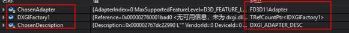

# (原）Unreal渲染篇-DX11部分-RHI构建1

2019年4月2日

13:35

@author：

------小道引擎工程：DZRenderEngine--------------

--------GITHUB：-------------------------------

--------主要目的：对渲染做研究，包含DX，HLSL, Light, Desire 。。。Etc------

 

 

# 一、DX模块

## 1、FD3D11DynamicRHIModule

编辑器情况引擎启动后，RHIInit会 利用LoadModuleChecked<T>获得不同的RHI。

代码位于WindowsDynamicRHI。

   FModuleManager::LoadModuleChecked<IDynamicRHIModule>（""）   

 

 

## 2、构成适配器及其相关描述

FD3D11Adapter

 

| FD3D11Adapter CurrentAdapter(AdapterIndex,   ActualFeatureLevel); |
| ------------------------------------------------------------ |
| 构建代码位于FD3D11DynamicRHIModule：：FindAdapter            |

 

   DXGI_ADAPTER_DESC   

 

   DXGIFactory1->EnumAdapters(ChosenAdapter.AdapterIndex,   TempAdapter.GetInitReference());   

 

 

 

## 3、创建RHI

这里主要通过特征级，

   DynamicRHI = DynamicRHIModule->CreateRHI(RequestedFeatureLevel);   

 

## 4、FD3D11DynamicRHI

### 4.1 FD3D11DynamicRHI 继承了FDynamicRHI 和 IRHICommandContext

其中FDynamicRHI作为RHI的主要实现，包含了下面一些重要的方法

（这里看到了我们的老朋友） 

| RHICreateSamplerState       | 采样状态       |      |
| --------------------------- | -------------- | ---- |
| RHICreateRasterizerState    | 光栅化状态     |      |
| RHICreateDepthStencilState  | 深度模板状态   |      |
| RHICreateBlendState         | 混合状态       |      |
| RHICreateVertexDeclaration  | 顶点缓冲区描述 |      |
| RHICreatePixelShader        | 像素着色器     |      |
| RHICreateVertexShader       | 顶点着色器     |      |
| RHICreateShaderResourceView | 着色器资源     |      |
| RHICreateTexture2D          | RHI纹理        |      |

然后注意一个RHICreateBoundShaderState,这个常常包含了许多着色器，

也是渲染流程中经常获取和使用的。

 

 

### 4.2 FD3D11DynamicRHI 提供了DX资源相关的方法

 
