# 虚幻4渲染编程（光线追踪篇）【第二卷：一天入门光线追踪】


我的专栏目录：

小IVan：专题概述及目录

zhuanlan.zhihu.com

光线追踪和光栅比起来有很多天生优势，实时光线追踪也是游戏未来发展的大方向。这一节将会实现“Ray  Tracing in a Weekend”的内容，不过与“Ray Tracing in a  Weekend”不同的是，我们将会在虚幻4中实现它，并且使用GPU来加速计算。

在开始本系列之前，如果没有光线追踪基础建议先阅读Ray Tracing in a weekend，Two Weekend 和last life

Ray Tracing in One Weekend (Ray Tracing Minibooks Book 1) eBook: Peter Shirley: Kindle Store

www.amazon.com

这三本书。

------

## **【1】在Unreal中使用GPU做光线追踪的环境搭建**

我们还是使用插件的形式来搭建我们的代码，虚幻的插件和unity的有本质不同，虚幻的插件其实是一个新的模块。

我们新建一个名为RayTracing的插件，然后在插件里新建一个RayTracing.usf和一个RayRender.h，一个RayRender.cpp


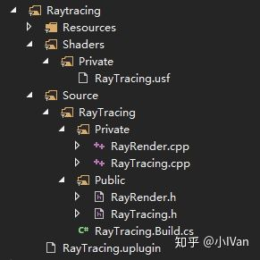

对RayTracing.build.cs做如下修改


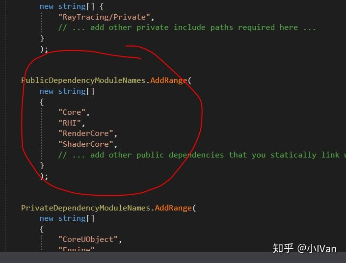

对RayTracing.uplugin做如下修改：


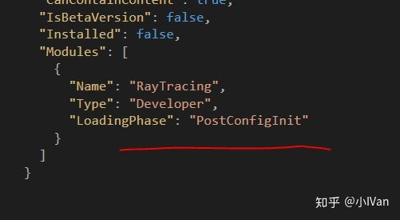

然后在RayRender.h文件中，敲入如下代码


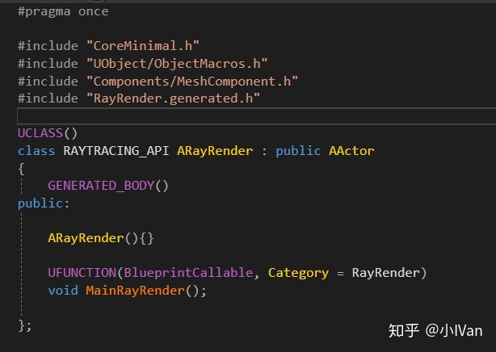

在RayRender.cpp中实现MainRayRender


然后在RayTracing.usf中敲入如下代码


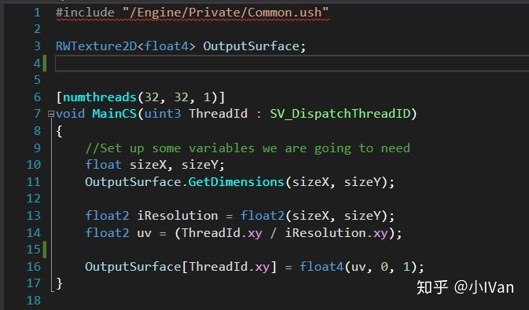

然后新建一个场景，做一个BP派生自RayRender


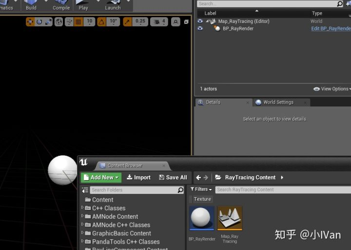

然后把它拖进去，在BP_RayRender中做如下设置


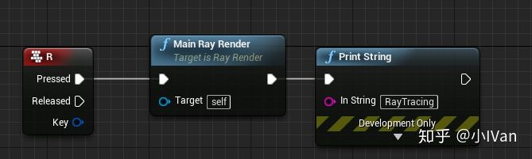

OK现在完成了最基本的环境搭建。

------

## **【2】加入ComputeShader**

在RayRender.cpp中我们要建一个ComputeShader。这个CS将负责RayTracing的大部分计算。代码如下：


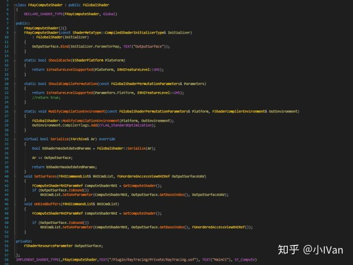

------

## **【3】使用ComputeShader来输出计算结果**

在MainRayRender函数前面我们增加一个函数


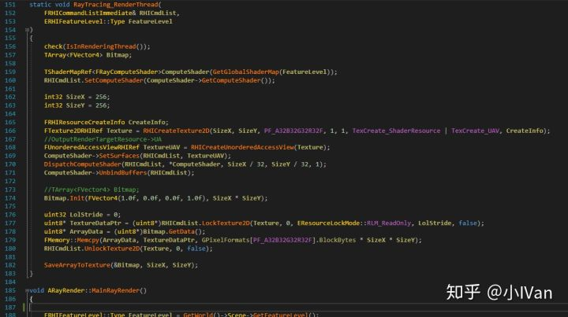

这个函数负责被逻辑线程的MainRayRender函数调用，然后它负责在渲染线程控制CS，在这个函数的末尾有个SaveArrayToTexture函数，我们需要在RayTracing_RenderThread前实现它。如下图所示：


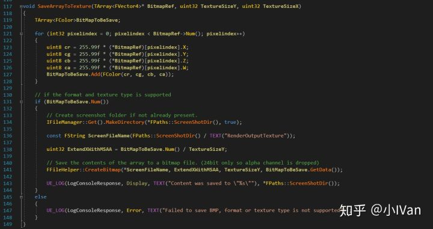

最后是我们的MainRayRender函数的实现。


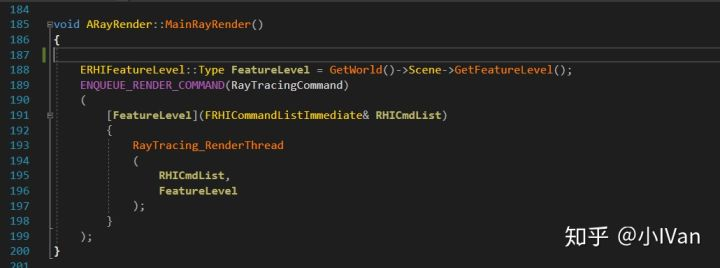

然后在编辑器启动游戏点下R键之后，你将会在项目的Save目录下看到CS计算的结果


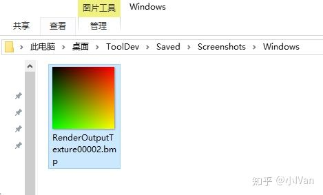

------

## **【4】在ComputeShader中加入RayTracing的逻辑完成天空的绘制**

使用CS的时候需要注意的是，uv的v方向是向下的


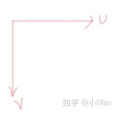

再改一下输出图片的分辨率（为了好看）

然后我们继续在RayTracing.usf敲入如下代码：


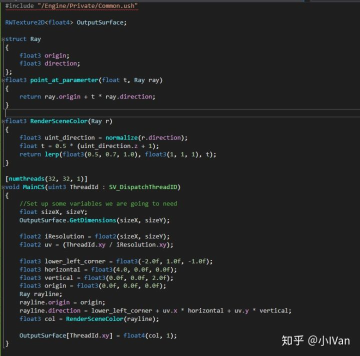

首先我们定义了一个光线的结构体，并且为这个结构体配套了一个point_at_paramerter的函数。然后定义了一个渲染场景的函数，最后在MainCS里定义了我们的摄像机。


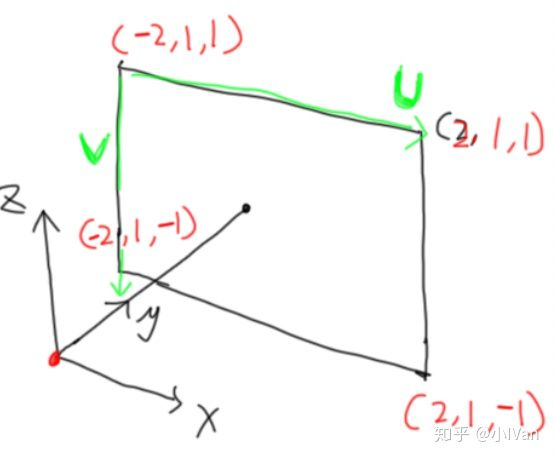

在编辑器中运行点R键，你将会在项目的Save目录的ScreenShot里找到输出结果


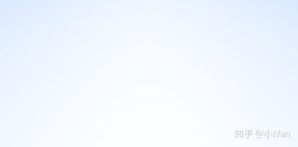

------

## **【5】向RayTracing中加入一个球体**

我们先来使用数学方法建一个球体要判断光线是否与球相交，只需要判断射线方程和球面方程是否有交点即可


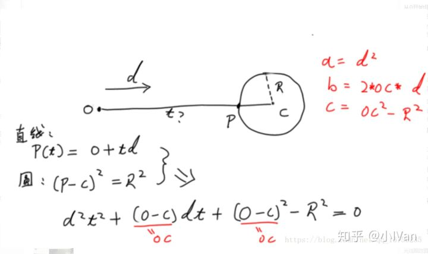

（电脑上写的字巨丑，见谅）

所以我们定义一个hit_sphere函数如下


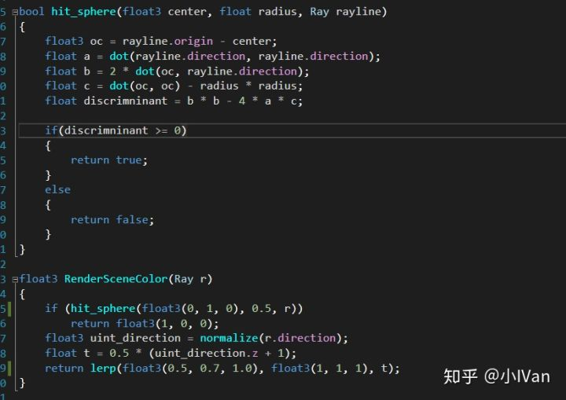

我们的RenderSceneColor也要做相应变化，如果光线打到了球面上，则绘制红色。然后我们就可以得到如下的图：


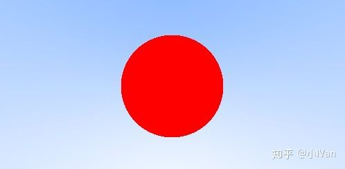

------

## **【6】计算表面法线**

因为表面是球形的，所以法线就是球星到光线和表面的相交点方向的向量


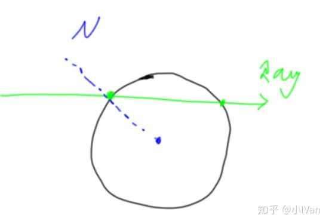


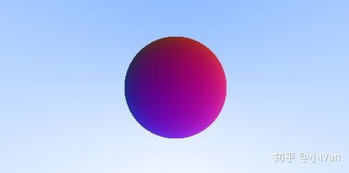


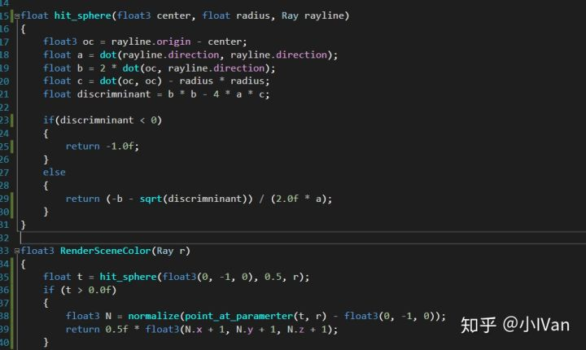

------

## **【7】多物体计算**


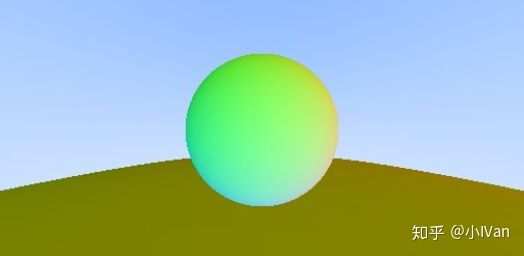

如果想得到一个场景肯定不可能只绘制一个东西，这时候我们需要绘制多个物体。这时候我们就需要在Shader里维护一个绘制列表。同时为了更方便绘制，我把摄像机的坐标系重新调整了一下。


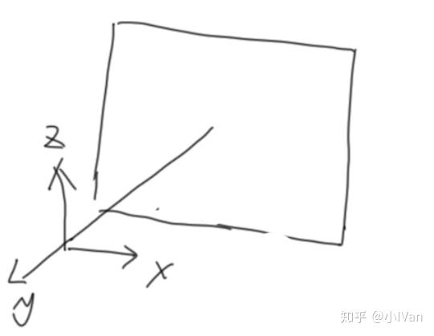

先定义一个结构体用来储存光追的结果


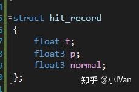

然后定义物体结构体和物体绘制列表结构

```abap
struct hitable_Sphere
{
    float3 center;
    float radius;
	void InitHitableObject(float3 centerlocation, float radiusvalue)
    {
        center = centerlocation;
        radius = radiusvalue;
    }
    bool hit(in Ray r, in float t_min, float t_max, out hit_record rec)
    {
        float3 oc = r.origin - center;
        float a = dot(r.direction, r.direction);
        float b = 2 * dot(oc, r.direction);
        float c = dot(oc, oc) - radius * radius;
        float discrimninant = b * b - 4 * a * c;
	
        if (discrimninant >= 0)
        {
            float temp = (-b - sqrt(discrimninant)) / (2.0f * a);
            if (temp < t_max && temp > t_min)
            {
                rec.t = temp;
                rec.p = r.point_at_paramerter(rec.t);
                rec.normal = (rec.p - center) / radius;
                return true;
            }
            temp = (-b + sqrt(discrimninant)) / (2.0f * a);
            if (temp < t_max && temp > t_min)
            {
                rec.t = temp;
                rec.p = r.point_at_paramerter(rec.t);
                rec.normal = (rec.p - center) / radius;
                return true;
            }
        }
        return false;
    }
};

struct hitablelist
{
    hitable_Sphere Sphere_001;
    hitable_Sphere Sphere_002;

    bool hit(in Ray rayline, in float t_min, in float t_max, out hit_record rec)
    {
        hit_record temp_rec;
        bool hit_anything = false;
        float closest_so_far = t_max;
		
        Sphere_001.InitHitableObject(float3(0, -1.0f, 0), 0.5f);
        if (Sphere_001.hit(rayline, t_min, closest_so_far, temp_rec))
        {
            hit_anything = true;
            closest_so_far = temp_rec.t;
            rec = temp_rec;
        }
		
        Sphere_002.InitHitableObject(float3(0, -1.0f, 20.5f), 20.0f);
        if (Sphere_002.hit(rayline, t_min, closest_so_far, temp_rec))
        {
            hit_anything = true;
            closest_so_far = temp_rec.t;
            rec = temp_rec;
        }

        return hit_anything;
    }
};
```

最后是我们的场景渲染函数和MainCS


------

## **【8】抗锯齿**

可以看到我们渲染出来的图锯齿还是很重的


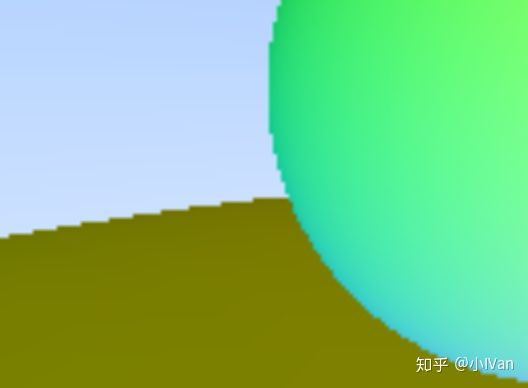

我们可以对这个地方进行超采样来缓解。首先把Camera的逻辑封装一下


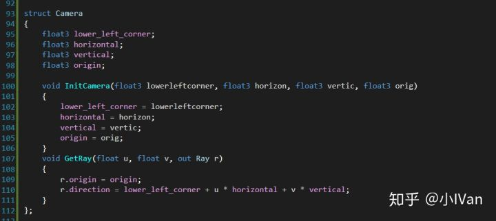

主函数也需要做相应修改


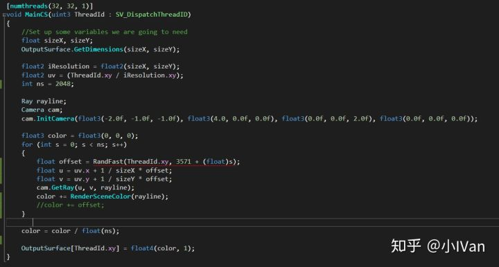

于是最后我们得到了平滑的图像


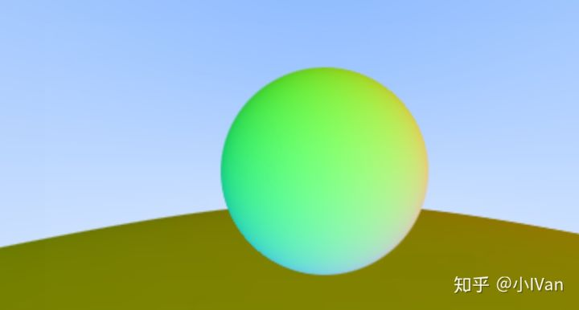

这里我采样了2048次（其实不用这么多次），对于GPU来说小Case啦。我1060的垃圾卡都能瞬间做完运算并输出图片。

------

## **【9】DiffuseLighting**

我们有了法线就能做Lighting啦。

我们可以假设一种非常简单的光照模型，光打到一个物体上，一部分能量被吸收，一部分能量反弹，我们对每条光线做迭代即可


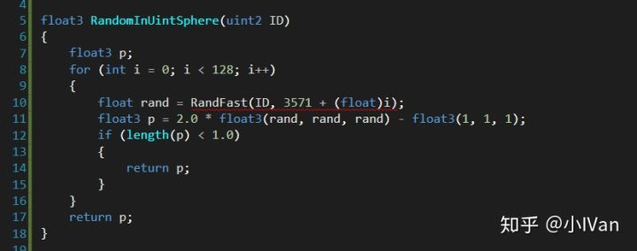


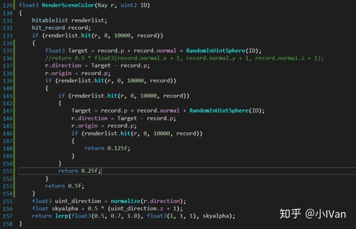

最后可以得到的输出结果


可以看到我们不需要可以渲染AO影子什么的，这些东西自己就有了。影子噪点非常多我们还需要对其进行降噪处理。

修改下Hit的最小距离，将其修改为0.001


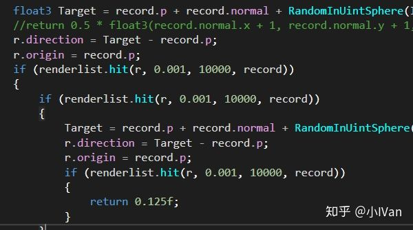

于是奇怪的bug纹就消失了


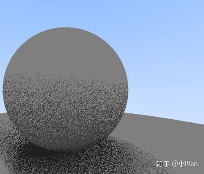


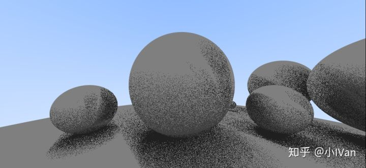

------

先暂时写到这里吧，后面的全反射和折射，透射什么的有时间再写。

Enjoy it。
