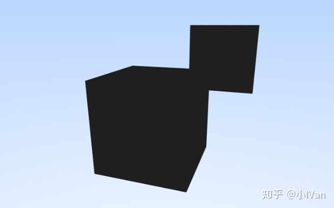
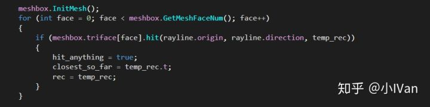
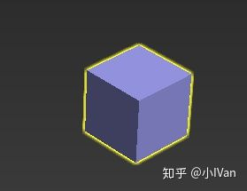

# 虚幻4渲染编程（光线追踪篇）【第三卷：三角形求交】


我的专栏目录：

小IVan：专题概述及目录

zhuanlan.zhihu.com

我们如果想要渲染其它图形的话就需要对几何模型数据进行tracing。




我这里渲染了一个正方体和体和平面，直接输出了一个灰色的diffuse。

我们想要渲染几何模型最基础的思想就是对几何模型的所有三角形求交。下面是一篇大佬写的数学推导过程：

射线和三角形的相交检测（ray triangle intersection test）

www.cnblogs.com

我的对三角形求交代码的如下：

```text
struct MeshFace
{
    float3 Vertex[3];
    float2 UV[3];
    float3 Normal[3];

    bool hit(float3 orig, float3 dir, out hit_record rec)
    {
        float3 v0 = Vertex[0];
        float3 v1 = Vertex[1];
        float3 v2 = Vertex[2];
        float t = 0.0f;
        float u = 0.0f;
        float v = 0.0f;

        float3 E1 = v1 - v0;
        float3 E2 = v2 - v0;
        float3 P = cross(dir, E2);

        float det = dot(E1, P);
        float3 T;
        if (det > 0)
        {
            T = orig - v0;
        }
        else
        {
            T = v0 - orig;
            det = -det;
        }

        if (det < 0.0001f)
            return false;

        u = dot(T, P);
        if (u < 0.0f || u > det)
            return false;

        float3 Q = cross(T, E1);
        v = dot(dir, Q);
        if (v < 0.0f || u + v > det)
            return false;

        t = dot(E2, Q);

        float fInvDet = 1.0f / det;
        t *= fInvDet;
        u *= fInvDet;
        v *= fInvDet;

        rec.t = t;
        rec.p = orig + t * dir;
        rec.normal = float3(0, 1, 0);

        return true;
    }
};
```

有了对一个三角形的求教方法之后，我们遍历所有模型的三角形对它们求交即可




但是这样做并不高效，我们需要使用各种加速结构来加速这个过程，如BVH。下面是一个shaderToy的BVH算法的demo

Shadertoy

www.shadertoy.com

因为我的整个渲染过程都是在ComputeShader中完成的所以无法直接读取模型资源来渲染于是手动敲在shader里了，先在max里建一个模型




然后把它导出成OBJ，导出的时候要勾选三角化


v代表顶点数组，vn代表顶点法线数组，vt代表顶点数组，最后的f就代表三角面的构建了。

f 1/1/1 分别是顶点，UV，法线数组的索引。然后我把这些数据塞到shader里

然后在我的Shader渲染列表里添加上我的模型数据


这导致了我shader的编译时间十分长。

下面是我的shader代码

TracingCommon.ush

```text
struct hit_record
{
    float t;
    float3 p;
    float3 normal;
};
```

Meshes.ush

```text
#include "TracingCommon.ush"

struct MeshFace
{
    float3 Vertex[3];
    float2 UV[3];
    float3 Normal[3];

    bool hit(float3 orig, float3 dir, out hit_record rec)
    {
        float3 v0 = Vertex[0];
        float3 v1 = Vertex[1];
        float3 v2 = Vertex[2];
        float t = 0.0f;
        float u = 0.0f;
        float v = 0.0f;

        float3 E1 = v1 - v0;
        float3 E2 = v2 - v0;
        float3 P = cross(dir, E2);

        float det = dot(E1, P);
        float3 T;
        if (det > 0)
        {
            T = orig - v0;
        }
        else
        {
            T = v0 - orig;
            det = -det;
        }

        if (det < 0.0001f)
            return false;

        u = dot(T, P);
        if (u < 0.0f || u > det)
            return false;

        float3 Q = cross(T, E1);
        v = dot(dir, Q);
        if (v < 0.0f || u + v > det)
            return false;

        t = dot(E2, Q);

        float fInvDet = 1.0f / det;
        t *= fInvDet;
        u *= fInvDet;
        v *= fInvDet;

        rec.t = t;
        rec.p = orig + t * dir;
        rec.normal = float3(0, 1, 0);

        return true;
    }
};

struct Mesh_Box
{
    float3 verts[8];
    float2 uv[4];
    float3 normal[6];
    MeshFace triface[12];

	int GetMeshFaceNum()
    {
        return 12;
    }

    void InitMesh()
    {
        verts[0] = float3(-0.5000, 0.0000, 0.5000);
        verts[1] = float3(-0.5000, 0.0000, -0.5000);
        verts[2] = float3(0.5000, 0.0000, -0.5000);
        verts[3] = float3(0.5000, 0.0000, 0.5000);
        verts[4] = float3(-0.5000, 1.0000, 0.5000);
        verts[5] = float3(0.5000, 1.0000, 0.5000);
        verts[6] = float3(0.5000, 1.0000, -0.5000);
        verts[7] = float3(-0.5000, 1.0000, -0.5000);

        uv[0] = float2(1.0000, 0.0000);
        uv[1] = float2(1.0000, 1.0000);
        uv[2] = float2(0.0000, 1.0000);
        uv[3] = float2(0.0000, 0.0000);

        normal[0] = float3(0.0000, -1.0000, -0.0000);
        normal[1] = float3(0.0000, 1.0000, -0.0000);
        normal[2] = float3(0.0000, 0.0000, 1.0000);
        normal[3] = float3(1.0000, 0.0000, -0.0000);
        normal[4] = float3(0.0000, 0.0000, -1.0000);
        normal[5] = float3(-1.0000, 0.0000, -0.0000);

        triface[0].Vertex[0] = verts[0];
        triface[0].Vertex[1] = verts[1];
        triface[0].Vertex[2] = verts[2];
        triface[0].UV[0] = uv[0];
        triface[0].UV[1] = uv[1];
        triface[0].UV[2] = uv[2];
        triface[0].Normal[0] = normal[0];
        triface[0].Normal[1] = normal[0];
        triface[0].Normal[2] = normal[0];

        triface[1].Vertex[0] = verts[2];
        triface[1].Vertex[1] = verts[3];
        triface[1].Vertex[2] = verts[0];
        triface[1].UV[0] = uv[2];
        triface[1].UV[1] = uv[3];
        triface[1].UV[2] = uv[0];
        triface[1].Normal[0] = normal[0];
        triface[1].Normal[1] = normal[0];
        triface[1].Normal[2] = normal[0];

        triface[2].Vertex[0] = verts[4];
        triface[2].Vertex[1] = verts[5];
        triface[2].Vertex[2] = verts[6];
        triface[2].UV[0] = uv[3];
        triface[2].UV[1] = uv[0];
        triface[2].UV[2] = uv[1];
        triface[2].Normal[0] = normal[1];
        triface[2].Normal[1] = normal[1];
        triface[2].Normal[2] = normal[1];

        triface[3].Vertex[0] = verts[6];
        triface[3].Vertex[1] = verts[7];
        triface[3].Vertex[2] = verts[4];
        triface[3].UV[0] = uv[1];
        triface[3].UV[1] = uv[2];
        triface[3].UV[2] = uv[3];
        triface[3].Normal[0] = normal[1];
        triface[3].Normal[1] = normal[1];
        triface[3].Normal[2] = normal[1];

        triface[4].Vertex[0] = verts[0];
        triface[4].Vertex[1] = verts[3];
        triface[4].Vertex[2] = verts[5];
        triface[4].UV[0] = uv[3];
        triface[4].UV[1] = uv[0];
        triface[4].UV[2] = uv[1];
        triface[4].Normal[0] = normal[2];
        triface[4].Normal[1] = normal[2];
        triface[4].Normal[2] = normal[2];

        triface[5].Vertex[0] = verts[5];
        triface[5].Vertex[1] = verts[4];
        triface[5].Vertex[2] = verts[0];
        triface[5].UV[0] = uv[1];
        triface[5].UV[1] = uv[2];
        triface[5].UV[2] = uv[3];
        triface[5].Normal[0] = normal[2];
        triface[5].Normal[1] = normal[2];
        triface[5].Normal[2] = normal[2];

        triface[6].Vertex[0] = verts[3];
        triface[6].Vertex[1] = verts[2];
        triface[6].Vertex[2] = verts[6];
        triface[6].UV[0] = uv[3];
        triface[6].UV[1] = uv[0];
        triface[6].UV[2] = uv[1];
        triface[6].Normal[0] = normal[3];
        triface[6].Normal[1] = normal[3];
        triface[6].Normal[2] = normal[3];

        triface[7].Vertex[0] = verts[6];
        triface[7].Vertex[1] = verts[5];
        triface[7].Vertex[2] = verts[3];
        triface[7].UV[0] = uv[1];
        triface[7].UV[1] = uv[2];
        triface[7].UV[2] = uv[3];
        triface[7].Normal[0] = normal[3];
        triface[7].Normal[1] = normal[3];
        triface[7].Normal[2] = normal[3];

        triface[8].Vertex[0] = verts[2];
        triface[8].Vertex[1] = verts[1];
        triface[8].Vertex[2] = verts[7];
        triface[8].UV[0] = uv[3];
        triface[8].UV[1] = uv[0];
        triface[8].UV[2] = uv[1];
        triface[8].Normal[0] = normal[4];
        triface[8].Normal[1] = normal[4];
        triface[8].Normal[2] = normal[4];

        triface[9].Vertex[0] = verts[7];
        triface[9].Vertex[1] = verts[6];
        triface[9].Vertex[2] = verts[2];
        triface[9].UV[0] = uv[1];
        triface[9].UV[1] = uv[2];
        triface[9].UV[2] = uv[3];
        triface[9].Normal[0] = normal[4];
        triface[9].Normal[1] = normal[4];
        triface[9].Normal[2] = normal[4];

        triface[10].Vertex[0] = verts[1];
        triface[10].Vertex[1] = verts[0];
        triface[10].Vertex[2] = verts[4];
        triface[10].UV[0] = uv[3];
        triface[10].UV[1] = uv[0];
        triface[10].UV[2] = uv[1];
        triface[10].Normal[0] = normal[5];
        triface[10].Normal[1] = normal[5];
        triface[10].Normal[2] = normal[5];

        triface[11].Vertex[0] = verts[4];
        triface[11].Vertex[1] = verts[7];
        triface[11].Vertex[2] = verts[1];
        triface[11].UV[0] = uv[1];
        triface[11].UV[1] = uv[2];
        triface[11].UV[2] = uv[3];
        triface[11].Normal[0] = normal[5];
        triface[11].Normal[1] = normal[5];
        triface[11].Normal[2] = normal[5];
    }
};
```

RayTracing.usf

```text
#include "/Engine/Private/Common.ush"
#include "Meshes.ush"

RWTexture2D<float4> OutputSurface;

float3 RandomInUintSphere(uint2 ID)
{
    float3 p;
    for (int i = 0; i < 128; i++)
    {
        float rand = RandFast(ID, 3571 + (float)i);
        float3 p = 2.0 * float3(rand, rand, rand) - float3(1, 1, 1);
        if (length(p) < 1.0)
        {
            return p;
        }
    }
    return p;
}

struct Ray
{
    float3 origin;
    float3 direction;
    float3 point_at_paramerter(float t)
    {
        return origin + t * direction;
    }
};

struct hitable_Triangle
{
	
    bool hit(float3 orig, float3 dir, float3 v0, float3 v1, float3 v2,  float t,  float u,  float v, out hit_record rec)
    {
        float3 E1 = v1 - v0;
        float3 E2 = v2 - v0;
        float3 P = cross(dir, E2);

        float det = dot(E1, P);
        float3 T;
        if (det > 0)
        {
            T = orig - v0;
        }
        else
        {
            T = v0 - orig;
            det = -det;
        }

        if (det < 0.0001f)
            return false;

        u = dot(T, P);
        if (u < 0.0f || u > det)
            return false;

        float3 Q = cross(T, E1);
        v = dot(dir, Q);
        if (v < 0.0f || u + v > det)
            return false;

        t = dot(E2, Q);

        float fInvDet = 1.0f / det;
        t *= fInvDet;
        u *= fInvDet;
        v *= fInvDet;

        rec.t = t;
        rec.p = orig + t * dir;
        rec.normal = float3(0, 1, 0);

        return true;
    }
};

struct hitable_Sphere
{
    float3 center;
    float radius;
	void InitHitableObject(float3 centerlocation, float radiusvalue)
    {
        center = centerlocation;
        radius = radiusvalue;
    }
    bool hit(in Ray r, in float t_min, float t_max, out hit_record rec)
    {
        float3 oc = r.origin - center;
        float a = dot(r.direction, r.direction);
        float b = 2 * dot(oc, r.direction);
        float c = dot(oc, oc) - radius * radius;
        float discrimninant = b * b - 4 * a * c;
	
        if (discrimninant >= 0)
        {
            float temp = (-b - sqrt(discrimninant)) / (2.0f * a);
            if (temp < t_max && temp > t_min)
            {
                rec.t = temp;
                rec.p = r.point_at_paramerter(rec.t);
                rec.normal = (rec.p - center) / radius;
                return true;
            }
            temp = (-b + sqrt(discrimninant)) / (2.0f * a);
            if (temp < t_max && temp > t_min)
            {
                rec.t = temp;
                rec.p = r.point_at_paramerter(rec.t);
                rec.normal = (rec.p - center) / radius;
                return true;
            }
        }
        return false;
    }
};

struct hitablelist
{
    //hitable_Sphere Sphere_001;
    //hitable_Sphere Sphere_002;
	
    hitable_Triangle Triangle_001;
    hitable_Triangle Triangle_002;

    Mesh_Box meshbox;

	bool hit(in Ray rayline, in float t_min, in float t_max, out hit_record rec)
    {
        hit_record temp_rec;
        bool hit_anything = false;
        float closest_so_far = t_max;
		
        //Sphere_001.InitHitableObject(float3(0, -1.0f, 0), 0.5f);
        //if (Sphere_001.hit(rayline, t_min, closest_so_far, temp_rec))
        //{
        //    hit_anything = true;
        //    closest_so_far = temp_rec.t;
        //    rec = temp_rec;
        //}
		
        //Sphere_002.InitHitableObject(float3(0, -1.0f, 20.5f), 20.0f);
        //if (Sphere_002.hit(rayline, t_min, closest_so_far, temp_rec))
        //{
        //    hit_anything = true;
        //    closest_so_far = temp_rec.t;
        //    rec = temp_rec;
        //}

        if (Triangle_001.hit(rayline.origin, rayline.direction, float3(0, -1, 0), float3(1, -1, 0), float3(0, -1, 1), 0, 0, 0, temp_rec))
        {
            hit_anything = true;
            closest_so_far = temp_rec.t;
            rec = temp_rec;
        }
        if (Triangle_002.hit(rayline.origin, rayline.direction, float3(1, -1, 1), float3(1, -1, 0), float3(0, -1, 1), 0, 0, 0, temp_rec))
        {
            hit_anything = true;
            closest_so_far = temp_rec.t;
            rec = temp_rec;
        }

        meshbox.InitMesh();
        for (int face = 0; face < meshbox.GetMeshFaceNum(); face++)
        {
            if (meshbox.triface[face].hit(rayline.origin, rayline.direction, temp_rec))
            {
                hit_anything = true;
                closest_so_far = temp_rec.t;
                rec = temp_rec;
            }
        }

        return hit_anything;
    }
};

struct Camera
{
    float3 lower_left_corner;
    float3 horizontal;
    float3 vertical;
    float3 origin;

	void InitCamera(float3 lowerleftcorner, float3 horizon, float3 vertic, float3 orig)
    {
        lower_left_corner = lowerleftcorner;
        horizontal = horizon;
        vertical = vertic;
        origin = orig;
    }
	void CameraInit(float3 camerapos, float3 lookat, float3 vup, float vfov, float aspect)
    {
        float3 u = float3(0, 0, 0);
        float3 v = float3(0, 0, 0);
        float3 w = float3(0, 0, 0);

        float theta = vfov * 3.14 / 180.0;
        float halfheight = tan(theta / 2);
        float halfwidth = aspect * halfheight;
        origin = camerapos;
        w = normalize(camerapos - lookat);
        u = normalize(cross(vup, w));
        v = cross(w, u);

        lower_left_corner = float3(-halfwidth, -halfheight, -1.0f);
        lower_left_corner = origin - halfwidth * u - halfheight * v - w;

        horizontal = 2 * halfwidth * u;
        vertical = 2 * halfheight * v;

    }
	void GetRay(float u, float v, out Ray r)
    {
        r.origin = origin;
        r.direction = lower_left_corner + u * horizontal + v * vertical;
    }
};

float3 RenderSceneColor(Ray r, uint2 ID)
{
    hitablelist renderlist;
    hit_record record;
    int shaodowns = 64;
    if (renderlist.hit(r, 0.001, 10000, record))
    {
        float3 Target = record.p + record.normal + RandomInUintSphere(ID);
			//return 0.5 * float3(record.normal.x + 1, record.normal.y + 1, record.normal.z + 1);
        r.direction = Target - record.p;
        r.origin = record.p;
        if (renderlist.hit(r, 0.001, 10000, record))
        {
            if (renderlist.hit(r, 0.001, 10000, record))
            {
                Target = record.p + record.normal + RandomInUintSphere(ID);
                r.direction = Target - record.p;
                r.origin = record.p;
                if (renderlist.hit(r, 0.001, 10000, record))
                {
                    return 0.125f;
                }
            }
            return 0.25f;
        }
        return 0.5f;
    }
    float3 uint_direction = normalize(r.direction);
    float skyalpha = 0.5 * (uint_direction.z + 1);
    return lerp(float3(0.5, 0.7, 1.0), float3(1, 1, 1), skyalpha);
}

[numthreads(32, 32, 1)]
void MainCS(uint3 ThreadId : SV_DispatchThreadID)
{
	//Set up some variables we are going to need
    float sizeX, sizeY;
    OutputSurface.GetDimensions(sizeX, sizeY);

    float2 iResolution = float2(sizeX, sizeY);
    float2 uv = (ThreadId.xy / iResolution.xy);
    int ns = 2048;

    Ray rayline;
    Camera cam;
    //cam.InitCamera(float3(-2.0f, -1.0f, -1.0f), float3(4.0, 0.0f, 0.0f), float3(0.0f, 0.0f, 2.0f), float3(0.0f, 3.0f, 0.0f));
    cam.CameraInit(float3(1.0f, 3.0f, 1.0f), float3(0, 0, 0), float3(0, 0, 1), 90, sizeX / sizeY);
    float3 color = float3(0, 0, 0);
    for (int s = 0; s < ns; s++)
    {
        float offset = RandFast(ThreadId.xy, 3571 + (float)s);
        float u = uv.x + 1 / sizeX * offset;
        float v = uv.y + 1 / sizeY * offset;
        cam.GetRay(u, v, rayline);
        color += RenderSceneColor(rayline, ThreadId.xy);
    }
    color = color / float(ns);

	
    OutputSurface[ThreadId.xy] = float4(color, 1);
}
```

Enjoy it  ！
