# Real Shading in Unreal Engine 4

[TOC]

最近按照学习小组内的分工，我一直在研究Unreal，被搞得有点痛苦。unreal由于开发时间太长，源代码过于庞大，而且，体系化的中文文档也比较少，所以，就决定花一些时间来做英文资料的搬运工。

这次来翻译一下2013年Epics Games工程师做的分享《Real Shading in Unreal Engine 4》这篇文章，这个作为Unreal Engine向真实渲染转变的重要分析文档，对现在而言，还是有一些借鉴意义的。

## **Real Shading in Unreal Engine 4**

by Brian Karis, Epic Games 

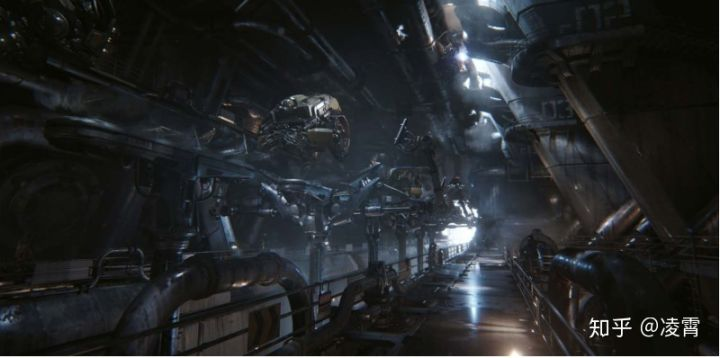图1：UE4的渗透者Demo

## **一、介绍-Introduction**

大约在一年前（2012年），我们决定投入一些时间去提升我们的着色模型并且包含一个更加基于物理的材质工作流。它部分驱动自渲染更真实的图像的需求，但是我们也对我们通过更基于物理的方法进行材质创建、使用分层材质可能达到的目标感兴趣。艺术家感觉这可能是对工作流和质量的一个巨大的提升，并且我已经在另一个工作室第一时间看到了这些成效，在那里我们已经过渡到离线混合的材质层。我们的其中一位技术美术在Epic在着色器中做分层的实验，实现了结果很有希望，这成为了一个额外的需求。

为了支持这个方向，我们知道材质的分层需要简单，并且高效。迪士尼的演讲来的时间十分完美[2]，涉及到了他们的基于物理的着色和使用Wreck-It Ralph的材质模型。Brent Burley  展示了一个非常小的材质参数集合可以足够精致的表现离线特性的电影渲染。他童谣展示了一个相当实用的着色模型可以紧密的适用于大多数采样的材质。他们的工作成为了我们的一个灵感和基础，并且像他们的“规则”相似，我们也决定去定义一个我们自己的系统的目标。

### **实时性能-Real-Time Performance**

- 首要的是，它需要在每次许多可见灯光的条件下高效地使用。

### **简化复杂度-Reduced Complexity**

- 参数尽可能的少。大批的参数不仅会导致很难来做一个决定，需要反复试验和试错，或者相互关联的属性对于一个预期效果需要许多的值来改变。
- 我们需要能够使用基于图像的光照（IBL）和交互式地可分析光源，所以参数必须在多有的光照类型中表现一致。

### **直观的界面-Intuitive Interface**

- 我们更倾向易于理解的值，而不是像折射率（index of refraction）这样的物理参数。

### **感知线性-Perceptually Linear**

- 我们希望通过蒙版支持分层，但是我们只能承受逐像素一次着色的负担。这意味着混合参数着色必须尽可能的匹配着色结果的混合。

### **简单掌握-Easy to Master**

- 我们想要避免需要电介质和导体的技术理解，同时最小化创建基本的貌似物理的材质所需要的努力。

### **健壮-Robust**

- 错误的创建物理上不可信的材质很困难。
- 所有参数的结合的应该尽可能的健壮和可信。

### **具有表现力-Expressive**

- 延迟渲染限制了我们可以使用的着色模型的数量，所以我们的基本着色模型需要足够描述覆盖现实世界中99%的材质。
- 为了能够混合所有可分层的材质，所以，他们之间需要共享相同的参数集。

### **灵活-Flexible**

- 其他的项目或者被授权开发的项目，可能不是以照片级真实渲染为目标，所以也需要足够灵活来允许非真实感渲染。

## 二、**着色模型-**Shading Model

**2.1、漫反射双向反射分布函数-Diffuse BRDF**

我们评估了Burley的漫反射模型，但是只观察到与Lambertain模型相比轻微的差别（等式1），所以我们不能判断额外的开销的合理性和必要性。除此之外，任何更复杂的漫反射模型很难高效的使用基于图像或球面谐调的光照。因此，我们不在评估其他选择上投入精力。

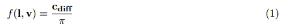

这里Cdiff是材质的漫反射率（diffuse albedo）。

UE4.21的当前实现，请参考BRFD.usf文件。

```cpp
float3 Diffuse_Lambert( float3 DiffuseColor ) { 
	return DiffuseColor * (1 / PI); 
}
```

**2.2、微表面镜面反射双向反射分布函数-Microfacet Specular BRDF**

常规的Cook-Torrance[5,6]微表面镜面反射着色模型是：

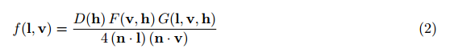

请查阅[9]来获取更多扩展信息。

我们从迪士尼使用的模型开始，在与其他更高效的实现方式对比的情况下，评估了公式中每一项的重要性。这个工作远比听起来要困难的多；已经公布的公式中的每项输入不一定使用了相同的参数，但这对于正确的比较是至关重要的。

### **2.2.1、镜面反射D-Specular D**

  对于法线分布函数（NDF），我们发现迪士尼选择的GGX/Trowbridge-Reitz的成本是值得的。相比于Blinn-Phong的公式，额外的消耗相当的小，并且提供了更好的“长尾效果”，这个长尾效果的表现吸引了我们的艺术家。我们也采用了迪士尼重新定义的参数α=Roughness^2。

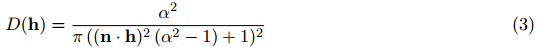

> 译者注：**法线分布函数D(Normal Distribution Function)**：或者说镜面分布，从统计学上近似的表示了与向量h取向一致的微平面的比率。
> 举例来说，假设给定一个向量v，如果我们的微平面中有35%与向量v取向一致，则正态分布函数或者说NDF将会返回0.35。
> 我们来增加一个针对NDF在长尾效果方面的展示和对比，如下图所示。

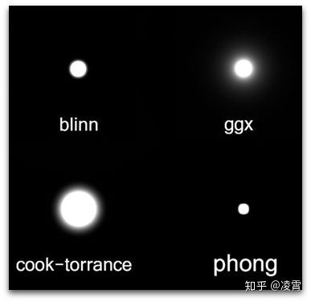注：主流NDF函数高光长尾效果的对比，GGX拥有最好的长尾表现。

> UE4.21中的代码实现：*从代码中看，跟D(h)的实现是完全一致的。*

```cpp
float D_GGX( float Roughness, float NoH )
{
	float a = Roughness * Roughness;
	float a2 = a * a;
	float d = ( NoH * a2 - NoH ) * NoH + 1;	// 2 mad
	return a2 / ( PI*d*d );			// 4 mul, 1 rcp
}
```

> 在UE4中，有另外一个关于各项异性的GGX实现，主要的实现思路是在X轴、Y轴两个方向上分别进行计算roughness。**Anisotropic GGX, Burley 2012, "Physically-Based Shading at Disney"**

```cpp
float D_GGXaniso( float RoughnessX, float RoughnessY, float NoH, float3 H, float3 X, float3 Y )
{
	float ax = RoughnessX * RoughnessX;
	float ay = RoughnessY * RoughnessY;
	float XoH = dot( X, H );
	float YoH = dot( Y, H );
	float d = XoH*XoH / (ax*ax) + YoH*YoH / (ay*ay) + NoH*NoH;
	return 1 / ( PI * ax*ay * d*d );
}
```

### 2.2.2、镜面反射G-Specular G

我们评估了镜面几何衰减项的多种选择。  到最后，我们选择使用Schlick模型[19]，但k =α/ 2，以便更好地拟合Smith模型GGX [21]。  通过这种修改，Schlick模型与α= 1的Smith完全匹配，并且相当[0，1]范围内的近似逼近（如图2所示）。  我们还选择使用迪士尼的修改通过在平方之前使用 ![[公式]](Untitled.assets/equation.svg) 重新映射粗糙度以减少“热度hotness”。 请务必注意该调整仅用于光源计算；如果应用于基于图像的照明（IBL），则在掠射角度部分的颜色太暗。

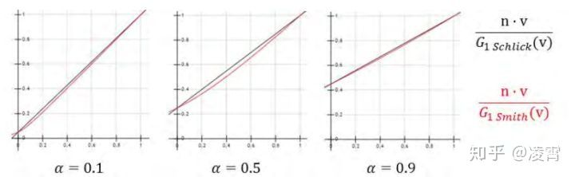图2：使用k=α/2的Schlick非常接近Smith匹配

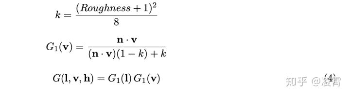

> **注：**在基于物理的渲染中，几何函数（Geometry  Function）是一个0到1之间的标量，描述了微平面自阴影的属性，表示了具有半矢量法线的微平面（microfacet）中，同时被入射方向和反射方向可见（没有被遮挡的）的比例，即未被遮挡的m= h微表面的百分比。几何函数（Geometry Function）即是对能顺利完成对光线的入射和出射交互的微平面概率进行建模的函数。

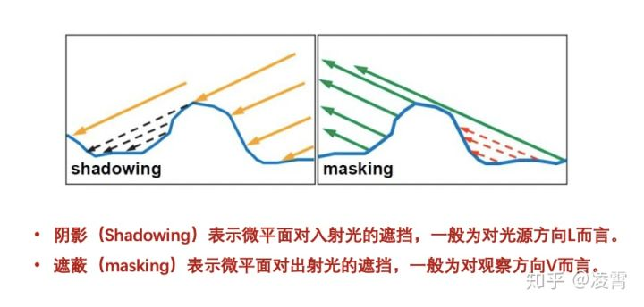注：几何函数G(x)的光学涵义

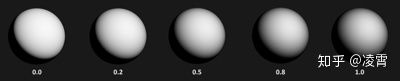注：白色表示没有微平面的阴影，黑色表示微平面彻底被遮蔽

在UE4老的实现代码中，UE4将G(l,v)项和 ![[公式]](Untitled.assets/equation.svg) 合并为Vis(l, v)，Schlick模型的实现代码如下：

```cpp
float Vis_Schlick( float Roughness, float NoV, float NoL )
{
	float k = Square( Roughness ) * 0.5;
	float Vis_SchlickV = NoV * (1 - k) + k;
	float Vis_SchlickL = NoL * (1 - k) + k;
	return 0.25 / ( Vis_SchlickV * Vis_SchlickL );
}
```

但是，在UE4.21的代码中，实际的实现代码又发生了改变。如下所示。似乎是又朝着Smith的实现去进行了调整。

```cpp
// Tuned to match behavior of Vis_Smith
float Vis_Schlick( float a2, float NoV, float NoL )
{
	float k = sqrt(a2) * 0.5;
	float Vis_SchlickV = NoV * (1 - k) + k;
	float Vis_SchlickL = NoL * (1 - k) + k;
	return 0.25 / ( Vis_SchlickV * Vis_SchlickL );
}
```

### **2.2.3、镜面反射F-Specular F**

对于菲涅尔，我们做出使用Schlick近似的经典选择   [19]，但是有一点修改，我们使用了球面高斯Spherical Gaussian近似[10]来代替power计算。这稍微提高了计算效率，并且差异微不可察，公式为：


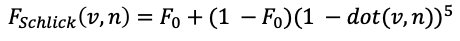Schlick近似的经典公式

> 采用球面高斯的近似来代替Power的选择，主要是考虑在GPU上运算的效率来考虑。

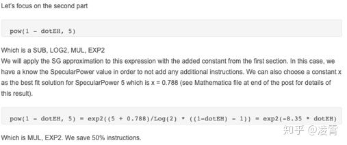注：GPU指令减少了50%

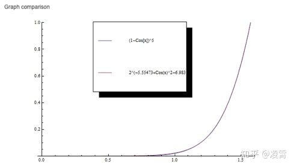注：可以看到，这个拟合几乎是完美的。

> 但是，从UE4.21的代码来看，似乎并没有采用这个球面高斯趋近，而是采用了一种更高效的方式。按照实现应该是Fc + (1-Fc) * SpecularColor，但是，在第一个Fc前面增加了一个 50 *  SpecularColor.g，但是，Fc还是采用了Pow5的处理。（哪位朋友了解原因，可以下面评论中帮忙解释一下。）

```cpp
float3 F_Schlick( float3 SpecularColor, float VoH )
{
	float Fc = Pow5( 1 - VoH );					// 1 sub, 3 mul
	// Anything less than 2% is physically impossible and is instead considered to be shadowing
	return saturate( 50.0 * SpecularColor.g ) * Fc + (1 - Fc) * SpecularColor;
}
```

------

> 译者注：下面的部分介绍的就是IBL了，但是，从BRDF的整体性角度来说，还缺失了一个环境光的漫反射部分，为了让读者有一个更完整的理解，我这里非常简单地来介绍一下这部分。
> 漫反射环境光照部分一般采用传统IBL中辉度环境映射（Irradiance Environment Mapping）技术，并不是基于物理的特有方案。

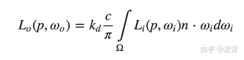环境光漫反射部分的计算公式

> 这个东西是没办法直接使用的，所以我们使用蒙特卡洛积分的期望法来进行积分。具体推导过程如下所示：


> 在写代码实现的时候，用蒙特卡洛积分求系数的过程大概就是一系列的相乘与求和，伪代码：

```cpp
void SH_Coefficients()
{
    double weight =4.0 * PI;
    //生成n条光线进行采样
    for(int i=0; i<n_samples; ++i) 
    {
        //生成带抖动的无偏采样方向(θ,ϕ)
        for(int n=0; n<n_coeff; ++n)
        {
        //对于某一个light probe，它的每个球谐展开系数c_i就要累加起所有的【某方向上的irradiance * 这个方向上SH函数值】
        result[n] += light(θ,ϕ)* samples[i].SH_basis_coeff[n];
        }
    }
    // 把蒙特卡洛积分的常数项乘上去（恒定的采样权重，总采样数）
    double factor = weight / n_samples;
    for(i=0; i<n_coeff; ++i)
    {
        result[i] = result[i] * factor;
    }
}
```

> 上面的result[i]就是某个点上光照分布的球面函数经过”编码”之后得到的球谐系数。我们可以用离线预计算的系数，在runtime通过效率比较高的方式近似重构出原来的光照。

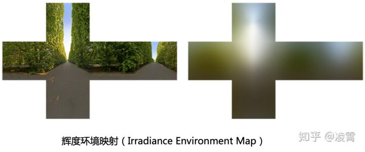通过上面的伪代码，将左边的环境贴图，计算成辉度环境映射，从而用于运行时刻的运算

## **2.2.4、基于图像的光照-Image-Based Lighting**

为了在基于图像的光照使用这个着色模型，需要解决辐射率积分，这通常使用重要性采样来完成。（注：关于辐射度这部分内容相当丰富和复杂，这里就不解释了。读者可以去查找辐射度的相关文章。）下面的等式描述了这个数值积分：

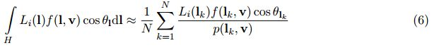

> **重要性采样**（Importance Sample）即通过现有的一些已知条件（分布函数），想办法集中于被积函数分布可能性较高的区域(重要的区域)进行采样，进而可高效地计算准确的估算结果的的一种策略。

下面的HLSL代码展示了如何在我们的着色模型中实现：

> （以下与原文略不一致，使用了4.21的代码替换）

```cpp
float4 ImportanceSampleGGX( float2 E, float Roughness )
{
    float m = Roughness * Roughness;
    float m2 = m * m;

    float Phi = 2 * PI * E.x;
    float CosTheta = sqrt( (1 - E.y) / ( 1 + (m2 - 1) * E.y ) );
    float SinTheta = sqrt( 1 - CosTheta * CosTheta );

    float3 H;
    H.x = SinTheta * cos( Phi );
    H.y = SinTheta * sin( Phi );
    H.z = CosTheta;
    
    float d = ( CosTheta * m2 - CosTheta ) * CosTheta + 1;
    float D = m2 / ( PI*d*d );
    float PDF = D * CosTheta;

    return float4( H, PDF );
}
```


```cpp
float4 ImportanceSampleGGX( float2 E, float Roughness )
{
    float m = Roughness * Roughness;
    float m2 = m * m;

    float Phi = 2 * PI * E.x;
    float CosTheta = sqrt( (1 - E.y) / ( 1 + (m2 - 1) * E.y ) );
    float SinTheta = sqrt( 1 - CosTheta * CosTheta );

    float3 H;
    H.x = SinTheta * cos( Phi );
    H.y = SinTheta * sin( Phi );
    H.z = CosTheta;
    
    float d = ( CosTheta * m2 - CosTheta ) * CosTheta + 1;
    float D = m2 / ( PI*d*d );
    float PDF = D * CosTheta;

    return float4( H, PDF );
}
```

即使有重要性采样，许多的样本仍然需要被采集。样本数量可以通过mip  maps显著的减少，但是数量仍然需要大于16以满足足够的数量（注：原文1024次采样，4.20为32次采样）。因为我们为了获得局部的反射信息，需要在许多张环境贴图中进行逐像素的混合，我们实践中只能支持针对每张贴图进行一次样本采样。（注：原文在这里写得并不清楚，其实，想表达的意思是说：所以呢，咱们还得想其他办法。）

### **2.2.4.1、分解求和近似-Split Sum Approximation**

为了实现这个，我们通过将上面的公式6分解成为两个求和部分来近似求解。每一个分离出来的求和公式可以被进行提前的预计算。对于一个常数![[公式]](Untitled.assets/equation.svg) 这个近似是准确的，并且对于常规的环境来说，此公式也相当的精确。


### **2.2.4.2、预积分环境贴图-Pre-Filtered Environment Map**

我们对于不同的粗糙度值，预计算第一个求和项并且将结果保存在CubeMap的mip-map层级中。这是在游戏工业使用的典型方式[1,9]。一个较小的区别是，我们使用了重要性采样和我们的着色模型中的GGX分布对环境贴图做了卷积计算。

因为这是微表面模型，分布的形状改变依赖于到表面上的观察角度，所以**我们假设这个角度是0**，例如，n=v=r。

**各向同性的假设**是近似的第二个来源，并且它不幸地意味着我们不会在掠射角获得漫长的反射。

比起分离的和近似，实际上这是我们IBL解决方案中更大的错误来源。正如下面代码展示的，我们已经发现使用 ![[公式]](https://www.zhihu.com/equation?tex=cos%CE%B8_%7Blk%7D) 可以实现更佳的结果。

下面的代码，选自UE4.21版本。

```cpp
float3 PrefilterEnvMap( uint2 Random, float Roughness, float3 R )
{
	float3 FilteredColor = 0;
	float Weight = 0;
		
	const uint NumSamples = 64;
	for( uint i = 0; i < NumSamples; i++ )
	{
		float2 E = Hammersley( i, NumSamples, Random );
		float3 H = TangentToWorld( ImportanceSampleGGX( E, Pow4(Roughness) ).xyz, R );
		float3 L = 2 * dot( R, H ) * H - R;

		float NoL = saturate( dot( R, L ) );
		if( NoL > 0 )
		{
			FilteredColor += AmbientCubemap.SampleLevel( AmbientCubemapSampler, L, 0 ).rgb * NoL;
			Weight += NoL;
		}
	}

	return FilteredColor / max( Weight, 0.001 );
}
```

> 译者注：从代码上看，两个代码主要有两个变化，一个是在原来的代码中进行了1024次采样，而最新的代码中，只进行了64次采样；第二个变化，针对最后进行的除法进行了一个保护，使用max( Weight, 0.001 )替代了原来的Weight。

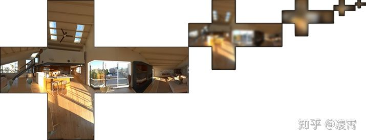预积分环境贴图

> 上图中的预积分环境贴图，是通过PrefilterEvnMap来进行离线计算并生成的。因为它是离线渲染的，所以，使用1024次采样，还是64次采样，基本上没什么太大的差距。至于为什么UE的最新代码，降低了大量的采样，我就不得而知了。
> 在这个输入的参数中，有一个Roughness的参数，这个就是为什么会使用5级的mipmap的原因。毕竟针对不同的roughness，会从不同的mipmap来进行采样，这样也就获得了不同的辐照度信息。
> 说白了，这还是一种在不能进行光线追踪情况下进行的一个模拟实现。将生成的Cubemap视为辐照度信息，将不同等级的MipMap作为不同Roughness的辐照贴图。这种方案既考虑到了实时渲染的效率问题，也在一定程度上保证了这个渲染的真实性。

### **2.2.4.3、环境双向反射分布函数-Environment BRDF**

第二个求和项包含了其他所有的部分。这与用一个纯白色的环境对镜面反射双向反射分布函数进行积分操作是一样的，例如， ![[公式]](Untitled.assets/equation.svg) 。通过Schlick的菲涅尔代替：F(v,h)=F0+(1-F0)(1-v·h)^5，我们发现F0可以因式分解到积分外。

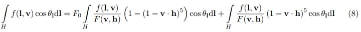

这余下了两个输入（粗糙度Roughness和cosθv），和两个输出（F0的缩放和偏移），所有的值都在[0,1]的范围内。我们预计算这个函数的结果，并且保存到一个2D的查找表中（因为精确度是非常重要的，所以，在这里使用R16G16的格式）。

> 上式留下了两个输入（Roughness 和 cos θv）和两个输出（缩放和向F0的偏差（a scale and bias to F0）），即把上述方程看成是F0 * Scale + Offset的形式。 我们预先计算此函数的结果并将其存储在2D查找纹理（LUT，look-up texture）中。

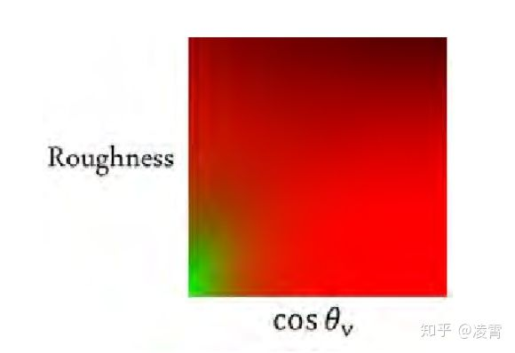图3：2D纹理查找表

> 这张红绿色的贴图，输入roughness、cosθ，输出环境BRDF镜面反射的强度。这个是关于roughness、cosθ与环境BRDF镜面反射强度的固有映射关系。这个事可以进行离线预计算。
> 具体的取出方式为：

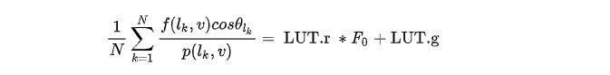

> 即UE4是通过把Fresnel公式的F0提出来，组成F0 * Scale +Offset的方式，再将Scale和Offset的索引存到一张2D LUT上。靠roughness和  NdotV进行查找。下面是从UE4.21代码中找到的制作这张LUT贴图的函数。请注意在代码中，针对A，B的两个变量的赋值。

```cpp
float3 IntegrateBRDF( uint2 Random, float Roughness, float NoV )
{
	float3 V;
	V.x = sqrt( 1.0f - NoV * NoV );	// sin
	V.y = 0;
	V.z = NoV;						// cos

	float A = 0;
	float B = 0;
	float C = 0;

	const uint NumSamples = 64;
	for( uint i = 0; i < NumSamples; i++ )
	{
		float2 E = Hammersley( i, NumSamples, Random );

		{
			float3 H = ImportanceSampleGGX( E, Pow4(Roughness) ).xyz;
			float3 L = 2 * dot( V, H ) * H - V;

			float NoL = saturate( L.z );
			float NoH = saturate( H.z );
			float VoH = saturate( dot( V, H ) );

			if( NoL > 0 )
			{
				float a = Square( Roughness );
				float a2 = a*a;
				float Vis = Vis_SmithJointApprox( a2, NoV, NoL );
				float Vis_SmithV = NoL * sqrt( NoV * (NoV - NoV * a2) + a2 );
				float Vis_SmithL = NoV * sqrt( NoL * (NoL - NoL * a2) + a2 );
				//float Vis = 0.5 * rcp( Vis_SmithV + Vis_SmithL );

				// Incident light = NoL
				// pdf = D * NoH / (4 * VoH)
				// NoL * Vis / pdf
				float NoL_Vis_PDF = NoL * Vis * (4 * VoH / NoH);

				float Fc = pow( 1 - VoH, 5 );
				A += (1 - Fc) * NoL_Vis_PDF;
				B += Fc * NoL_Vis_PDF;
			}
		}

		{
			float3 L = CosineSampleHemisphere( E ).xyz;
			float3 H = normalize(V + L);

			float NoL = saturate( L.z );
			float NoH = saturate( H.z );
			float VoH = saturate( dot( V, H ) );

			float FD90 = ( 0.5 + 2 * VoH * VoH ) * Roughness;
			float FdV = 1 + (FD90 - 1) * pow( 1 - NoV, 5 );
			float FdL = 1 + (FD90 - 1) * pow( 1 - NoL, 5 );
			C += FdV * FdL * ( 1 - 0.3333 * Roughness );
		}
	}

	return float3( A, B, C ) / NumSamples;
}
```

在完成这项工作之后，我们发现目前的和同时进行的研究，几乎都是和我们一致的结果。Whilst  Gotanda使用了3D查找表[8]，Drobot优化它到2D的查找表[7]，就和我们所做的那样。另外，作为这个课题的一员——Lazarov又向前迈进了一步[11]，展示了相似积分的一对解析近似（这个方案中使用了不同的D和G函数）。

最后，为了近似重要性采样的引用，我们将这两个预计算的求和进行相乘的操作。

```cpp
float3 ApproximateSpecularIBL( uint2 Random, float3 SpecularColor, float Roughness, float3 N, float3 V )
{
	// Function replaced with prefiltered environment map sample
	float3 R = 2 * dot( V, N ) * N - V;
	float3 PrefilteredColor = PrefilterEnvMap( Random, Roughness, R );
	//float3 PrefilteredColor = FilterEnvMap( Random, Roughness, N, V );

	// Function replaced with 2D texture sample
	float NoV = saturate( dot( N, V ) );
	float2 AB = IntegrateBRDF( Random, Roughness, NoV ).xy;

	return PrefilteredColor * ( SpecularColor * AB.x + AB.y );
}
```

> 注：这个函数，只是说明了整个算法而已，在真正去进行计算的时候，是不会采用这个方法的，而是，选择直接进行针对预积分贴图采样的算法。如下面的代码所示。

```cpp
void MainPS(in noperspective float4 UVAndScreenPos : TEXCOORD0, float4 SvPosition : SV_POSITION, out float4 OutColor : SV_Target0)
{
        ......
	{
		float Mip = ComputeCubemapMipFromRoughness( GBuffer.Roughness, AmbientCubemapMipAdjust.w );
		float3 SampleColor = TextureCubeSampleLevel( AmbientCubemap, AmbientCubemapSampler, R, Mip ).rgb;
		SpecularContribution += SampleColor * EnvBRDF( GBuffer.SpecularColor, GBuffer.Roughness, NoV );
		//SpecularContribution += ApproximateSpecularIBL( Random, GBuffer.SpecularColor, GBuffer.Roughness, GBuffer.WorldNormal, -ScreenVector );
	}
}

half3 EnvBRDF( half3 SpecularColor, half Roughness, half NoV )
{
	// Importance sampled preintegrated G * F
	float2 AB = Texture2DSampleLevel( PreIntegratedGF, PreIntegratedGFSampler, float2( NoV, Roughness ), 0 ).rg;

	// Anything less than 2% is physically impossible and is instead considered to be shadowing 
	float3 GF = SpecularColor * AB.x + saturate( 50.0 * SpecularColor.g ) * AB.y;
	return GF;
}
```

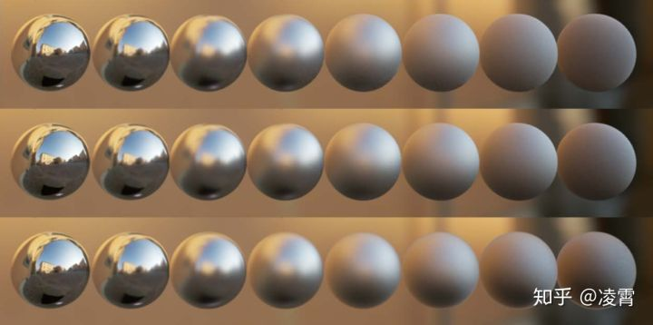图4：最上方为参考（重要性采样方案），分解求和近似（Split sum approxmation）位于中间，包含n=v假设的Complete Approximation在最底部。径向对称假设引入了误差最大，但是组合近似依然和参考十分相似。

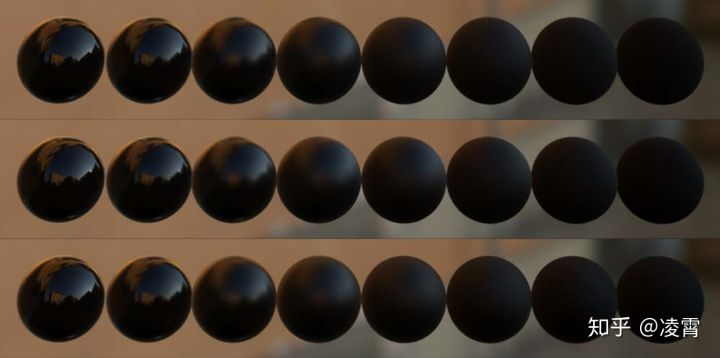图5：电介质的对比图（对比项与图4相同）

## 思考：

Shading Model这部分到这里基本上就算是完成了，剩下的Material Model和Lighting部分，放在下一篇吧。

针对这部分进行翻译后，我个人对UE Shading Model有一些感受，跟大家分享一下：

1、对于UE4的初学者来说，我们也不要把UE4想得太神化。呵呵，从这个过程中，我们可以比较清晰地看出，从UE3向UE4转换的主体思路。

2、引擎这个层面还是针对理论学界的各种算法来进行实现的，下面列举的参考文献，其实，才是我们深入要去理解和分析的。如果这些基本的理论依据不能理解，对UE4的实现也就只能停留在表面。当然，这里面涉及的知识实在是太多了，如果我们不做学术的话，有一些理论至少得理解。

3、UE4也是有很多折中和妥协的，比如，Specular这个概念。在文中，作者是很不行保留这个概念了，但是，《堡垒之夜》大量使用了这个材质属性，估计最后作为引擎开发者，也只能妥协。

4、UE4依然是不断在进化的，从文章中给出的参考实现代码，到UE4.21的最新代码不同这一点就能看出来。这主要还是因为，图形学是在不断演变和进化的，大家在学习的时候，要有一个认知。

5、对于实时渲染而言，一个重点要考虑的问题就是效率问题。在上面的各种算法优化过程中，主要就是针对这种思路来实现。优化的方案主要有两种：1个就是在纯粹在数学上进行拟合，比如球面高斯拟合；第2个方案就是增加假设条件，比如，预积分环境贴图生成的两个重要假设。第一个进行数学逼近还好，第二个就是整体带来偏差的主要原因了。

6、从未来的角度讲，肯定还是会出现各种方案来优化各种D，G，F函数，以及针对环境光的各种优化算法。如果因为效率还不能使用光追的话，在第5部分的各种优化还是会不断进行。

7、不过，可喜的是，”光线追踪“似乎就要来了，不光英伟达，AMD也基本上能够做出”光线追踪“的显卡了。在这样的情况下，可能整个一套渲染方案，会产生一个更大的变化了。当然，移动设备上可能还不行，所以，这套思路还是需要进一步研究和发展下去。

**参考文献：**

[1]  AMD, CubeMapGen: Cubemap Filtering and Mipchain Generation Tool. [http://developer.amd](https://link.zhihu.com/?target=http%3A//developer.amd). com/resources/archive/archived-tools/gpu-tools-archive/cubemapgen/ 

[2]  Burley, Brent, “Physically-Based Shading at Disney”, part of  “Practical Physically Based Shading in Film and Game Production”,  SIGGRAPH 2012 Course Notes. [http://blog.selfshadow.com/](https://link.zhihu.com/?target=http%3A//blog.selfshadow.com/) publications/s2012-shading-course/  

[3]  Colbert, Mark, and Jaroslav Krivanek, “GPU-based Importance Sampling”, in Hubert Nguyen, ed., GPU Gems 3, Addison-Wesley, pp. 459–479, 2007. [http://http.developer.nvidia.com/](https://link.zhihu.com/?target=http%3A//http.developer.nvidia.com/) GPUGems3/gpugems3_ch20.html  

[4]  Coffin, Christina, “SPU Based Deferred Shading in Battlefield 3 for  Playstation 3”, Game Developers Conference, March 2011. [http://www.slideshare.net/DICEStudio/spubased-deferred-](https://link.zhihu.com/?target=http%3A//www.slideshare.net/DICEStudio/spubased-deferred-) shading-in-battlefield-3-for-playstation-3 

[5]  Cook, Robert L., and Kenneth E. Torrance, “A Reflectance Model for  Computer Graphics”, Computer Graphics (SIGGRAPH ’81 Proceedings), pp.  307–316, July 1981.  

[6]  Cook, Robert L., and Kenneth E.  Torrance, “A Reflectance Model for Computer Graphics”, ACM Transactions  on Graphics, vol. 1, no. 1, pp. 7–24, January 1982. [http://graphics.pixar](https://link.zhihu.com/?target=http%3A//graphics.pixar). com/library/ReflectanceModel/  

[7]  Drobot, Michal􏰀, “Lighting Killzone: Shadow Fall”, Digital Dragons, April 2013. [http://www](https://link.zhihu.com/?target=http%3A//www). [http://guerrilla-games.com/publications/](https://link.zhihu.com/?target=http%3A//guerrilla-games.com/publications/)  

[8]  Gotanda, Yoshiharu, “Practical Implementation of Physically-Based  Shading Models at tri-Ace”, part of “Physically-Based Shading Models in  Film and Game Production”, SIGGRAPH 2010 Course Notes. [http://renderwonk.com/publications/s2010-shading-course/](https://link.zhihu.com/?target=http%3A//renderwonk.com/publications/s2010-shading-course/)  

[9]  Hoffman, Naty, “Background: Physics and Math of Shading”, part of  “Physically Based Shad- ing in Theory and Practice”, SIGGRAPH 2013  Course Notes. [http://blog.selfshadow.com/](https://link.zhihu.com/?target=http%3A//blog.selfshadow.com/) publications/s2013-shading-course/  

[10]  Lagarde, S ́ebastien, “Spherical Gaussian approximation for Blinn-Phong, Phong and Fresnel”, June 2012. [http://seblagarde.wordpress.com/2012/06/03/spherical-gaussien-approximation-](https://link.zhihu.com/?target=http%3A//seblagarde.wordpress.com/2012/06/03/spherical-gaussien-approximation-) for-blinn-phong-phong-and-fresnel/ 

[11]  Lazarov, Dimitar, “Getting More Physical in Call of Duty: Black Ops  II”, part of “Physi- cally Based Shading in Theory and Practice”,  SIGGRAPH 2013 Course Notes. [http://blog](https://link.zhihu.com/?target=http%3A//blog). [http://selfshadow.com/publications/s2013-shading-course/](https://link.zhihu.com/?target=http%3A//selfshadow.com/publications/s2013-shading-course/) 

[12]  Martinez, Adam, “Faster Photorealism in Wonderland: Physically-Based  Shading and Lighting at Sony Pictures Imageworks”, part of  “Physically-Based Shading Models in Film and Game Pro- duction”,  SIGGRAPH 2010 Course Notes. [http://renderwonk.com/publications/s2010-shading-](https://link.zhihu.com/?target=http%3A//renderwonk.com/publications/s2010-shading-) course/ 

[13]  Mittring, Martin, and Bryan Dudash, “The Technology Behind the DirectX 11 Unreal Engine Samaritan Demo”, Game Developer Conference 2011. [http://udn.epicgames.com/Three/rsrc/](https://link.zhihu.com/?target=http%3A//udn.epicgames.com/Three/rsrc/) Three/DirectX11Rendering/MartinM_GDC11_DX11_presentation.pdf 

[14]  Mittring, Martin, “The Technology Behind the Unreal Engine 4 Elemental demo”, part of “Ad- vances in Real-Time Rendering in 3D Graphics and  Games Course”, SIGGRAPH 2012. http: //[http://www.unrealengine.com/files/misc/The_Technology_Behind_the_Elemental_Demo_16x9_(2)](https://link.zhihu.com/?target=http%3A//www.unrealengine.com/files/misc/The_Technology_Behind_the_Elemental_Demo_16x9_(2)).pdf 

[15]  Oat, Chris, “Ambient Aperture Lighting”, SIGGRAPH 2006. [http://developer.amd.com/](https://link.zhihu.com/?target=http%3A//developer.amd.com/) wordpress/media/2012/10/Oat-AmbientApetureLighting.pdf 

[16]  Picott, Kevin P., “Extensions of the Linear and Area Lighting Models”, Computers and Graphics, Volume 12 Issue 2, March 1992, pp. 31-38. [http://dx.doi.org/10.1109/38.124286](https://link.zhihu.com/?target=http%3A//dx.doi.org/10.1109/38.124286) 

[17]  Poulin, Pierre, and John Amanatides, “Shading and Shadowing with  Linear Light Sources”, IEEE Computer Graphics and Applications, 1991. [http://www.cse.yorku.ca/~amana/research/](https://link.zhihu.com/?target=http%3A//www.cse.yorku.ca/~amana/research/) 

[18]  Quilez, Inigo, “Spherical ambient occlusion”, 2006. [http://www.iquilezles.org/www/articles/](https://link.zhihu.com/?target=http%3A//www.iquilezles.org/www/articles/) sphereao/sphereao.htm 

[19]  Schlick, Christophe, “An Inexpensive BRDF Model for Physically-based  Rendering”, Computer Graphics Forum, vol. 13, no. 3, Sept. 1994, pp.  149–162. [http://dept-info.labri.u-bordeaux.fr/](https://link.zhihu.com/?target=http%3A//dept-info.labri.u-bordeaux.fr/) ~schlick/DOC/eur2.html 

[20]  Snow, Ben, “Terminators and Iron Men: Image-based lighting and  physical shading at ILM”, part of “Physically-Based Shading Models in  Film and Game Production”, SIGGRAPH 2010 Course Notes. [http://renderwonk.com/publications/s2010-shading-course/](https://link.zhihu.com/?target=http%3A//renderwonk.com/publications/s2010-shading-course/) 

[21]  Walter, Bruce, Stephen R. Marschner, Hongsong Li, Kenneth E. Torrance, “Microfacet Models for Refraction through Rough Surfaces”, Eurographics Symposium on Rendering (2007), 195–206, June 2007. [http://www.cs.cornell.edu/~srm/publications/EGSR07-btdf.html](https://link.zhihu.com/?target=http%3A//www.cs.cornell.edu/~srm/publications/EGSR07-btdf.html) 

[22]  Wang, Lifeng, Zhouchen Lin, Wenle Wang, and Kai Fu, “One-Shot Approximate Local Shading” 2006. 

发布于 2020-04-01