# Real Shading in Unreal Engine 4（UE4中的真实渲染)(2)

[TOC]

利用假期接着把剩下的部分搞完吧，其实，纯粹的翻译应该还是比较简单的，但是，为了更好地理解，我一般都会多找一些资料来进行互相印证。在上面一部分Shader  Model的改变过程中，我主要是参考了一些PBR的实现原理的论文，下面关于材质和Light这部分的，我把《寒霜》引擎针对PBR修改的论文放在一起对照着看。感觉《寒霜》那边写的会更细致，UE这边，感觉有点为了写这个东西而写这个东西，如果大家看不太懂，推荐大家去阅读EA的寒霜引擎的论文。《Moving Frostbite to Physically Based Rendering 3.0》，这是在SiGGRAPH  2014年大会发表的。好了，废话不多说，开始干活。

为了大家看起来方便，先把第一部分的链接放在这里。

[凌霄：[译\]Real Shading in Unreal Engine 4（UE4中的真实渲染)(1)](https://zhuanlan.zhihu.com/p/121719442)[zhuanlan.zhihu.com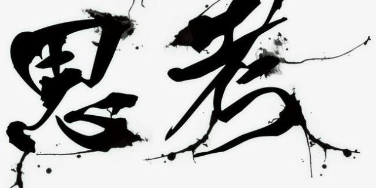](https://zhuanlan.zhihu.com/p/121719442)

## 2.3、**材质模型-Material Mode**

我们的材质模式是迪士尼的材质模型的简化版本，着眼于实时渲染的效率。限制参数的数量对于优化G-Buffer的空间十分重要，减少贴图的空间占用和存取，并且最小化在像素着色器中混合材质图形的成本。

下面是我们的基础材质模型：

- 基本颜色BaseColor　   单一颜色。更容易理解的概念
- 金属度Metallic　　　　不需要理解电介质和导体的反射率，更少的错误空间
- 粗糙度Roughness　　  它的概念非常清晰，相反的是光泽度gloss通常需要解释
- Cavity                                用于表示小规模的遮蔽（这个似乎在最终的版本上，并没有出现）

**基本颜色，金属度，粗糙度**与迪士尼的模型相同，但是Cavity参数并没有在Disney的模型中被提及。所以我们来重点介绍一下Cavity。Cavity用于指定比运行时阴影系统能够处理的几何体更小的阴影，通常是由于几何体只存在于法线图中（**译者注**：这句话翻译的比较绕。其实应该是说，由于这些几何体的渲染很多都是依赖法线贴图来表现一些细节，但是，Cavity要求的会更精细。）。例如地板板之间的裂缝或衣服的缝隙。

最值得注意的遗漏是Specular参数。实际上，我们在完成Infiltrator演示之前一直在继续使用这个参数，但最终我们并不喜欢它。首先，我们觉得 "specular  "是一个很糟糕的参数名称，它造成了很多混乱，而且在一定程度上不利于从艺术家控制镜面强度到控制粗糙度的过渡。艺术家和图形程序员都普遍忘记了它的范围，以为默认值是1，而实际默认值是Burley的0.5（对应4%的反射率）。Specular被有效使用的案例几乎都是为了小范围的阴影处理。我们发现可变折射率（IOR）对于非金属来说并不重要，所以我们最近用更容易理解的Cavity参数取代了Specular。非金属的F0现在是一个常数0.04。（**译者注**：引擎中依然使用镜面反射参数，镜面反射参数输入范围[0,1]，默认为0.5，F0的值为镜面反射参数*0.08。后面关于为什么没有取消，也有介绍。）

以下是迪斯尼模型中的参数，我们选择不在我们的基础Material Model中采用，而是作为特殊情况处理。（**译者注**：下面简单介绍了一下不采用的原因，有一些是开销，有一个干脆是不知道Disney的哥们是咋做的。呵呵。。。外国人也挺实在。）

- 次表面Subsurface　　   阴影贴图的采样不同
- 各向异性Anisotropy　　需要更多的IBL采样
- 清漆ClearCoat　　　　 需要双倍的IBL采样
- 辉光Sheen　　　　　    在Burley的笔记中没有很好的定义

除了Subsurface之外，我们没有在生产中使用过这些特殊情况下的模型，而Subsurface在我们的*Elemental*演示中被用于制作更好效果的冰。此外，我们还有一个专门针对皮肤的着色模型。在未来，我们正在考虑采用一种混合Deferred/Forwarding着色方法，以更好地支持更多的特殊着色模型。目前，我们采用的是纯粹的延迟着色方法，不同的着色模型是通过存储在G-Buffer中的着色模型ID的动态分支来处理的。（**译者注：**从UE现在的代码中看，它支持布料-Cloth、头发-Hair、眼睛-Eye、双面树叶-Two sided Foliage、预积分皮肤效果-Pre-Integrated Skin、次表面分布图-SubSurface  Profile效果等。当然，从材质模型和提供各种不同的效果实现，这还不是一个概念，但是，利用UE选择的材质模型，至少能比较好地支撑很多效果的实现。）

### 2.3.1 Experiences 体验

有一种情况，我现在已经经历了好几次了。我会告诉刚开始过渡到使用不同的*Roughness*的艺术家，"像以前使用SpecularColor一样使用*Roughness*”，不久后我就会听到兴奋地惊讶地说道："这下好用了！" 但后面有一个有趣的评论是："*Roughness*的感觉是反的。" 事实证明，艺术家们希望看到他们所创作的贴图是按照下面的规律来展现的-更亮的纹素等于更亮的镜面高光。如果图像存储*Roughness*，那么明亮相当于更高的*Roughness*，而这将导致不那么强烈的Specular效果。（**译者注**：后面这半段是在解释Artist为什么觉得是反的。）

我还收到过无数次的问题是：”Metallic是二元的吗？（**译者注**：表示非0即1）”对于这个问题，我最初会解释混合材料或分层材料的微妙之处。后来我了解到，最好是直接说 "是的！" 原因是一开始的艺术家们不愿意把参数设置成绝对值；我发现金属的Metallic值为0.8的情况很常见。接下来讨论的Material  Layers，应该是描述99%的情况下Metallic不是0就是1的方式。

在过渡过程中，我们也遇到了一些问题，这些材质将不能再被复制。其中最重要的一组问题来自于目前Epic公司正在制作的游戏《Fortnite-堡垒之夜》。《Fortnite》采用了非真实感渲染的艺术方向，并特意使用了互补色的漫反射和镜面反射，这在物理上是不可行的，也是我们的新Material模型中故意不能重现的。经过长时间的讨论后，我们决定继续支持旧的DiffuseColor/SpecularColor作为引擎切换，以保持Fortnite的质量，因为当时Fortnite已经进入开发阶段。但是，我们不认为新的模型会像迪士尼在《Wreck-It Ralph》中使用的那样，排除了非真实感的渲染模型，我们打算在未来的项目中继续支持使用非真实感的渲染模型。

### 2.3.2 材质分层-Material Layers

与我们之前的方法相比，将来自于共享库的Material Layers进行混合提供了许多好处，之前的方法是单独指定材质的参数，而在新的方法中，这些参数的值来自于为每个特定模型制作的纹理。

\- 在多个Assets中复用以前的工作；

\- 减少了单一Asset的复杂性；

\- 统一和集中了游戏外观所使用的材质，使美术和技术方向更容易。

为了完全接受这种新的工作流程，我们需要重新思考我们的工具。虚幻引擎在UE3的早期就有一个基于节点图的材质编辑器。这个节点图指定了输入（纹理、常量）、操作和输出，并将其编译成着色器代码。

尽管材质分层是这项工作的主要目标，但出乎意料的是，在工具端几乎不需要添加什么东西来支持材质层的创建和混合。UE4的材质编辑器中的节点图的部分已经可以被分组到函数中，并从多个材质中使用。这个功能对于实现材质图层来说是很自然的。将材质层保留在我们基于节点的编辑器中，而不是作为一个固定的函数系统放在上面，这使得图层可以以可编程的方式进行映射和组合。

为了简化工作流程，我们添加了一个新的数据类型，即材质属性，它保存了所有的材质输出数据。这个新的类型和我们的其他类型一样，可以作为单引脚传入和传出材料函数，也可以沿线传递，直接输出。有了这些变化，材质图层可以像以前的纹理一样，拖入、组合、操作和输出材质图层，就像以前的纹理一样。事实上，由于采用了图层，大多数的材质图往往会更简单，因为采用图层是定制给特定材质的主要东西，所以图层是如何映射和混合的。这比以前的参数特定操作要简单得多。

由于有一个小的线性材质参数集，实际上完全在着色器中混合图层是非常实用的。我们觉得这比纯粹的离线合成系统的质量有了很大的提高。由于能够在不同频率下映射数据，纹理数据的表观分辨率可以非常高：每个顶点或低频纹理数据可以是唯一的，图层混合蒙版、法线贴图和Cavity贴图在每个网格中指定，材料层在网格表面上分层。更高级的情况下，可能会使用更多的频率。虽然由于着色器的成本问题，我们可以使用的图层数量实际上是有限的，但是，我们的艺术家还没有发现很多被限制的情况。 （**译者注**：这里使用了很多频率，在原文中是Frequency，翻译是没问题，但是，我不是太理解这个具体指的什么含义。哪位大神有更好的理解，可以评论分享下。）

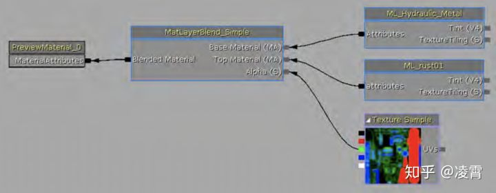图6：在UE4材质编辑器中的简单材质分层

一个值得关注的地方是，案例中的艺术家通过将一个网格分割成多个部分来绕过了in-shader分层的限制，导致了更多的Draw Call。虽然我们期望在UE4中，由于CPU端代码优化，我们会有更少的Draw  Call次数，但这似乎是未来可能会成为问题的根源。我们还没有研究的一个领域是使用动态分支来降低图层100%覆盖的区域的着色器成本。

到目前为止，我们在Material Layers方面的体验是非常正面的。我们已经看到，既得到了效率的提高，也看到了质量的大幅提升。我们希望通过改进Material  Layer库的UI界面，使艺术家们更容易找到和预览图层。除了目前的运行时系统外，我们还打算研究一个离线合成/烘烤系统，以支持更多的图层并提供更好的可扩展性。

图7：许多材质层进行互换，并与铁锈来进行混合

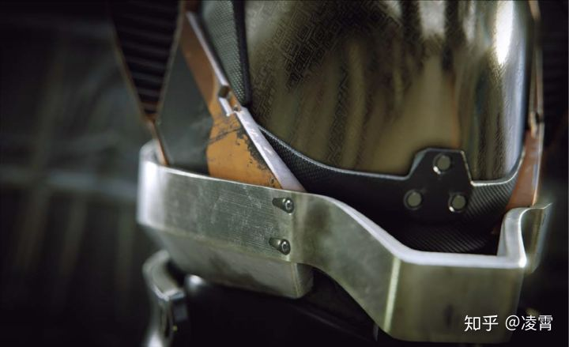图8：利用多频率的细节处理产生的Material Layer的结果

> 译者注：在UE4中，提供了两个比较容易混淆的概念，分别是”Layered Material-分层材质“和”Material Layers-材质图层“。
> 分层材质：可以将分层材质想像成“材质内的材质”。它们提供了一种方法来创建单个具有一系列子材质（即 *层*）的材质，这些子材质可以使用按像素的操作（例如蒙版）放在对象表面上。它们适合于处理独特表面类型之间的复杂混合。在上面的火箭图中，最右边的火箭使用了单独的材质层，包括铬合金、铝和铜，并且按像素在各材质之间进行混合。此效果可通过分层材质轻松实现。
> 材质图层：材质图层使您能够使用新的材质图层和材质图层混合资源来 **将您的材质组合在堆栈中**。这使您能够无需手动构建节点部分即可构建正确的材质图表。该功能类似于Material函数，但支持创建子实例。

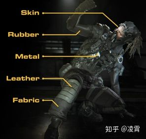分层材质的示例

## 2.4、光照模型-Lighting Model

正如着色一样，我们希望光照模型也能更偏向物理来提高我们的展现效果。我们投入研究的两个领域是光照衰减和非精确发射源（non-punctual sources of emission）——通常被称之为区域光源（Area Lights）。

### 2.4.1、光照衰减

提升光照衰减的质量是相当直接的：我们采纳了物理精确的反平方衰减并切换到光度学的光通量的亮度单位。在改变这个衰减模型后，我们需要解决一个小问题：这种衰减函数没有办法直接处理无穷远处光的能量才能衰减到0的问题。出于效率的考量——无论是实时计算还是离线计算——我们依然需要人工限制灯光的影响。有许多的方式可以实现[4]，但是我们选择对多数的灯光影响保持相对不受影响的方式去修改反平方函数，同时提供一个逐渐过渡到0的方案。一个比较好的性质是通过修改灯光的半径并不会改变它的有效亮度。当光照被艺术性的锁定时，这个属性是非常重要的，但是因为性能的原因灯光范围依然需要调整。

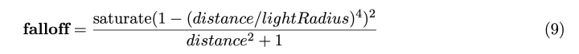

分母中的1是为了防止函数在靠近光源的距离上产生接近无穷大的值，它可以作为某些不需要表现物理准确性的情况下，让艺术家可以进行调整的参数。

这种简单的改变所带来的质量差异，特别是在有很多局部光源的场景中是很重要的，它很可能是性能和效果折中的最后手段。（**译者注**：原文这句话非常难理解，我使用意译的方式。意思是说，在有很多Local Light的时候，可以通过这个分母的调整，来调整光所影响的范围，从而提升运算效率。）

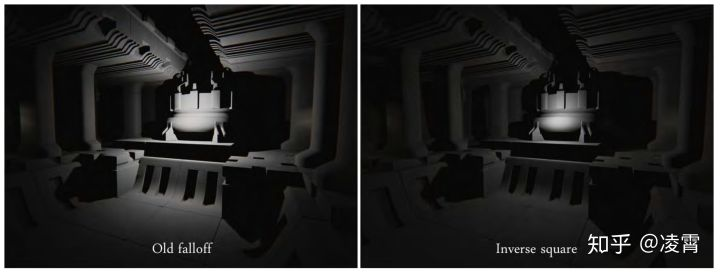图9：反平方衰减的方案带来了更自然的渲染效果

### 2.4.2、区域光

区域光源不只是产生更逼真的图像。在使用基于物理材料时，它们也相当重要。我们发现，如果没有它们，艺术家们往往在直觉上会避免画出非常低的粗糙度值，因为这导致了无限小的镜面高光，看起来很不自然。从本质上说，他们试图重现来自准点光源的区域照明效果。

不幸的是，这种反应导致了阴影和照明之间的耦合，打破了基于物理渲染的核心原则之一：当材质在不同的光照环境中使用时，不需要对材质进行修改，而这些材质的光照环境与创建时的环境不同。

区域灯是一个活跃的研究领域。在离线渲染中，常见的解决方案是从光源表面的许多点进行光照-使用均匀采样或重要性采样[12][20]。这对于实时渲染来说完全不切实际。在讨论可能的解决方案之前，我们的要求是这样的。

\- 一致的材质外观：用于漫反射BRDF和镜面反射BRDF评估的能量不能是显著不同。

\- 当实心角接近零时，接近点光模型：我们不想让我们的着色模型失去任何一个方面来实现这个目标。

\- 足够快，可以在任何地方使用：否则，我们无法解决上述的 "偏差roughness "问题。

### 2.4.2.1 Billboard反射

Billboard反射[13]是一种可用于离散光源的IBL形式。将存储发射光的二维图像映射到三维空间中的一个矩形图像上。类似于环境贴图预滤波，对图像进行不同大小的镜面分布锥体进行预滤波。从这个图像中计算镜面阴影可以被认为是一种圆锥追踪的形式，其中一个圆锥近似于镜面NDF。在圆锥中心的射线与Billboard的平面相交。然后将图像空间中的相交点作为纹理坐标，并以相交处的圆锥半径作为纹理坐标，推导出一个适当的预滤波mipmap级别。但是，可悲的是，虽然图像可以直接表达非常复杂的区域光源，但Billboard反射由于以下原因未能满足我们的第二个要求。

\- 图像是在一个平面上进行预过滤的，所以在图像空间中可以表示的实体角是有限的。

\- 当光线不与平面相交时，就无法获得Lighting的数据。

\- 光向量l是未知的，或者假设为反射向量。

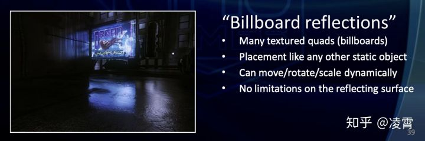[13]这个PPT中关于Billboard Reflection的介绍

> 译者注：这个Billboard反射是UE3中提供的一个feature，从[13]中可以看出来。作者在这里拿出来将，只是说，对于区域光这个领域的最新研究和实践进展，以及是否作为一个比较重要的参考实现。

### **2.4.2.2、椎体相交-Cone Intersection**

锥体追踪不需要预先过滤，可以通过分析来完成。我们实验过的一个版本是用Oat的圆锥与球体相交方程[15]来追踪圆锥，但成本太高，不实用。最近由Drobot[7]提出的另一种方法是将圆锥与面向阴影点的圆盘相交。然后在相交区域上进行多项式近似NDF的多项式积分。

随着Drobot最近的进步，这似乎是一个有趣的研究领域，但就目前的形式来看，它并不能满足我们的要求。由于使用圆锥体，镜面分布必须是径向对称的。这排除了拉伸高光，这是微表面Specular模型的一个非常重要的特征。此外，就像广告牌反射一样，也没有办法定义出一个光的方向向量，而这个恰恰是Shading模型所必须的。

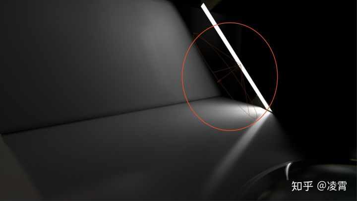[7]中的一个案例，可以看出是使用Cone来模拟一个矩形光源

> 译者注：[7]是Guerrilla Games公司进行的《Lighting Killzone : Shadow Fall》演讲。这个主要是在Guerrilla  Games公司对基于物理的Lighting和Area Lighting的报告内容。在这个PPT中，针对Area Light，他们都是采用Cone Interaction的方式来处理的。显然，从本文的角度上看，并不认为使用Cone来模拟Area  Light是一个适应广泛的方式。虽然，从效果来看，也不是不能接受。下面给一张他们公司产品《KillZone》的截图。
> Guerrilla Games是一家隶属于Sony Interactive Entertainment LLC的荷兰第一方游戏开发商，曾为索尼电脑娱乐开发[杀戮地带](https://link.zhihu.com/?target=https%3A//baike.baidu.com/item/%E6%9D%80%E6%88%AE%E5%9C%B0%E5%B8%A6/8813674)以及为Eidos Interactive开发越南1967。

《KillZone-杀戮地带》的截图

### **2.4.2.3、镜面反射D修改-Specular D Modification**

我们去年提出的一种方法[14]是根据光源的实心角来修改镜面分布。这背后的理论是认为光源的分布与相应的圆锥角D(h)相同。将一个分布与另一个分布进行卷积运算，可以通过将两个圆锥角相加得到一个新的圆锥。为此，将方程3中的α换算成有效锥角，加上光源的角度，再换算回来。现在用这个α′来代替α。我们用下面的近似值来实现这个目的。

虽然效率很高，但遗憾的是，这种技术并不能满足我们的第一个要求，因为当用大面积的灯光照射时，非常有光泽的材料会显得很粗糙。这听起来可能很明显，但当镜面NDF是紧凑的，例如Blinn-Phong，这种技术的效果要好得多，从而更好地匹配光源的分布。对于我们所选择的Shading模型（基于GGX），这并不可行。

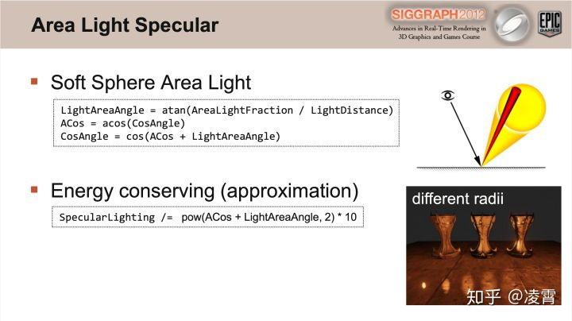

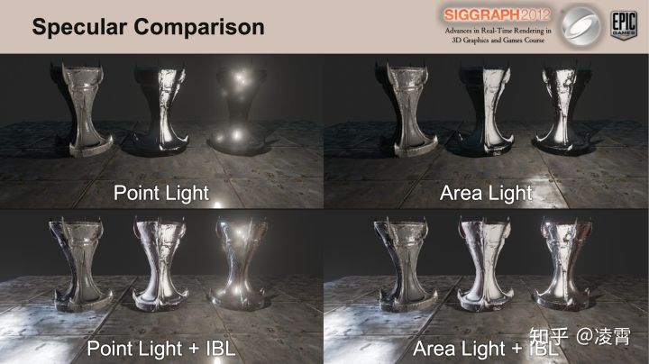

> **译者注**：上面两页PPT是文中提及到的[14]中的内容。从第二张PPT中，可以看到四张对比图中间的奖杯表现的确实不是特别好。

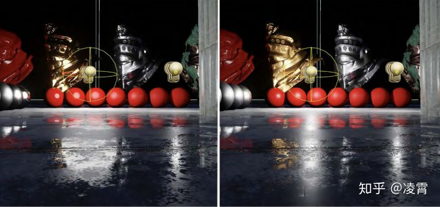图10：左侧为参考，右侧为Specular D修改下的效果。由于光源是球形的面积光，在gloosy比较高的材质以及在掠射角度下显示的比较粗糙，如抛光后的铜头所示。

### 2.4.2.4、代表点-Representative Point

如果对于一个特定的着色点（Shading Point），我们可以把来自区域光的所有光都看作是来自光源表面上的一个代表点，那么我们的着色模型就可以直接使用了。一个合理的选择是贡献最大的点。对于Phong分布来说，这是光源上与反射光线夹角最小的点。

这种技术之前已经发表过[16][22]，但能量守恒问题一直没有得到解决。通过移动发射光的原点，我们有效地增加了光的实体角，但没有补偿额外的能量。纠正它比除以实心角略微复杂一些，因为能量差异取决于镜面分布。例如，对于粗糙的材质，改变入射光的方向会导致能量的变化很小，但对于有光泽的材质，能量的变化可能是巨大的。

> **译者注**：[22]的摘要：在大多数的渲染系统中，区域光源被分解成许多点光源，这需要繁重的计算才能得到逼真的结果。在本文中，我们提出了一种新颖的方法：**用点光源近似区域光源，对着色模型的每个分量进行点光源的近似**。点光源的位置和强度取决于场景点的位置和方向。因此，场景的渲染是利用即时的点光源进行着色。我们工作的关键贡献在于，我们能够实时地用任意形状和任意强度分布的区域光源进行遮光，并且遮光模型可以是通用的。而且计算成本与区域光源的复杂度无关。实验结果表明，我们的方法所产生的结果与地面真相相当。我们的方法可以扩展到其他类型的局部光源，如弧形光源和体积光源等。

[[PDF\] One-Shot Approximate Local Shading | Semantic Scholar](https://link.zhihu.com/?target=https%3A//www.semanticscholar.org/paper/One-Shot-Approximate-Local-Shading-Wang-Lin/5ff1eed023f9f9c77d787a00d10a5d443f1525a0)[www.semanticscholar.org](https://link.zhihu.com/?target=https%3A//www.semanticscholar.org/paper/One-Shot-Approximate-Local-Shading-Wang-Lin/5ff1eed023f9f9c77d787a00d10a5d443f1525a0)

图：跟Mental Ray进行对比。这里的光源是一个Disk形状的。

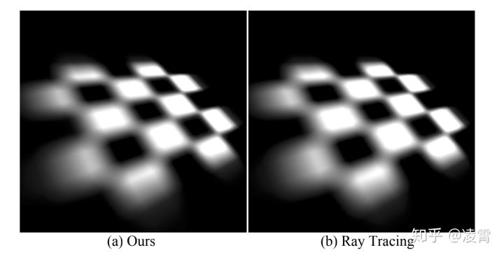图：跟光追模型进行对比。这里的光源是一个checker board模式。

### 2.4.2.5、**球形光-Sphere Lights**

如果球在地平线之上，球形光的辐照度等于点光[18]。尽管反直觉，如果我们接受误差，这意味着当球落在地平线之下的时候，我们仅仅需要处理镜面反射光照。我们通过寻找距离射线最小的点近似发现与反射射线之间最小的角度的点。对于一个球这是简单明了的：

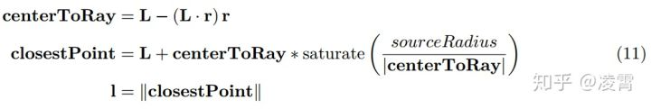

这里，L是从着色点到光源中心的向量，并且sourceRadius是灯光球体的半径，r是反射向量。在这个案例中，射线与球相交，计算点将会是射线到球体中心的最近点。一旦标准化，它就是相同的。

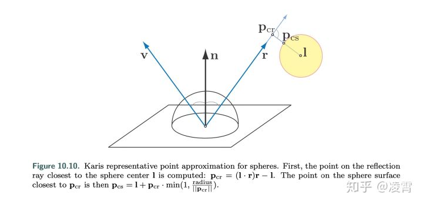图：《Real-Time Rendering 4》中的一张图

> 从这张图中， ![[公式]](RealShading_UE4_2.assets/equation.svg) 是最后选中的closet point，然后，光线的方向就是从![[公式]](https://www.zhihu.com/equation?tex=P_%7Bcs%7D)到P。

通过移动发射光的原点到球的表面，我们通过球的对角高效的拓宽了镜面反射分布。尽管它不是一个微表面的分布，这可以用标准化的Phong分布来解释。

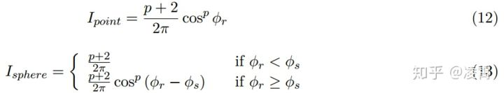

这里 ![[公式]](https://www.zhihu.com/equation?tex=%CF%95_%7Br%7D) 是r和L之间的夹角，并且 ![[公式]](https://www.zhihu.com/equation?tex=%CF%95_%7Bs%7D) 是球对角的半角， ![[公式]](RealShading_UE4_2.assets/equation.svg) 是标准化的，意味着积分的结果在半球上为1。 ![[公式]](RealShading_UE4_2.assets/equation.svg) 显然不再标准化并取决于p的指数，积分可以大的多。

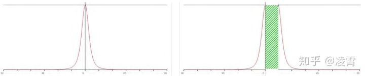图11：用等式13解释的拓宽效应的可视化

为了近似模拟能量上的增长，我们拓宽了光的实心角分布，应用之前描述的镜面反射D修改。我们使用标准化因子实现更广泛的分布并替换初始的标准化因子。对于GGX，标准化因子是1/πα2。为了对代表点操作推导一个近似的标准化，我们将新的拓宽的标准化因子除以初始的标准化因子：

代表点方法的结果满足我们所有的需求。通过正确的处理能量守恒，无论光源大小如何，材质表现一致。光滑材质依然提供了锐利边缘的镜面反射高光，并且因为它只是修改了BRDF的输入，我们的着色模型不会受任何影响。最后，它足够高效，允许我们的艺术家在任何地方使用它。

**2.4.2.6、灯管-Tube Lights**

球形灯对于表现**灯泡**有帮助，灯管（胶囊体）对于表现现实世界中相当广泛的荧光灯有帮助。开始，我们用一个有长度但是半径为0，也被称为线性灯光来解决灯管。只要线段在水平线之上，线段的辐照度可以被解析地积分[16,17]。

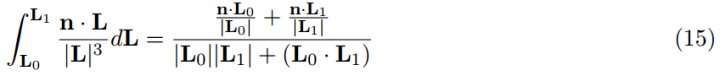

这里 ![[公式]](RealShading_UE4_2.assets/equation.svg) 和 ![[公式]](RealShading_UE4_2.assets/equation.svg) 是从着色点到线段终点的向量。

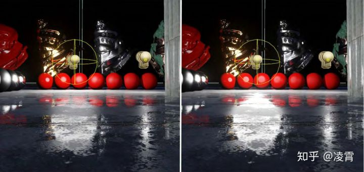图12：左边为参考，右边是代表点方法。尽管能量守恒不完美，我们的近似值与参考值匹配得令人信服。

我们修改了这个方程式来防止辐照度为负值，除以0，并且当长度为0时匹配我们的点光衰减。

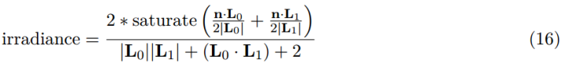

对于线性光镜面反射我们需要在下面的方程组里解出t：

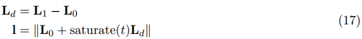

Picott[16]发现与r最小角的t的值：

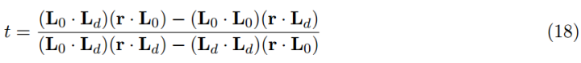

和球形光的案例相似，我们近似了最小角并且求解，而不采用最短距离的求解方法：

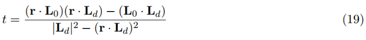

这会造成边界没有正常处理的情况，这样就不能总是找到最近点，但是这样计算起来成本略低，并且看起来提供了方程式18一样合理的结果。

注意，这是因为方程式18和19都把r视作一条线段而不是射线是重要的，解决方案都未能正确处理指向远离线段的射线。甚至对于完美的平面，这会造成从一个结束点到另一个结束点的生硬变化。我们通过在计算点和每一个结束点之间选择来解决这个问题，但是这样做成本较高。此时我们只好接受了这个瑕疵。

为了使能量守恒，我们应用了用于球形光的相同概念。镜面反射分布通过灯光的对角已经被拓宽，但是这次只是一维的，所以我们使用GGX的各向异性版本[2]。各向异性GGX的标准化因子是1/παxαy，在各向同性案例中，这里αx=αy=α，这给了我们：

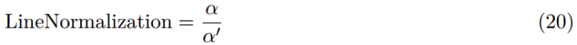

因为我们只改变了灯光的原点并应用了一个能量守恒项，这些操作可以被加速。用线段和球来做，近似形状的卷积并且很好的模拟了灯管的表现。灯管的结果展示在图13。

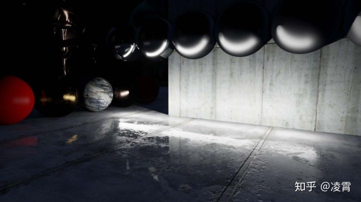图13：使用能量守恒的代表点方法的灯管

## **3、结论**

我们在着色，材质和灯光领域转向基于物理的实现，已经被证实是非常成功的。在我们最近的《渗透者》demo的图形部分贡献极大，并且我们计划在未来所有的项目中使用这些实现。事实上，这些改变的可行部分已经集成进《堡垒之夜》，在这项工作开始之前便已经进展顺利的项目。我们打算在这些领域以实现更高的灵活性的目的继续提升，并且提升目标是各种场景和所有级别的硬件可以享受基于物理方法的好处的可扩展性。

## 4、鸣谢

我要感谢Epic Games，特别是渲染团队中的每一个人在这项工作和艺术家，提供了方向、  反馈，并最终做出美丽的东西与它的艺术家们的手。我要特别感谢Śebastien  Lagarde，他发现了我的重要性取样数学中的一个错误，当修复后导致我们的环境BRDF解决方案的发展。永远不要低估了在全球范围内有才华的授权者来查看你写的代码是多么有价值。最后，我要感谢Stephen Hill和Stephen McAuley，感谢他们的反馈。

------

翻译这篇文章，花了不少时间，也收获了很多。简单写一下个人感受：

1、整个变化虽然是从Shading Model、Material Model、Lighting  Model三个方向进行的，但是，核心思想都是2013年前后，整个引擎行业向真实物理靠近的趋势的指引下开展的。尤其是在看这些论文的时候，能够感受到当时整个行业的变化与发展的迫切性；

2、从当时的分享和论文中，其实，应该看到各个公司针对如何向真实渲染改变，进行了非常多的尝试。说实话，从最终作品的角度来看，其实都挺好的。最后Disney给了一整套参考实现，才算是在行业内起到了一锤定音的效果；

3、从行业的研究热点来看，基本上还是围绕着间接光照、Area Light以及阴影产生等方面，当然，专项地对于皮肤、头发等等的研究也很多，但是，对于引擎来说，可能还是从最基本的角度来看问题。

4、温故可以知新，这对于看未来的发展同样具有非常重要的价值；

**参考文献：**

[1] AMD, CubeMapGen: Cubemap Filtering and Mipchain Generation Tool. [http://developer.amd](https://link.zhihu.com/?target=http%3A//developer.amd). com/resources/archive/archived-tools/gpu-tools-archive/cubemapgen/

[2] Burley, Brent, “Physically-Based Shading at Disney”, part of “Practical Physically Based Shading in Film and Game Production”, SIGGRAPH 2012  Course Notes. [http://blog.selfshadow.com/](https://link.zhihu.com/?target=http%3A//blog.selfshadow.com/) publications/s2012-shading-course/

[3] Colbert, Mark, and Jaroslav Krivanek, “GPU-based Importance Sampling”,  in Hubert Nguyen, ed., GPU Gems 3, Addison-Wesley, pp. 459–479, 2007. [http://http.developer.nvidia.com/](https://link.zhihu.com/?target=http%3A//http.developer.nvidia.com/) GPUGems3/gpugems3_ch20.html

[4] Coffin, Christina, “SPU Based Deferred Shading in Battlefield 3 for Playstation 3”, Game Developers Conference, March 2011. [http://www.slideshare.net/DICEStudio/spubased-deferred-](https://link.zhihu.com/?target=http%3A//www.slideshare.net/DICEStudio/spubased-deferred-) shading-in-battlefield-3-for-playstation-3

[5] Cook, Robert L., and Kenneth E. Torrance, “A Reflectance Model for  Computer Graphics”, Computer Graphics (SIGGRAPH ’81 Proceedings), pp.  307–316, July 1981.

[6] Cook, Robert L., and Kenneth E. Torrance,  “A Reflectance Model for Computer Graphics”, ACM Transactions on  Graphics, vol. 1, no. 1, pp. 7–24, January 1982. [http://graphics.pixar](https://link.zhihu.com/?target=http%3A//graphics.pixar). com/library/ReflectanceModel/

[7] Drobot, Michal􏰀, “Lighting Killzone: Shadow Fall”, Digital Dragons, April 2013. [http://www](https://link.zhihu.com/?target=http%3A//www). [http://guerrilla-games.com/publications/](https://link.zhihu.com/?target=http%3A//guerrilla-games.com/publications/)

[8] Gotanda, Yoshiharu, “Practical Implementation of Physically-Based  Shading Models at tri-Ace”, part of “Physically-Based Shading Models in  Film and Game Production”, SIGGRAPH 2010 Course Notes. [http://renderwonk.com/publications/s2010-shading-course/](https://link.zhihu.com/?target=http%3A//renderwonk.com/publications/s2010-shading-course/)

[9] Hoffman, Naty, “Background: Physics and Math of Shading”, part of  “Physically Based Shad- ing in Theory and Practice”, SIGGRAPH 2013  Course Notes. [http://blog.selfshadow.com/](https://link.zhihu.com/?target=http%3A//blog.selfshadow.com/) publications/s2013-shading-course/

[10] Lagarde, S ́ebastien, “Spherical Gaussian approximation for Blinn-Phong, Phong and Fresnel”, June 2012. [http://seblagarde.wordpress.com/2012/06/03/spherical-gaussien-approximation-](https://link.zhihu.com/?target=http%3A//seblagarde.wordpress.com/2012/06/03/spherical-gaussien-approximation-) for-blinn-phong-phong-and-fresnel/

[11] Lazarov, Dimitar, “Getting More Physical in Call of Duty: Black Ops  II”, part of “Physi- cally Based Shading in Theory and Practice”,  SIGGRAPH 2013 Course Notes. [http://blog](https://link.zhihu.com/?target=http%3A//blog). [http://selfshadow.com/publications/s2013-shading-course/](https://link.zhihu.com/?target=http%3A//selfshadow.com/publications/s2013-shading-course/)

[12] Martinez, Adam, “Faster Photorealism in Wonderland: Physically-Based  Shading and Lighting at Sony Pictures Imageworks”, part of  “Physically-Based Shading Models in Film and Game Pro- duction”,  SIGGRAPH 2010 Course Notes. [http://renderwonk.com/publications/s2010-shading-](https://link.zhihu.com/?target=http%3A//renderwonk.com/publications/s2010-shading-) course/

[13] Mittring, Martin, and Bryan Dudash, “The Technology Behind the DirectX  11 Unreal Engine Samaritan Demo”, Game Developer Conference 2011. [http://udn.epicgames.com/Three/rsrc/](https://link.zhihu.com/?target=http%3A//udn.epicgames.com/Three/rsrc/) Three/DirectX11Rendering/MartinM_GDC11_DX11_presentation.pdf

[14] Mittring, Martin, “The Technology Behind the Unreal Engine 4 Elemental  demo”, part of “Ad- vances in Real-Time Rendering in 3D Graphics and  Games Course”, SIGGRAPH 2012. http: //[http://www.unrealengine.com/files/misc/The_Technology_Behind_the_Elemental_Demo_16x9_(2)](https://link.zhihu.com/?target=http%3A//www.unrealengine.com/files/misc/The_Technology_Behind_the_Elemental_Demo_16x9_(2)).pdf

[15] Oat, Chris, “Ambient Aperture Lighting”, SIGGRAPH 2006. [http://developer.amd.com/](https://link.zhihu.com/?target=http%3A//developer.amd.com/) wordpress/media/2012/10/Oat-AmbientApetureLighting.pdf

[16] Picott, Kevin P., “Extensions of the Linear and Area Lighting Models”,  Computers and Graphics, Volume 12 Issue 2, March 1992, pp. 31-38. [http://dx.doi.org/10.1109/38.124286](https://link.zhihu.com/?target=http%3A//dx.doi.org/10.1109/38.124286)

[17] Poulin, Pierre, and John Amanatides, “Shading and Shadowing with Linear Light Sources”, IEEE Computer Graphics and Applications, 1991. [http://www.cse.yorku.ca/~amana/research/](https://link.zhihu.com/?target=http%3A//www.cse.yorku.ca/~amana/research/)

[18] Quilez, Inigo, “Spherical ambient occlusion”, 2006. [http://www.iquilezles.org/www/articles/](https://link.zhihu.com/?target=http%3A//www.iquilezles.org/www/articles/) sphereao/sphereao.htm

[19] Schlick, Christophe, “An Inexpensive BRDF Model for Physically-based  Rendering”, Computer Graphics Forum, vol. 13, no. 3, Sept. 1994, pp.  149–162. [http://dept-info.labri.u-bordeaux.fr/](https://link.zhihu.com/?target=http%3A//dept-info.labri.u-bordeaux.fr/) ~schlick/DOC/eur2.html

[20] Snow, Ben, “Terminators and Iron Men: Image-based lighting and physical shading at ILM”, part of “Physically-Based Shading Models in Film and  Game Production”, SIGGRAPH 2010 Course Notes. [http://renderwonk.com/publications/s2010-shading-course/](https://link.zhihu.com/?target=http%3A//renderwonk.com/publications/s2010-shading-course/)

[21] Walter, Bruce, Stephen R. Marschner, Hongsong Li, Kenneth E. Torrance,  “Microfacet Models for Refraction through Rough Surfaces”, Eurographics  Symposium on Rendering (2007), 195–206, June 2007. [http://www.cs.cornell.edu/~srm/publications/EGSR07-btdf.html](https://link.zhihu.com/?target=http%3A//www.cs.cornell.edu/~srm/publications/EGSR07-btdf.html)

[22] Wang, Lifeng, Zhouchen Lin, Wenle Wang, and Kai Fu, “One-Shot Approximate Local Shading” 2006.