# Rendering in UE4

Presented at the Gnomon School of VFX in January 2018, part two of  the class offers an in-depth look at the rendering pipeline in Unreal  Engine, its terminology and best practices for rendering scenes in  real-time. This course also presents guidelines and profiling techniques  that improve the debugging process for both CPU and GPU performance.

分7个部分介绍UE4中的渲染管线。

## Index

- 1.Intro
- 2.Before Rendering
- 3.Geometry Rendering
- 4.Rasterizing and Gbuffer
- 5.Dynamic Lighting/Shadows
- 6.Static Lighting/Shadows
- 7.Post Processing

## 1.INTRO

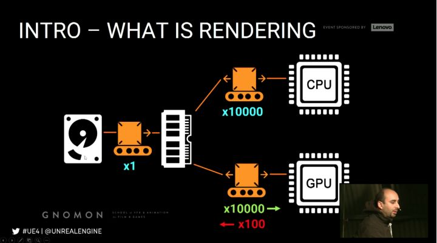

- Everything needs to be as efficient as possible
- Adjust piplelines to engine and hardware restrictions
- Try to offload parts to pre-calculations
- Use the engine's pool of techniques to achieve quality at suitable cost
- CPU and GPU handle different parts of teh rendering calculations
- They are interdependent and can bottleneck each other
- Know how the load is distributed between the 2
- 不仅仅用来渲染高质量的静态图片，也用来渲染有交互的动态场景。
- Quality Features Performance 三者间的权衡
- 调节引擎的pipelines和硬件限制
- 进行预计算

**Shadring techniques**

- Real time rendering techniques are differnt fromm offline rendering
- Expensive ray-tracing features are approximated or pre-calculated
- Depends on projection(rasterization)
- Shading/lighting are mainly done either through defferred or Forward shading UE4 supports both

**Deferred Shading**

1.Composition based using the GBuffer

2.Shading happens in deferred passes

3.Good at rendering dynamic lighting

4.More flexible when it comes to disabling feature,less flexible when it comes to surface attributes

延迟渲染：通过GBuffer，渲染动态光照更有优势。当涉及到禁用特性时，更灵活，在涉及表面属性时不那么灵活。

============================================

## 2.BEFORE RENDERING

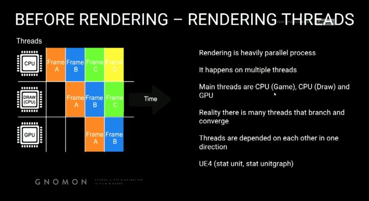

**CPU-Game Thread**

Calculate all logic and transforms

- 1.Animations
- 2.Position of models and objects
- 3.Physics
- 4.AI
- 5.Spawn and destroy,Hide and Unhide

Anything that relates to the posistion of objects to change

CPU阶段计算所有的逻辑和转换，动画，坐标，物理属性，创建和销毁

============================================

**CPU-Draw Thread**

Before we can use the transforms to rendering the image we need to know what to include in the rendering

Ignoring this question might make rendering expensive on GPU

Occlusion process-Builds up a list of all visible models/objects

Happens per object-Not per triangle

Stage process-in order of execution

- 1.Distance Culling
- 2.Frustum Culling
- 3.Precomputed Visibility
- 4.Occlusion Culling

几种剔除：距离剔除，视锥剔除，预计算，遮挡剔除。

剔除具体到物体，而不是三角面

============================================

**Occlusion Performance Implications**

UE4 has a list of models to render

- 1.Set up manual culling(i.e.distance culling,pre-coputed vis)
- 2.Even things like particles occlude
- 3.Many small objects cause more stress on CPU for culling
- 4.Large models will rarely occlude and thus increase GPU
- 5.Know your world and balance objects size vs count

性能分析，1.设置距离剔除，预计算来提高性能

2.小物体太多影响性能，大物体基本上不影响遮挡

3.找到平衡，场景中物体的大小的数量。

## 3.GEOMETRY RENDERING

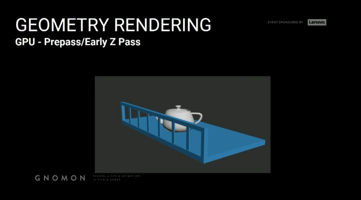

**GPU-Prepass/Early z pass**

The GPU now has a list of models and transforms but if we just render  this info out we could possibly cause a lot of redundant pixel  rendering

Similar to excluding objects,we need to exclude pixels

We need to figure out which pixels are occlluded

To do this, we generate a depth pass and use it to determine if the given pixel is in front and visible

z pass 来处理像素的渲染，被遮挡的不渲染。
 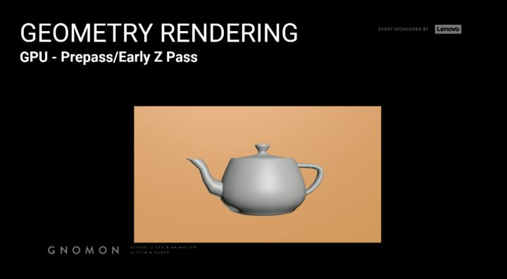

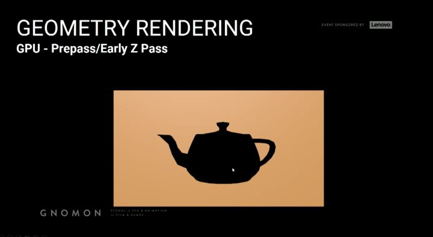

============================================

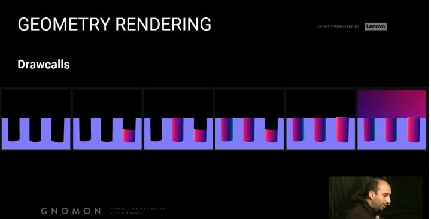

**Drawcalls**

GPU renders drawcall by drawcall not triangle by traingle

A drawcall is group of tris sharing the same properties

Drawcalls are prepared by the CPU(Draw) thread

Distilling rendering info for objects into a GPU state ready for submission

GPU 渲染物体通过drawcall 而不是三角形，CPU阶段提交drawcall到GPU state

============================================

**UE4 with current gen high-end PCs**

2000-3000 is reasonable

More than 5000 is getting high

More than 10000 is probably a problem

On mobile this number is far lower(few hundred max)

Drawcalls count is determined by visible objects

Measure with "stat RHI"

UE4 三角面的数量问题。Drawcall 次数受可见物体的影响

============================================

**Drawcalls have a huge impact on the CPU(Draw) thread**

Has high overhaead for preparing GPU state

Usually we hit the issues with Drawcalls way before issues with tri count

GPU state之前，Drawcall相比tri count的问题，要优先解决。

============================================

**Drawcalls Performance Implications**

1.Render your triangles with as few Drawcalls as possible

2.50000 triangles can run worse than 50 million dependent on scene setup(Drawcalls)

3.When optimizing scene,know your bottleneck(Drawcalls vs Tri count)

性能分析

1.尽可能少的drawcall

2.50000triangles有可能跑的比50million性能更差，视drawcall情况

3.优化场景的时候注意自己的瓶颈，是三角面还是drawcall

============================================

**Optimizing Drawcalls (Merging objects)**

To lower the drawcalls it is better to use fewer larger models than many small ones

You cannot do that too much,it impacts other things negatively

- a. Occlusion
- b. Lightmapping
- c. Collision calculation
- d. Memory

Good balance between size and count is a good strategy

优化Drawcall：合并场景的，更少更大的模型，多个方面作用，剔除，光照贴图，遮挡计算，内存

============================================

**Optimizing Drawcalls (Merging guidelines) 合并准则**

1.Target low poly objects

2.Merge only meshes within the same area

3.Merge only meshes sharing the same material

4.Meshes with no or simple collision are better for merging

5.Distant geometry is usually great to merge(fine with culling)

合并准则:

1.低模多边形

2.相同区域的meshes

3.合并相同材质的mesh

4.相同遮挡或者不被遮挡的物体

5.远距离的mesh(被精确剔除的)

============================================

**Optimizing Drawcalls (HLODs)**

Hierarical level of Detail

- a.Regular LODs means a model becomes lower poly in the distance
- b.Essentially swaps one object for another simpler object(less materials)
- c.Hierical Lod(HLOD) is a bigger version, it merges objects together in the distance to lower the drawcalls

优化Drawcalls（HLOD）
 Lod 分层细节绘制。远距离视野的单个组合 静态网格体 替代多个 静态网格体，降低每帧的drawcalls数量以提升性能。

**do Instanced Rendering**

- a.Groups objecs together into single drawcalls
- b.Grouping need to be done manually
   使用Instance来减少drawcall调用

============================================

Strategy is to mix all prvious solutions

Some merged content(Materials merged)

Some modular content(instanced)

and swapable LODs and HLODs

多方面优化Drawcalls

============================================

**Vertex Processing**

First thing processing the Drawcall

Vertex shader takes care of this process

Vertex shader is a small program specialized in vertex processing

Runs completely on the GPU and so they are fast

Input is vertex data in 3D space output vertex data in screen-space

**Vertex-Shaders-Common tasks**

It converts local VTX positions to world position

It handles vertex shading/coloring

It can apply additional offsets to vertex positions

VS的作用：

本地空间到世界空间转换

处理顶点颜色

将偏移量作用在顶点上

============================================

Practical examples of world position offset vertex shaders are

1.Cloth

2.Water displacement

3.Foliage wind animation

具体应用：布料运动，水的运动，风中的叶子。

============================================

**Vertex Shaders - Drawback**

vertex Shaders do not modify the actual object or affect the scene state, it is purely a visual effect

The CPU is not aware of what the vertex shaders do

Thus things like physics or collisions will not take it into account

vs注意事项：
 不影响实际场景，只是一种视觉效果

CPU不知道vs做了什么，物理碰撞不会在vs阶段考虑。

============================================

**Vertex shader Performance Implications**

- 1.The more complex the animation performed the slower
- 2.The more vertices affected the slower
- 3.Disable complex vertex sahder effects on distant geometry

性能分析：
 动画越复杂，点越多性能越慢。远距离的可以禁用vs特效

============================================

## 4.RASTERIZING AND GBUFFER

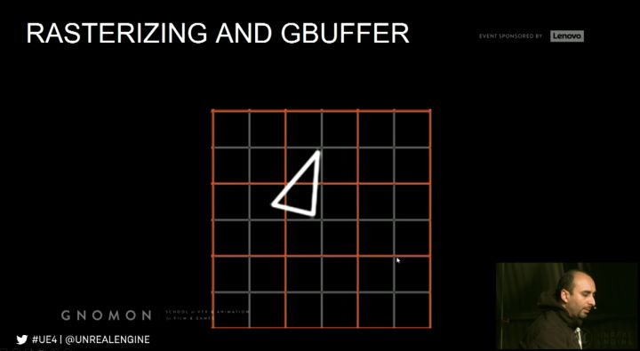

**Rasterzing**

GPU ready to render pixels

Determine which pixels should be shaded called rasterizing

Done drawcall by drawcall then tri by tri

Pixel Shaders are responsible for calculating the pixel color

Input is generally interpolated vertex data, texture samplers

**Rasterizing inefficiency**

When rasterizing dense meshes at distance, they converge to only few pixels

A waste of vertex processing

A 100k tris object seen from so far away that it would be 1 pixel big,will only show 1 pixel of its closest triangle!

光栅化：ps处理vs阶段传来的顶点信息，距离特别远的mesh，可能占的像素特别小，会浪费许多vs阶段的性能。

============================================

Overshading

Due to hardware design, it always uses a 2x2 pixel quad for processing

If a traingle is very small or very thin then it means it might process 4 pixels while only 1 pixel is actually filled

由于硬件的原因，每次处理2x2 4个像素

============================================

Rasterization and Overshading Performance Implications

1. Triangles are more expensive to render in great density
2. When seen at a distance the density increases
3. Thus reducing triangle count at a distance(lodding/culling) is critical
4. Very thin triangles are inefficient because they pass through many 2x2 pixel quads yet only fill a fraction of them
5. The more complex the pixel shader is the more expensive

性能分析：密度大的三角面，性能要求高。距离远密度会变大，尽可能降低三角面个数，thin tri资源消耗大。

============================================

Results are written out to:

Multiple Gbuffers in case of deferred shading

Shaded buffer in case of forward shading

光栅化后的数据用在延迟光照的Gbuffer中。

GBuffer PPerformance Implications

The GBuffer takes up a lot of memory and bandwidth and thus has a limit on how many different GBuffer images you can render out

Gbuffers memory is resolutions dependent

性能分析：GBuffer占用大量内存带宽，能渲染出的GBuffer数量有限。

## 5.LIGHT AND SHADOWS

Two approaches for lighting and shadows

- Dynamic
- static

**Lighting(Deferred Shading)**

Is calclated and applied using pixel shaders

Dynamic point lights are rendered as spheres

The spheres act like a mask

Anything within the sphere is to receive a pixel shader operation to blend in the dynamic light

动态点光源渲染成球体，相当于一个蒙版遮罩，遮罩内的像素，在ps里面做混合

============================================

Light calculation requires position

Depth buffer used to get pixels pos in 3D

Use normal buffer to appley shading.Direct between Normal and light

计算光照，深度depth buffer和Normal buffer共同作用，计算光照。

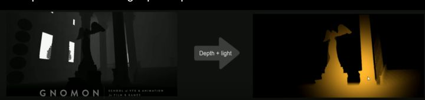

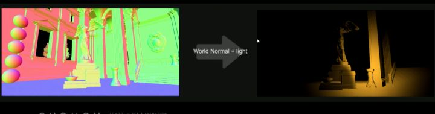

============================================

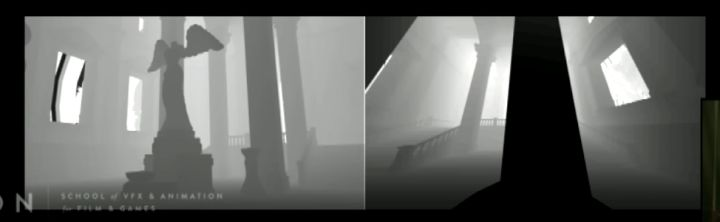

**Shadows**

Common technique for rendering shadows is Shadow Maps

Check for each pixel if it is visible to the given light or no

Requires rendering depth for light Pov

在light view空间下，渲染shadow map。

Process Pros/Cons

- Pros 
  - 1. Is rendered in real time using the GBuffer
  - Lights can be changed,moved,or add
  - Does not need any special model preparation
- Cons 
  - Especially shadows are performance heavy

利弊分析：
 利：利用GBuffer实时渲染可以动态调整灯光
 弊：性能代价

============================================

**Quality Pros/Cons**

1. Shadows are heavy on performance, so usually render quality is reduced to compensate
2. Doea not do radiosity/global illumination for majority of content
3. Dynamic soft shadows are very hard to do well, dyn shadows ofter looks sharp or blocky

质量利弊：
 性能代价大，降低质量提高性能；无法渲染自发光和全局光照；动态软阴影效果差。

============================================

**Dynamic Lighting Performance Implications**

1. Small dyn light is relatively cheap in a deferred renderer
2. The cost is down to the pixel shader operations, so the more pixels the slower it is
3. the radius must be as small as possible
4. Prevent excessive and regular overlap

动态光照性能分析：
 延迟渲染动态光源小，性能占用较小。
 成本受ps影响，处理像素越多，越慢。
 半径尽量小。避免过度叠加。

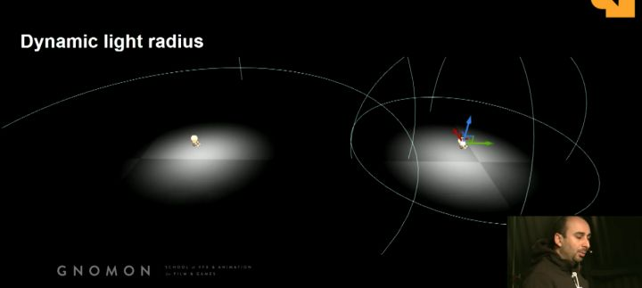

============================================

**Dynamic Shadows Performance Implication**

1. Turn off shadow casting if not needed
2. The tri count of geometry affect shadows perf
3. Fade or toggle off shadows when far away

动态阴影性能分析：
 关闭不必要的阴影，三角面数量影响阴影效果，距离远的时候简化阴影。

## 6.STATIC LIGHTING AND SHADOWS

Dynamic lights and shadows expensive

Thus part of it is offloaded to pre-calculations/pre-rendering

This is referred as static lights and shadows

Lighting data stored mainly in lightmaps
 动态光照昂贵，使用lightmap。

**Lightmaps**

A lightmap is a texture with the lighting and shadows baked into it

An object usually requires UV lightmap coordinates for this to work

This texture is then multiplied on top of the basecolor

将光照信息烘焙到原有的纹理信息上。

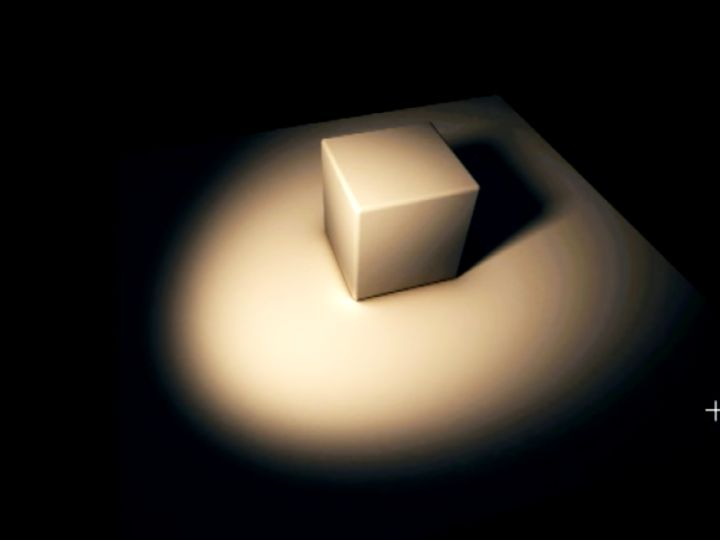

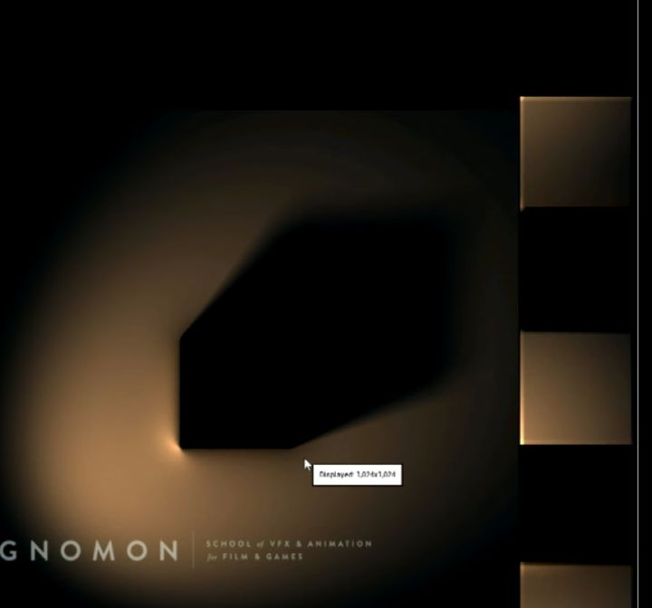

============================================

**Lightmass**

Stand alone application that handles light rendering,baking to lightmaps and integerating into materials

Raytracer supporting Gl

Supports distributed rendering over a network

Bake quality is determined by Light Build Quality as well as settings in the Lightmass section of each level

Better to have a lightmass importance Volume around part of the scene

光照烘焙：单独的模块处理光照渲染。支持全局光照，烘焙区域和质量可调节。

============================================

**Process Pros/Cons**

1. Super fast for performance in real-time, but increases memory
2. Takes a long time to pre-calculate the lighting
3. Each time something is changed,it must be re-rendered again
4. Models require lightmap UVs,this additional prep step that takes time

利弊分析：
 速度更快，但内存增加；须要花时间预处理；场景改变重新烘焙；模型须要光照uv

============================================

Quality Pros/Cons

1. Handles Radiosity and Global Illumination
2. Renders realistic shadows including soft shadows
3. Quality is dependent on lightmap resolution and UV layout
4. May have seams in the lighting due to the UV layout

质量利弊：
 可以处理辐射度和全局光照；
 可以渲染逼真的阴影；
 质量受lightmap分辨率和uv布局影响；
 uv布局影响可能出现缝隙；

============================================

**Static Lighting Performance Implications**

1. Static Lighting always renders at the same speed
2. Lightmap resolution affects memory and filesize,not framerate
3. Bake time are increased by: 
   - Lightmap resolutions
   - Number of models/light
   - Higher quality settings
   - Lights with a large attenuation radius or source radius

**静态光照性能分析：**
 光照贴图影响内存和文件大小。贴图分辨率增大，灯光和模型增加，质量提高，光源半径增大都会导致烘焙时间增多。

============================================

## 7.POST PROCESSING

Visual effects applied at the very end of the rendering process

Uses the GBuffers to calculate its effects

Once more relies heavily on Pixel Shaders

后处理：
 使用Gbuffer计算效果。

Example:

- light Bloom
- Depth of Field/Blurring
- Some types of lensflares
- Light Shafts
- Vignette
- Tonemapping/Color correction
- Exposure
- Motion Blur

光晕效果，
 景深/模糊，
 光泽贴图/颜色校正，
 曝光，
 运动模糊。

**Post Processing Performance Implications**

Affected directly by final resolution

Affected by shader complexity

Parameter(e.g.DoF blur radius)

后处理性能分析：
 受分辨率影响；受shader复杂度影响；参数影响，如模糊半径。

### 参考视频：

Gnomon Masterclass Part II: Rendering in UE4 | Event Coverage | Unreal Engine

https://www.youtube.com/watch?v=kp3zcyZZBVY

Presented at the Gnomon School of VFX in January 2018, part two of  the class offers an in-depth look at the rendering pipeline in Unreal  Engine, its terminology and best practices for rendering scenes in  real-time. This course also presents guidelines and profiling techniques  that improve the debugging process for both CPU and GPU performance.