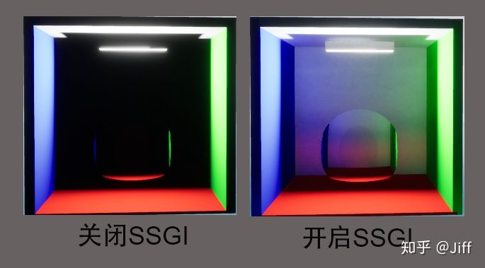
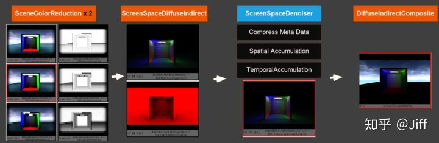
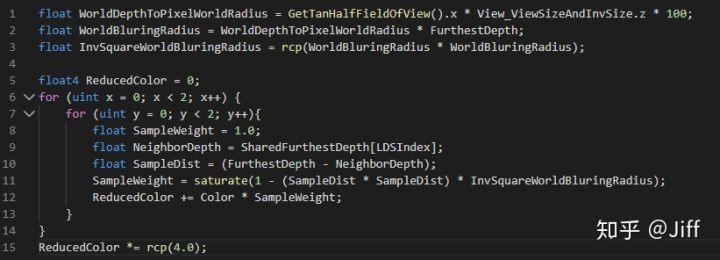
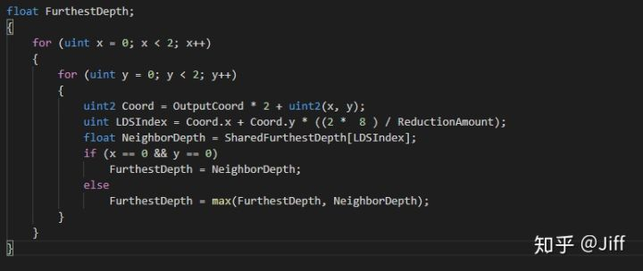
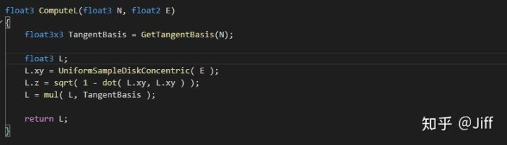
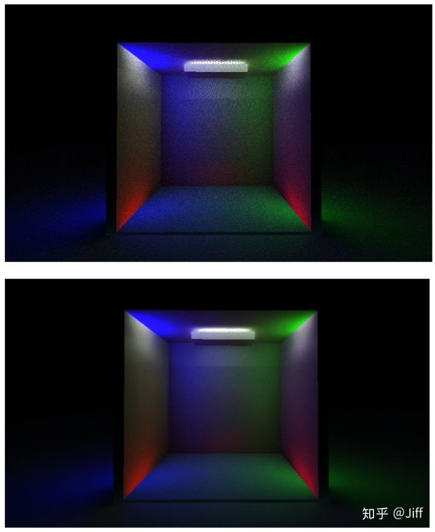
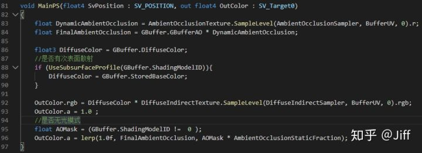

# UE4.24 SSGI实现分析

## **SSGI简介** 

UE4.24的Roadmap里可以看到SSGI(Screen Space Global  Illumination，屏幕空间全局光照)已经发布，这是一个非常廉价的实时GI方案，适合要求不那么高，不支持光追的硬件或性能敏感的应用场景。先建个简单的场景，镜花水月的看看效果对比：

可以看到左边是关闭SSGI之后，远半部BoxScene一片死黑；右边开启SSGI之后，远半部BoxScene内部已经被照亮。

## **SSGI的相关选项**

**SSGI开启选项**：控制变量为 **r.SSGI.Enable ,0关闭SSGI，1开启SSGI,默认值为0**

**质量选项：**控制变量为**r.SSGI.Quality ,默认值为4，取值范围为{1,2,3,4},**值越大质量越高，当然性能会成反比

**SSGI RT分辨率:** 控制变量为**r.SSGI.HalfRes，0为否，1为是，默认值为0，**即关闭HalfResolution,用Half Resolution会提高SSGI的性能，使处理的像素减少到原来的1/4，但同时也会降低SSGI的质量，增加噪点

**SSGI是否使用使用无漏光的SceneColor :** 控制变量为**r.SSGI.LeakFreeReprojection**，**取值范围为{0,1} ，默认值为0。**这是SSGI选项中唯一一个会有点疑问的变量——实际上它并不能解决漏光，它确定的是：你要用上一帧的SceneColor或是用当前帧的TAA  History来做为当前的SSGI的输入数据。因为TAA的History基于移动指数方式混合了更多的前帧数据，只是相对来说后者可能导致更多的漏光罢了。

## **SSGI的基本流程**

SSGI的实现分为4步，共计7个Pass，其中第3步的Denoiser实现不表，其它部分共4个Pass，步骤如下：

- **准备数据阶段(Reduction)**：2个PASS，生成PreFrame的SceneColorTexture和HZBTexture的mipmap  。这一步有两个Pass，生成5个mipmap。生成mipmap的算法和单纯的纹理生成mipmap不同，不是简单的取上一级mip对应4个相邻像素的均值做为本级mip。SceneColorTexture在生成mipmap的时候，会从Depth Buffer中还原当前像素及相邻像素WorldPosition  ，使用WorldPosition之间的距离平方衰减其Color影响。具体代码整理如下：

HZB Texture的mipmap生成则是存储上一级mip对应的4个相邻像素中的z的最大值。

上述的SceneColorTexture和HZB Texture均使用上一帧的数据做为输入。上一部分我们提到过**r.SSGI.LeakFreeReprojection**的值会影响到这两项数据的来源：如果**r.SSGI.LeakFreeReprojection为1,**则使用的是原生的上一帧的SceneColor,否则使用的是TAA的History。

**SSGI在大的渲染流程中被调用早于Lighting相关的Pass,也早于TAA相关的PASS，大胆推测一下这么设计的原因：不使用本帧数据而使用上一帧的数据作为输入的目的，一是因为SSGI发生在Lighting之前，如果使用当前帧的数据则Buffer中无光照信息（但这不应该是大的问题，因为他们可以把此Pass放到Lighting相关Pass之后），二是因为使用前帧数据能有效的保证SSGI充分获得TAA的好处而不出现闪烁（SSGI Pass不能放在本帧的TAA PASS之后——它可能带来新的Aliasing问题，这样就需要在其后面添加新的AA PASS）。**

- **SSGI Raycast : SSGI  RayCast是在一个PASS里完成的，它同时计算了AO和Diffuse反弹，所以它的输出包含一份IndirectDiffuseOutput和一份AmbientOcclusionOutput。**

​        这个PASS的实现有几个值得注意的地方，一一列举如下

​       1.它基本上沿袭了SSAO的光线发射方式，因  为作用在屏幕空间有大量的场景数据缺失，所以光线发射不只是上半球（所以必然是有偏的）而是在屏幕空间的同轴圆，故可能最终采样的射线是布满整个球的。

2.它的RayCast过程也颇为有趣，其RayCast过程不光是step不均匀(普通优化手段，用于产生非grid状的cast结果)。**UE4的Scene Space RayCast step是打包执行的，一次执行4步 ，并且每隔两步就增加其采样目标纹理的mip  level。其中打包的部分可以理解为充分利用GPU的向量化执行特性的优化，而后一部分增加目标纹理的mip level就费解一些了。**代码经过整理且加上了注释，如下**：**

**每执行2步就增加mip level的做法带来一个结果：离光线原点越远的地方，采样到的mip level越低，结果越模糊，即离光线越远，采样到的原始scene  color的范围越大（低级的mip相当于高级mip更大范围内像素颜色的加权平均值），其实挺合理（当然SceneColor部分会带来漏光，而Ambient部分则是阴影泄漏)。**

- **ScreenSpace Denoise ：由SSGI Raycast带来的结果是充满噪点的，所以降噪就尤其重要**。UE4的SSGI所使用的降噪器和RTX使用的相同，实际上应该说实时RTX这一波应用，完全就是因为降噪技术的贡献才使其成为可能。SS Denoiser这一课题值得单独开篇去讲，这儿就此略过，补图看看降噪前后的效果对比。

- **合成GI影响到DiffuseColor和AO，**混合降噪之后的间接Diffuse和AO到DefferedColor中**。**DefferedColor后续会继续叠加SSR、SkyLight、光照图、直接光照==其它贡献。混合过程过于简单，直接上代码

## **SSGI的一些不足之处**

- **不是无偏，所以结果不可能完全正确（主流的实时RTX实现也不是无偏的,用低密度的spp+降噪达到较平滑较低方差的结果）**
- **无法反射屏幕外的像素，所以可能会有光和阴影的泄漏**
- **目前的实现只有单次反弹，所以能提供的照度较低，无法照亮需要多次反弹的区域（如没有直接光照的房间，幽深的山洞==）**

## **SSGI 实现代码清单**

**C++部分**

C++代码入口在RenderScreenSpaceDiffuseIndirect中。

**Shader部分**

SSRTPrevFrameReduction.usf（实现数据准备mip生成）

SSRTDiffuseIndirect.usf(具体的RayCast Pass的实现,其中raycast核心函数为

**CastScreenSpaceRay**)

DiffuseIndirectComposite.usf(SSGI的合成实现）

编辑于 20:48