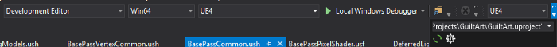
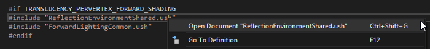
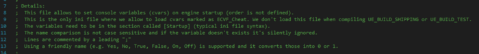
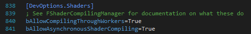
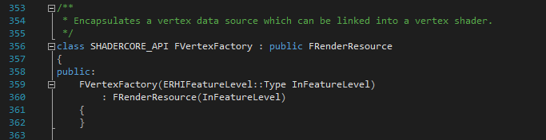

# Unreal Engine 4 Rendering Part 1: Introduction

# Introduction

Unreal  Engine 4’s rendering system is endlessly configurable and supports most  of the latest generation rendering techniques across multiple  platforms. Writing materials in Unreal is very accessible thanks to the  node-based editor but people are often hesitant about diving in deeper  than that due to the rendering system’s complexity and lack of  accessible educational content.

Epic Game’s Photo Realistic Character Example

The  information has been broken up into several posts which have been  outlined below. They’re written building on the information presented in  the previous post, but feel free to jump around if desired. Each post  contains information that roughly groups together the multiple parts of  the render system that make up a particular step in the overall system.  There are two tutorial posts at the end of the series which will jump  around between the systems we have learned about and shows how to make  some specific changes to the areas we’ve learned about!

When  I set out to add a new Shading Model to Unreal, I struggled to  understand how the different parts of the rendering system went  together. There are a few existing tutorials on how to do this, but  without explaining how the systems went together I found it hard to make  changes beyond just copying what the tutorial did.

Therefor, the goal of this series is to help outline how the different parts of the render system *are connected together* as opposed to *looking at the technical implementation*  of any given part. This series is going to focus on the deferred  shading pipeline from the CPU and GPU side but doesn’t go too in-depth  about the shadowing system, translucent objects or post effects. Because  we tend not to look at the specific implementation details our goal is  to let you get a feeling for what classes and functions are worth  investigating for further self exploration.

# Posts in this Series

1. Introduction  & Setup - That’s this post! This post explains tools and  configuration settings that will make our development life easier.
2. [Shaders and Vertex Factories](https://medium.com/@lordned/unreal-engine-4-rendering-part-2-shaders-and-vertex-data-80317e1ae5f3)  - This post will cover the C++ side of how Unreal creates instances of  shaders and links them to their corresponding HLSL code, as well as how  Unreal gets vertex data onto the GPU.
3. [Drawing Policies and Drawing Policy Factories](https://medium.com/@lordned/unreal-engine-4-rendering-part-3-drawing-policies-89bb1a3c641b)  - This post covers how Unreal uses the right shader variations for  different techniques and how the engine knows what order to draw  different passes in.
4. [Shader Architecture](https://medium.com/@lordned/unreal-engine-4-rendering-part-4-the-deferred-shading-pipeline-389fc0175789)  - This post covers the deferred shading pipeline on the GPU and follows  the order of how a particular pixel takes lighting and shadowing into  account.
5. [Shader Iteration Tips](https://medium.com/@lordned/unreal-engine-4-rendering-part-5-shader-permutations-2b975e503dd4)  - Iterating on shaders can be quite time consuming due to permutation  compiling so this post will look at ways to spend less time compiling  shaders.
6. [Tutorial on adding a new Shading Model](https://medium.com/@lordned/ue4-rendering-part-6-adding-a-new-shading-model-e2972b40d72d)  - This post will cover how to add a toon-like material that respects  PBR properties. This is based on an older blog post by Felix Kate.
7. **(Coming Soon)** Modifying  the Base Pass via Geometry Shader - This post explains how to modify  the deferred base pass to add support for Geometry Shaders and creates a  silhouette shader based on these changes.

# Article Limitations

As  much as I would like to cover all aspects of Unreal’s rendering  capabilities, there’s simply too much to cover. Because of this, I’ve  chosen to limit the explanation down to the most common areas. **This series will focus on the deferred shading** **pipeline** and  will ignore Unreal’s mobile and clustered forward renderers. Unreal’s  Mobile and Forward shading pipelines use a different set of classes  (both C++ and HLSL) but they should follow relatively similar patterns  and they do share some functions/data structures with the main deferred  shading pipeline. On the shader side we will ignore translucency and  instanced stereo as they’re mostly just preprocessor defined variations  of the existing code; Per-platform variations will also be ignored for  the same reason. On the C++ side we mostly ignore the shadow casting  side of things.

Something  worth noting is that various code snippets may be abbreviated and  simplified. A lot of the apparent complexity of the engine comes from  all the various preprocessor defined variations, so we will ignore those  for the sake of learning. **This means that this is a series of overview posts, and not a specific tutorial!**  That being said, there are two tutorial posts, at the end of this of  this series (Post 6 and Post 7) which will give specific examples of  modifying the deferred shading pipeline.

# Engine Setup

**You must be building the engine from GitHub source code.**  You may be able to get away with modifying existing shaders using the  Epic Games Launcher version, but adding new shading models and things  like that will require engine source. If you plan to be debugging C++  code often, it’s worth building a “**Debug Editor”** profile version of the engine, instead of *Debug Game* or *Development Editor*.  Being comfortable with C++, HLSL and templates is a plus, though not  required due to the goal being theory more than technical.

UnrealVS is a great addition to Visual Studio for working with UE4 engine builds too!

Below is a list of recommended setup changes and explanations as to what they do and why you might want them.

## HLSL Tools for Visual Studio

This can be found [at this URL](https://marketplace.visualstudio.com/items?itemName=TimGJones.HLSLToolsforVisualStudio),  as a free extension for Visual Studio. This enables basic HLSL syntax  highlighting and Go to Definition for Unreal’s .usf/.ush files. To make  it work with .usf/.ush files you will need to [follow the instruction in one of the author’s tweets](https://twitter.com/_tim_jones_/status/707968702176571392) to add them via the `Tools > Text Editor > File Extensions` section of the editor.

## RenderDoc

[RenderDoc ](https://github.com/baldurk/renderdoc)is  an amazing tool for inspecting what’s going on in the GPU. RenderDoc  will let you see draw calls, inspect the data as it passes through each  stage on the GPU and (combined with some flags below) show you the  source code that Unreal is producing and running . Once downloaded and  installed there’s a RenderDoc plugin pre-installed in Unreal that you  can enable which adds a capture button to the main viewport.

RenderDoc lets you break down a frame draw call by draw call and inspect GPU data!

## Modifying ConsoleVariables.ini

This file is located in the `\Engine\Config\`  directory and lets you specify values for variables to be set before  the engine is started up. Most of these variables are already in there  and explained.

Setting **r.ShaderDevelopmentMode=1**  will make Unreal prompt you for a shader recompile when the default  material fails to compile. Under normal conditions Unreal will crash if  it cannot compile the default material (for use as a fallback) so this  makes Unreal prompt us and allows us to fix the compile error and retry  without having to restart the editor. **Note:** If  you have the debugger attached Unreal will still hit an assert even if  this is enabled. This behavior can be disabled by commenting out an if  statement in *ShaderCompiler.cpp* near the middle of `FShaderCompilingManager::HandlePotentialRetryOnError` just search for `FPlatformMisc::DebugBreak().`

Setting **r.Shaders.Optimize=0** and **r.Shaders.KeepDebugInfo=1**  makes Unreal instruct the shader compile to use lower levels of  optimizations and to leave debug info. Lower levels of optimization  should cut down on compile times and leaving the debug info in the  shader will allow better debugging through RenderDoc.

Setting **r.DumpShaderDebugInfo=1** and **r.DumpShaderDebugShortNames=1**  can be useful in certain situations. This writes generated HLSL to disk  (which is about 2gb worth of data on an empty project), but I’ve found  using RenderDoc to be a more effective debug tool. The second one just  shortens the names of various things to help it fit under OS maximum  path lengths.

## Modifying BaseEngine.ini

If you scroll down to the **[DevOptions.Shaders]** section you will find **bAllowCompilingThroughWorker=True,** and **bAllowAsynchronousShaderCompiling=True**.  These two flags combined will allow Unreal to do multi-threaded  compiling of all the required shader maps. It can be useful to turn  these off if you are trying to debug a section of the C++ shader  pipeline (so that it only works on one shader at a time) but it will  make shader compiles take a really long time!

## Start an Empty Project

If it’s at all possible to start a new project to develop your shaders in then do it. **Every time you modify a shader file, Unreal recompiles all permutations that use that file.** This  means that if you’re poking around in some of the base shaders (like we  will be!) that you have to compile the ~125 shaders built into the  engine which generate ~10,000 permutations on their own, yikes! Having  an empty project will keep this number from getting any bigger, as it  can take around 10 minutes on an i7–4770k.

Unreal  has the ability to hot-reload some of the files in the shader pipeline  on a per-material basis. This allows you to make a change in the shader  code, modify the in-engine material and hit apply and have it reload the  shader code. **Shader source hot reloading does not work with all files you can modify**  as far as I can tell. One of the later blog posts will have a section  on speeding up iteration for testing shader changes that goes into this  in more detail.

# Helpful Links

Below  are some links to other existing documentation that may prove helpful  in your understanding or provide alternative explanations to concepts  that may make more sense to you. The articles here are linked in no  particular order.

- [Graphics Programming Overview](https://docs.unrealengine.com/latest/INT/Programming/Rendering/Overview/index.html)  Official Unreal documentation on the high-level overview of the  rendering system, includes the parallels between the game thread and the  render thread.
- [Threaded Rendering](https://docs.unrealengine.com/latest/INT/Programming/Rendering/ThreadedRendering/index.html) covers inter-thread communication between Game and Rendering, and limitations and potential race conditions.
- [Shader Development](https://docs.unrealengine.com/latest/INT/Programming/Rendering/ShaderDevelopment/index.html) covers a high-level look at vertex factories, material shaders and global shaders.
- [Coordinate Space Teminology](https://docs.unrealengine.com/latest/INT/Engine/Basics/CoordinateSpace/index.html) covers what values various spaces are in, and — more importantly — what they’re relative to!
- [How Unreal Renders a Frame](https://interplayoflight.wordpress.com/2017/10/25/how-unreal-renders-a-frame/)  covers the GPU side of a rendered frame, showing what order passes come  in and examples of what a lot of the GPU data looks like.

# Terminology

Below  are some of the terms that will come up fairly often in this series so I  felt it worth calling them out so that we’re all on the same page here.

## RHI

*Render Hardware Interface*  which is a layer that abstracts the different graphics APIs for  different platforms. All rendering commands are passed through the RHI  layer to be translated to the applicable renderer.

## Deferred Rendering

The  default renderer in Unreal Engine 4. This document is mostly limited to  this renderer. Gets its name from the fact it defers lighting/shading  calculations to a full-screen pass instead of when each mesh is drawn. A  full explanation of deferred rendering is beyond the scope of this  document, so a passing familiarity is encouraged before diving into  Unreal’s rendering codebase. More information about deferred rendering  can be found [via the Wikipedia article](https://en.wikipedia.org/wiki/Deferred_shading), a nice [compare/contrast of Forward vs Deferred](https://gamedevelopment.tutsplus.com/articles/forward-rendering-vs-deferred-rendering--gamedev-12342), and an [Intel Developer Zone example on Forward Clustered](https://software.intel.com/en-us/articles/forward-clustered-shading).

## (Clustered) Forward Rendering

Unreal’s  desktop forward rendering implementation. This topic is not covered by  this tutorial but you will come across many preprocessor defines related  to it. This is different from the mobile renderer as well, which uses a  more traditional tiled deferred renderer.

## View

A single “window” into a `FScene`. Can have multiple views for a given `FScene` (ie: local split screen) but can also have multiple `FScene`’s in the Editor. Shaders have a similar usage as they call `ResolveView()` before rendering which can be either the Player’s view, or the specific eye being rendered in VR.

## Drawing Policy / Drawing Policy Factory

Unreal  coins the term “Drawing Policy” to refer to a class that contains the  logic to render specific meshes with specific shaders. For example, the  Depth Only drawing policy finds the correct depth-only shader variant  for a given material so that objects drawn using this policy use the  optimized depth-only shaders. Drawing Policies do not tend to know  specifics about the shaders or meshes they’re rendering. A Drawing  Policy Factory is more type specific and handles creating a Drawing  Policy for each object that should be rendered and adding them to  different lists for later.

## Vertex Factory

A  Vertex Factory is a class that encapsulates a vertex data source and is  linked to the input on a vertex shader. Static Meshes, Skeletal Meshes,  and Procedural Mesh Components all use different Vertex Factories.

## Shader

In  Unreal a shader is a combination of HLSL code (in the form of .ush/.usf  files) and the contents of a material graph. When creating a material  in Unreal it compiles several shader permutations based on settings  (like shading mode) and usages.

# Next Post

In  our next post we will be covering Shaders and Vertex Factories in more  detail. We will talk about how the C++ code is bound to the HLSL code,  how the C++ code modifies variables in the HLSL code, and how you can  customize the data going into the vertex shader! That post is available [here](https://medium.com/@lordned/unreal-engine-4-rendering-part-2-shaders-and-vertex-data-80317e1ae5f3)!

# Credits

Mostly written by Matt Hoffman [@lordned](https://twitter.com/lordned), and peer reviewed by the following people: Sai Narayan [@nightmask3](https://twitter.com/nightmask3), Jeremy Abel [@jabelsjabels](https://twitter.com/jabelsjabels), Stephen Whittle [@mov_eax_rgb](https://twitter.com/mov_eax_rgb), Joe Radak [@Fr0z3nR](https://twitter.com/Fr0z3nR), Steve Biegun, Steve Davey [@llnesisll](https://twitter.com/llnesisll), and Javad Kouchakzadeh [@stoopdapoop](https://twitter.com/stoopdapoop). Thanks for sifting through 40+ pages of technical writing!