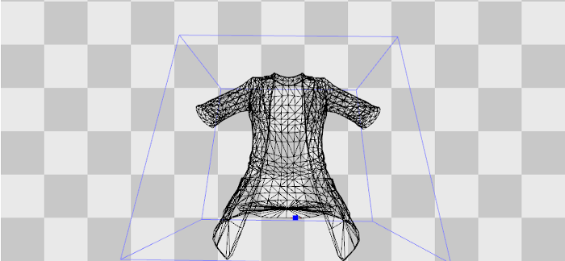
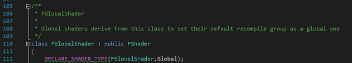
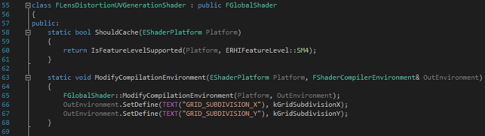
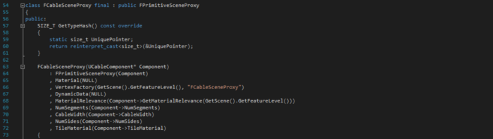
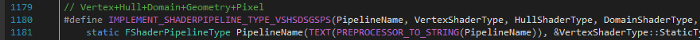

# Unreal Engine 4 Rendering Part 2: Shaders and Vertex Data

[](https://medium.com/@lordned?source=post_page---------------------------)

[Matt Hoffman](https://medium.com/@lordned?source=post_page---------------------------)

[Dec 12, 2017](https://medium.com/@lordned/unreal-engine-4-rendering-part-2-shaders-and-vertex-data-80317e1ae5f3?source=post_page---------------------------) · 9 min read

(If you haven’t read Part 1 in this series, [it is available here](https://medium.com/@lordned/unreal-engine-4-rendering-overview-part-1-c47f2da65346))

# Shaders and Vertex Factories

In this post we’re going to look at Shaders and Vertex Factories. Unreal uses some magic to bind a C++ representation of a *shader* to an equivalent HLSL class and uses a *Vertex Factory*  to control what data gets uploaded to the GPU for the vertex shader.  From this post and on we’re going to be using Unreal’s class names as we  discuss things to make them easier to look up on your own.

We’re  only going to focus on the core Shader/Vertex Factory related classes.  There are a lot of housekeeping related structs/functions related to  them which make up the glue that holds this entire system together. It  is unlikely that you will need to change any of this glue so we’re not  going to confuse things by trying to talk about them!




Vertex Output from a FLocalVertexFactory

# Shaders

The base class that all shaders in Unreal derive from is `FShader`. Unreal has two main classifications for shaders, `FGlobalShader` for cases where only one instance should exist, and `FMaterialShader` for shaders that are tied to materials. `FShader` is paired with an `FShaderResource` which keeps track of the resource on the GPU associated with that particular shader. An `FShaderResource` can be shared between multiple `FShaders` if the compiled output from the `FShader` matches an already existing one.

## FGlobalShader

This one’s pretty simple and has limited (but effective!) uses. When a shader class derives from `FGlobalShader`  it marks them to be part of the Global recompile group (which seems to  mean that they don’t recompile while the engine is open!). **Only one instance of a Global Shader exists**, which means that you can’t have per-instance parameters. However, you can have global parameters. **Examples:** FLensDistortionUVGenerationShader, `FBaseGPUSkinCacheCS` (a Compute shader for calculating mesh skinning), and `FSimpleElementVS`/`FSimpleElementPS`.




## FMaterialShader and FMeshMaterialShader

Now, onto the more complicated ones; `FMaterialShader` and `FMeshMaterialShader`. Both of these classes allow multiple instances, each one associated with its own copy of the GPU resource. `FMaterialShader` adds a `SetParameters`  function which allows the C++ code of your shader to change the values  of bound HLSL parameters. Parameter binding is accomplished through the `FShaderParameter`/`FShaderResourceParameter` classes and can be done in the Constructor of the shader, see `FSimpleElementPS` for an example. The `SetParameters`  function is called just before rendering something with that shader and  passes along a fair bit of information — including the material — which  gives you a great deal of information to be part of your calculations  for parameters that you want to change.

Now that we know how we can set shader-wide parameters, we can look at `FMeshMaterialShader`.  This adds the ability for us to set parameters in our shader before we  draw each mesh. A significant number of shaders derive from this class  as it is the *base class of all shaders that need material and vertex factory parameters* (according to the comment left on the file). This simply adds a `SetMesh`  function which is called before each mesh is drawn with it, allowing  you to modify the parameters on the GPU to suit that specific mesh. **Examples:** `TDepthOnlyVS`, `TBasePassVS`, `TBasePassPS`.

## Binding C++ to HLSL

So now that we know `FShaders` are the C++ representation of a shader on the CPU, we need to know how to associate a given `FShader` with its corresponding HLSL code. This is where our first C++ macro comes in: `IMPLEMENT_MATERIAL_SHADER_TYPE(TemplatePrefix, ShaderClass, SourceFilename, FunctionName, Frequency)`. Before explaining each parameter, let’s look at an example from *DepthRendering.cpp*:

```
IMPLEMENT_MATERIAL_SHADER_TYPE(,FDepthOnlyPS,TEXT(“/Engine/Private/DepthOnlyPixelShader.usf”),TEXT(“Main”),SF_Pixel);
```

This macro binds the C++ class `FDepthOnlyPS` to the HLSL code located in `/Engine/Private/DepthOnlyPixelShader.usf`.  Specifically, it associates with the entry point “Main”, and a  frequency of SF_Pixel. Now we have an association between our C++ code (`FDepthOnlyPS`), the HLSL file it exists in (`DepthOnlyPixelShader.usf`) and which function within that HLSL code to call (`Main`). Unreal uses the term “Frequency” to specify what type of shader is it — Vertex, Hull, Domain, Geometry, Pixel, or Compute.

You’ll  notice that this implementation ignores the first argument. This is  because this particular example isn’t a templated function. In some  cases the macro specializes a templated class, where the template class  is then instantiated by another macro in order to create specific  implementations. An example of this would be creating a variation for  each possible lighting type. If you’re curious have a peek near the top  of *BasePassRendering.cpp* with it’s `IMPLEMENT_BASEPASS_LIGHTMAPPED_SHADER_TYPE` macro… but we’ll cover it more in depth in the Base Pass article!

# Review

Implementations  of FShader are specific stages in the shading pipeline and can modify  parameters inside their HLSL code before they’re used. Unreal uses a  macro to bind the C++ code to the HLSL code. Implementing a shader from  scratch is very simple, but integrating it into the existing deferred  base pass/shading will be more complicated.

# Caching and Compilation Environments

There’s two important concepts to introduce before we go on. Unreal will automatically compile the many *many*  possible permutations of a shader for you when you modify a material.  This is a good thing, but can lead to an excessive number of unused  shaders. This introduces the `ShouldCache` function.




Unreal  will only create a particular permutation of a shader if the Shader,  Material and Vertex Factory all agree that that particular permutation  should be cached. If any one of these is false, then Unreal skips  creating a permutation, which implies that you will never end up in a  situation where this permutation can be bound together. As an example of  when would you not want to cache a shader is in the case of a shader  requiring SM5 support. If you’re building for a platform that doesn’t  support it, there is no reason to compile and cache it.

The `ShouldCache` function is a static function that can be implemented in an `FShader`, `FMaterial` or `FVertexFactory` class. Examining existing usages will give you an idea on how and when you might implement it.

The second important concept is the ability to change preprocessor defines in the HLSL code before compilation. `FShader` uses `ModifyCompilationEnvironment` (static function implemented via the macro), `FMaterial` uses `SetupMaterialEnvironment` and `FVertexFactory` uses `ModifyCompilationEnvironment` as well. These functions are called before the shader is compiled and lets you modify the HLSL preprocessor defines. `FMaterial`  uses this extensively to set shading model related defines based on  settings within that material to optimize out any unnecessary code.

## FVertexFactory

Now  that we know how to modify shaders before they go on the GPU we need to  know how to get data to the GPU in the first place! A Vertex Factory  encapsulates a vertex data source and can be linked to a Vertex shader.  If you’ve written your own rendering code before you might have been  tempted to make a class that has all possible data a vertex might want.  Unreal uses a Vertex Factory instead which lets you upload only the data  you actually need to the vertex buffer.

To understand Vertex Factories we should know about two concrete examples. `FLocalVertexFactory` and `FGPUBaseSkinVertexFactory`. `FLocalVertexFactory`  is used in many places, as it provides a simple way to transform  explicit vertex attributes from local to world space. Static meshes use  this, but so do cables and procedural meshes. Skeletal Meshes (which  need more data) on the other hand use `FGPUBaseSkinVertexFactory`. Further down we look at how the shader data that matches these two vertex factories has different data contained within them.

## FPrimitiveSceneProxy

So how does Unreal know which vertex factory to use for a mesh? Through the `FPrimitiveSceneProxy` class! A `FPrimitiveSceneProxy` is the **render thread version of a** `UPrimitiveComponent`. It’s intended that you subclass both `UPrimitiveComponent` and `FPrimitiveSceneProxy` and create specific implementations.




FCableSceneProxy a FPrimitiveSceneProxy for the dynamic cable component.

Backing  up for a moment — Unreal has a game thread and a render thread and they  shouldn’t touch data that belongs to the other thread (except through a  few specific synchronization macros). To solve this Unreal uses `UPrimitiveComponent` for the Game thread and it decides which `FPrimitiveSceneProxy` class it creates by overriding the `CreateSceneProxy()` function. The `FPrimitiveSceneProxy`  can then query the game thread (at the appropriate time) to get data  from the game thread onto the render thread so it can be processed and  placed on the GPU.

These two classes often come in pairs, and here are two great examples: `UCableComponent`/`FCableSceneProxy`, and `UImagePlateFrustrumComponent`/`FImagePlateFrustrumSceneProxy`. In the `FCableSceneProxy` the render thread looks at the data in the `UCableComponent` and builds a new mesh (calculating position, color, etc.) which is then associated with with the `FLocalVertexFactory` from earlier. `UImagePlateFrustrumComponent`  is neat because it doesn’t have a Vertex Factory at all! It just uses  the callbacks from the render thread to calculate some data and then  draws lines using that data. There is no shader or vertex factory  associated with it, it just uses the GPU callbacks to call some  immediate-mode style rendering functions.

## Binding C++ to HLSL

So  far we’ve covered different types of vertex data and how a component in  the scene creates and stores this data (through the scene proxy which *has a* vertex factory). Now we need to know how to use the unique vertex data on the GPU, especially given that there’s *only one vertex function for the basepass*  that has to handle all the different types of incoming data! If you  guessed the answer was “another C++ macro”, you’d be correct!

```
IMPLEMENT_VERTEX_FACTORY_TYPE(FactoryClass, ShaderFilename, bUsedWithmaterials, bSupportsStaticLighting, bSupportsDynamicLighting, bPrecisePrevWorldPos, bSupportsPositionOnly)
```

This macro lets us bind the C++ representation of a vertex factory to a specific HLSL file. An example would be:

```
IMPLEMENT_VERTEX_FACTORY_TYPE(FLocalVertexFactory,”/Engine/Private/LocalVertexFactory.ush”,true,true,true,true,true);
```

Now  you’ll notice something interesting here, there’s no entry point  specified (nor does one exist in that file at all)! I think the way this  actually works is quite brilliant (though confusing to learn): Unreal  changes the contents of the data structures and function calls depending  on which vertex factory you’re using while all while reusing the same  name so common code works.

We’ll look at an example: The BasePass vertex shaders take a `FVertexFactoryInput` as input. This data structure is defined in *LocalVertexFactory.ush* to have specific meaning. However, *GpuSkinVertexFactory.ush* also  defines this struct! Then, depending on which header gets included, the  data being provided to the vertex shader changes. This pattern is  repeated in other areas and will be covered in more depth in the Shader  Architecture article.

```
// Entry point for the base pass vertex shader. We can see that it takes a generic FVertexFactoryInput struct and outputs a generic FBasePassVSOutput.void Main(FVertexFactoryInput Input, out FBasePassVSOutput Output){    // This is where the Vertex Shader would calculate things based on the Input and store them in the Output.}// LocalVertexFactory.ush implements the FVertexFactoryInput structstruct FVertexFactoryInput{    float4 Position : ATTRIBUTE0;    float3 TangentX : ATTRIBUTE1;    float4 TangentZ : ATTRIBUTE2;        float4 Color : ATTRIBUTE3;    // etc…}// GpuSkinVertexFactory.ush also implements the FVertexFactoryInput structstruct FVertexFactoryInput{    float4 Position : ATTRIBUTE0;    half3 TangentX : ATTRIBUTE1;    half4 TangentZ : ATTRIBUTE2;    uint4 BlendIndices : ATTRIBUTE3;    uint4 BlendIndicesExtra : ATTRIBUTE14;    // etc…}
```

## Review

The `IMPLEMENT_MATERIAL_SHADER_TYPE`  macro defined the entry point to your shader, but a Vertex Factory  determines the data that gets passed into that vertex shader. Shaders  use non-specific variable names (such as `FVertexFactoryInput`) which are given different meanings for different Vertex Factories. `UPrimitiveComponent`/`FPrimitiveSceneProxy` work together to get data from your scene and onto the GPU with a specific data layout.

## A Footnote About Shader Pipelines

Unreal  has the concept of a “shader pipeline” where it handles multiple  shaders (vertex, pixel) together in a pipeline so it can look at the  inputs/outputs and optimize them out. They’re used in three places in  the engine: DepthRendering, MobileTranslucentRendering, and  VelocityRendering. I don’t understand them well enough to write  extensively about them, but if you’re working on any of those three  systems and you’re having issues with semantics being optimized out  between stages then investigate `IMPLEMENT_SHADERPIPELINE_TYPE_*`.




Ah yes, the unused VSHSDSGSPS type.

# Next Post

In  our next post we start looking at what a drawing policy is, what a  drawing policy factory is, and how Unreal actually tells the GPU to draw  a mesh. That post is [available here](https://medium.com/@lordned/unreal-engine-4-rendering-part-3-drawing-policies-89bb1a3c641b)!