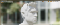
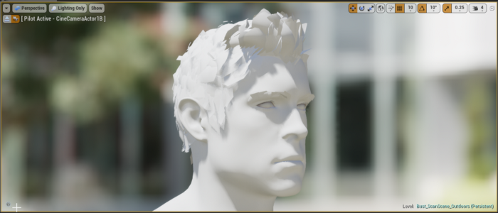
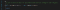
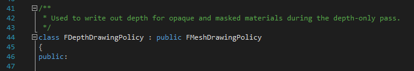
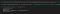
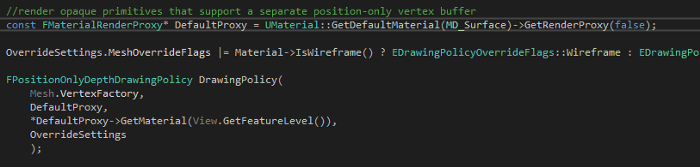
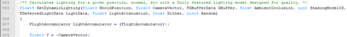

# Unreal Engine 4 Rendering Part 3: Drawing Policies

(If you haven’t read Part 2 in this series, [it is available here](https://medium.com/@lordned/unreal-engine-4-rendering-part-2-shaders-and-vertex-data-80317e1ae5f3))

# Introduction

In  this blog post we’re covering drawing policies, drawing policy  factories and how they interact with all of the systems we have learned  up to this point. We also take a quick look at what actually makes  Unreal draw a mesh!





A Lighting Only pass from Epic Game’s Photo Realistic Character example

# Drawing Policies

A  Drawing Policy in Unreal is more of a concept than a specific class, as  they don’t all share the same base class. Conceptually the drawing  policy determines which shader variations are used to draw something,  but it doesn’t pick what it draws or when it’s drawn! We’re going to  look at two drawing policies, the one for Unreal’s depth pre-pass, and  the one for Unreal’s base pass which is significantly more complicated.





One of the many Drawing Policy style classes

## FDepthDrawingPolicy

The  depth drawing policy is a good example of how simple a drawing policy  can be. In its constructor, it asks the material to find it a shader of a  specific type for a specific vertex factory:

```
VertexShader = InMaterial.GetShader<TDepthOnlyVS<false>>(VertexFactory->GetType());
```

`TDepthOnlyVS `is an implementation of the `FMeshMaterialShader`  and uses the appropriate macro to declare itself as a shader. Unreal  handles trying to compile all possible permutations of  material/shader/vertex factory, so it should be able to find this. If  you have your `ShouldCache `functions set up incorrectly then this is the point where it fails and the engine throws an assert and makes you fix it!

Then,  it looks at the material it’s supposed to draw to determine if that  material has tessellation enabled or not — if it does have it enabled  then the depth drawing policy looks for a hull and domain shader:

```
HullShader = InMaterial.GetShader<FDepthOnlyHS>(VertexFactory->GetType());DomainShader = InMaterial.GetShader<FDepthOnlyDS>(VertexFactory->GetType());
```

Drawing Policies also have the ability to set parameters on the shaders through the `SetSharedState` and `SetMeshRenderState` functions, though they usually just pass these on to the currently bound shaders.

## FBasePassDrawingPolicy

Here’s  where Unreal starts to get tricky with their macros and templates.  Let’s think about the basepass in deferred rendering for a moment. You  have lots of different materials using different hardware features (like  tessellation), using different vertex factories, and you need  light-specific variations. It’s a huge number of permutations, and  Unreal uses several macros to make this happen. **If this doesn’t make a lot of sense, don’t worry about it. It’s not too important to making changes**, just be aware it exists.

First thing they do is they make a template `FBasePassDrawingPolicy` called `template<typename LightMapPolicyType> class TBasePassDrawingPolicy : public FBasePassDrawingPolicy`  and the constructor simply calls another template function. That in  turn calls another template function, but this time with a specific enum  for each lighting type.

Now that they know what lighting policy they’re trying to get a shader for, they use the same `InMaterial.GetShader` function as the Depth drawing policy does, but this time they’re getting a shader class which is templated!

```
VertexShader = InMaterial.GetShader<TBasePassVS<TUniformLightMapPolicy<Policy>, false> >(VertexFactoryType);
```

You’re  welcome to follow the template chain all the way down, but the  important thing to know is how Unreal knows about all the possible  implementations. And the answer to that is a couple of nested macros!  Hop on over to the top of *BasePassRendering.cpp* and we’ll look at them top to bottom.

The first macro is `IMPLEMENT_BASEPASS_VERTEXSHADER_TYPE `which registers vertex, hull and domain material shaders (using the `IMPLEMENT_MATERIAL_SHADER_TYPE `macro  we talked about in the section on Shaders) for a given  LightMapPolicyType, and LightMapPolicyName by creating new typedefs. So  now we know that calling `IMPLEMENT_BASEPASS_VERTEXSHADER_TYPE `registers vertex shaders for us.

The second macro is `IMPLEMENT_BASEPASS_LIGHTMAPPED_SHADER_TYPE `which takes the LightMapPolicyType, and LightMapPolicyName and calls `IMPLEMENT_BASEPASS_VERTEXSHADER_TYPE`, and `IMPLEMENT_BASEPASS_PIXELSHADER_TYPE `(which  we didn’t talk about, but works in the same way as the vertex one).  This macro therefor lets us create a full shader chain (vertex and  pixel) for any given LightMap. Finally Unreal calls this macro 16  different times, passing in different combinations of  LightMapPolicyTypes and LightMapPolicyNames.

At one point during the call of `InMaterial.GetShader<…>`  functions from earlier, one of the functions had a big switch statement  for each LightMapPolicyType to return the right one. So we know that  Unreal is declaring all of our variations for us, so GetShader is able  to get the right thing!

# Drawing Policy Factory

So  we know that a Drawing Policy figures out which specific shader to use  for a given material and vertex factory, which allows Unreal to create  policies like “get the depth only shaders” or “get the shaders that have  code for point lights”. But what creates a Drawing Policy and how does  it know which one to make? And how does it know what to draw? This is  where Drawing Policy Factories come in. They examine the state of the  material or vertex factory and then can create the correct drawing  policy.

## FDepthDrawingPolicyFactory

We will use the FDepthDrawingPolicyFactory as a (relatively) simple example. There’s only three functions, `AddStaticMesh`, `DrawDynamicMesh `and `DrawStaticMesh`. When `AddStaticMesh`  is called the Policy Factory looks at settings about the material and  asset that is to be drawn and determines the appropriate Drawing Policy  to create. Then, Unreal puts that drawing policy into a list inside of  the `FScene `which is about to be drawn.

For example, the `FDepthDrawingPolicyFactory` looks at the material to see if it modifies the mesh position. If it modifies the mesh position then it creates a `FDepthDrawingPolicy` and adds it to the “MaskedDepthDrawList” inside of `FScene`. If the material does not modify the mesh position then instead it creates a `FPositionOnlyDepthDrawingPolicy` (which looks for different shader variations!) and adds it to a *different* list in the `FScene`.





The Drawing Policy Factory creates Drawing Policies

The `FDepthDrawingPolicyFactory`  also has the ability to draw a given mesh batch, which again examines  the settings and creates a drawing policy. However, instead of adding it  to a list it instead sets up the state for the GPU via the RHI layer,  and then calls *another drawing policy* to actually draw the mesh.

# Telling the the Drawing Policy Factory to Draw

Finally  we learn the root of this and see how all of these pieces come into  play. Remember how there was no shared base class for Drawing Policies,  or Drawing Policy Factories? We’ve reached the point where the code just  knows about them specifically and calls them at different times.

## FStaticMesh::AddToDrawLists

Our `FDepthDrawingPolicyFactory` had a function called `AddStaticMesh` so it’s no surprise that the class that creates it is related to static meshes! When `AddToDrawLists` gets called it examines the asset and project settings to decide what to do with it. The first thing it does is call `FHitProxyDrawingPolicyFactory::AddStaticMesh`, and then `FShadowDepthDrawingPolicyFactory::AddStaticMesh`, and then `FDepthDrawingPolicyFactory::AddStaticMesh` and finally `FBasePassOpaqueDrawingPolicyFactory::AddStaticMesh` and `FVelocityDrawingPolicyFactory::AddStaticMesh`, whew!

So  we know when FStaticMesh is marked to be added to draw lists it creates  a wide variety of Drawing Policy Factories (who then create Drawing  Policies and add them to the correct list). The specifics of how this  function is called aren’t terrible important (though see `FPrimitiveSceneInfo::AddStaticMeshes`  and go up from there), but we know that something has to tell the depth  pass to draw before the base pass as well as doing shadows, etc.

Enter `FDeferredShadingRenderer`, a massive class that handles getting everything drawn in the right order. `FDeferredShadingRenderer::Render`  kicks off the whole process and controls the order of the render  operations. We’ll look at the base pass drawing policy factory; The  Render function calls `FDeferredShadingSceneRenderer::RenderBasePass` which in turn calls `FDeferredShadingSceneRenderer::RenderBasePassView` which calls `FDeferredShadingSceneRenderer::RenderBasePassDynamicData` which finally calls our `FBasePassOpaqueDrawingPolicyFactory::DrawDynamicMesh` in a loop, passing a different mesh to it each time.

Whew.

## Review

Drawing  Policies find the right shader permutation for a given material, vertex  factory, and shader combination. The developer specifies the shader  type to accomplish different things depending on the policy. Drawing  Policy Factories handle creating Drawing Policies and adding them to the  appropriate lists. Finally, through a long chain of inheritance `FDeferredShadingRenderer::Render` ends up looping through the various lists and calling their Draw function.

# Next Post

We’ve  made it to the end of the C++ side! We’ve covered a huge amount of  information which hopefully gives you a good overview of how the pieces  connect together. We learned how scenes create drawable data (`UPrimitiveComponent`) and how that data gets to the render thread (`FPrimitiveSceneProxy`), and how that render thread gets the data onto the GPU in the right format (`FVertexFactory`).  Then we learned how Drawing Policies find the right shaders for a  developer’s intent, and how Drawing Policy Factories abstract away the  details of having multiple types of Drawing Policies, and then we took a  quick look to see how these Drawing Policy Factories are called.




The Deferred Shading Shader

In  our next post, we’re moving onto the GPU side! We’re going to take a  look at the shader architecture, mostly focusing on the Deferred Shading  renderer. We’ll be looking at what shader files and functions modify  what part of the expected outcome and how shading is calculated. We  won’t be investigating the specifics of the Deferred Shading pipeline on  a technical level as that’s beyond me! [The next post is available here!](https://medium.com/@lordned/unreal-engine-4-rendering-part-4-the-deferred-shading-pipeline-389fc0175789)