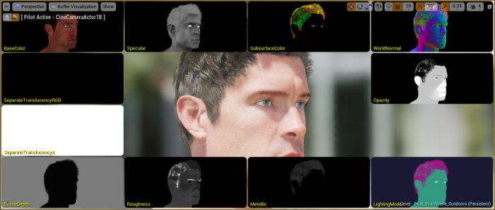
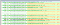
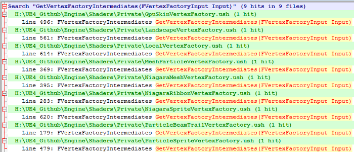
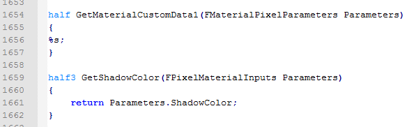
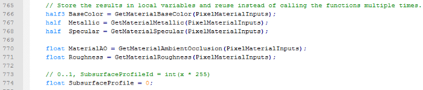
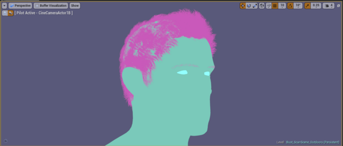
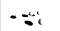
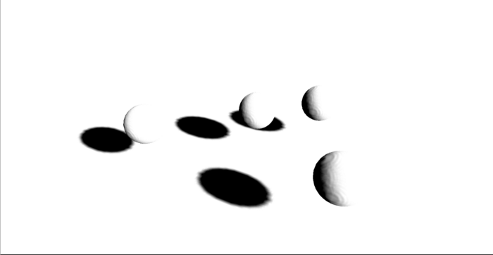

# Unreal Engine 4 Rendering Part 4: The Deferred Shading Pipeline

# The Deferred Shading Base Pass

In  part 3 we finished examining the C++ side of things and are finally  ready to look at how everything works on the GPU. We’ll take a deeper  look at how a Vertex Factory controls the input to the common base pass  vertex shader code, and how tessellation is handled (with its additional  Hull and Domain stages), as well as touching on how a Material Graph  ends up inside of your HLSL code.

After  we understand how the parts are put together we’re going to step  through the deferred pass and look at some of the various steps it goes  through. This will let us know at what part a surface shader is run, and  what modifying things in the material graph actually end up doing.




# A Second Look at Vertex Factories

Back in [Part 2](https://medium.com/@lordned/unreal-engine-4-rendering-part-2-shaders-and-vertex-data-80317e1ae5f3)  we briefly discussed how the Vertex Factory can change the data that is  fed into the Vertex shader. Unreal makes the ultimately smart decision  to trade learning complexity for a reduced amount of code duplication.  We’ll be using *LocalVertexFactory.ush* and *BasePassVertexCommon.ush* in our example and referring to *GpuSkinVertexFactory.ush* as the thing to compare against, as they both use the same vertex shader.

## Changing Input Data

Different  types of meshes will ultimately need different data to accomplish what  they do, ie: GPU skinned verts need more data than simple static meshes.  Unreal handles these differences on the CPU side with `FVertexFactory`, but on the GPU side it’s a little trickier.

Because  all Vertex Factories share the same vertex shader (for the base pass at  least) they use a generically named input structure `FVertexFactoryInput`.

Because Unreal is using the same vertex shader, but are including different code for each vertex factory, Unreal redefines the `FVertexFactoryInput` structure in each vertex factory. This struct is uniquely defined in *GpuSkinVertexFactory.ush*, *LandscapeVertexFactory.ush*, *LocalVertexFactory.ush* and several others. Obviously including all of these files isn’t going to work — instead *BasePassVertexCommon.ush* includes */Engine/Generated/VertexFactory.ush*. This is set to the correct Vertex Factory when the shader is compiled which allows the engine to know which implementation of `FVertexFactoryInput`  to use. We talked briefly about using a macro to declare a vertex  factory in part 2 and you had to provide a shader file — this is why.

So  now the data input for our base pass vertex shader matches the type of  vertex data we’re uploading. The next issue is that different vertex  factories will need different data interpolated between the VS and PS.  Again, the *BasePassVertexShader.usf* calls generic functions — `GetVertexFactoryIntermediates`, `VertexFactoryGetWorldPosition`, `GetMaterialVertexParameters`. If we do another Find in Files we’ll discover that each **VertexFactory.ush* has defined these functions to be unique to their own needs.





Each Vertex Factory re-implements this function

## Changing Output Data

Now we need to look at how we get data from the Vertex Shader to the Pixel Shader. Unsurprisingly, the output from *BasePassVertexShader.usf* is another generically named struct (`FBasePassVSOutput`)  who’s implementation depends on the vertex factory. There’s a little  snag here though — If you have Tessellation enabled there’s two stages  between the Vertex shader and Pixel shader (the Hull and Domain stages),  and these stages need different data than if it was just the VS to PS.

Enter Unreal’s next trick. They use `#define` to change the meaning of `FBasePassVSOutput` and it can either be defined as the simple `FBasePassVSToPS` struct, or for tessellation, `FBasePassVSToDS` (this code can be found in *BasePassVertexCommon.ush*).  The two structures have nearly the same contents, except the Domain  Shader version adds a few extra variables. Now, what about those unique  per-vertex factory interpolations we needed? Unreal solves this by  creating `FVertexFactoryInterpolantsVSToPS` and `FBasePassInterpolantsVSToPS` as members of the `FBasePassVSOutput`. Surprise! `FVertexFactoryInterpolantsVSToPS` is defined in each of the **VertexFactory.ush*  files, meaning that we’re still passing the correct data between  stages, even if we stop to add a Hull/Domain stage in the middle. `FBasePassInterpolantsVSToPS`  isn’t redefined as the stuff stored in this struct doesn’t depend on  anything unique to a specific vertex factory, holding things like  VertexFog values, AmbientLightingVector, etc.

Unreal’s  redefinition technique abstracts away most of the differences in the  base pass vertex shader, allowing common code to be used regardless of  tessellation or specific vertex factory.

# Base Pass Vertex Shader

Now  that we know how Unreal handles differences in shader stages and  tessellation support, we’re going to look at what each shader in the  Deferred Shading pipeline actually do.

The *BasePassVertexShader.usf*  ends up being pretty simple overall. For the most part the Vertex  Shader is simply calculating and assigning the BasePassInterpolants and  the VertexFactoryInterpolants, though how these values are calculated  gets a bit more complicated — there’s lots of special cases where  they’ve chosen to only declare certain interpolators under certain  preprocessor defines and then only assign those under matching defines.

For example, near the bottom of the Vertex Shader we can see a define `#if WRITES_VELOCITY_TO_GBUFFER`  which calculates the velocity on a per-vertex basis by calculating the  difference between its position last frame and this frame. Once  calculated it stores it in the BasePassInterpolants variable, but if you  look over there they’ve wrapped the declaration of that variable in a  matching `#if WRITES_VELOCITY_TO_GBUFFER`.

This  means that only shader variants that write velocity to the GBuffer will  calculate it — This helps cut down on the amount of data passed between  stages, which means less bandwidth which in turn results in faster  shaders.


Boilerplate Code that you don’t have to touch!

# Base Pass Pixel Shader

This  is where things start to get quite a bit complicated, and is probably  where everyone gets scared off normally. Take a deep breath, assume most  things inside of preprocessor checks don’t exist and we’ll get through  this together!

## Material Graph to HLSL

When  we create a material graph inside of Unreal, Unreal translates your  node network into HLSL code. This code is inserted into the HLSL shaders  by the compiler. If we look at *MaterialTemplate.ush* it contains a number of structures (like `FPixelMaterialInputs`) that have no body — instead they just have a `%s`. Unreal uses this as a string format and replaces it with the code specific to your material graph.

This text replacement isn’t limited to just structures, *MaterialTemplate.ush* also includes several functions which have no implementation. For example, `half GetMaterialCustomData0`, `half3 GetMaterialBaseColor`, `half3 GetMaterialNormal`  are all different functions that have their content filled out based on  your material graph. This allows you to call these functions from the  pixel shader and know that it will execute the calculations you have  created in your Material graph and will return you the resulting value  for that pixel.




Some functions have their contents filled in by C++, others have actual definitions

## The “Primitive” Variable

Throughout  the code you will find references to a variable named “Primitive” —  searching for it in the shader files yields no declaration though! This  is because it’s actually declared on the C++ side through some macro  magic. This macro declares a struct that is set by the renderer before  each primitive is drawn on the GPU.

The full list of variables that it supports can be found in *PrimitiveUniformShaderParameters.h* from the macro at the top. By default it includes things like `LocalToWorld`, `WorldToLocal`, `ObjectWorldPositionAndRadius`, `LightingChannelMask`, etc.

## Creating the GBuffer

Deferred  shading uses the concept of a “GBuffer” (Geometry Buffer) which is a  series of render targets that store different bits of information about  the geometry such as the world normal, base color, roughness, etc.  Unreal samples these buffers when lighting is calculated to determine  the final shading. Before it gets there though, Unreal goes through a  few steps to create and fill it.

The  exact contents of the GBuffer can differ, the number of channels and  their uses can be shuffled around depending on your project settings. A  common case example is a 5 texture GBuffer, A through E. `GBufferA.rgb = World Normal`, with `PerObjectGBufferData` filling the alpha channel. `GBufferB.rgba = Metallic, Specular, Roughness, ShadingModelID`. `GBufferC.rgb` is the `BaseColor` with `GBufferAO` filling the alpha channel. `GBufferD` is dedicated to custom data and `GBufferE` is for precomputed shadow factors.

Inside *BasePassPixelShader.usf* the `FPixelShaderInOut_MainPS`  function acts as the entry point for the pixel shader. This function  looks quite complicated due to the numerous preprocessor defines but is  mostly filled with boilerplate code. Unreal uses several different  methods to calculate the required data for the GBuffer depending on what  lighting model and features you have enabled. Unless you need to change  some of this boilerplate code, the first significant function is  partway down where the shader gets the values for `BaseColor`, `Metallic`, `Specular`, `MaterialAO`, and `Roughness`. It does this by calling the functions declared in *MaterialTemplate.ush* and their implementations are defined by your material graph.




The shader caches the result of the material graph calls to avoid executing their functions multiple times.

Now  that we have sampled some of the data channels, Unreal is going to  modify some of them for certain shading models. For example, if you’re  using a shading model which uses Subsurface Scattering (Subsurface,  Subsurface Profile, Preintegrated Skin, two sided foliage or cloth) then  Unreal will calculate a Subsurface color based on the call to `GetMaterialSubsurfaceData`. If the lighting model is *not*  one of these it uses the default value of zero. The Subsurface Color  values are now part of further calculations, but unless you’re using a  shading model that writes to the value it will simply be zero!

After calculating Subsurface Color Unreal allows [DBuffer Decals](https://docs.unrealengine.com/latest/INT/Resources/ContentExamples/Decals/1_2/)  to modify the results of the GBuffer if you have it enabled in your  project. After doing some math Unreal applies the DBufferData to the  BaseColor, Metallic, Specular, Roughness, Normal and Subsurface Color  channels.

After  allowing DBuffer Decals to modify the data Unreal calculates the  Opacity (using the result from your material graph) and does some  volumetric lightmap calculations. Finally it creates the `FGBufferData` struct and it packs all of this data into it with each FGBufferData instance representing a single pixel.

## Setting the GBuffer Shading Model

The  next thing on Unreal’s list is to let each shading model modify the  GBuffer as it sees fit. To accomplish this, Unreal has a function called  `SetGBufferForShadingModel` inside of *ShadingModelMaterials.ush*.  This function takes our Opacity, BaseColor, Metallic, Specular,  Roughness and Subsurface data and allows each shading model to assign  the data to the GBuffer struct however it would like.

Most  shading models simply assign the incoming data without modification but  certain shading models (such as Subsurface related ones) will encode  additional data into the GBuffer using the custom data channels. The  other important thing this function does is it writes the `ShadingModelID`  to the GBuffer. This is an integer value stored per-pixel that lets the  deferred pass look up what shading model each pixel should use later.

It’s important to note here that if you want to use the CustomData channels of the GBuffer you’ll need to modify *BasePassCommon.ush* which has a preprocessor define for `WRITES_CUSTOMDATA_TO_GBUFFER`.  If you try to use the CustomData part of the GBuffer without making  sure your shading model is added here it will be discarded and you won’t  get any values later!




A single model that uses three different shading models — hair, eyes and skin.

## Using the Data

Now that we’ve let each lighting model choose how they’re going to write their data into the `FGBufferData` struct, the *BasePassPixelShader*  is going to do a fair bit more boilerplate code and house keeping —  calculating per pixel velocity, doing subsurface color changes,  overriding the roughness for ForceFullyRough, etc.

After this boilerplate code though Unreal will get precomputed indirect lighting and skylight data (`GetPrecomputedIndirectLightingAndSkyLight`)  and adds that to the DiffuseColor for the GBuffer. There’s a fair bit  of code related to translucent forward shading, vertex fogging, and  debugging, and we eventually come down to the end of the `FGBufferData` struct. Unreal calls `EncodeGBuffer` (*DeferredShadingCommon.ush*) which takes in the `FGBufferData` struct and writes it out to the various GBuffer textures, A-E.

That  wraps up the end of the Base Pass Pixel Shader for the most part.  You’ll notice that there’s no mention of lighting or shadows in this  function. This is because in a deferred renderer these calculations are  deferred until later! We’ll look at that next.

## Review

The  BasePassPixelShader is responsible for sampling the various PBR data  channels by calling into functions generated by your Material graph.  This data is packed into a `FGBufferData`  which is passed around to various functions that modify the data based  on various shading models. The shading model determines the `ShadingModelID` that is written to the texture for choosing which shading model to use later. Finally the data in the `FGBufferData` is encoded into multiple render targets for use later.

# Deferred Light Pixel Shader

We’re going to look at *DeferredLightPixelShaders.usf*  next as this is where each light’s influence on a pixel is calculated.  To do this, Unreal uses a simple vertex shader to draw appropriate  geometry that matches the possible influence of each light ie: a sphere  for point lights and a cone for spot lights. This creates a mask on  which pixels the pixel shader needs to be run on which makes lights that  fill less pixels cheaper.

## Shadowed and Unshadowed Lights

Unreal  draws lighting in multiple stages. Non shadow-casting lights are drawn  first, and then indirect lighting (via light propegation volumes) is  drawn. Finally Unreal draws all shadow casting lights. Unreal uses  similar pixel shaders for shadow casting and non-shadow casting lights —  the difference between them comes from additional pre-processing steps  for shadow casting lights. For each light, Unreal computes a *ScreenShadowMaskTexture* which is a screenspace representation of the shadowed pixels in your scene.





A ScreenShadowMaskTexture for a simple scene with some spheres in it

To  do this, Unreal renders geometry that appears to be matched to the  bounding box of each object in your scene, and geometric representations  of objects in your scene. It *does not re-render the objects in your scene*  and instead samples the GBuffer combining the depth of a given pixel to  see if it would be in the way of a cast light shadow. Sound  complicated? Don’t worry, it is. The good news is that the only takeaway  we need here is that each shadowed light computes a screenspace  representation of what surfaces are in shadow and this data is used  later!

# Base Pass Pixel Shader

Now  that we know shadowed lights create a screenspace shadow texture we can  go back to looking at how the base pass pixel shader works. As a  reminder, this is run for each light in the scene so for any object that  has multiple lights affecting it it will be run multiple times per  pixel. The pixel shader can be quite simple, we’ll be interested more in  the functions this pixel shader calls.

```
void RadialPixelMain( float4 InScreenPosition, float4 SVPos, out float4 OutColor){// Intermediate variables have been removed for brevityFScreenSpaceData ScreenSpaceData = GetScreenSpaceData(ScreenUV);FDeferredLightData LightData = SetupLightDataForStandardDeferred();OutColor = GetDynamicLighting(WorldPosition, CameraVector, ScreenSpaceData.GBuffer, ScreenSpaceData.AmbientOcclusion, ScreenSpaceData.GBuffer.ShadingModelID, LightData, GetPerPixelLightAttenuation(ScreenUV), Dither, Random);OutColor *= ComputeLightProfileMultiplier(WorldPosition, DeferredLightUniforms_LightPosition,     DeferredLightUniforms_NormalizedLightDirection);}
```

There’s only a couple of functions so we’ll hop through what each one does. `GetScreenSpaceData` retrieves the information from the GBuffer for a given pixel. `SetupLightDataForStandardDeferred` calculates information such as the light direction, light color, falloff, etc. Finally, it calls `GetDynamicLighting`  and passes in all of the data we’ve calculated so far — where the pixel  is, what the GBuffer data is, what Shading Model ID to use, and our  light’s information.

## GetDynamicLighting

The `GetDynamicLighting` (located in *DeferredLightingCommon.ush*)  function is quite long and looks complicated but a lot of the  complications are due various settings on each light. This function  calculates a `SurfaceShadow` and `SubsurfaceShadow` variables which are initialized to 1.0 — if there *are shadows*  then the value becomes lower than one. This is important as we multiply  values against it later, so for now just accept that a higher value is  less shadowed.

If shadowing is enabled then `GetShadowTerms` is called. This uses the light attenuation buffer from earlier (called *ScreenShadowMaskTexture*)  to determine shadow terms for a given pixel. There are a ton of  different places shadow data can come from, (Unreal stores light  function + per object shadows in the `z` channel, per-object sub surface scattering in `w`, whole-scene directional light shadows in `x` and whole scene directional light sub surface scattering in `y`, and static shadowing comes from the appropriate GBuffer channel) and GetShadowTerms writes this information out to our `SurfaceShadow` and `SubsurfaceShadow` variables from earlier.

Now  that we’ve determined the shadow factor for both surface and subsurface  data we calculate light attenuation. Attenuation is effectively the  falloff in energy based on the distance from the light and can be  modified to create different effects, ie: Toon shading often removes  Attenuation from the calculation so that your distance to a light source  doesn’t matter. Unreal calculates `SurfaceAttenuation` and `SubsurfaceAttenuation` separately based on distance, light radius and falloff, and our shadow term. **Shadowing is combined with attenuation**, which means our future calculations only take *attenuation strength* into account.

Finally we calculate our Surface Shading for this pixel. **Surface Shading takes the GBuffer, Surface Roughness, Area Light Specular, Light Direction, View Direction, and Normal** into  account. Roughness is determined by our GBuffer data. Area Light  Specular uses physically based rendering (based on our light data and  roughness) to calculate a new energy value and can modify the roughness  and light vector.


The standard shading model uses various data in its calculations

Surface Shading finally gives us a chance to modify how each surface responds to this data. This function is located in *ShadingModels.ush*  and is just a big switch statement that looks at our ShadingModel ID  that was written into the GBuffer way earlier! Many of the lighting  models share a standard shading function, but some of the more unusual  shading models use their own custom implementations. **Surface Shading does not take attenuation into account,** so it only deals with calculating the color of the surface without shadows.

Attenuation  (which is distance + shadow) isn’t taken into account until the Light  Accumulator is run. The Light Accumulator takes the surface lighting and  attenuation into account and adds together surface and sub-surface  lighting correctly after multiplying them by the light attenuation  value.

Finally  the Dynamic Lighting function returns the total light accumulated by  the Light Accumulator. In practice this is just surface + subsurface  lighting but the code is complicated by subsurface properties and debug  options.

## ComputeLightProfileMultiplier

Finally the last thing the *DeferredLightPixelShader* does is multiply the color calculated by `GetDynamicLighting` by the value from `ComputeLightProfileMultiplier`.  This function allows for the use of 1D IES light profile textures. If  an IES light profile is not being used for that light then the resulting  value is not changed.

## Accumulated Light

Because the *BasePassPixelShaders*  are run for every light that affects an object, Unreal accumulates this  lighting and stores it in a buffer. This buffer isn’t even drawn to the  screen until several steps later in the `ResolveSceneColor`  step. Several additional things are calculated before that such as  translucent objects (which are drawn using traditional forward rendering  techniques), screen space temporal anti aliasing and screen space  reflections.

# Review

For  each light shadow data is calculated in screen space and combines  static shadow, subsurface shadow and directional shadows. Then  approximate geometry is drawn for each light and the influence of that  light on each pixel is drawn. The surface shading is calculated based on  GBuffer data and shading model and then is multiplied by light  attenuation. Light attenuation is a combination of light settings  (distance, falloff, etc.) and shadow sampling. The output of each  surface shading is accumulated together to produce the final light value

# Next Post

We’ve  covered a good deal of background information on the rendering system  and how the different sections all fit together. In the next post we’re  going to start talking about shader permutations and trying to find find  ways to reduce the amount of times you need to recompile shaders so you  spend less time waiting and more time coding! [The next post is available here!](https://medium.com/@lordned/unreal-engine-4-rendering-part-5-shader-permutations-2b975e503dd4)