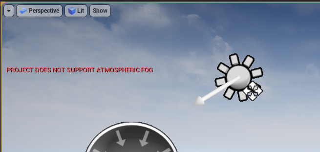

# Unreal Engine 4 Rendering Part 5: Shader Permutations

(If you haven’t read Part 4 in this series, [it is available here](https://medium.com/@lordned/unreal-engine-4-rendering-part-4-the-deferred-shading-pipeline-389fc0175789))

As  we’ve covered before Unreal will compile multiple permutations of a  given shader/material to handle different usage cases. When a Material  is modified Unreal will look for the .ush/.usf files that are used by  that Shader and re-load them. Unreal then turns your Material Graph into  HLSL code and then starts building each permutation of the shader.

We’re  all familiar with this process as it happens every time we use the  Material Editor in Unreal. Unfortunately there’s an issue with this: It  only re-loads shaders related to the material itself. Because Unreal  uses a deferred renderer, some shaders are global (such as the pass that  samples the GBuffer and calculates a final color). This means that  these shaders are not actually part of the material, so modifying that  material won’t cause them to reload.

Additionally,  once you do change one of these global shaders and restart, Unreal is  going to re-compile every shader that used that file, so if you edit a  common one you’re looking at a near full recompile which is ~125  shaders/~10,000 permutations for an empty project. This is also true for  modifying the Renderer modules C++ code. This can do terrible things to  iteration time as you’ll need to re-compile everything and wait 10  minutes to see if your change worked. Worse, if you’re modifying  something inside of an `#if X_Y`  section inside the shader, you may get partially through a recompile  before hitting a permutation that doesn’t compile. You can go and fix  it, but fixing it makes all the ones we did manage to compile already  re-compile.

Yikes!

New in Unreal 4.19 — Shader Permutation Reduction settings!

# Lowering the Overall Number of Permutations

Our  first goal is to see what settings we can change in the engine or  consider for our materials that will reduce the total number of  permutations that need to be compiled. I’m not necessarily suggesting  that you ship with these settings disabled but temporarily reducing the  number of permutations will speed up iteration time while you develop  shaders.

On a per-material basis there’s a couple things we can look out for. The first one is the *Usage* settings.

Our  first goal is to see what settings we can change that will lower the  number of permutations. These settings appear to represent specific  Vertex Factories in the engine, and if *Automatically Set Usage in Editor*  is checked when you use it in a new VF it will generate that  permutation. Disabling this gives you a little more control and will  make artists think twice about assigning a material, but probably won’t  win you too many permutations.

The next thing you can look out for on a per-material basis is the usage of the **Quality and Static**  switches. Because Static switches are compile-time each possible  combination of them requires a new permutation and having too many  static switches can lead you to quite an impressive number of  permutations. Again, this one probably won’t win you too many  permutations. It’s something to keep in mind but if you’re trying to  iterate and you’re on an near empty project you probably won’t have any  of these and the added performance gain from static switches at runtime  is worth using them as needed.

Now  we can look at project settings that may reduce permutations — you may  need some of these long term but if we can disable them temporarily then  we’ll take it. **This requires Unreal 4.19 or above, compiling from latest source will work as of when this article was written.** If you go to *Project Settings > Rendering*  there’s several settings you can adjust. Depending on your particular  project/testing needs you may need to leave some of these enabled. If  you disable a shader permutation here and your scene needs it you will  get a warning in the viewport, ie: “PROJECT DOES NOT SUPPORT ATMOSPHERIC  FOG” when trying to use atmospheric fog and having `Support Atmospheric Fog` disabled.

**Lighting**

- Allow  Static Lighting (Note: Disabling this means lights marked as Static  will have no influence on your materials. Set them to Movable for  testing if this is disabled)

**Shader Permutation Reduction**

- Support  Stationary Skylight (Note: Disabling this means sky lights marked as  Stationary will have no influence on your materials. Set them to Movable  for testing if this is disabled)
- Support Low Quality Lightmap Shader Permutations
- Support PointLight WholeSceneShadows
- Support Atmospheric Fog

**Mobile Shader Permutation Reduction**

- Support Combined Static and CSM Shadowing
- Support Distance Field Shadows
- Support Movable Directional Lights
- Max Movable Point Lights = 0

After disabling all of these, open up *ConsoleVariables.ini* and add `r.ForceDebugViewModes=2`  which reduces the number of permutations a bit further. This will  disable Buffer Visualization in the editor (to show the GBuffer  channels) but might be worth it.

Doing all of this **reduced me from 8809 down to 3708 shaders, or a 58% reduction in shaders.** That will help a lot!

# Speeding up Compilation

You can add `CFLAG_StandardOptimization`  to a compilation environment to ensure the D3D compiler doesn’t spend  time optimizing shaders. The easiest way to set that for all shaders is  to open *ShaderCompiler.cpp* and scroll down to the `GlobalBeginCompileShader` function. Then just add in a line for `Input.Environment.CompilerFlags.Add(CFLAG_StandardOptimization);`! Don’t do this if you’re trying to profile your performance however as optimized shaders are important. **Note:** This is different than `r.Shaders.Optimize=0` which is about debug information and not code optimization.

# Recompiling Only Changed Shaders

Finally we’re going to look at techniques to recompile specific shaders. Unreal has a unlisted console command `recompileshaders`  which can take several different arguments. Do note that this only  works on .usf files, as .ush files are headers that are only included by  .usf files.

`recompileshaders changed` queries `FShaderType` and `FShaderPipelineType`  to return all outdated shaders, factories and shader pipelines. If  anything out of date is found (due to source files changing) then it is  recompiled. The comments indicate that **global shaders can be recompiled**  with this command. In practice I’ve found that because it ends up  recompiling all global shaders affected, modifying files like *ShadingModels.ush* can end up being a significant amount, 3–5 minute compile.

`recompileshaders global` gets the global shader map, clears it and forces a recompile of all global shaders. Modifying files like *ShadingModels.ush* takes 1–2 minutes. Maybe useful if you know a shader you’re modifying is global and not a material shader.

`recompileshaders material <MaterialName>` will recompile **the first material with that name found**.  No path information should be included. This is accomplished by calling  PreEditChange/PostEditChange on the material so it is likely no  different than hitting Apply in the Material Editor.

`recompileshaders all`  will recompile everything. This is like restarting the editor after  modifying all of the files. Probably useful at the end of your changes  to make sure no permutation is broken. Can be combined with `Project Settings > Rendering Overrides (Local) > Force All Shader Permutation Support` to make sure you’ve really got your code compiling under every `#if` variation.

`recompileshaders <path>`  will attempt to recompile either a shader by shadertype or Shader  Platform type. This allows us to specify specific shader filepaths, such  as `recompileshaders /Engine/Private/BasePassPixelShader.usf` .

**IMPORTANT:** The  command seems to be case sensitive and it should take at least a moment  to run regardless of which command you’re using; Incorrect filepaths or  using an incorrect case seems to output some stuff to the console but  it won’t recompile shaders.

Opening  new maps and materials (for the Material Editor preview window) can be  unstable after using this so make sure your test environment is setup  and be okay with it crashing if you open another material or scene.

It  also only works on sections of code that are actively used in the  scene. This means if you modify a section that only applies to lit  translucency but don’t have translucent objects in your scene the  hot-reload won’t check that code and will miss compile errors.

These  warnings aside, this is the most useful command as it takes 3–5 seconds  to run, instead of 3–5 minutes! The two commands I run most often are `recompileshaders /Engine/Private/BasePassPixelShaders.usf` and `recompileshaders /Engine/Private/DeferredLightPixelShaders.usf` which seems to cover most changes you can make in the base pass.

# Common #if Defines

Below  are some common pre-processor defines found in the deferred shading  pipeline. I have put together a list of their intended meaning based on  what C++ code triggers them. This will hopefully let you figure out  which sections of the deferred pipeline apply to your code as you can  check the pre-processor define against this list to see what it  translates into in terms of UE4 settings.

- `#if NON_DIRECTIONAL_DIRECT_LIGHTING` This is found in *DeferredLightingCommon.ush* but only seems to be defined in *ForwardLightingCommon.ush* as `#define  NON_DIRECTIONAL_DIRECT_LIGHTING  (TRANSLUCENCY_LIGHTING_VOLUMETRIC_NONDIRECTIONAL ||  TRANSLUCENCY_LIGHTING_VOLUMETRIC_PERVERTEX_NONDIRECTIONAL)`.
- `#if SUPPORT_CONTACT_SHADOWS` provides support for Unreal’s [Contact Shadows Feature](https://docs.unrealengine.com/latest/INT/Engine/Rendering/LightingAndShadows/ContactShadows/).
- `#if REFERENCE_QUALITY` is defined to 0 at the top of *DeferredLightingCommon.ush* — might be for cinematic rendering?
- `#if ALLOW_STATIC_LIGHTING` is true if the `r.AllowStaticLighting` console variable is set to 1. This matches the *Project Settings > Rendering* option for Static Lighting support.
- `#if USE_DEVELOPMENT_SHADERS` is true if `COMPILE_SHADERS_FOR_DEVELOPMENT` is true (and the platform supports it). `COMPILE_SHADERS_FOR_DEVELOPMENT` is true if `r.CompileShadersForDevelopment` is set.
- `#if TRANSLUCENT_SELF_SHADOWING` is defined for objects being rendered with a `FSelfShadowedTranslucencyPolicy`. I believe this is for [Lit Translucency](https://docs.unrealengine.com/latest/INT/Engine/Rendering/LightingAndShadows/LitTranslucency/) support.
- `#if SIMPLE_FORWARD_DIRECTIONAL_LIGHT` and `#if SIMPLE_FORWARD_SHADING` seem to be set during Light Map rendering for stationary directional lights.
- `#if FORWARD_SHADING` is set when `r.ForwardShading` is set to 1.

# Review

We  learned that we can cut down on the overall number of shader  permutations (even if just temporarily) by changing some Project  Settings which will make full recompiles faster. Full shader recompiles  can be avoided by using the unlisted `recompileshader`  console command, though the next editor start will require a full  recompile. We also learned what conditions some of the common  preprocessor defines are set under which allows us to have a better idea  about which code is relevant to our interests.

# Next Post

Finally  we’re ready to go onto the tutorials! The next post will cover  modifying the existing shader pipeline to add a new shading model that  gives a toon-like effect while still following PBR rules. The technical  bits for this post mostly come from [FelixK’s Development Blog](http://blog.felixkate.net/2016/05/22/adding-a-custom-shading-model-1/)  but updated for 4.18+ and with more explanation into what we’re  changing — especially now that we know how the deferred pass works! [The next post is available here!](https://medium.com/@lordned/ue4-rendering-part-6-adding-a-new-shading-model-e2972b40d72d)