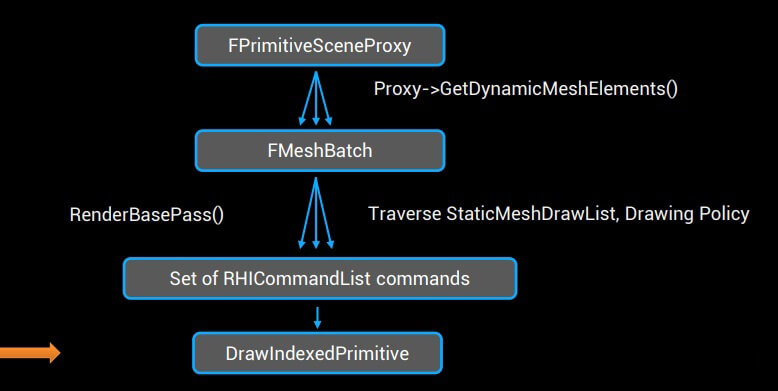
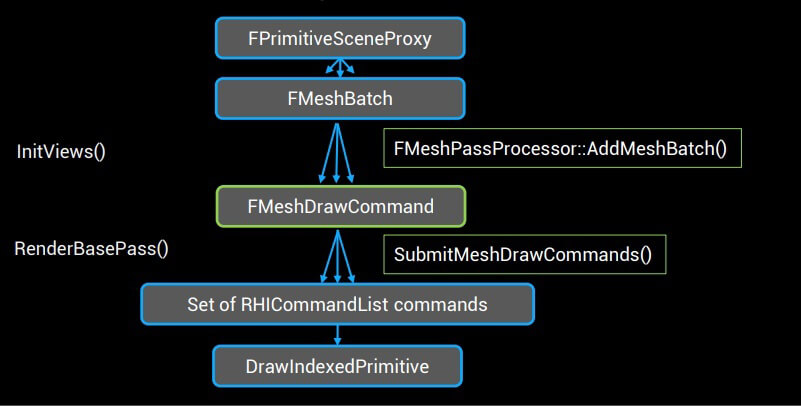
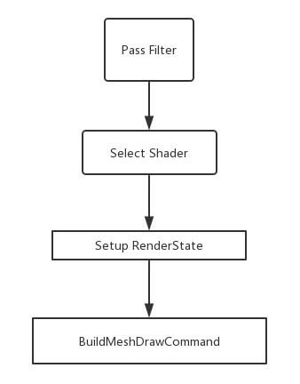
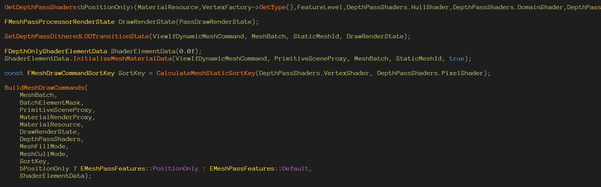
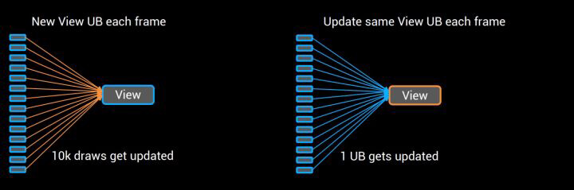
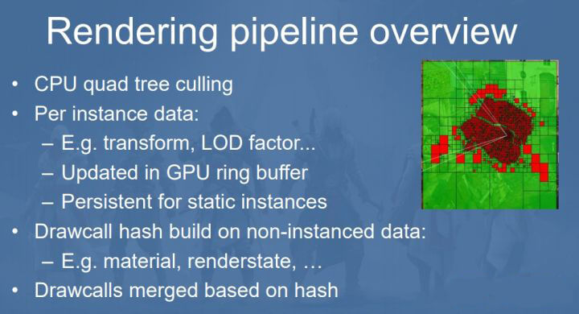
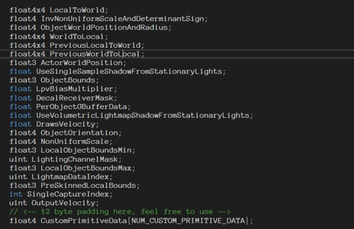
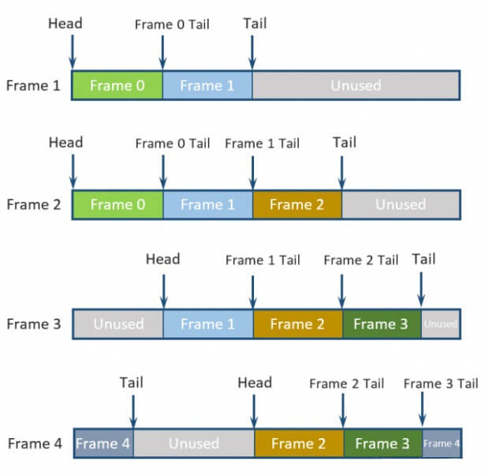
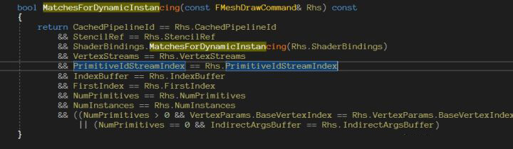

# [Unreal 4.22渲染数据管线重构和动态Instancing](https://blog.uwa4d.com/archives/USparkle_UnrealEngine.html)

这是侑虎科技第581篇文章，感谢作者王文涛供稿。欢迎转发分享，未经作者授权请勿转载。如果您有任何独到的见解或者发现也欢迎联系我们，一起探讨。（QQ群：793972859）

作者主页：https://www.zhihu.com/people/wang-wen-tao-70，作者也是[U Sparkle活动](https://www.uwa4d.com/#activity-us)参与者，UWA欢迎更多开发朋友加入[U Sparkle开发者计划](https://www.uwa4d.com/#activity-us-complete)，这个舞台有你更精彩！

------

## **动机和目的**

之前写过一篇文章，讲的是UE4里的HISM的工作方法。

UE4的HISM深入探究：https://zhuanlan.zhihu.com/p/58963258

为了实现植被的遮挡剔除、Instance还有距离剔除的功能。HISM  Component几乎成为了UE4里最庞大的一个文件，然而实际上HISM对于很多游戏场景里的需求还是很难满足，特别是HISM需要满足静态数据的前提，十分依赖美术的工作和参数调整，对于越来越大和高自由度的游戏世界非常难受。

很多AAA级游戏引擎都有动态合并Instance的功能，也就是动态判断绘制的物体材质，Vertex  Buffer（VB）等是否一样，一样的物体合并到一起绘制。但是对于4.21前的管线，动态物体和静态物体没法合并，然后运行时判断是否合并Instance的效率太低。

为了解决像动态Instancing、渲染提交效率等等的问题，EPIC终于在4.22痛下杀手改动这个陈旧庞大的渲染管线代码。知乎上有很多讲UE4渲染的文章，看过一些代码的人应该也清楚，UE4.21之前的渲染数据是基于DrawingPolicy的框架，这样的框架的好处是面向对象的设计，思路很直接，但是它的缺点却是显而易见的：

1、通过大量模板实现Shader的选择和permutation，代码难以阅读，对于现代CPU体系来说性能堪忧（非Data-oriented 设计）。

2、分成Dynamic和Static两个draw list，Instancing/Batch等优化，只能对static物体做手脚。

3、DrawPolicy直接决定渲染线程设置到GPU的数据，难以和GameThread数据解耦，冗余数据很多，对性能也是大问题。



 老的UE4一个Draw命令的数据流程


除此之外，一些新技术的需求，这种DrawingPolicy的架构也是难以胜任的：

1、DXR技术，Shader所需Constant等数据必须是全场景的，同时，Ray Tracing技术是不能简单地针对可见性作剔除，光线会反弹，同样需要全场景信息。

2、GPU Driven Culling的技术，CPU必须在不知道可进性的情况下，把场景数据发送到GPU的Buffer，由GPU进行剔除计算。

[GPU-Driven Rendering Pipelines](http://advances.realtimerendering.com/s2015/aaltonenhaar_siggraph2015_combined_final_footer_220dpi.pdf)

3、Rendering Graph或者说可编程的渲染管线技术，需要能够灵活的抽象出Render Pass等概念，而现在的DrawingPolicy代码去写一个简单的自定义pass可能就需要好几百行，太过沉重。

总结起来就是，我们需要一种更简洁、更紧凑、更利于CPU访问的数据结构去表示场景数据，包括Transform、Material（可以理解成Shader参数）、RenderState、顶点Buffer等等。而它们最好是一个数组，并不需要包括太多Game  Thread的信息。而我们的Renderer代码需要在渲染每一个Frame开始前cache全场景的数据。

UE4给出的解决方案叫做**MeshDrawCommand**。

**FMeshDrawCommand类**缓存了一个DrawCall所需要的最少资源集合：

- VertexBuffer和IndexBuffer
- ShaderBindings（Constant，SRV，UAV等）
- PipelineStateObject(VS/PS/HS/GS/CS 和 RenderState）

**FMeshDrawCommand**的好处有：

1、独立的结构体，不用依赖于DrawPolicy那一大堆模板；

2、Data-oriented设计，在提交的时候就是一堆数组，效率高。

基于FMeshDrawCommand的新管线：





------

## **Caching MeshDrawCommand**

构造好PrimitiveSceneProxy之后，就可以用FMeshPassProcessor的AddMeshBatch去创建一个或者多个MeshDrawCommand。

继承自己的FMeshPassProcessor就可以创建一个新的自定义MeshPass，创建一个MeshDrawCommand的流程如下：





例如，阴影绘制里的DepthPass：





注意原来UE4.21的Uniform那一套东西在MeshDrawCommand里被替换成了ShaderBinding。我们不用一个个去调用setParameters接口，而统一用SetShaderBindings的API即可。

**FMeshDrawShaderBindings**是一个存放了若干个内存Buffer的数组，数组的大小和该Command用的Shader数量相同。Buffer里面的内容就是构造好的RHIUniformBuffer的refrence，包括SRV、Constantant等等，使用MeshDrawShaderBindings的好处就是可以快速比较两个DrawCommand的Uniforms是否数目一样，内容一致，从而实现DrawCall  Merge。

GetShaderBindings的例子：

```
FMeshMaterialShader::GetShaderBindings(Scene, FeatureLevel, PrimitiveSceneProxy, MaterialRenderProxy, Material, DrawRenderState, ShaderElementData, ShaderBindings);
ShaderBindings.Add(RenderOffsetParameter, ShaderElementData.RenderOffset);
```

FMeshDrawShaderBindings里存放的是FRHIUniformBuffer结构体的指针，这是为了在update  uniform时，只用更新一个UniformBuffer的内容即可，而不是更新引用到这个UniformBuffer的所有MeshDrawCommand。





有了MeshDrawCommand，我们就可以只根据物体的动态或者静态属性区分每一帧需要更新的东西。对于场景大部分的静态物体，只需要判断Uniform是否与view相关去更新view即可，动态物体则一般需要每帧更新MeshBatch和MeshDrawCommand。

------

## **Dynamic Instancing和GPUScene**

**1、GPUScene**

上面这些Data-oriented向的优化只是提高了绘制的效率，但是要真正实现Dynamic  Instancing，我们需要的一个个GPUSceneBuffer来存储PerInstance的场景数据。UE4用一个GPUTArray来表示PerInstance的数据，实际上它是个float4的数组，这样的方法在几年前Ubi的引擎里就实现过：



 Ubi的GPU Driven Pipeline


只不过Ubi做的更彻底，包括Mesh信息VB  IB等都全部扔到GPU去，然后用MultiDrawInstanceIndirect去绘制。UE4的GPUScene  Buffer则主要包括世界矩阵、Lightmap参数、包围盒等PerInstance相关的Shader数据，4.23之后添加了一些CustomData可以用于你自定义的Instance算法。





UE4的GPUTArray代码实现在ByteBuffer.cpp和ByteBuffer.usf中，在DirectX中用的是StructureBuffer来实现，OpenGL下则用的是TextureBuffer。

Update/Resize一个Buffer的代码也很简单。Map一段CPU数据到GPU然后执行一个ComputeShader更新场景里已经绑定的Buffer:

```
SetShaderValue(RHICmdList, ShaderRHI, ComputeShader->NumScatters, NumScatters);
SetSRVParameter(RHICmdList, ShaderRHI, ComputeShader->ScatterBuffer, ScatterBuffer.SRV);
SetSRVParameter(RHICmdList, ShaderRHI, ComputeShader->UploadBuffer, UploadBuffer.SRV);
SetUAVParameter(RHICmdList, ShaderRHI, ComputeShader->DstBuffer, DstBuffer.UAV);
RHICmdList.DispatchComputeShader(FMath::DivideAndRoundUp<uint32>(NumScatters, FScatterCopyCS::ThreadGroupSize), 1, 1);
SetUAVParameter(RHICmdList, ShaderRHI, ComputeShader->DstBuffer, FUnorderedAccessViewRHIRef());
```

这里UE4对GPU Buffer的代码实现是相对比较简单的，实际上对于动态更新的GPU数据可以用一个GPU RingBuffer去实现，可以节省每帧重新分配内存和map操作的时间：



 GPU RingBuffer示意


**2、MeshDrawCommand Merging**

有了PerInstance的数据，我们还需要知道哪些MeshDrawCommand可以merge，MeshDrawCommand可以简单的判断，去比较是否相等从而merge。





注意因为MeshDrawShaderBindings都是指针，所以比较只要简单判断command绑定的bindings是否相等即可。

Merge好的MeshDrawCommand存在场景里的一个HashSet里，如果两个command能merge，简单的把这个command的StateBucket+1即可：

```
    /** Instancing state buckets.  These are stored on the scene as they are precomputed at FPrimitiveSceneInfo::AddToScene time. */
    TSet<FMeshDrawCommandStateBucket, MeshDrawCommandKeyFuncs> CachedMeshDrawCommandStateBuckets;
```

判断command是否能merge是比较费时的操作，因此只会在物体AddToScene的时候执行。此外，现在的MeshDrawCommand是逐个比较相等去判断能否merge的，之后也可以直接用Hash值去merge来提高效率。

**3、PrimitiveId Buffer**

UE4是用DrawIndexedInstanced最终去绘制物体的，那么我们需要按照某个物体的ID去索引GPUSceneBuffer中的内容，UE4的做法也很直接，在支持DynamicInstance的物体的VertexFactory中添加一个VertexStream作为PrimitiveId：

```
if (GetType()->SupportsPrimitiveIdStream() && bCanUseGPUScene)
{
    Elements.Add(AccessStreamComponent(FVertexStreamComponent(&GPrimitiveIdDummy, 0, 0, sizeof(uint32), VET_UInt, EVertexStreamUsage::Instancing), 13));
    PrimitiveIdStreamIndex[Index] = Elements.Last().StreamIndex;
}
```

每个MeshDrawCommand在构造时去初始化这个VertexBuffer即可：

```
for (int32 DrawCommandIndex = 0; DrawCommandIndex < NumDrawCommands; DrawCommandIndex++)
{
const FVisibleMeshDrawCommand& VisibleMeshDrawCommand = VisibleMeshDrawCommands[DrawCommandIndex];
PrimitiveIds[PrimitiveIdIndex] = VisibleMeshDrawCommand.DrawPrimitiveId;

}
```

例如场景的Scene Buffer有一千个物体的数据，我们只要知道我们的MeshDrawCommand在这一千个index中的offset，然后对command里的primitives ID依次加一即可。

最后是SubmitMeshDrawCommands：

```
RHICmdList.SetStreamSource(Stream.StreamIndex, ScenePrimitiveIdsBuffer, PrimitiveIdOffset);
RHICmdList.SetStreamSource(Stream.StreamIndex, Stream.VertexBuffer, Stream.Offset);
RHICmdList.DrawIndexedPrimitive(MeshDrawCommand.IndexBuffer,MeshDrawCommand.VertexParams.BaseVertexIndex,0,MeshDrawCommand.VertexParams.NumVertices,MeshDrawCommand.FirstIndex,MeshDrawCommand.NumPrimitives,MeshDrawCommand.NumInstances * InstanceFactor
```

**4、新管线的优势和发展方向**

4.22的新管线在场景复杂度较高的情况下有非常好的减少CPU  overhead的效果，收益主要来自于Data-Oriented设计带来的cache  miss的减少和动态Instancing实现。而且这个收益不仅限于PC端，据Epic的工程师说，在堡垒之夜上使用Depth  Prepass和新的Dynamic Instancing管线，让渲染效率提升了30%左右。

将更多的工作交给GPU来完成也是游戏引擎发展的一个趋势，下一篇计划用4.22这些新轮子去实现一些新的东西。

## **参考文档：**

［1］[GPU Driven pipeline](http://advances.realtimerendering.com/s2015/aaltonenhaar_siggraph2015_combined_final_footer_220dpi.pdf)
 ［2］[GPU Dynamic resource management](https://docs.microsoft.com/en-us/windows/win32/direct3d12/fence-based-resource-management)

------

文末，再次感谢王文涛的分享，如果您有任何独到的见解或者发现也欢迎联系我们，一起探讨。（QQ群：793972859）

也欢迎大家来积极参与[U Sparkle开发者计划](https://www.uwa4d.com/#activity-us-complete)，简称“US”，代表你和我，代表UWA和开发者在一起！