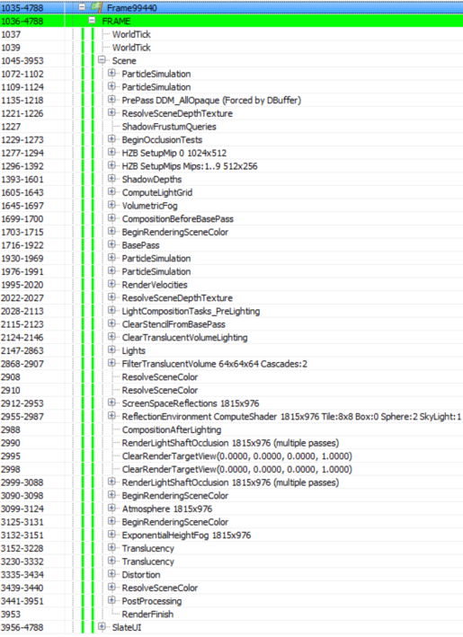
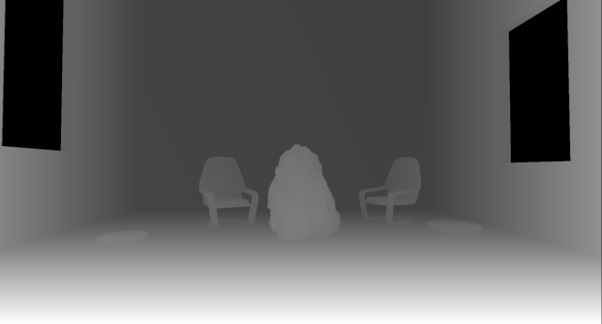
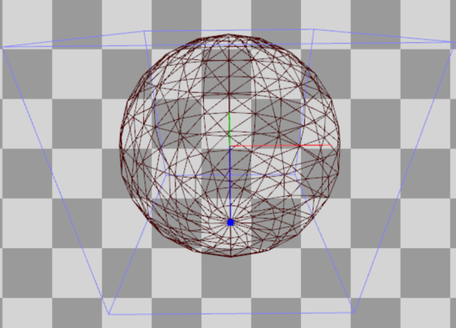
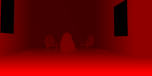
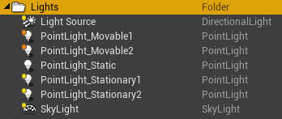
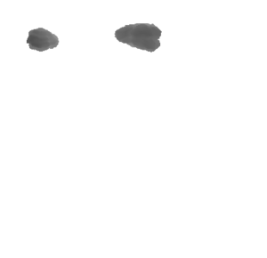
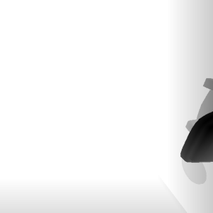

# How Unreal Renders a Frame

*This is part 1 of the “How Unreal Renders a Frame” series, you can access part 2 and part 3 as well.*

I was looking around the Unreal source the other day and inspired by some excellent breakdowns of [how popular games render a frame](http://www.adriancourreges.com/blog/2015/11/02/gta-v-graphics-study/), I thought to try something similar with it as well, to study how it renders a frame (with the default settings/scene setup).

Since we have access to the source code, it is possible to study the  renderer source to see what it does, although it is quite a beast and  rendering paths depend a lot on the context so a clean, low-level API  call list will be easier to follow (looking into the code to fill in any  missing gaps).

I put together a simple scene with a few static and dynamic props, a  few lights, volumetric fog, transparent objects and a particle effect to  cover a large enough range of materials and rendering methods.

So, I ran the Editor through [RenderDoc](https://renderdoc.org/)  and triggered a capture. This might not be representative of how a real  game frame will look like but it should give us a rough idea of how  Unreal performs rendering of a typical frame (I haven’t changed any of  the default settings and I am targeting “highest quality” on PC):

Disclaimer: the following analysis is based on the GPU capture and renderer source code (**version 4.17.1**), without prior Unreal experience really. If have missed something, or got anything wrong, please let me know in the comments.

Helpfully, Unreal’s draw call list is clean and well annotated so it  should make our work easier. The list can look different in case you are  missing some entities/materials in your scene or you are targeting  lower quality. For example if you are rendering no particles, the **ParticleSimulation** passes will be missing.

The **SlateUI** render pass includes all API calls the  Unreal Editor performs to render its UI so we will ignore it, focusing  instead on all passes under **Scene**.

**Particle Simulation** 

The frame begins with **ParticleSimulation** pass. It  calculates particle motion and other properties for of each particle  emitter we have in the scene on the GPU writing to two rendertargets,  one RGBA32_Float for positions and one RGBA16_Float for velocities (and a  couple of time/life related data). This, for example is the output for  the RGBA32_Float rendertarget, each pixel corresponding to the world  position of a sprite:

In this case the particle effect I added to the scene seems to have  two emitters that require GPU simulation without collision, so the  corresponding rendering passes can be run early in the frame.

**Z-Prepass** 

Next up is the **PrePass** render pass, which is essentially a z-prepass. This renders all the opaque meshes to an R24G8 depth buffer:

It is worth noting the Unreal uses [reverse-Z](https://developer.nvidia.com/content/depth-precision-visualized)  when rendering to the depth buffer, meaning that the near plane is  mapped to 1 and the far plane to 0. This allows for better precision  along the depth range and reduces z-fighting on distant meshes. The name  of the rendering pass suggests that the pass was triggered by a  “DBuffer”. This refers to the decal buffer Unreal Engine uses to render  deferred decals. This requires the scene depth so it activates the  Z-prepass. The z-buffer is used in other contexts though, such as for  occlusion calculations and screen space reflections as we will see next.

Some render passes in the list appear to be empty, like the **ResolveSceneDepth**,  which I guess is for platforms that actually need “resolving” a  rendertarget before using it as a texture (the PC doesn’t) as well as **ShadowFrustumQueries** which looks like it is a dummy marker, as the actual occlusion tests for shadows take place in the next render pass.

**Testing for occlusion** 

**BeginOcclusionTests** handles all occlusion tests in a frame. Unreal uses [hardware occlusion queries](https://developer.nvidia.com/gpugems/GPUGems2/gpugems2_chapter06.html) for occlusion testing by default. In short, this works in 3 steps:

1. We render everything that we regard as an occluder (i.e. a large solid mesh) to a depth buffer
2. We create an occlusion query, issue it and render the prop we wish  to determine occlusion for. This is done using a z-test and the depth  buffer we produced in step 1. The query will return the number of pixels  that passed the z-test, so if it is zero this means that the prop is  behind a solid mesh. Since rendering a full prop mesh for occlusion can  be expensive, we typically use the bounding box of that prop as a proxy.  If it is not visible, then the prop is definitely not visible.
3. We read the query results back to the CPU and based on the number of  pixels rendered we can decide to submit the prop for rendering or not  (even if a small number of pixels are visible we might decide that it is  not worth rendering the prop).

Unreal uses different types of occlusion queries based on the context:

Hardware occlusion queries have disadvantages such as they have  “drawcall” granularity meaning that they require the renderer to submit  one drawcall per mesh (or mesh batches) that needs determining occlusion  for, which can increase the number of drawcalls per frame  significantly, they require CPU-readback which introduces CPU-GPU sync  points and makes the CPU wait until the GPU has finished processing the  query. They are not that great for instanced geometry as well but we’ll  ignore this for now.

The CPU-GPU sync point problem Unreal solves like any other engine  that uses queries, by deferring reading the query data for a number of  frames. This approach works, although it might introduce props popping  in the screen with a fast moving camera (in practice it might not be a  massive problem though since doing occlusion culling using bounding  boxes is conservative, meaning that a mesh will in all likelihood be  marked as visible before it actually is). The additional drawcall  overhead problem remains though and it is not easy to solve. Unreal  tries mitigate it by grouping queries like this: At first it renders all  opaque geometry to the z-buffer (the Z-prepass discussed earlier). Then  it issues individual queries for every prop it needs to test for  occlusion. At the end of the frame it retrieves query data from the  previous (or further back) frame and decides prop visibility. If it is  visible it marks it as renderable for the next frame. On the other hand,  if it is invisible, it adds it to a “grouped” query which batches the  bounding boxes of up to 8 props and uses that to determine visibility  during the next frame. If the group becomes visible next frame (as a  whole), it breaks it up and issues individual queries again. If the  camera and the props are static (or slowly moving), this approach  reduces the number of necessary occlusion queries by a factor of 8. The  only weirdness I noticed was during the batching of the occluded props  which seems to be random and not based of spatial proximity.

This process corresponds to the **IndividualQueries** and **GroupedQueries** markers in the renderpass list above. The **GroupedQueries** part is empty as the engine did not manage to produce any during the previous frame.

To wrap up the occlusion pass, **ShadowFrustumQueries**  issues hardware occlusion queries for the bounding meshes of the local  (point or spot) lights (both non and shadowcasting it appears, contrary  to what the name declares). If they are occluded there is no point in  doing and lighting/shadowing calculations for them. Worth noting is that  although we have 4 shadow casting local lights in the scene (for which  we need to calculate a shadowmap every frame frame), the number of  drawcalls under **ShadowFrustumQueries** is 3. I suspect  this is because one of the lights’ bounding volume intersects the  camera’s near plane so Unreal assumes that it will be visible anyway.  Also, worth mentioning is that for dynamic lights, where a cubemap  shadowmap will be calculated, we submit a sphere shape for occlusion  tests,

while for static dynamic lights which Unreal calculates per object shadows (more on this later), a frustum is submitted:

Finally I assume that **PlanarReflectionQueries** refers  to occlusion tests performed when calculating planar reflections  (produced by transforming the camera behind/below the reflection plane  and redrawing the meshes).

**Hi-Z buffer generation** 

Next, Unreal creates a Hi-Z buffer (passes **HZB SetupMipXX**)  stored as a 16 floating point number (texture format R16_Float). This  takes the depth buffer produced during the Z-prepass as in input and  creates a mip chain (i.e. downsamples it successively) of depths. It  also seems to resample the first mip to power of two dimensions for  convenience:

Since Unreal uses reverse-Z, as mentioned earlier, the pixel shader uses the min operator during downscaling.

**Shadowmap rendering** 

Next follows the shadomap calculation render pass (**ShadowDepths**).

In the scene I have added a “Stationary” directional Light, 2  “Movable” point lights, 2 “Stationary” point lights and a “Static” point  light, which all cast shadows:

For stationary lights, the renderer bakes shadows for static props  and calculates shadows only for dynamic (movable) props. With movable  lights it calculates shadows for everything every frame (totally  dynamic). Finally for static lights it bakes light+shadows into the  lightmap, so they should never appear during rendering.

For the directional light I have also added cascaded shadowmaps with 3  splits, to see how they are handled by Unreal. Unreal creates a 3×1  shadowmap R16_TYPELESS texture (3 tiles in a row, one for each split),  which it clears every frame (so no staggered shadowmap split updates  based on distance). Then, during the **Atlas0** pass it renders all solid props in to the corresponding shadowmap tile:

As the call list above corroborates, only Split0 has some geometry to  render so the other tiles are empty. The shadowmap is rendered without  using a pixel shader which offers double the shadowmap generation speed.  Worth noting is that the “Stationary” and “Movable” distinction does  not hold for the Directional light it seems, the renderer renders all  props (including static ones) to the shadowmap.

Next up is the Atlas1 pass which renders shadowmaps for all  stationary point lights. In my scene only the Rock prop is marked as  “movable” (dynamic). For stationary lights and dynamic props, Unreal  uses per object shadowmaps which stores in a texture atlas, meaning that  it renders one shadowmap tile per dynamic prop per light:

Finally, for dynamic (Movable) lights, Unreal produces a traditional cubemap shadowmap for each (**Cubemap**XX  passes), using a geometry shader to select which cube face to render to  (to reduce the number of drawcalls). In it, it only renders dynamic  props, using shadowmap caching for the static/stationary props. The  CopyCachedShadowMap pass copies the cached cubemap shadowmap, and then  the dynamic prop shadowmap depths are rendered on top. This is for  example a face of the cached cube shadowmap for a dynamic light (output  of CopyCachedShadowMap):

And this is with the dynamic Rock prop rendered in:

The cubemap for the static geometry is cached and not produced every  frame because the renderer knows that the light is not actually moving  (although marked as “Movable”). If the light is animated, the renderer  will actually render the “cached” cubemap with all the static/stationary  geometry every frame, before it adds the dynamic props to the shadowmap  (this is from a separate test I did to verify this):

The single Static light does not appear at all in the drawcall list,  confirming that it does not affect dynamic props only static ones  through the pre-baked lightmap.

Finally a word of advice, if you have stationary lights in the scene  make sure that you bake lighting before doing any profiling in the  Editor (at least, I am not sure what running the game as “standalone”  does), Unreal seems to treat them as dynamic, producing cubemaps instead  of using per object shadows, if not.

In the [next blog post](https://interplayoflight.wordpress.com/2017/10/25/how-unreal-renders-a-frame-part-2/) we continue the exploration of how Unreal renders a frame by looking into light grid generation, g-prepass and lighting.