# **HOW UNREAL RENDERS A FRAME PART** **3** 

*This is part 3 of the “How Unreal Renders a Frame” series, you can access part 1 and part 2 as well.*

In this blog post we are wrapping up the exploration of Unreal’s  renderer with image space lighting, transparency rendering and post  processing.

**Image space lighting** 

Next, screen space reflections are calculated in full screen (RGBA16_FLOAT rendertarget format).

[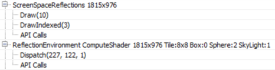](https://interplayoflight.files.wordpress.com/2017/10/image48.png)

The shader also uses the Hi-Z buffer calculated towards the beginning  of the frame to speed up intersection calculations by selecting the  Hi-Z mip during raymarching based on the surface roughness (i.e. making  raytracing coarser for rougher surfaces where details in the reflection  are not visible). Finally every frame the ray start position is  jittered, which combined with temporal antialiasing increases the  reflections image quality.

[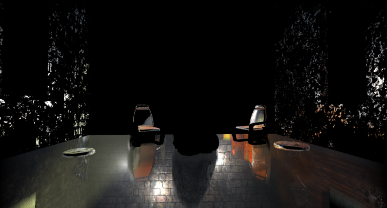](https://interplayoflight.files.wordpress.com/2017/10/image49.png)

The shader uses the previous frame’s rendertarget for sampling colour  when a hit is determined during raymarching, you can see this from the  volumetric fog in the reflections as well as the reflected transparent  props (statues). You can also see hints of the particle effect under the  chair on the right. Since we lack proper depth for transparent surfaces  (to calculate the correct hits) the reflections are usually stretched  but the effect is fairly convincing in many cases.

The screen space reflections are applied to the main rendertarget using a compute shader (**ReflectionEnvironment**  pass). This shader also applies the environmental reflections captured  by the two reflection probes in the scene. The reflections are stored in  a mipmapped cubemap per probe:

[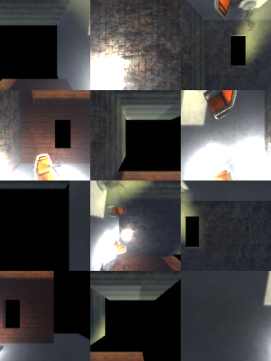](https://interplayoflight.files.wordpress.com/2017/10/image50.png)

The environment reflection probes are generated during game startup  and they only capture “Static” geometry (notice how the animated Rock  prop is missing in the above cubemaps).

Our scene, with SSR and environmental reflections applied, now looks like this.

[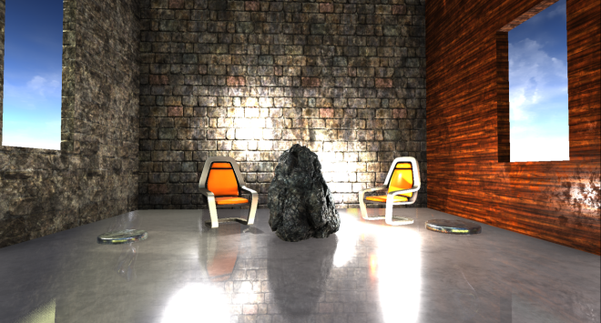](https://interplayoflight.files.wordpress.com/2017/10/image51.png)

**Fog and atmospheric effects** 

Fog and atmospheric effect follow, again if activated in your scene.

[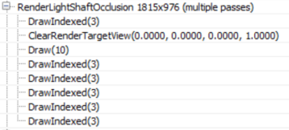](https://interplayoflight.files.wordpress.com/2017/10/image52.png)

First a quarter resolution lightshaft occlusion mask is created which  specifies which pixels will receive a lightshafts (which apply only to  the directional light in this scene).

[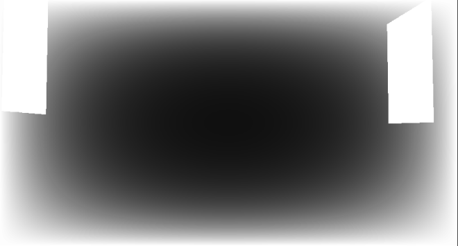](https://interplayoflight.files.wordpress.com/2017/10/image53.png)

The renderer then goes on to improve the quality of the mask using  temporal antialiasing and applies 3 blurring passes to it producing this  mask (which I had to enhance at it was mostly white):

It is not entirely clear to me from this GPU capture why temporal AA  is applied to the mask before blurring it, as the final result is very  low res. It will probably take more use cases in different environments  to clarify this.

Before applying the fog and lightshafts to the scene, the renderer  takes a quite break to apply atmospherics to the main rendertarget (full  res).

[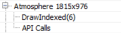](https://interplayoflight.files.wordpress.com/2017/10/image55.png)

This looks like a full-blown scattering calculation, using precomputed transmittance, irradiance and inscattering, similar to [Bruneton et al](https://hal.inria.fr/inria-00288758/file/article.pdf).

[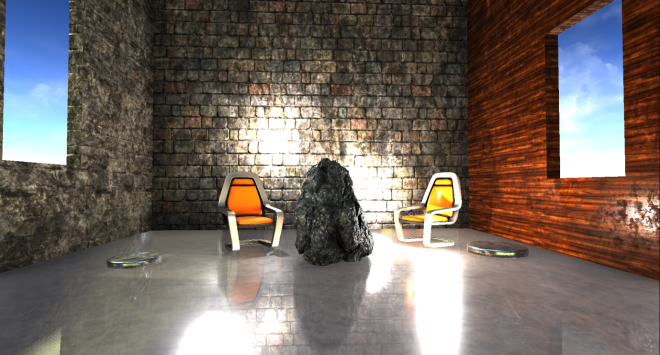](https://interplayoflight.files.wordpress.com/2017/10/image56.png)

This being an indoors scene the effects of the simulation are not very visible unfortunately.

Finally, the renderer applies the exponential fog and lightshafts to the scene.

[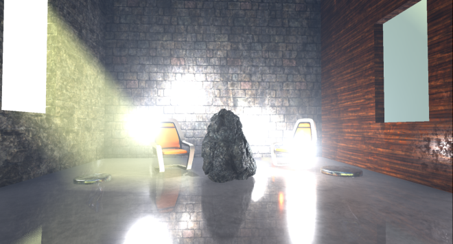](https://interplayoflight.files.wordpress.com/2017/10/image57.png)

 

The shader uses the Volumetric Fog volume texture produced a few  passes ago, using the solid geometry position to sample from it. It also  applies the lightshaft mask calculated above.

**Transparency rendering** 

After fog has been applied to solid props, the renderer tackles translucent geometry and effects.

[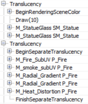](https://interplayoflight.files.wordpress.com/2017/10/image58.png)

In the scene I have added 2 glass statues which get rendered first, using normal alpha blending over the main render target.

[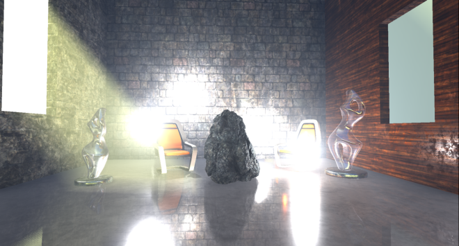](https://interplayoflight.files.wordpress.com/2017/10/image59.png)

The two transparent props sit in the scene very well, being affected  by the local and directional lights, environmental reflections, fog etc.  By default, the renderer uses a high quality shader to render  transparent props which samples, among others, the atmospheric  simulation precomputed textures, baked lightmap data, the translucency  lighting volumes which contain lighting from the directional and local  lights and the reflection probe cubemaps and uses them to calculate  lighting. I didn’t see the shader reading the volumetric fog volume  texture though, it only seems to calculate height/distance based fog,  maybe I missed a setting somewhere. The distance fog, like the  atmospheric scattering is calculated in the vertex shader.

Particle effects the renderer writes out to a separate (full resolution) rendertarget.

[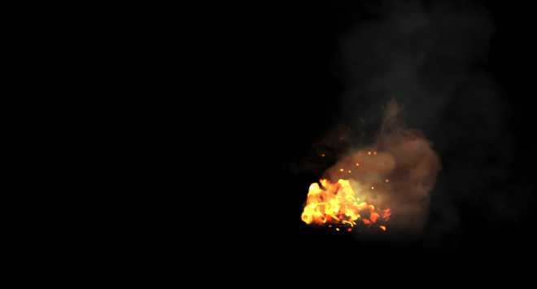](https://interplayoflight.files.wordpress.com/2017/10/image60.png)

Like for transparent props, the atmospheric scattering and fog are  calculated in the vertex shader. Additionally, based on the particle  system settings, the renderer can use the translucency lighting volumes  to light the particles (in the pixel shader in the one instance I saw it  doing this).

The renderer performs another pass before finishing off the transparencies to calculate refraction.

Both transparent props and particles (that are set to refract) are  rendered again to write out a full resolution buffer with the distortion  vectors that will later be used to calculate refraction (I enhanced the  image to make the vectors more visible). The stencil buffer is also  active during that pass to mark the pixels that need refracting.

[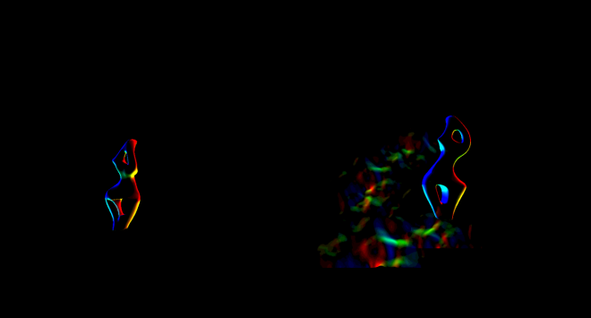](https://interplayoflight.files.wordpress.com/2017/10/image62.png)

During the refraction calculation pass (**DistortionApply**)  the renderer reads the contents of the main rendertarget (so far) and  the distortion vectors and writes out a weird refraction texture.

[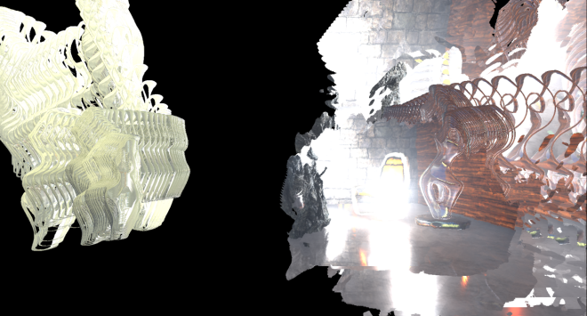](https://interplayoflight.files.wordpress.com/2017/10/image63.png)

Since the stencil buffer is active to mark the pixels that will  receive the refraction, the renderer does not need to clear the texture.

The final refraction pass just copies the refraction texture to the  main rendertarget, using the stencil as we’ve already mentioned.

[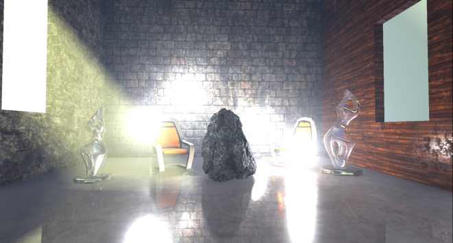](https://interplayoflight.files.wordpress.com/2017/10/image64.png)

You can maybe notice the refraction on the right chair which is due  to the particles that we did not apply yet. For the transparent props  the refraction is rendered after the prop has been rendered.

The next pass (**BokehDOFRecombine**), finally applies  the particles to the scene. It is a simple shader which does less that  the pass name suggests (maybe it depends on the rendering settings).

[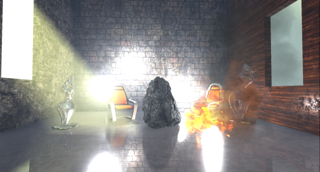](https://interplayoflight.files.wordpress.com/2017/10/image65.png)

**Post processing** 

The final part of the frame timeline involves some postprocessing passes which will briefly go through.

[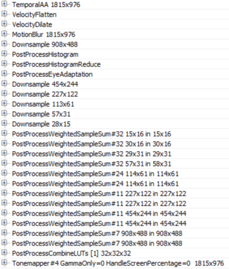](https://interplayoflight.files.wordpress.com/2017/10/image66.png)

With the current scene configuration, the renderer applies temporal  antialiasing, motion blur, auto exposure calculations, bloom and  tonemapping to the main rendertarget.

Unreal’s temporal antialiasing uses a history buffer to accumulate  samples over time and it is rendered in two passes. The first pass  implements the temporal AA for pixels that are not stencilled (in this  case some particles) using the main rendertarget, the history buffer and  the velocity buffer for reprojection:

[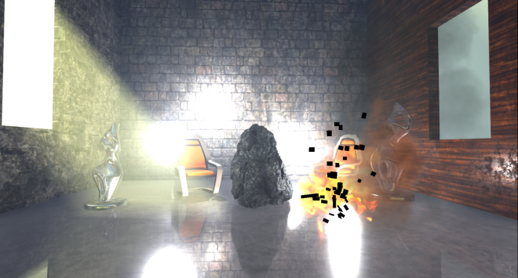](https://interplayoflight.files.wordpress.com/2017/10/image67.png)

Then a similar temporal AA pass is performed for the stencilled bits to produce the final antialiased image:

The difference between those two temporal AA passes is that the first  one uses a blend factor (feedback) between the history buffer and the  current rendertarget that is variable and can depend on pixel  luminocity, distance, renderer provided weights etc (based on the  settings), the second pass uses a fixed blend factor of 0.25, meaning  that the final antialiased pixel will mostly contain the current sample.  I assume this is done to reduce ghosting for fast moving particles for  which we have no velocity information.

Next Motion Blur follows, preceded by a velocity flattening and dilation pass.

The effect of motion blur in this case is not very noticeable because  in the current scene the camera is static and the only moving prop, for  which we have velocities, is the Rock (which is already slightly  blurred due to motion and temporal antialiasing).

To implement autoexposure (eye adaption) the renderer creates a  histogram of the current scene luminocity using a compute shader. The  histogram bin pixel intensities and calculates how many pixels fall  within each intensity bin.

[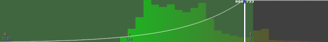](https://interplayoflight.files.wordpress.com/2017/10/image70.png)

The advantage of such an approach is that we can easily skip areas of  an image that have very dark values or very bright values and produce a  more reasonable approximation of the average scene luminance. Using  that average luminance the renderer can then calculate the eye  adaptation by adjusting the exposure accordingly (bright images will  lead to low exposure and darker images will lead to higher exposure).

A series of downscaling passes using Gaussian filtering take place,  followed by a series of upscaling and combining to implement the Bloom  effect (image adjusted to make it more visible, without exposure  control).

[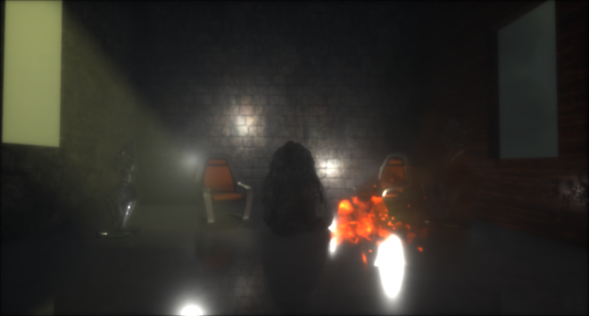](https://interplayoflight.files.wordpress.com/2017/10/image71.png)

The **PostProcessCombineLUTs** pass uses a geometry  shader and a fairly long pixel shader to create the colourgrading LUT (a  32x32x32 RGB10A2 volume texture) that will be used during tonemapping:

[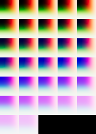](https://interplayoflight.files.wordpress.com/2017/10/image72.png)

The final pass in the frame, **Tonemapper**, combines  the bloom calculated above with the main rendertarget, adjusts the  exposure of the image using the eye adaptation calculated previously  before passing the colour through the colourgrading LUT to produce the  final pixel colour:

[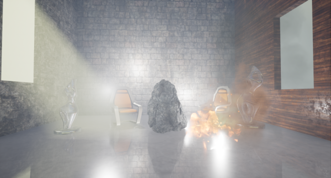](https://interplayoflight.files.wordpress.com/2017/10/image1.png)

**Wrapping up** 

I must stress that this was just one path through the renderer, many  parameters and settings might affect it and we have just scratched the  surface really.

In overall, that was an interesting exercise, although with the large  amount of work done in a frame it turned out more of a “what” the  renderer does than “how” than I’d like and I left many things unexplored  that I would like to revisit.

Unreal’s renderer source is not extensively documented but it is  fairly clean and easy to understand and by following the drawcall list  it is easy to find the code that corresponds to it. It can be quite hard  to follow what the shaders do in many cases, by studying the source,  though as it uses conditional compilation extensively. It would be nice  if there was some intermediate cache of processed, “compile-able” shader  specialisations (with names injected into the drawcall list) for  inspection and performance profiling.

By default, Unreal’s renderer appears to place an emphasis on  producing high quality images. It relies on baking of data (environment,  light, volumetrics etc) as much as possible and uses temporal  antialiasing to a great effect to improve image quality.

It is worth keeping an eye out on the occlusion pass cost if you have  lots of props in the scene and not many opportunities for occlusion  (i.e. many large occluders). Also refraction on transparent props and  particles forces them to render twice. Finally, many stationary or  movable local lights may have an impact during the Lighting pass as they  are rendered individually (and add to the light injection pass cost for  transparencies and volumetrics).

Closing, kudos to [Baldurk](https://twitter.com/baldurk) for the excellent RenderDoc and to Epic for making the source code of Unreal available to all to use, study and learn.