# 虚幻4乱改引擎卡通渲染篇【第三卷：次世代漫画のレンダリングの最初の試み】

然后是老规矩先上效果：


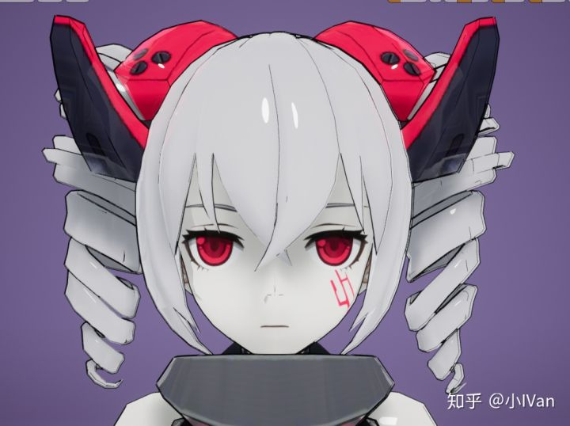


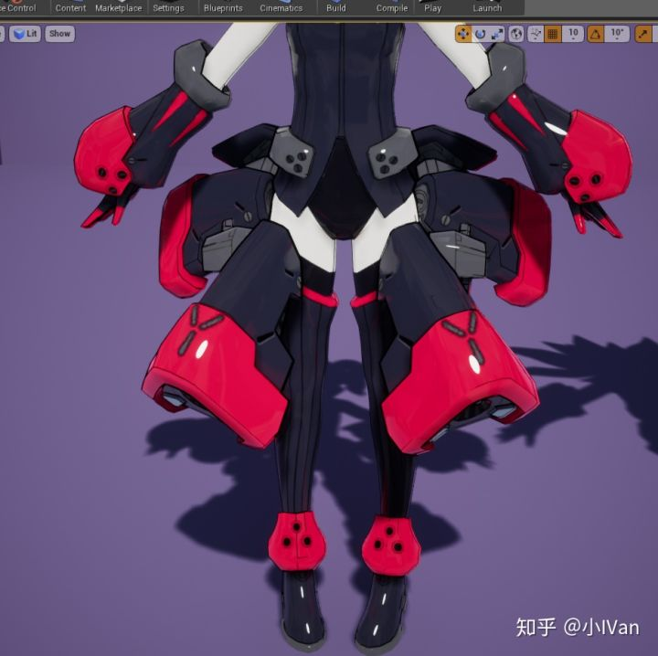


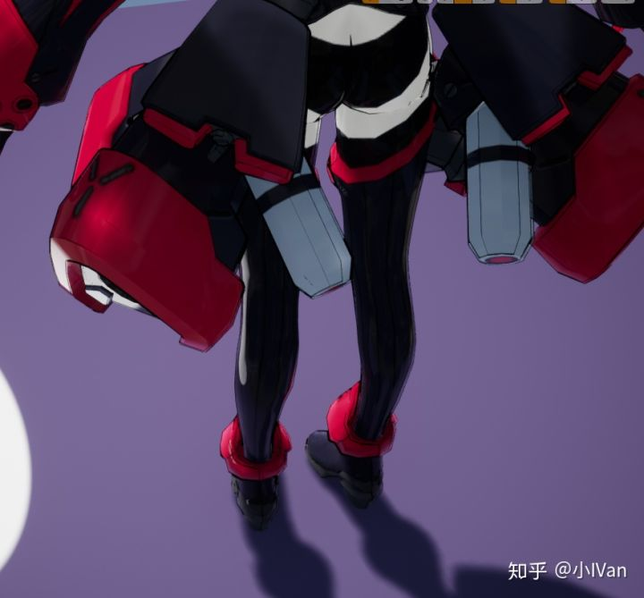

要实现次世代卡通效果我们需要以下步骤

（1）先做出正确的PBR效果

（2）对渲染进行风格化

（3）改进优化

------

## **第一点首先要做出正确的PBR效果**

这一步在虚幻里简直就是天生的优势，因为虚幻的PBR渲染管线是非常标准的，我们要基于这个框架来进行风格化修改。虚幻的PBR框架我前面的文章有详细描述，这里我就不多解释了。

## **第二点对渲染进行风格化**

我们搞清楚第一步以后，我们需要对渲染进行风格化，首先我们要风格化光影着色，前面第一第二章已经做了这个事情了

下面是高光模型的风格化处理


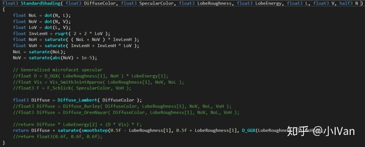

然后是阴影计算的风格化处理


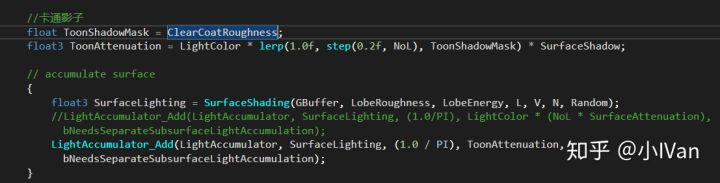

然后我对IBL进行风格化处理


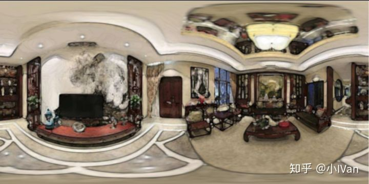

这是我的环境图，我对它进行了风格化处理

然后我们需要对菲尼尔项进行风格化处理，菲尼尔项被风格化处理成了勾线。

勾线用了两种种办法

第一种是屏幕空间的勾线，用法线和深度来查找边缘，这个在第二卷有详细说明。但是这种办法会出一些问题，就是内部会有杂线


我的解决方法是再渲染一个mask，来遮蔽掉这些杂线


然后是光影了，人物面部模型可能会产生一些奇怪的影子


同样我渲染了一个遮罩来解决这个问题


然后是处理大体的勾线了，我法线基于屏幕空间的勾线其实不是很好控制，于是我换了另一种方式来处理。把模型渲染两次然后沿着法线在屏幕空间把模型挤出，这样渲染一条边缘


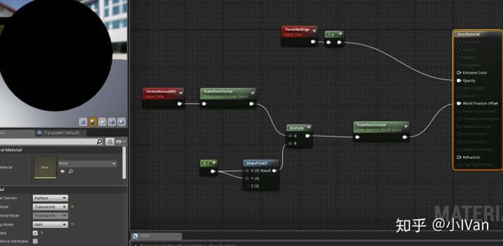

仅屏幕空间勾线：


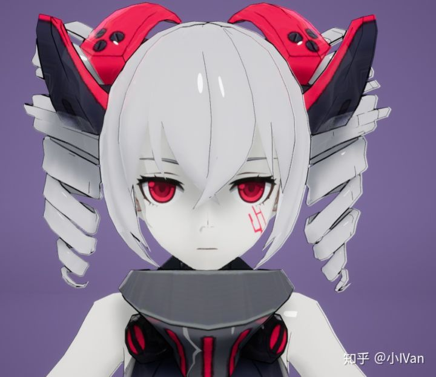

渲染二次模型勾线：


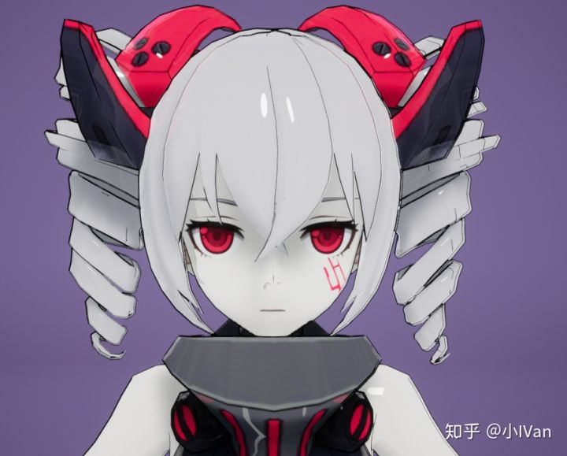

把高光去再风格化一下试试：


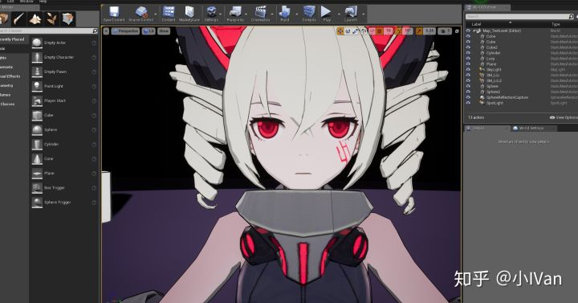

头发上的杂线我不想处理掉，我感觉这样留点笔触的感觉也挺好，后面会对皮肤光照模型和头发光照模型进行风格化改造。

完整代码修改如下：

ShadingMode.ush


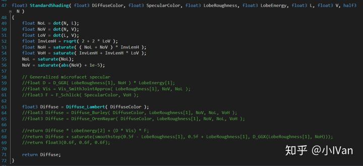

DefrredLightingCommon.ush


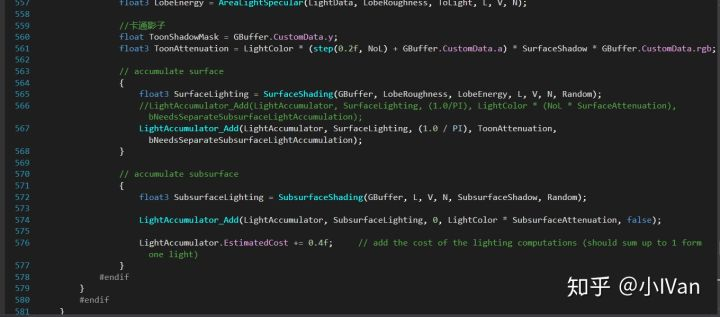

ToonOutline.usf


ToonOutLineRendering.cpp

```cpp
#include "DeferredShadingRenderer.h"
#include "AtmosphereRendering.h"
#include "ScenePrivate.h"
#include "Engine/TextureCube.h"
#include "PipelineStateCache.h"
#include "SceneView.h"

DECLARE_GPU_STAT(ToonOutLine);

class FToonOutLineVS : public FGlobalShader
{
	DECLARE_SHADER_TYPE(FToonOutLineVS, Global);

public:

	FToonOutLineVS(){}
	FToonOutLineVS(const ShaderMetaType::CompiledShaderInitializerType& Initializer) :
		FGlobalShader(Initializer)
	{
		//这里做绑定
	}

	static bool ShouldCompilePermutation(const FGlobalShaderPermutationParameters& Parameters)
	{
		return IsFeatureLevelSupported(Parameters.Platform, ERHIFeatureLevel::SM4);
	}

	static void ModifyCompilationEnvironment(const FGlobalShaderPermutationParameters& Parameters, FShaderCompilerEnvironment& OutEnvironment)
	{

	}

	virtual bool Serialize(FArchive& Ar) override
	{
		bool bShaderHasOutdatedParameters = FGlobalShader::Serialize(Ar);
		return bShaderHasOutdatedParameters;
	}

private:
	//成员

};

IMPLEMENT_SHADER_TYPE(, FToonOutLineVS, TEXT("/Engine/Private/ToonOutline.usf"), TEXT("MainVS"), SF_Vertex);

class FToonOutLinePS : public FGlobalShader
{
	DECLARE_SHADER_TYPE(FToonOutLinePS, Global);

public:

	FToonOutLinePS() {}
	FToonOutLinePS(const ShaderMetaType::CompiledShaderInitializerType& Initializer) :
		FGlobalShader(Initializer)
	{
		//这里做绑定
		GBufferATextureVal.Bind(Initializer.ParameterMap, TEXT("GBufferATexture"));
		GBufferATextureSampler.Bind(Initializer.ParameterMap, TEXT("GBufferATextureSampler"));
		DepthTextureVal.Bind(Initializer.ParameterMap, TEXT("DepthTexture"));
		DepthTextureSampler.Bind(Initializer.ParameterMap, TEXT("DepthTextureSampler"));
		SceneTextureVal.Bind(Initializer.ParameterMap, TEXT("SceneTexture"));
		SceneTextureSampler.Bind(Initializer.ParameterMap, TEXT("SceneTextureSampler"));
		CustomDataTextureVal.Bind(Initializer.ParameterMap, TEXT("CustomDataTexture"));
		CustomDataTextureSampler.Bind(Initializer.ParameterMap, TEXT("CustomDataTextureSampler"));
	}

	static bool ShouldCompilePermutation(const FGlobalShaderPermutationParameters& Parameters)
	{
		return IsFeatureLevelSupported(Parameters.Platform, ERHIFeatureLevel::SM4);
	}

	static void ModifyCompilationEnvironment(const FGlobalShaderPermutationParameters& Parameters, FShaderCompilerEnvironment& OutEnvironment)
	{

	}

	virtual bool Serialize(FArchive& Ar) override
	{
		bool bShaderHasOutdatedParameters = FGlobalShader::Serialize(Ar);
		Ar << GBufferATextureVal << GBufferATextureSampler << DepthTextureVal << DepthTextureSampler << SceneTextureVal << SceneTextureSampler << CustomDataTextureVal << CustomDataTextureSampler;
		return bShaderHasOutdatedParameters;
	}

	void SetRenderAssets(FRHICommandListImmediate& RHICmdList, FSceneRenderTargets& SceneContext,const FViewInfo& View)
	{
		SetTextureParameter(
			RHICmdList,
			GetPixelShader(),
			GBufferATextureVal,
			GBufferATextureSampler,
			TStaticSamplerState<SF_Trilinear, AM_Clamp, AM_Clamp, AM_Clamp>::GetRHI(),
			SceneContext.GetGBufferATexture()
		);

		SetTextureParameter(
			RHICmdList,
			GetPixelShader(),
			DepthTextureVal,
			DepthTextureSampler,
			TStaticSamplerState<SF_Trilinear, AM_Clamp, AM_Clamp, AM_Clamp>::GetRHI(),
			SceneContext.GetSceneDepthSurface()
		);

		SetTextureParameter(
			RHICmdList,
			GetPixelShader(),
			SceneTextureVal,
			SceneTextureSampler,
			TStaticSamplerState<SF_Trilinear, AM_Clamp, AM_Clamp, AM_Clamp>::GetRHI(),
			SceneContext.GetSceneColorSurface()
		);

		SetTextureParameter(
			RHICmdList,
			GetPixelShader(),
			CustomDataTextureVal,
			CustomDataTextureSampler,
			TStaticSamplerState<SF_Trilinear, AM_Clamp, AM_Clamp, AM_Clamp>::GetRHI(),
			SceneContext.GetGBufferDTexture()
		);

		SetUniformBufferParameter(
			RHICmdList,
			GetPixelShader(),
			GetUniformBufferParameter<FViewUniformShaderParameters>(),
			View.ViewUniformBuffer
		);

		//SetUniformBufferParameter(
		//	RHICmdList,
		//	GetPixelShader(),
		//	GetUniformBufferParameter<FViewUniformShaderParameters>(),
		//	GIdentityPrimitiveUniformBuffer.GetUniformBufferRHI()
		//);
	}

private:

	FShaderResourceParameter GBufferATextureVal;
	FShaderResourceParameter GBufferATextureSampler;
	FShaderResourceParameter DepthTextureVal;
	FShaderResourceParameter DepthTextureSampler;
	FShaderResourceParameter SceneTextureVal;
	FShaderResourceParameter SceneTextureSampler;
	FShaderResourceParameter CustomDataTextureVal;
	FShaderResourceParameter CustomDataTextureSampler;
};

IMPLEMENT_SHADER_TYPE(, FToonOutLinePS, TEXT("/Engine/Private/ToonOutline.usf"), TEXT("MainPS"), SF_Pixel);

struct FToonOutLineVertex
{
	FVector4	Position;
	FVector2D	UV;
};

class FToonOutLineVertexDesc : public FRenderResource
{

public:

	FVertexDeclarationRHIRef VertexDeclarationRHI;

	// Destructor
	virtual ~FToonOutLineVertexDesc() {}

	virtual void InitRHI() override
	{
		FVertexDeclarationElementList Elements;
		uint32 Stride = sizeof(FToonOutLineVertex);
		Elements.Add(FVertexElement(0, STRUCT_OFFSET(FToonOutLineVertex, Position), VET_Float4, 0, Stride));
		Elements.Add(FVertexElement(0, STRUCT_OFFSET(FToonOutLineVertex, UV), VET_Float2, 1, Stride));
		VertexDeclarationRHI = RHICreateVertexDeclaration(Elements);
	}

	virtual void ReleaseRHI() override
	{
		VertexDeclarationRHI.SafeRelease();
	}
};

TGlobalResource<FToonOutLineVertexDesc> GToonOutLineVertexDesc;

void FDeferredShadingSceneRenderer::RenderToonOutLine(FRHICommandListImmediate& RHICmdList)
{
	// Draw grid.
	//uint32 PrimitiveCount = 2;
	//RHICmdList.DrawPrimitive(PT_TriangleList, 0, PrimitiveCount, 1);
	FToonOutLineVertex Vertices[4];
	Vertices[0].Position.Set(-1.0f, 1.0f, 0, 1.0f);
	Vertices[1].Position.Set(1.0f, 1.0f, 0, 1.0f);
	Vertices[2].Position.Set(-1.0f, -1.0f, 0, 1.0f);
	Vertices[3].Position.Set(1.0f, -1.0f, 0, 1.0f);
	Vertices[0].UV = FVector2D(0.0f, 0.0f);
	Vertices[1].UV = FVector2D(1.0f, 0.0f);
	Vertices[2].UV = FVector2D(0.0f, 1.0f);
	Vertices[3].UV = FVector2D(1.0f, 1.0f);

	static const uint16 Indices[6] =
	{
		0, 1, 2,
		2, 1, 3
	};

	FSceneRenderTargets& SceneContext = FSceneRenderTargets::Get(RHICmdList);

	SceneContext.BeginRenderingSceneColor(RHICmdList, ESimpleRenderTargetMode::EExistingColorAndDepth, FExclusiveDepthStencil::DepthRead_StencilWrite, true);

	FGraphicsPipelineStateInitializer GraphicsPSOInit;
	RHICmdList.ApplyCachedRenderTargets(GraphicsPSOInit);

	for (int32 ViewIndex = 0; ViewIndex < Views.Num(); ViewIndex++)
	{
		const FViewInfo& View = Views[ViewIndex];

		if (View.IsPerspectiveProjection() == false)
		{
			continue;
		}

		TShaderMapRef<FToonOutLineVS> VertexShader(View.ShaderMap);
		TShaderMapRef<FToonOutLinePS> PixelShader(View.ShaderMap);

		RHICmdList.SetViewport(View.ViewRect.Min.X, View.ViewRect.Min.Y, 0.0f, View.ViewRect.Max.X, View.ViewRect.Max.Y, 1.0f);

		GraphicsPSOInit.RasterizerState = TStaticRasterizerState<FM_Solid, CM_None>::GetRHI();
		//GraphicsPSOInit.BlendState = TStaticBlendState<CW_RGB, BO_Add, BF_One, BF_SourceAlpha>::GetRHI();
		GraphicsPSOInit.BlendState = TStaticBlendState<CW_RGB, BO_Min, BF_One, BF_SourceAlpha>::GetRHI();
		GraphicsPSOInit.DepthStencilState = TStaticDepthStencilState<false, CF_Always>::GetRHI();
		GraphicsPSOInit.PrimitiveType = PT_TriangleList;
		GraphicsPSOInit.BoundShaderState.VertexDeclarationRHI = GToonOutLineVertexDesc.VertexDeclarationRHI;
		GraphicsPSOInit.BoundShaderState.VertexShaderRHI = GETSAFERHISHADER_VERTEX(*VertexShader);
		GraphicsPSOInit.BoundShaderState.PixelShaderRHI = GETSAFERHISHADER_PIXEL(*PixelShader);
		SetGraphicsPipelineState(RHICmdList, GraphicsPSOInit);

		PixelShader->SetRenderAssets(RHICmdList, SceneContext, View);
		
		// Draw a quad covering the view.
		DrawIndexedPrimitiveUP(
			RHICmdList,
			PT_TriangleList,
			0,
			ARRAY_COUNT(Vertices),
			2,
			Indices,
			sizeof(Indices[0]),
			Vertices,
			sizeof(Vertices[0])
		);
	}
}
```

DeferredShadingRender.h


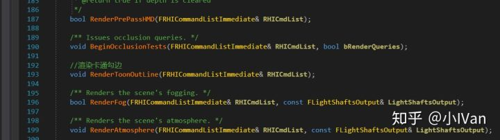

DeferredShadingRenderer.cpp


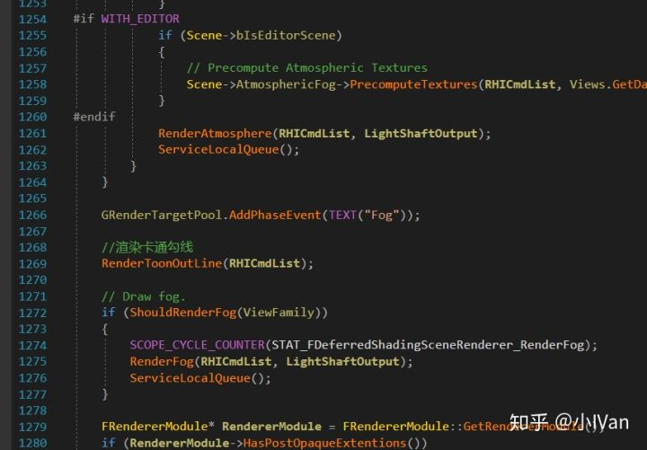

BasePassCommon.ush


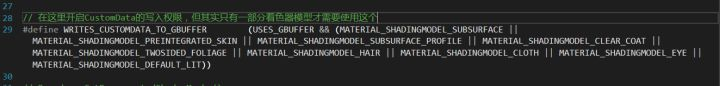

ShadingModeMaterial.ush


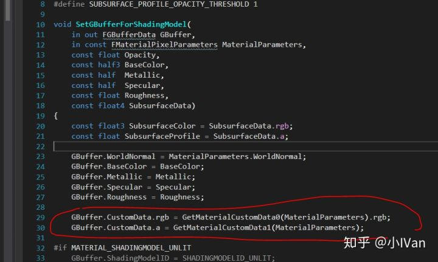

Material.cpp的bool UMaterial::IsPropertyActive(EMaterialProperty InProperty) const 函数


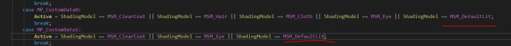

MaterialGraph.cpp


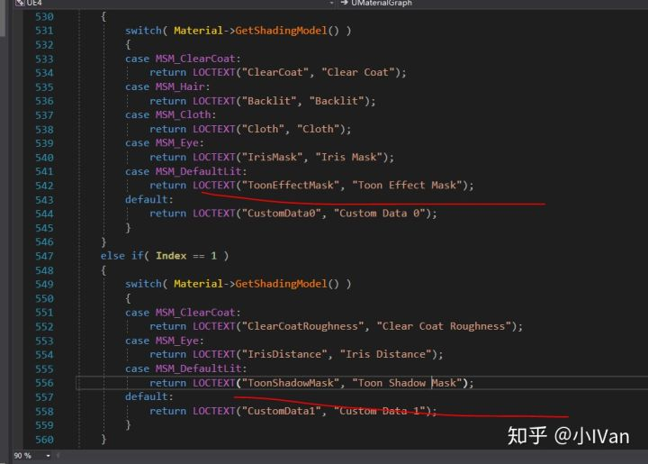

Enjoy it!!!
