# 虚幻4乱改引擎卡通渲染篇【第二卷：初步描边勾线】


首先先感谢一下Alex Tsui的文章！

然后老规矩上效果：


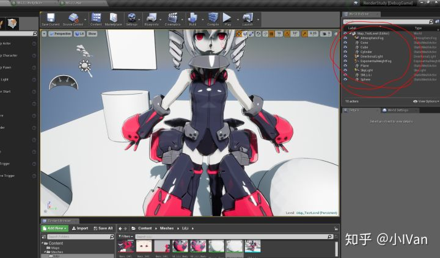

我刻意用红线标明我的勾线等处理没有用后处理！为什么这么做呢，我后续说明。

下面是勾线：


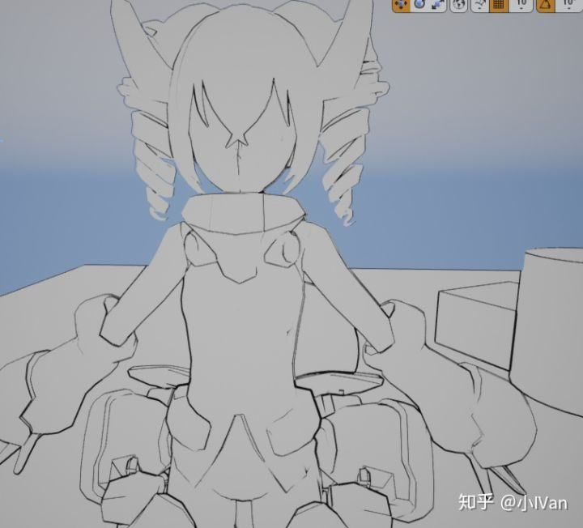


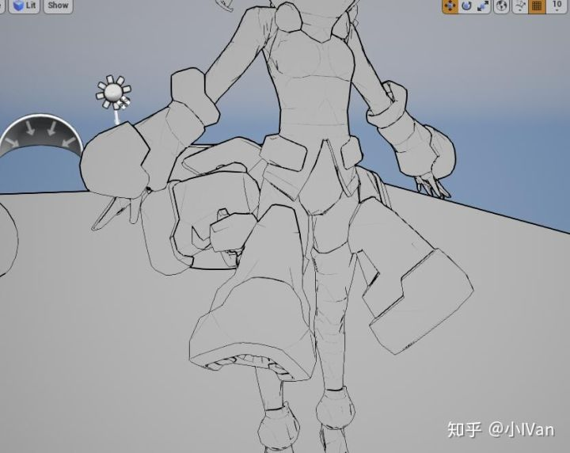

这只是初步效果，以后我们会进一步完善优化。线的粗细是可以自己调的。那么下面就开始吧。

------


首先需要说明一点的是，后处理也能做出很好的效果，但是有一个问题，请看下图：


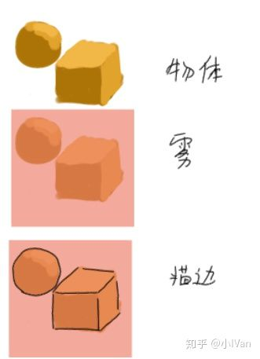


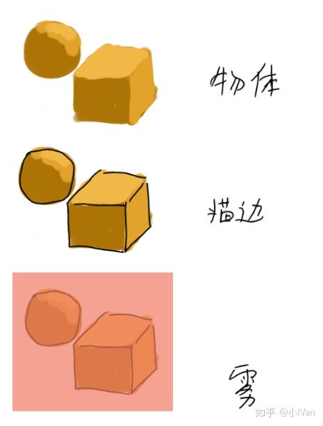

（拿鼠标画的。字丑，画丑还请见谅）

仔细对比不难法线区别


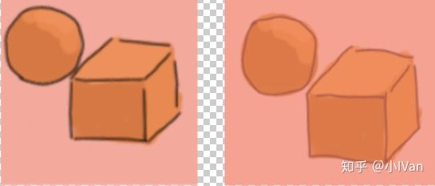

现在的线是黑色的，如果线是其他颜色比如深褐色，如果还在后处理里面勾线其实是有问题的。而且后处理里很难处理一些比较复杂的东西。后面我们需要控制哪些物体勾线哪些不勾，哪些物体勾不同颜色的线，物体有些结构线很粗有些结构线很细。我们的目的是把虚幻改造成一个次世代卡通渲染引擎嘛，所以引擎应该原生自带勾线pass。下面我们就在上一节的基础上做进一步修改。


我们先新建两个文件


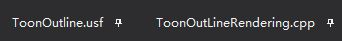

ToonOutline.usf放在引擎的shader目录的private下


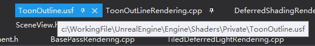


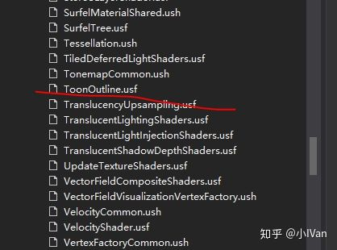

ToonOutLineRendering.cpp放在Render目录下


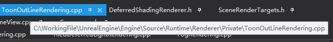


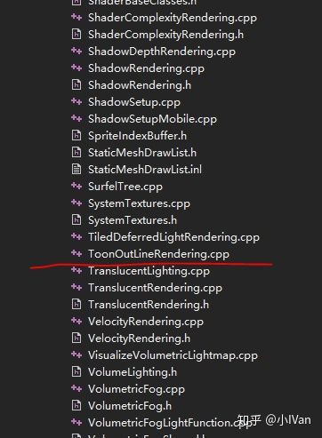

然后generate一下就可以了。

在做修改前我们需要了解虚幻引擎才行，下面我们打开如下源码文件：


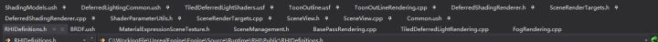

首先看到DefrredShadingRender.h和DefrredShadingRender.cpp两个，这两个便是控制我们渲染的主要函数了。场景渲染的DrawCall大都是在这里发生的。我们在DefrredShadingRendering.h中加入我们的渲染pass函数：


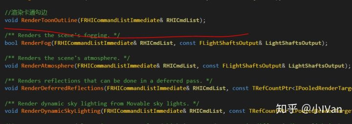

然后来到DefrredShadingRender.cpp里找到Render主函数


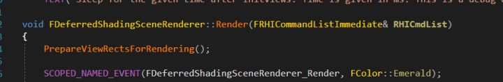

然后我们在Render函数中加入我们这个卡通勾线渲染pass函数的调用


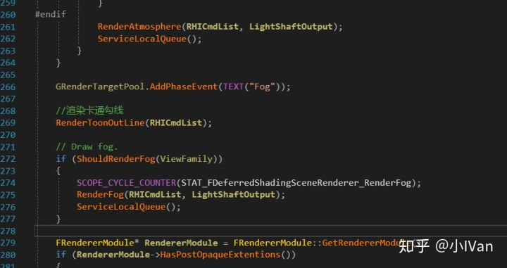

可以看到我们可以控制我们的pass在任意渲染pass之前还是之后，这里我们选择在画雾之前绘制我们的勾线。

完成这一步之后自然是要对我们的RenderToonOutLine渲染pass函数进行完善啦。来到我们的ToonOutLineRendering.cpp文件，我们敲出我们的代码框架：

```text
#include "DeferredShadingRenderer.h"
#include "AtmosphereRendering.h"
#include "ScenePrivate.h"
#include "Engine/TextureCube.h"
#include "PipelineStateCache.h"
#include "SceneView.h"

DECLARE_GPU_STAT(ToonOutLine);

class FToonOutLineVS : public FGlobalShader
{
	DECLARE_SHADER_TYPE(FToonOutLineVS, Global);

public:

	FToonOutLineVS(){}
	FToonOutLineVS(const ShaderMetaType::CompiledShaderInitializerType& Initializer) :
		FGlobalShader(Initializer)
	{
		//这里做绑定
	}

	static bool ShouldCompilePermutation(const FGlobalShaderPermutationParameters& Parameters)
	{
		return IsFeatureLevelSupported(Parameters.Platform, ERHIFeatureLevel::SM4);
	}

	static void ModifyCompilationEnvironment(const FGlobalShaderPermutationParameters& Parameters, FShaderCompilerEnvironment& OutEnvironment)
	{

	}

	virtual bool Serialize(FArchive& Ar) override
	{
		bool bShaderHasOutdatedParameters = FGlobalShader::Serialize(Ar);
		return bShaderHasOutdatedParameters;
	}

private:
	//成员

};

IMPLEMENT_SHADER_TYPE(, FToonOutLineVS, TEXT("/Engine/Private/ToonOutline.usf"), TEXT("MainVS"), SF_Vertex);

class FToonOutLinePS : public FGlobalShader
{
	DECLARE_SHADER_TYPE(FToonOutLinePS, Global);

public:

	FToonOutLinePS() {}
	FToonOutLinePS(const ShaderMetaType::CompiledShaderInitializerType& Initializer) :
		FGlobalShader(Initializer)
	{
		//这里做绑定
	}

	static bool ShouldCompilePermutation(const FGlobalShaderPermutationParameters& Parameters)
	{
		return IsFeatureLevelSupported(Parameters.Platform, ERHIFeatureLevel::SM4);
	}

	static void ModifyCompilationEnvironment(const FGlobalShaderPermutationParameters& Parameters, FShaderCompilerEnvironment& OutEnvironment)
	{

	}

	virtual bool Serialize(FArchive& Ar) override
	{
		bool bShaderHasOutdatedParameters = FGlobalShader::Serialize(Ar);
		return bShaderHasOutdatedParameters;
	}

	void SetRenderAssets(FRHICommandListImmediate& RHICmdList, FSceneRenderTargets& SceneContext,const FViewInfo& View)
	{
	}

private:

};

IMPLEMENT_SHADER_TYPE(, FToonOutLinePS, TEXT("/Engine/Private/ToonOutline.usf"), TEXT("MainPS"), SF_Pixel);

struct FToonOutLineVertex
{
	FVector4	Position;
	FVector2D	UV;
};

class FToonOutLineVertexDesc : public FRenderResource
{

public:

	FVertexDeclarationRHIRef VertexDeclarationRHI;

	// Destructor
	virtual ~FToonOutLineVertexDesc() {}

	virtual void InitRHI() override
	{
		FVertexDeclarationElementList Elements;
		uint32 Stride = sizeof(FToonOutLineVertex);
		Elements.Add(FVertexElement(0, STRUCT_OFFSET(FToonOutLineVertex, Position), VET_Float4, 0, Stride));
		Elements.Add(FVertexElement(0, STRUCT_OFFSET(FToonOutLineVertex, UV), VET_Float2, 1, Stride));
		VertexDeclarationRHI = RHICreateVertexDeclaration(Elements);
	}

	virtual void ReleaseRHI() override
	{
		VertexDeclarationRHI.SafeRelease();
	}
};

TGlobalResource<FToonOutLineVertexDesc> GToonOutLineVertexDesc;

void FDeferredShadingSceneRenderer::RenderToonOutLine(FRHICommandListImmediate& RHICmdList)
{
}
```

可以看到还是非常简单的，我们需要一个顶点着色器，一个像素着色器，一个顶点输入布局。

然后我们敲出我们的shader代码框架

```text
#include "Common.ush"

void MainVS(
    in float4 InPosition : ATTRIBUTE0,
    in float2 InUV : ATTRIBUTE1,
    out float2 OutUV : TEXCOORD0,
    out float4 OutPosition : SV_POSITION
)
{
    OutPosition = InPosition;
    OutUV = InUV;
}

void MainPS(
    in float2 UV : TEXCOORD0,
    out float4 OutColor : SV_Target0
)
{
    OutColor = float4(1, 1, 1, 1);
}
```

我们完成了一个像素着色器和一个顶点着色器。

这部分的思路和我之前的一篇修改虚幻4Pass的文章类似。

小IVan：虚幻4渲染编程(Shader篇)【第九卷：自定义渲染管线】

zhuanlan.zhihu.com

我们把Render函数补全一下：

```text
void FDeferredShadingSceneRenderer::RenderToonOutLine(FRHICommandListImmediate& RHICmdList)
{
	// Draw grid.
	//uint32 PrimitiveCount = 2;
	//RHICmdList.DrawPrimitive(PT_TriangleList, 0, PrimitiveCount, 1);
	FToonOutLineVertex Vertices[4];
	Vertices[0].Position.Set(-1.0f, 1.0f, 0, 1.0f);
	Vertices[1].Position.Set(1.0f, 1.0f, 0, 1.0f);
	Vertices[2].Position.Set(-1.0f, -1.0f, 0, 1.0f);
	Vertices[3].Position.Set(1.0f, -1.0f, 0, 1.0f);
	Vertices[0].UV = FVector2D(0.0f, 0.0f);
	Vertices[1].UV = FVector2D(1.0f, 0.0f);
	Vertices[2].UV = FVector2D(0.0f, 1.0f);
	Vertices[3].UV = FVector2D(1.0f, 1.0f);

	static const uint16 Indices[6] =
	{
		0, 1, 2,
		2, 1, 3
	};

	FSceneRenderTargets& SceneContext = FSceneRenderTargets::Get(RHICmdList);

	SceneContext.BeginRenderingSceneColor(RHICmdList, ESimpleRenderTargetMode::EExistingColorAndDepth, FExclusiveDepthStencil::DepthRead_StencilWrite, true);

	FGraphicsPipelineStateInitializer GraphicsPSOInit;
	RHICmdList.ApplyCachedRenderTargets(GraphicsPSOInit);

	for (int32 ViewIndex = 0; ViewIndex < Views.Num(); ViewIndex++)
	{
		const FViewInfo& View = Views[ViewIndex];

		if (View.IsPerspectiveProjection() == false)
		{
			continue;
		}

		TShaderMapRef<FToonOutLineVS> VertexShader(View.ShaderMap);
		TShaderMapRef<FToonOutLinePS> PixelShader(View.ShaderMap);

		RHICmdList.SetViewport(View.ViewRect.Min.X, View.ViewRect.Min.Y, 0.0f, View.ViewRect.Max.X, View.ViewRect.Max.Y, 1.0f);

		GraphicsPSOInit.RasterizerState = TStaticRasterizerState<FM_Solid, CM_None>::GetRHI();
		//GraphicsPSOInit.BlendState = TStaticBlendState<CW_RGB, BO_Add, BF_One, BF_SourceAlpha>::GetRHI();
		GraphicsPSOInit.BlendState = TStaticBlendState<CW_RGB, BO_Min, BF_One, BF_SourceAlpha>::GetRHI();
		GraphicsPSOInit.DepthStencilState = TStaticDepthStencilState<false, CF_Always>::GetRHI();
		GraphicsPSOInit.PrimitiveType = PT_TriangleList;
		GraphicsPSOInit.BoundShaderState.VertexDeclarationRHI = GToonOutLineVertexDesc.VertexDeclarationRHI;
		GraphicsPSOInit.BoundShaderState.VertexShaderRHI = GETSAFERHISHADER_VERTEX(*VertexShader);
		GraphicsPSOInit.BoundShaderState.PixelShaderRHI = GETSAFERHISHADER_PIXEL(*PixelShader);
		SetGraphicsPipelineState(RHICmdList, GraphicsPSOInit);

		PixelShader->SetRenderAssets(RHICmdList, SceneContext, View);


		// Draw a quad covering the view.
		DrawIndexedPrimitiveUP(
			RHICmdList,
			PT_TriangleList,
			0,
			ARRAY_COUNT(Vertices),
			2,
			Indices,
			sizeof(Indices[0]),
			Vertices,
			sizeof(Vertices[0])
		);
	}
}
```

代码的开始我们需要注意屏幕空间面片的扰序和UV，unreal是dx的所以需要注意一下和gl的区别。


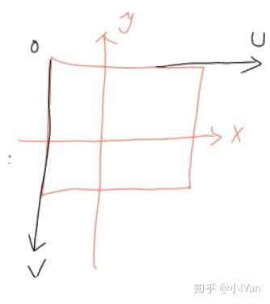

上面的代码里面有个SetRenderAsset函数，它是像素着色器的，我们去像素着色器中实现它


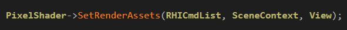


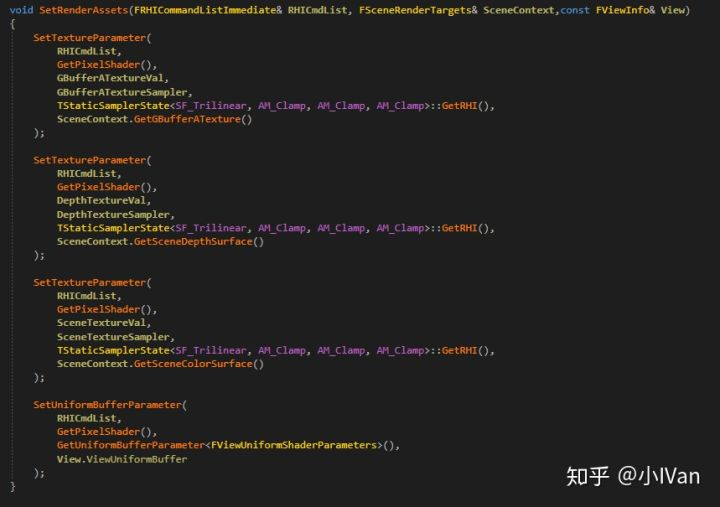

我们在这个函数中做了一些事情，传了GBuffer的一些数据进我们的pass，然后还传了一个UniformBuffer：View

我们先放下狂敲代码的双手，来看看这个ViewUniformBuffer。

我们找到SceneView的头文件和源文件


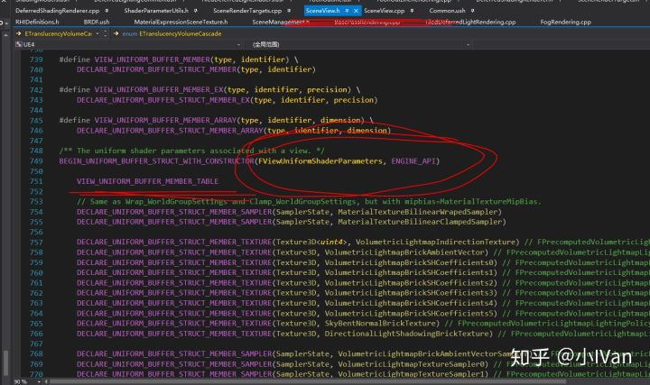

上图就是这个庞大的常量缓冲了，里面存了大量我们渲染的时候需要的数据。

我们不是还需要传GBuffer么，我们可以找到SceneRenderTarget头文件和源文件


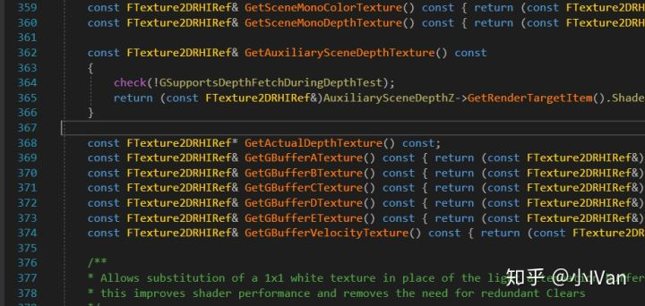

这里存了我们想要的各种buffer资源。


然后是我们在pixelshader里勾线了：

我们用处理图像的办法，对场景深度图和场景世界法线图分别进行卷积操作，


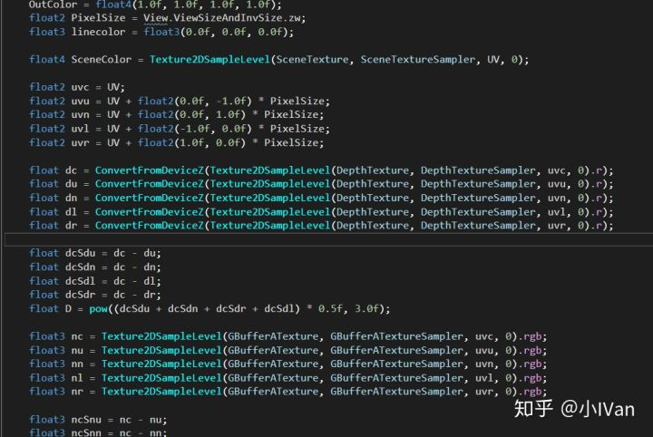

（这里别在意代码完整性，我只是截出关键部分，后面我会给出全部修改）

------

## **下面是我对引擎完整的修改**


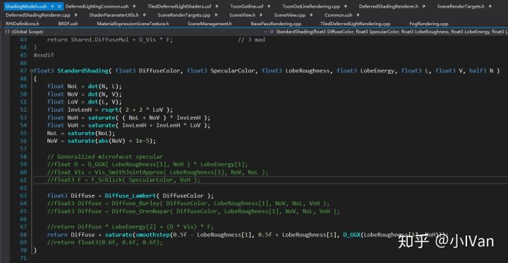


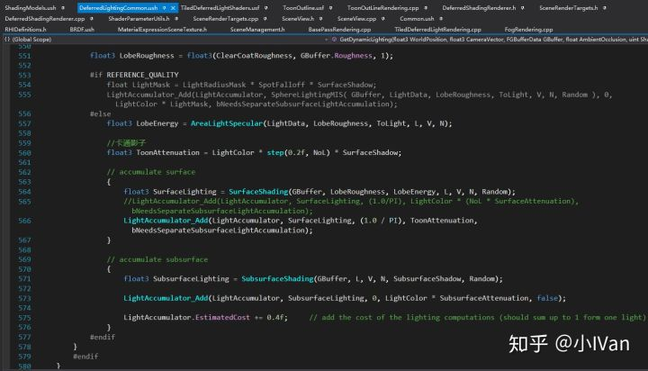

ToonOutline.usf

```text
#include "Common.ush"

void MainVS(
    in float4 InPosition : ATTRIBUTE0,
    in float2 InUV : ATTRIBUTE1,
    out float2 OutUV : TEXCOORD0,
    out float4 OutPosition : SV_POSITION
)
{
    OutPosition = InPosition;
    OutUV = InUV;
}

Texture2D GBufferATexture;
SamplerState GBufferATextureSampler;
Texture2D DepthTexture;
SamplerState DepthTextureSampler;
Texture2D SceneTexture;
SamplerState SceneTextureSampler;

void MainPS(
    in float2 UV : TEXCOORD0,
    out float4 OutColor : SV_Target0
)
{
    OutColor = float4(1.0f, 1.0f, 1.0f, 1.0f);
    float2 PixelSize = View.ViewSizeAndInvSize.zw;
    float3 linecolor = float3(0.0f, 0.0f, 0.0f);

    float4 SceneColor = Texture2DSampleLevel(SceneTexture, SceneTextureSampler, UV, 0);

    float2 uvc = UV;
    float2 uvu = UV + float2(0.0f, -1.0f) * PixelSize;
    float2 uvn = UV + float2(0.0f, 1.0f) * PixelSize;
    float2 uvl = UV + float2(-1.0f, 0.0f) * PixelSize;
    float2 uvr = UV + float2(1.0f, 0.0f) * PixelSize;
	
    float dc = ConvertFromDeviceZ(Texture2DSampleLevel(DepthTexture, DepthTextureSampler, uvc, 0).r);
    float du = ConvertFromDeviceZ(Texture2DSampleLevel(DepthTexture, DepthTextureSampler, uvu, 0).r);
    float dn = ConvertFromDeviceZ(Texture2DSampleLevel(DepthTexture, DepthTextureSampler, uvn, 0).r);
    float dl = ConvertFromDeviceZ(Texture2DSampleLevel(DepthTexture, DepthTextureSampler, uvl, 0).r);
    float dr = ConvertFromDeviceZ(Texture2DSampleLevel(DepthTexture, DepthTextureSampler, uvr, 0).r);

    float dcSdu = dc - du;
    float dcSdn = dc - dn;
    float dcSdl = dc - dl;
    float dcSdr = dc - dr;
    float D = pow((dcSdu + dcSdn + dcSdr + dcSdl) * 0.5f, 3.0f);

    float3 nc = Texture2DSampleLevel(GBufferATexture, GBufferATextureSampler, uvc, 0).rgb;
    float3 nu = Texture2DSampleLevel(GBufferATexture, GBufferATextureSampler, uvu, 0).rgb;
    float3 nn = Texture2DSampleLevel(GBufferATexture, GBufferATextureSampler, uvn, 0).rgb;
    float3 nl = Texture2DSampleLevel(GBufferATexture, GBufferATextureSampler, uvl, 0).rgb;
    float3 nr = Texture2DSampleLevel(GBufferATexture, GBufferATextureSampler, uvr, 0).rgb;

    float3 ncSnu = nc - nu;
    float3 ncSnn = nc - nn;
    float3 ncSnl = nc - nl;
    float3 ncSnr = nc - nr;
    float3 N = ncSnu + ncSnn + ncSnl + ncSnr;
    float na = N.x + N.y + N.z;
    float nb = pow(na * 10.0f, 5.0f);

    float a = saturate(max(nb, D));
    OutColor.rgb = lerp(float3(100.0f, 100.0f, 100.0f), float3(0, 0, 0), a);

	//float4(GBufferATexture.Sample(GBufferATextureSampler, UV.xy).rgb, 1.0f);
	//OutColor = float4(DepthTexture.Sample(DepthTextureSampler, UV.xy).rgb, 1.0f);
    //OutColor = float4(1, 1, 1, 1);
}
```

ToonOutLineRendering.cpp

```text
#include "DeferredShadingRenderer.h"
#include "AtmosphereRendering.h"
#include "ScenePrivate.h"
#include "Engine/TextureCube.h"
#include "PipelineStateCache.h"
#include "SceneView.h"

DECLARE_GPU_STAT(ToonOutLine);

class FToonOutLineVS : public FGlobalShader
{
	DECLARE_SHADER_TYPE(FToonOutLineVS, Global);

public:

	FToonOutLineVS(){}
	FToonOutLineVS(const ShaderMetaType::CompiledShaderInitializerType& Initializer) :
		FGlobalShader(Initializer)
	{
		//这里做绑定
	}

	static bool ShouldCompilePermutation(const FGlobalShaderPermutationParameters& Parameters)
	{
		return IsFeatureLevelSupported(Parameters.Platform, ERHIFeatureLevel::SM4);
	}

	static void ModifyCompilationEnvironment(const FGlobalShaderPermutationParameters& Parameters, FShaderCompilerEnvironment& OutEnvironment)
	{

	}

	virtual bool Serialize(FArchive& Ar) override
	{
		bool bShaderHasOutdatedParameters = FGlobalShader::Serialize(Ar);
		return bShaderHasOutdatedParameters;
	}

private:
	//成员

};

IMPLEMENT_SHADER_TYPE(, FToonOutLineVS, TEXT("/Engine/Private/ToonOutline.usf"), TEXT("MainVS"), SF_Vertex);

class FToonOutLinePS : public FGlobalShader
{
	DECLARE_SHADER_TYPE(FToonOutLinePS, Global);

public:

	FToonOutLinePS() {}
	FToonOutLinePS(const ShaderMetaType::CompiledShaderInitializerType& Initializer) :
		FGlobalShader(Initializer)
	{
		//这里做绑定
		GBufferATextureVal.Bind(Initializer.ParameterMap, TEXT("GBufferATexture"));
		GBufferATextureSampler.Bind(Initializer.ParameterMap, TEXT("GBufferATextureSampler"));
		DepthTextureVal.Bind(Initializer.ParameterMap, TEXT("DepthTexture"));
		DepthTextureSampler.Bind(Initializer.ParameterMap, TEXT("DepthTextureSampler"));
		SceneTextureVal.Bind(Initializer.ParameterMap, TEXT("SceneTexture"));
		SceneTextureSampler.Bind(Initializer.ParameterMap, TEXT("SceneTextureSampler"));
	}

	static bool ShouldCompilePermutation(const FGlobalShaderPermutationParameters& Parameters)
	{
		return IsFeatureLevelSupported(Parameters.Platform, ERHIFeatureLevel::SM4);
	}

	static void ModifyCompilationEnvironment(const FGlobalShaderPermutationParameters& Parameters, FShaderCompilerEnvironment& OutEnvironment)
	{

	}

	virtual bool Serialize(FArchive& Ar) override
	{
		bool bShaderHasOutdatedParameters = FGlobalShader::Serialize(Ar);
		Ar << GBufferATextureVal << GBufferATextureSampler << DepthTextureVal << DepthTextureSampler << SceneTextureVal << SceneTextureSampler;
		return bShaderHasOutdatedParameters;
	}

	void SetRenderAssets(FRHICommandListImmediate& RHICmdList, FSceneRenderTargets& SceneContext,const FViewInfo& View)
	{
		SetTextureParameter(
			RHICmdList,
			GetPixelShader(),
			GBufferATextureVal,
			GBufferATextureSampler,
			TStaticSamplerState<SF_Trilinear, AM_Clamp, AM_Clamp, AM_Clamp>::GetRHI(),
			SceneContext.GetGBufferATexture()
		);

		SetTextureParameter(
			RHICmdList,
			GetPixelShader(),
			DepthTextureVal,
			DepthTextureSampler,
			TStaticSamplerState<SF_Trilinear, AM_Clamp, AM_Clamp, AM_Clamp>::GetRHI(),
			SceneContext.GetSceneDepthSurface()
		);

		SetTextureParameter(
			RHICmdList,
			GetPixelShader(),
			SceneTextureVal,
			SceneTextureSampler,
			TStaticSamplerState<SF_Trilinear, AM_Clamp, AM_Clamp, AM_Clamp>::GetRHI(),
			SceneContext.GetSceneColorSurface()
		);

		SetUniformBufferParameter(
			RHICmdList,
			GetPixelShader(),
			GetUniformBufferParameter<FViewUniformShaderParameters>(),
			View.ViewUniformBuffer
		);
	}

private:

	FShaderResourceParameter GBufferATextureVal;
	FShaderResourceParameter GBufferATextureSampler;
	FShaderResourceParameter DepthTextureVal;
	FShaderResourceParameter DepthTextureSampler;
	FShaderResourceParameter SceneTextureVal;
	FShaderResourceParameter SceneTextureSampler;

};

IMPLEMENT_SHADER_TYPE(, FToonOutLinePS, TEXT("/Engine/Private/ToonOutline.usf"), TEXT("MainPS"), SF_Pixel);

struct FToonOutLineVertex
{
	FVector4	Position;
	FVector2D	UV;
};

class FToonOutLineVertexDesc : public FRenderResource
{

public:

	FVertexDeclarationRHIRef VertexDeclarationRHI;

	// Destructor
	virtual ~FToonOutLineVertexDesc() {}

	virtual void InitRHI() override
	{
		FVertexDeclarationElementList Elements;
		uint32 Stride = sizeof(FToonOutLineVertex);
		Elements.Add(FVertexElement(0, STRUCT_OFFSET(FToonOutLineVertex, Position), VET_Float4, 0, Stride));
		Elements.Add(FVertexElement(0, STRUCT_OFFSET(FToonOutLineVertex, UV), VET_Float2, 1, Stride));
		VertexDeclarationRHI = RHICreateVertexDeclaration(Elements);
	}

	virtual void ReleaseRHI() override
	{
		VertexDeclarationRHI.SafeRelease();
	}
};

TGlobalResource<FToonOutLineVertexDesc> GToonOutLineVertexDesc;

void FDeferredShadingSceneRenderer::RenderToonOutLine(FRHICommandListImmediate& RHICmdList)
{
	// Draw grid.
	//uint32 PrimitiveCount = 2;
	//RHICmdList.DrawPrimitive(PT_TriangleList, 0, PrimitiveCount, 1);
	FToonOutLineVertex Vertices[4];
	Vertices[0].Position.Set(-1.0f, 1.0f, 0, 1.0f);
	Vertices[1].Position.Set(1.0f, 1.0f, 0, 1.0f);
	Vertices[2].Position.Set(-1.0f, -1.0f, 0, 1.0f);
	Vertices[3].Position.Set(1.0f, -1.0f, 0, 1.0f);
	Vertices[0].UV = FVector2D(0.0f, 0.0f);
	Vertices[1].UV = FVector2D(1.0f, 0.0f);
	Vertices[2].UV = FVector2D(0.0f, 1.0f);
	Vertices[3].UV = FVector2D(1.0f, 1.0f);

	static const uint16 Indices[6] =
	{
		0, 1, 2,
		2, 1, 3
	};

	FSceneRenderTargets& SceneContext = FSceneRenderTargets::Get(RHICmdList);

	SceneContext.BeginRenderingSceneColor(RHICmdList, ESimpleRenderTargetMode::EExistingColorAndDepth, FExclusiveDepthStencil::DepthRead_StencilWrite, true);

	FGraphicsPipelineStateInitializer GraphicsPSOInit;
	RHICmdList.ApplyCachedRenderTargets(GraphicsPSOInit);

	for (int32 ViewIndex = 0; ViewIndex < Views.Num(); ViewIndex++)
	{
		const FViewInfo& View = Views[ViewIndex];

		if (View.IsPerspectiveProjection() == false)
		{
			continue;
		}

		TShaderMapRef<FToonOutLineVS> VertexShader(View.ShaderMap);
		TShaderMapRef<FToonOutLinePS> PixelShader(View.ShaderMap);

		RHICmdList.SetViewport(View.ViewRect.Min.X, View.ViewRect.Min.Y, 0.0f, View.ViewRect.Max.X, View.ViewRect.Max.Y, 1.0f);

		GraphicsPSOInit.RasterizerState = TStaticRasterizerState<FM_Solid, CM_None>::GetRHI();
		//GraphicsPSOInit.BlendState = TStaticBlendState<CW_RGB, BO_Add, BF_One, BF_SourceAlpha>::GetRHI();
		GraphicsPSOInit.BlendState = TStaticBlendState<CW_RGB, BO_Min, BF_One, BF_SourceAlpha>::GetRHI();
		GraphicsPSOInit.DepthStencilState = TStaticDepthStencilState<false, CF_Always>::GetRHI();
		GraphicsPSOInit.PrimitiveType = PT_TriangleList;
		GraphicsPSOInit.BoundShaderState.VertexDeclarationRHI = GToonOutLineVertexDesc.VertexDeclarationRHI;
		GraphicsPSOInit.BoundShaderState.VertexShaderRHI = GETSAFERHISHADER_VERTEX(*VertexShader);
		GraphicsPSOInit.BoundShaderState.PixelShaderRHI = GETSAFERHISHADER_PIXEL(*PixelShader);
		SetGraphicsPipelineState(RHICmdList, GraphicsPSOInit);

		PixelShader->SetRenderAssets(RHICmdList, SceneContext, View);


		// Draw a quad covering the view.
		DrawIndexedPrimitiveUP(
			RHICmdList,
			PT_TriangleList,
			0,
			ARRAY_COUNT(Vertices),
			2,
			Indices,
			sizeof(Indices[0]),
			Vertices,
			sizeof(Vertices[0])
		);
	}
}
```


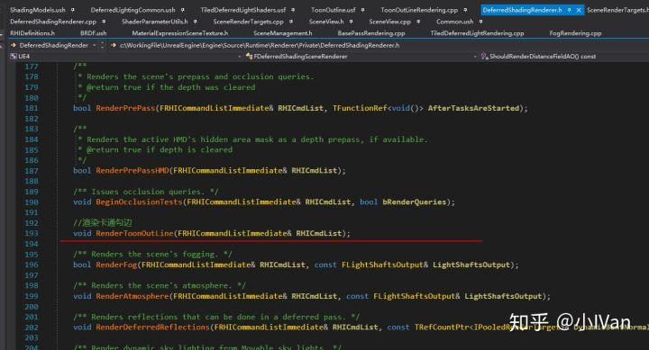


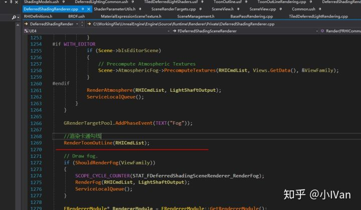

至此我们完成了初步勾线和卡通阴影，下一步我们要完成更进一步的控制。Enjoy it！
