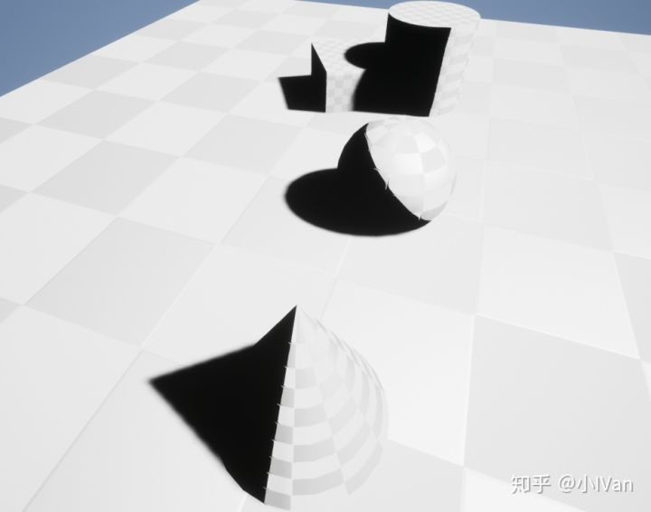
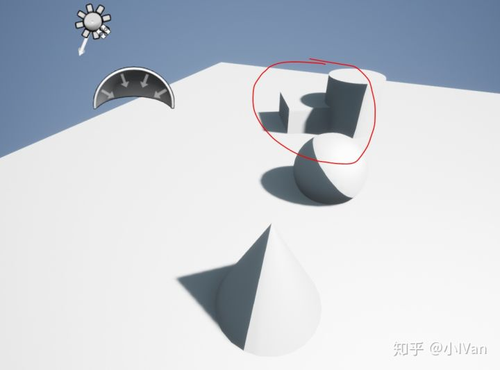
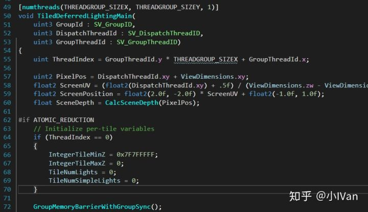
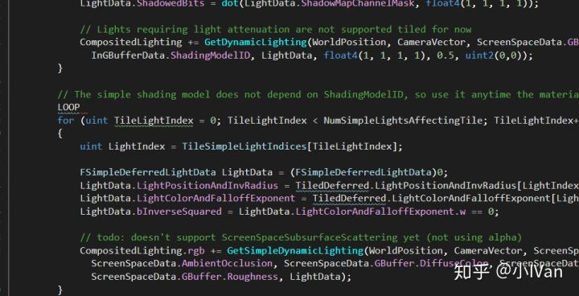
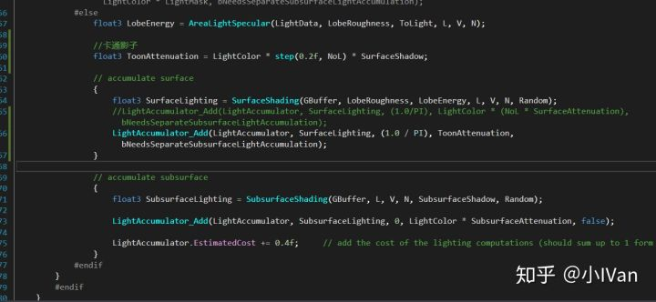
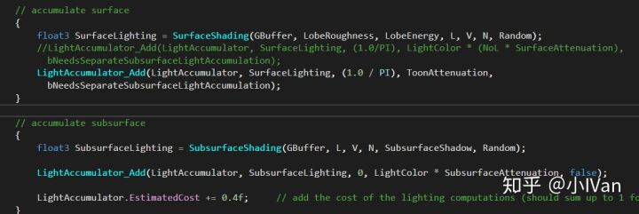
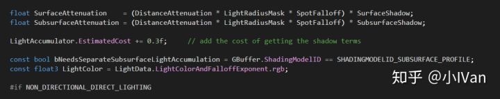
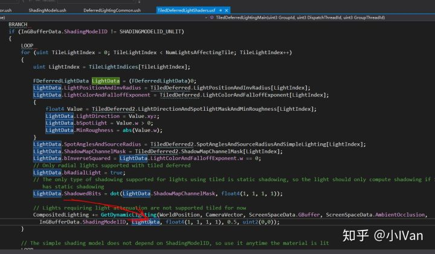
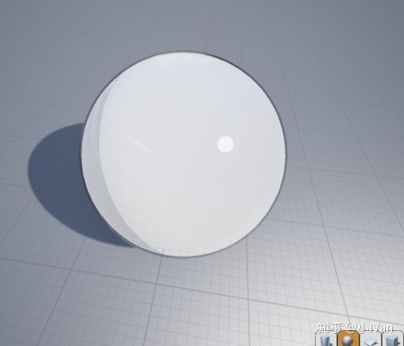

# 虚幻4乱改引擎卡通渲染篇【第一卷：卡通渲染启航】

## 本节综述

在接触虚幻4开发的过程中，始终有一个声音在耳边萦绕：“少年，你不要改引擎，什么都不要动，要遵循虚幻4的习惯来开发！”但是！作为初生牛犊不怕虎的莽撞少年的我怎么能就此屈服呢！我就是要乱改，直到引擎崩溃。

本篇中我们将一起来探索如何把虚幻4改造成一个次世代卡通的引擎。看到二之国那精美的画面，作为以前是画漫画的我心里羡慕至极。**本人只是个技术美术萌新，如有错误还请各路大神斧正！**

**如果感觉这部分内容会比较生硬，可以先看一下我专栏的Shader篇。**

## **以后本篇效果都会以二之国2为标杆**

下面我们来一起开启卡通效果第一步吧。先上个效果：

我这里先把影子改成了硬边的。

因为我们是复用引擎原生的渲染管线，所以不需要我们手工去处理shadow map什么的了。我前面文章也有比较简单地讲怎么增加一个卡通的材质模型。但是本章讲介绍直接修改原有的standard shading mode

首先我们打开TiledDeferredLightShaders.usf找到光照pass的入口函数

可以看到这是一个computeshader，看过我前面（shader篇）文章的话对这个应该十分熟悉了。

不管那些复杂的计算，我们找到光照计算部分

然后找到GetDynamicLighting部分，这里就是我们的光照计算部分了

打开DeferredLightingCommon.ush我们做如下修改

我们需要了解清楚的是，整个Lighting是怎么回事。这个函数中我们需要注意的有以下几部分：

首先看到第一部分，这个GetShadowTerms函数会计算出LightMap相关的一些东西，这个函数其实很简单，最关键的LightData是在最开始光照pass入口函数那个computeshader里面传进来的

接下来第二部分一次是Surfaceshading的计算，第二次是Subsurface的计算（所谓的Subsurface就是计算两次？一次表面一次次表面然后把它们的结果累积起来！）

第三部分就是AO和Shadow的处理了。

下面来到ShadingModes我们把StandardShading做如下修改：

最后就能看到我们的效果啦。这里只是半成品还有些问题，后面我会对这些计算再做调整，不过我们现在已经迈出了乱改引擎的第一步。

如果也有想做卡通渲染的朋友可以加入技术美术讨论群（专栏目录里有群号），大家一起讨论学习进步。后面的章节会一步步完善整个修改，甚至加入一些辅助pass。

Enjoy It 手动笔芯！
