# 虚幻4渲染编程(Shader篇)【第七卷：虚幻4中的ComputeShader】


## 简介：

Computeshader非常胜任大量的计算，有时候可以把这种大量计算的工作先交给GPU计算然后再把计算的结果拿给我们使用比如物理模拟，流体模拟等，下面我们就在虚幻4中使用ComputeShader。

先上效果图吧

这是一张纯由ComputeShader计算出来的一张图片，代码来自Shadertoy。


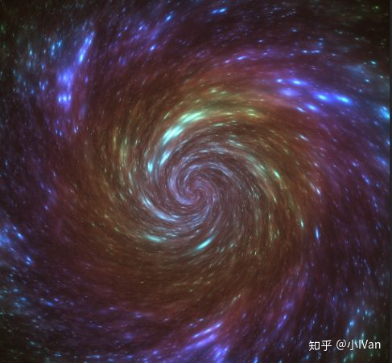

我下面的代码是基于我前面章节所写的代码的，想要知道从零是如何开始的，请从第二卷开始看。

在开始写虚幻的compute shader之前我们需要了解ComputeShader，这里有一篇unity的相关文章，只看它理论部分就好

ComputeShader的原理

medium.com


我在这里主要贴一下这张图，这里需要仔细理解这个图：


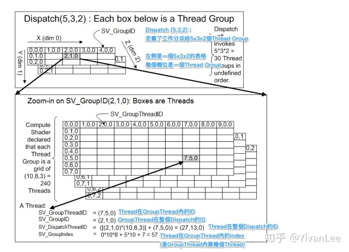

下面我做一个举例：

假设我现在有一张64x64这么大的一张RT需要给CS计算。我的CS代码是下面这么写的：


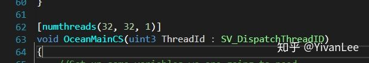

那么我需要怎么dispatch呢：


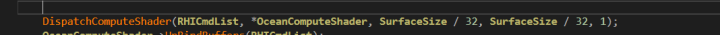

可以看到我的SurfaceSize是64，除以32以后我实际上dispatch的是（2，2，1）的一个ThreadGroup。

可以看到我把ComputeShader做了如下分配


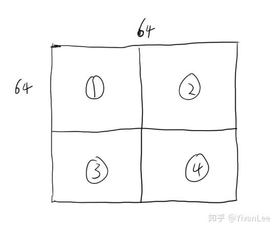

每一格是32x32，那么我们的SV_DispatchThreadID其实就是像素的位置，像素的位置如果除以贴图分辨率就能得到UV

------


下面我们就用虚幻4的computeshader来生成最开始的那张星空图片。

首先我们要声明一个ComputeShader

```text
class FMyComputeShader : public FGlobalShader  
{  
    DECLARE_SHADER_TYPE(FMyComputeShader, Global);  
  
public:  
  
    FMyComputeShader(){}  
    FMyComputeShader(const ShaderMetaType::CompiledShaderInitializerType& Initializer)  
        :FGlobalShader(Initializer)  
    {  
        OutputSurface.Bind(Initializer.ParameterMap, TEXT("OutputSurface"));  
    }  
  
    static bool ShouldCache(EShaderPlatform Platform)  
    {  
        return IsFeatureLevelSupported(Platform, ERHIFeatureLevel::SM5);  
    }  
  
    static bool ShouldCompilePermutation(const FGlobalShaderPermutationParameters& Parameters)  
    {  
        return IsFeatureLevelSupported(Parameters.Platform, ERHIFeatureLevel::SM5);  
        //return true;  
    }  
  
    static void ModifyCompilationEnvironment(const FGlobalShaderPermutationParameters& Platform, FShaderCompilerEnvironment& OutEnvironment)  
    {  
        FGlobalShader::ModifyCompilationEnvironment(Platform, OutEnvironment);  
        OutEnvironment.CompilerFlags.Add(CFLAG_StandardOptimization);  
    }  
  
    virtual bool Serialize(FArchive& Ar) override  
    {  
        bool bShaderHasOutdatedParams = FGlobalShader::Serialize(Ar);  
  
        Ar << OutputSurface;  
  
        return bShaderHasOutdatedParams;  
    }  
  
    void SetSurfaces(FRHICommandList& RHICmdList, FUnorderedAccessViewRHIRef OutputSurfaceUAV)  
    {  
        FComputeShaderRHIParamRef ComputeShaderRHI = GetComputeShader();  
        if (OutputSurface.IsBound())  
            RHICmdList.SetUAVParameter(ComputeShaderRHI, OutputSurface.GetBaseIndex(), OutputSurfaceUAV);  
    }  
    void UnbindBuffers(FRHICommandList& RHICmdList)  
    {  
        FComputeShaderRHIParamRef ComputeShaderRHI = GetComputeShader();  
  
        if (OutputSurface.IsBound())  
            RHICmdList.SetUAVParameter(ComputeShaderRHI, OutputSurface.GetBaseIndex(), FUnorderedAccessViewRHIRef());  
    }  
  
private:  
    FShaderResourceParameter OutputSurface;  
};  
  
IMPLEMENT_SHADER_TYPE(, FMyComputeShader, TEXT("/Plugin/ShadertestPlugin/Private/MyShader.usf"), TEXT("MainCS"), SF_Compute)  
```

它继承自GlobalShader。


这个宏会帮我们加入一些shader相关的通用代码。

下面我们声明两个版本的构造函数。


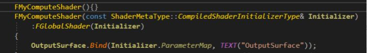

第二个版本的构造函数会把我们的私有成员变量OutputSurface与HLSL中的OutputSurface进行绑定。


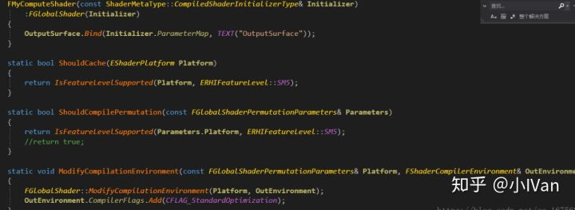

然后就是shader相关的三个函数。


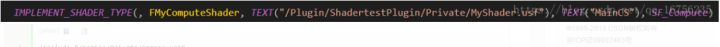

最后是shader的绑定声明和实例创建。

现在我们需要完成Computeshader的HLSL部分的代码。代码如下：

```text
#include "/Engine/Private/Common.ush"  
 
Texture2D MyTexture;  
SamplerState MyTextureSampler;  
  
float4 SimpleColor;  
  
void MainVS(  
    in float4 InPosition : ATTRIBUTE0,  
    in float2 InUV : ATTRIBUTE1,  
    out float2 OutUV : TEXCOORD0,  
    out float4 OutPosition : SV_POSITION  
    )  
{  
    // screenspace position from vb  
    OutPosition = InPosition;  
    OutUV = InUV;  
  
}  
  
void MainPS(  
    in float2 UV : TEXCOORD0,  
    out float4 OutColor : SV_Target0  
    )  
{  
    OutColor = float4(MyTexture.Sample(MyTextureSampler, UV.xy).rgb, 1.0f);  
    switch (FMyUniform.ColorIndex)  
    {  
        case 0 :  
            OutColor *= FMyUniform.ColorOne;  
            break;  
        case 1:  
            OutColor *= FMyUniform.ColorTwo;  
            break;  
        case 2:  
            OutColor *= FMyUniform.ColorThree;  
            break;  
        case 3:  
            OutColor *= FMyUniform.ColorFour;  
            break;  
    }  
      
}  
  
  
RWTexture2D<uint> OutputSurface;  
  
[numthreads(32, 32, 1)]  
void MainCS(uint3 ThreadId : SV_DispatchThreadID)  
{  
    //Set up some variables we are going to need  
    float sizeX, sizeY;  
    OutputSurface.GetDimensions(sizeX, sizeY);  
  
    float2 iResolution = float2(sizeX, sizeY);  
    float2 uv = (ThreadId.xy / iResolution.xy) - 0.5;  
    float iGlobalTime = 1.0f;  
  
    //This shader code is from www.shadertoy.com, converted to HLSL by me. If you have not checked out shadertoy yet, you REALLY should!!  
    float t = iGlobalTime * 0.1 + ((0.25 + 0.05 * sin(iGlobalTime * 0.1)) / (length(uv.xy) + 0.07)) * 2.2;  
    float si = sin(t);  
    float co = cos(t);  
    float2x2 ma = { co, si, -si, co };  
  
    float v1, v2, v3;  
    v1 = v2 = v3 = 0.0;  
  
    float s = 0.0;  
    for (int i = 0; i < 90; i++)  
    {  
        float3 p = s * float3(uv, 0.0);  
        p.xy = mul(p.xy, ma);  
        p += float3(0.22, 0.3, s - 1.5 - sin(iGlobalTime * 0.13) * 0.1);  
          
        for (int i = 0; i < 8; i++)    
            p = abs(p) / dot(p, p) - 0.659;  
  
        v1 += dot(p, p) * 0.0015 * (1.8 + sin(length(uv.xy * 13.0) + 0.5 - iGlobalTime * 0.2));  
        v2 += dot(p, p) * 0.0013 * (1.5 + sin(length(uv.xy * 14.5) + 1.2 - iGlobalTime * 0.3));  
        v3 += length(p.xy * 10.0) * 0.0003;  
        s += 0.035;  
    }  
  
    float len = length(uv);  
    v1 *= lerp(0.7, 0.0, len);  
    v2 *= lerp(0.5, 0.0, len);  
    v3 *= lerp(0.9, 0.0, len);  
  
    float3 col = float3(v3 * (1.5 + sin(iGlobalTime * 0.2) * 0.4), (v1 + v3) * 0.3, v2)  
                    + lerp(0.2, 0.0, len) * 0.85  
                    + lerp(0.0, 0.6, v3) * 0.3;  
  
    float3 powered = pow(abs(col), float3(1.2, 1.2, 1.2));  
    float3 minimized = min(powered, 1.0);  
    float4 outputColor = float4(minimized, 1.0);  
  
    //Since there are limitations on operations that can be done on certain formats when using compute shaders  
    //I elected to go with the most flexible one (UINT 32bit) and do my packing manually to simulate an R8G8B8A8_UINT format.  
    //There might be better ways to do this :)  
    uint r = outputColor.r * 255.0;  
    uint g = ((uint) (outputColor.g * 255.0)) << 8;  
    uint b = ((uint) (outputColor.b * 255.0)) << 16;  
    uint a = ((uint) (outputColor.a * 255.0)) << 24;  
    OutputSurface[ThreadId.xy] = r | g | b | a;  
}  
```

完成了HLSL部分的代码之后，我们需要执行它，然后把执行后渲染出的图导出成bmp

```text
static void UseComputeShader_RenderThread(  
    FRHICommandListImmediate& RHICmdList,  
    FTextureRenderTargetResource* OutputRenderTargetResource,  
    ERHIFeatureLevel::Type FeatureLevel  
)  
{  
    check(IsInRenderingThread());  
  
    TShaderMapRef<FMyComputeShader> ComputeShader(GetGlobalShaderMap(FeatureLevel));  
    RHICmdList.SetComputeShader(ComputeShader->GetComputeShader());  
  
    //ComputeShader->SetSurfaces(RHICmdList,)  
    int32 SizeX = OutputRenderTargetResource->GetSizeX();  
    int32 SizeY = OutputRenderTargetResource->GetSizeY();  
    FRHIResourceCreateInfo CreateInfo;  
    FTexture2DRHIRef Texture = RHICreateTexture2D(SizeX, SizeY, PF_R32_UINT, 1, 1, TexCreate_ShaderResource | TexCreate_UAV, CreateInfo);  
    //OutputRenderTargetResource->UA  
    FUnorderedAccessViewRHIRef TextureUAV = RHICreateUnorderedAccessView(Texture);  
    ComputeShader->SetSurfaces(RHICmdList, TextureUAV);  
  
    DispatchComputeShader(RHICmdList, *ComputeShader, SizeX/32, SizeY/32, 1);  
      
  
    //FLinearColor Color = FLinearColor::White;  
    //FMyShaderStructData data;  
    //data.ColorOne = FLinearColor::White;  
    //data.ColorTwo = FLinearColor::White;  
    //data.Colorthree = FLinearColor::White;  
    //data.ColorFour = FLinearColor::White;  
    //DrawTestShaderRenderTarget_RenderThread(RHICmdList, OutputRenderTargetResource, FeatureLevel, Color, Texture, data);  
  
    ComputeShader->UnbindBuffers(RHICmdList);  
  
    //OutputRenderTargetResource->TextureRHI = Texture;  
  
      
    //create a bitmap  
    TArray<FColor> Bitmap;  
  
    //To access our resource we do a custom read using lockrect  
    uint32 LolStride = 0;  
    char* TextureDataPtr = (char*)RHICmdList.LockTexture2D(Texture, 0, EResourceLockMode::RLM_ReadOnly, LolStride, false);  
  
    for (uint32 Row = 0; Row < Texture->GetSizeY(); ++Row)  
    {  
        uint32* PixelPtr = (uint32*)TextureDataPtr;  
  
        //Since we are using our custom UINT format, we need to unpack it here to access the actual colors  
        for (uint32 Col = 0; Col < Texture->GetSizeX(); ++Col)  
        {  
            uint32 EncodedPixel = *PixelPtr;  
            uint8 r = (EncodedPixel & 0x000000FF);  
            uint8 g = (EncodedPixel & 0x0000FF00) >> 8;  
            uint8 b = (EncodedPixel & 0x00FF0000) >> 16;  
            uint8 a = (EncodedPixel & 0xFF000000) >> 24;  
            Bitmap.Add(FColor(r, g, b, a));  
  
            PixelPtr++;  
        }  
  
        // move to next row:  
        TextureDataPtr += LolStride;  
    }  
  
    RHICmdList.UnlockTexture2D(Texture, 0, false);  
  
    // if the format and texture type is supported  
    if (Bitmap.Num())  
    {  
        // Create screenshot folder if not already present.  
        IFileManager::Get().MakeDirectory(*FPaths::ScreenShotDir(), true);  
  
        const FString ScreenFileName(FPaths::ScreenShotDir() / TEXT("VisualizeTexture"));  
  
        uint32 ExtendXWithMSAA = Bitmap.Num() / Texture->GetSizeY();  
  
        // Save the contents of the array to a bitmap file. (24bit only so alpha channel is dropped)  
        FFileHelper::CreateBitmap(*ScreenFileName, ExtendXWithMSAA, Texture->GetSizeY(), Bitmap.GetData());  
  
        UE_LOG(LogConsoleResponse, Display, TEXT("Content was saved to \"%s\""), *FPaths::ScreenShotDir());  
    }  
    else  
    {  
        UE_LOG(LogConsoleResponse, Error, TEXT("Failed to save BMP, format or texture type is not supported"));  
    }  
      
      
}  
```

下面我们在我们的shader中使用computeshader计算出来的值


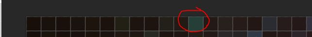

我们把第11个像素中的值取出来


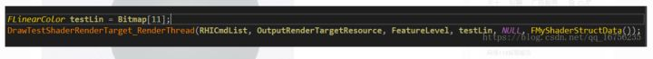

然后输出到了我们之前的testshader中


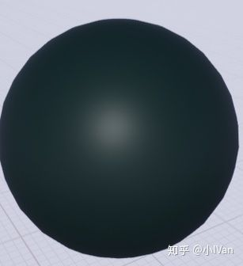

我们得到了一个深墨绿色的球。

至此我们从简单地从computeshader的计算结果中拿到了值，并且把这个结果加以利用。

然后我们就能在项目目录Saved\Screenshots\Windows下找到我们Computeshader的计算结果了。前面说了这么多都没做一个东西出来，下一卷我们就利用这1~7卷的知识做一个效果。
