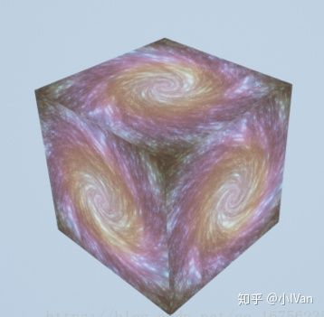

# (转)虚幻4渲染编程(Shader篇)【第八卷：ComputeShader与其他Shader的数据通讯】

2018年11月6日

0:04

第七章探索了虚幻的computeshader 但是computeshader并不是声明完就完了，我们需要把它计算的结果拿出来使用。

 

大概流程如下：

我们可以把computeshader的计算结果在其他着色器中使用：

 

 

我们把computeShader的计算结果保存在一个UAV中，然后把这个UAV作为一个Texture资源作为其他shader如Pixle的输入资源，然后执行draw操作画到RT上。下面是代码和代码的彩色图片

static void UseComputeShader_RenderThread(  
     FRHICommandListImmediate& RHICmdList,  
     FTextureRenderTargetResource* OutputRenderTargetResource,  
     FMyShaderStructData ShaderStructData,  
     ERHIFeatureLevel::Type FeatureLevel  
 )  
 {  
     check(IsInRenderingThread());  

​     TShaderMapRef<FMyComputeShader> ComputeShader(GetGlobalShaderMap(FeatureLevel));  
​     RHICmdList.SetComputeShader(ComputeShader->GetComputeShader());  

​     //ComputeShader->SetSurfaces(RHICmdList,)  
​     int32 SizeX = OutputRenderTargetResource->GetSizeX();  
​     int32 SizeY = OutputRenderTargetResource->GetSizeY();  
​     FRHIResourceCreateInfo CreateInfo;  
​       
​     FTexture2DRHIRef Texture = RHICreateTexture2D(SizeX, SizeY, PF_A32B32G32R32F, 1, 1, TexCreate_ShaderResource | TexCreate_UAV, CreateInfo);  
​     FUnorderedAccessViewRHIRef TextureUAV = RHICreateUnorderedAccessView(Texture);  
​     ComputeShader->SetSurfaces(RHICmdList, TextureUAV);  
​     DispatchComputeShader(RHICmdList, *ComputeShader, SizeX/32, SizeY/32, 1);  
​     ComputeShader->UnbindBuffers(RHICmdList);  

​     DrawTestShaderRenderTarget_RenderThread(RHICmdList, OutputRenderTargetResource, FeatureLevel, FLinearColor(), Texture, ShaderStructData);  
 }  

上面代码中的前面和第七章是一样的，设置各种资源，创建一个Texture，这里需要特别注意它的格式。PF_A32B32G32R32F这个格式和RenderTarget的格式需要保持兼容。

 

 

 

我再来重申一下，**shader****声明部分的****UAV****类型，****RT****的格式类型和创建****Texture2D****的格式类型**这三个地方需要注意兼容，不然是无法把数据写入的。

 

在下面我们把**Computeshader****执行后的结果输入到绘制管线**。

 

像素着色器可以取出computeshader计算出的结果来使用

 

最后结果如下：

我们取到了computeshader图片中的一个计算结果，注意load函数的取值方式。

Enjoy It！！！

下面是完整代码：

**MyShader.usf**-----------------------------------------------

\#include "/Engine/Private/Common.ush"

Texture2D MyTexture;
 SamplerState MyTextureSampler;

float4 SimpleColor;

void MainVS(
         in float4 InPosition : ATTRIBUTE0,
         in float2 InUV : ATTRIBUTE1,
         out float2 OutUV : TEXCOORD0,
         out float4 OutPosition : SV_POSITION
         )
 {
         // screenspace position from vb
     OutPosition = InPosition;
     OutUV = InUV;

}

void MainPS(
         in float2 UV : TEXCOORD0,
     out float4 OutColor : SV_Target0
     )
 {
     OutColor = float4(MyTexture.Sample(MyTextureSampler, UV.xy).rgb, 1.0f);
     //OutColor = MyTexture.Load(int3(2, 2, 0));
 }

RWTexture2D<float4> OutputSurface;
 [numthreads(32, 32, 1)]
 void MainCS(uint3 ThreadId : SV_DispatchThreadID)
 {
         //Set up some variables we are going to need
     float sizeX, sizeY;
     OutputSurface.GetDimensions(sizeX, sizeY);

float2 iResolution = float2(sizeX, sizeY);
     float2 uv = (ThreadId.xy / iResolution.xy) - 0.5;
     float iGlobalTime = FMyUniform.ColorOne.r;

//This shader code is from [www.shadertoy.com](http://www.shadertoy.com), converted to HLSL by me. If you have not checked out shadertoy yet, you REALLY should!!
     float t = iGlobalTime * 0.1 + ((0.25 + 0.05 * sin(iGlobalTime * 0.1)) / (length(uv.xy) + 0.07)) * 2.2;
     float si = sin(t);
     float co = cos(t);
     float2x2 ma = { co, si, -si, co };

float v1, v2, v3;
     v1 = v2 = v3 = 0.0;

float s = 0.0;
     for (int i = 0; i < 90; i++)
     {
         float3 p = s * float3(uv, 0.0);
         p.xy = mul(p.xy, ma);
         p += float3(0.22, 0.3, s - 1.5 - sin(iGlobalTime * 0.13) * 0.1);
                 
         for (int i = 0; i < 8; i++)        
             p = abs(p) / dot(p, p) - 0.659;

v1 += dot(p, p) * 0.0015 * (1.8 + sin(length(uv.xy * 13.0) + 0.5 - iGlobalTime * 0.2));
         v2 += dot(p, p) * 0.0013 * (1.5 + sin(length(uv.xy * 14.5) + 1.2 - iGlobalTime * 0.3));
         v3 += length(p.xy * 10.0) * 0.0003;
         s += 0.035;
     }

float len = length(uv);
     v1 *= lerp(0.7, 0.0, len);
     v2 *= lerp(0.5, 0.0, len);
     v3 *= lerp(0.9, 0.0, len);

float3 col = float3(v3 * (1.5 + sin(iGlobalTime * 0.2) * 0.4), (v1 + v3) * 0.3, v2)
                                         \+ lerp(0.2, 0.0, len) * 0.85
                                         \+ lerp(0.0, 0.6, v3) * 0.3;

float3 powered = pow(abs(col), float3(1.2, 1.2, 1.2));
     float3 minimized = min(powered, 1.0);
     float4 outputColor = float4(minimized, 1.0);
         /*
         //Since there are limitations on operations that can be done on certain formats when using compute shaders
         //I elected to go with the most flexible one (UINT 32bit) and do my packing manually to simulate an R8G8B8A8_UINT format.
         //There might be better ways to do this :)
     uint r = outputColor.r * 255.0;
     uint g = ((uint) (outputColor.g * 255.0)) << 8;
     uint b = ((uint) (outputColor.b * 255.0)) << 16;
     uint a = ((uint) (outputColor.a * 255.0)) << 24;
     OutputSurface[ThreadId.xy] = r | g | b | a;
         */
     OutputSurface[ThreadId.xy] = outputColor;
     //OutputSurface[ThreadId.xy] = ;

}

 

**MyShaderTest.h---**----------------------------------------

\#pragma once

\#include "CoreMinimal.h"
 \#include "UObject/ObjectMacros.h"
 \#include "Classes/Kismet/BlueprintFunctionLibrary.h"
 \#include "MyShaderTest.generated.h"

USTRUCT(BlueprintType)
 struct FMyShaderStructData
 {
         GENERATED_USTRUCT_BODY()

​            UPROPERTY(BlueprintReadWrite, VisibleAnywhere, Category = ShaderData)
​         FLinearColor ColorOne;
​         UPROPERTY(BlueprintReadWrite, VisibleAnywhere, Category = ShaderData)
​         FLinearColor ColorTwo;
​         UPROPERTY(BlueprintReadWrite, VisibleAnywhere, Category = ShaderData)
​         FLinearColor Colorthree;
​         UPROPERTY(BlueprintReadWrite, VisibleAnywhere, Category = ShaderData)
​         FLinearColor ColorFour;
​         UPROPERTY(BlueprintReadWrite, VisibleAnywhere, Category = ShaderData)
​         int32 ColorIndex;
 };

UCLASS(MinimalAPI,meta = (ScriptName = "TestShaderLibary"))
 class UTestShaderBlueprintLibrary : public UBlueprintFunctionLibrary
 {
         GENERATED_UCLASS_BODY()

​            UFUNCTION(BlueprintCallable, Category = "ShaderTestPlugin", meta = (WorldContext = "WorldContextObject"))
​         static void DrawTestShaderRenderTarget(
​                 class UTextureRenderTarget2D* OutputRenderTarget, 
​                 AActor* Ac, 
​                 FLinearColor MyColor, 
​                 UTexture* MyTexture, 
​                 FMyShaderStructData ShaderStructData
​         );

​            UFUNCTION(BlueprintCallable, Category = "ShaderTestPlugin", meta = (WorldContext = "WorldContextObject"))
​         static void UseMyComputeShader(
​                 class UTextureRenderTarget2D* OutputRenderTarget,
​                 AActor* Ac,
​                 FMyShaderStructData ShaderStructData
​         );
 };

 

**MyShaderTest.cpp**-----------------------------------------

// Copyright 1998-2018 Epic Games, Inc. All Rights Reserved.

\#include "MyShaderTest.h"

#include "Classes/Engine/TextureRenderTarget2D.h"

#include "Classes/Engine/World.h"

#include "Public/GlobalShader.h"

#include "Public/PipelineStateCache.h"

#include "Public/RHIStaticStates.h"

#include "Public/SceneUtils.h"

#include "Public/SceneInterface.h"

#include "Public/ShaderParameterUtils.h"

#include "Public/Logging/MessageLog.h"

#include "Public/Internationalization/Internationalization.h"

#include "Public/StaticBoundShaderState.h"

\#include "CoreUObject.h"
 \#include "Engine.h"

\#include "RHICommandList.h"
 \#include "UniformBuffer.h"

\#define LOCTEXT_NAMESPACE "TestShader"
 \#define NUM_THREADS_PER_GROUP_DIMENSION 32 //This has to be the same as in the compute shader's spec [X, X, 1]

 

BEGIN_UNIFORM_BUFFER_STRUCT(FMyUniformStructData, )
 DECLARE_UNIFORM_BUFFER_STRUCT_MEMBER(FVector4, ColorOne) //4.20API改动了
 DECLARE_UNIFORM_BUFFER_STRUCT_MEMBER(FVector4, ColorTwo)
 DECLARE_UNIFORM_BUFFER_STRUCT_MEMBER(FVector4, ColorThree)
 DECLARE_UNIFORM_BUFFER_STRUCT_MEMBER(FVector4, ColorFour)
 DECLARE_UNIFORM_BUFFER_STRUCT_MEMBER(uint32, ColorIndex)
 END_UNIFORM_BUFFER_STRUCT(FMyUniformStructData)

 

IMPLEMENT_UNIFORM_BUFFER_STRUCT(FMyUniformStructData, TEXT("FMyUniform"));

//typedef TUniformBufferRef<MyStructData> MyStructDataRef;

UTestShaderBlueprintLibrary::UTestShaderBlueprintLibrary(const FObjectInitializer& ObjectInitializer)
         : Super(ObjectInitializer)
 {

}

class FMyShaderTest : public FGlobalShader
 {
 public:

FMyShaderTest(){}

FMyShaderTest(const ShaderMetaType::CompiledShaderInitializerType& Initializer)
                 : FGlobalShader(Initializer)
         {
                 SimpleColorVal.Bind(Initializer.ParameterMap, TEXT("SimpleColor"));
                 TestTextureVal.Bind(Initializer.ParameterMap, TEXT("MyTexture"));
                 TestTextureSampler.Bind(Initializer.ParameterMap, TEXT("MyTextureSampler"));

}

static bool ShouldCache(EShaderPlatform Platform)
         {
                 return true;
         }

static bool ShouldCompilePermutation(const FGlobalShaderPermutationParameters& Parameters)
         {
                 //return IsFeatureLevelSupported(Parameters.Platform, ERHIFeatureLevel::SM4);
                 return true;
         }

static void ModifyCompilationEnvironment(const FGlobalShaderPermutationParameters& Parameters, FShaderCompilerEnvironment& OutEnvironment)
         {
                 FGlobalShader::ModifyCompilationEnvironment(Parameters, OutEnvironment);
                 OutEnvironment.SetDefine(TEXT("TEST_MICRO"), 1);
         }

void SetParameters(
                 FRHICommandListImmediate& RHICmdList,
                 const FLinearColor &MyColor,
                 FTextureRHIParamRef &MyTexture,
                 FMyShaderStructData &ShaderStructData
                 )
         {
                 SetShaderValue(RHICmdList, GetPixelShader(), SimpleColorVal, MyColor);
                 
                 SetTextureParameter(
                         RHICmdList,
                         GetPixelShader(),
                         TestTextureVal,
                         TestTextureSampler,
                         TStaticSamplerState<SF_Trilinear, AM_Clamp, AM_Clamp, AM_Clamp>::GetRHI(),
                         MyTexture);

FMyUniformStructData UniformData;
                 UniformData.ColorOne = ShaderStructData.ColorOne;
                 UniformData.ColorTwo = ShaderStructData.ColorTwo;
                 UniformData.ColorThree = ShaderStructData.Colorthree;
                 UniformData.ColorFour = ShaderStructData.ColorFour;
                 UniformData.ColorIndex = ShaderStructData.ColorIndex;
                 UniformData.ColorIndex = ShaderStructData.ColorIndex;

SetUniformBufferParameterImmediate(RHICmdList, GetPixelShader(), GetUniformBufferParameter<FMyUniformStructData>(), UniformData);
                 
         }

virtual bool Serialize(FArchive& Ar) override
         {
                 bool bShaderHasOutdatedParameters = FGlobalShader::Serialize(Ar);
                 Ar << SimpleColorVal << TestTextureVal << TestTextureSampler;
                 return bShaderHasOutdatedParameters;
         }

private:

FShaderParameter SimpleColorVal;

FShaderResourceParameter TestTextureVal;
         FShaderResourceParameter TestTextureSampler;
 };

class FShaderTestVS : public FMyShaderTest
 {
         DECLARE_SHADER_TYPE(FShaderTestVS, Global);

public:
         FShaderTestVS(){}

FShaderTestVS(const ShaderMetaType::CompiledShaderInitializerType& Initializer)
                 : FMyShaderTest(Initializer)
         {

}
 };

class FShaderTestPS : public FMyShaderTest
 {
         DECLARE_SHADER_TYPE(FShaderTestPS, Global);

public:
         FShaderTestPS() {}

FShaderTestPS(const ShaderMetaType::CompiledShaderInitializerType& Initializer)
                 : FMyShaderTest(Initializer)
         {

}
 };
 //***************************************************************************************//
 class FMyComputeShader : public FGlobalShader
 {
         DECLARE_SHADER_TYPE(FMyComputeShader, Global);

public:

FMyComputeShader(){}
         FMyComputeShader(const ShaderMetaType::CompiledShaderInitializerType& Initializer)
                 :FGlobalShader(Initializer)
         {
                 OutputSurface.Bind(Initializer.ParameterMap, TEXT("OutputSurface"));
         }

static bool ShouldCache(EShaderPlatform Platform)
         {
                 return IsFeatureLevelSupported(Platform, ERHIFeatureLevel::SM5);
         }

static bool ShouldCompilePermutation(const FGlobalShaderPermutationParameters& Parameters)
         {
                 return IsFeatureLevelSupported(Parameters.Platform, ERHIFeatureLevel::SM5);
                 //return true;
         }

static void ModifyCompilationEnvironment(const FGlobalShaderPermutationParameters& Platform, FShaderCompilerEnvironment& OutEnvironment)
         {
                 FGlobalShader::ModifyCompilationEnvironment(Platform, OutEnvironment);
                 OutEnvironment.CompilerFlags.Add(CFLAG_StandardOptimization);
         }

virtual bool Serialize(FArchive& Ar) override
         {
                 bool bShaderHasOutdatedParams = FGlobalShader::Serialize(Ar);

Ar << OutputSurface;

return bShaderHasOutdatedParams;
         }

void SetSurfaces(FRHICommandList& RHICmdList, FUnorderedAccessViewRHIRef OutputSurfaceUAV, FMyShaderStructData& ShaderStructData)
         {
                 FComputeShaderRHIParamRef ComputeShaderRHI = GetComputeShader();
                 if (OutputSurface.IsBound())
                         RHICmdList.SetUAVParameter(ComputeShaderRHI, OutputSurface.GetBaseIndex(), OutputSurfaceUAV);

FMyUniformStructData UniformData;
                 UniformData.ColorOne = ShaderStructData.ColorOne;
                 UniformData.ColorTwo = ShaderStructData.ColorTwo;
                 UniformData.ColorThree = ShaderStructData.Colorthree;
                 UniformData.ColorFour = ShaderStructData.ColorFour;
                 UniformData.ColorIndex = ShaderStructData.ColorIndex;

SetUniformBufferParameterImmediate(RHICmdList, GetComputeShader(), GetUniformBufferParameter<FMyUniformStructData>(), UniformData);

}

void UnbindBuffers(FRHICommandList& RHICmdList)
         {
                 FComputeShaderRHIParamRef ComputeShaderRHI = GetComputeShader();

if (OutputSurface.IsBound())
                         RHICmdList.SetUAVParameter(ComputeShaderRHI, OutputSurface.GetBaseIndex(), FUnorderedAccessViewRHIRef());
         }

private:
         FShaderResourceParameter OutputSurface;
 };

IMPLEMENT_SHADER_TYPE(, FMyComputeShader, TEXT("/Plugin/ShadertestPlugin/Private/MyShader.usf"), TEXT("MainCS"), SF_Compute)
 IMPLEMENT_SHADER_TYPE(, FShaderTestVS, TEXT("/Plugin/ShadertestPlugin/Private/MyShader.usf"), TEXT("MainVS"), SF_Vertex)
 IMPLEMENT_SHADER_TYPE(, FShaderTestPS, TEXT("/Plugin/ShadertestPlugin/Private/MyShader.usf"), TEXT("MainPS"), SF_Pixel)

struct FMyTextureVertex
 {
         FVector4        Position;
         FVector2D        UV;
 };

class FMyTextureVertexDeclaration : public FRenderResource
 {
 public:
         FVertexDeclarationRHIRef VertexDeclarationRHI;

virtual void InitRHI() override
         {
                 FVertexDeclarationElementList Elements;
                 uint32 Stride = sizeof(FMyTextureVertex);
                 Elements.Add(FVertexElement(0, STRUCT_OFFSET(FMyTextureVertex, Position), VET_Float4, 0, Stride));
                 Elements.Add(FVertexElement(0, STRUCT_OFFSET(FMyTextureVertex, UV), VET_Float2, 1, Stride));
                 VertexDeclarationRHI = RHICreateVertexDeclaration(Elements);
         }

virtual void ReleaseRHI() override
         {
                 VertexDeclarationRHI->Release();
         }
 };

static void DrawTestShaderRenderTarget_RenderThread(
         FRHICommandListImmediate& RHICmdList, 
         FTextureRenderTargetResource* OutputRenderTargetResource,
         ERHIFeatureLevel::Type FeatureLevel,
         //FName TextureRenderTargetName,
         FLinearColor MyColor,
         FTextureRHIParamRef MyTexture,
         FMyShaderStructData ShaderStructData
 )
 {
         check(IsInRenderingThread());

//#if WANTS_DRAW_MESH_EVENTS
 //        FString EventName;
 //        TextureRenderTargetName.ToString(EventName);
 //        SCOPED_DRAW_EVENTF(RHICmdList, SceneCapture, TEXT("ShaderTest %s"), *EventName);
 //#else
 //        SCOPED_DRAW_EVENT(RHICmdList, DrawUVDisplacementToRenderTarget_RenderThread);
 //#endif
 //
         //设置渲染目标
         SetRenderTarget(
                 RHICmdList,
                 OutputRenderTargetResource->GetRenderTargetTexture(),
                 FTextureRHIRef(),
                 ESimpleRenderTargetMode::EUninitializedColorAndDepth,
                 FExclusiveDepthStencil::DepthNop_StencilNop
         );

//设置视口
         //FIntPoint DrawTargetResolution(OutputRenderTargetResource->GetSizeX(), OutputRenderTargetResource->GetSizeY());
         //RHICmdList.SetViewport(0, 0, 0.0f, DrawTargetResolution.X, DrawTargetResolution.Y, 1.0f);

TShaderMap<FGlobalShaderType>* GlobalShaderMap = GetGlobalShaderMap(FeatureLevel);
         TShaderMapRef<FShaderTestVS> VertexShader(GlobalShaderMap);
         TShaderMapRef<FShaderTestPS> PixelShader(GlobalShaderMap);

FMyTextureVertexDeclaration VertexDec;
         VertexDec.InitRHI();

// Set the graphic pipeline state.
         FGraphicsPipelineStateInitializer GraphicsPSOInit;
         RHICmdList.ApplyCachedRenderTargets(GraphicsPSOInit);
         GraphicsPSOInit.DepthStencilState = TStaticDepthStencilState<false, CF_Always>::GetRHI();
         GraphicsPSOInit.BlendState = TStaticBlendState<>::GetRHI();
         GraphicsPSOInit.RasterizerState = TStaticRasterizerState<>::GetRHI();
         GraphicsPSOInit.PrimitiveType = PT_TriangleList;
         GraphicsPSOInit.BoundShaderState.VertexDeclarationRHI = VertexDec.VertexDeclarationRHI;
         GraphicsPSOInit.BoundShaderState.VertexShaderRHI = GETSAFERHISHADER_VERTEX(*VertexShader);
         GraphicsPSOInit.BoundShaderState.PixelShaderRHI = GETSAFERHISHADER_PIXEL(*PixelShader);
         SetGraphicsPipelineState(RHICmdList, GraphicsPSOInit);

//RHICmdList.SetViewport(0, 0, 0.0f, DrawTargetResolution.X, DrawTargetResolution.Y, 1.0f);
         PixelShader->SetParameters(RHICmdList, MyColor, MyTexture, ShaderStructData);

// Draw grid.
         //uint32 PrimitiveCount = 2;
         //RHICmdList.DrawPrimitive(PT_TriangleList, 0, PrimitiveCount, 1);
         FMyTextureVertex Vertices[4];
         Vertices[0].Position.Set(-1.0f, 1.0f, 0, 1.0f);
         Vertices[1].Position.Set(1.0f, 1.0f, 0, 1.0f);
         Vertices[2].Position.Set(-1.0f, -1.0f, 0, 1.0f);
         Vertices[3].Position.Set(1.0f, -1.0f, 0, 1.0f);
         Vertices[0].UV = FVector2D(0.0f, 1.0f);
         Vertices[1].UV = FVector2D(1.0f, 1.0f);
         Vertices[2].UV = FVector2D(0.0f, 0.0f);
         Vertices[3].UV = FVector2D(1.0f, 0.0f);

static const uint16 Indices[6] =
         {
                 0, 1, 2,
                 2, 1, 3
         };
         //DrawPrimitiveUP(RHICmdList, PT_TriangleStrip, 2, Vertices, sizeof(Vertices[0]));
         DrawIndexedPrimitiveUP(
                 RHICmdList,
                 PT_TriangleList,
                 0,
                 ARRAY_COUNT(Vertices),
                 2,
                 Indices,
                 sizeof(Indices[0]),
                 Vertices,
                 sizeof(Vertices[0])
         );

// Resolve render target.
         RHICmdList.CopyToResolveTarget(
                 OutputRenderTargetResource->GetRenderTargetTexture(),
                 OutputRenderTargetResource->TextureRHI,
                 false, FResolveParams());
 }

void UTestShaderBlueprintLibrary::DrawTestShaderRenderTarget(
         UTextureRenderTarget2D* OutputRenderTarget, 
         AActor* Ac,
         FLinearColor MyColor,
         UTexture* MyTexture,
         FMyShaderStructData ShaderStructData
 )
 {
         check(IsInGameThread());

if (!OutputRenderTarget)
         {
                 return;
         }
         
         FTextureRenderTargetResource* TextureRenderTargetResource = OutputRenderTarget->GameThread_GetRenderTargetResource();
         FTextureRHIParamRef MyTextureRHI = MyTexture->TextureReference.TextureReferenceRHI;
         UWorld* World = Ac->GetWorld();
         ERHIFeatureLevel::Type FeatureLevel = World->Scene->GetFeatureLevel();
         FName TextureRenderTargetName = OutputRenderTarget->GetFName();
         ENQUEUE_RENDER_COMMAND(CaptureCommand)(
                 [TextureRenderTargetResource, FeatureLevel, MyColor, TextureRenderTargetName, MyTextureRHI,ShaderStructData](FRHICommandListImmediate& RHICmdList)
                 {
                         DrawTestShaderRenderTarget_RenderThread
                         (
                                 RHICmdList,
                                 TextureRenderTargetResource, 
                                 FeatureLevel, 
                                 //TextureRenderTargetName, 
                                 MyColor, 
                                 MyTextureRHI, 
                                 ShaderStructData
                         );
                 }
         );
 }
 /*****************************************************/

static void UseComputeShader_RenderThread(
         FRHICommandListImmediate& RHICmdList,
         FTextureRenderTargetResource* OutputRenderTargetResource,
         FMyShaderStructData ShaderStructData,
         ERHIFeatureLevel::Type FeatureLevel
 )
 {
         check(IsInRenderingThread());

TShaderMapRef<FMyComputeShader> ComputeShader(GetGlobalShaderMap(FeatureLevel));
         RHICmdList.SetComputeShader(ComputeShader->GetComputeShader());

//ComputeShader->SetSurfaces(RHICmdList,)
         int32 SizeX = OutputRenderTargetResource->GetSizeX();
         int32 SizeY = OutputRenderTargetResource->GetSizeY();
         FRHIResourceCreateInfo CreateInfo;
         
         FTexture2DRHIRef Texture = RHICreateTexture2D(SizeX, SizeY, PF_A32B32G32R32F, 1, 1, TexCreate_ShaderResource | TexCreate_UAV, CreateInfo);
         FUnorderedAccessViewRHIRef TextureUAV = RHICreateUnorderedAccessView(Texture);
         ComputeShader->SetSurfaces(RHICmdList, TextureUAV, ShaderStructData);
         DispatchComputeShader(RHICmdList, *ComputeShader, SizeX/32, SizeY/32, 1);
         ComputeShader->UnbindBuffers(RHICmdList);

DrawTestShaderRenderTarget_RenderThread(RHICmdList, OutputRenderTargetResource, FeatureLevel, FLinearColor(), Texture, ShaderStructData);
         
         /*
         //create a bitmap
         TArray<FColor> Bitmap;

//To access our resource we do a custom read using lockrect
         uint32 LolStride = 0;
         char* TextureDataPtr = (char*)RHICmdList.LockTexture2D(Texture, 0, EResourceLockMode::RLM_ReadOnly, LolStride, false);

for (uint32 Row = 0; Row < Texture->GetSizeY(); ++Row)
         {
                 uint32* PixelPtr = (uint32*)TextureDataPtr;

//Since we are using our custom UINT format, we need to unpack it here to access the actual colors
                 for (uint32 Col = 0; Col < Texture->GetSizeX(); ++Col)
                 {
                         uint32 EncodedPixel = *PixelPtr;
                         uint8 r = (EncodedPixel & 0x000000FF);
                         uint8 g = (EncodedPixel & 0x0000FF00) >> 8;
                         uint8 b = (EncodedPixel & 0x00FF0000) >> 16;
                         uint8 a = (EncodedPixel & 0xFF000000) >> 24;
                         Bitmap.Add(FColor(r, g, b, a));

PixelPtr++;
                 }

// move to next row:
                 TextureDataPtr += LolStride;
         }

RHICmdList.UnlockTexture2D(Texture, 0, false);

// if the format and texture type is supported
         if (Bitmap.Num())
         {
                 // Create screenshot folder if not already present.
                 IFileManager::Get().MakeDirectory(*FPaths::ScreenShotDir(), true);

const FString ScreenFileName(FPaths::ScreenShotDir() / TEXT("VisualizeTexture"));

uint32 ExtendXWithMSAA = Bitmap.Num() / Texture->GetSizeY();

// Save the contents of the array to a bitmap file. (24bit only so alpha channel is dropped)
                 FFileHelper::CreateBitmap(*ScreenFileName, ExtendXWithMSAA, Texture->GetSizeY(), Bitmap.GetData());

UE_LOG(LogConsoleResponse, Display, TEXT("Content was saved to \"%s\""), *FPaths::ScreenShotDir());
         }
         else
         {
                 UE_LOG(LogConsoleResponse, Error, TEXT("Failed to save BMP, format or texture type is not supported"));
         }
         
         */
 }

void UTestShaderBlueprintLibrary::UseMyComputeShader(
         class UTextureRenderTarget2D* OutputRenderTarget,
         AActor* Ac,
         FMyShaderStructData ShaderStructData
 )
 {
         check(IsInGameThread());

if (Ac == nullptr && OutputRenderTarget == nullptr)
         {
                 return;
         }

FTextureRenderTargetResource* TextureRenderTargetResource = OutputRenderTarget->GameThread_GetRenderTargetResource();
         UWorld* World = Ac->GetWorld();
         ERHIFeatureLevel::Type FeatureLevel = World->Scene->GetFeatureLevel();

ENQUEUE_RENDER_COMMAND(CaptureCommand)(
                 [TextureRenderTargetResource, FeatureLevel, ShaderStructData](FRHICommandListImmediate& RHICmdList)
         {
                 UseComputeShader_RenderThread
                 (
                         RHICmdList,
                         TextureRenderTargetResource,
                         ShaderStructData,
                         FeatureLevel
                 );
         });

}

\#undef LOCTEXT_NAMESPACE

 

**Blueprint**------------------------------------

编辑于 2018-05-16

 

来自

 <

[*https://zhuanlan.zhihu.com/p/36697483*](https://zhuanlan.zhihu.com/p/36697483)

\> 
