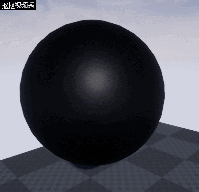
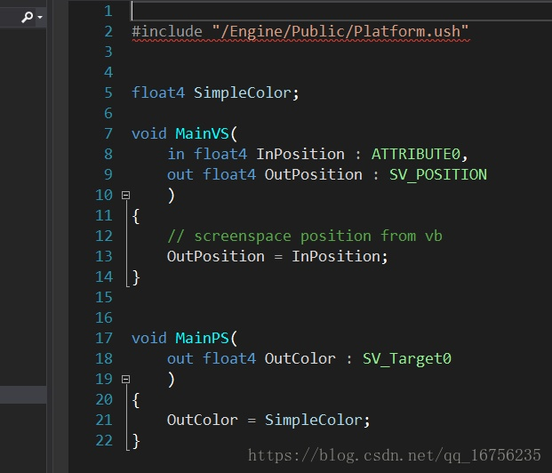
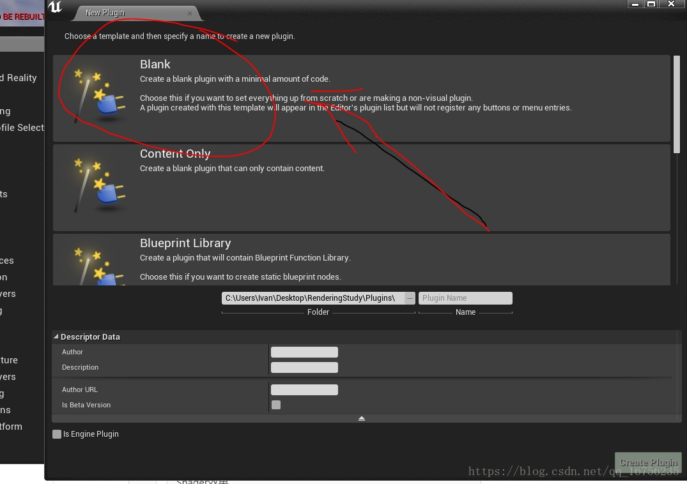
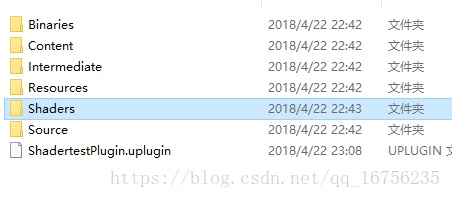
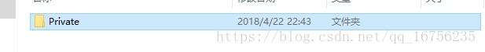
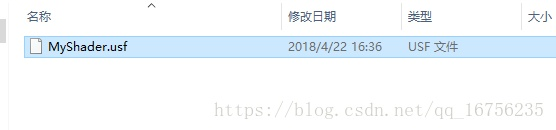
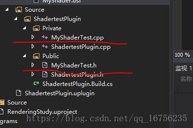
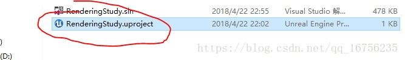
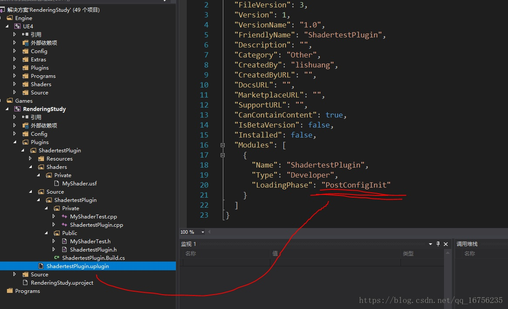

# 虚幻4渲染编程（Shader篇）【第二卷：不用虚幻4Shader管线使用自己的shader】 

已剪辑自: <https://zhuanlan.zhihu.com/p/36635394>


## **我的专栏目录：**


先直接上效果：




这个球的颜色是通过自己的shader实现的：





下面就来一步一步实现使用自己的shader吧。

首先我们先创建一个插件。插件其实相当于一个独立的模块，我不想再项目里做，当然再游戏模块里做也是没问题的。我们先把整个流程搞清楚了再去改引擎。





首先创建个插件，名字取为ShadertestPlugin

然后打开工程里的这个插件，在插件目录下加一个Shaders文件夹





然后再在Shaders文件夹里加Private文件夹





然后再在private里面夹里新建一个文本文档，然后把后缀名改位.usf




在这个MyShader.usf里键入如下代码：

```
#include "/Engine/Public/Platform.ush"

float4 SimpleColor;
void MainVS(
 in float4 InPosition : ATTRIBUTE0,
 out float4 OutPosition : SV_POSITION
 )
{
 // screenspace position from vb
    OutPosition = InPosition;
}

void MainPS(
    out float4 OutColor : SV_Target0
    )
{
    OutColor = SimpleColor;
}
```

我声明了一个MyColor的颜色，这个变量后面会和c++绑定，到时候就可以让它跟cpu交互了。然后声明了一个顶点着色器和像素着色i器。

完成了这个之后，再在插件的source文件夹下加两个文件





新建两个文本文档然后把后缀改位.h和.cpp就可以了。做完这些之后记得右键Uproject文件重写generate一下工程





然后重新加载vs项目就可以啦。

然后在把ShadertestPlugin.uplugin文件改一下，如下图。把加载顺序改成在引擎前加载。PostConfigInit。shader必须要在引擎加载完成前加载完才行。




做完这个后，再在MyShader.h中打入如下代码：


然后再在MyShader.cpp中打入如下代码：

```
// Copyright 1998-2018 Epic Games, Inc. All Rights Reserved.  
 
#include "MyShaderTest.h"  
 
#include "Classes/Engine/TextureRenderTarget2D.h"  
#include "Classes/Engine/World.h"  
#include "Public/GlobalShader.h"  
#include "Public/PipelineStateCache.h"  
#include "Public/RHIStaticStates.h"  
#include "Public/SceneUtils.h"  
#include "Public/SceneInterface.h"  
#include "Public/ShaderParameterUtils.h"  
#include "Public/Logging/MessageLog.h"  
#include "Public/Internationalization/Internationalization.h"  
#include "Public/StaticBoundShaderState.h"  
 
#define LOCTEXT_NAMESPACE "TestShader"  
 
UTestShaderBlueprintLibrary::UTestShaderBlueprintLibrary(const FObjectInitializer& ObjectInitializer)  
    : Super(ObjectInitializer)  
{  
 
}  
 
class FMyShaderTest : public FGlobalShader  
{  
public:  
 
    FMyShaderTest(){}  
 
    FMyShaderTest(const ShaderMetaType::CompiledShaderInitializerType& Initializer)  
        : FGlobalShader(Initializer)  
    {  
        SimpleColorVal.Bind(Initializer.ParameterMap, TEXT("SimpleColor"));  
    }  
 
    static bool ShouldCache(EShaderPlatform Platform)  
    {  
        return true;  
    }  
 
    static bool ShouldCompilePermutation(const FGlobalShaderPermutationParameters& Parameters)  
    {  
        //return IsFeatureLevelSupported(Parameters.Platform, ERHIFeatureLevel::SM4);  
        return true;  
    }  
 
    static void ModifyCompilationEnvironment(const FGlobalShaderPermutationParameters& Parameters, FShaderCompilerEnvironment& OutEnvironment)  
    {  
        FGlobalShader::ModifyCompilationEnvironment(Parameters, OutEnvironment);  
        OutEnvironment.SetDefine(TEXT("TEST_MICRO"), 1);  
    }  
 
    void SetParameters(  
        FRHICommandListImmediate& RHICmdList,  
        const FLinearColor &MyColor  
        )  
    {  
        SetShaderValue(RHICmdList, GetPixelShader(), SimpleColorVal, MyColor);  
    }  
 
    virtual bool Serialize(FArchive& Ar) override  
    {  
        bool bShaderHasOutdatedParameters = FGlobalShader::Serialize(Ar);  
        Ar << SimpleColorVal;  
        return bShaderHasOutdatedParameters;  
    }  
 
private:  
 
    FShaderParameter SimpleColorVal;  
 
};  
 
class FShaderTestVS : public FMyShaderTest  
{  
    DECLARE_SHADER_TYPE(FShaderTestVS, Global);  
 
public:  
    FShaderTestVS(){}  
 
    FShaderTestVS(const ShaderMetaType::CompiledShaderInitializerType& Initializer)  
        : FMyShaderTest(Initializer)  
    {  
 
    }  
};  
 
 
class FShaderTestPS : public FMyShaderTest  
{  
    DECLARE_SHADER_TYPE(FShaderTestPS, Global);  
 
public:  
    FShaderTestPS() {}  
 
    FShaderTestPS(const ShaderMetaType::CompiledShaderInitializerType& Initializer)  
        : FMyShaderTest(Initializer)  
    {  
 
    }  
};  
 
IMPLEMENT_SHADER_TYPE(, FShaderTestVS, TEXT("/Plugin/ShadertestPlugin/Private/MyShader.usf"), TEXT("MainVS"), SF_Vertex)  
IMPLEMENT_SHADER_TYPE(, FShaderTestPS, TEXT("/Plugin/ShadertestPlugin/Private/MyShader.usf"), TEXT("MainPS"), SF_Pixel)  
 
static void DrawTestShaderRenderTarget_RenderThread(  
    FRHICommandListImmediate& RHICmdList,   
    FTextureRenderTargetResource* OutputRenderTargetResource,  
    ERHIFeatureLevel::Type FeatureLevel,  
    FName TextureRenderTargetName,  
    FLinearColor MyColor  
)  
{  
    check(IsInRenderingThread());  
 
#if WANTS_DRAW_MESH_EVENTS  
    FString EventName;  
    TextureRenderTargetName.ToString(EventName);  
    SCOPED_DRAW_EVENTF(RHICmdList, SceneCapture, TEXT("ShaderTest %s"), *EventName);  
#else  
    SCOPED_DRAW_EVENT(RHICmdList, DrawUVDisplacementToRenderTarget_RenderThread);  
#endif  
 
    //设置渲染目标  
    SetRenderTarget(  
        RHICmdList,  
        OutputRenderTargetResource->GetRenderTargetTexture(),  
        FTextureRHIRef(),  
        ESimpleRenderTargetMode::EUninitializedColorAndDepth,  
        FExclusiveDepthStencil::DepthNop_StencilNop  
    );  
 
    //设置视口  
    //FIntPoint DrawTargetResolution(OutputRenderTargetResource->GetSizeX(), OutputRenderTargetResource->GetSizeY());  
    //RHICmdList.SetViewport(0, 0, 0.0f, DrawTargetResolution.X, DrawTargetResolution.Y, 1.0f);  
 
    TShaderMap<FGlobalShaderType>* GlobalShaderMap = GetGlobalShaderMap(FeatureLevel);  
    TShaderMapRef<FShaderTestVS> VertexShader(GlobalShaderMap);  
    TShaderMapRef<FShaderTestPS> PixelShader(GlobalShaderMap);  
 
    // Set the graphic pipeline state.  
    FGraphicsPipelineStateInitializer GraphicsPSOInit;  
    RHICmdList.ApplyCachedRenderTargets(GraphicsPSOInit);  
    GraphicsPSOInit.DepthStencilState = TStaticDepthStencilState<false, CF_Always>::GetRHI();  
    GraphicsPSOInit.BlendState = TStaticBlendState<>::GetRHI();  
    GraphicsPSOInit.RasterizerState = TStaticRasterizerState<>::GetRHI();  
    GraphicsPSOInit.PrimitiveType = PT_TriangleList;  
    GraphicsPSOInit.BoundShaderState.VertexDeclarationRHI = GetVertexDeclarationFVector4();  
    GraphicsPSOInit.BoundShaderState.VertexShaderRHI = GETSAFERHISHADER_VERTEX(*VertexShader);  
    GraphicsPSOInit.BoundShaderState.PixelShaderRHI = GETSAFERHISHADER_PIXEL(*PixelShader);  
    SetGraphicsPipelineState(RHICmdList, GraphicsPSOInit);  
 
    //RHICmdList.SetViewport(0, 0, 0.0f, DrawTargetResolution.X, DrawTargetResolution.Y, 1.0f);  
    PixelShader->SetParameters(RHICmdList, MyColor);  
 
    // Draw grid.  
    //uint32 PrimitiveCount = 2;  
    //RHICmdList.DrawPrimitive(PT_TriangleList, 0, PrimitiveCount, 1);  
    FVector4 Vertices[4];  
    Vertices[0].Set(-1.0f, 1.0f, 0, 1.0f);  
    Vertices[1].Set(1.0f, 1.0f, 0, 1.0f);  
    Vertices[2].Set(-1.0f, -1.0f, 0, 1.0f);  
    Vertices[3].Set(1.0f, -1.0f, 0, 1.0f);  
    static const uint16 Indices[6] =  
    {  
        0, 1, 2,  
        2, 1, 3  
    };  
    //DrawPrimitiveUP(RHICmdList, PT_TriangleStrip, 2, Vertices, sizeof(Vertices[0]));  
    DrawIndexedPrimitiveUP(  
        RHICmdList,  
        PT_TriangleList,  
        0,  
        ARRAY_COUNT(Vertices),  
        2,  
        Indices,  
        sizeof(Indices[0]),  
        Vertices,  
        sizeof(Vertices[0])  
    );  
 
    // Resolve render target.  
    RHICmdList.CopyToResolveTarget(  
        OutputRenderTargetResource->GetRenderTargetTexture(),  
        OutputRenderTargetResource->TextureRHI,  
        false, FResolveParams());  
}  
 
void UTestShaderBlueprintLibrary::DrawTestShaderRenderTarget(  
    UTextureRenderTarget2D* OutputRenderTarget,   
    AActor* Ac,  
    FLinearColor MyColor  
)  
{  
    check(IsInGameThread());  
 
    if (!OutputRenderTarget)  
    {  
        return;  
    }  
 
    FTextureRenderTargetResource* TextureRenderTargetResource = OutputRenderTarget->GameThread_GetRenderTargetResource();  
    UWorld* World = Ac->GetWorld();  
    ERHIFeatureLevel::Type FeatureLevel = World->Scene->GetFeatureLevel();  
    FName TextureRenderTargetName = OutputRenderTarget->GetFName();  
    ENQUEUE_RENDER_COMMAND(CaptureCommand)(  
        [TextureRenderTargetResource, FeatureLevel, MyColor, TextureRenderTargetName](FRHICommandListImmediate& RHICmdList)  
        {  
            DrawTestShaderRenderTarget_RenderThread(RHICmdList,TextureRenderTargetResource, FeatureLevel, TextureRenderTargetName, MyColor);  
        }  
    );  
 
}  
 
#undef LOCTEXT_NAMESPACE  
```

稍后我会一行行解释这些代码的意思。

然后我们要修改下c#文件


完成这些后再generate一下工程，然后就可以打开项目了。

我们新建如下资源


打开BP_Shader_Test蓝图做如下设置


新建一个颜色变量，然后再beginplay函数先清空一下我们的那张ShaderTestRT渲染目标，然后把我们这个shadertestrt渲染目标给我们的DrawTestShaderRenderTarget函数。还需要注意设置input，这样actor才能接收到我们的input事件。

做完这些之后再建一个材质，把RT拖到材质里（这里只是想让我们的shader效果被看到，我们的shader已经可以运作了）


这个操作其实已经是多pass了！！！

然后把BP_Shader_Test拖到场景里，你按下1 2 3 就能看到如下效果了：


下一节我会讲述代码原理。

