# 虚幻4渲染编程(Shader篇)【第九卷：自定义渲染管线】


先上我的专栏的目录：

小IVan：专题概述及目录

zhuanlan.zhihu.com

然后再按老规矩先上效果：


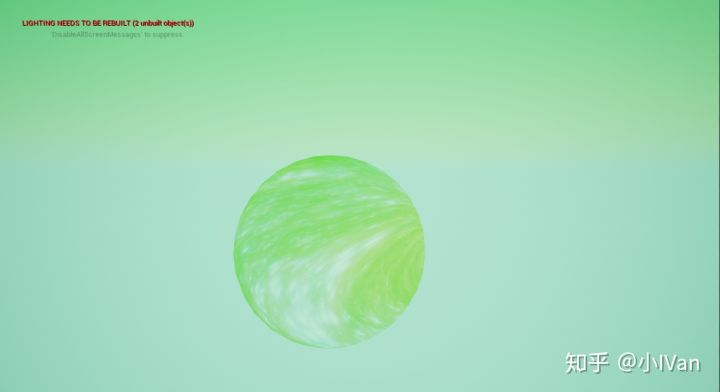

什么嘛就是一堆绿色嘛！但是这个绿色的来源是我们自己定义的一个pass！


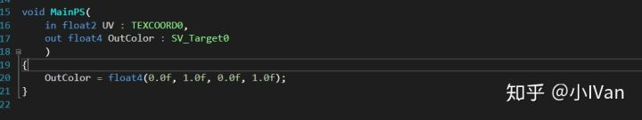


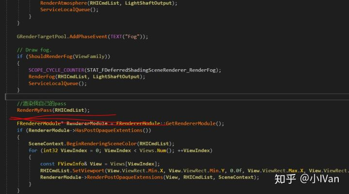

我在雾气渲染之后再渲染了一次我自己的pass，当然你也可以渲染些其他的东西。这一节旨在探索如何自定义虚幻的渲染管线。

下面就让我们开始吧！

首先我们找到Render/Private/DeferredShadingRender.h和对应的DeferredShadingRender.cpp这两文件。我们能在头文件中找到众多Render函数。对没错这个就是我们虚幻的渲染管线。很多人又是翻文档，又是抓帧地捋虚幻的渲染管线，真正的渲染这些东西的就是这里啦。


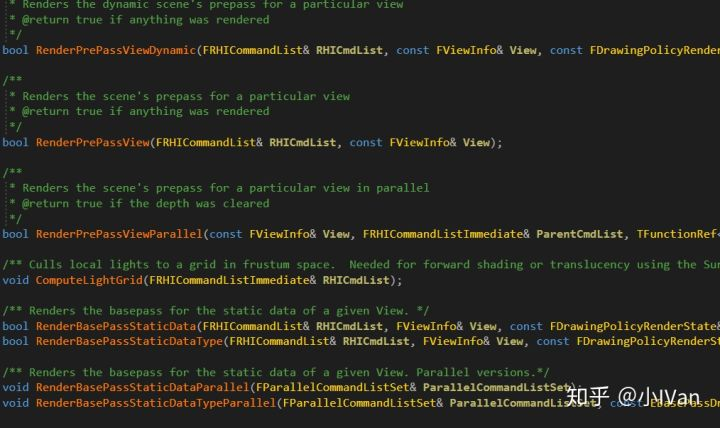

我这里只截了一笑部分，还有很多很多函数。

下面打开DeferredShadingRender.cpp我们找到render函数


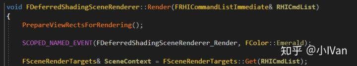

这里就是虚幻tiled延迟光照渲染管线下每一帧绘制的地方了。找到地方之后我们开始加入我们的“绿啦绿啦！”自定义pass。

在DeferredShadingRender.h中加入如下代码：


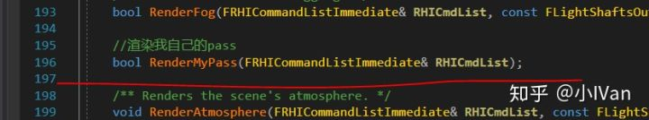

然后在DeferredShadingRender.cpp中调用它


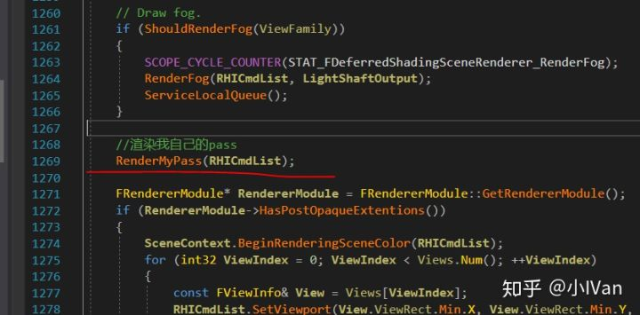

我选择在雾气之后渲染我的pass，当然你可以把它放到其他地方，不过需要注意的是，如果你放的位置不对你是拿不到有些数据的，因为那时候可能那些数据还没绘制出来。

然后我们自己建个MyPass.h文件和MyPass.cpp文件还有MyPass.usf文件然后generate一下然后VS重载下项目。然后我们就有以下几个文件了：


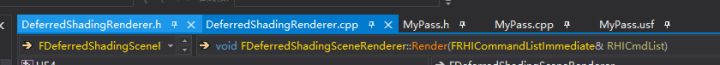

首先打开MyPass.cpp敲出我们的代码框架（注意看注释）

```text
#include "MyPass.h"
#include "DeferredShadingRenderer.h"
#include "AtmosphereRendering.h"
#include "ScenePrivate.h"
#include "Engine/TextureCube.h"
#include "PipelineStateCache.h"

DECLARE_GPU_STAT(MyPass);
//顶点着色器
class FMyPassVS : public FGlobalShader
{
	DECLARE_SHADER_TYPE(FMyPassVS, Global);
};
//实例化顶点着色器
IMPLEMENT_SHADER_TYPE(, FMyPassVS, TEXT("/Engine/Private/MyPass.usf"), TEXT("MainVS"), SF_Vertex);
//像素着色器
class FMyPassPS : public FGlobalShader
{
	DECLARE_SHADER_TYPE(FMyPassPS, Global);

};
//全局实例化像素着色器
IMPLEMENT_SHADER_TYPE(, FMyPassPS, TEXT("/Engine/Private/MyPass.usf"), TEXT("MainPS"), SF_Pixel);

//顶点数据结构体
struct FMyPassVertex
{
	FVector4	Position;
	FVector2D	UV;
};

//顶点输入布局
class FMyPassVertexDec : public FRenderResource
{
};
//顶点输入布局的全局实例
TGlobalResource<FMyPassVertexDec> GMyPassVertexDeclaration;

//绘制函数
bool FDeferredShadingSceneRenderer::RenderMyPass(FRHICommandListImmediate& RHICmdList)
{

}
```

有了代码框架后我们就开始完善我们的代码了。

首先是顶点着色器


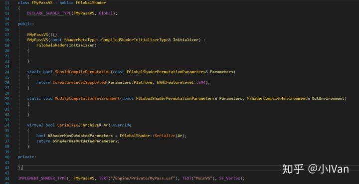

看过我前面文章的话这个顶点着色器简直就是小case。

下面是像素着色器：


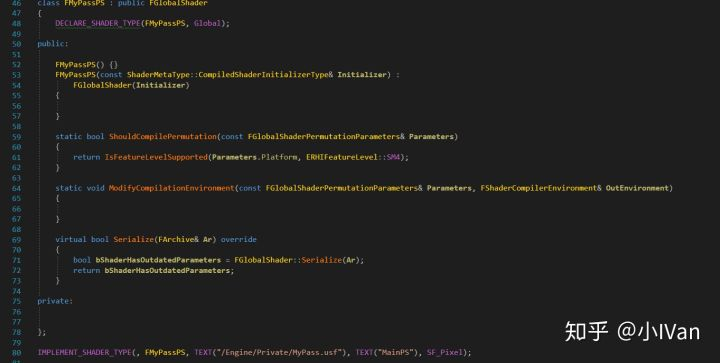

还是很简单的，因为本例只是输出个颜色，所以什么复杂逻辑都没有的。

然后是顶点输入布局


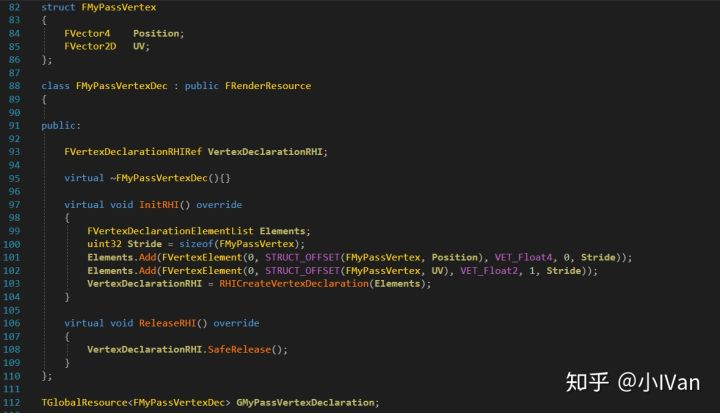

最后是渲染函数：

```text
bool FDeferredShadingSceneRenderer::RenderMyPass(FRHICommandListImmediate& RHICmdList)
{
	// Draw grid.
	//uint32 PrimitiveCount = 2;
	//RHICmdList.DrawPrimitive(PT_TriangleList, 0, PrimitiveCount, 1);
	FMyPassVertex Vertices[4];
	Vertices[0].Position.Set(-1.0f, 1.0f, 0, 1.0f);
	Vertices[1].Position.Set(1.0f, 1.0f, 0, 1.0f);
	Vertices[2].Position.Set(-1.0f, -1.0f, 0, 1.0f);
	Vertices[3].Position.Set(1.0f, -1.0f, 0, 1.0f);
	Vertices[0].UV = FVector2D(0.0f, 1.0f);
	Vertices[1].UV = FVector2D(1.0f, 1.0f);
	Vertices[2].UV = FVector2D(0.0f, 0.0f);
	Vertices[3].UV = FVector2D(1.0f, 0.0f);

	static const uint16 Indices[6] =
	{
		0, 1, 2,
		2, 1, 3
	};

	FSceneRenderTargets& SceneContext = FSceneRenderTargets::Get(RHICmdList);

	SceneContext.BeginRenderingSceneColor(RHICmdList, ESimpleRenderTargetMode::EExistingColorAndDepth, FExclusiveDepthStencil::DepthRead_StencilWrite, true);

	FGraphicsPipelineStateInitializer GraphicsPSOInit;
	RHICmdList.ApplyCachedRenderTargets(GraphicsPSOInit);

	for (int32 ViewIndex = 0; ViewIndex < Views.Num(); ViewIndex++)
	{
		const FViewInfo& View = Views[ViewIndex];

		if (View.IsPerspectiveProjection() == false)
		{
			continue;
		}

		TShaderMapRef<FMyPassVS> VertexShader(View.ShaderMap);
		TShaderMapRef<FMyPassPS> PixelShader(View.ShaderMap);

		RHICmdList.SetViewport(View.ViewRect.Min.X, View.ViewRect.Min.Y, 0.0f, View.ViewRect.Max.X, View.ViewRect.Max.Y, 1.0f);
		GraphicsPSOInit.RasterizerState = TStaticRasterizerState<FM_Solid, CM_None>::GetRHI();

		GraphicsPSOInit.BlendState = TStaticBlendState<CW_RGB, BO_Add, BF_One, BF_SourceAlpha>::GetRHI();

		GraphicsPSOInit.DepthStencilState = TStaticDepthStencilState<false, CF_Always>::GetRHI();
		GraphicsPSOInit.PrimitiveType = PT_TriangleList;

		GraphicsPSOInit.BoundShaderState.VertexDeclarationRHI = GMyPassVertexDeclaration.VertexDeclarationRHI;
		GraphicsPSOInit.BoundShaderState.VertexShaderRHI = GETSAFERHISHADER_VERTEX(*VertexShader);
		GraphicsPSOInit.BoundShaderState.PixelShaderRHI = GETSAFERHISHADER_PIXEL(*PixelShader);

		SetGraphicsPipelineState(RHICmdList, GraphicsPSOInit);

		// Draw a quad covering the view.
		DrawIndexedPrimitiveUP(
			RHICmdList,
			PT_TriangleList,
			0,
			ARRAY_COUNT(Vertices),
			2,
			Indices,
			sizeof(Indices[0]),
			Vertices,
			sizeof(Vertices[0])
		);

	}

	return true;
}
```

这里需要注意的是几点：

（1）RenderTarget我们是从Scene中拿到的


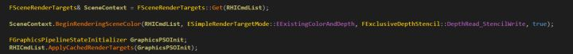

SceneRender会管理一帧画面的RT。然后就是这个View了


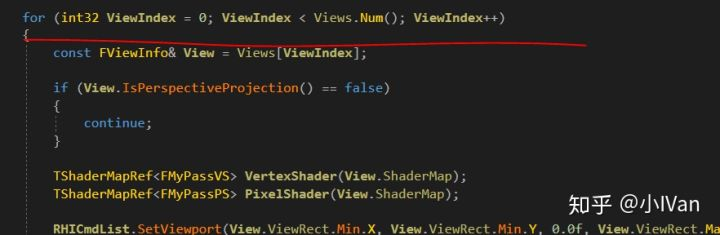

因为游戏里可能会有多个视口的，这个View就是负责管理这些的，具体可以跟进去，注释很完善。我这里就不多说了。

最后就是我们的shader了：


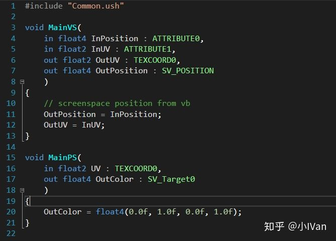

我这里直接输出了一个很简单的绿色。

至此我们完成自定义pass。

unity都出自定义管线了，会给开发者很大的方便。比如我想做个卡通风格的游戏，我就可以把勾线的pass自己定制一个，而不是放后期里，让勾线成为引擎本身具有的功能，你在模型编辑器特效编辑器里都能预览到自定义pass的渲染结果：


我这里只是随便渲染了个绿色。

因为Render函数里有大量可利用的数据，所以这里还能做很多文章，我这里只是举个栗子。

Enjoy it！！！
