# 虚幻4渲染编程【第一卷：虚幻自身的延迟渲染管线】

文章

## **我的专栏目录：**

## **简介：**

因为虚幻的架构，我们美术做一个效果只能使用材质编辑器。这让我很不舒服，稍微想做点特别点的效果就没办法了。我又是天天在公司用自研引擎的人，这种限制让人很不舒服。所以我开始修改了虚幻的shadingmode之类的。但是感觉自己还是不满足，想调个多pass虚幻都不让我做，所以我打算加个pass什么的。但是虚幻加pass可不像unity那么简单，只有操刀去改源码了。然后我又反观了一下我前几篇博客，只简单讲了一下怎么改代码，没说原理。所以这个系列我打算系统说一下虚幻的一个架构。当然虚幻如此庞大，我也有很多不知道的地方。

​      其实我写博客的目的很简单，就是想记录一下自己做的东西，有时候自己翻一下，再把问题再想一下，也许会有新的发现。虚幻的渲染方面的资料也是少得可怜，研究的人也少得可怜。大部分牛人都自己去造轮子去了。我只是个技术美术，造轮子的事情还是交给图形程序吧。不过研究虚幻4的确学到很多。如果有大牛看到我的文章中有错误，还请留言斧正。

首先在看这个系列之前，你需要具备以下：

（1）至少要敲过简单的渲染器，不管是拿dx敲还是拿gl敲或者vk之类的。

（2）对虚幻引擎有一定了解，对虚幻的渲染有一定了解。可以看我前几篇文章，或许可以有所帮助。

（3）C++基础。其实本人c++水平也是一般般（常常受到公司程序大牛的鄙视，不过我是美术）。

（4）至少一块RTX显卡可以用来做实时光线追踪（2019年）

随着引擎版本的更新，后续会逐步加入新版本。那么下面就正式开始吧！

## **【概览虚幻4渲染管线】**

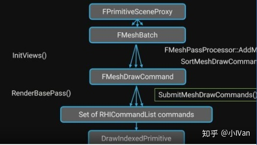

首先，虚幻有很多个管线的。Mobile管线和Deferred管线。首先找到

在这个函数里你将会看到很多熟悉的函数名称

虚幻就是通过调用这些函数来一步步绘制的。是不是很眼熟？这个就是各大论坛啦，博客啦讲的虚幻渲染流程的真面目。

下面就是官方的DrawOrder了。那么这个顺序是怎么来的呢。就是上面那个函数的调用顺序。

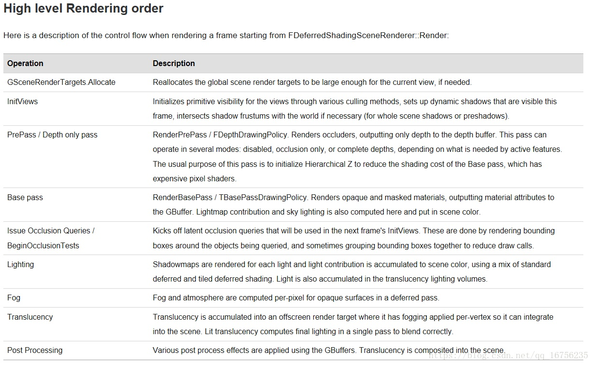

再打开这个Render函数，你就将看到延迟渲染一帧所调用的各个函数。（反正我看了半天就看到个大概的渲染顺序之外，还是啥也不知道）

那么当我们把一个模型托到场景里，这个模型被渲染出来的整个流程到底是什么样的呢？这个流程其实是非常庞大的。下面我就来一个一个拆分。

（1）第一步：资源准备阶段。这个阶段包括顶点缓冲区的准备，索引缓冲区的准备。这一步由场景代理管理完成。当然从磁盘里读取模型资源这些就涉及到StaticMesh这些了。想了解这一步可以去看我以前的博客，或者直接去看UPrimitiveComponent，UMeshComponent，UStaticMeshComponent，UCableComponent，UCustomMeshComponent。当你把这些源码全部研究一遍后，这个阶段算是了解了。这个阶段我不打算再描述了，因为已经有了很多现成的代码了。

（2）第二步就是shader资源的准备了，这个又是一个非常大的话题了。可以去看我以前关于给改材质编辑器和加shadingmode的文章便可以有个大概的了解。这一步我还会进一步阐述。

（3）第三步就是绘制了。

我们先不看Render函数那些复杂的调用，我们把精力先集中到shader层面来。一张画面是怎么开始绘制的呢？

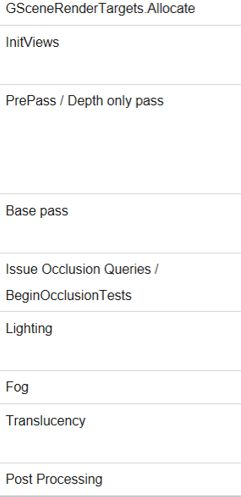

通过这个我们便能知道一个大概的绘制流程（千万别以为虚幻只有这几步，不过主要的大概的流程是这样）。先绘制那些深度啊，初始化视口啦我们先不管。我们来看下这个BasePass。这个BasePass干的事情就是把GBuffer画出来。

这里就是像素着色器的入口。绘制完这一步后，我们就有了GBuffer然后再绘制剩下的。环境遮罩骤就先不说了。来看看最重要的光照部分。

光照部分的入口在这里：

虚幻的TiledDeferredLighting的渲染方式。不知道这个的去看毛星云的RTR3的博客的光照那节，讲得特别好。这里给个传送门：

[https://blog.csdn.net/poem_qianmo/article/details/77142101](https://link.zhihu.com/?target=https%3A//blog.csdn.net/poem_qianmo/article/details/77142101)

这里会调用

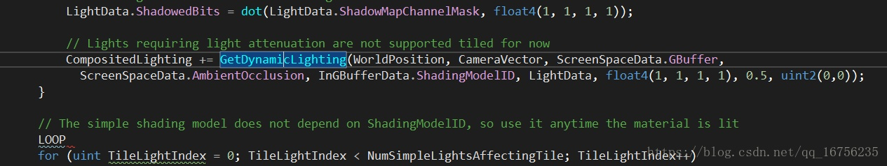

GetDynamicLighting这个函数会调用

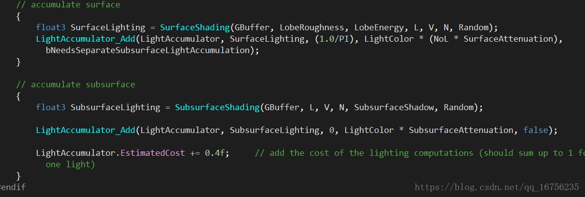

这里会接着调用

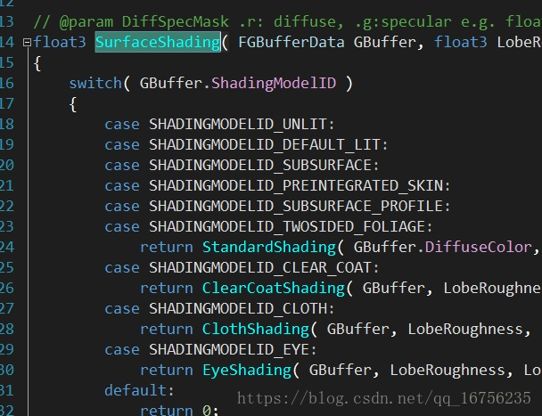

看到这里就很熟悉了，看过前面我修改shadingmode的博客应该会对这里很熟悉。

lighting绘制完了之后就会绘制一些反射啊之类的东西了，然后就是透明物体啊后期啊。这些后面会慢慢分析他们。我们先把两个最重量级的研究了。

接下来我们研究一下fog渲染阶段。找到FogRendering.cpp你就会发现，其实绘制fog的是一个globalshader。前面绘制各个物体的是materialshader。

你会发现绘制fog的是一个globalshader。虚幻一共有这么几种shader：Globalshader  materialshader和meshshader。

这篇博客只是一个概述性和引导性的。只是说明一下虚幻绘制的一个大概情况。下一卷我将演示一下怎么自己写个shader，引擎识别它，编译它，然后如何cpu和gpu进行信息交流的

4.20的Unreal渲染模块有了较大改动。

主要是为了配合引擎新增特性和性能优化。不过大体上的流程还是和上个版本的保持一致。

为了给LTC让道，所以shader做了大面积重构。

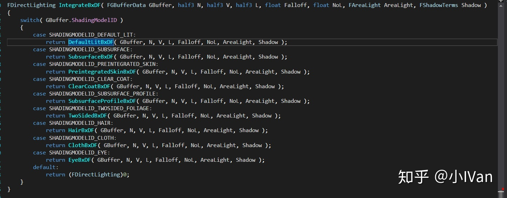

ShadingModel改为了IntergrateBxDF

下面会对绘制流水线详细写一遍，由于量巨大所以我会慢慢更新。

## （1）【InitView】

引擎代码注释写得非常简单：Initialize scene's views.Check visibility, build visible mesh commands, etc.

这是渲染管线的开始，这步是为渲染管线准备绘制当前帧所需要各种资源。后面的管线就是判断一下画不画，绑定一下状态和RT然后就画画画就好了。这一阶段做的事情非常多也非常杂。首先来看看一些主要的

### ComputeVisibility

可见性剔除有很多种技术，引擎会使用多种方法进行组合剔除，把没必要渲染的东西剔除干净，最大限度在渲染之前就做到最省。

虚幻提供了几种剔除方法

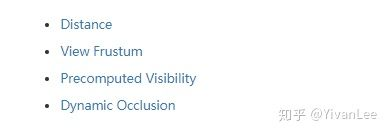

他们各有优劣，可以根据不同平台和情况进行选择。

**VisibilityMap**

在后面会把视口中可见性属性是非可见的物体剔除掉。

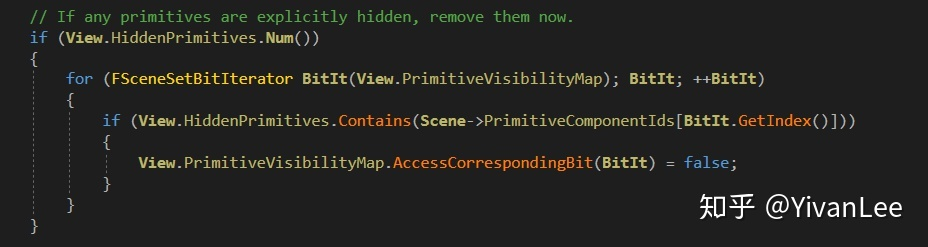

**PrecomputedVisibilit**

在场景中可以使用预烘焙的可见性数据。

如果当前视口场景中有可见性烘焙数据就会启用可见性烘焙的剔除方式

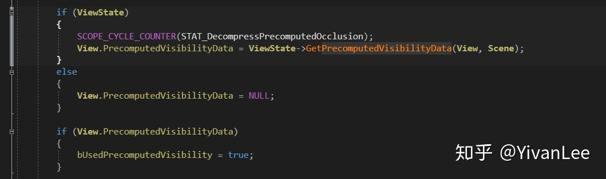

**ViewFrustomCulled**

做完前面的步骤后，还会进行视锥体剔除，并且大部分情况下，视口会使用视锥体剔除

进行视锥体剔除后可以减少大部分没必要绘制的图元

这时再配合各种其它的剔除方法就可以进一步剔除

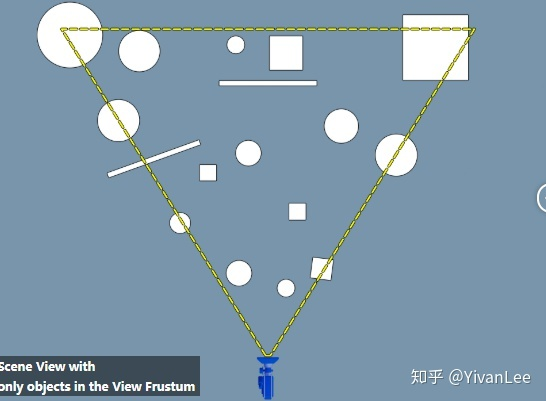

而这里的“其它的剔除方法”包括但不限于PrecomputedVisibility，Distance，DynamicOcclusion

**DistanceOcclusion**

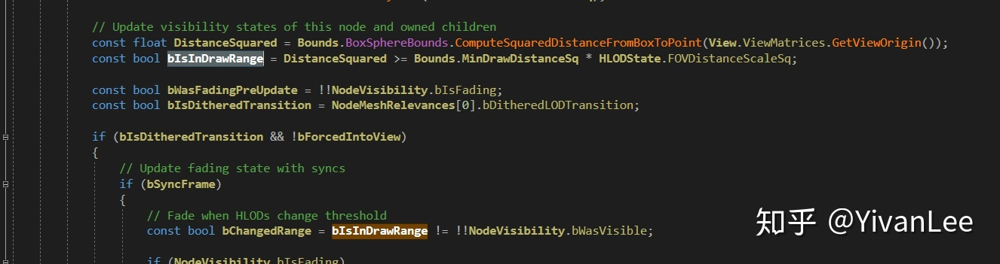

不在距离范围内就不绘制，非常简单有效的绘制方式。这种剔除方式挺适合地面上摆的小物件，摆的一些decal或者小道具，对大型建筑不适合。

**Hardware Occlusion Queries**

硬件的可见性剔除。这种方法将每帧的可见性检查作为每个Actor的查询发出。  Actor的可见度在一帧之后被回读 - 如果相机移动得非常快，有时会产生不利影响，导致它们“弹出”。  硬件遮挡的成本随着在GPU上执行的查询的数量而变化。 使用距离和预计算可见性方法可以减少GPU每帧执行的查询次数。

在各种剔除后，在InitView的最后会根据这些数据建立MeshPass

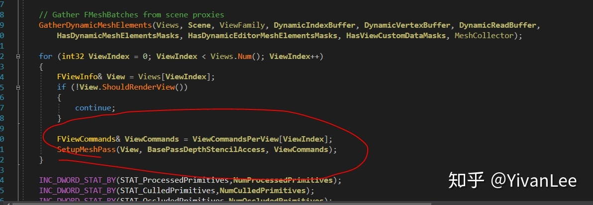

## （2）【EarlyZ-PrePass】

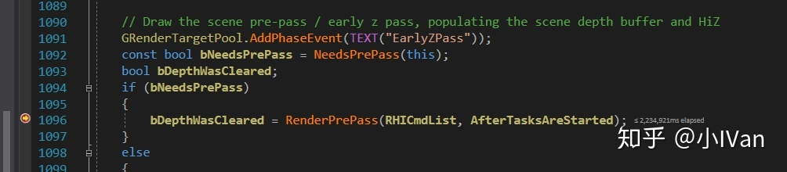

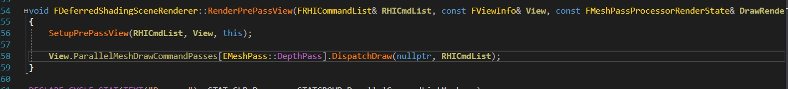

EarlyZ由硬件实现，我们的渲染管线只需要按照硬件要求渲染就可以使用earlyz优化了，具体步骤如下：

（1）首先UE4会把场景中所有的Opaque和Mask的材质做一遍Pre-Pass，只写深度不写颜色，这样可以做到快速写入，先渲染Opaque再渲染Mask的物体，渲染Mask的时候开启Clip。

（2）做完Pre-pass之后，这个时候把深度测试改为Equal，关闭写深度渲染Opaque物体。然后再渲染Mask物体，同样是关闭深度写，深度测试改为Equal，但是这个时候是不开启clip的，因为pre-pass已经把深度写入，这个时候只需要把Equal的像素写入就可以了。

关于EarlyZ的具体详解可以去看参考文章【1】

首先渲染prepass的第一步肯定是渲染资源的准备啦。primitive资源会在InitView的时候准备好。

然后会再BeginRenderingPrePass函数中设置各种绘制管线的绑定，包括关闭颜色写入，绑定Render target

然后再调用draw之前会把各种UniformBuffer和渲染状态设置好

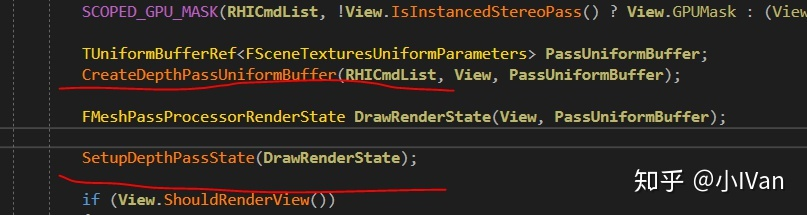

然后调用draw

最后完成PrePass的绘制

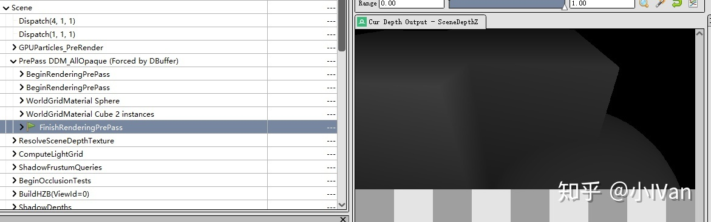

## （3）【ShadowDepthPass】

根据不同的灯光类型会绘制不同种类的shadowmap。总的来说绘制shadowmap的时候不会使用遮挡剔除。

Unreal渲染shadowmap目前我就找到个视锥剔除

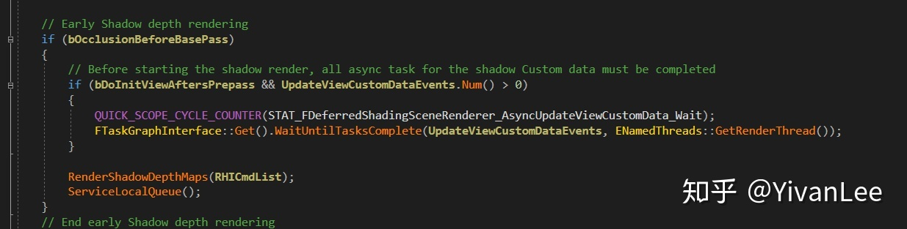

shadowdepthpass可能是在basepass之前，也可以是之后，具体看EarlyZ的方式

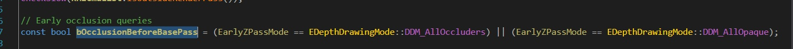

我们的灯光种类繁多大致可以分为两类，一类使用2Dshadowmap的，一类使用Cubemapshadowmap的

上图的1部分就是渲染2DshadowMap，2部分渲染的就是Cubemapshadowmap，这一步只是渲染出shadowmap供后面的Lightingpass使用。

## （4）【BasePass】

BasePass使用了MRT技术一次性渲染出GBuffer。

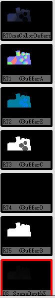

再上一次GBuffer的数据分布

BasePass把GBuffer渲染出来之后就可以供后面的LightingPass使用了。我们的材质编辑器再Surface模式下也是在生成MaterialShader为BasePass服务

这部分可以去看看我的材质编辑器篇有详细介绍。

也是通过一系列设置绑定渲染状态资源等，最后调用dispatchdraw

可以注意到，MRT0是SceneColor而不是BaseColor

Scene在BasePass中做了简单的漫反射计算

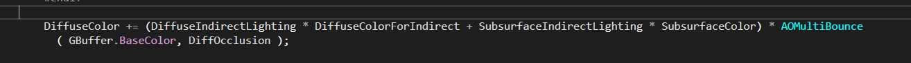

这一步用到了，这个测试场景我是烘焙过的，我把烘焙数据去掉，SceneColor其实是这样的：

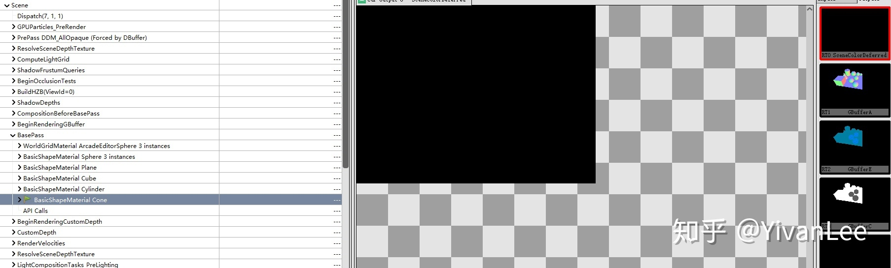

啥也没有黑的

BasePass会在这个阶段把预烘焙的IndirectLiting计算到SceneColor这张RT上供后面的pass使用

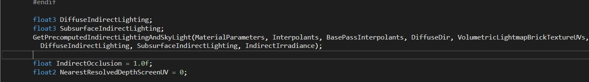

## （5）【CustomDepthPass】

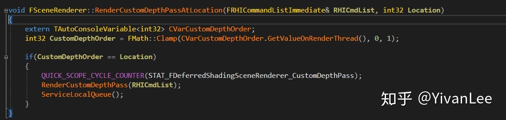

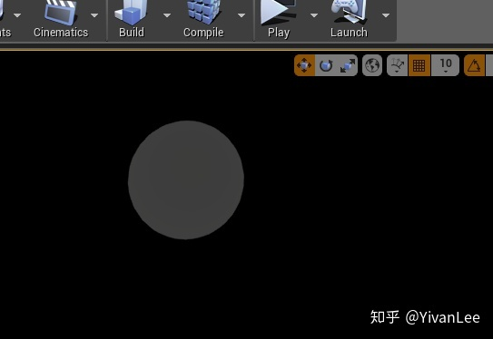

上面的图渲染了一个球的customdepth（在红圈处可以看到一个球，可能不是很明显哈）。CustomDepth没啥特别的，就是把需要绘制CustomDepth的物体的深度再绘制一遍到CustomDepthBuffer上。

## （6）PreLightingPass

虚幻封装了一套方便画PostPass的机制，后面的绘制SSAO，Lighting，SSR，Bloom等各种pass都是用的这逃Context的机制。

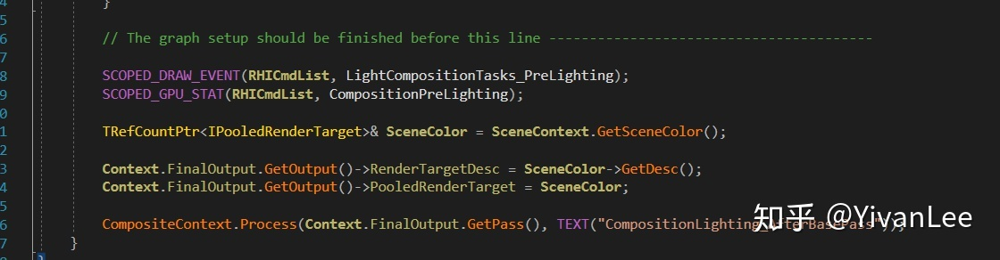

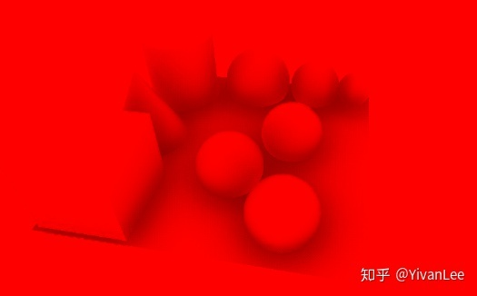

PreLighting这步主要是在用前面的GBuffer算decals和SSAO为后面的Lighting做准备。

SSAO使用的是FPostProcessBasePassAOPS这个C++shader类。

对应的USF是PostProcessAmbientOcclusion

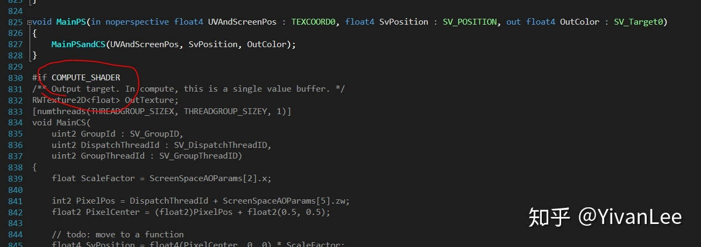

并且使用Computeshader来加速计算。

## （7）【DirectLightPass】

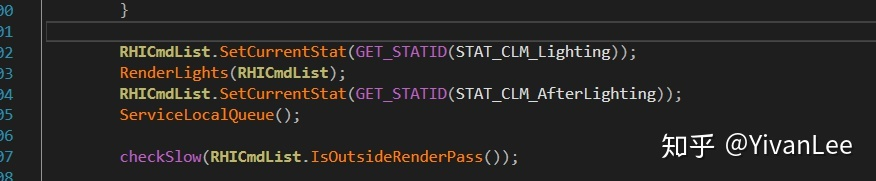

LightPass也非常复杂，整个pass的代码有几千行，shader代码也有几千行非常恐怖的系统。我们先找到入口函数：

### （1）方向光

根据不同的情况，使用不同的渲染策略

渲染不同情况下的灯光大体分类如下。还会根据不同的渲染方式分类。

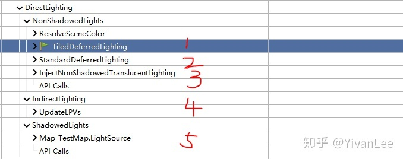

比如一般的方向光：

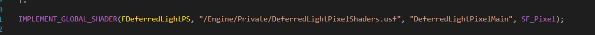

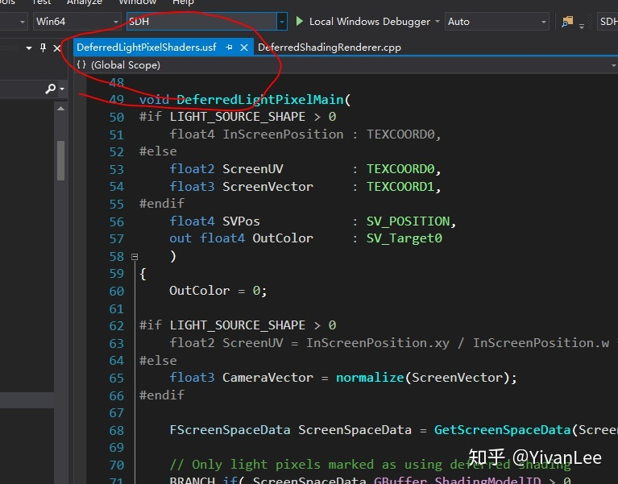

在渲染方向光的时候因为不需要考虑分块，所以直接把每盏灯挨个画出来就可以了

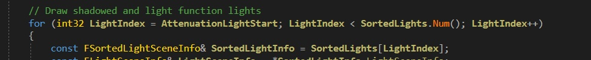

下面我只放了一盏方向光

下面我放三盏方向光：

### （2）TileDeferredLighting

如果灯光不渲染阴影，并且灯光没用IES并且灯光数目达到80盏以上（4.22）并且启用了TileDeferred管线，那么虚幻4就会使用TileDeferredLight来计算光照，虚幻实现TileDeferrdLight使用的是一个Computeshader

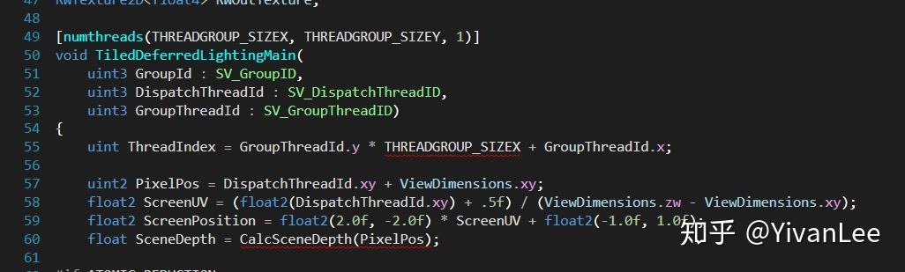

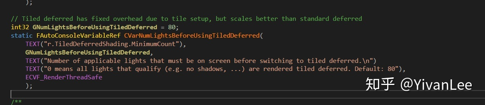

有很多灯光使用的潜规则。

## （8）【ScreenSpaceReflectionPass】

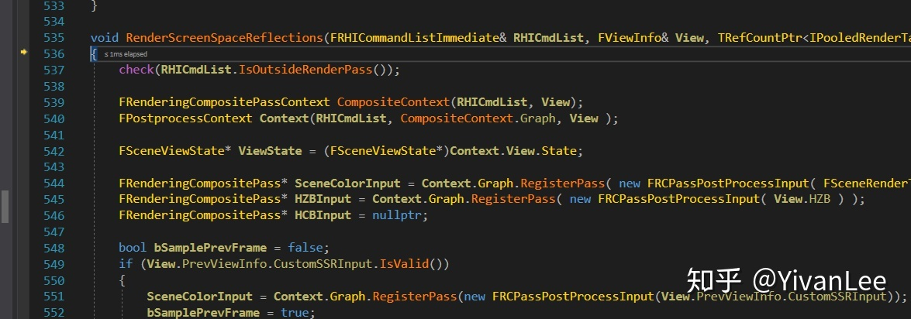

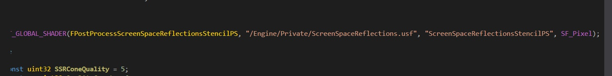

## （9）【TranslucencyPass】

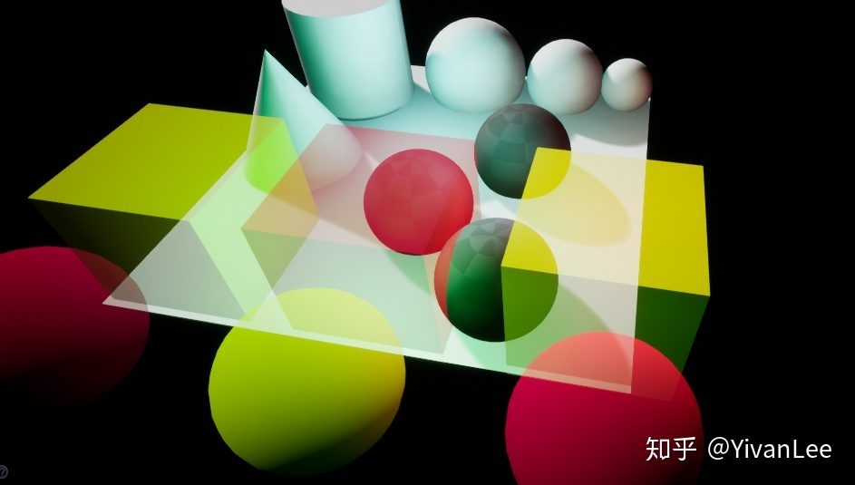

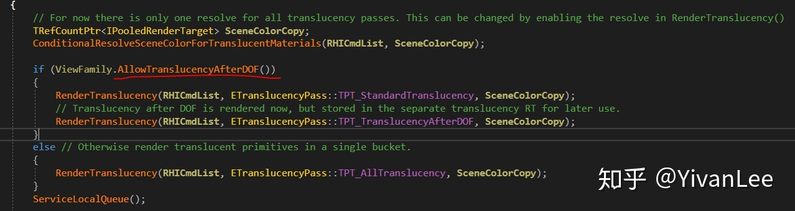

透明物体会放在最后渲染，但是在后期的前面。需要看是否在DOF(景深)后合并。

对于这个上图的那个场景来说，透明物体渲染的buffer是长下面这样的：

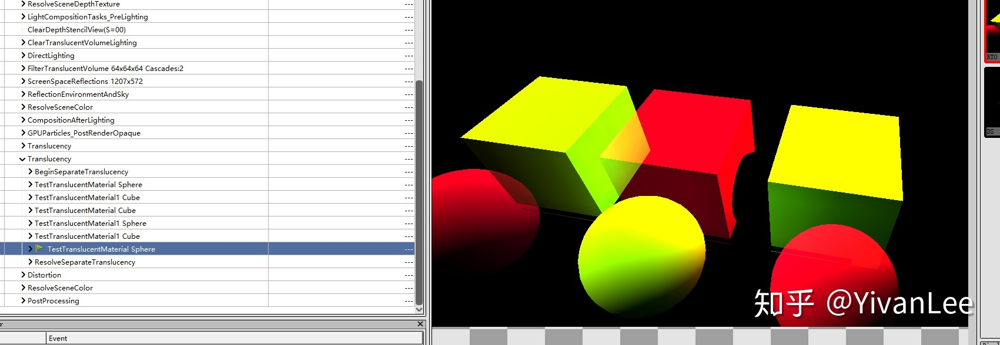

最后在后期中组合

如果没有启用r.ParallelTranslucency透明物体只能挨个渲染。

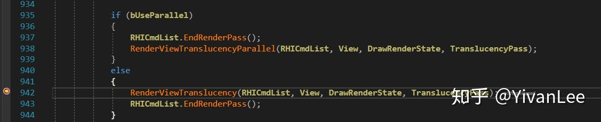

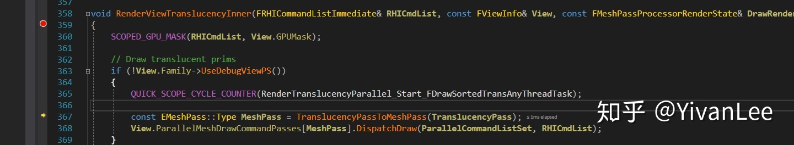

如果启用了就可以走上面的并行渲染分支。

透明物体的渲染在实时渲染中一直比较迷，会有各种问题。比如排序等等。在默认情况下是走AllowTranslucentDOF的。AllowTranslucentDOF是什么意思呢，代码的注释里有解释。

Translucent物体的渲染有几种模式：

这里的代码我们在BasePassPixelShader.usf里能找到

对于非透明物体来说basepass是渲染GBuffer的，但是对于透明物体来说，BasePass是渲染基础的+Lighting的，会在这里一次性渲染完，如果我们想改透明物体的shading方式，就需要用在这里改了。

Enjoy it

## **Next：**

参考文章：

【1】[fengliancanxue：深入剖析GPU Early Z优化](https://zhuanlan.zhihu.com/p/53092784)

【2】[Visibility and Occlusion Culling](https://link.zhihu.com/?target=https%3A//docs.unrealengine.com/en-us/Engine/Rendering/VisibilityCulling)

