# 虚幻4渲染编程(Shader篇)【第十卷：绘制策略】


我的专栏目录：

小IVan：专题概述及目录

zhuanlan.zhihu.com

​        本文使用的是UE4.19的源码，介绍的也是4.19之前的管线，DrawingPolicy和DrawList会在4.22后被干掉。但是我后面会持续更新，我后面有写一篇MeshDrawPipline的文章。

小IVan：虚幻4渲染编程(Shader篇)【第十二卷：MeshDrawPipline】

zhuanlan.zhihu.com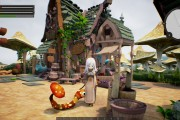

这篇介绍的是4.21之前的管线，可以看完这篇再看MeshDrawPipline。***如有错误，还请各路巨佬斧正。***

4.21之前的虚幻渲染管线（使用Policy和DrawList）


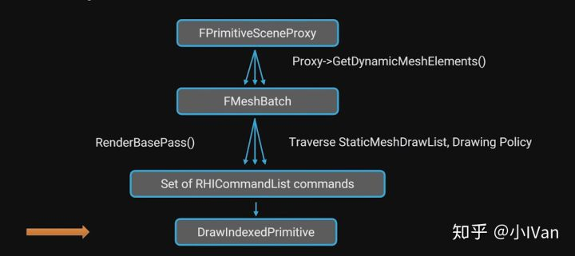

4.22重构后的虚幻渲染管线（使用MeshDraw）


​         虚幻4中，在渲染线程层真正负责绘制操作的是DrawingPolicy和DrawingPolicy  Factory。如果我们要定制自己的渲染器并且想从底层优化我们的渲染的话，就要从这两个东西下手。不过在开始研究这两个东西之前我们需要先搞清楚虚幻的整个渲染框架，我这里大概说一下我自己的总结。之前的文章我也有描述过，但是都没有描述完整。这里分几个部分：

【1】Shader的生成

【2】DrawingPolicy绘制数据的管理

【3】整个绘制过程

在开始之前，一定要明确的几个概念。

（1）Shader一定是在使用之前就编译好的（未来不知道会怎样），从某种角度上说shader可以认为是预编译好的资源，不同的程序不同的环境平台我们需要不同的Shader，也就是说我们一个效果会有很多个shader，要用的时候需要根据不同条件去取对应的出来。

（2）Shader C++类和Shader一定要区分开。Shader C++类是在CPU端管理控制shader的，shader是在GPU上跑的。留言区有位朋友质疑我都文章，就是因为他没有把这个概念明晰导致的。

（3）Shader的定义，编译，使用是三个分开的过程，不能混在一起看作是一套连贯的线性过程。

------

## **【1】Shader的生成**

​         首先是shader的生成。虚幻4的shader C++类主要分了三个类型，Material Shader Mesh  Material Shader，Global Shader。总得来说MaterialSHader C++类和MeshMaterialShader  C++类允许多份实例，GlobalShader C++类的实例只允许存在一份。

​         我们的材质编辑器负责填充一个叫Material  Template的函数模板，当我们点击Compile的时候，材质编辑器的材质节点便会填充这个MaterialTemplate.usf生成一个函数库。这还没完compile操作还会根据材质编辑器里的各种宏，各种绘制状态，游戏的高中低配分级等条件编译出很多份Shader，放在FMaterial的ShaderMap中。有一个宏材，质编辑器就会编译出两份shader，有两个宏，就会编译出4个，呈指数型上涨（先这么简单理解）。

**（1）GlobalShader**

​         感觉这样直接说Material Shader太抽象了，我们先自己实际动手敲一个Golobal  Shader绘制过程出来吧，自己调用Draw。敲完这个例子之后再进行下一步就会豁然开朗了。首先在引擎里新建三个文件（红圈圈起来的这三个。分别是SkyRender.usf；SkyRender.h；SkyRender.cpp）


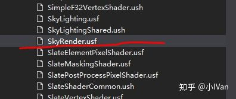


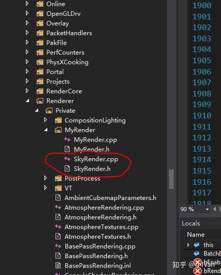

我们先打开SkyRender.usf

敲入如下代码：

```text
#include "Common.ush"

uniform float4x4 UnityVP;
uniform float3 TestColor;

void MainVS(
	in float3 InPosition : ATTRIBUTE0,
	out float4 Position : SV_POSITION
)
{
    Position = mul(float4(InPosition, 1.0f), UnityVP);
}

void MainPS(
	out float4 OutColor : SV_Target0
)
{

#if SAMPLELEVEL == 0
	OutColor = float4(1, 0, 0, 1);
#endif

#if SAMPLELEVEL == 1
	OutColor = float4(0, 1, 0, 1);
#endif

#if SAMPLELEVEL == 2
	OutColor = float4(0, 0, 1, 1);
#endif
}
```

我们包含了Common.usf。在Common.usf中会帮我们包含大量需要的辅助设置，从C++传上来的宏，一些函数等等。然后我们声明了一个叫UnityVP的矩阵和一个TestColor的颜色。然后就是我们的顶点着色器了，这里直接把物体从世界空间变换到投影空间。最后是我们的像素着色器，我们这里根据宏输出不同的颜色。

然后打开SkyRender.h文件，敲入如下代码：

```text
#pragma once

#include "CoreMinimal.h"
#include "StaticMeshVertexDataInterface.h"
#include "StaticMeshVertexData.h"

#include "RenderResource.h"

struct FDebugPane
{
	FDebugPane();
	~FDebugPane();
	void FillRawData();
	void EmptyRawData();
	void Init();

	TArray<FVector> VerBuffer;
	TArray<uint16> InBuffer;

	uint32 Stride;

	bool Initialized;

	uint32 VertexCount;
	uint32 PrimitiveCount;

	FVertexBufferRHIRef VertexBufferRHI;
	FIndexBufferRHIRef IndexBufferRHI;
};

void FDebugPane::FillRawData()
{
	VerBuffer = {
		FVector(0.0f, 0.0f, 0.0f),
		FVector(100.0f, 0.0f, 0.0f),
		FVector(100.0f, 100.0f, 0.0f),
		FVector(0.0f, 100.0f, 0.0f)
	};

	InBuffer = {
		0, 1, 2,
		0, 2, 3
	};
}
```

我们这里只是做了一个FDebugPlane的数据封装，封装了初始化操作和顶点缓冲数组和索引缓冲数组。

然后打开SkyRender.cpp，敲入如下代码：

```cpp
#include "SkyRender.h"

#include "CoreMinimal.h"

#include "SceneRendering.h"
#include "RHICommandList.h"
#include "Shader.h"
#include "RHIStaticStates.h"
#include "ScenePrivate.h"

template<uint32 SampleLevel>
class TSkyRenderVS : public FGlobalShader
{
	DECLARE_SHADER_TYPE(TSkyRenderVS, Global, /*MYMODULE_API*/);

private:

	FShaderParameter Unity_VP;
public:

	TSkyRenderVS(){}
	TSkyRenderVS(const ShaderMetaType::CompiledShaderInitializerType& Initializer)
		: FGlobalShader(Initializer)
	{
		Unity_VP.Bind(Initializer.ParameterMap, TEXT("UnityVP"));
		//VertexOffset.Bind(Initializer.ParameterMap, TEXT("VertexOffset"));
	}

	static void ModifyCompilationEnvironment(const FGlobalShaderPermutationParameters& Parameters, FShaderCompilerEnvironment& OutEnvironment)
	{
		FGlobalShader::ModifyCompilationEnvironment(Parameters, OutEnvironment);
		OutEnvironment.SetDefine(TEXT("SAMPLELEVEL"), SampleLevel);
	}

	static bool ShouldCompilePermutation(const FGlobalShaderPermutationParameters& Parameters)
	{
		return true;
	}

	static bool ShouldCache(EShaderPlatform Platform)
	{
		return true;
	}

	virtual bool Serialize(FArchive& Ar) override
	{
		bool bShaderHasOutdatedParameters = FGlobalShader::Serialize(Ar);

		Ar << Unity_VP;

		return bShaderHasOutdatedParameters;
	}

	void SetMatrices(FRHICommandListImmediate& RHICmdList, const FScene *Scene, const FViewInfo *View)
	{
		SetShaderValue(RHICmdList, GetVertexShader(), Unity_VP, View->ViewMatrices.GetViewProjectionMatrix());
	}
};
IMPLEMENT_SHADER_TYPE(template<>, TSkyRenderVS<0>, TEXT("/Engine/Private/SkyRender.usf"), TEXT("MainVS"), SF_Vertex);
IMPLEMENT_SHADER_TYPE(template<>, TSkyRenderVS<1>, TEXT("/Engine/Private/SkyRender.usf"), TEXT("MainVS"), SF_Vertex);
IMPLEMENT_SHADER_TYPE(template<>, TSkyRenderVS<2>, TEXT("/Engine/Private/SkyRender.usf"), TEXT("MainVS"), SF_Vertex);

template<uint32 SampleLevel>
class TSkyRenderPS : public FGlobalShader
{
	DECLARE_SHADER_TYPE(TSkyRenderPS, Global, /*MYMODULE_API*/);

	TSkyRenderPS() {}
	TSkyRenderPS(const ShaderMetaType::CompiledShaderInitializerType& Initializer)
		: FGlobalShader(Initializer)
	{
		TestColor.Bind(Initializer.ParameterMap, TEXT("TestColor"));
	}

	static void ModifyCompilationEnvironment(const FGlobalShaderPermutationParameters& Parameters, FShaderCompilerEnvironment& OutEnvironment)
	{
		FGlobalShader::ModifyCompilationEnvironment(Parameters, OutEnvironment);

		OutEnvironment.SetDefine(TEXT("SAMPLELEVEL"), SampleLevel);
	}

	static bool ShouldCache(EShaderPlatform Platform)
	{
		return true;
	}

	static bool ShouldCompilePermutation(const FGlobalShaderPermutationParameters& Parameters)
	{
		return true;
	}

	// FShader interface.
	virtual bool Serialize(FArchive& Ar) override
	{
		bool bShaderHasOutdatedParameters = FGlobalShader::Serialize(Ar);
		return bShaderHasOutdatedParameters;
	}

	void SetUniforms(FRHICommandList& RHICmdList, const FScene *Scene, const FSceneView *SceneView)
	{
		SetShaderValue(RHICmdList, GetPixelShader(), TestColor, FVector(1, 0, 0));
	}

private:
	void SetTexture(FRHICommandList& RHICmdList, UTexture2D *noisetex)
	{

	}

	FShaderParameter TestColor;
};
IMPLEMENT_SHADER_TYPE(template<>, TSkyRenderPS<0>, TEXT("/Engine/Private/SkyRender.usf"), TEXT("MainPS"), SF_Pixel);
IMPLEMENT_SHADER_TYPE(template<>, TSkyRenderPS<1>, TEXT("/Engine/Private/SkyRender.usf"), TEXT("MainPS"), SF_Pixel);
IMPLEMENT_SHADER_TYPE(template<>, TSkyRenderPS<2>, TEXT("/Engine/Private/SkyRender.usf"), TEXT("MainPS"), SF_Pixel);

FDebugPane DebugMesh;

template<uint32 samplvl>
void RenderInternal(
	FRHICommandList& RHICmdList,
	const FScene *Scene,
	const TArrayView<const FViewInfo *> PassViews,
	TShaderMap<FGlobalShaderType>* ShaderMap
)
{
	
}

void FSceneRenderer::RenderMyMesh(FRHICommandListImmediate& RHICmdList, const TArrayView<const FViewInfo *> PassViews, int32 sgPipeLineQuality)
{
	check(IsInRenderingThread());

	TShaderMap<FGlobalShaderType>* ShaderMap = GetGlobalShaderMap(FeatureLevel);

	// pso init
	FSceneRenderTargets& SceneContext = FSceneRenderTargets::Get(RHICmdList);
	SceneContext.BeginRenderingSceneColor(RHICmdList, ESimpleRenderTargetMode::EExistingColorAndDepth, FExclusiveDepthStencil::DepthRead_StencilWrite, true);

	FGraphicsPipelineStateInitializer PSOInit;
	RHICmdList.ApplyCachedRenderTargets(PSOInit);

	PSOInit.RasterizerState = TStaticRasterizerState<FM_Solid, CM_None, false, false>::GetRHI();
	PSOInit.BlendState = TStaticBlendState<>::GetRHI();
	PSOInit.DepthStencilState = TStaticDepthStencilState<false, CF_GreaterEqual>::GetRHI();
	PSOInit.PrimitiveType = EPrimitiveType::PT_TriangleList;
	PSOInit.BoundShaderState.VertexDeclarationRHI = GetVertexDeclarationFVector3();

	static const uint32 SampleLevel = 2;
	TShaderMapRef<TSkyRenderVS<SampleLevel>> Vs(ShaderMap);
	TShaderMapRef<TSkyRenderPS<SampleLevel>> Ps(ShaderMap);
	PSOInit.BoundShaderState.VertexShaderRHI = GETSAFERHISHADER_VERTEX(*Vs);
	PSOInit.BoundShaderState.PixelShaderRHI = GETSAFERHISHADER_PIXEL(*Ps);

	SetGraphicsPipelineState(RHICmdList, PSOInit);


	for (int i = 0; i < PassViews.Num(); ++i)
	{
		const FViewInfo *ViewInfo = PassViews[i];

		Ps->SetUniforms(RHICmdList, Scene, ViewInfo);

		Vs->SetMatrices(RHICmdList, Scene, ViewInfo);

		if (!DebugMesh.Initialized)
		{
			DebugMesh.Init();
		}

		RHICmdList.SetStreamSource(0, DebugMesh.VertexBufferRHI, 0);
		RHICmdList.DrawIndexedPrimitive(DebugMesh.IndexBufferRHI, PT_TriangleList, 0, 0, DebugMesh.VertexCount, 0, DebugMesh.PrimitiveCount, 1);
	}
}

FDebugPane::FDebugPane()
{
	Initialized = false;
}

FDebugPane::~FDebugPane()
{
	VertexBufferRHI.SafeRelease();
	IndexBufferRHI.SafeRelease();
}

void FDebugPane::EmptyRawData()
{
	VerBuffer.Empty();
	InBuffer.Empty();
}

void FDebugPane::Init()
{
	FillRawData();

	VertexCount = static_cast<uint32>(VerBuffer.Num());
	PrimitiveCount = static_cast<uint32>(InBuffer.Num() / 3);

	//GPU Vertex Buffer
	{
		TStaticMeshVertexData<FVector> VertexData(false);
		Stride = VertexData.GetStride();

		VertexData.ResizeBuffer(VerBuffer.Num());

		uint8* Data = VertexData.GetDataPointer();
		const uint8* InData = (const uint8*)&(VerBuffer[0]);
		FMemory::Memcpy(Data, InData, Stride * VerBuffer.Num());

		FResourceArrayInterface *ResourceArray = VertexData.GetResourceArray();
		FRHIResourceCreateInfo CreateInfo(ResourceArray);
		VertexBufferRHI = RHICreateVertexBuffer(ResourceArray->GetResourceDataSize(), BUF_Static, CreateInfo);
	}

	{
		TResourceArray<uint16, INDEXBUFFER_ALIGNMENT> IndexBuffer;
		IndexBuffer.AddUninitialized(InBuffer.Num());
		FMemory::Memcpy(IndexBuffer.GetData(), (void*)(&(InBuffer[0])), InBuffer.Num() * sizeof(uint16));

		// Create index buffer. Fill buffer with initial data upon creation
		FRHIResourceCreateInfo CreateInfo(&IndexBuffer);
		IndexBufferRHI = RHICreateIndexBuffer(sizeof(uint16), IndexBuffer.GetResourceDataSize(), BUF_Static, CreateInfo);
	}

	EmptyRawData();

	Initialized = true;
}
```

cpp文件中分为三部分，第一部分是我们的VS和PS，然后分别用IMPLEMENT_SHADER_TYPE声明shader，这里分别声明了三个


为我们的宏每一种情况各声明一个


要时刻记住的一点是，Shader是提前编译好的，我们更具不同的宏的值去取不同的shader出来渲染。


这就是DrawingPolicy和DrawingPolicyFactory，ShaderPermutation之所以存在的原因之一。

第二部分就是我们的绘制函数部分了，要完成这一部分我们需要到SceneRendering.h的FSceneRenderer类上添加上我们的渲染函数。


然后在DefferredShadingRenderer.cpp的Render函数中加上我们自己的Pass


然后你就能在引擎里看到我们自己的Shader直接渲染出的模型了通过调整宏的值能改变我们模型的颜色


GlobalShader的拿去过程还说比较简单的，直接根据GlobalShader的类型就能直接从GlobalShaderMap里拿到相应的GlobalShader


但是MaterialShader和MaterialMeshShader就比较复杂了，因为这两个shader是要给单个模型用的，可能一个模型就至少需要一个Shader，模型里面还要分动态模型和静态模型，处理情况就非常复杂了。但是我们只要类比上面那个globalshader的例子来理解就会好理解很多。

**总得来说我们的绘制需要对shader做两件事情，就是对shader进行编译然后放到一个容器里（ShaderMap），然后我们要绘制的时候需要从这个容器里把对应的shader取出来。**

但是想要实现这个操作却异常麻烦，首先我们要考虑游戏的高中低配，在高画质低画质下的shader肯定是不一样的。然后是顶点格式，骨骼模型和静态模型的顶点数据肯定是不一样的。然后是各种各样的宏啦，混合模式，我们都需要不同的shader。

​          这时候DrawingPolicy和DrawingPolicyFactory就诞生啦。DrawingPolicy就是负责管理这些各种情况的，它负责具体的Drawing，而PolicyFactory则是负责组合各种数据来生成DrawingPolicy的。类比上面的例子，就是把上面的绘制管线的各种状态的设置，宏的set，等操作封装在一个名叫“XXXDrawingPolicy”的数据结构里。至于为啥要这么做，后面会详细阐述，这里先留一个概念。

现在我们对虚幻的Shader的组织架构有了大概的了解，下面就来详细研究下虚幻的MaterialShader的组织方式。


***（1）MaterialShader***

找到BasePassRendering或者MobileBasePassRendering我们总是可以看到一大片宏


我们全局查找这些宏你将会发现：


这些IMPLEMENT_MATERIAL_SHADER_TYPE宏到底在做什么呢，我们跟进去就可以看到


它在实例化shader类的实例。这里需要区分shader的C++类和shader，这非常重要，这个概念初学者还是很容易搞混或者忘记区分它们最后搞成一堆。


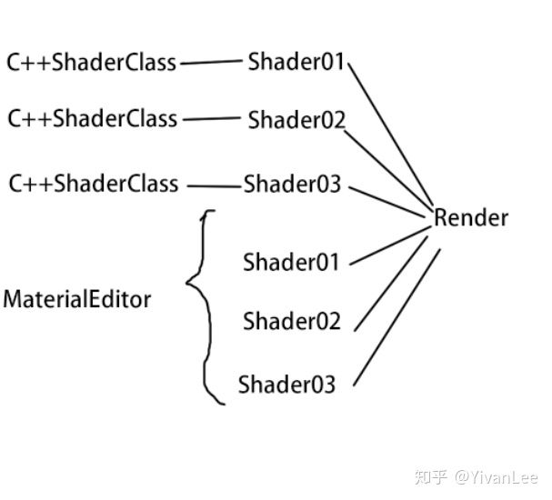


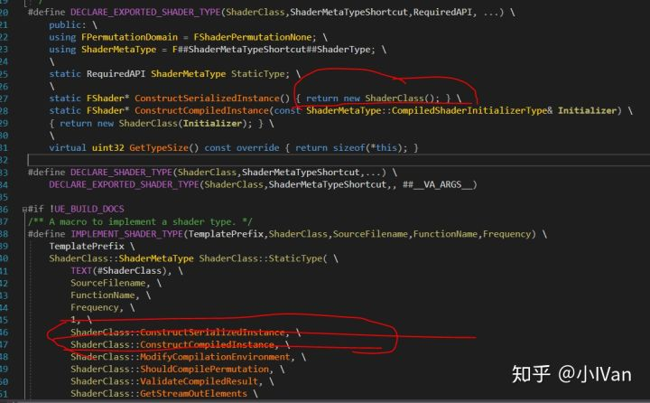

这个宏会把shader文件的路径，类型，shader对应的DrawingPolicy全部和C++shader类绑定好。这也是为什么能够使用Drawing Policy能够在shadermap中查找到对应shader的原因，因为是做过绑定的。


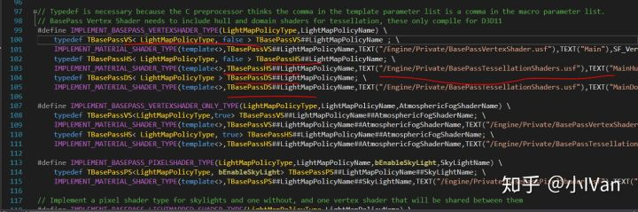

现在有了shader类和shader类的实例，下面就要来聊一下Policy了，如果是非常简单的渲染器，一般一个shader类管理一个shader其实就足够了。虚幻引入DrawingPolicy和DrawingPolicyFactory的目的其实是为了垮平台和实现方便编写Shader。我们如果按照一个Shader   C++类管理一个shader，一个Shader对应一个Shader文件。这实在太低效了，我们游戏中需要很多shader。所以我们使用宏来开关shader中的某一部分。


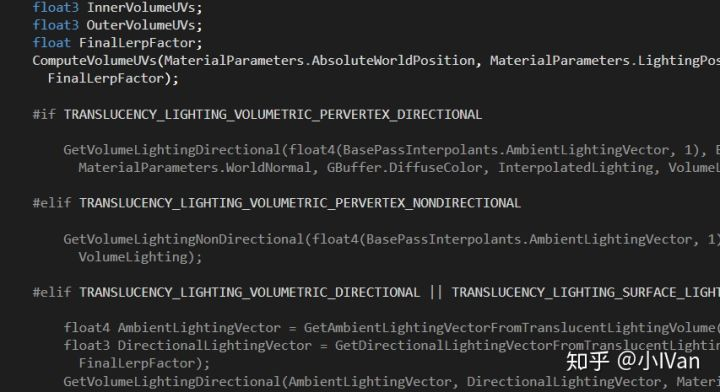

在编译Shader前，Shader  C++类就需要先把这些宏设置好，决定shader中那些代码会被编译到最终的shader文件中，哪些不会。这样我们就可以一个Shader  C++类对应一个Shader  C++类实例，对应很多Shader文件了。这样看起来好像已经满足我们的需求了，但是这又带来了其它问题，我们现在在C++层仍然需要写大量代码，为了增加自由度，我们可以把C++shader类的实例化过程再抽象一次。我们把shader  c++类中的draw和各种状态设置操作抽象出来，这样通过不同的组合，就能自由创建出更多的Shader  C++类实例，而抽象出来的这部分代码就是DrawingPolicy和DrawingPolicyFactory。

​        现在准备好了Shader C++类和Shader C++类的实例，下一步就是编译生成Shader了。下面是我跟了一遍Shader编译的随笔。

虚幻4把模型拖入场景后，模型是怎么被渲染出来的流程分析 - 魁梧的抠脚大汉 - CSDN博客

blog.csdn.net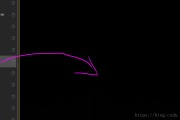

从上面链接的文章中我们可以大概知道虚幻shader的编译过程。现在可还没到绘制过程。我们重点关注FMaterialShaderMap::Compile这个函数

首先看到下面这行代码


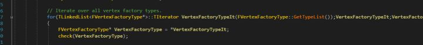

会根据不同的顶点格式创建很多ShaderMap，一个顶点格式对应一套ShaderMap。然后在这段代码下面可以看到BeginCompile


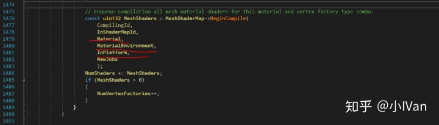

这个函数会把FetureLevel和MaterialEnvironment传进去。Feturelevel就是各个平台信息，MaterialEvironment就是各种宏，我前面有篇增加新的光照模型的文章就有在改这个MaterialEnvironment的设置。

[虚幻4渲染编程(材质编辑器篇)【第二卷：自定义光照模型】](https://zhuanlan.zhihu.com/p/36840778)


在BeginCompile中就会把Shader C++类拿出来编，下面就是在for循环拿到所有用Shader宏实例化的Shader C++类实例


在Shader C++类实例和与之绑定的DrawingPolicy的共同努力下，最终编译成GPU用的Shader文件。并且把这些shader文件放在shadermap中。

------

## **【2】DrawingPolicy绘制数据的管理，shader的使用**

​        现在已经大概了解了整个Shader和绘制的关系原理，**那么下面就进入MaterialShader的正题。**

​         使用拿出主要分两部分，一部分是staticmesh，一部分是dynamicmesh。他们俩的方式方法不同。StaticMesh会沿着DrawList来绘制，当我们把模型从资源浏览器里添加到场景里时，就会调用Render   Scene的AddPrimitive函数，然后在这个函数种会调用Scene->AddPrimitiveSceneInfo_RenderThread(RHICmdList,   PrimitiveSceneInfo);然后会调用FPrimitiveSceneInfo的AddToScene，然后会调用PrimitiveSceneInfo的AddStaticMeshes然后会调用FStaticMesh的AddToDrawLists然后这里会根据情况把FStaticMesh加入到各个DrawingPolicyFactory里面各个Drawing   PolicyFactory又会调用AddStaticMesh函数，这里以FDepthDrawingPolicyFactory的AddStaticMesh为例这里就会完成把我们的模型数据加入到FScene的各种DrawList里面。静态模型Draw的时候就直接调用DrawList进行绘制，在DrawList里的DrawingPolicy就已经初始化好了。

​        DynamicMesh则不同，在绘制DynamicMesh之前会先创建DrawingPolicy然后再渲染


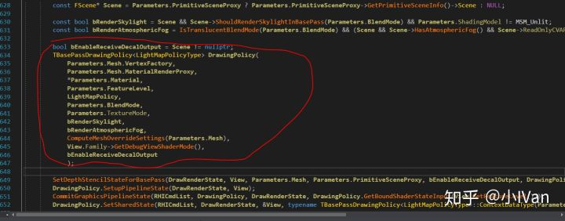

​        再这个构造函数中就对这个Policy的shader进行了初始化


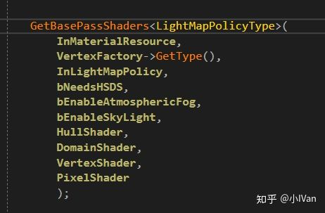

这个函数就把Policy需要的所有Shader从Material中拿出来，跟进去将可以看到


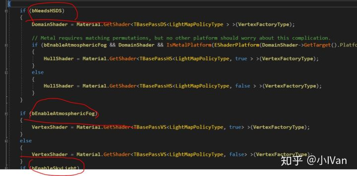

​        根据各种符号拿相应的Shader出来，我们的ShaderMap在之前是绑定好生成好的，只要按照存入的规则，我们就可以轻而易举把Shader取出来用。


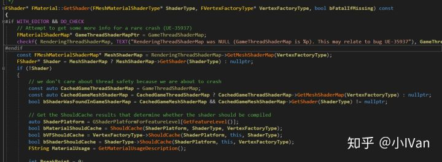

​          可以看到这里在拿Shader，拿到Shader之后Policy调用Draw方法，RHIComList再调用更底层。最终我们的Mesh就这么被绘制出来了。因为Drawingpolicy就是个对绘制逻辑的封装，所以你可以再源码里找到各种各样的名叫“XXXXDrawingPolicy”的东西，有的有共同的父类，有的Drawing  Policy却没有共有的父类。

​        到了这里，知道了Shader是如何生成的，如何使用的。但是还是留下很多疑惑，但核心疑惑仍然是，虚幻到底是怎么把这些资源这些类组合到一起的。

​          我们的shader全部是运行之前就生成编译好的。我们再来仔细研究下StaticDrawList。StaticDrawList被使用在绘制静态物体上。这里需要弄清楚的是，什么是动态物体什么是静态物体，千万不要以为静止不动的物体就叫静态物体。准确地说，绘制状态不发生改变的物体叫静态物体。

​          这个StaticDrawList里面储存的DrawingPolicy。DrawingPolicy可以用来在shadermap中查找到对应的shader，于是我们绘制时需要使用的Shader有了。现在还差绘制的几何数据，VB和IB。当我们在场景编辑器里把模型拖进场景的时候，这时候几何数据就会用DrawingPolicyFactory创建一个DrawingPolicy。DrawingPolicyFactory会创建数个DrawingPolicy，这些DrawingPolicy会分享一个batchmesh。

​        在绘制之前会先sort这些DrawingPolicy，要绘制的时候直接取出来用就可以了，DrawingPolicy和ShaderMap是匹配的（shader C++类的实例匹配好的），可以用DrawingPolicy查到shader。


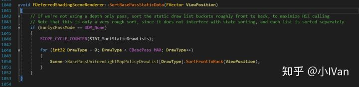

------

## **【3】虚幻4整个绘制过程**

首先包含了两个阶段，一个是Editor阶段一个是Runtime阶段，Editor阶段就是我们平时打开编辑器的阶段，这个阶段主要是准备渲染资源，模型贴图动画的导入，场景的搭建。对于渲染器来说，场景的搭建过程其实是DrawList的构建过程，各种LightMap，SH的烘焙过程等等。这个阶段我们会为渲染器准备各式各样的资源，包括但不限于模型贴图数据，还有刚才提到的静态绘制列表等等。

然后就是Runtime阶段。**敲**过渲染器的都知道，我们需要一个Render才能开始渲染啊。管理整个虚幻4渲染的是一个SceneRender的类，大的源头应该从它开始


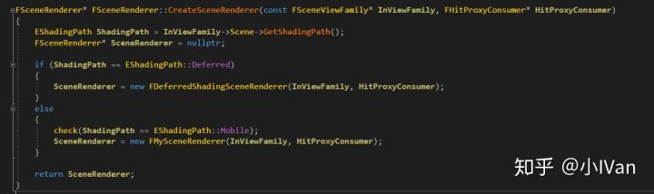

可以看到目前虚幻4只提供了两个渲染器，一个是Mobile的，一个是Defferred的

如果嫌少，可以自己再创建一个渲染器也可以的


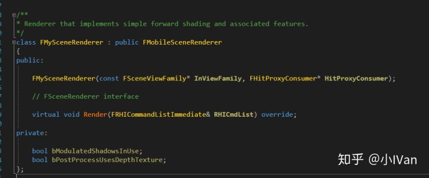

渲染器创建好以后会每帧调用它的Render函数以延迟渲染器为例


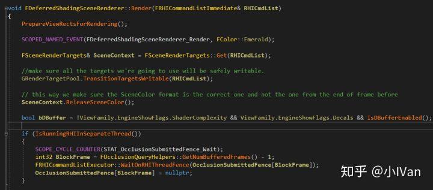

这里是在为渲染做各种准备，SceneContex是从GBuffer的RenderTexturePool抽出来的，它就是一坨GBuffer


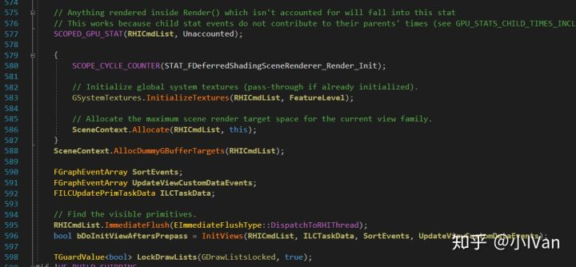

然后继续往下走依然是一大坨准备工作，需要注意那个InitViews函数，它在抽取各种渲染数据，我们的RenderProxy的GetDynamicData就是在这里被抽取的。

再往下就是在渲染各种Pass了


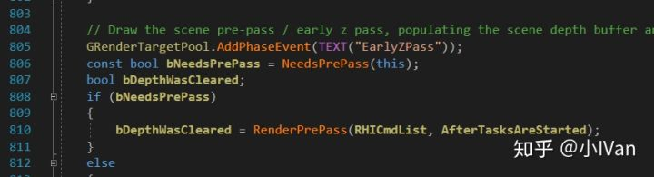

这些pass里有些是用MaterialMeshShader绘制的，有些是用GlobalShader绘制的。要想绘制完一个完整的模型需要很多pass很多shader共同努力才能完成。这点需要和Mobile管线或者Unity的传统认知分开一下。

在这些pass中着重看一下BasePass


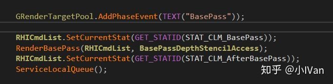

BasePass会走RenderBasePassView


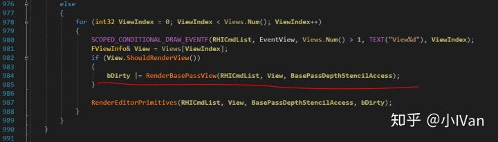

这里就可以看到，渲染分渲染静态模型和动态模型了


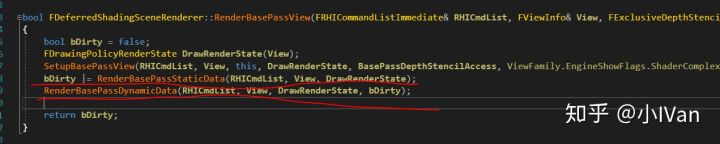

会根据从材质里抽出的数据来分配渲染顺序


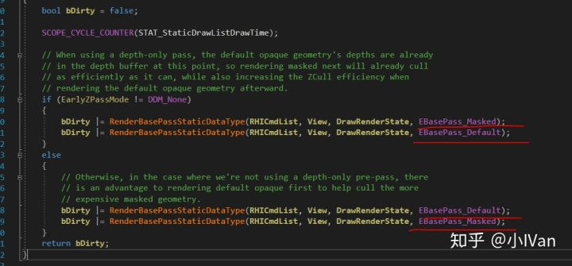

然后调用在Editor阶段就已经准备好的DrawList来绘制


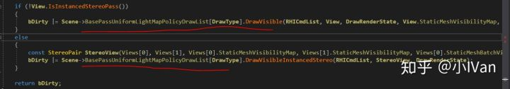

根据DrawingPolicy的类型弹出正确的DrawingPolicy


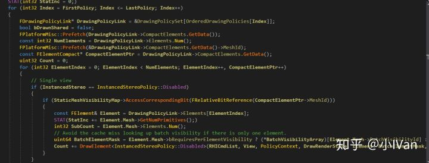

然后根据各种ID各种Link把我们要的Policy弹出来绘制，整个过程可能有点绕。

Dynamic分支在第【2】部分就已经分析过了这里就不赘述了。


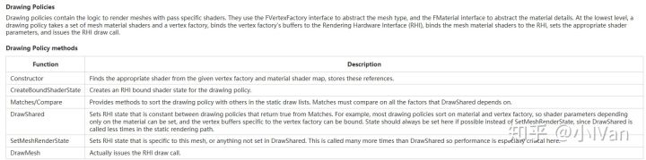

还有很多小细节还需要慢慢理解，不过大体就是上面那样了。最后欢迎给我留言一起讨论

Enjoy it！@
