# 虚幻4渲染编程(Shader篇)【第十三卷：定制自己的MeshDrawPass】


## 简介：

虚幻引擎由于它的高度封装性，导致我们无法随心所欲控制模型的绘制，不像unity直接定义两个pass就能控制模型画两遍。作为TA无法随心所欲控制引擎的绘制肯定是不行的，所以这节将在4.22的新渲染架构MeshDrawPipeLine上对引擎进行改造。

对MeshDrawPipeLine不熟悉的话可以去看我前面的文章。[MeshDrawPipline](https://zhuanlan.zhihu.com/p/61464613)

先上效果吧：


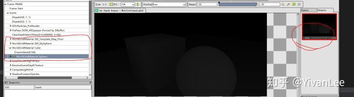

我在PrePass之后添加了我自己的MeshDrawPass渲染我自定义的MobileVolumeLightZ。下面就来实现它。

首先我们要做的核心事情如下：

【1】构造我们需要的MeshDrawCommand

【2】调用我们的MeshDrawCommand进行绘制

------

## 【构造MeshDrawCommand】

自定义MeshDrawPass第一步是为我们的MeshDrawPass添加一个通道，在MeshDrawProcessor.h中添加我们自己的MeshDrawPass


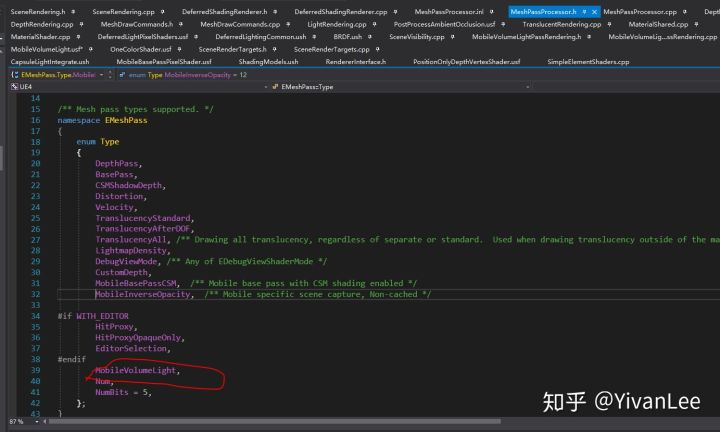

然后再到GetMeshPassName中加对应代码：


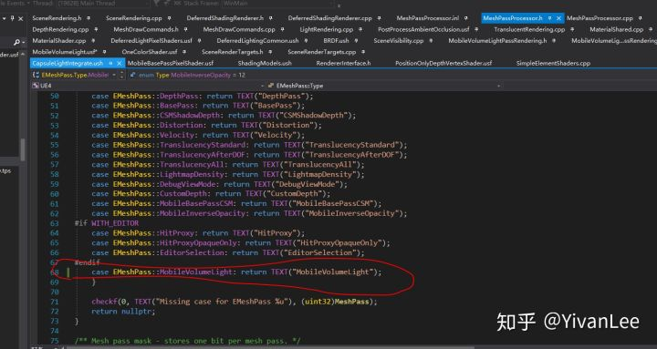


MeshDrawCommand是一个渲染命令，包含了一次DrawCall所需要的所有资源，VertexBuffer，IndexBuffer，Shaders等等。首先找到

FMeshPassProcessor::BuildMeshDrawCommands


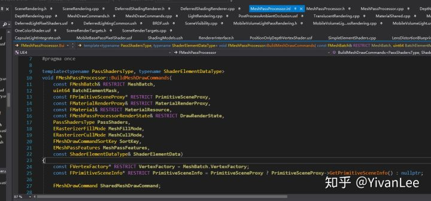

这个函数是所有Pass的MeshDrawCommands的生成函数。我们只需要把生成它所需要的资源填进来就可以了，它自己就会帮我们把生成好的Command填到View.ParallelMeshDrawCommandPasses里，我们到时候直接在Render函数里调它们就可以了。从参数可以看到，需要生成一个Command需要Batchmesh数据，各种渲染状态，PassFeature等等，这些信息包含了一次DrawCall所需要的所有资源。这些资源分散在各个地方，我们需要把它们搜集起来一起打包仍给这个生成函数。这个收集工作就需要找一个对象来负责，它就是FMeshPassProcessor

所以第一步我们先在引擎的如下目录下建两个文件分别是

MobileVolumeLightPassRendering.h

MobileVolumeLightPassRendering.cpp


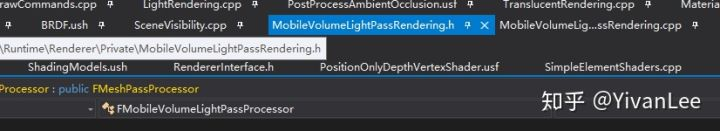

然后声明一个我们的FMeshPassProcessor类

```text
#pragma once

#include "MeshPassProcessor.h"

class FPrimitiveSceneProxy;
class FScene;
class FStaticMeshBatch;
class FViewInfo;

class FMobileVolumeLightPassProcessor : public FMeshPassProcessor
{

public:

	FMobileVolumeLightPassProcessor(
		const FScene* Scene,
		const FSceneView* InViewIfDynamicMeshCommand,
		const FMeshPassProcessorRenderState& InPassDrawRenderState,
		const bool InbRespectUseAsOccluderFlag,
		const bool InbEarlyZPassMoveabe,
		FMeshPassDrawListContext* InDrawListContext
	);

	virtual void AddMeshBatch(
		const FMeshBatch& RESTRICT MeshBatch,
		uint64 BatchElementMask,
		const FPrimitiveSceneProxy* RESTRICT PrimitiveSceneProxy,
		int32 StaticMeshId /* = -1 */
	)override final;

private:

	void Process(
		const FMeshBatch& MeshBatch,
		uint64 BatchElementMask,
		uint32 StaticMeshID,
		const FPrimitiveSceneProxy* RESTRICT PrimitiveSceneProxy,
		const FMaterialRenderProxy& RESTRICT MaterialRenderProxy,
		const FMaterial& RESTRICT MaterialResource,
		ERasterizerFillMode MeshFillMode,
		ERasterizerCullMode MeshCullMode
	);

	FMeshPassProcessorRenderState PassDrawRenderState;

	const bool bRespectUseAsOccluderFlag;
	const bool bEarlyZPassMoveable;

};
```

这里有个核心函数AddMeshBatch，这个函数必须重载，因为这个函数将会从引擎底层拿到BatchMesh，Material等资源。Process函数负责把拿到的资源塞给BuildMeshDrawCommands来生成MeshDrawCommand。先暂时不管FMobileVolumeLightPassProcessor的函数实现。FMobileVolumeLightPassProcessor是负责资源递送的，模型数据（VB和IB）和视口UniformBuffer数据等引擎都为我们准备好了，但是Shader数据得我们自己准备，毕竟我们想要自定义渲染效果。下面新建一个usf文件


```text
#include "Common.ush"
#include "/Engine/Generated/Material.ush"
#include "/Engine/Generated/VertexFactory.ush"

void MainVS(
	FPositionOnlyVertexFactoryInput Input,
	out float4 OutPosition : SV_POSITION
#if USE_GLOBAL_CLIP_PLANE
	, out float OutGlobalClipPlaneDistance : SV_ClipDistance
#endif
#if INSTANCED_STEREO
	, uint InstanceId : SV_InstanceID
#if !MULTI_VIEW
		, out float OutClipDistance : SV_ClipDistance1
#else
		, out uint ViewportIndex : SV_ViewPortArrayIndex
#endif
#endif
	)
{
#if INSTANCED_STEREO
	uint EyeIndex = GetEyeIndex(InstanceId);
	ResolvedView = ResolveView(EyeIndex);

#if !MULTI_VIEW
		OutClipDistance = 0.0;
#else
		ViewportIndex = EyeIndex;
#endif
#else
    ResolvedView = ResolveView();
#endif

    float4 WorldPos = VertexFactoryGetWorldPosition(Input);

	ISOLATE
	{
#if ODS_CAPTURE
		float3 ODS = OffsetODS(WorldPos.xyz, ResolvedView.TranslatedWorldCameraOrigin.xyz, ResolvedView.StereoIPD);
		OutPosition = INVARIANT(mul(float4(WorldPos.xyz + ODS, 1.0), ResolvedView.TranslatedWorldToClip));
#else
        OutPosition = INVARIANT(mul(WorldPos, ResolvedView.TranslatedWorldToClip));
#endif
    }

#if INSTANCED_STEREO && !MULTI_VIEW
	BRANCH 
	if (IsInstancedStereo())  
	{
		// Clip at the center of the screen
		OutClipDistance = dot(OutPosition, EyeClipEdge[EyeIndex]);

		// Scale to the width of a single eye viewport
		OutPosition.x *= 0.5 * ResolvedView.HMDEyePaddingOffset;

		// Shift to the eye viewport
		OutPosition.x += (EyeOffsetScale[EyeIndex] * OutPosition.w) * (1.0f - 0.5 * ResolvedView.HMDEyePaddingOffset);
	}
#endif
#if USE_GLOBAL_CLIP_PLANE
	OutGlobalClipPlaneDistance = dot(ResolvedView.GlobalClippingPlane, float4(WorldPos.xyz - ResolvedView.PreViewTranslation.xyz, 1));
#endif
}


void MainPS(
	out float4 OutColor : SV_Target0
)
{
    OutColor = float4(1, 1, 1, 1);
}
```

准备好shader文件后还需要把shader编译成可使用的二进制并且set进渲染管线，所以需要在c++层做对应的Shader类实现

在MobileVolumeLightPassRendering.cpp种实现shader类


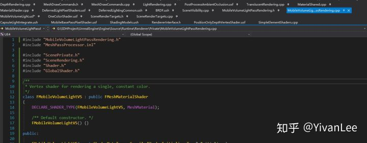

```text
#include "MobileVolumeLightPassRendering.h"
#include "MeshPassProcessor.inl"

#include "ScenePrivate.h"
#include "SceneRendering.h"
#include "Shader.h"
#include "GlobalShader.h"

/**
 * Vertex shader for rendering a single, constant color.
 */
class FMobileVolumeLightVS : public FMeshMaterialShader
{
	DECLARE_SHADER_TYPE(FMobileVolumeLightVS, MeshMaterial);

	/** Default constructor. */
	FMobileVolumeLightVS() {}

public:

	FMobileVolumeLightVS(const ShaderMetaType::CompiledShaderInitializerType& Initializer)
		: FMeshMaterialShader(Initializer)
	{
		//DepthParameter.Bind(Initializer.ParameterMap, TEXT("InputDepth"), SPF_Mandatory);
		BindSceneTextureUniformBufferDependentOnShadingPath(Initializer, PassUniformBuffer, PassUniformBuffer);
	}

	//static void ModifyCompilationEnvironment(const FGlobalShaderPermutationParameters& Parameters, FShaderCompilerEnvironment& OutEnvironment)
	//{
		//FGlobalShader::ModifyCompilationEnvironment(Parameters, OutEnvironment);
		//OutEnvironment.SetDefine(TEXT("USING_NDC_POSITIONS"), (uint32)(bUsingNDCPositions ? 1 : 0));
		//OutEnvironment.SetDefine(TEXT("USING_LAYERS"), (uint32)(bUsingVertexLayers ? 1 : 0));
	//}

	//void SetDepthParameter(FRHICommandList& RHICmdList, float Depth)
	//{
	//	SetShaderValue(RHICmdList, GetVertexShader(), DepthParameter, Depth);
	//}

	//// FShader interface.
	//virtual bool Serialize(FArchive& Ar) override
	//{
	//	bool bShaderHasOutdatedParameters = FGlobalShader::Serialize(Ar);
	//	//Ar << DepthParameter;
	//	return bShaderHasOutdatedParameters;
	//}

	static bool ShouldCompilePermutation(EShaderPlatform Platform, const FMaterial* Material, const FVertexFactoryType* VertexFactoryType)
	{
		return VertexFactoryType->SupportsPositionOnly() && Material->IsSpecialEngineMaterial();
	}

	void GetShaderBindings(const FScene* Scene, ERHIFeatureLevel::Type FeatureLevel, const FPrimitiveSceneProxy* PrimitiveSceneProxy, const FMaterialRenderProxy& MaterialRenderProxy, const FMaterial& Material, const FMeshPassProcessorRenderState& DrawRenderState, const FMeshMaterialShaderElementData& ShaderElementData, FMeshDrawSingleShaderBindings& ShaderBindings)
	{
		FMeshMaterialShader::GetShaderBindings(Scene, FeatureLevel, PrimitiveSceneProxy, MaterialRenderProxy, Material, DrawRenderState, ShaderElementData, ShaderBindings);
	}

	//static const TCHAR* GetSourceFilename()
	//{
	//	return TEXT("/Engine/Private/OneColorShader.usf");
	//}

	//static const TCHAR* GetFunctionName()
	//{
	//	return TEXT("MainVertexShader");
	//}

private:
	//FShaderParameter DepthParameter;
};


class FMobileVolumeLightPS : public FMeshMaterialShader
{
	DECLARE_SHADER_TYPE(FMobileVolumeLightPS, MeshMaterial);
public:

	FMobileVolumeLightPS() { }
	FMobileVolumeLightPS(const ShaderMetaType::CompiledShaderInitializerType& Initializer)
		: FMeshMaterialShader(Initializer)
	{
		//ColorParameter.Bind( Initializer.ParameterMap, TEXT("DrawColorMRT"), SPF_Mandatory);
	}

	//virtual void SetColors(FRHICommandList& RHICmdList, const FLinearColor* Colors, int32 NumColors);

	// FShader interface.
	static bool ShouldCompilePermutation(EShaderPlatform Platform, const FMaterial* Material, const FVertexFactoryType* VertexFactoryType)
	{
		return VertexFactoryType->SupportsPositionOnly() && Material->IsSpecialEngineMaterial();
	}
	void GetShaderBindings(const FScene* Scene, ERHIFeatureLevel::Type FeatureLevel, const FPrimitiveSceneProxy* PrimitiveSceneProxy, const FMaterialRenderProxy& MaterialRenderProxy, const FMaterial& Material, const FMeshPassProcessorRenderState& DrawRenderState, const FMeshMaterialShaderElementData& ShaderElementData, FMeshDrawSingleShaderBindings& ShaderBindings)
	{
		FMeshMaterialShader::GetShaderBindings(Scene, FeatureLevel, PrimitiveSceneProxy, MaterialRenderProxy, Material, DrawRenderState, ShaderElementData, ShaderBindings);
	}
	/** The parameter to use for setting the draw Color. */
	//FShaderParameter ColorParameter;
};

IMPLEMENT_MATERIAL_SHADER_TYPE(, FMobileVolumeLightVS, TEXT("/Engine/Private/MobileVolumeLight.usf"), TEXT("MainVS"), SF_Vertex);
IMPLEMENT_MATERIAL_SHADER_TYPE(, FMobileVolumeLightPS, TEXT("/Engine/Private/MobileVolumeLight.usf"), TEXT("MainPS"), SF_Pixel);
IMPLEMENT_SHADERPIPELINE_TYPE_VS(MobileShaderPipeline, FMobileVolumeLightVS, true);
```

然后在MobileVolumeLightPassRendering.cpp接着做刚才FMobileVolumeLightPassProcessor没做完的实现。我们现在准备好了Shader，通过AddMeshBatch也能拿到模型材质等资源了，下一步就是要把他们塞进MeshDrawCommand里

首先是UniformBuffer，我们需要在FMobileVolumeLightPassProcessor的构造函数种把UniformBuffer准备好


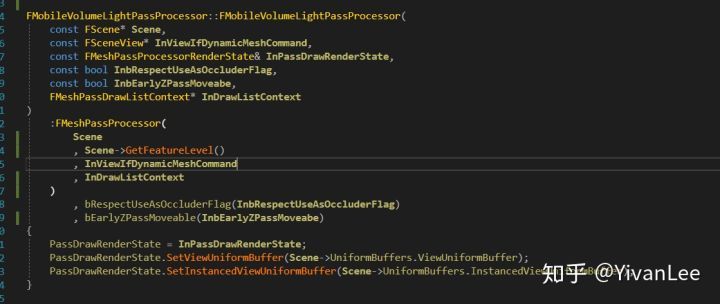

然后是AddMeshBatch的实现和Process的实现

```text
void FMobileVolumeLightPassProcessor::AddMeshBatch(const FMeshBatch& RESTRICT MeshBatch, uint64 BatchElementMask, const FPrimitiveSceneProxy* RESTRICT PrimitiveSceneProxy, int32 StaticMeshId)
{
	const FMaterialRenderProxy* FallBackMaterialRenderProxyPtr = nullptr;
	const FMaterial& Material = MeshBatch.MaterialRenderProxy->GetMaterialWithFallback(Scene->GetFeatureLevel(), FallBackMaterialRenderProxyPtr);

	const EBlendMode BlendMode = Material.GetBlendMode();
	const ERasterizerFillMode MeshFillMode = ComputeMeshFillMode(MeshBatch, Material);
	const ERasterizerCullMode MeshCullMode = ComputeMeshCullMode(MeshBatch, Material);
	const bool bIsTranslucent = IsTranslucentBlendMode(BlendMode);

	if (
		!bIsTranslucent
		&& (!PrimitiveSceneProxy || PrimitiveSceneProxy->ShouldRenderInMainPass())
		&& ShouldIncludeDomainInMeshPass(Material.GetMaterialDomain())
		)
	{
		if (
			BlendMode == BLEND_Opaque
			&& MeshBatch.VertexFactory->SupportsPositionOnlyStream()
			)
		{
			const FMaterialRenderProxy& DefualtProxy = *UMaterial::GetDefaultMaterial(MD_Surface)->GetRenderProxy();
			const FMaterial& DefaltMaterial = *DefualtProxy.GetMaterial(Scene->GetFeatureLevel());

			Process(
				MeshBatch,
				BatchElementMask,
				StaticMeshId,
				PrimitiveSceneProxy,
				DefualtProxy,
				DefaltMaterial,
				MeshFillMode,
				MeshCullMode
			);
		}
	}

}

bool _UseShaderPipelines()
{
	static const auto* CVar = IConsoleManager::Get().FindTConsoleVariableDataInt(TEXT("r.ShaderPipelines"));
	return CVar && CVar->GetValueOnAnyThread() != 0;
}

void GetMobileVolumeLightShaders(
	const FMaterial& material,
	FVertexFactoryType* VertexFactoryType,
	ERHIFeatureLevel::Type FeatureLevel,
	FBaseHS*& HullShader,
	FBaseDS*& DomainShader,
	FMobileVolumeLightVS*& VertexShader,
	FMobileVolumeLightPS*& PixleShader,
	FShaderPipeline*& ShaderPipeline
)
{
	ShaderPipeline = _UseShaderPipelines() ? material.GetShaderPipeline(&MobileShaderPipeline, VertexFactoryType) : nullptr;
	VertexShader = ShaderPipeline ? ShaderPipeline->GetShader<FMobileVolumeLightVS>() : material.GetShader<FMobileVolumeLightVS>(VertexFactoryType);
}

void FMobileVolumeLightPassProcessor::Process(
	const FMeshBatch& MeshBatch,
	uint64 BatchElementMask,
	uint32 StaticMeshID,
	const FPrimitiveSceneProxy* RESTRICT PrimitiveSceneProxy,
	const FMaterialRenderProxy& RESTRICT MaterialRenderProxy,
	const FMaterial& RESTRICT MaterialResource,
	ERasterizerFillMode MeshFillMode,
	ERasterizerCullMode MeshCullMode
)
{
	const FVertexFactory* VertexFactory = MeshBatch.VertexFactory;

	TMeshProcessorShaders<
		FMobileVolumeLightVS,
		FBaseHS,
		FBaseDS,
		FMobileVolumeLightPS
	>MobileVolumeLightShaders;

	FShaderPipeline* ShaderPipline = nullptr;
	GetMobileVolumeLightShaders(
		MaterialResource,
		VertexFactory->GetType(),
		FeatureLevel,
		MobileVolumeLightShaders.HullShader,
		MobileVolumeLightShaders.DomainShader,
		MobileVolumeLightShaders.VertexShader,
		MobileVolumeLightShaders.PixelShader,
		ShaderPipline
	);

	FMeshMaterialShaderElementData ShaderElementData;
	ShaderElementData.InitializeMeshMaterialData(ViewIfDynamicMeshCommand, PrimitiveSceneProxy, MeshBatch, StaticMeshID, true);

	const FMeshDrawCommandSortKey SortKey = CalculateMeshStaticSortKey(MobileVolumeLightShaders.VertexShader, MobileVolumeLightShaders.PixelShader);

	BuildMeshDrawCommands(
		MeshBatch,
		BatchElementMask,
		PrimitiveSceneProxy,
		MaterialRenderProxy,
		MaterialResource,
		PassDrawRenderState,
		MobileVolumeLightShaders,
		MeshFillMode,
		MeshCullMode,
		SortKey,
		EMeshPassFeatures::PositionOnly,
		ShaderElementData
	);
	
}
```

完成了这些之后我们就成功的把渲染资源塞倒了BuildMeshDrawCommands函数里，函数会帮我们完成Command的最后生成和塞到View.ParallelMeshDrawCommandPasses里。

完成这些之后，最后一步是向引擎的全局manager注册我们添加的MeshDrawProcessor

```text
void SetupMobileVolumeLightPassState(FMeshPassProcessorRenderState& DrawRenderState)
{
	DrawRenderState.SetBlendState(TStaticBlendState<CW_NONE>::GetRHI());
	DrawRenderState.SetDepthStencilState(TStaticDepthStencilState<true, CF_DepthNearOrEqual>::GetRHI());
}

FMeshPassProcessor* CreateMobileVolumeLightPassProcessor(
	const FScene* Scene,
	const FSceneView* InViewIfDynamicMeshCommand,
	FMeshPassDrawListContext* InDrawListContext
)
{
	FMeshPassProcessorRenderState MobileVolumeLightRenderPassState;
	SetupMobileVolumeLightPassState(MobileVolumeLightRenderPassState);

	return new(FMemStack::Get()) FMobileVolumeLightPassProcessor(
		Scene,
		InViewIfDynamicMeshCommand,
		MobileVolumeLightRenderPassState,
		true,
		Scene->bEarlyZPassMovable,
		InDrawListContext
	);
}

FRegisterPassProcessorCreateFunction RegisteMobileVolumeLightMeshPass(
	&CreateMobileVolumeLightPassProcessor,
	EShadingPath::Deferred,
	EMeshPass::MobileVolumeLight,
	EMeshPassFlags::CachedMeshCommands | EMeshPassFlags::MainView
);
```

现在完成了shader，MeshDrawCommand的生成之后我们还需要完成MeshDrawCommand的添加。引擎会有两个地方添加MeshDrawCommand，一个是static一个是Dynamic

DynamicMesh的MeshDrawCommand需要每帧产生  目前只有FLocalVertexFactoy,即(UStaticComponent)可 以被Cached  因为其它的VertexFactory需要依赖View来设置Shader Binding

StaticCache和DynamicCache的生成可以看我前面的文章。

找到SceneVisibility的ComputeDynamicMeshRelevance函数做动态cache的添加。修改如下


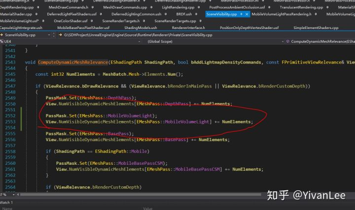

然后找到MarkRelevant函数做static cache的添加，修改如下：


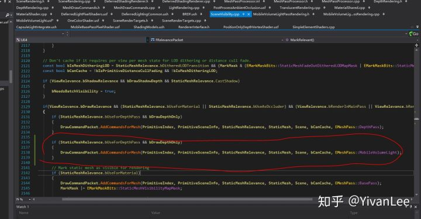

完成了command的cache，下一步就是需要准备最后的绘制了。绘制一个东西我们需要有RenderTarget

在SceneRenderTargets里添加我们的RenderTarget


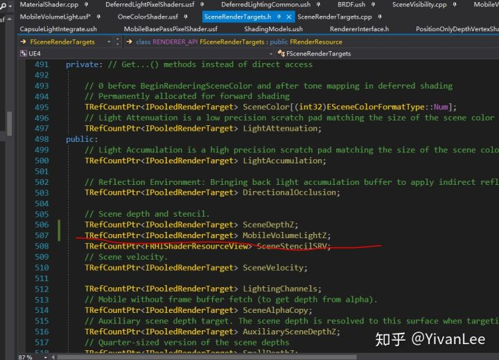

然后添加两个函数来准备绘制时设置Rendertarget


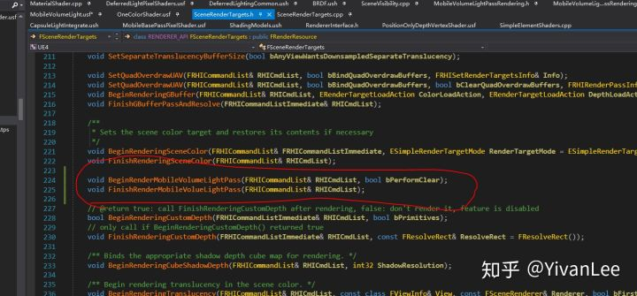

函数在cpp实现如下

```text
void FSceneRenderTargets::BeginRenderMobileVolumeLightPass(FRHICommandList& RHICmdList, bool bPerformClear)
{
	FTexture2DRHIRef MVLZTarget = (const FTexture2DRHIRef&)MobileVolumeLightZ->GetRenderTargetItem().TargetableTexture;

	FRHIRenderPassInfo RPInfo;
	RPInfo.DepthStencilRenderTarget.DepthStencilTarget = MVLZTarget;
	RPInfo.DepthStencilRenderTarget.ExclusiveDepthStencil = FExclusiveDepthStencil::DepthWrite_StencilWrite;

	if (bPerformClear)
	{
		RPInfo.DepthStencilRenderTarget.Action = MakeDepthStencilTargetActions(ERenderTargetActions::Clear_Store, ERenderTargetActions::Clear_Store);
	}
	else
	{
		RPInfo.DepthStencilRenderTarget.Action = MakeDepthStencilTargetActions(ERenderTargetActions::Load_Store, ERenderTargetActions::Load_Store);
	}

	RHICmdList.BeginRenderPass(RPInfo, TEXT("BeginRenderingMobileVolumeLightPass"));

	if (!bPerformClear)
	{
		RHICmdList.BindClearMRTValues(false, true, true);
	}
}

void FSceneRenderTargets::FinishRenderMobileVolueLightPass(FRHICommandList& RHICmdList)
{
	check(RHICmdList.IsInsideRenderPass());

	SCOPED_DRAW_EVENT(RHICmdList, FinishRenderingPrePass);

	RHICmdList.EndRenderPass();

	GVisualizeTexture.SetCheckPoint(RHICmdList, MobileVolumeLightZ);
}
```

还需要在创建Rendertarget的函数和销毁Rendertarget的函数里创建我们的Rendertarget


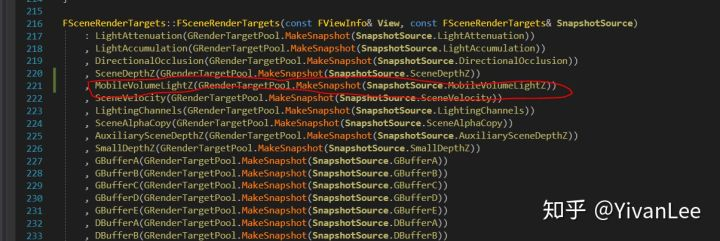


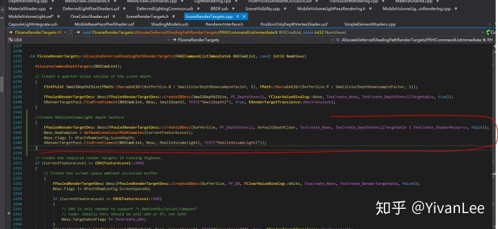


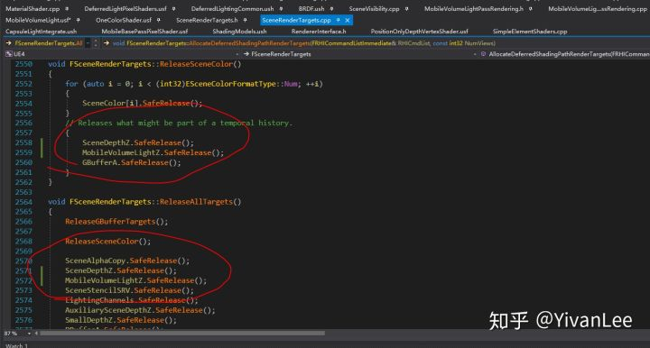

完成这些之后我们需要进行最后一步，创建我们的绘制函数，实际调用DrawCall

在DeferredShadingRenderer中添加我们的绘制函数


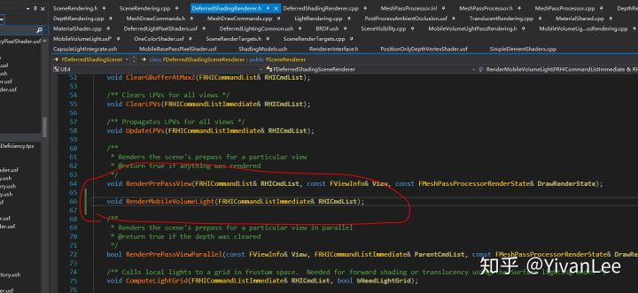

然后再cpp中实现它

```text
static void SetupMobileVolumeLightPassView(
	FRHICommandList& RHIComList,
	const FViewInfo& View,
	const FSceneRenderer* SceneRenderer,
	const bool bIsEditorPrimitivePass = false
)
{
	RHIComList.SetScissorRect(false, 0, 0, 0, 0);

	if (View.IsInstancedStereoPass() || bIsEditorPrimitivePass)
	{
		RHIComList.SetViewport(View.ViewRect.Min.X, View.ViewRect.Min.Y, 0.0f, View.ViewRect.Max.X, View.ViewRect.Max.Y, 1.0f);
	}
	else
	{
		if (View.bIsMultiViewEnabled)
		{
			const uint32 LeftMinX = SceneRenderer->Views[0].ViewRect.Min.X;
			const uint32 LeftMaxX = SceneRenderer->Views[0].ViewRect.Max.X;
			const uint32 RightMinX = SceneRenderer->Views[1].ViewRect.Min.X;
			const uint32 RightMaxX = SceneRenderer->Views[1].ViewRect.Max.X;

			const uint32 LeftMaxY = SceneRenderer->Views[0].ViewRect.Max.Y;
			const uint32 RightMaxY = SceneRenderer->Views[1].ViewRect.Max.Y;

			RHIComList.SetStereoViewport(LeftMinX, RightMinX, 0.0f, 0.0f, 0.0f, LeftMaxX, RightMaxX, LeftMaxY, RightMaxY, 1.0f);
		}
		else
		{
			RHIComList.SetViewport(0, 0, 0.0f, SceneRenderer->InstancedStereoWidth, View.ViewRect.Max.Y, 1.0f);
		}
	}
}

void FDeferredShadingSceneRenderer::RenderMobileVolumeLight(FRHICommandListImmediate& RHICmdList)
{
	check(RHICmdList.IsOutsideRenderPass());
	//SCOPED_DRAW_EVENT(FDeferredShadingSceneRenderer_RenderMobileVolumeLight, FColor::Emerald);

	FSceneRenderTargets& SceneContext = FSceneRenderTargets::Get(RHICmdList);

	SceneContext.BeginRenderMobileVolumeLightPass(RHICmdList, true);
	RHICmdList.EndRenderPass();

	SceneContext.BeginRenderMobileVolumeLightPass(RHICmdList, false);
	FScopedCommandListWaitForTasks Flusher(false, RHICmdList);

	for (int32 ViewIndex = 0; ViewIndex < Views.Num(); ViewIndex++)
	{
		//SCOPED_CONDITIONAL_DRAW_EVENT(RHICmdList, EventView, Views.Num() > 1, TEXT("View%d"), ViewIndex);
		const FViewInfo& View = Views[ViewIndex];
		SCOPED_GPU_MASK(RHICmdList, !View.IsInstancedStereoPass() ? View.GPUMask : (Views[0].GPUMask | Views[1].GPUMask));

		FSceneTexturesUniformParameters SCeneTextureParameters;
		SetupSceneTextureUniformParameters(SceneContext, View.FeatureLevel, ESceneTextureSetupMode::None, SCeneTextureParameters);
		FScene* Scene = View.Family->Scene->GetRenderScene();
		if (Scene)
		{
			
		}

		if (View.ShouldRenderView())
		{
			Scene->UniformBuffers.UpdateViewUniformBuffer(View);
			SetupMobileVolumeLightPassView(RHICmdList, View, this);
			View.ParallelMeshDrawCommandPasses[EMeshPass::MobileVolumeLight].DispatchDraw(nullptr, RHICmdList);
		}
	}

	SceneContext.FinishRenderMobileVolueLightPass(RHICmdList);

}
```

最后在Render函数中调用它绘制即可


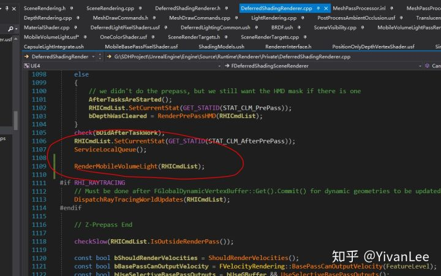

最后我在RenderDoc里截一帧，可以看到最后的效果


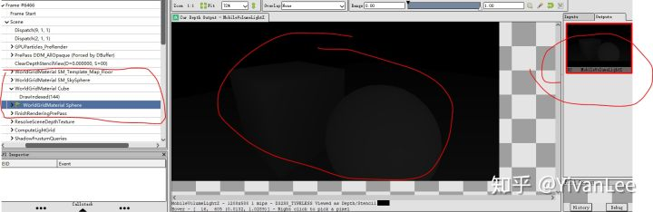

我们成功完成了MeshDraw。

从第一节到这节第13节，基本上我们完成了Unreal渲染的大部分基础研究，现在我们基本可以在Unreal中渲染我们想要渲染的东西而没有束缚了。

------

Enjoy it！
