# 虚幻4渲染编程(Shader篇)【第十二卷：MeshDrawPipline】

## 简介：

Unreal engine的渲染模块是越来越复杂，最开始只有延迟管线，随后加入了mobile，现在又加了很多实时光线追踪的东西，各种DX12，VK新的RHI也纷纷加入。

虚幻4的4.22版本对渲染模块进行了较大重构，废弃了之前的DrawList&&Draw   Policy，取而代之的是MeshDrawPipline。与之前的DrawPolicy相比，MeshDraw更为简洁，灵活。新旧Pipline对比图如下：

4.22

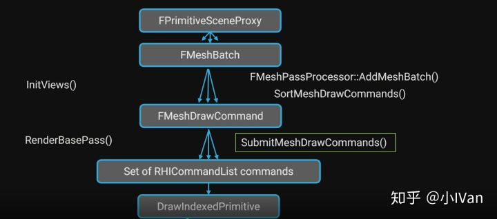

<=4.22

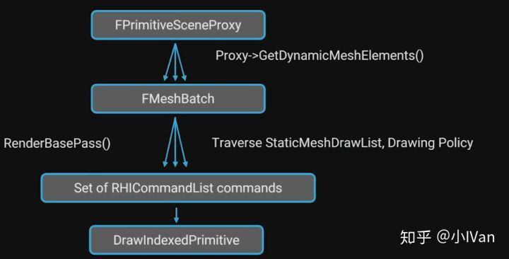

我之前有写老的drawingpolicy的文章：[小IVan：虚幻4渲染编程(Shader篇)【第十卷：绘制策略】](https://zhuanlan.zhihu.com/p/43576669)。如有错误还请巨佬们斧正。

因为涉及到的细枝末节的东西很多，所以这篇文章我会在一个月内持续更新修改。

------

首先先过一下渲染过程中主要的类和步骤。

## 【1】FPrimitiveSceneProxy

这个类的功能没有什么改变，依然在通过GetDynamicMeshElements等函数从每个primitivecomponent中收集渲染资源

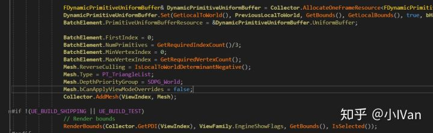

## 【2】InitViews

FPrimitiveComponent的GetDynamicElements这个收集操作通过渲染器的InitViews在可见性剔除之后发起

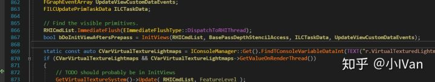

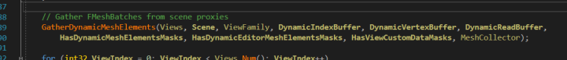

FMeshElementCollector会把场景里的渲染数据收集起来

最后会调用SetupMeshPass来创建MeshPassProcessor

## 【3】FMeshPassProcessor

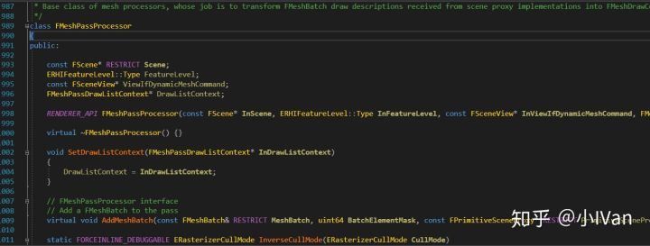

FMeshPassProcessor有两个作用，第一个是选择绘制时所使用的shader，第二个是搜集这个pass绑定的顶点工厂，材质等。**可以从一个FMeshBatch创建多个FMeshDrawCommands**

搜索引擎就会发现，每个pass都会有一个对应的FMeshPassProcessor。FMeshPassProcessor是所有pass的FXXXMeshPassProcessor基类。

在一个pass在初始化的时候，会往MeshPassProcessor里填充BatchMesh渲染单元。

以depthpass为例,DepthPass的PassProcessor创建代码如下：

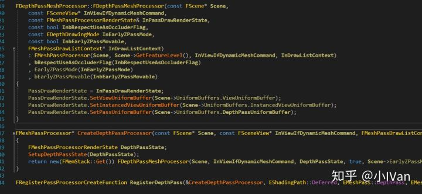

在渲染管线重会调用Processor的AddBatchMesh把渲染资源加进去

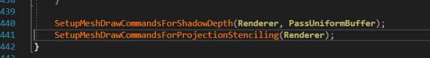

在AddMeshBatch函数中会进行Passfilter和SelectShader，分别对应下图的1，2部分。

shader等设置好以后会通过BuildMeshDrawCommands创建command然后通过FinalizeCommand完成command的添加

## 【4】FMeshDrawCommand

代码注释已经解释得很清楚了。一个MeshDrawCommand描述了一次绘制所需要的所有资源。FMeshDrawCommand类中主要负责管理了三类资源：（1）ShaderBindings，记录了这次Command各个阶段绑定的参数集。（2）VertexStreams   记录了VertexBuffer的信息。IndexBuffer记录了IndexBuffer的相关纤细。CachedPipeline用于索引GraphicPipelineState。

## 【5】ShaderBindings

可以从新老方式中看到，新的方式是通过收集参数而不是直接设置RHICmdList来设置Paramerters了。ShaderBinding是作为MeshDrawCommand的组成部分之一，在这里面需要绑定管线所需要的所有参数集。

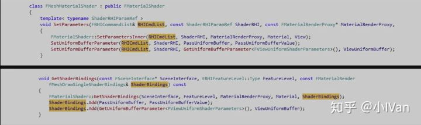

## 【GPUScene】

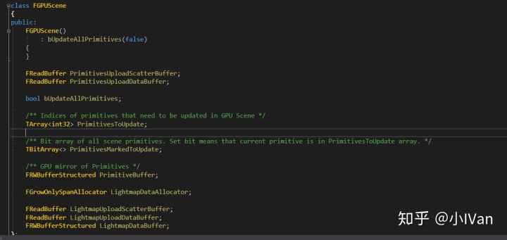

GPUScene有一个PrimitiveBuffer，它会跟踪场景Primitive的添加，移除操作，会在GPU端有一个镜像场景。虚幻使用一个Computeshader来更新primitivebuffer给下一帧使用。Primitivedatabuffer要求一个primitive的所有shader只能有一个primitiveID

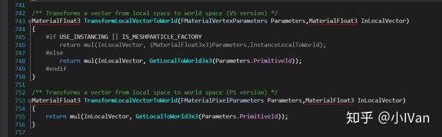

这个primitiveID只有LocalVertexFactory才有

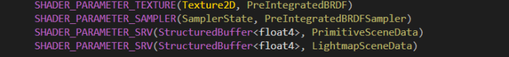

------

这里用CustomDepthPass作为一个例子看一下静态物体的绘制流程。

## 【CustomDepthPass】

首先准备好个空场景然后拖一个盒子进去

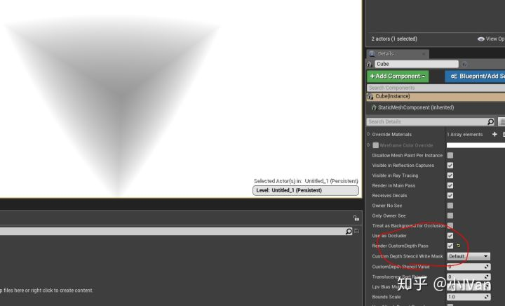

这时会调用AddPrimitive的逻辑

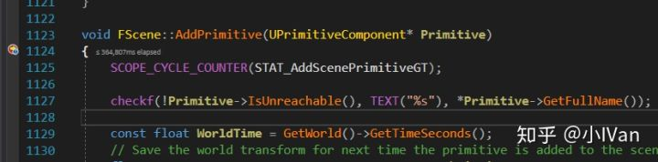

会创建场景代理，各种渲染数据，矩阵包围盒等。并且会更新GPUScene

并且会CacheMeshDrawCommands

然后创建PassProcessor然后AddMeshBatch，这个Processor会创建MeshDrawCommands

完成commands的创建后销毁这个Processor。这便完成了对Commands的添加。

要绘制时直接调用这些commands即可。这些commands会去调用RHI，RHI层会去调用各大图形接口。

最终就完成了绘制。

这里会发现，我们添加的时候是往TSet<FMeshDrawCommandStateBucket,  MeshDrawCommandKeyFuncs>  CachedMeshDrawCommandStateBuckets;里添加，真正使用的时候不会直接使用这个数据，而是经过剔除和各种处理后把一帧画面里所需要的数据放到ParallelMeshDrawCommandPasses里。

------

DrawCall的发起者ParallelMeshDrawCommandPasses

## 【ParallelMeshDrawCommandPasses】

DispatchPassSetup是一个关键函数，它负责为每个pass管理MeshDrawCommands，为绘制每个pass做准备。

可以看到我们有很多种pass类型。一个pass里有很多MeshCommand

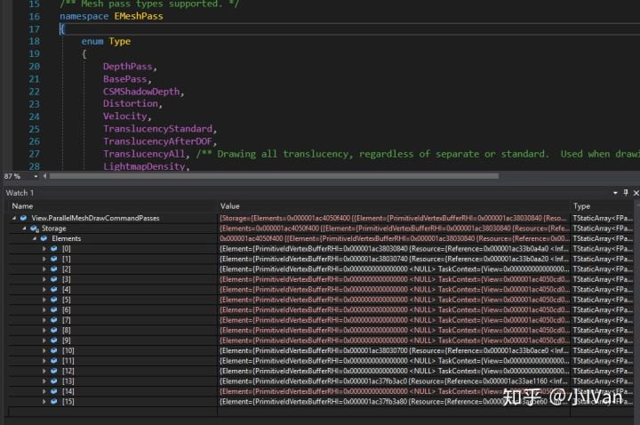

在InitView的时候，我们把我们的command按照不同的pass类型分别塞倒ParallelMeshDrawCommandPasses里，这样就可以方便地统一调用command来完成各个pass的绘制了。

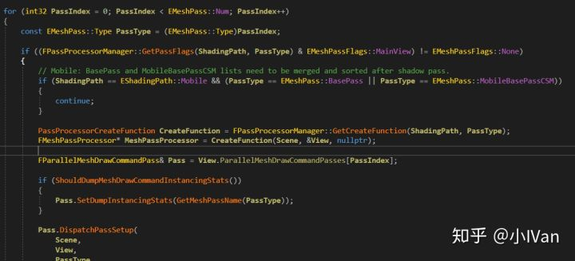

PrePass：

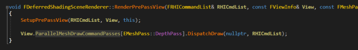

DepthPass：

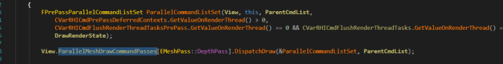

CustomDepthPass：

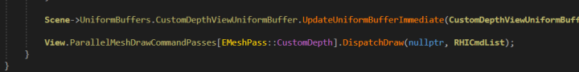

BasePass：

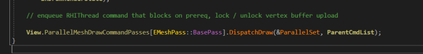

还有很多我这里就不例举了。

我在视口中加入一个球一个盒子，他们的vertex buffer不一样材质一样，所以无法被加入到一个batchmesh中，所以可以理论上customdepthpass会有两次绘制

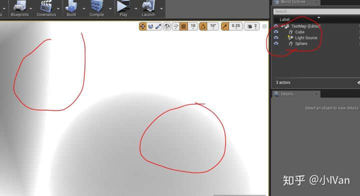

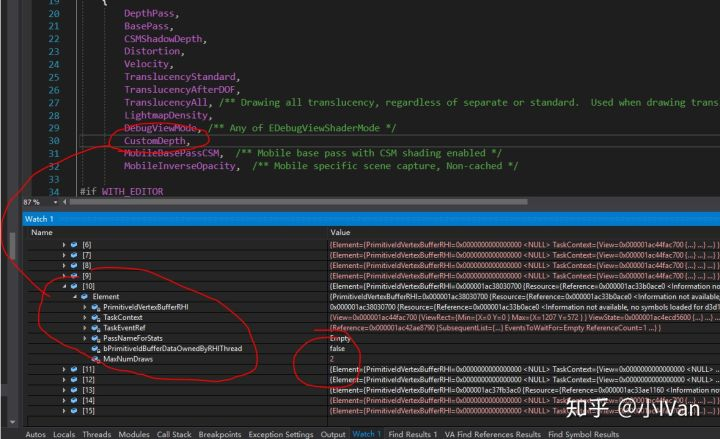

我在视口中再拖了一个盒子，现在视口中有两个盒子一个球体。BasePass只画了两次，因为两个盒子被DrawInstance了，然而CustomDepthPass却画了三次：

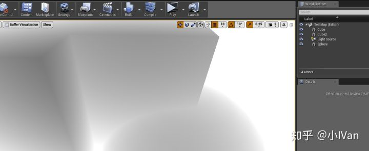

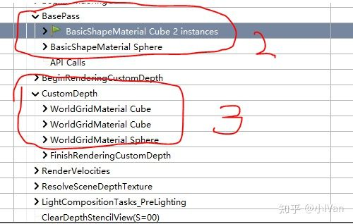

对于美术制作层面来说，如果是做端游，我们可以把模型切成碎块然后搭建场景不需要batch，因为虚幻的basepass已经dynamicbatch了的（前提是这些碎片的vertexbuffer和材质是一样的）比如搭建一个木头结构的房子其实也就用几个木头模型罢了。这样切模型和非在DCC中batch模型的区别在于，其它有些pass不会以dynamicbatch规则去合并这些dc。

------

综上虚幻的渲染模块经过这次重构后，灵活性更强，逻辑更加紧凑。

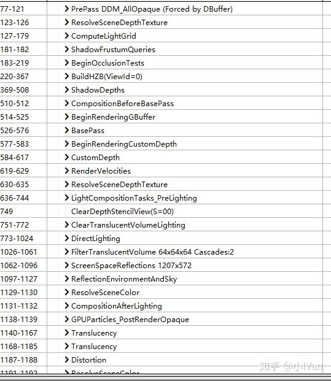

Enjoy it.
