# 虚幻4渲染编程（Shader篇）【第六卷：资源操作】

本节将会介绍虚幻的贴图资源读取，写入，存出等操作。这也是做Instanceing动画，工具开发等的基础。

------

## **【1】向UTexture2D写入数据**


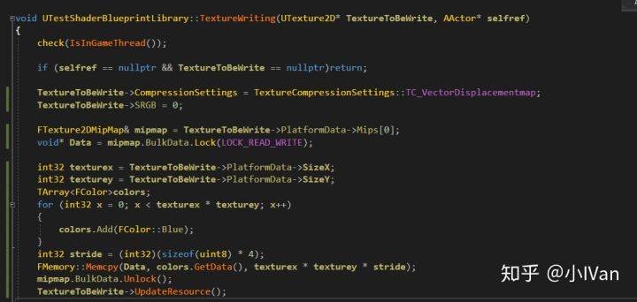

我把蓝色写入UTexture2D

效果如下：

写入前


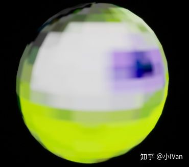

写入后


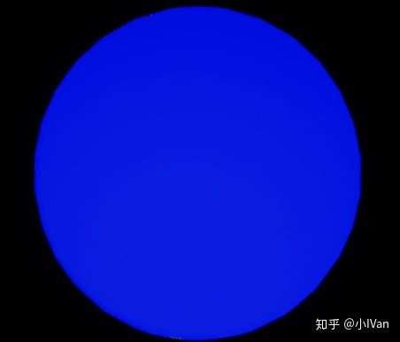

------

## **【2】向FRHITexture2D写入数据**


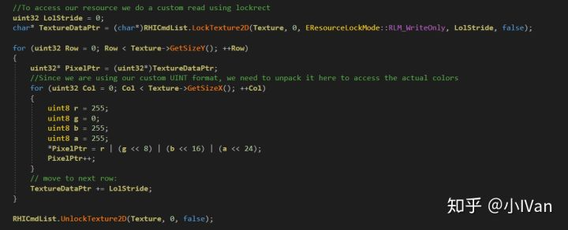

效果如下


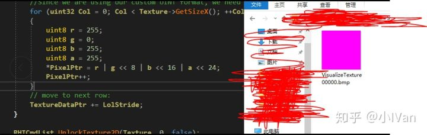

------

## **【3】从FRHITexture2D读取数据**

平时写代码的时候很少用到位操作


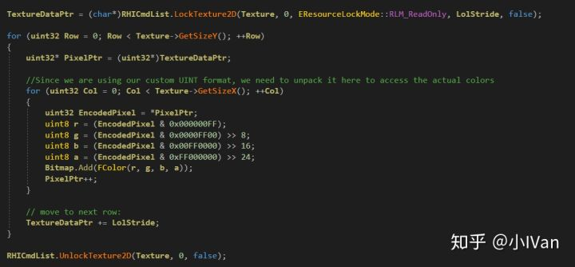

------

## **【4】从UTexture2D转换为FTexture2D并且读取它然后写成文件到磁盘**

```text
void UTestShaderBlueprintLibrary::TextureWriting(UTexture2D* TextureToBeWrite, AActor* selfref)
{
	check(IsInGameThread());

	if (selfref == nullptr && TextureToBeWrite == nullptr)return;

	//TextureToBeWrite->CompressionSettings = TextureCompressionSettings::TC_VectorDisplacementmap;
	//TextureToBeWrite->SRGB = 0;

	//FTexture2DMipMap& mipmap = TextureToBeWrite->PlatformData->Mips[0];
	//void* Data = mipmap.BulkData.Lock(LOCK_READ_WRITE);

	//int32 texturex = TextureToBeWrite->PlatformData->SizeX;
	//int32 texturey = TextureToBeWrite->PlatformData->SizeY;
	//TArray<FColor>colors;
	//for (int32 x = 0; x < texturex * texturey; x++)
	//{
	//	colors.Add(FColor::Blue);
	//}
	//int32 stride = (int32)(sizeof(uint8) * 4);
	//FMemory::Memcpy(Data, colors.GetData(), texturex * texturey * stride);
	//mipmap.BulkData.Unlock();
	//TextureToBeWrite->UpdateResource();

	/*
		struct FUpdateTextureContext
		{
			uint8* SourceBuffer;
			uint32 BufferPitch;
			FTexture2DResource* DestTextureResource;
		};

		FUpdateTextureContext UpdateTextureContext = {
			uint8*()
		}

		ENQUEUE_UNIQUE_RENDER_COMMAND_ONEPARAMETER(
			UpdateDynamicTexture,
			FUpdateTexture
		);
	*/
	UWorld* World = selfref->GetWorld();
	ERHIFeatureLevel::Type FeatureLevel = World->Scene->GetFeatureLevel();

	ENQUEUE_RENDER_COMMAND(CaptureCommand)(
		[FeatureLevel, TextureToBeWrite](FRHICommandListImmediate& RHICmdList)
	{
		TextureWriting_RenderThread
		(
			RHICmdList,
			FeatureLevel,
			TextureToBeWrite
		);
	}
	);

}
```


```text
static void TextureWriting_RenderThread(
	FRHICommandListImmediate& RHICmdList,
	ERHIFeatureLevel::Type FeatureLevel,
	UTexture2D* Texture
)
{
	check(IsInRenderingThread());
	if (Texture == nullptr)
	{
		return;
	}
	
	FTextureReferenceRHIRef MyTextureRHI = Texture->TextureReference.TextureReferenceRHI;
	FRHITexture* TexRef = MyTextureRHI->GetTextureReference()->GetReferencedTexture();
	FRHITexture2D* TexRef2D = (FRHITexture2D*)TexRef;

	TArray<FColor> Bitmap;
	uint32 LolStride = 0;
	char* TextureDataPtr = (char*)RHICmdList.LockTexture2D(TexRef2D, 0, EResourceLockMode::RLM_ReadOnly, LolStride, false);

	for (uint32 Row = 0; Row < TexRef2D->GetSizeY(); ++Row)
	{
		uint32* PixelPtr = (uint32*)TextureDataPtr;
		for (uint32 Col = 0; Col < TexRef2D->GetSizeX(); ++Col)
		{
			uint32 EncodedPixel = *PixelPtr;
			uint8 r = (EncodedPixel & 0x000000FF);
			uint8 g = (EncodedPixel & 0x0000FF00) >> 8;
			uint8 b = (EncodedPixel & 0x00FF0000) >> 16;
			uint8 a = (EncodedPixel & 0xFF000000) >> 24;
			FColor col = FColor(r, g, b, a);
			Bitmap.Add(FColor(b, g, r, a));
			PixelPtr++;
		}
		// move to next row:
		TextureDataPtr += LolStride;
	}
	RHICmdList.UnlockTexture2D(TexRef2D, 0, false);

	if (Bitmap.Num())
	{
		IFileManager::Get().MakeDirectory(*FPaths::ScreenShotDir(), true);
		const FString ScreenFileName(FPaths::ScreenShotDir() / TEXT("VisualizeTexture"));
		uint32 ExtendXWithMSAA = Bitmap.Num() / Texture->GetSizeY();
		// Save the contents of the array to a bitmap file. (24bit only so alpha channel is dropped)
		FFileHelper::CreateBitmap(*ScreenFileName, ExtendXWithMSAA, Texture->GetSizeY(), Bitmap.GetData());
		UE_LOG(LogConsoleResponse, Display, TEXT("Content was saved to \"%s\""), *FPaths::ScreenShotDir());
	}
	else
	{
		UE_LOG(LogConsoleResponse, Error, TEXT("Failed to save BMP, format or texture type is not supported"));
	}
}
```

这个转换比较麻烦，需要各种取资源和强制转换


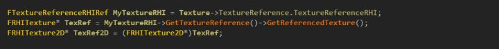

最后注意一下UTexture2D的设置


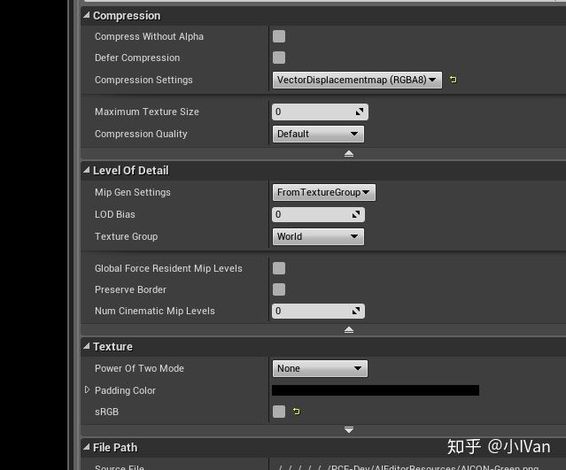

因为UTexture源资源格式的原因，所以rgba顺序是反的


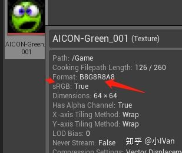

最后的效果：


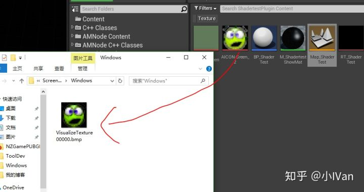

这样我们就完成了资源的转换，读取，写出等操作。

------

## **【5】从FTexture2D反向把数组向UTexture2D写入**

先来看效果吧：


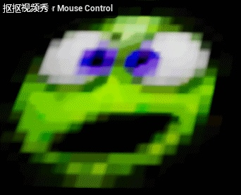

<svg x="16" y="18.5" class="GifPlayer-icon"></svg>

这里我向UTexture2D中反复写入数组颜色和重置它。

下面是完整代码

```text
void UTestShaderBlueprintLibrary::TextureWriting(UTexture2D* TextureToBeWrite, AActor* selfref)
{
	check(IsInGameThread());

	if (selfref == nullptr && TextureToBeWrite == nullptr)return;

	//TextureToBeWrite->CompressionSettings = TextureCompressionSettings::TC_VectorDisplacementmap;
	//TextureToBeWrite->SRGB = 0;

	//FTexture2DMipMap& mipmap = TextureToBeWrite->PlatformData->Mips[0];
	//void* Data = mipmap.BulkData.Lock(LOCK_READ_WRITE);

	//int32 texturex = TextureToBeWrite->PlatformData->SizeX;
	//int32 texturey = TextureToBeWrite->PlatformData->SizeY;
	//TArray<FColor>colors;
	//for (int32 x = 0; x < texturex * texturey; x++)
	//{
	//	colors.Add(FColor::Blue);
	//}
	//int32 stride = (int32)(sizeof(uint8) * 4);
	//FMemory::Memcpy(Data, colors.GetData(), texturex * texturey * stride);
	//mipmap.BulkData.Unlock();
	//TextureToBeWrite->UpdateResource();

	/*
		struct FUpdateTextureContext
		{
			uint8* SourceBuffer;
			uint32 BufferPitch;
			FTexture2DResource* DestTextureResource;
		};

		FUpdateTextureContext UpdateTextureContext = {
			uint8*()
		}

		ENQUEUE_UNIQUE_RENDER_COMMAND_ONEPARAMETER(
			UpdateDynamicTexture,
			FUpdateTexture
		);
	*/
	UWorld* World = selfref->GetWorld();
	ERHIFeatureLevel::Type FeatureLevel = World->Scene->GetFeatureLevel();

	ENQUEUE_RENDER_COMMAND(CaptureCommand)(
		[FeatureLevel, TextureToBeWrite](FRHICommandListImmediate& RHICmdList)
	{
		TextureWriting_RenderThread
		(
			RHICmdList,
			FeatureLevel,
			TextureToBeWrite
		);
	}
	);

}
```


```text
static void TextureWriting_RenderThread(
	FRHICommandListImmediate& RHICmdList,
	ERHIFeatureLevel::Type FeatureLevel,
	UTexture2D* Texture
)
{
	check(IsInRenderingThread());
	if (Texture == nullptr)
	{
		return;
	}
	
	FTextureReferenceRHIRef MyTextureRHI = Texture->TextureReference.TextureReferenceRHI;
	FRHITexture* TexRef = MyTextureRHI->GetTextureReference()->GetReferencedTexture();
	FRHITexture2D* TexRef2D = (FRHITexture2D*)TexRef;

	TArray<FColor> Bitmap;
	//TArray<uint32> sourcedata;
	//-----------------------------------
	uint32 LolStride = 0;
	char* TextureDataPtr = (char*)RHICmdList.LockTexture2D(TexRef2D, 0, EResourceLockMode::RLM_WriteOnly, LolStride, false);

	for (uint32 Row = 0; Row < TexRef2D->GetSizeY(); ++Row)
	{
		uint32* PixelPtr = (uint32*)TextureDataPtr;
		for (uint32 Col = 0; Col < TexRef2D->GetSizeX(); ++Col)
		{
			uint32 EncodedPixel = *PixelPtr;
			uint8 r = 255;
			uint8 g = 0;
			uint8 b = 0;
			uint8 a = 255;
			*PixelPtr = r | (g << 8) | (b << 16) | (a << 24);
			//sourcedata.Add(*PixelPtr);
			PixelPtr++;
		}
		// move to next row:
		TextureDataPtr += LolStride;
	}
	RHICmdList.UnlockTexture2D(TexRef2D, 0, false);

	//FUpdateTextureRegion2D region = FUpdateTextureRegion2D(0, 0, 0, 0, TexRef2D->GetSizeX(), TexRef2D->GetSizeY());
	//RHIUpdateTexture2D(TexRef2D, 0, region, sizeof(uint32) * TexRef2D->GetSizeX() * TexRef2D->GetSizeY(), (uint8*)sourcedata.GetData());

	//-----------------------------------
	//Bitmap.Reset();
	TextureDataPtr = (char*)RHICmdList.LockTexture2D(TexRef2D, 0, EResourceLockMode::RLM_ReadOnly, LolStride, false);

	for (uint32 Row = 0; Row < TexRef2D->GetSizeY(); ++Row)
	{
		uint32* PixelPtr = (uint32*)TextureDataPtr;
		for (uint32 Col = 0; Col < TexRef2D->GetSizeX(); ++Col)
		{
			uint32 EncodedPixel = *PixelPtr;
			uint8 r = (EncodedPixel & 0x000000FF);
			uint8 g = (EncodedPixel & 0x0000FF00) >> 8;
			uint8 b = (EncodedPixel & 0x00FF0000) >> 16;
			uint8 a = (EncodedPixel & 0xFF000000) >> 24;
			FColor col = FColor(r, g, b, a);
			Bitmap.Add(FColor(b, g, r, a));
			PixelPtr++;
		}
		// move to next row:
		TextureDataPtr += LolStride;
	}
	RHICmdList.UnlockTexture2D(TexRef2D, 0, false);

	if (Bitmap.Num())
	{
		IFileManager::Get().MakeDirectory(*FPaths::ScreenShotDir(), true);
		const FString ScreenFileName(FPaths::ScreenShotDir() / TEXT("VisualizeTexture"));
		uint32 ExtendXWithMSAA = Bitmap.Num() / Texture->GetSizeY();
		// Save the contents of the array to a bitmap file. (24bit only so alpha channel is dropped)
		FFileHelper::CreateBitmap(*ScreenFileName, ExtendXWithMSAA, Texture->GetSizeY(), Bitmap.GetData());
		UE_LOG(LogConsoleResponse, Display, TEXT("Content was saved to \"%s\""), *FPaths::ScreenShotDir());
	}
	else
	{
		UE_LOG(LogConsoleResponse, Error, TEXT("Failed to save BMP, format or texture type is not supported"));
	}
}
```

------

## **【6】贴图格式转换给图片的数据带来的损失**

我们各种类型强制转换当然会给数据带来精度损失，下面我们就来测试一下这个损失如何步骤如下：

（1）先把要处理的图片读进GPU然后用CS处理

（2）把CS输出到磁盘，采用BMP格式


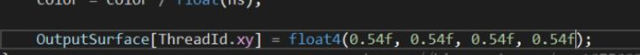

上面是我CS的原始输出数据

输出到BMP到磁盘后


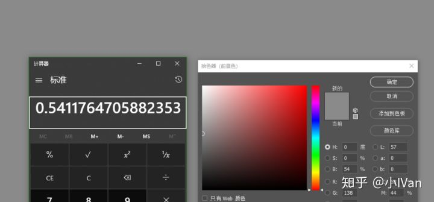

然后我再把它转换成tga格式


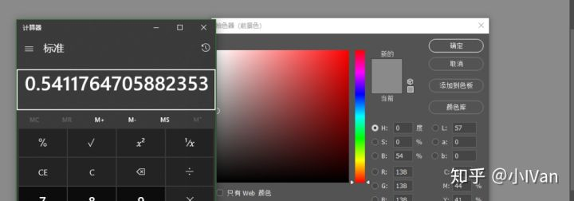

RGB三通道的值都还是正确的，然而alpha的值却出现了错误


------

## **【7】将CS计算出的数据直接拷贝到RenderTarget中**

当CS完成了计算，如何将CS的计算结果拿出来用呢。下面就开始做一个测试

先建一个RT格式大小要和CS的UAV大小格式保持一致


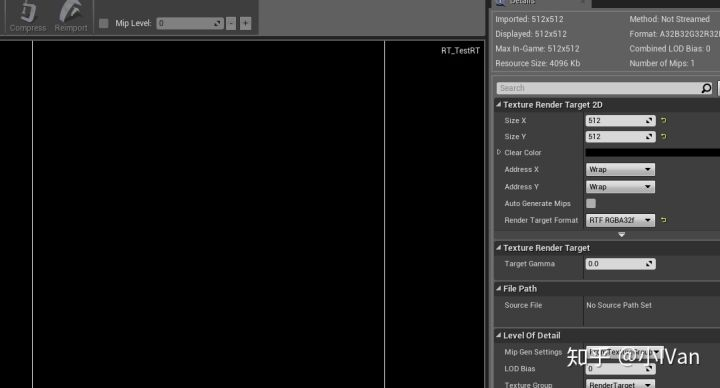

然后把CS计算好的UAV的数据直接拷贝到RT中


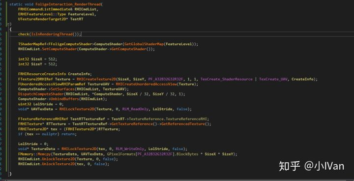

4.20加入了一个新的接口帮我们写了很多代码，可以直接用CopyTexture 


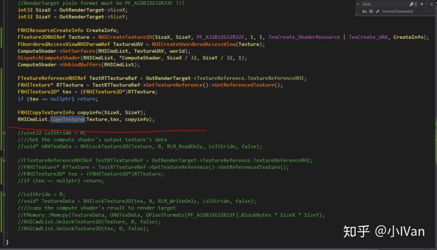

拷贝之后：


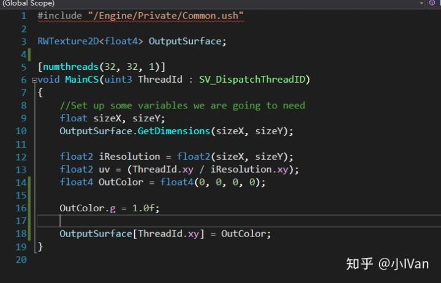


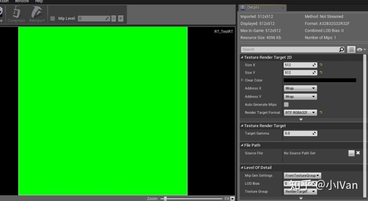

在渲染线程做这些操作是非常轻松的。这样我们就能把CS的数据拿出来用了。需要注意的是，这些操作都要建立在像素数据类型，贴图尺寸大小必须完全对上的基础上才行的。那么问题来了，如果我的RT大小就是和ComputeShader的UAV大小不一致格式也不一致怎么办呢，当然方法是有了，我们可以把CS计算的结果当成一个Texture资源在传到绘制管线中，调用Draw把UAV画到一个新的RT上，不过这样感觉没必要了。

顺带这里说一个bug，如果在我们的shader里没写序列化的话会出现一些奇怪的无报错的bug。


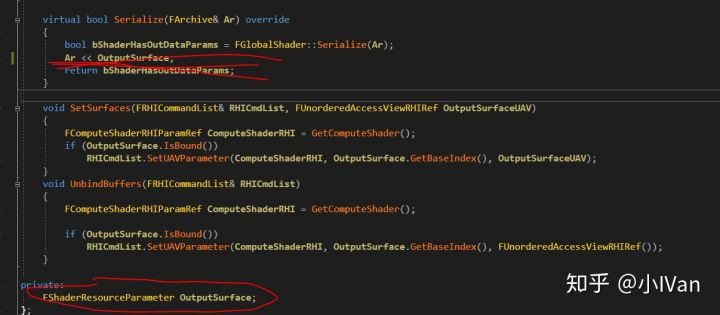

例如我上面代码的OutputSurface没有在Serialize中序列化，则会出现“第一次编译shader开引擎，能正常写入数据，等你第二次开引擎再向写入的时候会发现写入失败，RT中写入了一些异常值”。所以shader这里的序列化务必记得校对一下shader的变量是否都序列化了。

------

从此以后在虚幻中把贴图数据读取，把数组写入贴图，把贴图写到磁盘等一系列流程就完成啦！还有一部分资源操作相关的讲解我放到了工具篇里

YivanLee：虚幻4渲染编程（工具篇）【第八卷：Asset  creation】

zhuanlan.zhihu.com

Enjoy it ！
