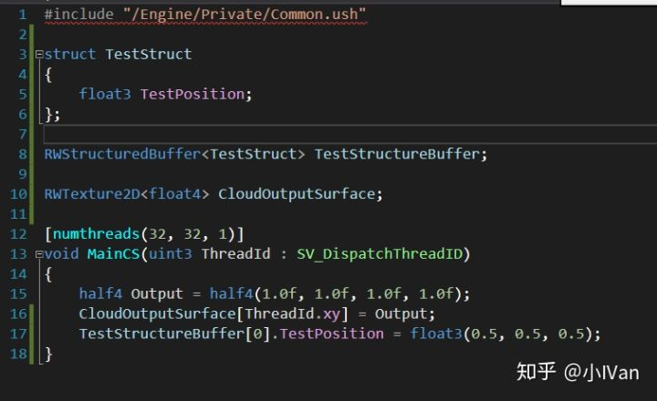
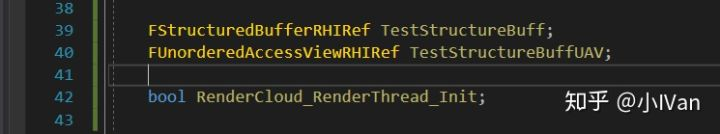
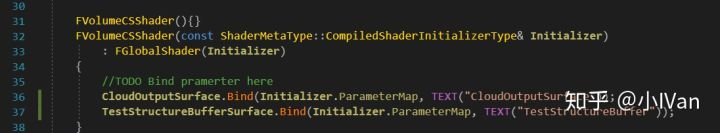
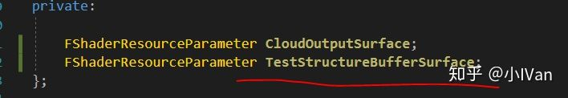
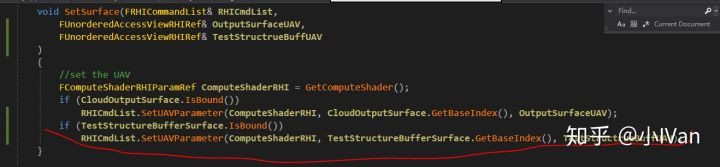
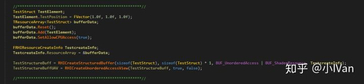
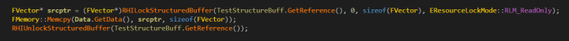
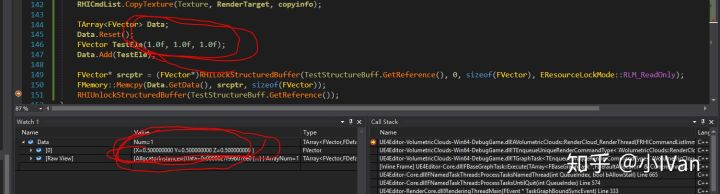

# 虚幻4渲染编程(Shader篇)【第十一卷：StructureBuffer】


## **简介：**

Compute  Shader非常适合做大量并行的数学计算，这也为我们能够做GPU模拟提供了有力的支持（如果你不想写CUDA什么的话）。在前面的文章中有介绍Unreal  Engine 4 的Compute Shader 的使用方法，本篇相当于是第八卷的补充，给Compute  shader增加StructureBuffer

第八卷链接：[Compute Shader in unreal engine 4](https://zhuanlan.zhihu.com/p/36697483)

------

首先在第八卷的基础上，在ComputeShader中声明一个StructureBuffer，我这里给它RW前缀表示它可读写。然后我直接给它的第一个元素赋值。




然后在C++代码中声明StructureBuffer的ref和对应的UAV，还有Structure




然后在ComputeShader中绑定对应的ShaderPramerter










这样就把从SetSurface传进来的StructureBuffer的UAV绑定到shader里了。但是这里我们还没创建StructureBuffer和UAV，我们在渲染线程中创建他们




在Dispatch之后通过Memcpy把计算结果从buffer中拷贝到内存里




最后我们可以得到如下结果：




我们的数据被ComputeShader计算啦！

完整代码如下：

**USF**

```text
#include "/Engine/Private/Common.ush"

struct TestStruct
{
    float3 TestPosition;
};

RWStructuredBuffer<TestStruct> TestStructureBuffer;

RWTexture2D<float4> CloudOutputSurface;

[numthreads(32, 32, 1)]
void MainCS(uint3 ThreadId : SV_DispatchThreadID)
{
    half4 Output = half4(1.0f, 1.0f, 1.0f, 1.0f);
    CloudOutputSurface[ThreadId.xy] = Output;
    TestStructureBuffer[0].TestPosition = float3(0.5, 0.5, 0.5);
}
```

**H**

```text
#pragma once

#include "CoreMinimal.h"
#include "UObject/ObjectMacros.h"
#include "Runtime/Engine/Classes/GameFramework/Actor.h"
#include "VolumeCloudSky.generated.h"

struct TestStruct
{
	FVector TestPosition;
};

UCLASS()
class VOLUMETRICCLOUDS_API AVolumetricClouds : public AActor
{
	GENERATED_BODY()

public:

	AVolumetricClouds(){}

	UFUNCTION(BlueprintCallable, Category = "VolumeCloud")
	void RenderCloud(UTextureRenderTarget2D* RenderTarget);

private:

	void RenderCloud_RenderThread(
		FRHICommandListImmediate& RHICmdList,
		ERHIFeatureLevel::Type FeatureLevel,
		FRHITexture* RenderTarget,
		int32 SizeX,
		int32 SizeY
	);
	
	FTexture2DRHIRef Texture;
	FUnorderedAccessViewRHIRef TextureUAV;

	FStructuredBufferRHIRef TestStructureBuff;
	FUnorderedAccessViewRHIRef TestStructureBuffUAV;

	bool RenderCloud_RenderThread_Init;

};
```

**CPP**

```text
#include "VolumeCloudSky.h"

#include "Classes/Engine/TextureRenderTarget2D.h"
#include "Classes/Engine/World.h"
#include "Public/GlobalShader.h"
#include "Public/PipelineStateCache.h"
#include "Public/RHIStaticStates.h"
#include "Public/SceneUtils.h"
#include "Public/SceneInterface.h"
#include "Public/ShaderParameterUtils.h"
#include "Public/Logging/MessageLog.h"
#include "Public/Internationalization/Internationalization.h"
#include "Public/StaticBoundShaderState.h"

#include "CoreUObject.h"
#include "Engine.h"

#include "RHICommandList.h"
#include "UniformBuffer.h"

#define LOCTEXT_NAMESPACE "SDHVolumeCloudSky"

class FVolumeCSShader : public FGlobalShader
{

	DECLARE_SHADER_TYPE(FVolumeCSShader, Global)

public:

	FVolumeCSShader(){}
	FVolumeCSShader(const ShaderMetaType::CompiledShaderInitializerType& Initializer)
		: FGlobalShader(Initializer)
	{
		//TODO Bind pramerter here
		CloudOutputSurface.Bind(Initializer.ParameterMap, TEXT("CloudOutputSurface"));
		TestStructureBufferSurface.Bind(Initializer.ParameterMap, TEXT("TestStructureBuffer"));
	}
	//----------------------------------------------------//
	static bool ShouldCache(EShaderPlatform PlateForm)
	{
		return IsFeatureLevelSupported(PlateForm, ERHIFeatureLevel::SM5);
	}
	//----------------------------------------------------//
	static bool ShouldCompilePermutation(const FGlobalShaderPermutationParameters& Parameters)
	{
		return IsFeatureLevelSupported(Parameters.Platform, ERHIFeatureLevel::SM5);
	}
	//----------------------------------------------------//
	static void ModifyCompilationEnvironment(const FGlobalShaderPermutationParameters& Parameters, FShaderCompilerEnvironment& OutEnvironment)
	{
		FGlobalShader::ModifyCompilationEnvironment(Parameters, OutEnvironment);
		//Define micro here
		//OutEnvironment.SetDefine(TEXT("TEST_MICRO"), 1);
	}
	//----------------------------------------------------//

	void SetSurface(FRHICommandList& RHICmdList,
		FUnorderedAccessViewRHIRef& OutputSurfaceUAV,
		FUnorderedAccessViewRHIRef& TestStructrueBuffUAV
	)
	{
		//set the UAV
		FComputeShaderRHIParamRef ComputeShaderRHI = GetComputeShader();
		if (CloudOutputSurface.IsBound())
			RHICmdList.SetUAVParameter(ComputeShaderRHI, CloudOutputSurface.GetBaseIndex(), OutputSurfaceUAV);
		if (TestStructureBufferSurface.IsBound())
			RHICmdList.SetUAVParameter(ComputeShaderRHI, TestStructureBufferSurface.GetBaseIndex(), TestStructrueBuffUAV);
	}

	void UnBindBuffers(FRHICommandList& RHICmdList)
	{
		FComputeShaderRHIParamRef ComputeShaderRHI = GetComputeShader();

		if (CloudOutputSurface.IsBound())
			RHICmdList.SetUAVParameter(ComputeShaderRHI, CloudOutputSurface.GetBaseIndex(), FUnorderedAccessViewRHIRef());
		if (TestStructureBufferSurface.IsBound())
			RHICmdList.SetUAVParameter(ComputeShaderRHI, TestStructureBufferSurface.GetBaseIndex(), FUnorderedAccessViewRHIRef());
	}

	virtual bool Serialize(FArchive& Ar) override
	{
		bool bShaderHasOutdatedParameters = FGlobalShader::Serialize(Ar);
		//Serrilize something here
		Ar << CloudOutputSurface << TestStructureBufferSurface;
		return bShaderHasOutdatedParameters;
	}

private:

	FShaderResourceParameter CloudOutputSurface;
	FShaderResourceParameter TestStructureBufferSurface;
};

IMPLEMENT_SHADER_TYPE(, FVolumeCSShader, TEXT("/Plugin/VolumetricClouds/Private/VolumeCloudSky.usf"), TEXT("MainCS"), SF_Compute)

void AVolumetricClouds::RenderCloud_RenderThread(
	FRHICommandListImmediate& RHICmdList,
	ERHIFeatureLevel::Type FeatureLevel,
	FRHITexture* RenderTarget,
	int32 SizeX,
	int32 SizeY
)
{
	check(IsInRenderingThread());
	check(RenderTarget != nullptr);

	TShaderMapRef<FVolumeCSShader>VolumetricCloudComputeShader(GetGlobalShaderMap(FeatureLevel));
	RHICmdList.SetComputeShader(VolumetricCloudComputeShader->GetComputeShader());

	//Init
	if (RenderCloud_RenderThread_Init == false || Texture.IsValid() == false || TextureUAV.IsValid() == false)
	{
		FRHIResourceCreateInfo CreateInfo;
		Texture = RHICreateTexture2D(SizeX, SizeY, PF_FloatRGBA, 1, 1, TexCreate_ShaderResource | TexCreate_UAV, CreateInfo);
		TextureUAV = RHICreateUnorderedAccessView(Texture);

		//*******************************************************//
		TestStruct TestElement;
		TestElement.TestPosition = FVector(1.0f, 1.0f, 1.0f);
		TResourceArray<TestStruct> bufferData;
		bufferData.Reset();
		bufferData.Add(TestElement);
		bufferData.SetAllowCPUAccess(true);

		FRHIResourceCreateInfo TestcreateInfo;
		TestcreateInfo.ResourceArray = &bufferData;

		TestStructureBuff = RHICreateStructuredBuffer(sizeof(TestStruct), sizeof(TestStruct) * 1, BUF_UnorderedAccess | BUF_ShaderResource, TestcreateInfo);
		TestStructureBuffUAV = RHICreateUnorderedAccessView(TestStructureBuff, true, false);

		//*******************************************************//
		
		RenderCloud_RenderThread_Init = true;
	}

	VolumetricCloudComputeShader->SetSurface(RHICmdList, TextureUAV, TestStructureBuffUAV);
	DispatchComputeShader(RHICmdList, *VolumetricCloudComputeShader, SizeX / 32, SizeY / 32, 1);
	VolumetricCloudComputeShader->UnBindBuffers(RHICmdList);

	FRHICopyTextureInfo copyinfo(SizeX, SizeY);
	RHICmdList.CopyTexture(Texture, RenderTarget, copyinfo);

	TArray<FVector> Data;
	Data.Reset();
	FVector TestEle(1.0f, 1.0f, 1.0f);
	Data.Add(TestEle);

	FVector* srcptr = (FVector*)RHILockStructuredBuffer(TestStructureBuff.GetReference(), 0, sizeof(FVector), EResourceLockMode::RLM_ReadOnly);
	FMemory::Memcpy(Data.GetData(), srcptr, sizeof(FVector));
	RHIUnlockStructuredBuffer(TestStructureBuff.GetReference());
}

void AVolumetricClouds::RenderCloud(UTextureRenderTarget2D* RenderTarget)
{
	UWorld* world = GetWorld();
	ERHIFeatureLevel::Type FeatureLevel = world->Scene->GetFeatureLevel();
	checkf(FeatureLevel == ERHIFeatureLevel::SM5, TEXT("Only surpport SM5"));

	FTextureReferenceRHIRef RenderTargetTextureRHI = RenderTarget->TextureReference.TextureReferenceRHI;
	checkf(RenderTargetTextureRHI != nullptr, TEXT("Can't get render target %d texture"));

	FRHITexture* RenderTargetTextureRef = RenderTargetTextureRHI->GetTextureReference()->GetReferencedTexture();
	int32 SizeX = RenderTarget->SizeX;
	int32 SizeY = RenderTarget->SizeY;

	ENQUEUE_RENDER_COMMAND(VolumeCloudsRenderCommand)
	(
		[FeatureLevel, RenderTargetTextureRef, SizeX, SizeY, this](FRHICommandListImmediate& RHICmdList)
		{
			RenderCloud_RenderThread
			(
				RHICmdList,
				FeatureLevel,
				RenderTargetTextureRef,
				SizeX,
				SizeY
			);
		}
	);
}

#undef LOCTEXT_NAMESPACE
```


Enjoy it ！
