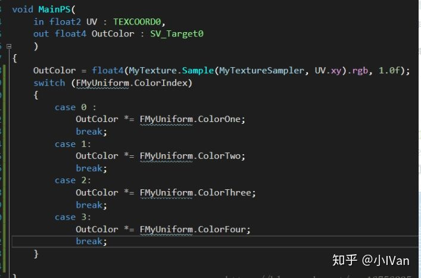
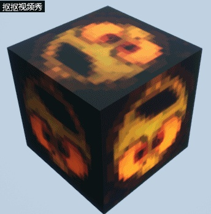
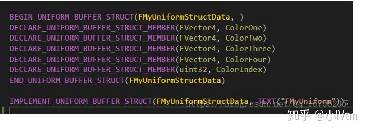
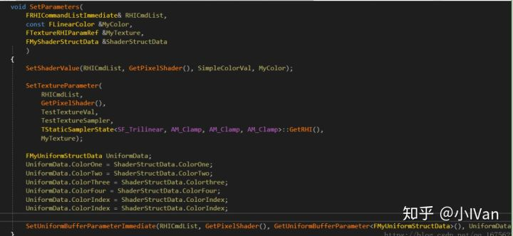
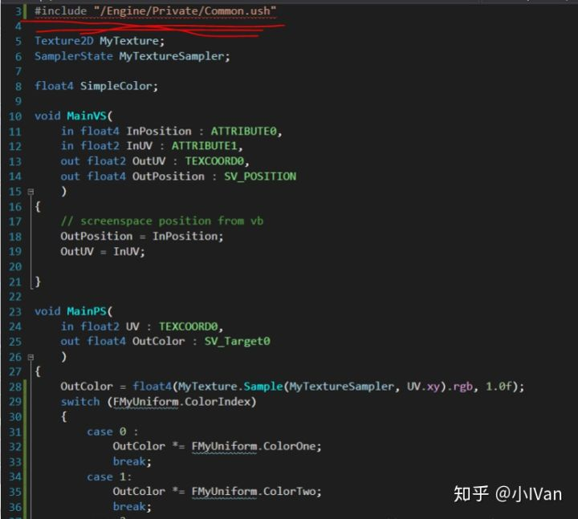
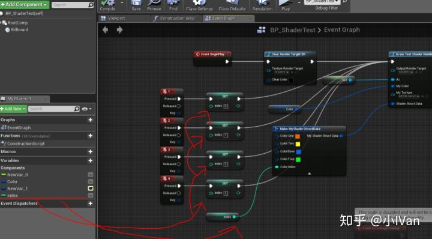
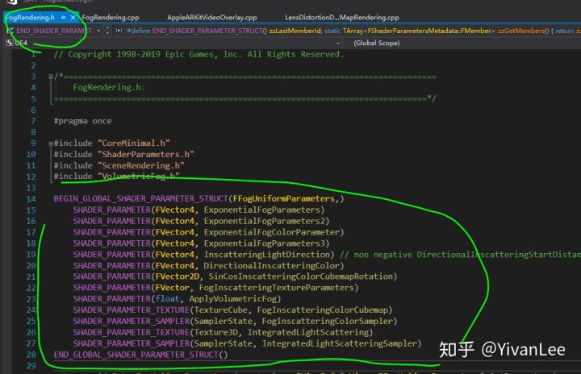
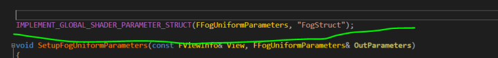

# 虚幻4渲染编程(Shader篇)【第五卷：虚幻4 高级数据传输UniformBuffer】.


前面介绍了一般数据的传输方式，这一卷我们将一起来使用更高级的数据传输方式UniformBuffer。这个问题困扰了我两天，查了很多资料，翻了很多论坛也没找到解决办法。这里要特别感谢一位QQ昵称是“August”的朋友的指点帮助。

先看下效果吧







<svg x="16" y="18.5" class="GifPlayer-icon"></svg>

可以看到这次是使用一个UniformBuffer在控制整个颜色的变换了。虽然效果很简单，但是最重要的其实是如何上传UniformBuffer。

​     关于UE4的Uniform  buffer(CPU写，GPU只读)，在D3D里相当于constbuffer，在OpenGL里相当于uniformbuffer，而UE4的Uniform  buffer比较特殊的是: 在usf并没有采用hlsl的const  buffer语法去定义uniformbuffer，从一些资料得知，可能的原因是为了统一和跨平台。如OpenGL的阉割版OpenGL es  2.0不支持uniformbuffer相关的语法。也就是说，UE4的Uniform  buffer是epic自己封装，在某些平台上，是用模拟的方式达到uniformbuffer的功能，在usf里没有直接的uniformbuffer定义语法，这方面是UE的shader编译器动态生成相关的定义代码。Uniform  buffer在c++用以下几个宏实现：

BEGIN_UNIFORM_BUFFER_STRUCT

DECLARE_UNIFORM_BUFFER_STRUCT_MEMBER

END_UNIFORM_BUFFER_STRUCT

IMPLEMENT_UNIFORM_BUFFER_STRUCT

在代码里是这样的（如下图所示）(注意那个逗号)：




这样就声明了一个uniformbuffer。这几个宏回帮我们在渲染线程实现一些类的声明和渲染资源的准备。下面就是我们需要在c++层来设置这个uniformbuffer了，既然需要设置，那么我们就在c++层声明一个结构体用来设置这个uniformbuffer


再用SetUniformBufferParameterImmediatehan函数设置一下：




这样便完成了c++层的uniformbuffer的数据传输。

这里需要值得注意的是我们HLSL代码可以直接使用这个uniformbuffer，虚幻4会自动给我们生成一个uniformbuffer的HLSL代码然后给我们include到Common.usf里面，所以shader代码必须包含Common.ush。




我们再来捋一下思路。首先我们用虚幻的那几个宏，声明并准备一个UniformBuffer。这个UniformBuffer并不需要在HLSL文件里声明对应的变量。因为虚幻考虑到优化和跨平台，所以会帮我们封装然后生成这个UniformBuffer的HLSL代码，我们在shader里直接调用即可。但是虚幻生成的这些HLSL代码是被Common.usf包含的，所以我们需要在我们自己的shader文件里包含Common.ush才行，如果不做这一步会导致HLSL编译失败。我们在c++层声明了一个和Uniform数据结构类似的结构体用于c++层向渲染层传数据。再用SetUniformBufferParameterImmediatehan设置buffer的值。


下面是完整代码：

MyShaderTest.h

```cpp
#pragma once  
  
#include "CoreMinimal.h"  
#include "UObject/ObjectMacros.h"  
#include "Classes/Kismet/BlueprintFunctionLibrary.h"  
#include "MyShaderTest.generated.h"  
  
USTRUCT(BlueprintType)  
struct FMyShaderStructData  
{  
    GENERATED_USTRUCT_BODY()  
  
    UPROPERTY(BlueprintReadWrite, VisibleAnywhere, Category = ShaderData)  
    FLinearColor ColorOne;  
    UPROPERTY(BlueprintReadWrite, VisibleAnywhere, Category = ShaderData)  
    FLinearColor ColorTwo;  
    UPROPERTY(BlueprintReadWrite, VisibleAnywhere, Category = ShaderData)  
    FLinearColor Colorthree;  
    UPROPERTY(BlueprintReadWrite, VisibleAnywhere, Category = ShaderData)  
    FLinearColor ColorFour;  
    UPROPERTY(BlueprintReadWrite, VisibleAnywhere, Category = ShaderData)  
    int32 ColorIndex;  
};  
  
UCLASS(MinimalAPI,meta = (ScriptName = "TestShaderLibary"))  
class UTestShaderBlueprintLibrary : public UBlueprintFunctionLibrary  
{  
    GENERATED_UCLASS_BODY()  
  
    UFUNCTION(BlueprintCallable, Category = "ShaderTestPlugin", meta = (WorldContext = "WorldContextObject"))  
    static void DrawTestShaderRenderTarget(  
        class UTextureRenderTarget2D* OutputRenderTarget,   
        AActor* Ac,   
        FLinearColor MyColor,   
        UTexture* MyTexture,   
        FMyShaderStructData ShaderStructData  
    );  
};  
```

MyShader.cpp

```text
// Copyright 1998-2018 Epic Games, Inc. All Rights Reserved.  
  
#include "MyShaderTest.h"  
  
#include "Classes/Engine/TextureRenderTarget2D.h"  
#include "Classes/Engine/World.h"  
#include "Public/GlobalShader.h"  
#include "Public/PipelineStateCache.h"  
#include "Public/RHIStaticStates.h"  
#include "Public/SceneUtils.h"  
#include "Public/SceneInterface.h"  
#include "Public/ShaderParameterUtils.h"  
#include "Public/Logging/MessageLog.h"  
#include "Public/Internationalization/Internationalization.h"  
#include "Public/StaticBoundShaderState.h"  
  
#include "RHICommandList.h"  
#include "UniformBuffer.h"  
  
#define LOCTEXT_NAMESPACE "TestShader"  
  
BEGIN_UNIFORM_BUFFER_STRUCT(FMyUniformStructData, )  
DECLARE_UNIFORM_BUFFER_STRUCT_MEMBER(FVector4, ColorOne)  
DECLARE_UNIFORM_BUFFER_STRUCT_MEMBER(FVector4, ColorTwo)  
DECLARE_UNIFORM_BUFFER_STRUCT_MEMBER(FVector4, ColorThree)  
DECLARE_UNIFORM_BUFFER_STRUCT_MEMBER(FVector4, ColorFour)  
DECLARE_UNIFORM_BUFFER_STRUCT_MEMBER(uint32, ColorIndex)  
END_UNIFORM_BUFFER_STRUCT(FMyUniformStructData)  
  
IMPLEMENT_UNIFORM_BUFFER_STRUCT(FMyUniformStructData, TEXT("FMyUniform"));  
  
//typedef TUniformBufferRef<MyStructData> MyStructDataRef;  
  
UTestShaderBlueprintLibrary::UTestShaderBlueprintLibrary(const FObjectInitializer& ObjectInitializer)  
    : Super(ObjectInitializer)  
{  
  
}  
  
class FMyShaderTest : public FGlobalShader  
{  
public:  
  
    FMyShaderTest(){}  
  
    FMyShaderTest(const ShaderMetaType::CompiledShaderInitializerType& Initializer)  
        : FGlobalShader(Initializer)  
    {  
        SimpleColorVal.Bind(Initializer.ParameterMap, TEXT("SimpleColor"));  
        TestTextureVal.Bind(Initializer.ParameterMap, TEXT("MyTexture"));  
        TestTextureSampler.Bind(Initializer.ParameterMap, TEXT("MyTextureSampler"));  
    }  
  
    static bool ShouldCache(EShaderPlatform Platform)  
    {  
        return true;  
    }  
  
    static bool ShouldCompilePermutation(const FGlobalShaderPermutationParameters& Parameters)  
    {  
        //return IsFeatureLevelSupported(Parameters.Platform, ERHIFeatureLevel::SM4);  
        return true;  
    }  
  
    static void ModifyCompilationEnvironment(const FGlobalShaderPermutationParameters& Parameters, FShaderCompilerEnvironment& OutEnvironment)  
    {  
        FGlobalShader::ModifyCompilationEnvironment(Parameters, OutEnvironment);  
        OutEnvironment.SetDefine(TEXT("TEST_MICRO"), 1);  
    }  
  
    void SetParameters(  
        FRHICommandListImmediate& RHICmdList,  
        const FLinearColor &MyColor,  
        FTextureRHIParamRef &MyTexture,  
        FMyShaderStructData &ShaderStructData  
        )  
    {  
        SetShaderValue(RHICmdList, GetPixelShader(), SimpleColorVal, MyColor);  
  
        SetTextureParameter(  
            RHICmdList,  
            GetPixelShader(),  
            TestTextureVal,  
            TestTextureSampler,  
            TStaticSamplerState<SF_Trilinear, AM_Clamp, AM_Clamp, AM_Clamp>::GetRHI(),  
            MyTexture);  
  
        FMyUniformStructData UniformData;  
        UniformData.ColorOne = ShaderStructData.ColorOne;  
        UniformData.ColorTwo = ShaderStructData.ColorTwo;  
        UniformData.ColorThree = ShaderStructData.Colorthree;  
        UniformData.ColorFour = ShaderStructData.ColorFour;  
        UniformData.ColorIndex = ShaderStructData.ColorIndex;  
        UniformData.ColorIndex = ShaderStructData.ColorIndex;  
  
        SetUniformBufferParameterImmediate(RHICmdList, GetPixelShader(), GetUniformBufferParameter<FMyUniformStructData>(), UniformData);  
    }  
  
    virtual bool Serialize(FArchive& Ar) override  
    {  
        bool bShaderHasOutdatedParameters = FGlobalShader::Serialize(Ar);  
        Ar << SimpleColorVal << TestTextureVal;  
        return bShaderHasOutdatedParameters;  
    }  
  
private:  
  
    FShaderParameter SimpleColorVal;  
  
    FShaderResourceParameter TestTextureVal;  
    FShaderResourceParameter TestTextureSampler;  
  
};  
  
class FShaderTestVS : public FMyShaderTest  
{  
    DECLARE_SHADER_TYPE(FShaderTestVS, Global);  
  
public:  
    FShaderTestVS(){}  
  
    FShaderTestVS(const ShaderMetaType::CompiledShaderInitializerType& Initializer)  
        : FMyShaderTest(Initializer)  
    {  
  
    }  
};  
  
  
class FShaderTestPS : public FMyShaderTest  
{  
    DECLARE_SHADER_TYPE(FShaderTestPS, Global);  
  
public:  
    FShaderTestPS() {}  
  
    FShaderTestPS(const ShaderMetaType::CompiledShaderInitializerType& Initializer)  
        : FMyShaderTest(Initializer)  
    {  
  
    }  
};  
  
  
IMPLEMENT_SHADER_TYPE(, FShaderTestVS, TEXT("/Plugin/ShadertestPlugin/Private/MyShader.usf"), TEXT("MainVS"), SF_Vertex)  
IMPLEMENT_SHADER_TYPE(, FShaderTestPS, TEXT("/Plugin/ShadertestPlugin/Private/MyShader.usf"), TEXT("MainPS"), SF_Pixel)  
  
struct FMyTextureVertex  
{  
    FVector4    Position;  
    FVector2D   UV;  
};  
  
class FMyTextureVertexDeclaration : public FRenderResource  
{  
public:  
    FVertexDeclarationRHIRef VertexDeclarationRHI;  
  
    virtual void InitRHI() override  
    {  
        FVertexDeclarationElementList Elements;  
        uint32 Stride = sizeof(FMyTextureVertex);  
        Elements.Add(FVertexElement(0, STRUCT_OFFSET(FMyTextureVertex, Position), VET_Float4, 0, Stride));  
        Elements.Add(FVertexElement(0, STRUCT_OFFSET(FMyTextureVertex, UV), VET_Float2, 1, Stride));  
        VertexDeclarationRHI = RHICreateVertexDeclaration(Elements);  
    }  
  
    virtual void ReleaseRHI() override  
    {  
        VertexDeclarationRHI->Release();  
    }  
};  
  
static void DrawTestShaderRenderTarget_RenderThread(  
    FRHICommandListImmediate& RHICmdList,   
    FTextureRenderTargetResource* OutputRenderTargetResource,  
    ERHIFeatureLevel::Type FeatureLevel,  
    FName TextureRenderTargetName,  
    FLinearColor MyColor,  
    FTextureRHIParamRef MyTexture,  
    FMyShaderStructData ShaderStructData  
)  
{  
    check(IsInRenderingThread());  
  
#if WANTS_DRAW_MESH_EVENTS  
    FString EventName;  
    TextureRenderTargetName.ToString(EventName);  
    SCOPED_DRAW_EVENTF(RHICmdList, SceneCapture, TEXT("ShaderTest %s"), *EventName);  
#else  
    SCOPED_DRAW_EVENT(RHICmdList, DrawUVDisplacementToRenderTarget_RenderThread);  
#endif  
  
    //设置渲染目标  
    SetRenderTarget(  
        RHICmdList,  
        OutputRenderTargetResource->GetRenderTargetTexture(),  
        FTextureRHIRef(),  
        ESimpleRenderTargetMode::EUninitializedColorAndDepth,  
        FExclusiveDepthStencil::DepthNop_StencilNop  
    );  
  
    //设置视口  
    //FIntPoint DrawTargetResolution(OutputRenderTargetResource->GetSizeX(), OutputRenderTargetResource->GetSizeY());  
    //RHICmdList.SetViewport(0, 0, 0.0f, DrawTargetResolution.X, DrawTargetResolution.Y, 1.0f);  
  
    TShaderMap<FGlobalShaderType>* GlobalShaderMap = GetGlobalShaderMap(FeatureLevel);  
    TShaderMapRef<FShaderTestVS> VertexShader(GlobalShaderMap);  
    TShaderMapRef<FShaderTestPS> PixelShader(GlobalShaderMap);  
  
    FMyTextureVertexDeclaration VertexDec;  
    VertexDec.InitRHI();  
  
    // Set the graphic pipeline state.  
    FGraphicsPipelineStateInitializer GraphicsPSOInit;  
    RHICmdList.ApplyCachedRenderTargets(GraphicsPSOInit);  
    GraphicsPSOInit.DepthStencilState = TStaticDepthStencilState<false, CF_Always>::GetRHI();  
    GraphicsPSOInit.BlendState = TStaticBlendState<>::GetRHI();  
    GraphicsPSOInit.RasterizerState = TStaticRasterizerState<>::GetRHI();  
    GraphicsPSOInit.PrimitiveType = PT_TriangleList;  
    GraphicsPSOInit.BoundShaderState.VertexDeclarationRHI = VertexDec.VertexDeclarationRHI;  
    GraphicsPSOInit.BoundShaderState.VertexShaderRHI = GETSAFERHISHADER_VERTEX(*VertexShader);  
    GraphicsPSOInit.BoundShaderState.PixelShaderRHI = GETSAFERHISHADER_PIXEL(*PixelShader);  
    SetGraphicsPipelineState(RHICmdList, GraphicsPSOInit);  
  
    //RHICmdList.SetViewport(0, 0, 0.0f, DrawTargetResolution.X, DrawTargetResolution.Y, 1.0f);  
    PixelShader->SetParameters(RHICmdList, MyColor, MyTexture, ShaderStructData);  
  
    // Draw grid.  
    //uint32 PrimitiveCount = 2;  
    //RHICmdList.DrawPrimitive(PT_TriangleList, 0, PrimitiveCount, 1);  
    FMyTextureVertex Vertices[4];  
    Vertices[0].Position.Set(-1.0f, 1.0f, 0, 1.0f);  
    Vertices[1].Position.Set(1.0f, 1.0f, 0, 1.0f);  
    Vertices[2].Position.Set(-1.0f, -1.0f, 0, 1.0f);  
    Vertices[3].Position.Set(1.0f, -1.0f, 0, 1.0f);  
    Vertices[0].UV = FVector2D(0.0f, 1.0f);  
    Vertices[1].UV = FVector2D(1.0f, 1.0f);  
    Vertices[2].UV = FVector2D(0.0f, 0.0f);  
    Vertices[3].UV = FVector2D(1.0f, 0.0f);  
  
    static const uint16 Indices[6] =  
    {  
        0, 1, 2,  
        2, 1, 3  
    };  
    //DrawPrimitiveUP(RHICmdList, PT_TriangleStrip, 2, Vertices, sizeof(Vertices[0]));  
    DrawIndexedPrimitiveUP(  
        RHICmdList,  
        PT_TriangleList,  
        0,  
        ARRAY_COUNT(Vertices),  
        2,  
        Indices,  
        sizeof(Indices[0]),  
        Vertices,  
        sizeof(Vertices[0])  
    );  
  
    // Resolve render target.  
    RHICmdList.CopyToResolveTarget(  
        OutputRenderTargetResource->GetRenderTargetTexture(),  
        OutputRenderTargetResource->TextureRHI,  
        false, FResolveParams());  
}  
  
void UTestShaderBlueprintLibrary::DrawTestShaderRenderTarget(  
    UTextureRenderTarget2D* OutputRenderTarget,   
    AActor* Ac,  
    FLinearColor MyColor,  
    UTexture* MyTexture,  
    FMyShaderStructData ShaderStructData  
)  
{  
    check(IsInGameThread());  
  
    if (!OutputRenderTarget)  
    {  
        return;  
    }  
      
    FTextureRenderTargetResource* TextureRenderTargetResource = OutputRenderTarget->GameThread_GetRenderTargetResource();  
    FTextureRHIParamRef MyTextureRHI = MyTexture->TextureReference.TextureReferenceRHI;  
    UWorld* World = Ac->GetWorld();  
    ERHIFeatureLevel::Type FeatureLevel = World->Scene->GetFeatureLevel();  
    FName TextureRenderTargetName = OutputRenderTarget->GetFName();  
    ENQUEUE_RENDER_COMMAND(CaptureCommand)(  
        [TextureRenderTargetResource, FeatureLevel, MyColor, TextureRenderTargetName, MyTextureRHI,ShaderStructData](FRHICommandListImmediate& RHICmdList)  
        {  
            DrawTestShaderRenderTarget_RenderThread  
            (  
                RHICmdList,  
                TextureRenderTargetResource,   
                FeatureLevel,   
                TextureRenderTargetName,   
                MyColor,   
                MyTextureRHI,   
                ShaderStructData  
            );  
        }  
    );  
}  
  
#undef LOCTEXT_NAMESPACE  
```

MyShader.usf

```text
#include "/Engine/Public/Platform.ush"  
#include "/Engine/Private/Common.ush"  
  
Texture2D MyTexture;  
SamplerState MyTextureSampler;  
  
float4 SimpleColor;  
  
void MainVS(  
    in float4 InPosition : ATTRIBUTE0,  
    in float2 InUV : ATTRIBUTE1,  
    out float2 OutUV : TEXCOORD0,  
    out float4 OutPosition : SV_POSITION  
    )  
{  
    // screenspace position from vb  
    OutPosition = InPosition;  
    OutUV = InUV;  
  
}  
  
void MainPS(  
    in float2 UV : TEXCOORD0,  
    out float4 OutColor : SV_Target0  
    )  
{  
    OutColor = float4(MyTexture.Sample(MyTextureSampler, UV.xy).rgb, 1.0f);  
    switch (FMyUniform.ColorIndex)  
    {  
        case 0 :  
            OutColor *= FMyUniform.ColorOne;  
            break;  
        case 1:  
            OutColor *= FMyUniform.ColorTwo;  
            break;  
        case 2:  
            OutColor *= FMyUniform.ColorThree;  
            break;  
        case 3:  
            OutColor *= FMyUniform.ColorFour;  
            break;  
    }  
      
}  
```

蓝图脚本




至此就完成了c++层和shader层的数据传输。

------

UniformBuffer的声明方法每个引擎的版本都在变，其实如果发现声明方法变了我们可以去看引擎自己是怎么写的就好了。4.22的声明方法如下：







Enjoy it
