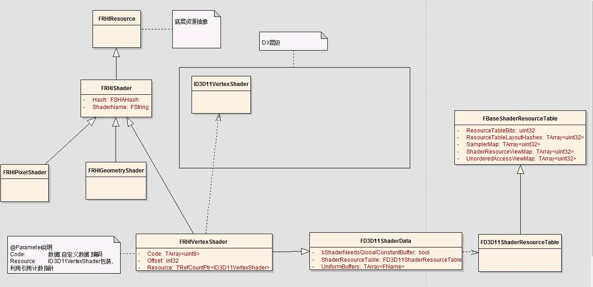
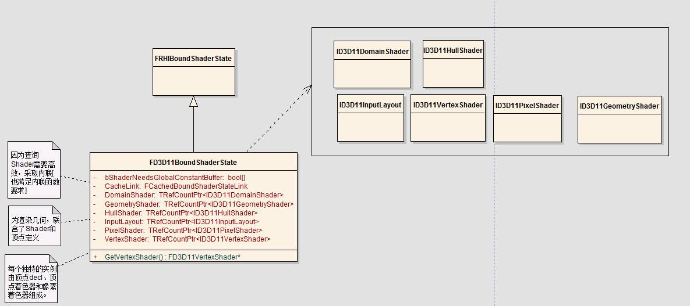
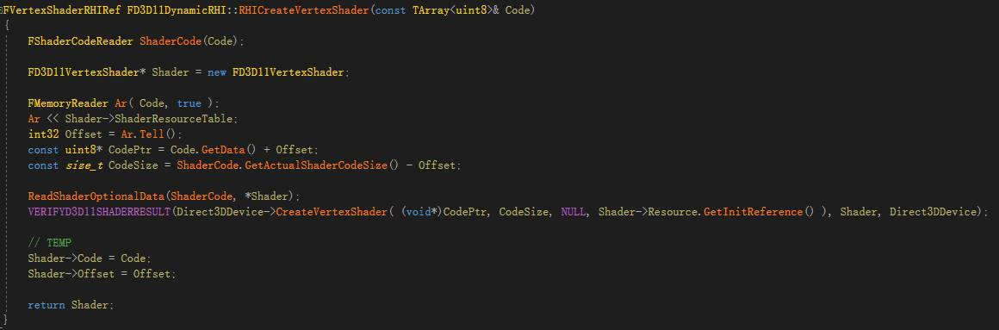
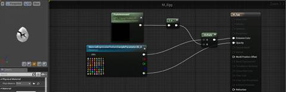

**(****原****)****Unreal Shader****模块(一):  着色创建**

2018年10月6日

15:11

# 一、着色加载

这里说的Shader是编译后的文件或内存

 

## 源码说明

**----------------------------------------------------------------------------------------------------------------------**

| D3D11Shaders.cpp | RHI层级 | 封装DX，调用相关指令创建相关着色器，并且绑定布局(顶点布局) |
| ---------------- | ------- | ---------------------------------------------------------- |
|                  |         |                                                            |
|                  |         |                                                            |
|                  |         |                                                            |
|                  |         |                                                            |

 

下文均用DX说明

| 源码 | ：Engine\Source\Runtime\ShaderCore\   ：Engine\Source\Runtime\Windows\   ：Engine\Source\Runtime\Renderer\(只是上级) |
| ---- | ------------------------------------------------------------ |
|      |                                                              |

 

 **调用堆栈**

 

这里比较重要的是：

RenderModule,,,

DeferredShadingSceneRender,,,

ShaderRources,,,

DrawingPolicy(此设计方法值得学习)

 

**相关类图**

**1****、基础**

 

 

**2****、纹理**

**。。。。（待）**

 

**顶点着色器**

 

**娓娓道来：**

**大体上需要三个步骤**

**1****、创建和初始化****Shader****Reader**

**2****、创建个新的顶点着色，数据格式**

**3****、shader数据选项赋予**

ReadShaderOptionalData

 

 

 

 

 

 

 

 

**----------------------------------------------------------------------------------------------------------------------**

**----------------------------------------------------------------------------------------------------------------------**

 

 

 

 

 

## DXAPI 回顾

**----------------------------------------------------------------------------------------------------------------------**

**创建Shader**

HRESULT ID3D11Device::CreateVertexShader

( 

| const void *          | pShaderBytecode, | // [In]着色器字节码    |
| --------------------- | ---------------- | ---------------------- |
| SIZE_T                | BytecodeLength,  | // [In]字节码长度      |
| ID3D11ClassLinkage *  | pClassLinkage,   | // [In_Opt]忽略        |
| ID3D11VertexShader ** | ppVertexShader   | // [Out]获取顶点着色器 |

);

类似的有

| **方法**                           | **着色器**           | **类型描述** |
| ---------------------------------- | -------------------- | ------------ |
| ID3D11Device::CreateVertexShader   | ID3D11VertexShader   | 顶点着色器   |
| ID3D11Device::CreateHullShader     | ID3D11HullShader     | 外壳着色器   |
| ID3D11Device::CreateDomainShader   | ID3D11DomainShader   | 域着色器     |
| ID3D11Device::CreateComputeShader  | ID3D11ComputeShader  | 计算着色器   |
| ID3D11Device::CreateGeometryShader | ID3D11GeometryShader | 几何着色器   |
| ID3D11Device::CreatePixelShader    | ID3D11PixelShader    | 像素着色器   |

 

 

顶点**输入布局**：

HRESULT ID3D11Device::CreateInputLayout

( 

| const D3D11_INPUT_ELEMENT_DESC   * | pInputElementDescs                | // [In]输入布局描述         |
| ---------------------------------- | --------------------------------- | --------------------------- |
| UINT                               | NumElements                       | // [In]上述数组元素个数     |
| const void *                       | pShaderBytecodeWithInputSignature | // [In]顶点着色器字节码     |
| SIZE_T                             | BytecodeLength                    | // [In]顶点着色器字节码长度 |
| ID3D11InputLayout **               | ppInputLayout);                   | // [Out]获取的输入布局      |

);

 

 typedef struct D3D11_INPUT_ELEMENT_DESC

 { 

| LPCSTR                     | SemanticName;         | // 语义名               |
| -------------------------- | --------------------- | ----------------------- |
| UINT                       | SemanticIndex;        | // 语义索引             |
| DXGI_FORMAT                | Format;               | // 数据格式             |
| UINT                       | InputSlot;            | // 输入槽索引(0-15)     |
| UINT                       | AlignedByteOffset;    | // 初始位置(字节偏移量) |
| D3D11_INPUT_CLASSIFICATION | InputSlotClass;       | // 输入类型             |
| UINT                       | InstanceDataStepRate; | // 忽略                 |

}

说明：

1、语义名要与HLSL结构体中的语义名相同，若有多个相同的语义名，则语义索引就是另外一种区分

2、DXGI_FORMAT在这里通常描述数据的存储方式、大小

3、初始位置则指的是该成员的位置与起始成员所在的字节偏移量

4、输入类型有两种：D3D11_INPUT_PER_VERTEX_DATA为按每个顶点数据输入，D3D11_INPUT_PER_INSTANCE_DATA则是按每个实例数据输入

 

HRESULT ID3D11Device::CreateInputLayout( 

| const   D3D11_INPUT_ELEMENT_DESC * | pInputElementDescs,                | // [In]输入布局描述         |
| ---------------------------------- | ---------------------------------- | --------------------------- |
| UINT                               | NumElements,                       | // [In]上述数组元素个数     |
| const void *                       | pShaderBytecodeWithInputSignature, | // [In]顶点着色器字节码     |
| SIZE_T                             | BytecodeLength,                    | // [In]顶点着色器字节码长度 |
| ID3D11InputLayout **               | ppInputLayout                      | // [Out]获取的输入布局例如  |

); 

 

 

一个例子

 

   HLSL：   struct VertexIn    {    float3 pos : POSITION;    float4 color : COLOR;    };       C++结构：   struct   VertexPosColor   {    DirectX::XMFLOAT3 pos;    DirectX::XMFLOAT4 color;    static const D3D11_INPUT_ELEMENT_DESC inputLayout[2];   // Static不占struct   };       布局：   const   D3D11_INPUT_ELEMENT_DESC VertexPosColor::inputLayout[2] =    {    { "POSITION", 0, DXGI_FORMAT_R32G32B32_FLOAT,   0, 0, D3D11_INPUT_PER_VERTEX_DATA, 0 },    { "COLOR", 0, DXGI_FORMAT_R32G32B32A32_FLOAT,   0, 12, D3D11_INPUT_PER_VERTEX_DATA, 0}    };    

\-----------------------------------------------------------------------------------------------------------------------

 

 

**(****转****)****Unreal Shader****模块(四):  着色器编译**

2018年10月6日

15:16

本文为**(****转****)****：****Unreal** **调试着色器编译过程**

 

**调试着色器编译过程**

Rolando Caloca 在 April 19, 2016 | [学习](https://www.unrealengine.com/zh-CN/blog?category=%E5%AD%A6%E4%B9%A0)[编程 ](https://www.unrealengine.com/zh-CN/blog?category=%E7%BC%96%E7%A8%8B)

·         [Share on Facebook](http://www.facebook.com/sharer.php?u=) 

·         [Share on Twitter](http://twitter.com/share) 

·         [Share on Google+](https://plus.google.com/share?url=) 

·         [Share on LinkedIn](http://www.linkedin.com/shareArticle?mini=true&url=)

 

**启用 CVAR 以允许转储中间着色器**

在 ConsoleVariables.ini 文件（通常位于 Engine/Config/ConsoleVariables.ini）中，启用下列 Cvar：

 

**在调试时构建 SHADERCOMPILEWORKER**

默认情况下，UnrealBuildTool (UBT) 将为工具生成项目，以便始终在开发时进行编译。要在调试时构建项目，请将 ShaderCompileWorker 的解决方案属性（Visual Studio：生成 -> 配置管理器）更改为 Debug_Program：

 

**生成中间文件**

此刻，您想要生成可调试的文件；启用 Cvar 将允许后续编译转储所生成的文件；要强制重建所有着色器，请在Engine/Shaders/Common.usf 中添加一个空格或进行更改，然后重新运行编辑器。这将重新编译着色器并转储Project/Saved/ShaderDebugInfo 文件夹中的所有中间文件。

 

**转储的着色器的文件夹结构**

让我们分析转储的文件的完整路径：

D:\UE4\Samples\Games\TappyChicken\Saved\ShaderDebugInfo\PCD3D_SM5\M_Egg\LocalVF\BPPSFNoLMPolicy\BasePassPixelShader.usf

项目的根路径：

D:\UE4\Samples\Games\TappyChicken\Saved\ShaderDebugInfo\PCD3D_SM5\M_Egg\LocalVF\BPPSFNoLMPolicy\BasePassPixelShader.usf

转储着色器的根路径：

D:\UE4\Samples\Games\TappyChicken\Saved\ShaderDebugInfo\PCD3D_SM5\M_Egg\LocalVF\BPPSFNoLMPolicy\BasePassPixelShader.usf

现在，对于每种着色器格式/平台，您可找到一个子文件夹，在本例中，这是 PC D3D Shader Model 5：

D:\UE4\Samples\Games\TappyChicken\Saved\ShaderDebugInfo\PCD3D_SM5\M_Egg\LocalVF\BPPSFNoLMPolicy\BasePassPixelShader.usf

现在，对于每个材质名称都有一个对应的文件夹，并且有一个名为 Global 的特殊文件夹。在本例中，我们在 M_Egg 材质内：

D:\UE4\Samples\Games\TappyChicken\Saved\ShaderDebugInfo\PCD3D_SM5\M_Egg\LocalVF\BPPSFNoLMPolicy\BasePassPixelShader.usf

着色器分组在贴图内并按顶点工厂排序，而这些顶点工厂通常最终对应于网格/元件类型；在本例中，有一个“本地顶点工厂”：

D:\UE4\Samples\Games\TappyChicken\Saved\ShaderDebugInfo\PCD3D_SM5\M_Egg\LocalVF\BPPSFNoLMPolicy\BasePassPixelShader.usf

最后，下一路径是特性的排列；因为我们早先已启用 r.DumpShaderDebugShortNames=1，所以名称已压缩（以减小路径长度）。如果将其设置为 0，那么完整路径将是：

D:\UE4\Samples\Games\TappyChicken\Saved\ShaderDebugInfo\PCD3D_SM5\M_Egg\FLocalVertexFactory\TBasePassPSFNoLightMapPolicy\BasePassPixelShader.usf

在该文件夹中，有一个批处理文件和一个 usf 文件。这个 usf 文件就是要提供给平台编译器的最终着色器代码。您可通过这个批处理文件来调用平台编译器，以查看中间代码。

 

**使用 SHADERCOMPILEWORKER 进行调试**

从 4.11 版开始，我们为 ShaderCompileWorker (SCW) 添加了一项功能，使其能够调试平台编译器调用；命令行如下所示：

PathToGeneratedUsfFile -directcompile -format=ShaderFormat -ShaderType -entry=EntryPoint

·         PathToGeneratedUsfFile 是 ShaderDebugInfo 文件夹中的最终 usf 文件

·         ShaderFormat 是您想要调试的着色器平台格式（在本例中，这是 PCD3D_SM5）

·         ShaderType 是 vs/ps/gs/hs/ds/cs 中的一项，分别对应于“顶点”、“像素”、“几何体”、“物体外壳”、“域”和“计算”着色器类型

·         EntryPoint 是 usf 文件中此着色器的入口点的函数名称

例如，D:\UE4\Samples\Games\TappyChicken\Saved\ShaderDebugInfo\PCD3D_SM5\M_Egg\LocalVF\BPPSFNoLMPolicy\BasePassPixelShader.usf-format=PCD3D_SM5 -ps -entry=Main

现在，您可以对 D3D11ShaderCompiler.cpp 中的 CompileD3D11Shader() 函数设置断点，通过命令行运行 SCW，并且应该能够开始了解如何调用平台编译器。

有关此主题的更多信息，请参阅虚幻引擎文档的以下两个页面：

·         [着色器开发](https://docs.unrealengine.com/latest/INT/Programming/Rendering/ShaderDevelopment/index.html)

·         [HLSL 交叉编译器](https://docs.unrealengine.com/latest/INT/Programming/Rendering/ShaderDevelopment/HLSLCrossCompiler/index.html)
