# MarigosGameDev（RayMarching篇）【HorizonDawnCloud】

**（MY BLOG DIRECTORY：**

[YivanLee：MarigosGameDev Introduce&Directory](https://zhuanlan.zhihu.com/p/114849904)[zhuanlan.zhihu.com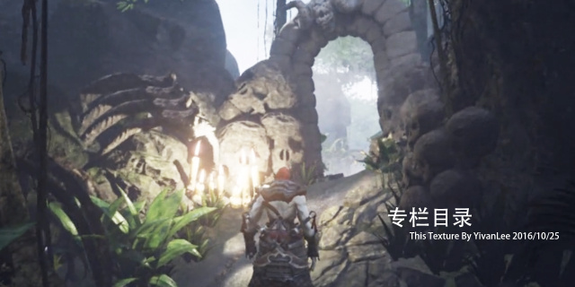](https://zhuanlan.zhihu.com/p/114849904)

**INTRODUCTION：**

天空云朵渲染一直是一个令人头疼的部分。在以前的游戏中，处理这部分十分粗暴，直接做一个SkyBox然后往上贴一张贴图即可，最多在这个盒子上做一些纹理流动来模拟云朵的变化。这种方式虽然简单粗暴但是效果十分直接，只要SkyBox上贴的纹理足够好，出来的效果还是很不错的，但是这样的做法还是无法满足更高的对天空品质的要求。如果游戏有在天上遨游的玩法的需求的时候，亦或是玩家可以高速移动的时候，这种Low方法做出来的天空就会穿帮。所以这时就要改变渲染方案。体渲染常用的两种方法一种是Ray Tracing，一种是Ray Marching。这里使用Ray Marching的方法就够了。

当然根据项目对效果的需求的不同，具体实现方法和最终需要达到的程度也有很大差别，这里有两个比较好例子，一个是“HorizonDawn ”的方法，一个是“光遇”的方法。这里首会介绍“HorizonDawn ”的体积云方案。

这篇文章我重写修改了很多次，主要是每次返回来看的时候都发现效果有很多不足，我的体积云还有很多有待改进的地方，我也会不断打磨修改。

下面先欣赏下我做的效果吧，天空Pass使用的为二分之一分辨率。知乎会压缩我的视频，切换到高清模式也是压得很厉害的。

<iframe allowfullscreen="" src="https://www.zhihu.com/video/1231296310684864512?autoplay=false&amp;useMSE=" frameborder="0"></iframe>

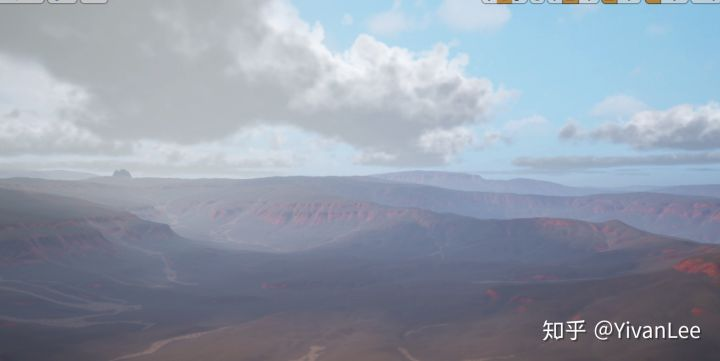

如果不想要厚实的积雨云，修改下光照模型即可，比如去掉powder

<iframe allowfullscreen="" src="https://www.zhihu.com/video/1228625118785286144?autoplay=false&amp;useMSE=" frameborder="0"></iframe>

------

**MAIN CONTENT：**

本篇的实现环境是Windows10，RTX2080，UnrealEngine4.25-Preview1，HLSL，C++。资源制作使用的是SubstanceDesignger2019，Houdini18

要实现体积云渲染，可以拆分为以下几步

（1）环境搭建和资源准备

（2）适用于渲染天空云层的Ray marching的方式方法

（3）云朵的构造方法

（4）云朵的Shading方法

虽然在不久的将来Epic会推出自己的体积云方案，冒着被官方“吊打”的风险，还是决定自己实现以下体积云。


**（1）环境搭建和资源准备**

我是在UnrealEngine4.25里实现的，**如果你是在其它引擎或者渲染器里实现，那么可以跳过这部分的程序环境搭建部分，看资源准备部分即可**。

在Unreal种实现会比一般其它引擎里或渲染框架里实现的工程难度要高很多，对于UE这种庞然大物，想要在它身上动刀子是一件令人头疼的事情，下面秉持着以UE的思维来对引擎进行修改。

首先要做的事情就是要构建出自己的渲染Pass，这件事情十分简单，只需要修改一下SceneRenderer就可以了。

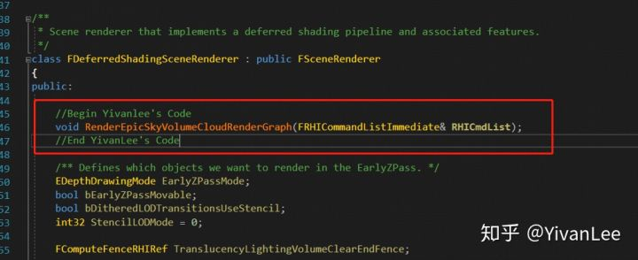

然后再在Render函数种调用自己的Pass。

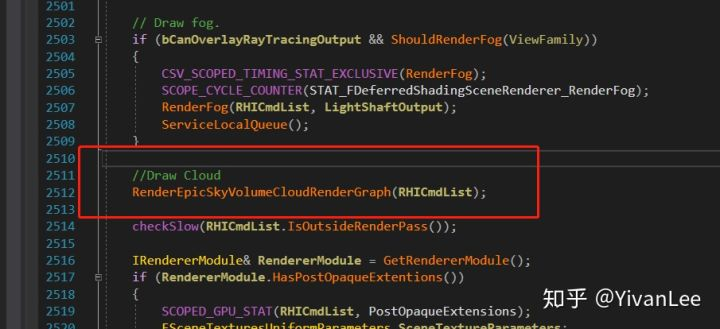

我本想在Fog之前绘制，但是发现Fog会对云层绘制造成影响，所以选择在fog之后大气散射绘制之前进行绘制。这样就能享受到虚幻自身的大气散射的效果。

我的pass里面分为了三个渲染函数

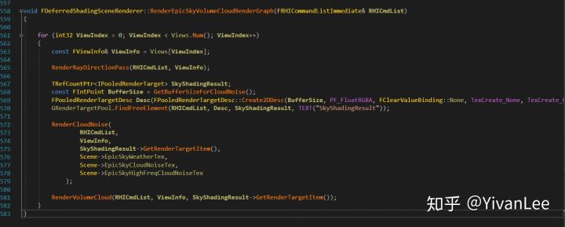

第一个函数是准备阶段，负责绘制一些后面阶段需要的纹理，更新一些buffer等等。第二个阶段是正式的计算阶段，这个阶段使用的是ComputeShader来完成，这个阶段会完成云层的计算。第三个阶段是混合阶段，负责把ComputeShader计算出来的云层和场景混合。

完成底层管线的准备以后，还需要完成资源的传递，需要把上层我们准备的各种3D纹理，2D纹理传到我们刚才的绘制管线里。我没有重新自己写一个VolumeCloud之类的渲染Actor，而是复用了UE之前的SkyLight来帮我塞资源给管线。

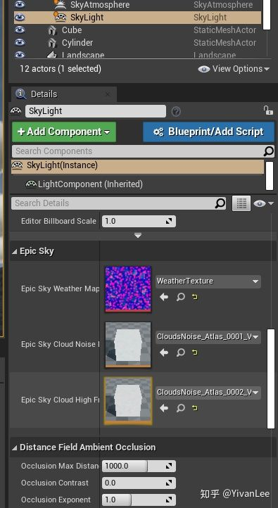

修改方法也很简单。首先在USkyLightComponent里把资源类型先声明好


然后再到FSkyLightSceneProxy里声明对应的资源的渲染资源类型

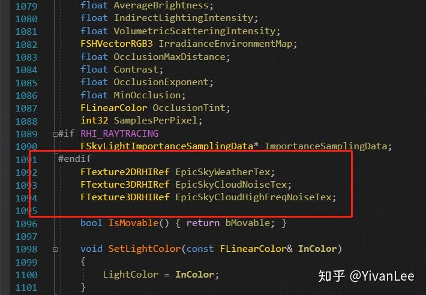

然后再到FScene里声明渲染资源类型

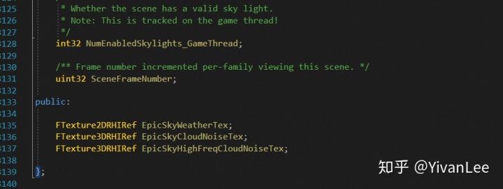

然后再到FSkyLightSceneProxy的构造函数中，把USkyLightComponent中的贴图资源的渲染资源数据抽取出来传递给FSkyLightSceneProxy

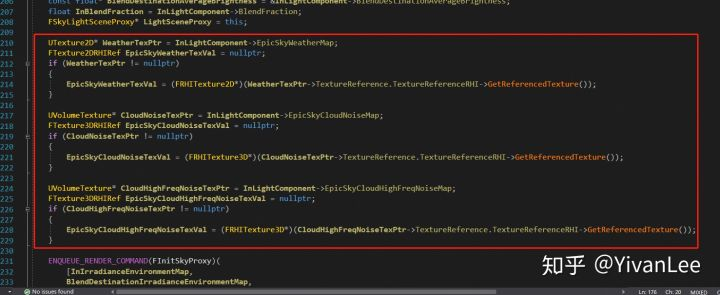

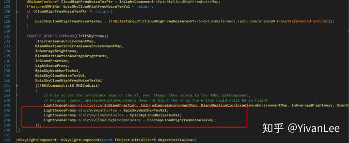

然后再在FScene的SetSkyLight里把FSkyLightSceneProxy的贴图数据资源传给FScene

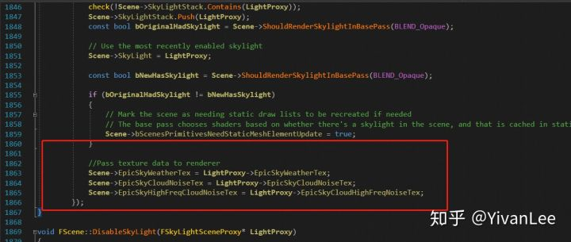

然后再在自己的Pass里由FScene传到自己的渲染函数

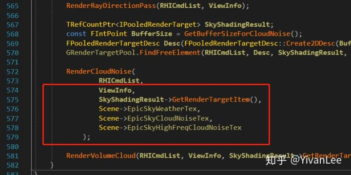

然后再由渲染函数传递给ShaderC++类

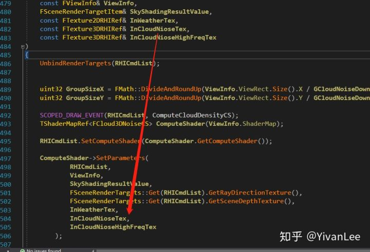

然后再由ShaderC++类的Set接口把资源Set给Shader绑定的资源

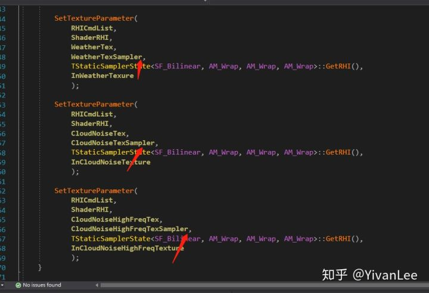

绑定的资源会通过早就构建好的关系和Shader中的资源声明对应起来，这样就完成了资源的传递

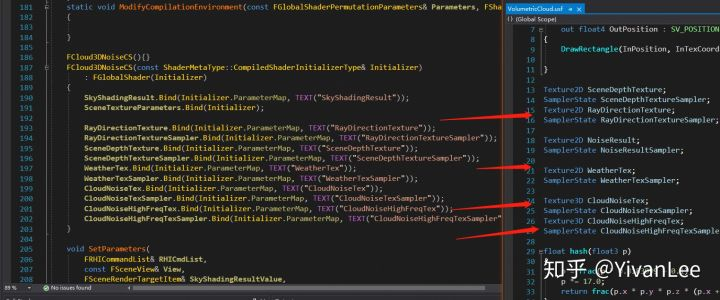

终于完成了资源传递，所以说UE的工程难度是远远高于其它环境的，这也是本篇文章为什么要在UE里完成的原因，因为相对来说难度最高。

最后在这里顺便提一下，算完云层以后需要和SceneColor混合，这里需要对BlendState做一些理解，我的Blendstate设置如下。如果这部分忘记了可以去翻翻龙书对应章节。

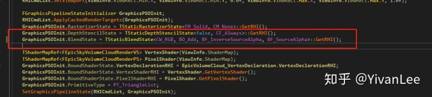

同时还有个绑定CS资源的细节需要注意。这个shader中的名字和绑定时候的名字差了一个"RW"两个字母，

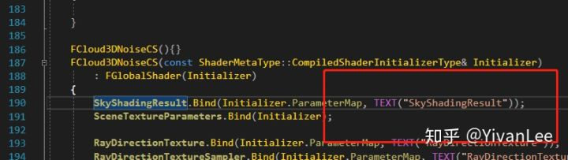

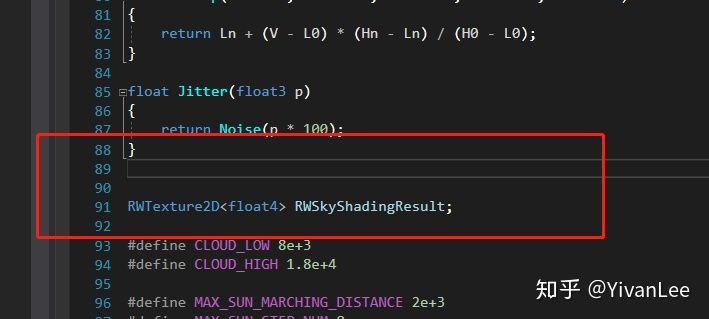

Unreal会擅作主张给我们加上这两个字母

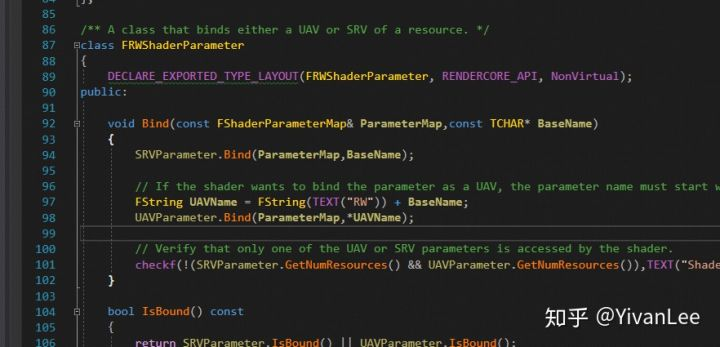

所以如果这点不注意的话会发现CS没有绑定输出Buffer！

链接：[SourceCode](https://link.zhihu.com/?target=https%3A//share.weiyun.com/5TBsMlh)


接下来开始着手资源的准备。完成体积云天空的渲染我们需要准备至少3个离线资源，它们分别是WeatherMap，Shape3DNoise，Detail3DNoise

**WeatherTexture：**

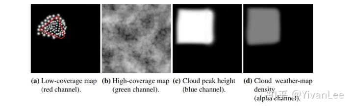

R：存放云的低频覆盖率信息

G：存放云的高频覆盖率信息

B：云峰高度

A：云层浓度

这个图建议使用SubstanceDesigner来做，因为这样做出来的图一定是四方连续的

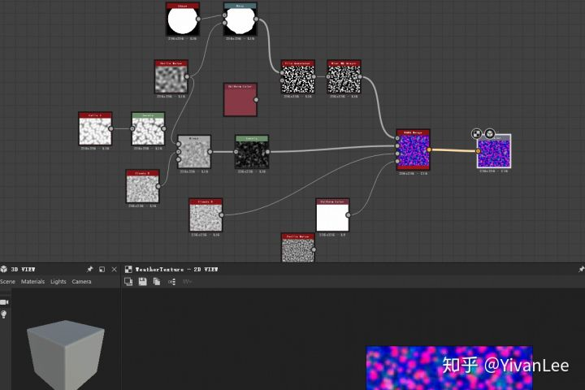

**Shape3DNoise**

3D噪波纹理也可以使用SD来完成，我之前的博客有详细文章：[Create 3D Noise Texture](https://zhuanlan.zhihu.com/p/116696203)

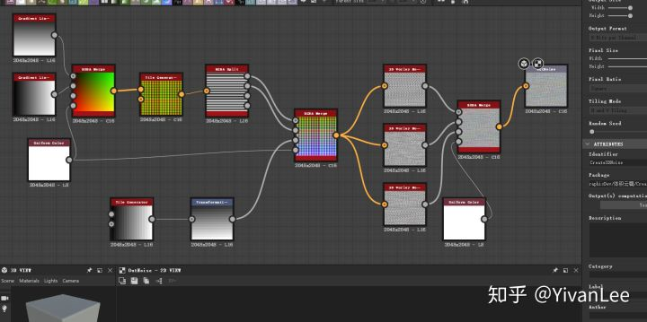

**BaseShape3DNoiseTexture**是一系列不同频率的噪波

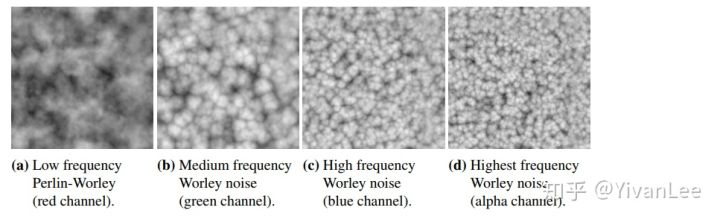

3DNoise的尺寸不用很大，因为它是重复的连续的，后面就用这些3D噪波和前面的那张2D的WeatherMap来完成云层的构建。


下面是**Detail3DNoiseTexture**，rgb分别存放不同频率的WorleyNoise

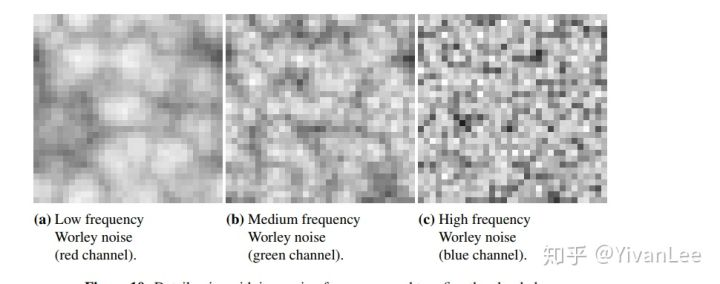

以上就完成了第一步环境搭建和资源准备，如果是在Unity里实现，管线搭建部分会轻松很多。我制作的资源：链接：[文件分享](https://link.zhihu.com/?target=https%3A//share.weiyun.com/5K1VGQW)


**（2）渲染天空云层的Ray marching方法**

到底如何RayMarching整个天空呢，这个是必须要思考清楚的一个问题。如何发射光线，如何Break光线。如何处理光线上收集到的信息。在刚开始接触RayMarching渲染一个盒子的时候，常常会用到距离场公式，当光线Hit到物体并且这个距离小于一个阈值，那么就Hit到了这个点，那么就记录下这个点的位置信息法线信息等。这部分内容如果不了解可以去看看我之前专栏的Ray Marching篇https://zhuanlan.zhihu.com/p/36759481 。但是渲染云层却无法使用这个方法，因为云层是一个气状胶体，它有浓度信息。所以不能Hit到物体以后就马上Break这条光线。

所以做法是需要在这条光线上每隔一段距离就采样一次。

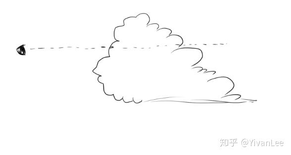

但是这样只能渲染小规范围，如果是渲染大规模的天空，光线就会很长，采样点就会很多，如果不想增加采样点的数量，那么就要增大每个采样点之间的距离，但是增加了采样点的距离就会产生很多锯齿。这就陷入了一个悖论。所以下面就需要着手优化整个采样步长。

首先地球是一个圆形的

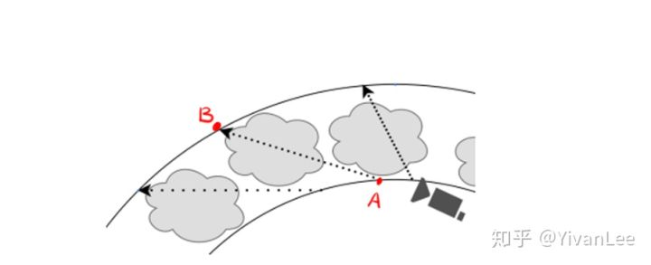

我们构建两个球，内侧和外侧同心球，然后求摄像机发射的射线和两个求的交点，然后把Ray Marching的起始点从摄像机推到和内球相交的A点，把射线的终止点推到和外球相交的B点，然后除以我们规定的每条射线的最大采样点数量，这样就得到了步长。

```text
float StepSize = LHPosDistance / MAX_STEP_NUM;
```

但是这又迎来了另外一个问题，当摄像机比较靠近内球时，采样长度就会非常长，如下图所示，CD的距离可能就会比正常的AB距离长很多，这就会导致前面说的问题，CD光线的采样数会不足。

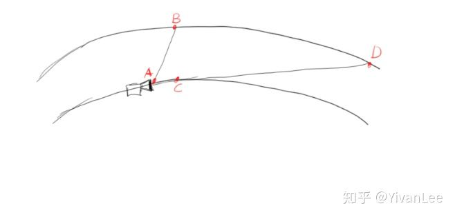

为了解决这个问题，直接给CD加一个限制即可，把D点推回来。

```text
float StepSize = min(LHPosDistance, 4 * h) / MAX_STEP_NUM;
```


当摄像机继续上升，到达云层之间的时候，这个时候需要切换渲染方法，需要把射线的起始点推回到摄像机位置。当摄像机超过外球的时候，需要交换起始点和终点的定义方式，变成起始点是外球的交点，终点是内球的交点。把上述描述的情况逻辑写成代码如下所示：


球面与直线的求交代码如下，如果想知道具体数学原理可以去看我之前的博客


当摄像机在云层之间的时候，我们更换了Ray Marching的方式，起始点是从摄像机开始的，这就又产生了一开始所描述的问题，无法追踪到远处的云层，于是这个时候需要对步长进行改造。让步长每次迭代都变长一点点。这个增加曲线最好是如下图所示的形状：


```text
StepSize = StepSize * exp(0.001 * step);
```

这样即使光线从摄像机开始也可以Marching到很远的距离，如果是太远了精度不够也不用担心，因为太远了玩家也看不到精度的损失，反而会以为那是正常的。只要保证玩家附近的精度是最高的就可以了。

这样就可以做出无缝切换的Marching方式，让玩家可以在云层间穿梭：

可能会有一丝丝的跳变，但是这个跳变可以通过改善上述的各种参数来尽可能衔接，而且实际游戏中玩家也不可能很快穿过厚度是几十几百米的云层，所以这种跳变其实可以忽略。

为了解决Ray marching的切片感，还可以在每次步长迭代的时候给步长一个Jitter


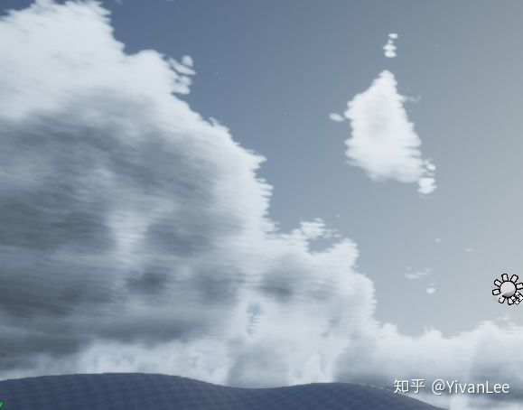

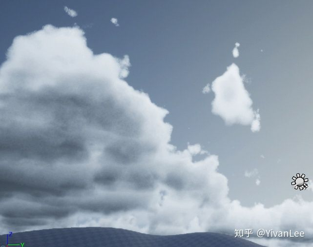

相对于切片感这种显而易见的问题，加Jitter算是一个比较折衷的方式。

<iframe allowfullscreen="" src="https://www.zhihu.com/video/1227694643523493888?autoplay=false&amp;useMSE=" frameborder="0"></iframe>


完成了云层基础的Marching以后还需要渲染云层的光照。

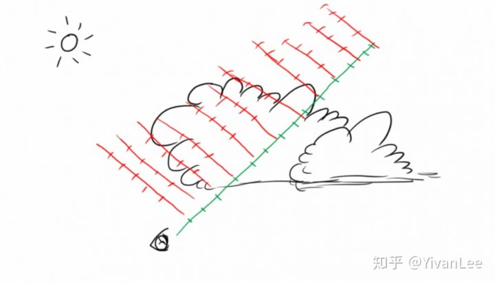

因为需要计算光透过云层穿透了多少，所以每次Marching的时候还要在这一采样点的位置向光源方向发射射线采样此点在太阳方向上的浓度。这也是我们后面会用到RayMarching框架。伪代码如下：

```text
for () 
{
    当前采样点的浓度 = 获取当前点的浓度(当前采样点的位置);
    for () 
    {
        当前采样点朝光源方向的浓度 += 获取当前点的浓度(当前采样点朝向太阳的采样点位置);
    }
    最终光照结果 = 计算光照(当前采样点的浓度, 当前采样点朝光源方向的浓度);
}
return 最终光照结果;
```


我们这种内外球的步长构造方法，除了能够优化步长算法以外，还能得到云层高度信息，这个信息可以用来做HeightGradient。

HeightGradient就是当前摄像机距离内心圆表面的距离占整个云层高度的百分比

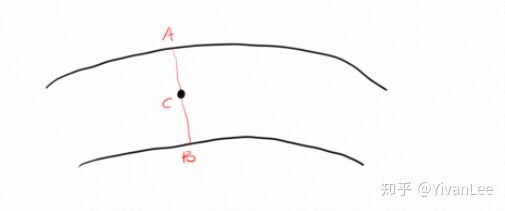

即 ![[公式]](HorizonDawnCloud.assets/equation.svg) 代码如下：


这给光照的计算和云层形状的构建提供了信息。


**（3）云朵的构造方法**

云朵的形状构建部分我主要参考了Reference[1]地平线的论文。

前面已经解决了两个非常困难的问题，下面开始正式构建云朵的形状。下面要先准备一些工具函数。

***remap\***函数可以把一个值从一个范围映射到一个新的范围

![[公式]](HorizonDawnCloud.assets/equation.svg)    ...............................(1)

HLSL代码如下：

```c
float remap(float V, float L0, float H0, float Ln, float Hn)
{
	return Ln + (V - L0) * (Hn - Ln) / (H0 - L0);
}
```

Remap函数在构造灰度范围上十分有用，可以将一个值从一个范围映射到另一个范围

<iframe allowfullscreen="" src="https://www.zhihu.com/video/1226243587048169472?autoplay=false&amp;useMSE=" frameborder="0"></iframe>

上述视频的节点如下：

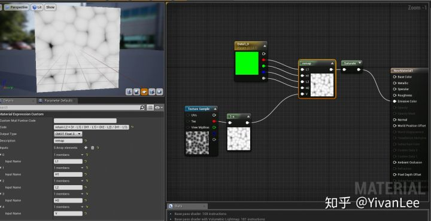

如果把一个噪波的L1变成是这个噪波的1-x的情况，那么效果会是如下情况：

```text
float Res = remap(fbm, 1 - fbm, 1, 0, 1);
```

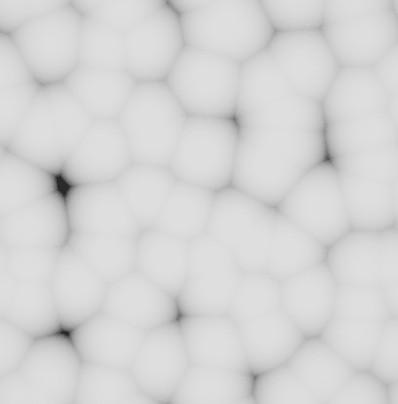


可以看到噪波被削锐利了。

如果两个Remap连用还可以构造出范围区域和衰减因子如下面这种情况


如果使用云层厚度h作为输入变量，那么使用两个remap这样就能控制云朵垂直方向的收缩。


***SAT\***函数可以把值限制在[0，1]的范围内，其实就是HLSL的saturate函数 

![[公式]](HorizonDawnCloud.assets/equation.svg) ![[公式]](https://www.zhihu.com/equation?tex=++%5Cleft%5B%5Cbegin%7Barray%7D%7Bccc%7D0+%26+if+%28v%3C0%29+%5C%5C+1+%26+if%28v%3E1%29++%5C%5C+v+%26+otherwise%5Cend%7Barray%7D%5Cright%5D++)............................................................................(2)

线性插值函数，其实就是对应HLSL的Lerp

![[公式]](HorizonDawnCloud.assets/equation.svg) .........................................................(3)

我们必须要对各种操作对噪波产生的影响十分清楚，因为在构建云朵形状上面完全就是美术设计层面的东西，各个参数是多少如何组合，这也是为什么要花时间对一个很简单的函数要搞半天的原因。

首先要捋清楚思路，云层的构造分为三个部分。第一个部分是构造低频云层，第二个部分是调节云朵形状，第三个部分是增加云层细节。

下面先来构造低频云朵，前面已经介绍过了，WeatherMap的各个通道的数据存储分布。

R通道：存储了整个天空的低频Coverage信息 ![[公式]](HorizonDawnCloud.assets/equation.svg) 

G通道：存储了整个天空的高频Coverage信息 ![[公式]](HorizonDawnCloud.assets/equation.svg) 

B通道：存储了整个天空的云峰高度信息 ![[公式]](HorizonDawnCloud.assets/equation.svg) 

A通道：存储了这个天空云层的Density分布 ![[公式]](HorizonDawnCloud.assets/equation.svg) 

下面再定义两个常量值：

全局Coverage控制变量 ![[公式]](HorizonDawnCloud.assets/equation.svg) 控制整个天空云层的覆盖出现和不覆盖区域

全局Density控制变量 ![[公式]](https://www.zhihu.com/equation?tex=gd%5Cin%5B0%2C+%E2%88%9E%5D) 用于控制整个天空的浓度

下面开始计算整个天空的Coverage信息 ![[公式]](HorizonDawnCloud.assets/equation.svg) 

![[公式]](HorizonDawnCloud.assets/equation.svg) 

如果把WMc直接输出可以看到如下效果：

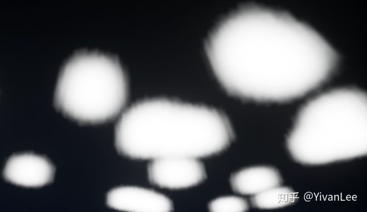

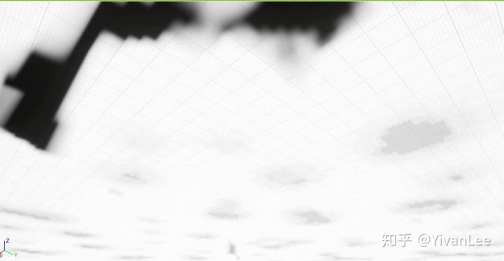

接下来就要使用到之前所说的HeightGradient了

![[公式]](HorizonDawnCloud.assets/equation.svg) 

![[公式]](HorizonDawnCloud.assets/equation.svg) 

上面的云是一个方形，但是实际生活中云是下面大上面小，所以我们使用remap函数，用HeightGradient作为输入构建出下面这个信息

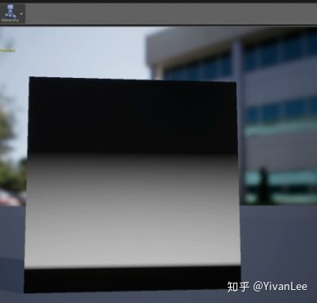

纵轴为云层的高度，这样我们就可以控制云层上面紧缩下面放大，同时还能控制云层下底面浓度高，上地面浓度低的效果。

![[公式]](HorizonDawnCloud.assets/equation.svg) 

![[公式]](HorizonDawnCloud.assets/equation.svg) 

![[公式]](HorizonDawnCloud.assets/equation.svg) 

把SRb和SRt乘起来得到的SA就是上图的灰度场，它会均匀分布在内外球面之间的云层空间里，这样我们就能控制云朵的上下的形状缩放了，同理构建浓度的缩放场

![[公式]](HorizonDawnCloud.assets/equation.svg) 

![[公式]](HorizonDawnCloud.assets/equation.svg) 

![[公式]](HorizonDawnCloud.assets/equation.svg) 

这样就得到了我们需要的DA，DA负责控制云层垂直方向的浓度变化。

下面开始构建BaseShape，我们第一个3DNoiseTexture是**BaseShape3DNoiseTexture**


首先把GBA三个通道的WorleyNoise取出来构造WorleyNoise的fbm。

sn为采样BaseShape3DNoiseTexture的rgba结果。

![[公式]](https://www.zhihu.com/equation?tex=sn+%3D+Texture3DSampleLevel%28CloudNoiseTex%EF%BC%89) 

![[公式]](HorizonDawnCloud.assets/equation.svg) 

然后再把第一个通道的噪波和fbm混合

![[公式]](HorizonDawnCloud.assets/equation.svg) 

然后再让它和之前准备好的全局天空Coverage和天空云层的形状控制灰度场结合得到ShapeNoise（SN）

![[公式]](HorizonDawnCloud.assets/equation.svg) 

当完成这部分可以看到SN的效果如下

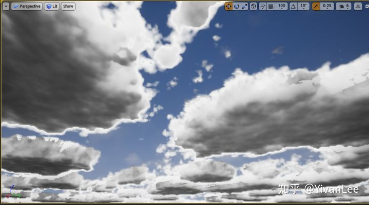

接下来继续以同样构造ShapeNoise的方法构造DetailNoise

![[公式]](HorizonDawnCloud.assets/equation.svg) 

![[公式]](HorizonDawnCloud.assets/equation.svg) 

![[公式]](HorizonDawnCloud.assets/equation.svg) 

让云层底部的细节少，顶层细节多

![[公式]](HorizonDawnCloud.assets/equation.svg) 

然后把ShapeNoise和DetailNoise结合

![[公式]](HorizonDawnCloud.assets/equation.svg) 

![[公式]](HorizonDawnCloud.assets/equation.svg) 

最后便得到了我们需要的Density(d)

当然构造云层这块还有很多方法，比如混入更多的Noise，构造更复杂的SA或者DA丰富云层垂直方向的变化等等。


## **（4）云朵的Shading方法**

完成了云层浓度构建，下一步就是要完成云层的光照。前面已经介绍了云层的Shading需要收集的信息，主要就是需要云层到采样点的浓度，来计算有多少光线能穿过云层。给云层做Shading还需要一个光照模型。

当我们观察一朵云的时候，光线有如上图所示的一些传播方式。光线可以分为三部分：Absorption，OutScattering，InScattering


Absorption一般就用Beer-Law来计算

![[公式]](HorizonDawnCloud.assets/equation.svg) 

![[公式]](HorizonDawnCloud.assets/equation.svg) 

光线在云层内的深度和其能量衰减的关系我们把它拟合出了一条函数曲线曲线


能量衰减的部分常用Beer's-Powder,光照能量的部分游戏行业常用一个简单的模型“Henyey-Greenstein”，地平线又对这个模型进行了改进。所以我们的最后的光照能量公式如下。前半部分是能量衰减，后面是能量穿过云层的部分

![[公式]](HorizonDawnCloud.assets/equation.svg) 

代码实现部分，我的主循环部分非常简单。首先采样当前采样点的浓度，然后采样当前采样点向太阳方向的浓度积分，然后计算光照积分。

```text
for (uint step = 0; step < MAX_STEP_NUM; step++)
{
	float DensDepth = distance(RO, CurPos);
	if (DensDepth >= depth || CurPos.z < -1000 || transmittance < 0.0001)
		break;
		
	float HeightGradient = GetPercentHeight(lrhrh, CurPos, sp);
		
	float CurDens = GetDensity(CurPos, HeightGradient);
	transmittance *= exp(-CurDens);
	Dens += CurDens;
		
	//Compute Lighting
	float3 EnergySamplePos = CurPos;
	float SunDens = 0.0f;
		
	for (uint lstep = 0; lstep < MAX_SUN_STEP_NUM; lstep++)
	{
		float SunHeightGradient = GetPercentHeight(lrhrh, EnergySamplePos, sp);
		SunDens += GetDensity(EnergySamplePos, SunHeightGradient);
			
		EnergySamplePos += L * SunStepSize;
	}
	Lighting += CalculateLight(CurDens, SunDens, cos_angle, HeightGradient) * transmittance;
	CurPos += RD * StepSize;
}
Output.rgb = Lighting;
Output.a = transmittance;
```

下面是我的结果：


最后就是计算InScattering，这部分可以用Powder或者用DepthProbability


光照计算部分把进入云层的三部分光线的结果乘起来就可以了。

我的结果如下：


**（5）深度遮挡**

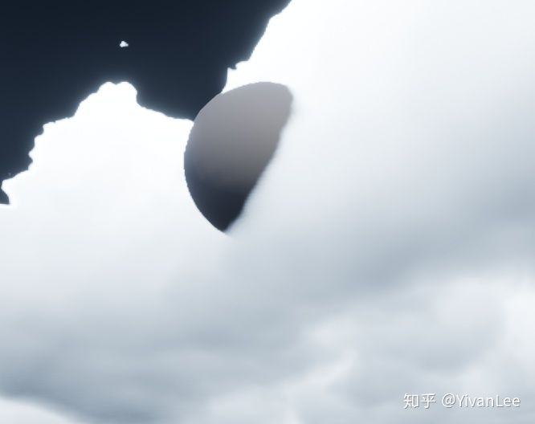

如果要让物体能嵌入云层，则需要把深度buffer传入，如果云层采样点到摄像机原点的距离大于深度则直接break

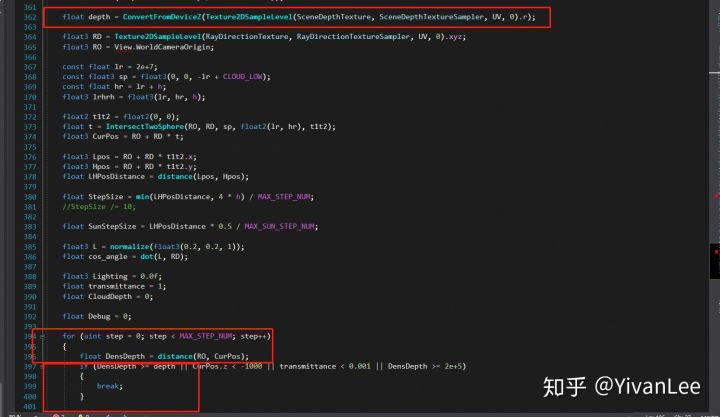

因为云层是在透明物体之后渲染的，但是透明物体没有写入Depth 所以在渲染顺序上会有问题，解决透明物体和云层渲染顺序的问题只有通过把透明物体写入深度来解决。

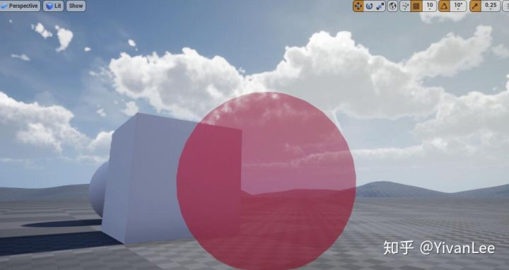


**（6）部分源码**

**USF**

```c
#include "../Common.ush"

void MainVS(
	in float4 InPosition : ATTRIBUTE0,
	in float2 InTexCoord : ATTRIBUTE1,
	out float4 OutUVAndScreenUV : TEXCOORD0,
	out float4 OutPosition : SV_POSITION)
{
	DrawRectangle(InPosition, InTexCoord, OutPosition, OutUVAndScreenUV);

}

Texture2D SceneDepthTexture;
SamplerState SceneDepthTextureSampler;
Texture2D RayDirectionTexture;
SamplerState RayDirectionTextureSampler;

Texture2D NoiseResult;
SamplerState NoiseResultSampler;

Texture2D WeatherTex;
SamplerState WeatherTexSampler;

Texture3D CloudNoiseTex;
SamplerState CloudNoiseTexSampler;
Texture3D CloudNoiseHighFreqTex;
SamplerState CloudNoiseHighFreqTexSampler;

float4 CloudWeatherData;

float hash(float3 p)
{
	p = frac(p * 0.3183099 + 0.1);
	p *= 17.0;
	return frac(p.x * p.y * p.z * (p.x + p.y + p.z));
}

float Noise(in float3 x)
{
	float3 p = floor(x);
	float3 f = frac(x);
	f = f * f * (3.0 - 2.0 * f);

	return lerp(lerp(lerp(hash(p + float3(0, 0, 0)),
                        hash(p + float3(1, 0, 0)), f.x),
                   lerp(hash(p + float3(0, 1, 0)),
                        hash(p + float3(1, 1, 0)), f.x), f.y),
               lerp(lerp(hash(p + float3(0, 0, 1)),
                        hash(p + float3(1, 0, 1)), f.x),
                   lerp(hash(p + float3(0, 1, 1)),
                        hash(p + float3(1, 1, 1)), f.x), f.y), f.z);
}

float map5(in float3 p)
{
	float3 q = p;
	float f = 0.0f;
	f = 0.50000 * Noise(q);
	q = q * 2.02;
	f += 0.25000 * Noise(q);
	q = q * 2.03;
	f += 0.12500 * Noise(q);
	q = q * 2.01;
	f += 0.06250 * Noise(q);
	q = q * 2.02;
	f += 0.03125 * Noise(q);
	return clamp(f, 0.0, 1.0);
}

float map3(in float3 p)
{
	float3 q = p;
	float f = 0.0f;
	f = 0.50000 * Noise(q);
	q = q * 2.02;
	f += 0.25000 * Noise(q);
	q = q * 2.03;
	f += 0.12500 * Noise(q);
	return clamp(f, 0.0, 1.0);
}

float map2(in float3 p)
{
	float3 q = p;
	float f = 0.0f;
	f = 0.65000 * Noise(q);
	q = q * 2.02;
	f += 0.35000 * Noise(q);
	return clamp(f, 0.0, 1.0);
}
float remap(float V, float L0, float H0, float Ln, float Hn)
{
	return Ln + (V - L0) * (Hn - Ln) / (H0 - L0);
}

float Jitter(float3 p)
{
	return remap(map2(p * 300), 0, 1, 0.5, 1);
}


RWTexture2D<float4> RWSkyShadingResult;

#define CLOUD_LOW 8e+3
#define CLOUD_HIGH 1.8e+4

#define MAX_SUN_MARCHING_DISTANCE 2e+3
#define MAX_SUN_STEP_NUM 2

#define MAX_MARCHING_DISTANCE 8e+4
#define MAX_STEP_NUM 256

#define World_To_Texture_Scale_Factor 6e+5
#define h 28000

#define MarchingMethod 1

#define SHAPE_NOISE_FACTOR 40
#define DETAIL_SHAPE_NOISE_FACTOR 60

#define speed 0//1e-3

//#define gc 0.58
//#define gd 1.5


#define Red float3(1, 0, 0)
#define Green float3(0, 1, 0)

float3 ConvertWorldPosToTexturePos(in float3 WorldPos)
{
	float3 TexturePos = WorldPos / World_To_Texture_Scale_Factor;
	//TexturePos += 0.1;
	
	return TexturePos;
}

float IntersectPane(float3 RO, float3 RD)
{
	float t = 0;
	
	if (RO.z < CLOUD_LOW)
		t = (CLOUD_LOW - RO.z) / RD.z;
	else if (RO.z > CLOUD_HIGH)
		t = (CLOUD_HIGH - RO.z) / RD.z;
	
	return max(t, 0);
}


//origin		: Ray origin position
// dir			: Ray direction
//spherePos		: Sphere center position
//sphere Rad	： Sphere radius
float IntersectSphere(float3 ro, float3 rd, float3 spherePos, float r)
{
	float3 oc = ro - spherePos;
	float b = 2.0 * dot(rd, oc);
	float c = dot(oc, oc) - r * r;
	float disc = b * b - 4.0 * c;
	
	if (disc < 0.0)
		return 0.0;
	
	float q = (-b + ((b < 0.0) ? -sqrt(disc) : sqrt(disc))) / 2.0;
	float t0 = q;
	float t1 = c / q;
	if (t0 > t1)
	{
		float temp = t0;
		t0 = t1;
		t1 = temp;
	}
	if (t1 < 0.0)
		return 0.0;
    
	return (t0 < 0.0) ? t1 : t0;
}

float IntersectTwoSphere(float3 ro, float3 rd, float3 spherepos, float2 LrHr, out float2 OutT1T2)
{
	float t = 0;
	
	float Lr = LrHr.r;
	float Hr = LrHr.g;
	
	float dis = distance(ro, spherepos);
	
	float t1 = IntersectSphere(ro, rd, spherepos, Lr);
	float t2 = IntersectSphere(ro, rd, spherepos, Hr);
	
	OutT1T2 = float2(t1, t2);
	
	if (dis < Lr)
		t = t1;
	else if (dis > Hr)
		t = t2;
	
	return t;
}

float GetPercentHeight(float3 LrHrh, float3 WorldPos, float3 SphereCenter)
{
	float lr = LrHrh.r;
	float hr = LrHrh.g;
	float CloudH = LrHrh.b;
	
	float DistToCenter = distance(WorldPos, SphereCenter);
	
	float HeightGradient = clamp(DistToCenter - lr, 0, hr - lr) / (hr - lr);
	
	return HeightGradient;
}

float HG(float cos_angle, float g)
{
	float g2 = g * g;
	float val = (1 - g2) / (pow((1 + g2 - 2 * g * cos_angle), 1.5) * (4 * 3.1415927));
	return val;
}

float SP(float cos_angle, float g)
{
	float k2 = g * g;
	float val = (1 - k2) / ((1 + g * cos_angle) * (1 + g * cos_angle) * (4 * 3.1415927));
	return val;
}

//HG
float InOutScater(float cos_angle)
{
	float first_hg = HG(cos_angle, 0.5);
	//float first_hg = SP(cos_angle, cloud_inscatter);
	
	float second_hg = 1 * pow(saturate(cos_angle), 2);
	float in_scatter_hg = max(first_hg, second_hg);
	
	float out_scatter_hg = HG(cos_angle, -0.1);
	//float out_scatter_hg = SP(cos_angle, -cloud_outscatter);
	
	return lerp(in_scatter_hg, out_scatter_hg, 0.5);
}

//Beer's Law
float Attenuation(float DensityToSun, float cos_angle)
{

	const float BeerTerm = 2;
	float CouldAttuentionClampVal = 0.25;
	
	float prim = exp(-BeerTerm * DensityToSun);
	float scnd = exp(-BeerTerm * CouldAttuentionClampVal) * 0.7;

	//float checkVal = saturate(remap(cos_angle, 0, 1, 0, scnd));
	//return max(checkVal, prim);
	
	return max(prim, scnd);

}

float OutScatterAbient(float LodedDens, float height)
{
	float depth_probability = pow(LodedDens, remap(height, 0.3, 0.85, 0.5, 1.3)) + 0.05;
	float verticle_probability = pow(remap(height, 0.07, 0.14, 0.1, 1.0), 0.8);
	
	float in_scater_Probability = depth_probability * verticle_probability;
	
	return in_scater_Probability;
	
}

float3 CalculateLight(float density, float LodDens, float density_to_sun, float cos_angle, float percent_height)
{
	
	const float cloud_ambient_minimum = 0.4;
	
	//float attenuation_prob = Attenuation(density_to_sun, cos_angle);
	float BeerLaw = Attenuation(density_to_sun, cos_angle);
	
	float ambient_out_scatter = OutScatterAbient(LodDens, percent_height);
	
	float HG = InOutScater(cos_angle);

	float attenuation = BeerLaw * HG * ambient_out_scatter;
	
	attenuation = max(density * cloud_ambient_minimum, attenuation);
	
	return attenuation;
}

float2 GetDensity(float3 WorldPos, float HeightGradient)
{
	float3 TexturePos = ConvertWorldPosToTexturePos(WorldPos);

	float2 Moving = View.RealTime * speed;
	TexturePos.xy += Moving;
				
	float4 WeatherData = Texture2DSampleLevel(WeatherTex, WeatherTexSampler, TexturePos.xy, 0).xyzw;

	float2 Ret = 0.0f;
	
	float gc = CloudWeatherData.r;
	float gd = CloudWeatherData.g;
	float bf = CloudWeatherData.b;
	float df = CloudWeatherData.a;
	
	float wc0 = WeatherData.r;
	float wc1 = WeatherData.g;
	float wh = WeatherData.b;
	float ph = HeightGradient;
	float wd = WeatherData.a;
	
	float WMc = max(wc0, saturate(gc - 0.5) * wc1 * 2);

	float SRb = saturate(remap(ph, 0, 0.07, 0, 1));
	float SRt = saturate(remap(ph, wh * 0.2, wh, 1, 0.1));
	float SA = SRb * SRt;
	
	float DRb = ph * saturate(remap(ph, 0, 0.15, 0, 1));
	float DRt = saturate(remap(ph, 0.9, 1, 1, 0.2));
	
	float DA = gd * DRb * DRt * wd * 2;
	
	float4 sn = Texture3DSampleLevel(CloudNoiseTex, CloudNoiseTexSampler, TexturePos * bf, 0);

	float fbm = 0.625 * sn.g + 0.25 * sn.b + 0.125 * sn.a;
	float SNsample = remap(sn.r, fbm - 1, 1, 0, 1);
	float SN = saturate(remap(SNsample * SA, 1 - gc * WMc, 1, 0, 1)) * DA;
	
	float4 dn = Texture3DSampleLevel(CloudNoiseHighFreqTex, CloudNoiseHighFreqTexSampler, TexturePos * df, 0);
	float DNfbm = 0.625 * dn.r + 0.25 * dn.g + 0.125 * dn.b;
	DNfbm = saturate(remap(dn.r, 1 - DNfbm, 1, 0, 1));
	
	float DNmod = 0.8 * exp(-gc * 0.75) * lerp(DNfbm, 1 - DNfbm, saturate(ph * 1.8));
	
	float SNnd = saturate(remap(SNsample * SA, 1 - gc * WMc, 1, 0, 1));
	
	float d = saturate(remap(SNnd, DNmod, 1, 0, 1)) * DA;

	Ret.r = d;
	Ret.g = SN;
	
	return Ret;
}

[numthreads(32, 32, 1)]
void MainCS(
	uint3 GroupId : SV_GroupID,
	uint3 DispatchThreadId : SV_DispatchThreadID,
    uint3 GroupThreadId : SV_GroupThreadID)
{
	float4 Output = float4(0, 0, 0, 0);
	float sizeX, sizeY;
	RWSkyShadingResult.GetDimensions(sizeX, sizeY);
  
	float2 iResolution = float2(sizeX, sizeY);
	float2 UV = (DispatchThreadId.xy / iResolution.xy);
	
	float depth = ConvertFromDeviceZ(Texture2DSampleLevel(SceneDepthTexture, SceneDepthTextureSampler, UV, 0).r);

	float3 RD = Texture2DSampleLevel(RayDirectionTexture, RayDirectionTextureSampler, UV, 0).xyz;
	float3 RO = View.WorldCameraOrigin;

	const float lr = 2e+7;
	const float3 sp = float3(0, 0, -lr + CLOUD_LOW);
	const float hr = lr + h;
	float3 lrhrh = float3(lr, hr, h);
	
	float2 t1t2 = float2(0, 0);
	float t = IntersectTwoSphere(RO, RD, sp, float2(lr, hr), t1t2);
	float3 CurPos = RO + RD * t;

	float3 Lpos = RO + RD * t1t2.x;
	float3 Hpos = RO + RD * t1t2.y;
	float LHPosDistance = distance(Lpos, Hpos);

	float StepSize = min(LHPosDistance, 4 * h) / MAX_STEP_NUM;
	//StepSize /= 10;
	
	float SunStepSize = LHPosDistance * 0.05 / MAX_SUN_STEP_NUM;
	
	float3 L = normalize(float3(0.2, 0.2, 1));
	float cos_angle = dot(L, RD);
	
	float3 Lighting = 0.0f;
	float transmittance = 1;
	float CloudDepth = 0;
	
	float Debug = 0;
	
	for (uint step = 0; step < MAX_STEP_NUM; step++)
	{
		float DensDepth = distance(RO, CurPos);
		if (DensDepth >= depth || CurPos.z < -1000 || transmittance < 0.001 || DensDepth >= 3e+5)
		{
			break;
		}
		
		float HeightGradient = GetPercentHeight(lrhrh, CurPos, sp);
		
		float2 CurDens = GetDensity(CurPos, HeightGradient);
		transmittance *= exp(-CurDens.r);
		CloudDepth += CurDens.r;
		
		//Compute Lighting
		float3 EnergySamplePos = CurPos;
		float SunDens = 0.0f;
		
		for (uint lstep = 0; lstep < MAX_SUN_STEP_NUM; lstep++)
		{
			float SunHeightGradient = GetPercentHeight(lrhrh, EnergySamplePos, sp);
			SunDens += GetDensity(EnergySamplePos, SunHeightGradient);
			
			EnergySamplePos += L * SunStepSize; // * Jitter(EnergySamplePos);
		}
		Lighting += CalculateLight(CurDens.r, CurDens.g, SunDens, cos_angle, HeightGradient) * transmittance;

		//StepSize = StepSize * exp(0.001 * step);
		CurPos += RD * StepSize * Jitter(CurPos);
	}

	Output.rgb = Lighting;
	//Output.rgb = lerp(Red, Green, Lighting);
	//Output.rgb = lerp(Red, Green, CloudDepth/ 10);
	Output.a = saturate(transmittance);
	RWSkyShadingResult[DispatchThreadId.xy] = Output;
}

void MainPS(
	in float4 UVAndScreenUV : TEXCOORD0,
	out float4 OutColor : SV_Target0
)
{
	OutColor = float4(0, 0, 0, 1);
	float2 ScreenUV = UVAndScreenUV.zw;
	
	float4 NoiseRes = Texture2DSampleLevel(NoiseResult, NoiseResultSampler, UVAndScreenUV.xy, 0).rgba;

	OutColor.rgba = NoiseRes.rgba;

}
```

**CPP**

```cpp
#include "CoreMinimal.h"
#include "SceneRendering.h"
#include "RHICommandList.h"
#include "Shader.h"
#include "RHIStaticStates.h"
#include "ScenePrivate.h"
#include "PixelShaderUtils.h"
#include "SceneTextureParameters.h"
#include "DeferredShadingRenderer.h"
#include "PostProcess/PostProcessSubsurface.h"
#include "PostProcess/PostProcessing.h"
#include "PostProcess/SceneFilterRendering.h"

struct FDebugBox
{
	FDebugBox() 
	{ 
		bInilized = false; 
		BoxScale = 1.0f;
	}
	~FDebugBox() {};

	void FillRawData()
	{
		VertexBuffer = {
			FVector(-50.0000, -50.0000, 50.0000) ,
			FVector(50.0000, -50.0000, 50.0000)  ,
			FVector(50.0000, -50.0000, -50.0000) ,
			FVector(-50.0000, -50.0000, -50.0000),
			FVector(-50.0000, 50.0000 , 50.0000) ,
			FVector(-50.0000, 50.0000 , -50.0000),
			FVector(50.0000, 50.0000 , -50.0000) ,
			FVector(50.0000, 50.0000 , 50.0000)
		};
		for (FVector& val : VertexBuffer)
		{
			val *= BoxScale;
		}

		IndexBuffer = {
			 1, 2, 3,
			 3, 4, 1,
			 5, 6, 7,
			 7, 8, 5,
			 1, 5, 8,
			 8, 2, 1,
			 2, 8, 7,
			 7, 3, 2,
			 3, 7, 6,
			 6, 4, 3,
			 4, 6, 5,
			 5, 1, 4
		};
		for (uint16& val : IndexBuffer)
		{
			val -= 1;
		}
	}
	void EmptyRawData()
	{
		VertexBuffer.Empty();
		IndexBuffer.Empty();
	}
	void Init()
	{
		FillRawData();

		VertexCount = static_cast<uint32>(VertexBuffer.Num());
		PrimitiveCount = static_cast<uint32>(IndexBuffer.Num() / 3);

		//GPU Vertex Buffer
		{
			TStaticMeshVertexData<FVector> VertexData(false);
			Stride = VertexData.GetStride();

			VertexData.ResizeBuffer(VertexBuffer.Num());

			uint8* Data = VertexData.GetDataPointer();
			const uint8* InData = (const uint8*)&(VertexBuffer[0]);
			FMemory::Memcpy(Data, InData, Stride * VertexBuffer.Num());

			FResourceArrayInterface* ResourceArray = VertexData.GetResourceArray();
			FRHIResourceCreateInfo CreateInfo(ResourceArray);
			VertexBufferRHI = RHICreateVertexBuffer(ResourceArray->GetResourceDataSize(), BUF_Static, CreateInfo);
		}
		//GPU Index Buffer
		{
			TResourceArray<uint16, INDEXBUFFER_ALIGNMENT> IndexData;
			IndexData.AddUninitialized(IndexBuffer.Num());
			FMemory::Memcpy(IndexData.GetData(), (void*)(&(IndexBuffer[0])), IndexBuffer.Num() * sizeof(uint16));

			// Create index buffer. Fill buffer with initial data upon creation
			FRHIResourceCreateInfo CreateInfo(&IndexData);
			IndexBufferRHI = RHICreateIndexBuffer(sizeof(uint16), IndexData.GetResourceDataSize(), BUF_Static, CreateInfo);
		}

		EmptyRawData();

		bInilized = true;

	}

	TArray<FVector>VertexBuffer;
	TArray<uint16>IndexBuffer;
	uint32 Stride;
	bool bInilized;
	uint32 VertexCount;
	uint32 PrimitiveCount;
	float BoxScale;
	FVertexBufferRHIRef VertexBufferRHI;
	FIndexBufferRHIRef IndexBufferRHI;
};
FDebugBox gDebugBoxMeshData;

class FDrawDebugMeshVS : public FGlobalShader
{
public:
	DECLARE_GLOBAL_SHADER(FDrawDebugMeshVS);

	static bool ShouldCompilePermutation(const FGlobalShaderPermutationParameters&)
	{
		return true;
	}

	FDrawDebugMeshVS() = default;
	FDrawDebugMeshVS(const ShaderMetaType::CompiledShaderInitializerType& Initializer)
		: FGlobalShader(Initializer)
	{}

	void SetParameters(FRHICommandList& RHICmdList, const FSceneView& View)
	{
		FRHIVertexShader* ShaderRHI = RHICmdList.GetBoundVertexShader();

		FGlobalShader::SetParameters<FViewUniformShaderParameters>(RHICmdList, ShaderRHI, View.ViewUniformBuffer);
	}

private:

	//LAYOUT_FIELD(FSceneTextureShaderParameters, SceneTextureParameters);

};
IMPLEMENT_GLOBAL_SHADER(FDrawDebugMeshVS, "/Engine/Private/EpicSky/RayDirection.usf", "DrawDebugMeshVS", SF_Vertex);


class FDrawDebugMeshPS : public FGlobalShader
{
public:
	DECLARE_GLOBAL_SHADER(FDrawDebugMeshPS);

	static bool ShouldCompilePermutation(const FGlobalShaderPermutationParameters&)
	{
		return true;
	}

	FDrawDebugMeshPS() = default;
	FDrawDebugMeshPS(const ShaderMetaType::CompiledShaderInitializerType& Initializer)
		: FGlobalShader(Initializer)
	{}

	void SetParameters(FRHICommandList& RHICmdList, const FSceneView& View)
	{
		FRHIVertexShader* ShaderRHI = RHICmdList.GetBoundVertexShader();

		FGlobalShader::SetParameters<FViewUniformShaderParameters>(RHICmdList, ShaderRHI, View.ViewUniformBuffer);
	}

private:

};
IMPLEMENT_GLOBAL_SHADER(FDrawDebugMeshPS, "/Engine/Private/EpicSky/RayDirection.usf", "DrawDebugMeshPS", SF_Pixel);

class FCloud3DNoiseCS : public FGlobalShader
{
	DECLARE_SHADER_TYPE(FCloud3DNoiseCS, Global)

public:
	static bool ShouldCompilePermutation(const FGlobalShaderPermutationParameters& Parameters)
	{
		return IsFeatureLevelSupported(Parameters.Platform, ERHIFeatureLevel::SM5);
	}
	static void ModifyCompilationEnvironment(const FGlobalShaderPermutationParameters& Parameters, FShaderCompilerEnvironment& OutEnvironment)
	{

	}

	FCloud3DNoiseCS(){}
	FCloud3DNoiseCS(const ShaderMetaType::CompiledShaderInitializerType& Initializer)
		: FGlobalShader(Initializer)
	{
		SkyShadingResult.Bind(Initializer.ParameterMap, TEXT("SkyShadingResult"));
		SceneTextureParameters.Bind(Initializer);

		RayDirectionTexture.Bind(Initializer.ParameterMap, TEXT("RayDirectionTexture"));
		RayDirectionTextureSampler.Bind(Initializer.ParameterMap, TEXT("RayDirectionTextureSampler"));
		SceneDepthTexture.Bind(Initializer.ParameterMap, TEXT("SceneDepthTexture"));
		SceneDepthTextureSampler.Bind(Initializer.ParameterMap, TEXT("SceneDepthTextureSampler"));
		WeatherTex.Bind(Initializer.ParameterMap, TEXT("WeatherTex"));
		WeatherTexSampler.Bind(Initializer.ParameterMap, TEXT("WeatherTexSampler"));
		CloudNoiseTex.Bind(Initializer.ParameterMap, TEXT("CloudNoiseTex"));
		CloudNoiseTexSampler.Bind(Initializer.ParameterMap, TEXT("CloudNoiseTexSampler"));
		CloudNoiseHighFreqTex.Bind(Initializer.ParameterMap, TEXT("CloudNoiseHighFreqTex"));
		CloudNoiseHighFreqTexSampler.Bind(Initializer.ParameterMap, TEXT("CloudNoiseHighFreqTexSampler"));

		CloudWeatherData.Bind(Initializer.ParameterMap, TEXT("CloudWeatherData"));
	}

	void SetParameters(
		FRHICommandList& RHICmdList,
		const FSceneView& View,
		FSceneRenderTargetItem& SkyShadingResultValue,
		const FTexture2DRHIRef& InRayDirectionTexture,
		const FTexture2DRHIRef& InSceneDepthTexture,
		const FTexture2DRHIRef& InWeatherTexure,
		const FTexture3DRHIRef& InCloudNoiseTexture,
		const FTexture3DRHIRef& InCloudNoiseHighFreqTexture,
		const FVector4& EpicSkyWeatherData
	)
	{
		FRHIComputeShader* ShaderRHI = RHICmdList.GetBoundComputeShader();

		FGlobalShader::SetParameters<FViewUniformShaderParameters>(RHICmdList, ShaderRHI, View.ViewUniformBuffer);

		SceneTextureParameters.Set(RHICmdList, ShaderRHI, View.FeatureLevel, ESceneTextureSetupMode::SceneDepth);

		RHICmdList.TransitionResource(EResourceTransitionAccess::ERWBarrier, EResourceTransitionPipeline::EComputeToCompute, SkyShadingResultValue.UAV);
		SkyShadingResult.SetTexture(RHICmdList, ShaderRHI, SkyShadingResultValue.ShaderResourceTexture, SkyShadingResultValue.UAV);

		SetTextureParameter(
			RHICmdList,
			ShaderRHI,
			RayDirectionTexture,
			RayDirectionTextureSampler,
			TStaticSamplerState<SF_Bilinear>::GetRHI(),
			InRayDirectionTexture
			);

		SetTextureParameter(
			RHICmdList,
			ShaderRHI,
			SceneDepthTexture,
			SceneDepthTextureSampler,
			TStaticSamplerState<SF_Bilinear>::GetRHI(),
			InSceneDepthTexture
			);


		SetTextureParameter(
			RHICmdList,
			ShaderRHI,
			WeatherTex,
			WeatherTexSampler,
			TStaticSamplerState<SF_Bilinear, AM_Wrap, AM_Wrap, AM_Wrap>::GetRHI(),
			InWeatherTexure
			);

		SetTextureParameter(
			RHICmdList,
			ShaderRHI,
			CloudNoiseTex,
			CloudNoiseTexSampler,
			TStaticSamplerState<SF_Bilinear, AM_Wrap, AM_Wrap, AM_Wrap>::GetRHI(),
			InCloudNoiseTexture
			);

		SetTextureParameter(
			RHICmdList,
			ShaderRHI,
			CloudNoiseHighFreqTex,
			CloudNoiseHighFreqTexSampler,
			TStaticSamplerState<SF_Bilinear, AM_Wrap, AM_Wrap, AM_Wrap>::GetRHI(),
			InCloudNoiseHighFreqTexture
			);

		SetShaderValue(RHICmdList, ShaderRHI, CloudWeatherData, EpicSkyWeatherData);
	}

	void UnsetParameters(FRHICommandList& RHICmdList, FSceneRenderTargetItem& SkyShadingResultValue)
	{
		RHICmdList.TransitionResource(EResourceTransitionAccess::EReadable, EResourceTransitionPipeline::EComputeToCompute, SkyShadingResultValue.UAV);
		SkyShadingResult.UnsetUAV(RHICmdList, RHICmdList.GetBoundComputeShader());
	}

private:

	LAYOUT_FIELD(FRWShaderParameter, SkyShadingResult);
	LAYOUT_FIELD(FSceneTextureShaderParameters, SceneTextureParameters);

	LAYOUT_FIELD(FShaderResourceParameter, RayDirectionTexture);
	LAYOUT_FIELD(FShaderResourceParameter, RayDirectionTextureSampler);
	LAYOUT_FIELD(FShaderResourceParameter, SceneDepthTexture);
	LAYOUT_FIELD(FShaderResourceParameter, SceneDepthTextureSampler);
	LAYOUT_FIELD(FShaderResourceParameter, WeatherTex);
	LAYOUT_FIELD(FShaderResourceParameter, WeatherTexSampler);
	LAYOUT_FIELD(FShaderResourceParameter, CloudNoiseTex);
	LAYOUT_FIELD(FShaderResourceParameter, CloudNoiseTexSampler);
	LAYOUT_FIELD(FShaderResourceParameter, CloudNoiseHighFreqTex);
	LAYOUT_FIELD(FShaderResourceParameter, CloudNoiseHighFreqTexSampler);

	LAYOUT_FIELD(FShaderParameter, CloudWeatherData);
};
IMPLEMENT_SHADER_TYPE(, FCloud3DNoiseCS, TEXT("/Engine/Private/EpicSky/VolumetricCloud.usf"), TEXT("MainCS"), SF_Compute);


struct FEpicSkyVolumeCloud_PaneVertexData
{
	FVector4 Position;
	FVector2D UV;
};

class FEpicSkyVolumeCloud_VertexDeclaration : public FRenderResource
{
public:

	FVertexDeclarationRHIRef VertexDeclarationRHI;

	virtual ~FEpicSkyVolumeCloud_VertexDeclaration(){}

	virtual void InitRHI()
	{
		FVertexDeclarationElementList Elements;
		uint32 Stride = sizeof(FEpicSkyVolumeCloud_PaneVertexData);
		Elements.Add(FVertexElement(0, STRUCT_OFFSET(FEpicSkyVolumeCloud_PaneVertexData, Position), VET_Float4, 0, Stride));
		Elements.Add(FVertexElement(0, STRUCT_OFFSET(FEpicSkyVolumeCloud_PaneVertexData, UV), VET_Float2, 1, Stride));
		VertexDeclarationRHI = PipelineStateCache::GetOrCreateVertexDeclaration(Elements);
	}

	virtual void ReleaseRHI()
	{
		VertexDeclarationRHI.SafeRelease();
	}

};
TGlobalResource<FEpicSkyVolumeCloud_VertexDeclaration> EpicVolumeCloud_VertexDeclaration;

class FEpicSkyVolumeCloudRenderVS : public FGlobalShader
{
public:
	DECLARE_GLOBAL_SHADER(FEpicSkyVolumeCloudRenderVS);

	static bool ShouldCompilePermutation(const FGlobalShaderPermutationParameters&)
	{
		return true;
	}

	FEpicSkyVolumeCloudRenderVS() = default;
	FEpicSkyVolumeCloudRenderVS(const ShaderMetaType::CompiledShaderInitializerType& Initializer)
		: FGlobalShader(Initializer)
	{}
};
IMPLEMENT_GLOBAL_SHADER(FEpicSkyVolumeCloudRenderVS, "/Engine/Private/EpicSky/VolumetricCloud.usf", "MainVS", SF_Vertex);


class FEpicSkyVolumeCloudRenderPS : public FGlobalShader
{
	DECLARE_SHADER_TYPE(FEpicSkyVolumeCloudRenderPS, Global);

public:

	FEpicSkyVolumeCloudRenderPS() {}
	FEpicSkyVolumeCloudRenderPS(const ShaderMetaType::CompiledShaderInitializerType& Initializer)
		: FGlobalShader(Initializer)
	{
		SceneTextureParameters.Bind(Initializer);
		SceneDepthTexture.Bind(Initializer.ParameterMap, TEXT("SceneDepthTexture"));
		SceneDepthTextureSampler.Bind(Initializer.ParameterMap, TEXT("SceneDepthTextureSampler"));
		RayDirectionTexture.Bind(Initializer.ParameterMap, TEXT("RayDirectionTexture"));
		RayDirectionTextureSampler.Bind(Initializer.ParameterMap, TEXT("RayDirectionTextureSampler"));
		NoiseResult.Bind(Initializer.ParameterMap, TEXT("NoiseResult"));
		NoiseResultSampler.Bind(Initializer.ParameterMap, TEXT("NoiseResultSampler"));
	}

	static bool ShouldCompilePermutation(const FGlobalShaderPermutationParameters& Parameters)
	{
		return IsFeatureLevelSupported(Parameters.Platform, ERHIFeatureLevel::SM5);
	}

	static void ModifyCompilationEnvironment(const FGlobalShaderPermutationParameters& Parameters, FShaderCompilerEnvironment& OutEnvironment)
	{
		//OutEnvironment.SetDefine(TEXT("TEST_MICRO"), true);
	}

	void SetParameters(
		FRHICommandList& RHICmdList, 
		const FSceneView& View, 
		const FTexture2DRHIRef& InSceneDepthTexture,
		const FTexture2DRHIRef& InRayDirectionTexture,
		const FTextureRHIRef& InNoiseResult
	)
	{
		FRHIPixelShader* ShaderRHI = RHICmdList.GetBoundPixelShader();

		FGlobalShader::SetParameters<FViewUniformShaderParameters>(RHICmdList, ShaderRHI, View.ViewUniformBuffer);
		SceneTextureParameters.Set(RHICmdList, ShaderRHI, View.FeatureLevel, ESceneTextureSetupMode::None);

		SetTextureParameter(
				RHICmdList,
				ShaderRHI,
				SceneDepthTexture,
				SceneDepthTextureSampler,
				TStaticSamplerState<SF_Bilinear>::GetRHI(),
				InSceneDepthTexture
			);
		
		SetTextureParameter(
			RHICmdList,
			ShaderRHI,
			RayDirectionTexture,
			RayDirectionTextureSampler,
			TStaticSamplerState<SF_Bilinear>::GetRHI(),
			InRayDirectionTexture
			);
		
		SetTextureParameter(
			RHICmdList,
			ShaderRHI,
			NoiseResult,
			NoiseResultSampler,
			TStaticSamplerState<SF_Bilinear>::GetRHI(),
			InNoiseResult
			);

	}

private:

	LAYOUT_FIELD(FSceneTextureShaderParameters, SceneTextureParameters);
	LAYOUT_FIELD(FShaderResourceParameter, SceneDepthTexture);
	LAYOUT_FIELD(FShaderResourceParameter, SceneDepthTextureSampler);
	LAYOUT_FIELD(FShaderResourceParameter, RayDirectionTexture);
	LAYOUT_FIELD(FShaderResourceParameter, RayDirectionTextureSampler);
	LAYOUT_FIELD(FShaderResourceParameter, NoiseResult);
	LAYOUT_FIELD(FShaderResourceParameter, NoiseResultSampler);

};
IMPLEMENT_GLOBAL_SHADER(FEpicSkyVolumeCloudRenderPS, "/Engine/Private/EpicSky/VolumetricCloud.usf", "MainPS", SF_Pixel);

void RenderRayDirectionPass(FRHICommandListImmediate& RHICmdList, const FViewInfo& ViewInfo)
{
	FSceneRenderTargets::Get(RHICmdList).BeginRenderRayDirectionTexture(RHICmdList, ESimpleRenderTargetMode::EExistingColorAndDepth, FExclusiveDepthStencil::DepthRead_StencilWrite);

	//SCOPED_GPU_MASK(RHICmdList, View.GPUMask);
	SCOPED_DRAW_EVENT(RHICmdList, RenderDebugInvBox);

	RHICmdList.SetViewport(ViewInfo.ViewRect.Min.X, ViewInfo.ViewRect.Min.Y, 0.0f, ViewInfo.ViewRect.Max.X, ViewInfo.ViewRect.Max.Y, 1.0f);

	FGraphicsPipelineStateInitializer GraphicsPSOInit;
	RHICmdList.ApplyCachedRenderTargets(GraphicsPSOInit);
	GraphicsPSOInit.RasterizerState = TStaticRasterizerState<FM_Solid, CM_None>::GetRHI();
	GraphicsPSOInit.DepthStencilState = TStaticDepthStencilState<false, CF_Always>::GetRHI();
	GraphicsPSOInit.BlendState = TStaticBlendState<>::GetRHI();

	TShaderMapRef<FDrawDebugMeshVS> VertexShader(ViewInfo.ShaderMap);
	TShaderMapRef<FDrawDebugMeshPS> PixelShader(ViewInfo.ShaderMap);
	GraphicsPSOInit.BoundShaderState.VertexDeclarationRHI = GetVertexDeclarationFVector3();
	GraphicsPSOInit.BoundShaderState.VertexShaderRHI = VertexShader.GetVertexShader();
	GraphicsPSOInit.BoundShaderState.PixelShaderRHI = PixelShader.GetPixelShader();
	GraphicsPSOInit.PrimitiveType = PT_TriangleList;
	SetGraphicsPipelineState(RHICmdList, GraphicsPSOInit);

	VertexShader->SetParameters(RHICmdList, ViewInfo);
	PixelShader->SetParameters(RHICmdList, ViewInfo);

	if (gDebugBoxMeshData.bInilized == false)
	{
		gDebugBoxMeshData.BoxScale = 100000;
		gDebugBoxMeshData.Init();
	}

	RHICmdList.SetStreamSource(0, gDebugBoxMeshData.VertexBufferRHI, 0);
	RHICmdList.DrawIndexedPrimitive(gDebugBoxMeshData.IndexBufferRHI, 0, 0, gDebugBoxMeshData.VertexCount, 0, gDebugBoxMeshData.PrimitiveCount, 1);
	
	FSceneRenderTargets::Get(RHICmdList).FinishRenderRayDirectionTexture(RHICmdList);
}

const uint32 GCloudNoiseDownsampleFactor = 2;
const uint32 GGroupSize = 32;

FIntPoint GetBufferSizeForCloudNoise()
{
	return FIntPoint::DivideAndRoundDown(FSceneRenderTargets::Get_FrameConstantsOnly().GetBufferSizeXY(), GCloudNoiseDownsampleFactor);
}


void RenderCloudNoise(
	FRHICommandListImmediate& RHICmdList, 
	const FViewInfo& ViewInfo, 
	FSceneRenderTargetItem& SkyShadingResultValue,
	const FTexture2DRHIRef& InWeatherTex,
	const FTexture3DRHIRef& InCloudNioseTex,
	const FTexture3DRHIRef& InCloudNioseHighFreqTex,
	const FVector4& EpicSkyWeatherData
)
{
	UnbindRenderTargets(RHICmdList);

	
	uint32 GroupSizeX = FMath::DivideAndRoundUp(ViewInfo.ViewRect.Size().X / GCloudNoiseDownsampleFactor, GGroupSize);
	uint32 GroupSizeY = FMath::DivideAndRoundUp(ViewInfo.ViewRect.Size().Y / GCloudNoiseDownsampleFactor, GGroupSize);

	SCOPED_DRAW_EVENT(RHICmdList, ComputeCloudDensityCS);
	TShaderMapRef<FCloud3DNoiseCS> ComputeShader(ViewInfo.ShaderMap);

	RHICmdList.SetComputeShader(ComputeShader.GetComputeShader());

	ComputeShader->SetParameters(
			RHICmdList, 
			ViewInfo, 
			SkyShadingResultValue, 
			FSceneRenderTargets::Get(RHICmdList).GetRayDirectionTexture(),
			FSceneRenderTargets::Get(RHICmdList).GetSceneDepthTexture(),
			InWeatherTex,
			InCloudNioseTex,
			InCloudNioseHighFreqTex,
			EpicSkyWeatherData
		);
	
	DispatchComputeShader(RHICmdList, ComputeShader.GetShader(), GroupSizeX, GroupSizeY, 1);

	ComputeShader->UnsetParameters(RHICmdList, SkyShadingResultValue);
}

void RenderVolumeCloud(FRHICommandListImmediate& RHICmdList, const FViewInfo& ViewInfo, FSceneRenderTargetItem& SkyShadingResultValue)
{
	FSceneRenderTargets::Get(RHICmdList).BeginRenderingSceneColor(RHICmdList, ESimpleRenderTargetMode::EExistingColorAndDepth, FExclusiveDepthStencil::DepthRead_StencilWrite);

	//SCOPED_GPU_MASK(RHICmdList, View.GPUMask);
	SCOPED_DRAW_EVENT(RHICmdList, RenderEpicCloud);

	RHICmdList.SetViewport(ViewInfo.ViewRect.Min.X, ViewInfo.ViewRect.Min.Y, 0.0f, ViewInfo.ViewRect.Max.X, ViewInfo.ViewRect.Max.Y, 1.0f);

	FGraphicsPipelineStateInitializer GraphicsPSOInit;
	RHICmdList.ApplyCachedRenderTargets(GraphicsPSOInit);
	GraphicsPSOInit.RasterizerState = TStaticRasterizerState<FM_Solid, CM_None>::GetRHI();
	GraphicsPSOInit.DepthStencilState = TStaticDepthStencilState<false, CF_Always>::GetRHI();
	GraphicsPSOInit.BlendState = TStaticBlendState<CW_RGB, BO_Add, BF_InverseSourceAlpha, BF_SourceAlpha>::GetRHI();

	TShaderMapRef<FEpicSkyVolumeCloudRenderVS> VertexShader(ViewInfo.ShaderMap);
	TShaderMapRef<FEpicSkyVolumeCloudRenderPS> PixelShader(ViewInfo.ShaderMap);
	GraphicsPSOInit.BoundShaderState.VertexDeclarationRHI = EpicVolumeCloud_VertexDeclaration.VertexDeclarationRHI;
	GraphicsPSOInit.BoundShaderState.VertexShaderRHI = VertexShader.GetVertexShader();
	GraphicsPSOInit.BoundShaderState.PixelShaderRHI = PixelShader.GetPixelShader();
	GraphicsPSOInit.PrimitiveType = PT_TriangleList;
	SetGraphicsPipelineState(RHICmdList, GraphicsPSOInit);

	PixelShader->SetParameters(
			RHICmdList, 
			ViewInfo, 
			FSceneRenderTargets::Get(RHICmdList).GetSceneDepthTexture(), 
			FSceneRenderTargets::Get(RHICmdList).GetRayDirectionTexture(),
			SkyShadingResultValue.ShaderResourceTexture
		);

	DrawRectangle(
			RHICmdList,
			0, 0,
			ViewInfo.ViewRect.Width(), ViewInfo.ViewRect.Height(),
			ViewInfo.ViewRect.Min.X, ViewInfo.ViewRect.Min.Y,
			ViewInfo.ViewRect.Width(), ViewInfo.ViewRect.Height(),
			FIntPoint(ViewInfo.ViewRect.Width(), ViewInfo.ViewRect.Height()),
			FSceneRenderTargets::Get(RHICmdList).GetBufferSizeXY(),
			VertexShader
		);

	FSceneRenderTargets::Get(RHICmdList).FinishRenderingSceneColor(RHICmdList);
}

void FDeferredShadingSceneRenderer::RenderEpicSkyVolumeCloudRenderGraph(FRHICommandListImmediate& RHICmdList)
{
	
	for (int32 ViewIndex = 0; ViewIndex < Views.Num(); ViewIndex++)
	{
		const FViewInfo& ViewInfo = Views[ViewIndex];

		RenderRayDirectionPass(RHICmdList, ViewInfo);

		TRefCountPtr<IPooledRenderTarget> SkyShadingResult;
		const FIntPoint BufferSize = GetBufferSizeForCloudNoise();
		FPooledRenderTargetDesc Desc(FPooledRenderTargetDesc::Create2DDesc(BufferSize, PF_FloatRGBA, FClearValueBinding::None, TexCreate_None, TexCreate_RenderTargetable | TexCreate_UAV, false));
		GRenderTargetPool.FindFreeElement(RHICmdList, Desc, SkyShadingResult, TEXT("SkyShadingResult"));

		RenderCloudNoise(
				RHICmdList, 
				ViewInfo, 
				SkyShadingResult->GetRenderTargetItem(), 
				Scene->EpicSkyWeatherTex, 
				Scene->EpicSkyCloudNoiseTex,
				Scene->EpicSkyHighFreqCloudNoiseTex,
				Scene->EpicSkyWeatherData
			);
		
		RenderVolumeCloud(RHICmdList, ViewInfo, SkyShadingResult->GetRenderTargetItem());
	}
}
```


**（7）测试和优化**

首先我先在第一个Pass里准备一些数据，如rd，一些Buffer等等。再在第二个pass里使用ComputeShader并行绘制整个天空。ComputeShader使用半分辨率，然后再在第三个Pass把第二个Pass的混合结果和SceneColor混合，整个过程会花费5ms左右的性能

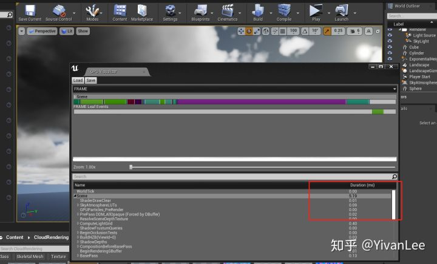

如果还想进一步提升性能，可以在步长，分帧棋盘绘制等方面优化。

<iframe allowfullscreen="" src="https://www.zhihu.com/video/1227617879338156032?autoplay=false&amp;useMSE=" frameborder="0"></iframe>

------

**SUMMARY AND OUTLOOK：**

目前我的效果还有很多改进空间，在云朵构造，体积光照，体积阴影Shading，性能优化等几个方向还可以持续优化，不过目前已经把整个Feature的流程算是跑通了，**从引擎渲染框架修改，到美术资源准备到最后的渲染和性能测试**，我会继续优化我的效果。最后感谢群里的**Totoro**大佬的指点。

天空渲染其实只是TOD系统的一环而已，天空Mask其实需要和地形渲染关联，如果是想要让天空对光线的遮挡对人物环境等产生影响，还需要对GI等进行处理。这部分我就做得比较简单了。下面是云层下方简单的处理效果。

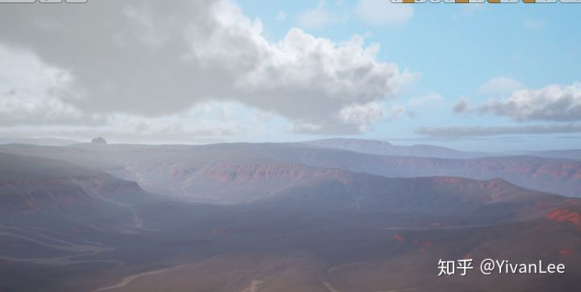

下面是整个场景的穿梭浏览：

<iframe allowfullscreen="" src="https://www.zhihu.com/video/1231299547973582848?autoplay=false&amp;useMSE=" frameborder="0"></iframe>

在计算Attenuation的时候如果把SunDensity用smoothstep算一下，然后整个CalLighting只输入DensityToSun，无意间发现可以做出卡通勾边的云，这给制作风格化的云朵提供了启发

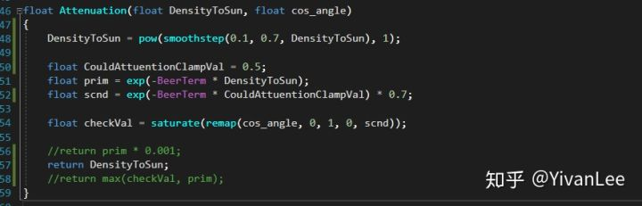

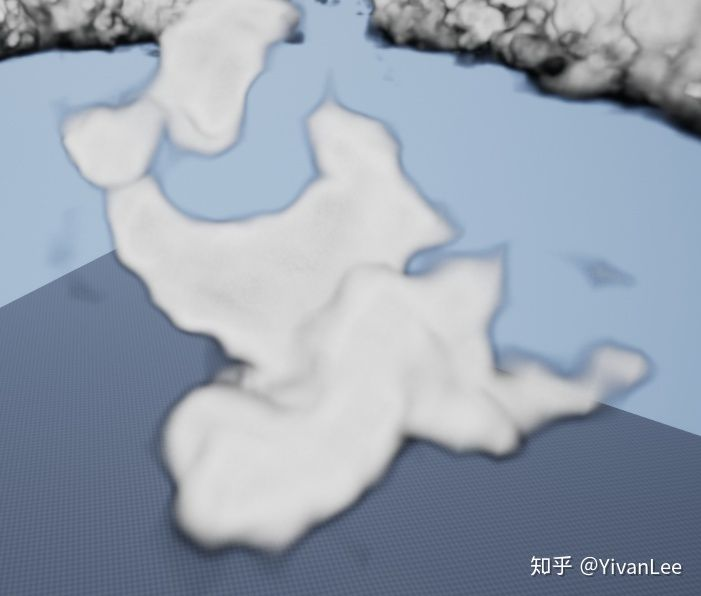

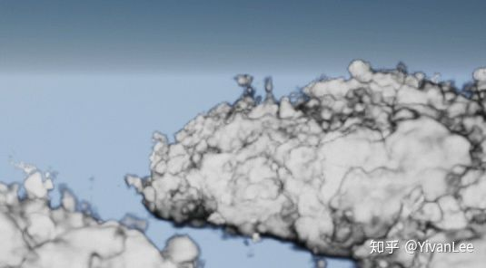


Enjoy it.

------

**Reference：**

**[1]**[Horizontal Volumetric Cloud Rendering](https://link.zhihu.com/?target=http%3A//advances.realtimerendering.com/s2015/The%20Real-time%20Volumetric%20Cloudscapes%20of%20Horizon%20-%20Zero%20Dawn%20-%20ARTR.pdf) 

**[2]**[pcqq_aiomsg](https://link.zhihu.com/?target=https%3A//www.guerrilla-games.com/read/nubis-authoring-real-time-volumetric-cloudscapes-with-the-decima-engine%3Ftdsourcetag%3Ds_pcqq_aiomsg) 

------

**NEXT：**

todo...

------

By YivanLee 2020/3/28