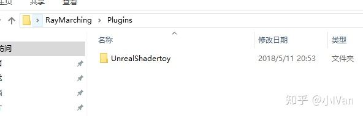
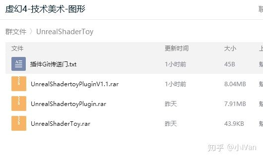
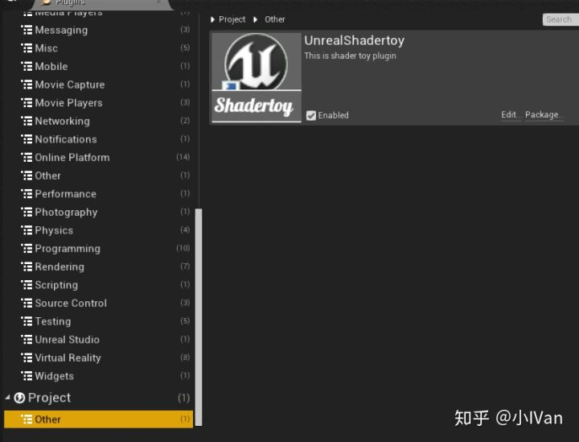
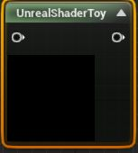
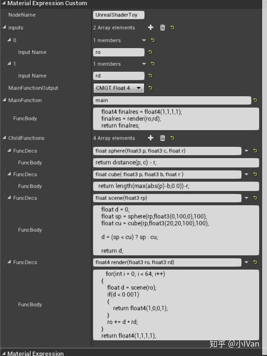
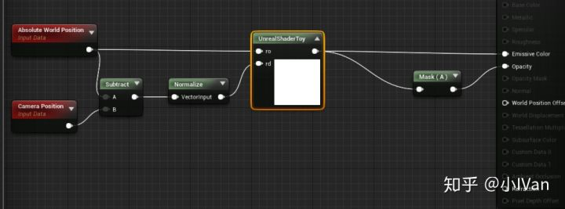
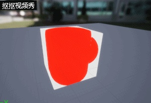
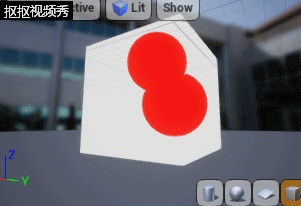
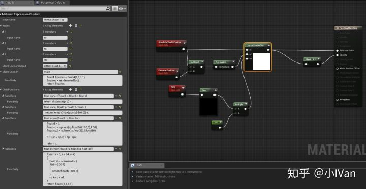
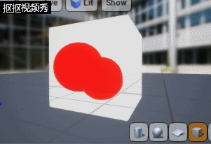

# Begin ray marching in unreal engine 4【第一卷：在材质编辑器中启程】


RayMarching是一个比较好玩的技术，不需要什么顶点数据纹理数据就能画出很多东西。如果你对raymarching的概念还不是很清楚可以去看看下面的文章：

Ray Marching and Signed Distance Functions

jamie-wong.com

这是国外一个大神的文章，里面详细介绍了ray marching的原理。

下面我来梳理一下ray marching的步骤

（1）构建距离场，构建距离场的方法有很多，我们可以用公式或者用3Dtexture都可以，或者用2Dtexture的序列图3Dtexture拟合

（2）RayMarching出表面

（3）贴图映射 光影着色啥的

所以我们的代码框架就有了：

```text
//高度场元素函数
float sphere(float3 p, float3 c, float r)
{
}
float cube( float3 p, float3 b, float r )
{
}
//高度场构建函数
float scene(float3 rp)
{
}
//raymarching函数
float4 render(float3 ro, float3 rd)
{
}
主函数
float4 MainImage(float3 ro, float3 rd)
{
}
```

可以看到我们的代码思路十分清晰，sphere函数和cube函数是距离场的子元素，scene是构建整个距离场，render函数负责raymarching，mainimage函数是我们的主函数。

下面我们来一步步在unreal中实现一个简单的ray marching吧

【1】第一步：新建一个工程，版本是4.19的。

【2】第二部：把我们的UnrealShaderToy丢进我们的项目的plugin中




这个插件在技术美术群的群文件中，技术美术群号是：192946459




然后启动项目，确保插件是启用的





然后在材质编辑器的主窗口呼出shadertoy节点




键入如下代码：







然后你就能看到两个图元组成的几何体啦，让我们来修改一下scene函数




<svg x="16" y="18.5" class="GifPlayer-icon"></svg>

```text
float scene(float3 rp)
{
    float d = 0;
    float sp = sphere(rp,float3(0,100,0),100);
    float sp2 = sphere(rp,float3(0,0,100),80);

    d = (sp < sp2) ? sp : sp2;

    return d;
}
```

可以看到有两个球啦




<svg x="16" y="18.5" class="GifPlayer-icon"></svg>

让我们来加入更多变化，比如更新球的位置







<svg x="16" y="18.5" class="GifPlayer-icon"></svg>

大概的raymarching框架就是这样了，后面我们为这个框架加入整套PBR管线
