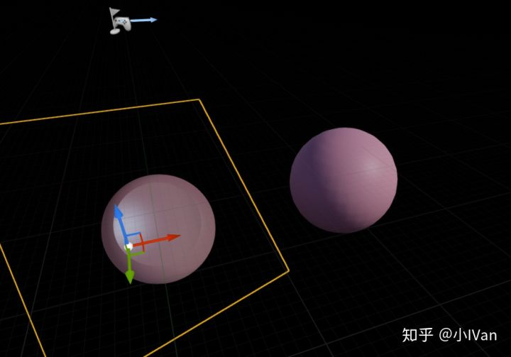
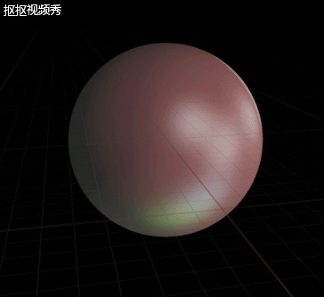
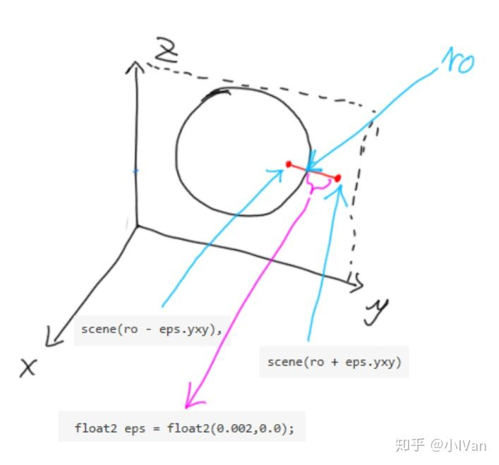
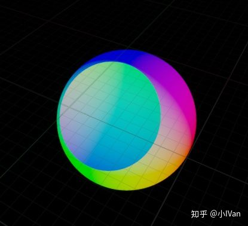
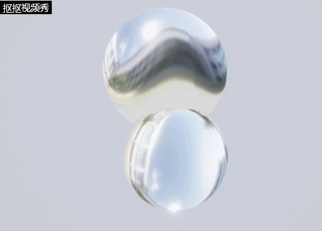
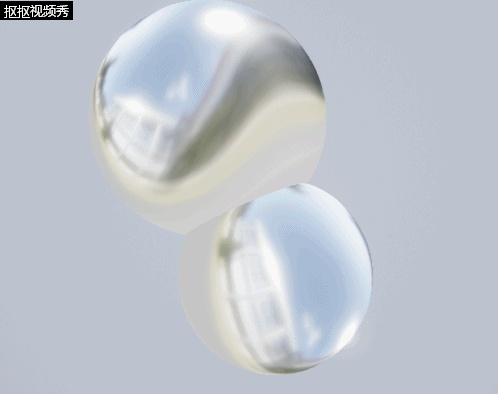

# Begin ray marching in unreal engine 4【第二卷：开始加入光照】


先看下我们加的简单光照吧（左边是我们ray marching出来的，用的简单的兰伯特光照，右边是引擎的PBR的）




当然也可以加入多盏灯光




<svg x="16" y="18.5" class="GifPlayer-icon"></svg>

首先我们先拿出我们的代码框架

```text
//距离场元素
float sphere(float3 p, float3 c, float r)
{
}
float cube( float3 p, float3 b, float r )
{
}
//------------------------------------------------------------------
//对距离场进行并集或者非交集运算
float opS(float d1, float d2)
{
}
float opU(float d1, float d2)
{
}
//------------------------------------------------------------------
//构建距离度场
float scene(float3 rp)
{
}
//------------------------------------------------------------------
//计算法线
float3 normal(float3 ro)
{
}
//------------------------------------------------------------------
//raymarching函数
float4 raymarching(float3 ro, float3 rd)
{
}
//主函数
float4 MainImage(float3 ro, float3 rd, 其他需要传入的参数)
{
    //这里会进行光照计算等
}
```

在上一节代码的基础上，我们把render函数改为raymarching函数。ray marching函数只负责找到hit的位置。

下面的问题就是如何找到法线了。

```text
float3 normal(float3 ro)
{
    float2 eps = float2(0.002,0.0);
    return normalize(float3(
        scene(ro + eps.xyy) - scene(ro - eps.xyy),
        scene(ro + eps.yxy) - scene(ro - eps.yxy),
        scene(ro + eps.yyx) - scene(ro - eps.yyx)
    ));
}
```

在普通的模型渲染中，模型顶点数据中有法线信息，然后经过法线贴图映射来扰动表面我们再用uv去采，就可以拿到法线。ray marching中因为没用顶点法线信息，所以我们只有通过梯度的概念拿到法线。我们先找到x方向上梯度衰减最快的方向


同理Y轴上




Z轴也是这个道理，然后三个轴合在一起就是我们的法线了




然后我们就可以算光照啦。下一节我们再来加入一些其他东西。现在的光照模型还是太简单了，后面一点一点把它变复杂。

如果你已经迫不及待想看看自己ray marching的PBR效果，可以考虑直接让虚幻来帮你算，因为现在我们已经有法线了呀！




<svg x="16" y="18.5" class="GifPlayer-icon"></svg>




<svg x="16" y="18.5" class="GifPlayer-icon"></svg>

Enjoy it！！！
