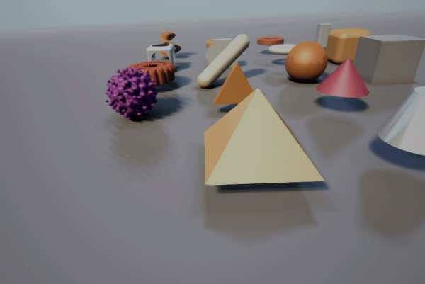
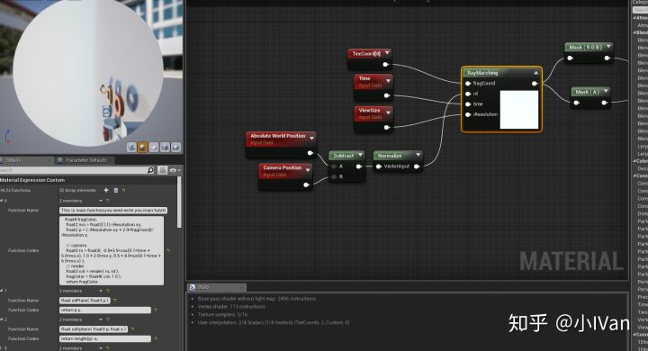

# Begin ray marching in unreal engine 4【第三卷：更多图形更复杂的光照】


先上效果吧：




<svg x="16" y="18.5" class="GifPlayer-icon"></svg>

看了前面两节的话就能很好理解了。这一版我是用的最老版本的UnrealShaderToyPlugin制作的。




如果你也想加入使用UnrealShaderToy的话那就加群吧，群号在目录简介那个贴子。


下面就直接上代码了

```text
#define AA 1   // make this 1 is your machine is too slow

//------------------------------------------------------------------

float sdPlane( float3 p )
{
	return p.y;
}

float sdSphere( float3 p, float s )
{
    return length(p)-s;
}

float sdBox( float3 p, float3 b )
{
    float3 d = abs(p) - b;
    return min(max(d.x,max(d.y,d.z)),0.0) + length(max(d,0.0));
}

float sdEllipsoid( in float3 p, in float3 r )
{
    return (length( p/r ) - 1.0) * min(min(r.x,r.y),r.z);
}

float udRoundBox( float3 p, float3 b, float r )
{
    return length(max(abs(p)-b,0.0))-r;
}

float sdTorus( float3 p, float2 t )
{
    return length( float2(length(p.xz)-t.x,p.y) )-t.y;
}

float sdHexPrism( float3 p, float2 h )
{
    float3 q = abs(p);
#if 0
    return max(q.z-h.y,max((q.x*0.866025+q.y*0.5),q.y)-h.x);
#else
    float d1 = q.z-h.y;
    float d2 = max((q.x*0.866025+q.y*0.5),q.y)-h.x;
    return length(max(float2(d1,d2),0.0)) + min(max(d1,d2), 0.);
#endif
}

float sdCapsule( float3 p, float3 a, float3 b, float r )
{
	float3 pa = p-a, ba = b-a;
	float h = clamp( dot(pa,ba)/dot(ba,ba), 0.0, 1.0 );
	return length( pa - ba*h ) - r;
}

float sdEquilateralTriangle(  in float2 p )
{
    const float k = 1.73205;//sqrt(3.0);
    p.x = abs(p.x) - 1.0;
    p.y = p.y + 1.0/k;
    if( p.x + k*p.y > 0.0 ) p = float2( p.x - k*p.y, -k*p.x - p.y )/2.0;
    p.x += 2.0 - 2.0*clamp( (p.x+2.0)/2.0, 0.0, 1.0 );
    return -length(p)*sign(p.y);
}

float sdTriPrism( float3 p, float2 h )
{
    float3 q = abs(p);
    float d1 = q.z-h.y;
#if 1
    // distance bound
    float d2 = max(q.x*0.866025+p.y*0.5,-p.y)-h.x*0.5;
#else
    // correct distance
    h.x *= 0.866025;
    float d2 = sdEquilateralTriangle(p.xy/h.x)*h.x;
#endif
    return length(max(float2(d1,d2),0.0)) + min(max(d1,d2), 0.);
}

float sdCylinder( float3 p, float2 h )
{
  float2 d = abs(float2(length(p.xz),p.y)) - h;
  return min(max(d.x,d.y),0.0) + length(max(d,0.0));
}

float sdCone( in float3 p, in float3 c )
{
    float2 q = float2( length(p.xz), p.y );
    float d1 = -q.y-c.z;
    float d2 = max( dot(q,c.xy), q.y);
    return length(max(float2(d1,d2),0.0)) + min(max(d1,d2), 0.);
}

float sdConeSection( in float3 p, in float h, in float r1, in float r2 )
{
    float d1 = -p.y - h;
    float q = p.y - h;
    float si = 0.5*(r1-r2)/h;
    float d2 = max( sqrt( dot(p.xz,p.xz)*(1.0-si*si)) + q*si - r2, q );
    return length(max(float2(d1,d2),0.0)) + min(max(d1,d2), 0.);
}

float sdPryamid4(float3 p, float3 h )
{
    // Tetrahedron = Octahedron - Cube
    float box = sdBox( p - float3(0,-2.0*h.z,0), float3(2.0*h.z,2.0*h.z,2.0*h.z) );
 
    float d = 0.0;
    d = max( d, abs( dot(p, float3( -h.x, h.y, 0 )) ));
    d = max( d, abs( dot(p, float3(  h.x, h.y, 0 )) ));
    d = max( d, abs( dot(p, float3(  0, h.y, h.x )) ));
    d = max( d, abs( dot(p, float3(  0, h.y,-h.x )) ));
    float octa = d - h.z;
    return max(-box,octa);
 }

float Distance2( float2 p )
{
	return sqrt( p.x*p.x + p.y*p.y );
}

float length6( float2 p )
{
	p = p*p*p; p = p*p;
	return pow( p.x + p.y, 1.0/6.0 );
}

float length8( float2 p )
{
	p = p*p; p = p*p; p = p*p;
	return pow( p.x + p.y, 1.0/8.0 );
}

float sdTorus82( float3 p, float2 t )
{
    float2 q = float2(Distance2(p.xz)-t.x,p.y);
    return length8(q)-t.y;
}

float sdTorus88( float3 p, float2 t )
{
    float2 q = float2(length8(p.xz)-t.x,p.y);
    return length8(q)-t.y;
}

float sdCylinder6( float3 p, float2 h )
{
    return max( length6(p.xz)-h.x, abs(p.y)-h.y );
}

//------------------------------------------------------------------

float opS( float d1, float d2 )
{
    return max(-d2,d1);
}

float2 opU( float2 d1, float2 d2 )
{
	return (d1.x<d2.x) ? d1 : d2;
}

float3 opRep( float3 p, float3 c )
{
    return p-c*floor(p/c)-0.5*c;
}

float3 opTwist( float3 p )
{
    float  c = cos(10.0*p.y+10.0);
    float  s = sin(10.0*p.y+10.0);
    float2x2 m = {c,-s,s,c};
    return float3(mul(m,p.xz),p.y);
}

//------------------------------------------------------------------

float2 map( in float3 pos )
{
    float2 res = opU( float2( sdPlane(pos), 1.0 ),float2( sdSphere(pos-float3( 0.0,0.25, 0.0), 0.25 ), 46.9 ) );
    res = opU( res, float2( sdBox(pos-float3( 1.0,0.25, 0.0), float3(0.25,0.25,0.25) ), 3.0 ) );
    res = opU( res, float2( udRoundBox(pos-float3( 1.0,0.25, 1.0), float3(0.15,0.15,0.15), 0.1 ), 41.0 ) );
	res = opU( res, float2( sdTorus(pos-float3( 0.0,0.25, 1.0), float2(0.20,0.05) ), 25.0 ) );
    res = opU( res, float2( sdCapsule(pos,float3(-1.3,0.10,-0.1), float3(-0.8,0.50,0.2), 0.1  ), 31.9 ) );
	res = opU( res, float2( sdTriPrism(pos-float3(-1.0,0.25,-1.0), float2(0.25,0.05) ),43.5 ) );
	res = opU( res, float2( sdCylinder(pos-float3( 1.0,0.30,-1.0), float2(0.1,0.2) ), 8.0 ) );
	res = opU( res, float2( sdCone(pos-float3( 0.0,0.50,-1.0), float3(0.8,0.6,0.3) ), 55.0 ) );
	res = opU( res, float2( sdTorus82(pos-float3( 0.0,0.25, 2.0), float2(0.20,0.05) ),50.0 ) );
	res = opU( res, float2( sdTorus88(pos-float3(-1.0,0.25, 2.0), float2(0.20,0.05) ),43.0 ) );
	res = opU( res, float2( sdCylinder6(pos-float3( 1.0,0.30, 2.0), float2(0.1,0.2) ), 12.0 ) );
	res = opU( res, float2( sdHexPrism(pos-float3(-1.0,0.20, 1.0), float2(0.25,0.05) ),17.0 ) );
	res = opU( res, float2( sdPryamid4(pos-float3(-1.0,0.15,-2.0), float3(0.8,0.6,0.25) ),37.0 ) );
    res = opU( res, float2( opS(udRoundBox(pos-float3(-2.0,0.2, 1.0), float3(0.15,0.15,0.15),0.05), sdSphere(pos-float3(-2.0,0.2, 1.0), 0.25)), 13.0 ) );
    res = opU( res, float2( opS( sdTorus82(pos-float3(-2.0,0.2, 0.0), float2(0.20,0.1)),sdCylinder(opRep( float3(atan2(pos.x+2.0,pos.z)/6.2831, pos.y, 0.02+0.5*length(pos-float3(-2.0,0.2, 0.0))), float3(0.05,1.0,0.05)), float2(0.02,0.6))), 51.0 ) );
	res = opU( res, float2( 0.5*sdSphere(pos-float3(-2.0,0.25,-1.0), 0.2 ) + 0.03*sin(50.0*pos.x)*sin(50.0*pos.y)*sin(50.0*pos.z), 65.0 ) );
	res = opU( res, float2( 0.5*sdTorus(opTwist(pos-float3(-2.0,0.25, 2.0)),float2(0.20,0.05)), 46.7 ) );
    res = opU( res, float2( sdConeSection(pos-float3( 0.0,0.35,-2.0), 0.15, 0.2, 0.1 ), 13.67 ) );
    res = opU( res, float2( sdEllipsoid(pos-float3( 1.0,0.35,-2.0), float3(0.15, 0.2, 0.05) ), 43.17 ) );
        
    return res;
}

float2 castRay( in float3 ro, in float3 rd )
{
    float tmin = 1.0;
    float tmax = 20.0;
   
#if 1
    // bounding volume
    float tp1 = (0.0-ro.y)/rd.y; if( tp1>0.0 ) tmax = min( tmax, tp1 );
    float tp2 = (1.6-ro.y)/rd.y; if( tp2>0.0 ) { if( ro.y>1.6 ) tmin = max( tmin, tp2 );
                                                 else           tmax = min( tmax, tp2 ); }
#endif
    
    float t = tmin;
    float m = -1.0;
    for( int i=0; i<64; i++ )
    {
	    float precis = 0.0005*t;
	    float2 res = map( ro+rd*t );
        if( res.x<precis || t>tmax ) break;
        t += res.x;
	    m = res.y;
    }

    if( t>tmax ) m=-1.0;
    return float2( t, m );
}


float calcSoftshadow( in float3 ro, in float3 rd, in float mint, in float tmax )
{
	float res = 1.0;
    float t = mint;
    for( int i=0; i<16; i++ )
    {
		float h = map( ro + rd*t ).x;
        res = min( res, 8.0*h/t );
        t += clamp( h, 0.02, 0.10 );
        if( h<0.001 || t>tmax ) break;
    }
    return clamp( res, 0.0, 1.0 );
}

float3 calcNormal( in float3 pos )
{
    float2 e = float2(1.0,-1.0)*0.5773*0.0005;
    return normalize( e.xyy*map( pos + e.xyy ).x + 
					  e.yyx*map( pos + e.yyx ).x + 
					  e.yxy*map( pos + e.yxy ).x + 
					  e.xxx*map( pos + e.xxx ).x );
    /*
	float3 eps = float3( 0.0005, 0.0, 0.0 );
	float3 nor = float3(
	    map(pos+eps.xyy).x - map(pos-eps.xyy).x,
	    map(pos+eps.yxy).x - map(pos-eps.yxy).x,
	    map(pos+eps.yyx).x - map(pos-eps.yyx).x );
	return normalize(nor);
	*/
}

float calcAO( in float3 pos, in float3 nor )
{
	float occ = 0.0;
    float sca = 1.0;
    for( int i=0; i<5; i++ )
    {
        float hr = 0.01 + 0.12*float(i)/4.0;
        float3 aopos =  nor * hr + pos;
        float dd = map( aopos ).x;
        occ += -(dd-hr)*sca;
        sca *= 0.95;
    }
    return clamp( 1.0 - 3.0*occ, 0.0, 1.0 );    
}

// http://iquilezles.org/www/articles/checkerfiltering/checkerfiltering.htm
float checkersGradBox( in float2 p )
{
    // filter kernel
    float2 w = fwidth(p) + 0.001;
    // analytical integral (box filter)
    float fract = (p-0.5*w)*0.5 - floor((p-0.5*w)*0.5);
    float2 i = 2.0*(abs(fract-0.5)-abs(fract-0.5))/w;
    // xor pattern
    return 0.5 - 0.5*i.x*i.y;                  
}

float3 render( in float3 ro, in float3 rd )
{ 
    float3 col = float3(0.7, 0.9, 1.0) +rd.y*0.8;
    float2 res = castRay(ro,rd);
    float t = res.x;
	float m = res.y;
    if( m>-0.5 )
    {
        float3 pos = ro + t*rd;
        float3 nor = calcNormal( pos );
        float3 ref = reflect( rd, nor );
        
        // material        
		col = 0.45 + 0.35*sin( float3(0.05,0.08,0.10)*(m-1.0) );
        if( m<1.5 )
        {
            
            float f = checkersGradBox( 5.0*pos.xz );
            col = 0.3 + f*float3(0.1,0.1,0.1);
        }

        // lighitng        
        float occ = calcAO( pos, nor );
		float3  lig = normalize( float3(-0.4, 0.7, -0.6) );
        float3  hal = normalize( lig-rd );
		float amb = clamp( 0.5+0.5*nor.y, 0.0, 1.0 );
        float dif = clamp( dot( nor, lig ), 0.0, 1.0 );
        float bac = clamp( dot( nor, normalize(float3(-lig.x,0.0,-lig.z))), 0.0, 1.0 )*clamp( 1.0-pos.y,0.0,1.0);
        float dom = smoothstep( -0.1, 0.1, ref.y );
        float fre = pow( clamp(1.0+dot(nor,rd),0.0,1.0), 2.0 );
        
        dif *= calcSoftshadow( pos, lig, 0.02, 2.5 );
        dom *= calcSoftshadow( pos, ref, 0.02, 2.5 );

		float spe = pow( clamp( dot( nor, hal ), 0.0, 1.0 ),16.0)*
                    dif *
                    (0.04 + 0.96*pow( clamp(1.0+dot(hal,rd),0.0,1.0), 5.0 ));

		float3 lin = float3(0.0,0.0,0.0);
        lin += 1.30*dif*float3(1.00,0.80,0.55);
        lin += 0.40*amb*float3(0.40,0.60,1.00)*occ;
        lin += 0.50*dom*float3(0.40,0.60,1.00)*occ;
        lin += 0.50*bac*float3(0.25,0.25,0.25)*occ;
        lin += 0.25*fre*float3(1.00,1.00,1.00)*occ;
		col = col*lin;
		col += 10.00*spe*float3(1.00,0.90,0.70);

    	col = lerp( col, float3(0.8,0.9,1.0), 1.0-exp( -0.0002*t*t*t ) );
    }

	return float3( clamp(col,0.0,1.0) );
}

mat3 setCamera( in float3 ro, in float3 ta, float cr )
{
	float3 cw = normalize(ta-ro);
	float3 cp = float3(sin(cr), cos(cr),0.0);
	float3 cu = normalize( cross(cw,cp) );
	float3 cv = normalize( cross(cu,cw) );
    return mat3( cu, cv, cw );
}

void mainImage(in float2 fragCoord )
{
    float4 fragColor;
    float2 mo = float2(1,1)/iResolution.xy;
    float2 p = (-iResolution.xy + 2.0*fragCoord)/iResolution.y;

	// camera	
    float3 ro = float3( -0.5+3.5*cos(0.1*time + 6.0*mo.x), 1.0 + 2.0*mo.y, 0.5 + 4.0*sin(0.1*time + 6.0*mo.x) );
    // render	
    float3 col = render( ro, rd );
    fragColor = float4( col, 1.0 );
    return fragColor;
}
```

其实你仔细观察，这个也是和我之前第二章的代码框架符合的，只是这里面填充了更多东西罢了。


发布于 2018-05-13
