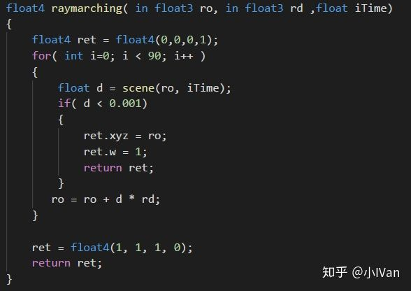
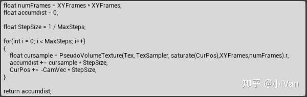
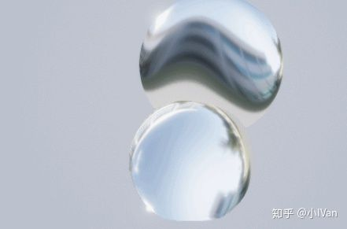
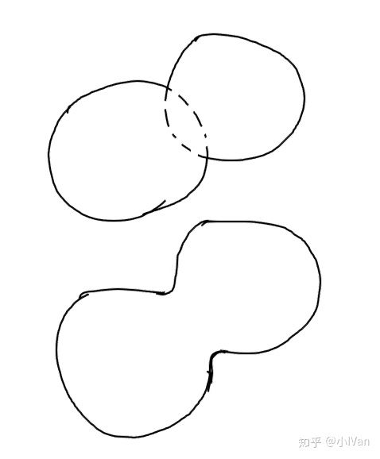

# Begin ray marching in unreal engine 4【第四卷：虚幻4中的MetaBall】


首先把我的专栏目录再贴上来一下：

小IVan：专题概述及目录

zhuanlan.zhihu.com

然后是老规矩，先上效果：

<iframe allowfullscreen="" src="https://www.zhihu.com/video/981288051347185664?autoplay=false&amp;useMSE=" frameborder="0"></iframe>


这个系列一直在使用我们自己开发的UnrealShaderToy插件在制作，我感觉代码+可视化节点才能发挥虚幻材质编辑器最强大的功能，希望哪天官方能把我的插件整合进引擎，这个插件的传送门：

小IVan：开始Unreal Shader Toy之旅(简介-环境搭建-更新公告-效果展示目录)

zhuanlan.zhihu.com


## **再声明一下，本人只是个小技术美术，如果观点有误请各路大神斧正。**

首先让我们再来捋一下ray marching吧。目前ray marching大概有几种机制：

第一种是SphereHit的方式，这种方式能快速找到表面，这种raymarching算法适合用来绘制不透明的物体，因为我们绘制这类物体只需要知道它的表面即可。代码如下：




这种方式循环次数可能很少，可能几次循环之后就满足break条件然后弹出了。


第二种是绘制那种透明的物体，如烟雾，透明胶体。这种需要对这条光纤上的浓度进行积分。所以需要用segment hit的方式。这种方式可能就需要在一条光线上执行积分操作了，代码例子如下：




然后第三种就是光追的方式了，这种方式我这里就不多说了，暂时先跳过去。

------

下面我们开始正式制作meatball吧。raymarching篇的第二篇文章我有做过一个很简单的示例：




其实这个再稍微变一下就是我们的meatball了。meatball和这个示例的区别在于距离场的构造：




我们只要让两个球衔接的地方顺滑平滑即可。


第一个sphere函数是距离场元素公式，是我们最基本的距离场模型。第二个就blob5函数就是处理球与球之间距离场的顺滑过度的。第三个函数就是构建我们距离场的函数啦。

下面是我的完整代码：

```text
float sphere(float3 pos)
{
	return length(pos) - 50.0;   
}

float blob5(float d1, float d2, float d3, float d4, float d5)
{
    float k = 0.1;
	return -log(exp(-k*d1)+exp(-k*d2)+exp(-k*d3)+exp(-k*d4)+exp(-k*d5))/k;
}

float scene(float3 pos, float iTime)
{
    float t = iTime;
    
    float ec = 1.5;
	float s1 = sphere(pos - ec * float3(cos(t*1.1),cos(t*1.3),cos(t*1.7)));
    float s2 = sphere(pos + ec * float3(cos(t*0.7),cos(t*1.9),cos(t*2.3)));
    float s3 = sphere(pos + ec * float3(cos(t*0.3),cos(t*2.9),sin(t*1.1)));
    float s4 = sphere(pos + ec * float3(sin(t*1.3),sin(t*1.7),sin(t*0.7)));
    float s5 = sphere(pos + ec * float3(sin(t*2.3),sin(t*1.9),sin(t*2.9)));
    
    return blob5(s1, s2, s3, s4, s5);
}

float4 raymarching( in float3 ro, in float3 rd ,float iTime)
{
    float4 ret = float4(0,0,0,1);
    for( int i=0; i < 90; i++ )
    {   
        float d = scene(ro, iTime);
        if( d < 0.001)
        {
            ret.xyz = ro;
            ret.w = 1;
            return ret;
        }
	   ro = ro + d * rd;
    }

    ret = float4(1, 1, 1, 0);
    return ret;
}

float3 calcNormal( in float3 pos , float iTime)
{
    const float eps = 0.002;

    const float3 v1 = float3( 1.0,-1.0,-1.0);
    const float3 v2 = float3(-1.0,-1.0, 1.0);
    const float3 v3 = float3(-1.0, 1.0,-1.0);
    const float3 v4 = float3( 1.0, 1.0, 1.0);

	return normalize( v1*scene( pos + v1*eps ,iTime) + 
					  v2*scene( pos + v2*eps ,iTime) + 
					  v3*scene( pos + v3*eps ,iTime) + 
					  v4*scene( pos + v4*eps ,iTime) );
}

float4 render(float3 ro, float3 rd, float time)
{
    float4 outcolor = float4(1, 1, 1, 1);

    float4 ret = raymarching(ro, rd, time);

    float3 N = calcNormal(ret.xyz, time);

    outcolor.rgb = N;
    outcolor.a = ret.w;
    return outcolor;
}
```

把代码丢进材质编辑器


------

我比较喜欢把细节写清楚，希望读过我文章的人也能实现效果（感觉自己有点啰嗦了）。那下面我们就再来捋一下整个思路。

第一步：下载我的unrealshadertoy插件，这个插件主要是为了解决材质编辑器里没办法随心所以调用函数的问题。

第二步敲出我们的raymarching代码框架：（注意看注释）

```text
//距离场构建的基础元素，就像我们建模用的box sphere是一样的道理
float sphere(float3 pos)
{
}
//对距离场构建的基础元素进行操作，类似3Dmax建模里的布尔操作，把模型塌陷到一起
float blob5(float d1, float d2, float d3, float d4, float d5)
{
}
//构建我们的场景
float scene(float3 pos, float iTime)
{
}
//渲染距离场
float4 raymarching( in float3 ro, in float3 rd ,float iTime)
{
}
//渲染法线
float3 calcNormal( in float3 pos , float iTime)
{
}
//渲染我们最终的图像
float4 render(float3 ro, float3 rd, float time)
{
}
```

其实我感觉我们在干的事情就是在引擎渲染器基础上架设我们自己的小渲染器。

第三步就是敲入我上面所展示的代码。

Enjoy it！

编辑于 2018-05-19
