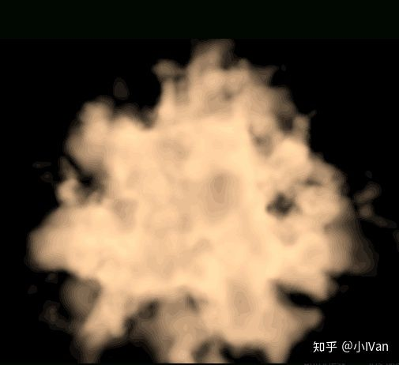
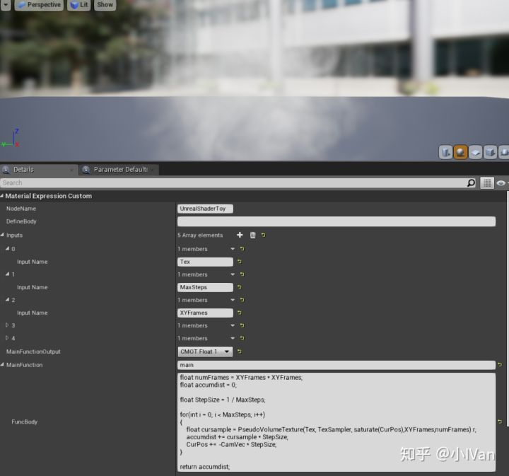
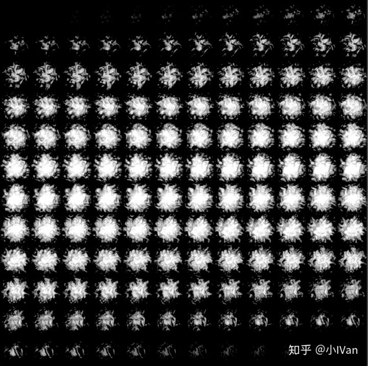
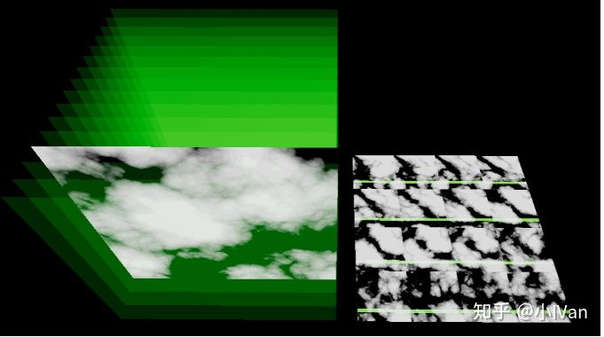
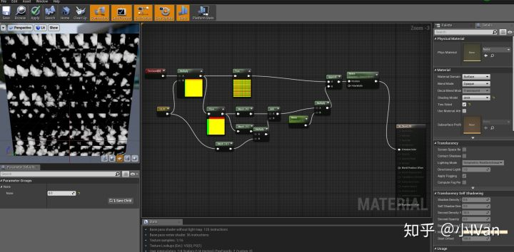
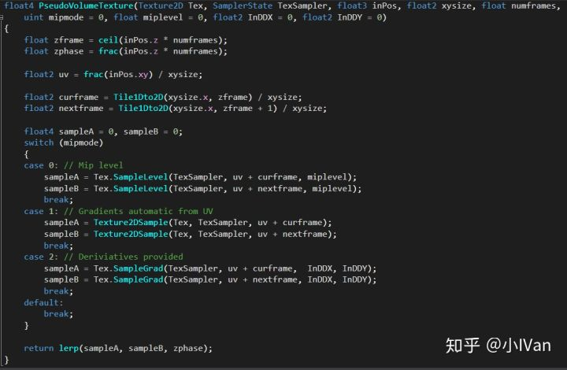
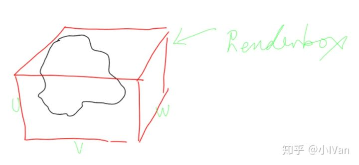
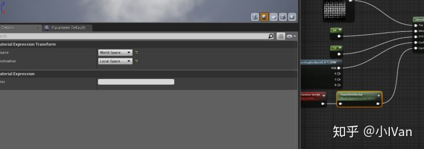
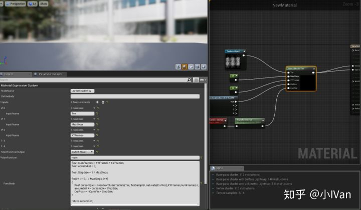
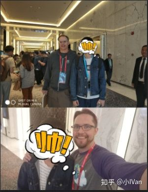

# 3D体纹理云

按照惯例默默膜拜ryan大佬三分钟。

下面还是先上效果吧（3Dexture）

<iframe allowfullscreen="" src="https://www.zhihu.com/video/983450198164529152?autoplay=false&amp;useMSE=" frameborder="0"></iframe>

是个非常简单的体积云渲染（大佬请直接右上关闭浏览器）。

前面一节已经总结了，体渲染现在就大致三种，spherehit快速查找表面，segmenthit对光线方向积分浓度，还有一种就是raytracing。我们要渲染烟雾这种东西的时候，需要对光纤方向进行浓度积分。

烟雾渲染还可以分两种，一种是使用3Dtexture还有一种是使用公式构建的方式。两种方式其实都可以渲染出不错效果的体积烟雾或体积云。

下面是我拿公式计算的，上面那个视频是3Dtexture计算的。

可以看到其实都可以得到不错的效果。两种方法的主要区别就是距离场的构建方法。剩下的渲染部分的几乎是一致的。

下面是伪3Dtexture的方法，公式计算的我就不介绍了。

可以看到距离场的获取方式是采一张伪3Dtexture。

这张伪3Dtexture长这样。因为虚幻不支持3Dtexture所以这里使用一张2D的序列贴图，然后把这张序列贴图叠成一个体纹理状，如下图所示：

这种提纹理可以用Houdini制作，也可以自己拿噪波生成，下面我给一个简单的生成方法吧：

这种假3Dtexture的sample函数：

可以看到消除堆叠锯齿的方法是使用插值：

堆叠锯齿

需要sample一张贴图，在2D情况下是使用UV坐标，三维体素纹理自然需要一个3D的参数来sample一个3Dtexture，把它叫做UVW吧。因为我们的体素纹理是一个方块，所以我们用一个3D单位cube来模拟它的UVW。我们获取这个渲染物体的boundingbox然后把它变成一个单位cube。

虚幻中可以通过这个节点拿到这个UVW坐标

摄像机要转换到local空间

Enjoy It ！

OpenDay见到了虚幻创始人和zak

看了zak 四年教程，他的声音早已非常熟悉，想想以前拿zak的教程当MP3听来练习英语听力的经历，感觉胸前的红领巾鲜艳了许多呢。希望有一天能成为他那么强的TA，Ryan大神没来有点小失落。
