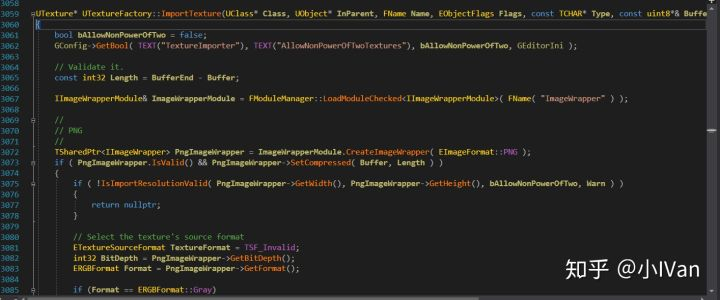
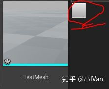
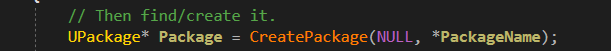
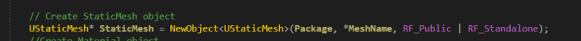
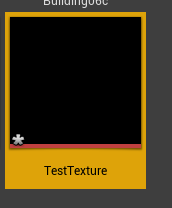
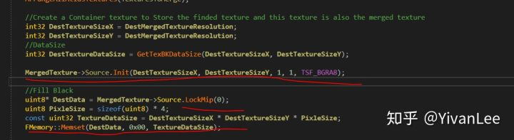

# 虚幻4渲染编程（工具篇）【第八卷：Asset  creation】**简介：**

有时候我们需要写工具创建资源，初始化资源，管理资源等需求，比如合并DC的时候需要重新创建贴图，管理材质的时候需要创建并指认材质球，设置材质球等。

------

在一切开始之前需要清楚虚幻的资源结构以及合编辑器的关系。首先虚幻中有大量的类型，UMaterial，MaterialInstance，Texture，StaticMesh等等，这些资源从外部导入到引擎的时候做了一次数据抽取，如贴图资源模型资源等。这些数据被放在了一个UObject里，然后这个UObject放在一个Package里。

拿贴图的数据导入为例，如下图所示。




引擎会抽取数据然后创建对应的UTexture。使用创建的UTexture填充其Source。所以Unreal的资源创建有一个固定格式

（1）New一个Package

（2）New一个对应的UObject，在此时指认Package合UObject

（3）向这个UObject里填充数据

（4）MarkDirty，通知资源浏览器这里创建了一个新资源，然后保存。

------

## **（1）Create Mesh Asset with c++**

先来一段简单的




按下按钮后创建一个新的模型资源，代码如下：

```text
FString CreatedMeshName = TEXT("TestMesh");
FString AssetPath = AssetDatas[0].PackagePath.ToString() + TEXT("/Content");
UPackage* NewMeshPack = CreatePackage(nullptr, *AssetPath);

UStaticMesh* NewStaticMesh = NewObject<UStaticMesh>(NewMeshPack, FName(*CreatedMeshName), RF_Public | RF_Standalone);

FAssetRegistryModule::AssetCreated(NewStaticMesh);
NewMeshPack->MarkPackageDirty();
```

过程也是非常简单的，首先先创建一个Package，然后New一个mesh，在NewObject方法中就会把这个新创建的UObject和Package指认，然后通知ContentBrower我们创建了这个新资源，请求它加载即可。

这里创建的是一个空的MeshAsset，如果想要给MeshAsset里加模型的顶点信息等，可以通过设置NewStaticMesh->SourceModels来给MeshAsset增加资源信息。

然后是我写的：

【1】创建Package




【2】创建Object




【3】初始化资源

```text
                        /************************************************************************/
			/* Init Static Mesh                                                     */
			/************************************************************************/
			StaticMesh->InitResources();
			StaticMesh->LightingGuid = FGuid::NewGuid();
			// Determine which texture coordinate map should be used for storing/generating the lightmap UVs
			const uint32 LightMapIndex = FMath::Min(MaxInUseTextureCoordinate + 1, (uint32)MAX_MESH_TEXTURE_COORDS - 1);
			// Add source to new StaticMesh
			for (FRawMesh& RawMesh : RawMeshes)
			{
				if (RawMesh.IsValidOrFixable())
				{
					FStaticMeshSourceModel& SrcModel = StaticMesh->AddSourceModel();
					SrcModel.BuildSettings.bRecomputeNormals = false;
					SrcModel.BuildSettings.bRecomputeTangents = false;
					SrcModel.BuildSettings.bRemoveDegenerates = true;
					SrcModel.BuildSettings.bUseHighPrecisionTangentBasis = false;
					SrcModel.BuildSettings.bUseFullPrecisionUVs = false;
					SrcModel.BuildSettings.bGenerateLightmapUVs = true;
					SrcModel.BuildSettings.SrcLightmapIndex = 0;
					SrcModel.BuildSettings.DstLightmapIndex = LightMapIndex;
					SrcModel.SaveRawMesh(RawMesh);
				}
			}
			// Copy materials to new mesh 
			//for (UMaterialInterface* Material : Materials)
			//{
			//	StaticMesh->StaticMaterials.Add(FStaticMaterial(Material));
			//}
			//Force to use one material to render this mesh, reducing draw call on ceil phong platform
			StaticMesh->StaticMaterials.SetNum(1);
			StaticMesh->StaticMaterials[0] = FStaticMaterial(MergeOneMaterial);

			//Set the Imported version before calling the build
			StaticMesh->ImportVersion = EImportStaticMeshVersion::LastVersion;

			// Set light map coordinate index to match DstLightmapIndex
			StaticMesh->LightMapCoordinateIndex = LightMapIndex;

			// setup section info map
			for (int32 RawMeshLODIndex = 0; RawMeshLODIndex < RawMeshes.Num(); RawMeshLODIndex++)
			{
				const FRawMesh& RawMesh = RawMeshes[RawMeshLODIndex];
				TArray<int32> UniqueMaterialIndices;
				for (int32 MaterialIndex : RawMesh.FaceMaterialIndices)
				{
					UniqueMaterialIndices.AddUnique(MaterialIndex);
				}

				int32 SectionIndex = 0;
				for (int32 UniqueMaterialIndex : UniqueMaterialIndices)
				{
					StaticMesh->SectionInfoMap.Set(RawMeshLODIndex, SectionIndex, FMeshSectionInfo(UniqueMaterialIndex));
					SectionIndex++;
				}
			}
			StaticMesh->OriginalSectionInfoMap.CopyFrom(StaticMesh->SectionInfoMap);

			// Build mesh from source
			StaticMesh->Build(false);
			StaticMesh->PostEditChange();
```

【4】MarkDirty然后通知资源浏览器

```text
StaticMesh->MarkPackageDirty();
```

告知资源浏览器

```text
FAssetRegistryModule::AssetCreated(StaticMesh);
```

## **（2）Create Material Instance Asset with c++**

```text
FString MaterialInsBaseName = "MI_";
MaterialInsBaseName += AssetDatas[i].AssetName.ToString();

FString AssetPath = AssetDatas[i].PackagePath.ToString() + TEXT("/Content");
UPackage* NewMatInsPack = CreatePackage(nullptr, *AssetPath);

UMaterialInstanceConstantFactoryNew* Factory = NewObject<UMaterialInstanceConstantFactoryNew>();

FAssetToolsModule& AssetToolsModule = FModuleManager::LoadModuleChecked< FAssetToolsModule >("AssetTools");

UMaterialInstanceConstant* ReplaceMI = Cast<UMaterialInstanceConstant>(AssetToolsModule.Get().CreateAsset(MaterialInsBaseName, FPackageName::GetLongPackagePath(AssetPath), UMaterialInstanceConstant::StaticClass(), Factory));

ReplaceMI->MarkPackageDirty();
ReplaceMI->PreEditChange(nullptr);
ReplaceMI->PostEditChange();

if (ReplaceMI != nullptr)
{
	SelectedMeshAssets->SetMaterial(0, ReplaceMI);
	SelectedMeshAssets->MarkPackageDirty();
}
	

PackagesToSave.Add(NewMatInsPack);
PackagesToSave.Add(AssetDatas[i].GetPackage());
//Save the assets
FEditorFileUtils::PromptForCheckoutAndSave(PackagesToSave, false, /*bPromptToSave=*/ false);
```

除了自己NewObject之外，还可以用AssetTools提供的AssetFactory来创建资源。原理都是一样的，只不过AssetFactory比我们自己NewObject要多做一些保险的事情。


## **（3）Create Texture with c++**




```text
FString CreatedMeshName = TEXT("TestTexture");
FString AssetPath = AssetDatas[0].PackagePath.ToString() + TEXT("/Content");
UPackage* NewMeshPack = CreatePackage(nullptr, *AssetPath);

UTexture2D* NewTexture = NewObject<UTexture2D>(NewMeshPack, FName(*CreatedMeshName), RF_Public | RF_Standalone);

FAssetRegistryModule::AssetCreated(NewTexture);
NewMeshPack->MarkPackageDirty();
```

这会创建一个空的Texture2D，可以在代码中设置其格式尺寸等。

```text
Texture->PlatformData = new FTexturePlatformData();
Texture->PlatformData->SizeX = width;
Texture->PlatformData->SizeY = height;
Texture->PlatformData->PixelFormat = PF_R8G8B8A8;

FTexture2DMipMap* Mip = new(Texture->PlatformData->Mips) FTexture2DMipMap();
Mip->SizeX = width;
Mip->SizeY = height;
Mip->BulkData.Lock(LOCK_READ_WRITE);
uint8* TextureData = (uint8 *) Mip->BulkData.Realloc(height * width * sizeof(uint8)*4);
FMemory::Memcpy(TextureData, pixels, sizeof(uint8) * height * width * 4);
Mip->BulkData.Unlock();
```

但是这里创建的是platformdata里的数据，一个Texture2D的UAssets的真正数据是存在Source里的，当打包之后会填充到platformdata里，Source在打包后会消失，如果是要在EditorTime创建数据需要填充Source数据




给一段示例代码：

```text
//Just editor time
void OceanRender::DrawTwiddleIndiceTexture_CPU(UTexture2D* RenderTexture2D)
{
#if WITH_EDITORONLY_DATA
	if (RenderTexture2D == nullptr) return;
	
	uint32 SizeX = RenderTexture2D->GetSizeX();
	uint32 SizeY = RenderTexture2D->GetSizeY();

	uint8* TextureData = RenderTexture2D->Source.LockMip(0);
	uint8 PixleSize = sizeof(uint8) * 4;
	const uint32 TextureDataSize = SizeX * SizeY * PixleSize;

	TArray<FColor>ColorData;
	ColorData.AddDefaulted(SizeX * SizeY * 4);
	for (uint32 i = 0; i < SizeX; i++)
	{
		for (uint32 j = 0; j < SizeY; j++)
		{
			ColorData[i * SizeX + j].R = (float)i / (float)SizeX * 255;
			ColorData[i * SizeX + j].G = (float)j / (float)SizeY * 255;
		}
	}

	FMemory::Memcpy(TextureData, ColorData.GetData(), TextureDataSize);
	RenderTexture2D->Source.UnlockMip(0);
	RenderTexture2D->UpdateResource();
#endif
}
```

其实创建其它资源的方法也都类似，都是先new一个package，然后在newobject的时候把object和package指认，然后设置这个新的object，然后通知资源管理器加载它，最后保存即可。

Enjoy it。
