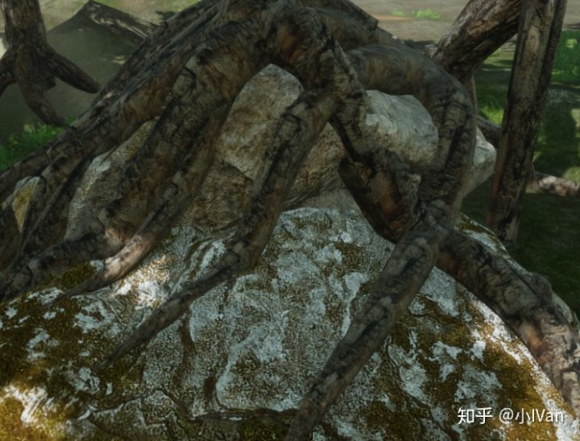
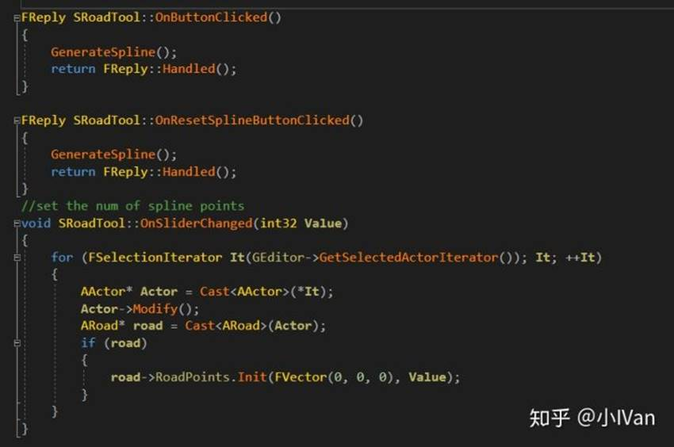
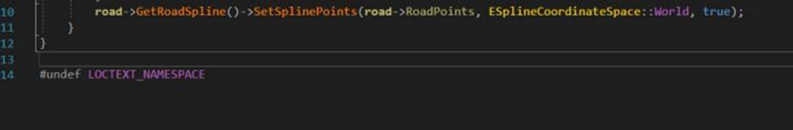

# 虚幻4渲染编程（工具篇）【第二卷：曲线生成工具】

2018年12月26日 星期三

15:58

 

先上效果吧：

我们有一个工具界面，和一项具体的生成功能，逻辑是在EditorTime中完成的

如果是在构造函数中做生成逻辑有几大缺点：

（1）生成是在构造函数执行的，虽然只在物体构建的时候才执行，但是还是有一次消耗。

（2）需要控制构造顺序，假设藤蔓2的位置和藤蔓1的位置是有关系的且相互影响，上面那个解决方案就无法实现了。

而我的方案完美解决了这两个问题，因为我把构造逻辑放到了EditorTime里，这样，藤蔓在Runtime的时候使用的就是静态数据了。

 

首先我们需要写个工具，来把Spline的计算放到EditorTime去，这样Runtime使用的就是静态数据了。

首先来捋一下步骤

（1）首先我们要有一个特殊的类，来给我们的工具来操作

（2）我们需要有一个操作这个类型的物体的工具

（3）我们需要完成这个工具操作这个特殊类的方法

 

第一步我们先从Actor派生一个类出来

 

这个类里面有个splinecomponent，但是我们人工操作它并且拖拽SplinePoint太麻烦，所以我们用工具来生成spline的这些点

第二步：

是我们的工具类（下面是工具类头文件）

一部分是我们工具的按钮，一部分是工具需要的方法

首先在construct函数中画出我们的工具UI

void SRoadTool::Construct(const FArguments& InArgs)

{

        ChildSlot

        [

                SNew(SVerticalBox)

                //-------------------------------------------//

                +
SVerticalBox::Slot()

                [

                        SNew(SHorizontalBox)

                        +
SHorizontalBox::Slot()

                        [

                                SNew(SBox)

                                .HeightOverride(20.0f)

                                .WidthOverride(120.0f)

                                [

                                        SNew(STextBlock)

                                        .Text(LOCTEXT("TextDefaultValue0", "SplinePointNum :"))

                                ]

                        ]

                        +
SHorizontalBox::Slot()

                        [

                                SNew(SBox)

                                .HeightOverride(20.0f)

                                .WidthOverride(60.0f)

                                [

                                        SNew(SSpinBox<int32>)

                                        .MaxValue(100)

                                        .MinValue(0)

                                        .OnValueChanged(this,
&SRoadTool::OnSliderChanged)

                                ]

                        ]

                ]

                //-------------------------------------------//

                +
SVerticalBox::Slot()

                [

                        SNew(SHorizontalBox)

                        +
SHorizontalBox::Slot()

                        [

                                SNew(SBox)

                                .HeightOverride(20.0f)

                                .WidthOverride(60.0f)

                                [

                                        SNew(STextBlock)

                                        .Text(LOCTEXT("TextDefaultValue1", "SplineSecLength :"))

                                ]

                        ]

                        +
SHorizontalBox::Slot()

                        [

                                SNew(SSpinBox<float>)

                                .MaxValue(200.0f)

                                .MinValue(0)

                                .OnValueChanged(this,
&SRoadTool::OnSliderSecLengthChanged)

                        ]

                ]

                //-------------------------------------------//

                +
SVerticalBox::Slot()

                [

                        SNew(SHorizontalBox)

                        +
SHorizontalBox::Slot()

                        [

                                SNew(SBox)

                                .HeightOverride(20.0f)

                                .WidthOverride(120.0f)

                                [

                                        SAssignNew(ButtonPtr,
SButton)

                                        .OnClicked(this,
&SRoadTool::OnButtonClicked)

                                        .Text(LOCTEXT("Test", "GenerateSpline"))

                                ]

                        ]

                        +
SHorizontalBox::Slot()

                        [

                                SNew(SBox)

                                .HeightOverride(20.0f)

                                .WidthOverride(120.0f)

                                [

                                        SAssignNew(ButtonPtr,
SButton)

                                        .OnClicked(this,
&SRoadTool::OnResetSplineButtonClicked)

                                        .Text(LOCTEXT("Test2", "ResetSpline"))

                                ]

                        ]

                ]

                //---------------------------------------------//

        ];

}

然后是实现绑定按钮的点击的回调函数

第三步：

完成工具类的功能性函数

void SRoadTool::GenerateSpline()
 {
         for (FSelectionIterator It(GEditor->GetSelectedActorIterator()); It; ++It)
         {
                 AActor* Actor = Cast<AActor>(*It);
                 Actor->Modify();
                 ARoad* road = Cast<ARoad>(Actor);

if (road == nullptr) return;
                 if (road->RoadPoints.Num() < 1) return;

//find the first point of spline
                 FHitResult hitresult;
                 RayTracingHit(road->GetActorLocation(), FVector(0, 0, -1), 100.0f, hitresult, road);
                 road->RoadPoints[0] = hitresult.ImpactPoint;
                 FVector LastPointLoc = hitresult.ImpactPoint;
                 FVector RayStart = hitresult.ImpactPoint;
                 FVector LastRayHitNorm = hitresult.ImpactNormal;
                 
                 for (int32 i = 1; i < road->RoadPoints.Num(); i++)
                 {
                         FVector ForwardVec = FVector::CrossProduct(road->GetActorRightVector(), LastRayHitNorm);
                         RayStart = ForwardVec * RoadSecLength + LastPointLoc + LastRayHitNorm * 50;

bool bHit = RayTracingHit(RayStart, -LastRayHitNorm, 100.0f, hitresult, road);
                         if (bHit == false)
                         {
                                 RayTracingHit_Sphere(LastPointLoc, -LastRayHitNorm, 100.0f, hitresult, road);
                         }
                         

road->RoadPoints[i] = hitresult.ImpactPoint;
                         LastPointLoc = hitresult.ImpactPoint;
                         LastRayHitNorm = hitresult.ImpactNormal;
                         
                 }
                 road->GetRoadSpline()->SetSplinePoints(road->RoadPoints, ESplineCoordinateSpace::World, true);
         }
 }

我们用射线检测场景的情况然后把点布上去即可。这样我们就完成了在EditorTime的计算，RunTime的时候使用的是EditorTime的静态数据。

Enjoy it！

 

来自 <<https://zhuanlan.zhihu.com/p/42175952>> 
