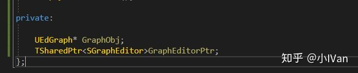
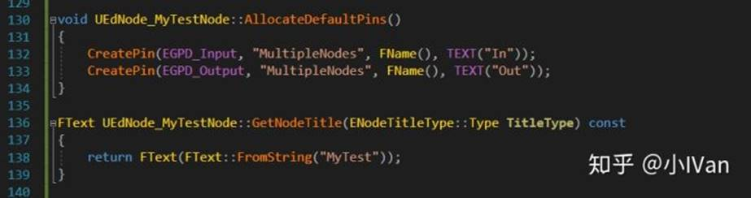
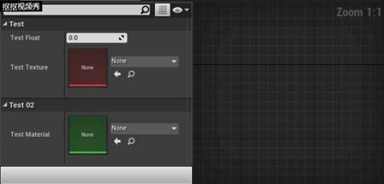
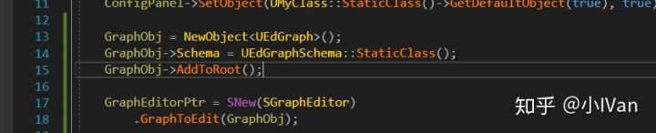
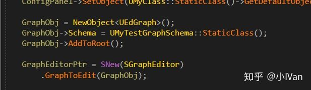

# 虚幻4渲染编程（工具篇）【第四卷：CustomizeDetailPanelForPlugin

2018年12月26日 星期三

15:59

 

在这里强烈吐槽一下

epic的官方文档，有些文档写了等于什么都没写！！！十分粗略！

来给篇链接感受一下

[Details 面板自定义api.unrealengine.com](http://link.zhihu.com/?target=https%3A//api.unrealengine.com/CHN/Programming/Slate/DetailsCustomization/index.html)

http://link.zhihu.com/?target=https%3A//api.unrealengine.com/CHN/Programming/Slate/DetailsCustomization/index.html)

我表示90%的人看了这文档后不知道在说什么，什么都写不出来。然而这部分知识其实对我们写各种工具十分重要。先上效果吧：

如果我们想写这么一个界面的话，全部自己手写各种SNew的话至少要上千行代码，这实在太夸张了。为了节省时间我们肯定要选择最简单的方式来，那么就是使用虚幻已有的组件。但是你会发现虚幻根本不让我们直接用这些组件。

正确的做法是使用虚幻的PropertyEditor模块来把我们需要的信息映射倒面板上，而不是一个一个手动写手动SNew。下面就来拆分一下我们要做一个复杂插件面板需要做哪些事情：

【1】我们需要一个插件window，这一步在前几卷中已经详细列出了开发方法。

【2】我们需要一个类作为我们的容器，我们向这个类中填各种数据。

【3】我们需要一个派生自IDetailCustomization的类来重新定义容器类的Detail信息

【4】我们需要一个派生自IDetailRootObjectCustomization的类来root我们的容器类

【5】我们需要吧容器类和IDetailsView类绑定，然后在UI上创建IDetailsView

可能步骤有点多，还是感觉很晕，那么下面就一步一步来实现它吧

 

首先我们要创建插件的slate类，注意那个IDetailsView，它就是将会被创建倒工具UI上的Slate。

然后我们要定义两个Customization类

最后是我们用来映射属性的容器类

然后在源文件中我们去实现插件window的slate的construct

这里我们先拿到PropertyEditor模块然后通过它创建DetailView，然后这个detailview需要和我们的容器类再绑定。最后在UI上画出容器类

下面是完整代码

头文件：

\#pragma once

\#include "Editor/PropertyEditor/Public/IDetailCustomization.h"
 \#include "IDetailRootObjectCustomization.h"
 \#include "IDetailsView.h"
 \#include "FoligeFarmer.generated.h"

DECLARE_DELEGATE(FSFoligeFarmerBackToMainUI);

class FMyCustomization;
 class AMyClass;

class SFoligeFarmer : public SCompoundWidget
 {
 public:
         SLATE_BEGIN_ARGS(SFoligeFarmer) {}
         SLATE_EVENT(FSFoligeFarmerBackToMainUI, EventDelegate_BackToMainUI)
         SLATE_END_ARGS()

void Construct(const FArguments& InArgs);

TSharedPtr<IDetailsView> ConfigPanel;

};

class FMyCustomization : public IDetailCustomization
 {
 public:
         // IDetailCustomization interface
         virtual void CustomizeDetails(IDetailLayoutBuilder& DetailBuilder) override;

static TSharedRef< IDetailCustomization > MakeInstance();

};

class FRootObjectCustomization : public IDetailRootObjectCustomization
 {
 public:
         /** IDetailRootObjectCustomization interface */
         virtual TSharedPtr<SWidget> CustomizeObjectHeader(const UObject* InRootObject) override
         {
                 return SNullWidget::NullWidget;
         }
         virtual bool IsObjectVisible(const UObject* InRootObject) const override { return true; }
         virtual bool ShouldDisplayHeader(const UObject* InRootObject) const override { return false; }
 };

UCLASS()
 class UMyClass : public UObject
 {
         GENERATED_BODY()
 public:

UPROPERTY(EditAnywhere, category = "Test")
         float TestFloat;

UPROPERTY(EditAnywhere, category = "Test")
         UTexture2D* TestTexture;

UPROPERTY(EditAnywhere, Category = "Test02")
         UMaterial* TestMaterial;

};

源文件

\#include "FoligeFarmer.h"
 \#include "PropertyEditing.h"

void SFoligeFarmer::Construct(const FArguments& InArgs)
 {
         auto& PropertyModule = FModuleManager::LoadModuleChecked< FPropertyEditorModule >("PropertyEditor");
         FDetailsViewArgs DetailsViewArgs(false, false, true, FDetailsViewArgs::HideNameArea, true);
         ConfigPanel = PropertyModule.CreateDetailView(DetailsViewArgs);
         ConfigPanel->SetRootObjectCustomizationInstance(MakeShareable(new FRootObjectCustomization));
         ConfigPanel->SetObject(UMyClass::StaticClass()->GetDefaultObject(true), true);

ChildSlot

        [

                SNew(SVerticalBox)

                +
SVerticalBox::Slot()

                .AutoHeight()

                [

                        SNew(SBox)

                        .WidthOverride(300)

                        .MinDesiredWidth(300)

                        .MaxDesiredWidth(300)

                        [

                                SNew(SBorder)

                                [

                                        ConfigPanel.ToSharedRef()

                                ]

                        ]

                ]

        ];

}

\#define LOCTEXT_NAMESPACE "MyEditorModule"

TSharedRef< IDetailCustomization > FMyCustomization::MakeInstance()
 {
         return MakeShareable(new FMyCustomization);
 }

void FMyCustomization::CustomizeDetails(IDetailLayoutBuilder& DetailBuilder)
 {
         // This is where the core of the customization code will go.
         IDetailCategoryBuilder& Cat = DetailBuilder.EditCategory(TEXT("TestFloat"));

TArray< TWeakObjectPtr< UObject > > Objects;
         DetailBuilder.GetObjectsBeingCustomized(Objects);

//TWeakObjectPtr< AMyClass > MyObject = Cast< AMyClass >(Objects[0].Get());

Cat.AddCustomRow(LOCTEXT("MyWarningRowFilterString", "Search Filter Keywords"))
                 .WholeRowContent()
                 [
                         SNew(STextBlock)
                         .Text(LOCTEXT("MyWarningTest", "BaseString should not be empty!"))
                 ];
         //DetailBuilder.ForceRefreshDetails();
 }

\#undef LOCTEXT_NAMESPACE

现在问题来了，怎么把UI里的数据拿出来呢。答案就在我们绑定的CDO里，我们直接拿CDO里的数据就可以了。

 

最后再来梳理下整个思路：

【1】我们在敲工具的时候发现，如果这个工具里有大量的数据，需要加载一个物体的属性，这时候如果还是自己去手动snew的话是个非常恐怖的工作量，为了避免，所以我们使用虚幻自带的数据映射系统把数据映射倒我们的UI上。

【2】想要映射，就需要使用IDetailsView。而IDetailsView的创建是由PropertyEdtor模块负责的，创建了IDetailsView之后我们需要把想要映射的UObject和它进行绑定。绑定好以后加到我们的UI插槽里即可。

【3】具体的绑定和创建过程见上面的代码。

【4】我们在映射完物体的数据之后我们需要操作它啊，这时候怎么办呢，这时候就用到了

IDetailCustomization。我们可以在detail面板里加按钮，加各种我们自己snew的控件。

 

来自 <<https://zhuanlan.zhihu.com/p/46390835>> 

# 虚幻4渲染编程（工具篇）【第五卷：编辑器开发---上】

2018年12月26日 星期三

16:00

 

虚幻有众多的编辑器，功能十分强大。但是这并不能完全满足我们或者完全适应各种各样的项目或者团队。这时候我们就需要开发新的编辑器。

下面先上效果吧：

# 

我们如何开发一个可视化编辑器呢。需要做以下几步。

【1】需要一个被操作的类，这个类负责映射它的property倒editor。并且还要对这个被操作的类进行序列化，来保存我们编辑器对它编辑后的数据。

【2】需要一个UI对象，这个对象包含了编辑器的各个组件，detial，graph，node等，这些可视化的组件达成一个一致的目的就是在这些组件的配合下对被操作的类的数据进行编辑。

在前面几卷中已经做到了资源自定义（最原始的CDO），detail面板映射，那么下一步就是graph和graphnode了。先来看看graph。

一个graph主要需要三个东西UEdGraph，SGraphEditor，和UEdGraphSchema。其中UEdGraph就是我们编辑器的实例，UEdGraphSchema负责各种可视化链接，SGraphEditor则是slate对象。

 

 

我们加入如下代码即可看到我们的编辑窗口啦。

Enjoy it！

 

来自 <<https://zhuanlan.zhihu.com/p/46461617>> 

 

 

 

虚幻4渲染编程（工具篇）【第六卷：编辑器开发---中】

2018年12月26日 星期三

16:00

 

我们在开发好graph窗口后，下一步就是要能在工具中可视化编程。我们需要为我们的工具添加节点。

我们需要捋一下思路：

【1】我们需要再窗口里添加节点，我们需要一个UI的节点类。

【2】其次这个UI的节点类只是UI，当选中节点后它的Detail面板的属性数据是由UObject子类来提供的，也就是逻辑层的节点类。

【3】我们有了节点，我们要创建它，回想以下其它虚幻内置的编辑器的节点创建，是右键，弹出一个节点选择面板。所以现在我们需要一个Action类，这个类需要反应倒我们右键弹出的那个窗口里，然后再由这个action创建UI节点。

【4】怎么样让Graph识别右键菜单的Action呢，这时候就需要给Graph一个UEdGraphSchema类。

要给一个Graph加入可视化节点，大改就需要如上步骤。下面就来一步一步实现它吧。

 

我们分别再声明两个类（我的代码精简得不能再精简了，简明扼要说明核心函数实现核心效果）

 

FMyTestSchemaAction是邮件菜单类，它为Graph提供了右键菜单选项。UMyTestGraphSchema类则是Graph类的控件类，它负责Graph中节点的链接，连线的各种逻辑。我们只要再这个类的GetGraphContextActions函数中添加了我们自己的FMyTestSchemaAction，就可以再右键菜单中找到我们需要创建的节点。

还需要把UMyTestGraphSchema指认给我们的Graph

效果如下：

但是这个时候点下去什么都不会发生，因为我们没有给FMyTestSchemaAction任何创建动作。

我们需要在FMyTestSchemaAction中补上执行创建的操作

效果如下：

Enjoy it ！

 

来自 <<https://zhuanlan.zhihu.com/p/46508807>> 
