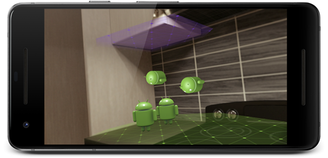

#      使用锚点   

使用锚点可以让虚拟物体在 AR 场景中看起来待在原地不动。

## 为什么使用锚点？

由于 ARCore 的[环境理解](https://developers.google.cn/ar/discover/concepts?hl=zh-cn#environmental_understanding)会在 AR 体验中更新，虚拟物体可能看起来远离放置位置。  这会影响您的应用的真实感和用户体验。

锚点可以确保物体在空间中看起来保持相同的位置和方向，从而帮助您维持现实世界中放置的虚拟物体的幻觉。

## 锚点的工作原理

如果您对锚点的使用不熟悉，查看现实世界空间和姿态会很有用。

- 现实世界空间
  - 放置摄像头和物体的坐标空间
  - 摄像头和物体在现实世界空间中的位置会在帧与帧之间更新
- 姿态
  - 表示物体在现实世界空间中的位置和方向

创建锚点时，请使用能够描述锚点相对于当前帧现实世界估算的位置和方向的姿态。

您可以将一个或多个物体连接到此锚点。 锚点和连接到它上面的物体看起来会待在它们在现实世界中的放置位置。  随着锚点姿态在每个帧中进行调整以适应现实世界空间更新，锚点将相应地更新物体的姿态。

您可以向同一个锚点连接多个物体，确保这些物体能够保持它们的相对位置和方向，即使在锚点姿态调整的情况下也能如此。

## 在您的场景中使用锚点

要在您的场景中使用锚点，您的代码应当满足以下条件：

- 在可跟踪对象（例如平面）或 ARCore 会话的上下文中创建锚点。
- 将一个或多个物体连接到锚点。

锚点可以在场景的物体中支持不同的位置行为。

确定锚点上下文以及需要为场景物体使用多少锚点取决于您的 AR 场景所需的位置行为。 请参阅以下部分了解更多信息。

### 选取锚点上下文

使用可跟踪对象或 ARCore 会话将锚点添加到您的场景中。

| 当您希望物体具备以下行为时                                   | 请将锚点连接到以下目标 |
| ------------------------------------------------------------ | ---------------------- |
| 看起来“焊接”到可跟踪对象上，并与可跟踪对象具有相同的旋转效果。 包括：               看起来粘在平面表面              保持相对于可跟踪对象的位置，例如漂浮在可跟踪对象的上方或前方 | 可跟踪对象             |
| 在整个用户体验期间看起来以相同姿态待在现实世界空间中         | ARCore 会话            |

### 锚定一个或多个物体

您可以将一个或多个物体连接到一个锚点。 一般来说，这些物体与下列一项或多项具有空间关系：

- 对象之间
- 可跟踪对象，例如平面
- 现实世界空间中的位置

## 锚点指南

有效使用锚点可以提升您的应用的真实感和性能。

连接到附近锚点的物体会在整个 AR 体验期间看起来逼真地保持它们的位置和彼此之间的相对位置。

仅使用您需要的锚点有助于减少 CPU 开销。

### 尽可能重用锚点

在大多数情况下，您应当为多个靠近的物体使用同一个锚点，而不是为每个物体创建一个新锚点。

如果物体需要保持与现实世界空间中的某个可跟踪对象或位置之间独特的空间关系，请为物体使用新锚点。

请记住，如果场景中的每个物体都有自己的锚点，则这些锚点将独立调整物体姿态，以响应 ARCore 在每一帧中对现实世界空间的估算。 独立锚定的物体可以相对于彼此平移或旋转，从而破坏虚拟物体的相对位置应保持不变的 AR 场景的幻觉。

**示例**
 例如，假设您的应用可以让用户在房间内布置虚拟家具。  当用户打开应用时，ARCore 会以平面形式开始跟踪房间中的桌面和地板。  用户在桌面上放置一个虚拟台灯， 然后在地板上放置一把虚拟椅子。

此时，您的场景应将一个锚点连接到桌面平面，将另一个锚点连接到地板平面。

如果用户向桌面添加另一个虚拟台灯，您可以重用已经连接到桌面平面的锚点。  这样，两个台灯看起来都粘在桌面平面上，并保持它们之间的相对位置。  椅子也会保持它相对于地板平面的位置。

### 保持物体靠近锚点

锚定物体时，请确保它们靠近您正在使用的锚点。  避免将物体放置在离锚点几米远的地方，以免由于 ARCore 更新现实世界空间坐标而产生意外的旋转运动。

如果您需要将物体放置在离现有锚点几米远的地方，请创建一个更靠近此位置的新锚点，并将物体连接到新锚点。

### 分离未使用的锚点

请分离您不再需要的任何锚点，以便提升应用的性能。

对于每个可跟踪对象，您的应用都会产生一定的 CPU 开销，ARCore 不会释放具有连接锚点的可跟踪对象。

Except as otherwise noted, the content of this page is licensed under the [Creative Commons Attribution 4.0 License](https://creativecommons.org/licenses/by/4.0/), and code samples are licensed under the [Apache 2.0 License](https://www.apache.org/licenses/LICENSE-2.0). For details, see our [Site Policies](https://developers.google.cn/terms/site-policies?hl=zh-cn). Java is a registered trademark of Oracle and/or its affiliates.

​              上次更新日期：一月 14, 2019     