# MagicLeapOne拆解

 	这里有好多需要说的。让我们从硬件规格开始：

 	Nvidia [Te](http://www.elecfans.com/tags/te/)gra X2 （Parker） SoC 配备两颗 Denver 2.0 64-bit 核心和四颗 [ARM](http://www.elecfans.com/tags/arm/) Cortex A57 64-bit 核心

​	集成了基于 Pascal 的 [GPU](http://www.elecfans.com/tags/gpu/) 配备256个 CUDA 核心

 	8 GB [RAM](http://www.elecfans.com/tags/ram/)

 	128 GB 板载储存

 	Bluetooth 4.2，[Wi-Fi](http://www.elecfans.com/tags/wi-fi/) 802.11ac/b/g/n，[USB](http://www.hqchip.com/app/576)-C，3.5 mm 耳机[接口](http://www.hqchip.com/app/1039)

 	这颗 Nvidia 的 SoC 为汽车应用设计，并在[自动驾驶](http://www.elecfans.com/tags/自动驾驶/)汽车中占有重要的地位，包括 Teslas 。这看起来像是非主流的使用方法，直到你明白 Magic Leap 用于定位和理解环境的多个[传感器](http://www.hqchip.com/app/835)阵列多像是一台自动驾驶的汽车。

 	在 Magic Leap 声称这个头戴设备有超凡脱俗的体验后，我们必然是要自己尝试一下的。

 	[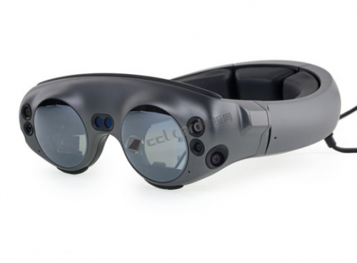](http://file.elecfans.com/web1/M00/94/1E/pIYBAFztIHCAfI2BAAJ-mm1lLMs786.png)

 	多亏了我们可靠的[红外](http://www.hqchip.com/app/104)线相机，我们才能看到在鼻梁上方收集深度信息的频闪红外 [LED](http://www.hqchip.com/app/957) ，和我们在 iPhone X 上，甚至更早的 Kinect 上找到的原理相似。

 	如果你仔细观察，你还可以在每个镜头中发现四个额外的红外 LED（我们马上会研究这几个传感器）。

 	[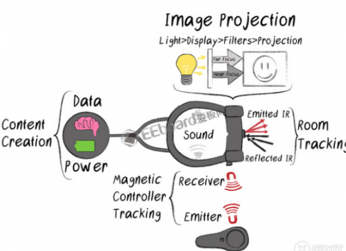](http://file.elecfans.com/web1/M00/93/C6/o4YBAFztIFWAdrhTAAKGt6LkrLs676.png)

 	在我们开始之前，先开开眼界：

 	内容的创建始于Lightpack。它提供电源并处理信息，向头戴设备发送图像和声音数据。

 	同时， Lightwear 头戴设备会追踪控制器的位置和方向，定位你周围的环境来帮助插入虚拟元素。

 	虚拟元素使如何产生的则完全是另外一个话题。

 	

 	“虚拟现实”很复杂，增加你在屏幕上看到的东西是一回事（就像智能手机或有外置摄像头反馈的 [VR](http://www.elecfans.com/vr/441329.html) 显示屏）

 	更难的是增加显示，未见过滤的显示直接进入你的眼帘。要摆脱这种错觉，Magic Leap One 使用了几种牛逼的技术：

 	波导显示——本质上是一块透明的屏幕从侧面悄无声息的点亮。波导（ Magic Leap 称之为“光子光场芯片”）引导光线——在这种情况下，一幅图像，穿过薄薄的一层玻璃，放大并进入你的眼睛。

 	Focus planes —— 在 VR [显示器](http://www.hqchip.com/app/964)上，一切都是同时聚焦的。显示则不是这样——有些东西看起来很清晰但其他的看起来是模糊的，决定于你的眼睛对焦在哪。Magic Leap 通过合成多个波导来模仿这种现象——将图像范围清晰的和模糊的区域。

 	[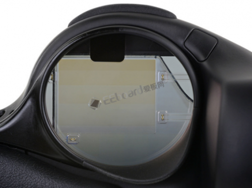](http://file.elecfans.com/web1/M00/93/C6/o4YBAFztIFaAT5KSAAPKl1wcNwM260.png)

 	[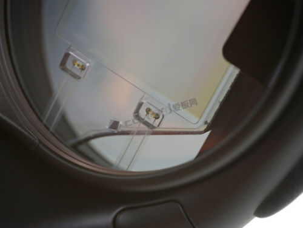](http://file.elecfans.com/web1/M00/93/C6/o4YBAFztIFeAWm2cAAOzbWvXm_I189.png)

 	[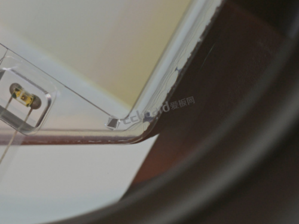](http://file.elecfans.com/web1/M00/93/C6/o4YBAFztIFeAb7viAAPR6kqHcH4846.png)

 	让我们看看这东西都藏了什么[光学](http://www.hqchip.com/app/960)的宝藏！一个快速测试排除了偏光片——我们必须要挖掘的更深一些来获得一些发现。

 	镜片的内部出人意料的丑陋，配备了频闪红外 LED ，一个有明显条纹的波导“显示”区域和一些奇怪的胶水使用。

 	波导由六个不那么漂亮的[层压](http://www.hqpcb.com/zhuoluye9)成，每层都有一个小的气隙。

 	边缘看起来像是手绘成的黑色，可能会最大限度地减少内部反射和干扰。

 	

 	[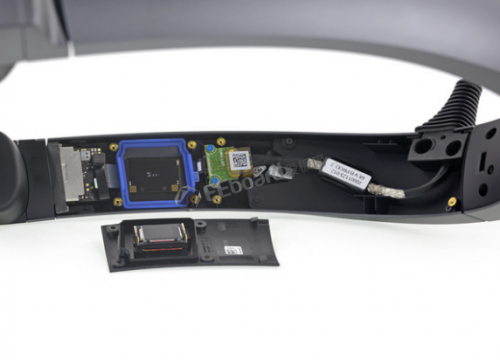](http://file.elecfans.com/web1/M00/93/C8/o4YBAFztIImAHmZAAALQZE4hcLE507.png)

 	[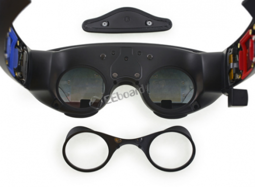](http://file.elecfans.com/web1/M00/94/20/pIYBAFztIKWAPCoUAANCxUebO0A870.png)

 	进入头带的内部，我们主要到一个1级[激光](http://m.elecfans.com/article/611535.html)的调遣。这在呆在你研究上的东西里找到似乎是件很可怕的事情，但实际上在日常使用中是安全的，并不比 CD 播放器更危险。

 	旋开标准的梅花螺丝并移除了盖板表明两个扬声器中的第一个，通过弹簧[触点](http://www.hqchip.com/app/1030)连接，并通过色彩[标记](https://data.hqchip.com:4006/t/yM)的垫圈保护着——到目前为止，可修复性很强。

 	同样隐藏在这块盖板下面的是：设备唯一的线缆的两个上端和一些帮助调整位置的磁力点。

 	但是从头带右侧突出的那个奇怪的黑色小盒子是什么？

 	[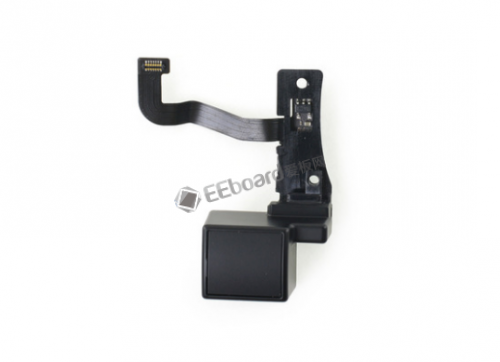](http://file.elecfans.com/web1/M00/93/C8/o4YBAFztIIqAclpUAAIKCy712x0612.png)

 	[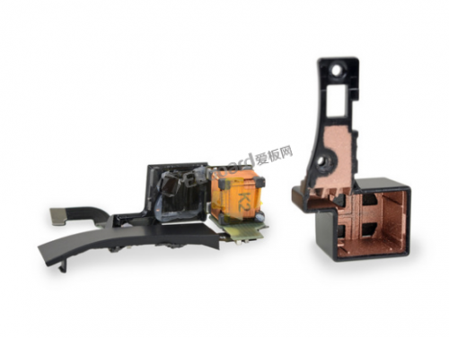](http://file.elecfans.com/web1/M00/94/20/pIYBAFztIKaASK5OAAIlMI_hxmk012.png)

 	[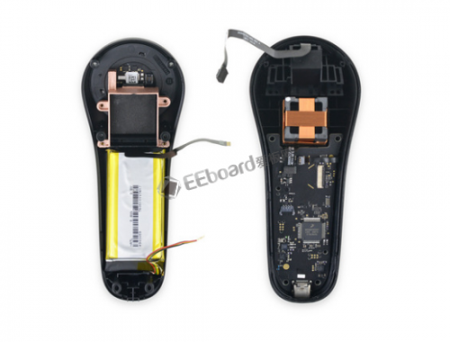](http://file.elecfans.com/web1/M00/93/C8/o4YBAFztIIuAXUGjAAKQ4rukDuE347.png)

 	调查显示是一个六自由度[磁传感器](http://www.hqchip.com/app/953)线圈，用于跟踪控制器的位置。

 	[测量](http://www.hqchip.com/app/851)三个垂直磁场的强度以确定控制器相对于耳机的位置和方向。

 	拆开控制器以后，我们找到了跟踪器（更大的）发射端和一个用于驱动的 8.4 Wh [电池](http://www.hqchip.com/app/858)。

 	线圈外壳镀的铜似乎是用来屏蔽电磁干扰，同时让磁场穿过。

 	干扰可以解释跟踪器的奇怪位置，这可能是一个临时解决方案。这个“老”技术，对于左撇子的使用可能会更糟糕。

 	没有图片：我们也找到了一个看起来像是环有 LED 的定制部件（可能是为了未来了光追踪硬件？）

 	[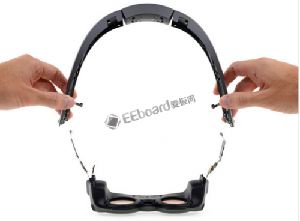](http://file.elecfans.com/web1/M00/94/22/pIYBAFztIPOAE-YUAAK68RUgYxU962.png)

 	[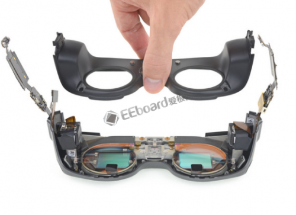](http://file.elecfans.com/web1/M00/94/22/pIYBAFztIPSAY1vCAANE-xucjYU291.png)

 	[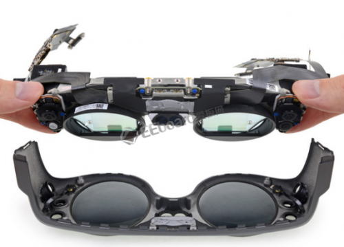](http://file.elecfans.com/web1/M00/94/22/pIYBAFztIPWAW0BLAAN77K3DTpg500.png)

 	在拆下头戴和内面板之后，我们可以有更好的视角来观察眼部跟踪红外发射器。我们注意到它们都是串联连接，而不是单独控制。

 	终于，Magic Leap 的核心：光学和显示部件就在我们的指尖上了。

 	我们终于到这了，所以快系好安全带。

 	[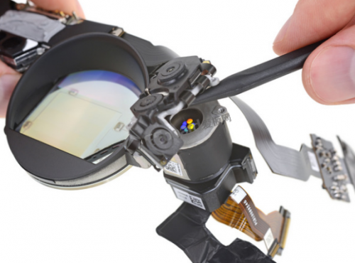](http://file.elecfans.com/web1/M00/94/22/pIYBAFztIPWAJyEfAAQcKbEF83U920.png)

 	[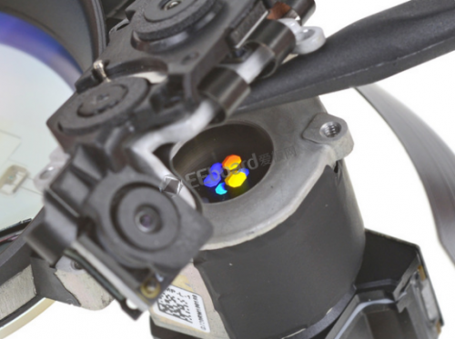](http://file.elecfans.com/web1/M00/94/22/pIYBAFztIPaAD4bzAATGOA61AxA652.png)

 	[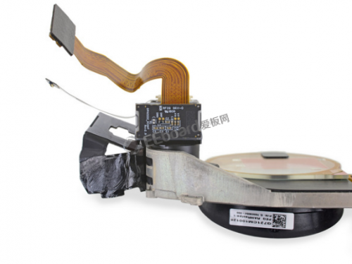](http://file.elecfans.com/web1/M00/93/CB/o4YBAFztINuAKcfnAALvUsnT-4o071.png)

 	拆下其中的一个外部传感器阵列，我们在下面发现了一个光学系统用来将图像传进波导。

 	这些明亮的颜色来自从衍射光栅反射的环境光，并不代表特定的颜色通道。

 	每个点工作在不同的深度——对应这单层的波导。

 	在背后，我们发现了世纪的显示设备：一个 OmniVision OP02222 场序彩色（FSC）LCOS 设备。这看起来是一个 OmniVision OP02222 的定制版本。

 	根据2016年的专利申请，KGOnTech 博客准确地猜到了这正是 Magic Leap 在做的事情。

 	[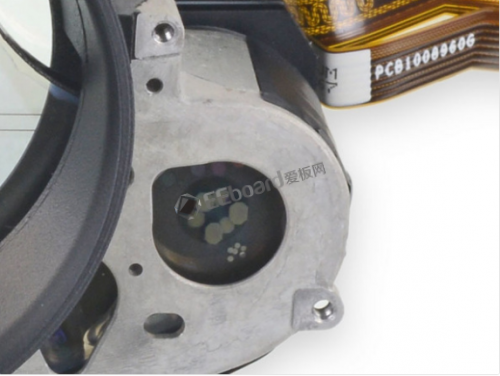](http://file.elecfans.com/web1/M00/93/CB/o4YBAFztINuATKEkAAQuO60tzL8618.png)

 	[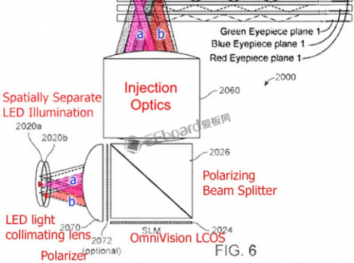](http://file.elecfans.com/web1/M00/94/22/pIYBAFztIPeAOXPSAANReWYT6Mg284.png)

 	[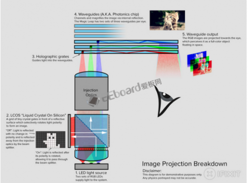](http://file.elecfans.com/web1/M00/94/23/pIYBAFztIPiANX0nAALRqZRIJFM685.png)

 	让我们更深入地了解光源和波导光学系统。

 	所以这六层都是干什么的？在两个不同的焦平面上有一个分离的波导来对应每个色彩通道（红绿蓝）。

 	如果没有特定于颜色的波导，每种颜色都会聚焦到稍有不同的点并使图像产生变形。

 	来自 Magic Leap 申请的 2016/0327789 专利的“Figure 6”对我们了解光学器件的内部如何工作有所启发。

 	为了方便你的理解，我们自己为这个系统绘制了一幅“长到没法正常阅读的图像”，但是有猫。

 	[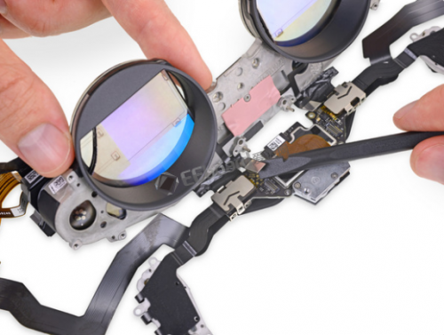](http://file.elecfans.com/web1/M00/93/CB/o4YBAFztIN2AXU5lAASK7Qblxcs360.png)

 	[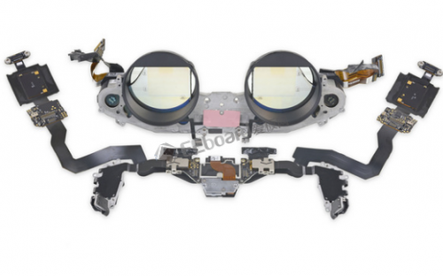](http://file.elecfans.com/web1/M00/93/CB/o4YBAFztIN2ABrOTAAKaUsBBUfk310.png)

 	一个铸造的镁合金块承受了所有的光学部件和传感器，对于一个头戴式显示器（HMD）而言这有些出人意料的重。我们拆解过的所有 VR 头戴设备都使用了轻便的塑料。

 	但是金属可以带来更好的散热，电子设备和红外 LED （比如 VCSEL 设备）都会产生热量。

 	粉色的东西是用来帮助红外测距仪更好的散发热量的。

 	金属也提供了更坚固的安装位置让光学组件在严格的校准后保持稳定。

 	但是坚固并不总是好的——有些部件由泡沫胶固定，在部件被加热时[弯曲](https://data.hqchip.com:4006/t/yM)时会更加宽松。

 	

 	[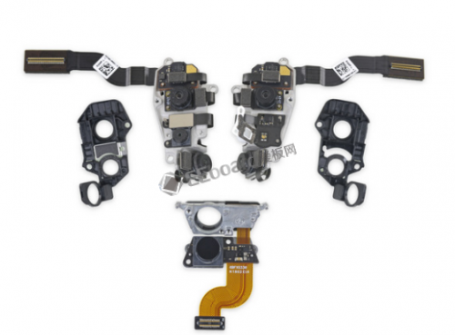](http://file.elecfans.com/web1/M00/93/CB/o4YBAFztIOuAAB3MAAKUpeIlnOo848.png)

 	[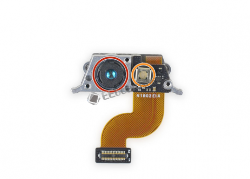](http://file.elecfans.com/web1/M00/94/23/pIYBAFztIQeAHgodAAKGhlBIIls252.png)

 	不再完美的摆放，我们就可以打开覆盖这传感器的盖子来仔细瞧瞧。

 	这些双生的传感器阵列在你的两个太阳穴边，配备了频闪红外深度传感器位于中间。

 	仔细观察了鼻梁上的深度传感器给了我们读取硬件信息的空间：

 	红外感知摄像头

 	红外点阵投影仪

 	这便不需要为这个设备甚至接收站，它可以自己完成投射和读取。

 	[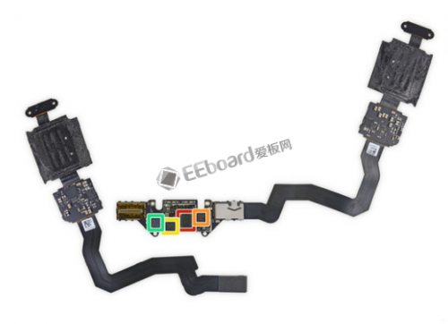](http://file.elecfans.com/web1/M00/94/23/pIYBAFztIQiAME0oAAJa0lwvY90356.png)

 	[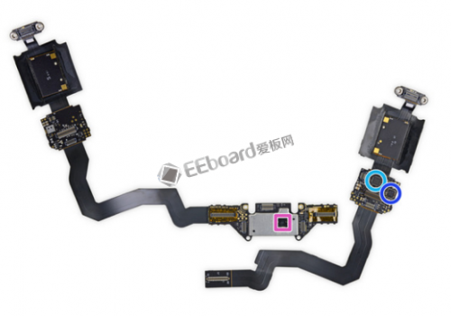](http://file.elecfans.com/web1/M00/94/23/pIYBAFztIQiAB0CpAAKKcE6QOkc249.png)

 	将所有的传感设备连接到头带上，我们得到了一个昂贵的分层柔性电缆：

 	Movidius MA2450Myriad 2 视觉处理单元

 	SlimPort ANX75304K DisplayPort 接收器

 	0V00680-B64G-1C 可能的相机组合芯片；我们在 Amazon Fire 手机上也找到了一个

 	[Altera](http://www.elecfans.com/tags/altera/)/[Intel](http://www.elecfans.com/tags/intel/) 10M08V81G - 8000 逻辑单元 [FPGA](http://www.elecfans.com/tags/fpga/)，可能用于胶合逻辑，或管理 MV 部件或摄像机桥数据

 	Parade Technologies 8713A 双向 USB 3.0 转接驱动器

 	[NXP](http://www.elecfans.com/tags/nxp/) 半导体 TFA9891 [音频](http://www.hqchip.com/app/790)[放大器](http://www.elecfans.com/tags/放大器/)

 	[德州仪器](http://www.elecfans.com/tags/ti/) [TI](http://www.elecfans.com/tags/ti/) 78CS9SI

 	[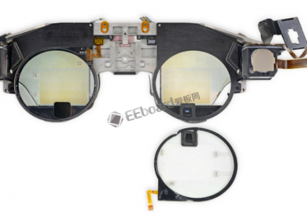](http://file.elecfans.com/web1/M00/93/CB/o4YBAFztIO2ALgyPAAMkmv1_bns849.png)

 	[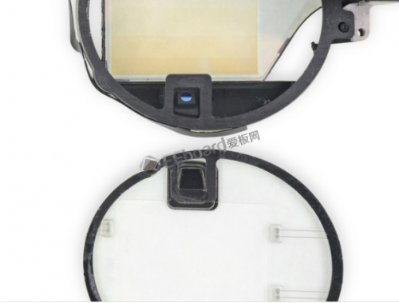](http://file.elecfans.com/web1/M00/94/23/pIYBAFztIQmAdpFXAAMeVdkjqo8706.png)

 	将红外发射器环弹出，我们发现难以发现的眼球跟踪红外摄像机隐藏在黑色[滤波器](http://m.elecfans.com/article/607027.html)后面。

 	这些似乎是OmniVision CameraCubeChip相机，带有外置二向色滤光片。

 	VR和AR中的眼球追踪允许一些非常酷的新界面选项，以及真实性和渲染效率的改进。

 	在眼睛下方仅有单个相机，这可能限制眼球跟踪的准确度和范围。 当用户向下看而不是向上看时，相机才能更好地观察眼睛/瞳孔。

 	[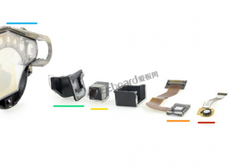](http://file.elecfans.com/web1/M00/93/CB/o4YBAFztIO6AS1JwAAJHYkdRhEI610.png)

 	

 	[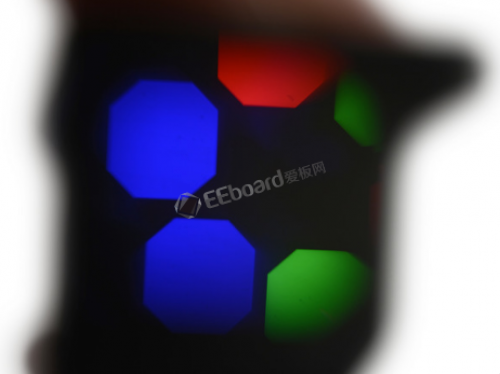](http://file.elecfans.com/web1/M00/93/CD/o4YBAFztITqAVwAHAALCciiOquU469.png)

 	现在事情变得有点破坏性了，但是为了看看光学链是值得的。

 	一个有六个 LED 的小圆环开始这次操作，分别是红绿蓝，为了两个焦平面配备了两套。

 	然后 LED 在 LCOS 微显示器上发光以产生图像，它安装在隔壁的黑色塑料外壳上。

 	从该外壳的内部，准直透镜对准来自 LED 的原始光输出，而且它安装在一个偏振分束器上。

 	然后，偏振光束通过一系列透镜，将图像聚焦到波导上的入射光栅上。

 	入射光栅本身看起来像嵌入六个波导中（现在略微破碎的）小点。

 	我们拿起“投影”单元进行仔细观察，发现了与每个入口光栅相关的颜色：两个红色，两个绿色和两个蓝色。

 	[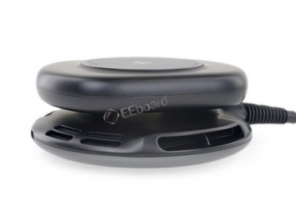](http://file.elecfans.com/web1/M00/93/CD/o4YBAFztITuAOk_aAAJDzGKZh8I881.png)

 	[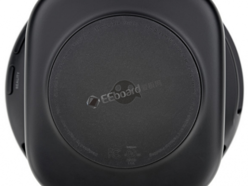](http://file.elecfans.com/web1/M00/94/25/pIYBAFztIVeAXBGDAALazjrxqBE195.png)

 	我们已经享受完光学大餐，是时候把我们的注意力转向这个装置的大脑—— Lightpack！

 	很难不去注意到这个突出的超酷通风口。这太小小的口袋 PC 有没有一个强劲的散热系统？我们马上就能知道。

 	这个 FCC 标记没有放弃自己，其他的就是——由 Magic Leap 设计，在墨西哥组装。事实上的硬件[制造](http://www.elecfans.com/xianshi/20171205594009.html)厂商的身份据说是一个被严格保密的秘密。

 	

 	[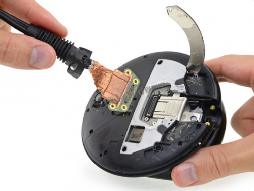](http://file.elecfans.com/web1/M00/93/CD/o4YBAFztITyATfoeAAP92t62yHo796.png)

 	[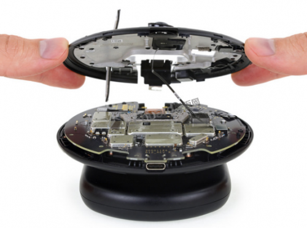](http://file.elecfans.com/web1/M00/94/25/pIYBAFztIViAfCEQAAOh78_x9mw707.png)

 	打开 Lightpack 费了很多事，但是热量和小心的撬动终于带来了成果。

 	大多数 VR 头戴设备似乎都要使用带有大量[电缆](http://www.hqchip.com/app/862)的 PC，但是这只有一条固定的线缆——被困在一个状态 LED 灯条下，还有几颗螺丝和一些铜带。

 	单根通向头戴设备的线缆似乎是为了一些优雅的人体工程学考虑，但是你要祈祷你的猫不要咬了这条生命线或你的设备别过时了。

 	另外还有一点点铸造的镁合金，然后我们看到了主板！

 	[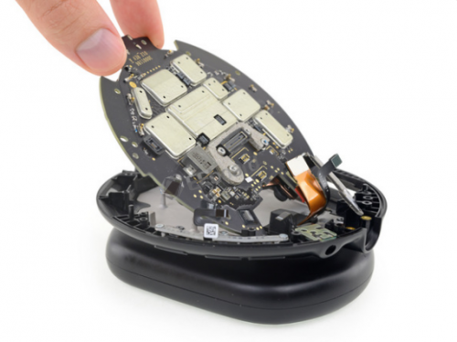](http://file.elecfans.com/web1/M00/93/CE/o4YBAFztIVuAMDIFAAN9I462qtA965.png)

 	[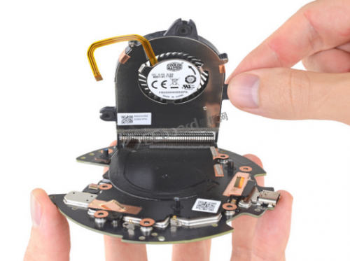](http://file.elecfans.com/web1/M00/93/CE/o4YBAFztIVyAf-6EAAQBSz1t1SI418.png)

 	[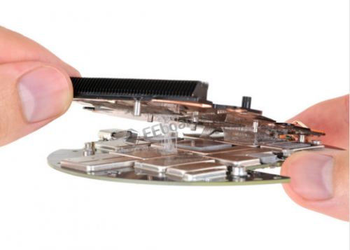](http://file.elecfans.com/web1/M00/93/CE/o4YBAFztIV2AXK1LAAMnWTOdoCw427.png)

 	我们忽略了[模块化](http://www.hqchip.com/app/1022)的耳机接口和按键面板，这有利于这片充满屏蔽罩的硅脂之地。

 	一个 PC 最爱的酷冷至尊风扇为这块 [PCB](https://data.hqchip.com:4006/t/yM) 添加了光彩，这解释了我们稍早前看到的那些通风口。

 	旋开螺丝并不足以让散热器自由，它非常固执的粘在原地。经过了10分钟的加热和撬动，它终于松了手。

 	这对于一个小型的穿戴设备来说是很大的散热量，但是考虑到它要做的工作就有道理了。这里有很多的散热硅脂，在这种情况下滚烫的派可不是件好事

 	[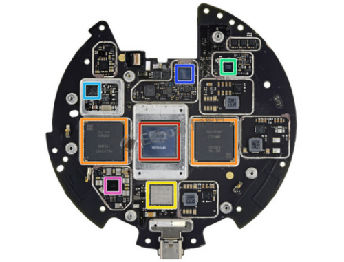](http://file.elecfans.com/web1/M00/94/26/pIYBAFztIXmACzbGAAQWqM6hjdQ486.png)

 	[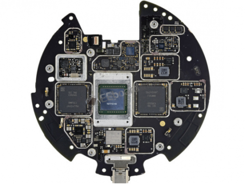](http://file.elecfans.com/web1/M00/94/26/pIYBAFztIXmAJkaHAAQnPc1w2Uw932.png)

 	在拆开了几个外壳之后，是时候看看让这魔法发生的芯片们了：

 	NVIDIA Tegra X2 “Parker” SoC，搭载了 NVIDIA PascalGPU

 	两个 Samsung K3RG[5G](http://www.elecfans.com/tags/5g/)50MM-FGCJ 32 Gb LPDDR4 [DRAM](http://www.elecfans.com/tags/dram/)（共 64 Gb 或 8 GB ）

 	Parade Technologies 8713A双向 USB 3.0转接驱动器

 	Nordic 半导体 N52832 [RF](http://www.hqchip.com/app/193) SoC

 	Renesas Electronics 9237HRZ 降压 - 升压电池充电器

 	Altera（[英特尔](http://www.elecfans.com/tags/英特尔/)拥有）10M08 MAX 10 现场可编程门阵列

 	Maxim Semiconductor MAX77620M [电源管理](http://www.hqchip.com/app/859)IC

 	[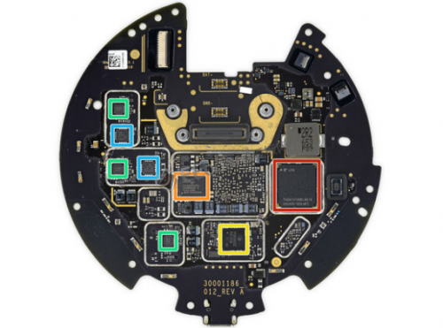](http://file.elecfans.com/web1/M00/94/26/pIYBAFztIXqAHZQtAAQbN8BVdAs790.png)

 	[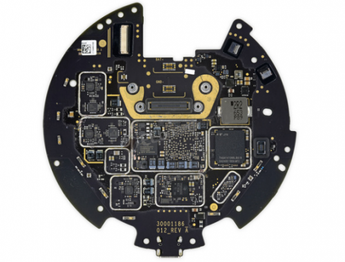](http://file.elecfans.com/web1/M00/93/CE/o4YBAFztIV-AW1bPAAQVPFh8jSM471.png)

 	背后还有更多的魔法：

 	[东芝](http://www.elecfans.com/tags/东芝/) THGAF4T0N[8L](https://data.hqchip.com:4006/t/8Qa)B[AI](http://www.elecfans.com/tags/ai/)R 128 GB NAND 通用闪存

 	Spansion （现为 [Cypress](http://www.elecfans.com/tags/cypress/)） FS128S 128 Mb 四路 S[PI](http://www.elecfans.com/tags/pi/) NOR 闪存

 	德州仪器 TPS65982 USB [Type-C](http://www.elecfans.com/tags/type-c/) 和 USB 供电控制器

 	uPI 半导体 uP1666Q 2相降压控制器

 	德州仪器 INA3221 双向电压监视器

 	[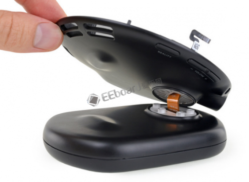](http://file.elecfans.com/web1/M00/94/26/pIYBAFztIXuAKS_mAAM5wOvPqc8240.png)

 	[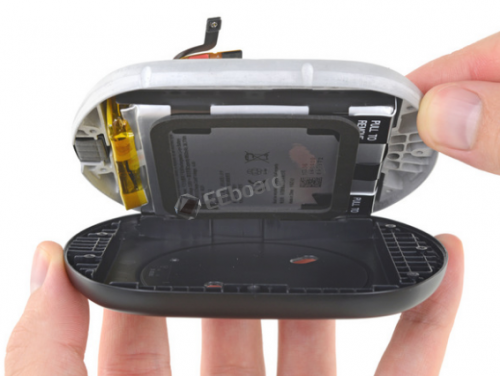](http://file.elecfans.com/web1/M00/93/CE/o4YBAFztIWCAQnS-AAPKK0SlHwU766.png)

 	[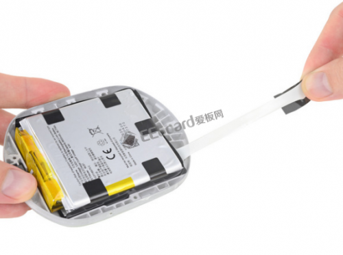](http://file.elecfans.com/web1/M00/93/CE/o4YBAFztIWCAKUmOAAMCoNIALtM424.png)

 	下一步，托盘被我们抬起，电池盒终于可以被一探究竟。

 	取下电池是如此艰难，以至于找到这个“拉可移除”的标签是多讽刺，但至少比没有好。

 	所有这些层和粘合剂可能有助于抗冲击和耐用性。但是当电池不可避免地老化时，你会寻找一个整机更换或一次艰难的维修——这可能是回收商需要面对的主要问题。

 	Magic Leap 采用了 36.77 Wh 的双电池三明治，工作在 3.83 V。这和一些流行的平板电脑一样。

 	[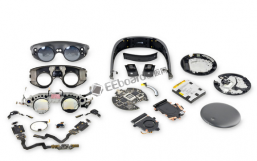](http://file.elecfans.com/web1/M00/94/26/pIYBAFztIXyAJsGfAALO3GtpA8U117.png)

 	Magic Leap One 显然是一款昂贵，短版的硬件。每一点结构都旨在保持设备寿命之内的精确校准。我们的猜测是这次全速推出，无论价格如何，都是为了在市场上获得一些东西。